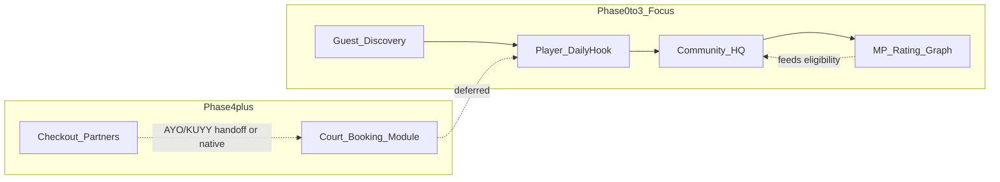

# Match Point vs AYO / KUYY / ILTL — Competitive Mockup Plan

> **Status:** Planned (mockup phase)  
> **Created:** 2026-07-10  
> **Scope:** Social-sport + community mockups first (Reclub-style); court booking deferred to Phase 4.  
> **Related:** [STRATEGY.md](STRATEGY.md) · [mockups/global-readiness.html](mockups/global-readiness.html) · [mockups/about.html](mockups/about.html)

## Executive verdict

**AYO is the strongest Indonesia all-in-one competitor** ([Padeleon venue page](https://ayo.app/v/padeleon#)): venue booking, payments (GoPay/VA/DP), reviews, sparring, pickup games (“Main Bareng”), leaderboards/badges, and venue-owner tools. **KUYY** leads on activity/class booking with skill-level filters and host ops. **ILTL** leads on structured amateur competition (Elo rating, player challenges, OOT availability, club performance points).

**Match Point already wins** on the graph moat competitors cannot easily copy:

| Capability | MP today | AYO | KUYY | ILTL |
|---|---|---|---|---|
| Portable MP Rating + bracket eligibility | Strong (`rank.js`) | Weak (gamified levels) | None | Tennis/padel Elo only |
| Cross-community BoC + ranked sparring | Strong | None | None | Clash of Squads only |
| Player Passport + endorsements | Strong | Basic profile/stats | None | Rating only |
| Community HQ + platform console | Strong | Venue mgmt only | Host tools | Club hub partial |
| Social feed / friends / passport share | Strong | Limited | Chat per activity | Minimal |
| Court booking + payments | Teaser only | **Market leader** | Strong (classes) | Rewards redemption |
| Open mabar / pickup discovery | **Gap** | Strong | Open match | Challenge flow |
| Player challenge + availability | **Gap** | Partial (sparring) | None | **Strong** |
| Club rewards / performance pts | **Gap** | None | None | **Strong** |
| Coaching / clinic activity types | **Gap** | Add-ons | **Strong** | Coaching rewards |

**Strategic stance:** Follow **Reclub** — community, events, social, and reputation first; **court booking is a much later phase** (integrate or build when the graph has density). Compete with AYO on *daily habit and fair play*, not on venue inventory yet.

---

## What to build in mockups (social + community gaps)

### P0 — Must ship to credibly compete on “social sport OS”

#### 1. Play Discovery Hub (closes AYO Main Bareng + KUYY open match + Reclub Discover)

- Extend Play tab beyond [`events-feed`](mockups/prototype.html) with segmented discovery:
  - **Events** (existing tournaments/formats)
  - **Open Mabar** (pickup games: public/private, slots open, bracket band, venue label — no checkout)
  - **Find Players** (MP Rating–matched suggestions at your bracket)
- New gallery screens + flow steps:
  - `open-mabar-board` — list with filters (sport, bracket, today/this week, distance)
  - `open-mabar-detail` — roster, host, skill band, “Join” / “Request slot”
  - `open-mabar-create` — host flow: format, max players, bracket gate, venue text field (not booking)
- New shared module: [`open-mabar.js`](mockups/open-mabar.js) (seed data, filters, eligibility via `MP_Rank.checkEligibility`)
- Wire: Daily Hook pulse card → open mabar; Play tab CTA; post-event path from live referee

#### 2. Player Challenge flow (closes ILTL “issue challenge”)

- New screens:
  - `player-challenge` — issue challenge from another player profile / leaderboard row
  - `challenge-inbox` — pending / accepted / declined (badge on avatar dropdown or messages)
- New shared module: [`player-challenge.js`](mockups/player-challenge.js)
- Connect to existing match submit flow: accepted challenge → pre-filled `submit-match` with opponent + proposed window
- i18n keys EN + ID; sync gallery ↔ [`flow/user.html`](mockups/flow/user.html)

#### 3. Player availability / OOT (closes ILTL OOT)

- Extend [`edit-profile`](mockups/prototype.html) or add `player-availability` screen:
  - Status: Available / Busy / Out of town (+ return date)
  - Surfaces on `player-other`, challenge flow, open mabar roster (“unavailable” chip)
- Small module: [`player-availability.js`](mockups/player-availability.js) (localStorage mock)

#### 4. Post-play social loop (closes Reclub Kudos gap using existing endorsements)

- After `match-approved`, add inline prompt: **“Endorse skill?”** → existing [`endorsement`](mockups/prototype.html) screen with opponent pre-selected
- Reinforces MP’s endorsement graph vs AYO’s generic badges

---

### P1 — Community depth (ILTL + KUYY parity without booking)

#### 5. Club Performance Points + rewards (ILTL Club Points)

- Extend [`community-detail`](mockups/prototype.html) with rewards panel:
  - Points earned from member leagues, wins, tournaments (demo counters)
  - Redeem catalog: coaching session, featured event slot, merch discount (mock — no payment)
- Module: [`club-rewards.js`](mockups/club-rewards.js); admin view tile in [`community-hq.js`](mockups/community-hq.js) (new `hq.modRewards` module, not “coming soon”)

#### 6. Activity taxonomy on events (KUYY class types)

- Extend events feed + registration with activity chips: **Tournament · League · Open Mabar · Coaching · Clinic · Social format**
- Filter bar on `events-feed`; wizard step 1 in [`event-wizard.js`](mockups/event-wizard.js) gets activity type picker (does not require new payment flow)
- Demo data: 1–2 coaching/clinic cards with level tags (Beginner → Advanced) like KUYY

#### 7. Reframe court booking as roadmap, not broken product

- Update [`court-booking`](mockups/prototype.html) + [`booking-confirm`](mockups/prototype.html) + [`booking-mock.js`](mockups/booking-mock.js):
  - Banner: **“Court booking — Phase 4”** with copy: organize play here now; book courts via partner integration later
  - CTA redirects: **Find Open Mabar** or **Browse community events** instead of implying checkout works
  - Keep slot UI as design reference only (AYO parity spec for when Phase 4 starts)
- Community HQ `hq.modBooking` stays `soon: true` but links to a **Booking Roadmap** callout screen (`booking-roadmap`) listing future AYO/KUYY-class features: venue directory, DP/checkout, reschedule policy, reviews

---

### P2 — Docs + competitive positioning (no new screens required)

#### 8. Add AYO to strategy docs (currently missing — only KUYY/ILTL in [`global-readiness.html`](mockups/global-readiness.html))

Update these sections in **both** [`about.html`](mockups/about.html) and [`global-readiness.html`](mockups/global-readiness.html):

| Section | Change |
|---|---|
| Competitive landscape table | Add **AYO (Indonesia)** row: strength = booking density + payments + sparring; weakness = no portable cross-community rank, weak bracket fairness, no BoC graph |
| Indonesia wedge | Position: **integrate booking later (Phase 4)**, win daily opens on graph + fair play now |
| Roadmap | Explicit **Reclub-style sequencing**: Phase 0–3 = social sport + communities + rank; Phase 4 = KUYY/AYO-class booking module |
| Our advantage | New row: **Play-to-rank loop** — discover mabar → verified match → MP Rating → bracket eligibility (AYO cannot close this loop) |
| Gaps table | Replace “booking payments P2” with clearer split: social gaps (this plan) vs booking (Phase 4) |

Also add one line in [`about.html`](mockups/about.html) competitive hint: AYO ≈ Booking + Sparring module (alongside existing KUYY / ILTL lines).

---

## Files to touch (implementation map)

| Area | Primary files |
|---|---|
| New screens (gallery) | [`prototype.html`](mockups/prototype.html) — 5–7 new `screen-*` blocks |
| Interactive twins | [`flow/user.html`](mockups/flow/user.html) — new steps; update [`flow/flow.js`](mockups/flow/flow.js) step index |
| Shared logic | `open-mabar.js`, `player-challenge.js`, `player-availability.js`, `club-rewards.js` (new) |
| Extend existing | [`event-wizard.js`](mockups/event-wizard.js), [`home-pulse.js`](mockups/home-pulse.js), [`booking-mock.js`](mockups/booking-mock.js), [`community-hq.js`](mockups/community-hq.js) |
| Styles | [`styles.css`](mockups/styles.css) — discovery tabs, mabar cards, challenge rows, rewards panel |
| i18n | [`i18n.js`](mockups/i18n.js) — all new copy EN + ID |
| Design notes | [`gallery-design-notes-data.js`](mockups/gallery-design-notes-data.js) for new screen anchors |
| Sync metadata | [`MOCKUP-SYNC.md`](mockups/MOCKUP-SYNC.md) — add screen map rows |
| Post-flow extract | Run `node docs/mockups/scripts/build-gallery-screens.js` after `flow/*.html` changes |
| Verify | `node docs/mockups/scripts/verify-gallery.js` |

---

## Sync checklist (mandatory per [MOCKUP-SYNC-RULE.md](mockups/MOCKUP-SYNC-RULE.md))

For every new/changed screen:

1. Twin in gallery **and** `flow/user.html` (guest subset where applicable)
2. Gallery nav: `data-goto`; flow: `data-flow-goto`
3. Same `data-*` hooks on both surfaces
4. i18n keys — no hard-coded strings
5. Design notes for gallery screens
6. Run verify + rebuild extract scripts

**High-risk twins to keep aligned:**

- `events-feed` ↔ Play tab step (add discovery segments)
- `home-dashboard` ↔ step 1 (new open mabar pulse card)
- `community-detail` ↔ community page step (rewards panel)
- `court-booking` ↔ steps 30–31 (roadmap reframe)
- `player-other` / `leaderboard` ↔ challenge entry points

---

## What we deliberately do NOT build now

- Venue directory, checkout, GoPay/Xendit, reschedule/refund policy UI (AYO Padeleon parity) — **document in Phase 4 spec only**
- Native payment split for pickup games — show “cost share (demo)” label only
- ILTL API import UI — mention in global-readiness integrations table (already planned Phase 1); no import wizard in this pass
- Expanding beyond 5 racket sports (AYO has 20+ cabor) — out of brand boundary per [STRATEGY.md](STRATEGY.md)

---

## Success criteria

After implementation, a stakeholder demo should show this story **without booking checkout**:

1. Guest browses Discovery Pulse → sees open mabar + public events
2. Player joins open mabar matched to their bracket → plays → submits result → MP Rating updates
3. Player issues challenge to leaderboard rival → opponent accepts → match flows to verification
4. Player sets OOT → hidden from challenge/mabar suggestions
5. Post-match endorsement prompt strengthens social proof
6. Community admin sees performance points + redemption catalog
7. “Book court” clearly states Phase 4 and routes to organize-play features
8. About + Global Readiness document AYO and the Reclub-style phased strategy

This positions Match Point as **KUYY + ILTL + AYO social/competition layers unified on one portable reputation graph** — competing on habit and trust today, booking when the graph earns it.

---

## Implementation checklist

- [x] Update `about.html` + `global-readiness.html`: add AYO to competitive landscape, Reclub-style phase sequencing, play-to-rank advantage, booking deferred to Phase 4
- [x] Build open-mabar board/detail/create screens + `open-mabar.js`; extend events-feed Play tab with Events | Open Mabar | Find Players segments; sync gallery + `flow/user.html`
- [x] Build player-challenge + challenge-inbox + availability UI with `player-challenge.js` and `player-availability.js`; wire to profile, leaderboard, and submit-match
- [x] Add post-match-approved endorsement prompt linking to existing endorsement screen
- [x] Add club-rewards panel on community-detail + HQ module; extend event-wizard/events-feed with KUYY-style activity type chips (coaching, clinic, open mabar)
- [x] Reframe court-booking/booking-confirm as Phase 4 roadmap teaser + booking-roadmap screen; update `booking-mock.js` CTAs to route to open mabar/events
- [x] i18n keys, `gallery-design-notes-data.js`, `MOCKUP-SYNC.md` screen map, `build-gallery-screens.js`, `verify-gallery.js`
