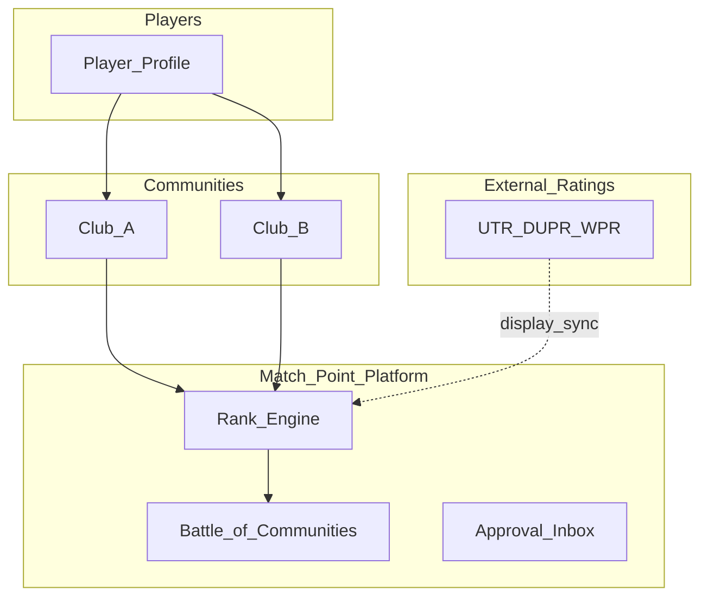
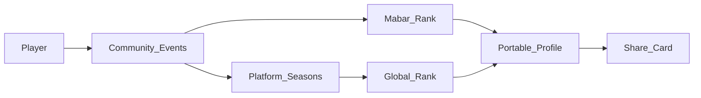
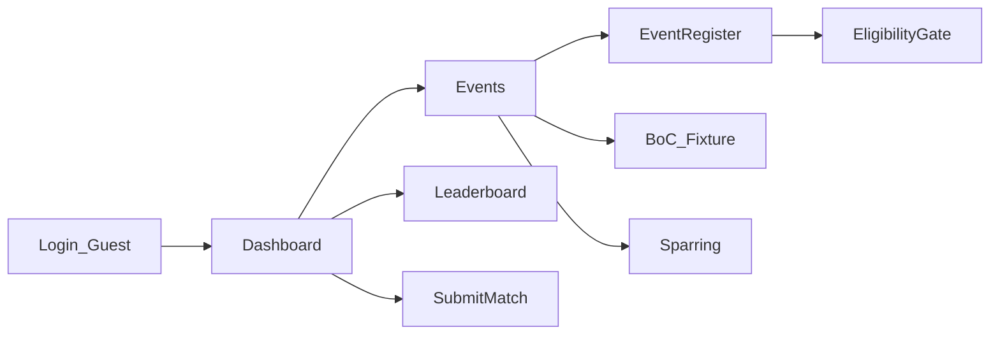
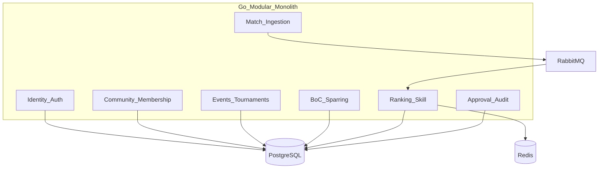

# Match Point — Architecture (Mockup-Validated)

| Field                | Value                                                                    |
| -------------------- | ------------------------------------------------------------------------ |
| **Version**          | 4.0.0                                                                    |
| **Status**           | Mockup-validated architecture                                            |
| **Mockup sync**      | v3.2.0 (`docs/mockups/docs-version.js`, 2026-07-06)                      |
| **Last updated**     | 2026-07-06                                                               |
| **Repository phase** | Interactive HTML/CSS/JS mockups complete; production backend not started |

## Document map

| Audience                   | Start here                                                                        |
| -------------------------- | --------------------------------------------------------------------------------- |
| Stakeholders / product     | §1–5, §17                                                                         |
| Designers / UX             | §5–9, §15                                                                         |
| Engineers (backend)        | §11–14, §18–21, Appendix A–B                                                      |
| Go-to-market / strategy    | [global-readiness.html](mockups/global-readiness.html) (password-gated)           |
| Execution tasks & timeline | [plan (9).md](<match-point-is-a-cross-community-player-reputation_plan%20(9).md>) |

**Hierarchy of truth**

1. **Implemented behavior** — `docs/mockups/` (flows, JS modules, styles)
2. **Public rules** — `docs/mockups/about.html`
3. **Strategy** — `docs/mockups/global-readiness.html`
4. **This document** — unified architecture translating mockups into buildable spec
5. **Plan doc** — when/how to build (not duplicated here)

---

## 1. Executive Summary

Match Point is a **cross-community player reputation and ranking platform** for **padel, tennis, and pickleball**. Most play happens outside official federations — recreational leagues, open play, and club events leave no portable record. Match Point fixes that with verified identity, match results, and rankings that travel with the player.

**Current state:** The product is fully expressed as **interactive HTML mockups** in `docs/mockups/` — player, club admin, and platform admin journeys, dual-track ranking, event engine, Battle of Communities (BoC), Community Sparring, visual identity, and product docs. **No production API or database exists yet.**

**Market:** Indonesia-first wedge (dense club culture, WhatsApp-native organizing) with **global product design** — portable reputation is not Indonesia-specific.

**Positioning:** Match Point complements UTR (tennis), DUPR (pickleball), and WPR (padel). It does not replace them. Our niche is **portable reputation across communities and informal play** — endorsements, community history, BoC, sparring, and club operations.

**Flagship differentiators (validated in mockups):**

- Dual rank: **Mabar** (within community) + **Global** (cross-community), per sport
- Multi-sport single identity with sport-aware UI
- **Battle of Communities** — platform-run seasonal inter-community competition
- **Community Sparring** — flexible 2–20 community format (casual or ranked)
- Glicko-lite skill display with sport-specific bands (WPR / UTR·NTRP / DUPR)
- Fair-play gates: eligibility, anti-sandbagging, disputes, audit trails

---

## 2. Problem Statement

### 2.1 The gap

| Source                                  | What it captures               | What it misses                                       |
| --------------------------------------- | ------------------------------ | ---------------------------------------------------- |
| **National federations**                | Sanctioned competition results | Recreational play, cross-club informal rank          |
| **Club apps (e.g. Reclub)**             | Single-club operations         | Portable reputation across clubs                     |
| **Booking apps (e.g. Playtomic)**       | Court utilization              | Long-term player identity and cross-community ladder |
| **Rating platforms (UTR, DUPR, WPR)**   | Skill measurement              | Community history, endorsements, inter-club rivalry  |
| **Social groups (WhatsApp, Instagram)** | Discovery and organizing       | Structured rank, audit, fair brackets                |

Players move between clubs, cities, and apps with **no unified reputation**. Communities struggle with sandbagging disputes and bracket fairness without portable skill context.

### 2.2 Global parallel

The same gap exists in Spain (padel), US (pickleball/tennis), UAE, and EU metros. Match Point architecture is **region-agnostic**; launch data and integrations are **Indonesia-first**. See [global-readiness.html](mockups/global-readiness.html) for expansion playbook.

### 2.3 Ecosystem (target state)



---

## 3. Solution Overview

### 3.1 Core concepts

| Concept          | Definition                                                                                      |
| ---------------- | ----------------------------------------------------------------------------------------------- |
| **Community**    | Club or group (open or invite-only), tied to one primary sport; players may belong to multiple  |
| **Mabar rank**   | Points and ladder position **within** a community; feeds from club events and weighted sparring |
| **Global rank**  | Cross-community standing **per sport**; feeds from tiered tournaments, BoC, ranked sparring     |
| **Skill rating** | Glicko-lite value (`skill`, `rd`, `reliability`) with sport-specific **display** bands          |
| **Endorsement**  | Peer vouching for skill dimensions; min 3 endorsers for public skill scores                     |
| **BoC**          | Platform-branded seasonal inter-community product with group draw and rubric scoring            |
| **Sparring**     | Club- or platform-created multi-community fixtures; casual (~40% rank weight) or ranked (~70%)  |

### 3.2 Solution flow



### 3.3 Explicit non-goals (v1)

- Primary court-booking marketplace (integrate Playtomic etc. instead)
- Replacement for official UTR/DUPR/WPR ratings (align display; link/import where APIs allow)
- TikTok-style content platform (share cards and match moments, not infinite video feed)

---

## 4. Stakeholders & Access Model

| Role               | Mockup surface          | Steps      | Key capabilities                                                                                   |
| ------------------ | ----------------------- | ---------- | -------------------------------------------------------------------------------------------------- |
| **Player**         | `flow/user.html`        | 27         | Login/guest, dashboard, communities, events, rank, submit match, endorsements, BoC/sparring detail |
| **Club admin**     | `flow/club.html`        | 12         | Event wizard, registrations, live referee, bracket, sparring create                                |
| **Platform admin** | `flow/platform.html`    | 19         | Approval inbox, analytics, global tournaments, BoC season                                          |
| **Guest**          | `user.html?guest=1`     | —          | Browse without auth; gated actions show login modal                                                |
| **Stakeholder**    | `prototype.html`        | 32 screens | Static gallery for visual review                                                                   |
| **Internal**       | `global-readiness.html` | —          | GTM, monetization, infra (password-gated)                                                          |

### 4.1 Role boundaries

- **Club admin** runs day-to-day community events and Mabar rank; cannot approve new communities platform-wide
- **Platform admin** approves communities, featured events, global tournaments; runs BoC; resolves cross-community disputes
- **Player** can belong to **multiple communities**; one home community on profile

---

## 5. Product Surfaces & Navigation

### 5.1 Entry points

| Surface           | File                    | Purpose                                                       |
| ----------------- | ----------------------- | ------------------------------------------------------------- |
| **Hub**           | `index.html`            | Links to gallery, flows, About, Global readiness; mascot trio |
| **Gallery**       | `prototype.html`        | 32 static screens; hash navigation via `app.js`               |
| **Flow picker**   | `flow/index.html`       | Role selection                                                |
| **Product docs**  | `about.html`            | Public rules, changelog                                       |
| **Strategy docs** | `global-readiness.html` | Internal GTM (gated)                                          |

### 5.2 Gallery vs Interactive Flow

| Aspect     | Gallery (`prototype.html`)         | Interactive Flow (`flow/*.html`)       |
| ---------- | ---------------------------------- | -------------------------------------- |
| Navigation | Sidebar hash; static jumps         | Step machine (`flow.js`); progress bar |
| State      | None (per-screen static)           | localStorage/sessionStorage            |
| Chrome     | Injected by `gallery-chrome.js`    | Injected by `flow.js`                  |
| Use case   | Visual catalog, stakeholder review | Clickable journeys, rule demos         |

### 5.3 App chrome levels (`flow.js` → `chromeLevel`)

| Level         | When                      | Header                                     | Section nav                |
| ------------- | ------------------------- | ------------------------------------------ | -------------------------- |
| **none**      | Login gates               | Minimal logo only                          | None                       |
| **full**      | Dashboard, lists, wizards | Notifications, mascot switch, profile menu | `mp-topnav` + `bottom-nav` |
| **slim**      | Setup, manual bracket     | Mascot switch only                         | None                       |
| **immersive** | Live referee              | Mascot switch only                         | None                       |

### 5.4 Cross-cutting UX (`device.js`)

- **Device preview:** mobile / tablet / desktop (`mp-device-*` body classes)
- **Theme:** light/dark (`MP_Theme`, `mp-dark`)
- **i18n:** Indonesian + English (`i18n.js`, `mp:lang`)
- **Feedback:** floating FAB (`feedback.js`) — WhatsApp + FormSubmit email

### 5.5 Deployment

- **GitHub Pages:** `.github/workflows/pages.yml` publishes `docs/mockups/`
- **Live:** `https://okfriansyah-moh.github.io/match-point/`

---

## 6. UI/UX Validated Design — Player Journey

**Source:** `flow/user.html` + `flow.js` step config (27 steps, indices 0–26).



| Step | ID                | Title (i18n key)             | Purpose                                                       | Key modules                                         |
| ---- | ----------------- | ---------------------------- | ------------------------------------------------------------- | --------------------------------------------------- |
| 0    | login             | `title.auth-login`           | Login gate, guest browse CTA, OAuth UI mock                   | `flow.js` auth                                      |
| 1    | dashboard         | `title.home-dashboard`       | Home: mascot strip, sport cards, community states, hero, feed | `mascot.js`, `sport.js`, `role.js`, `rank.js`       |
| 2    | create-club       | `title.create-club`          | Community creation → pending approval                         | `role.js`, `approval.js`                            |
| 3    | leaderboard       | `title.leaderboard`          | Mabar ladder; sport-scoped                                    | `rank.js`                                           |
| 4    | submit            | `title.submit-match`         | Match submission form                                         | —                                                   |
| 5    | approved          | `title.match-approved`       | Auto-approve success                                          | —                                                   |
| 6    | profile           | `title.profile`              | Dual rank, skill bands, endorsements, communities             | `rank.js`                                           |
| 7    | endorse           | `title.endorsement`          | Peer endorsement flow                                         | —                                                   |
| 8    | share             | `title.share-card`           | 600×600 shareable identity card                               | —                                                   |
| 9    | communities       | `title.communities`          | Multi-community list                                          | `community-data.js`                                 |
| 10   | events            | `title.events`               | Event feed; BoC/Sparring cards injected                       | `battle-of-communities.js`, `community-sparring.js` |
| 11   | americano         | `title.americano`            | Social format preview                                         | `tournament.js`                                     |
| 12   | mexicano          | `title.mexicano`             | Social format preview                                         | `tournament.js`                                     |
| 13   | tournament        | `title.tournament-bracket`   | Knockout bracket view                                         | `tournament.js`                                     |
| 14   | find-community    | `title.find-community`       | Discovery filters (sport, distance, access)                   | `community-data.js`                                 |
| 15   | community-page    | `title.community-page`       | Public spotlight, member feed, join CTA                       | `community-data.js`, `badges.js`                    |
| 16   | event-register    | `title.event-register`       | Registration + **eligibility panel**                          | `rank.js` `checkEligibility`                        |
| 17   | register          | `title.auth-register`        | Sign up                                                       | —                                                   |
| 18   | verify-otp        | `title.verify-otp`           | Phone OTP (mock)                                              | —                                                   |
| 19   | round-robin       | `format.roundRobin`          | RR format preview                                             | —                                                   |
| 20   | league            | `format.league`              | League season preview                                         | —                                                   |
| 21   | global-tournament | `title.global-tournament`    | Cross-community tournament discovery                          | `tournament.js`                                     |
| 22   | player-other      | `title.player-other`         | View another player's profile                                 | —                                                   |
| 23   | settings          | `title.edit-profile`         | Account, language, theme, logout, About links                 | `device.js`                                         |
| 24   | rank-snapshot     | `title.leaderboard-snapshot` | Monthly Global snapshot                                       | —                                                   |
| 25   | boc-detail        | `boc.fixtureDetail`          | Live rubric scoreboard, squad form, penalties                 | `MP_BoC`, `MP_InterCommunity`                       |
| 26   | sparring-detail   | `sparring.detailTitle`       | Multi-community standings, fixtures                           | `MP_InterCommunity`                                 |

### 6.1 Dashboard states (step 1)

| State         | Trigger                  | UI                                 |
| ------------- | ------------------------ | ---------------------------------- |
| Guest         | `?guest=1` or not authed | Guest banner, locked auth actions  |
| No community  | `role.js` status `none`  | Create/find community CTA          |
| Pending       | status `pending`         | Approval track UI                  |
| Active member | status `active`          | Community chip, stats, sport cards |
| Rejected      | status `rejected`        | Resubmit flow                      |

### 6.2 Navigation (player)

**Top/bottom nav items:** Home · Rank · Play · Events · Community (`flow.js` `NAV_ITEMS`). Profile lives in avatar dropdown on all devices.

---

## 7. UI/UX Validated Design — Club Admin

**Source:** `flow/club.html` (12 steps).

| Step | Title key                   | Purpose                                                                           |
| ---- | --------------------------- | --------------------------------------------------------------------------------- |
| 0    | `title.club-admin`          | Dashboard overlay on community page: stats, create event, sparring, registrations |
| 1    | `wizard.step1Title`         | Event type: Americano, Mexicano, Singles, Doubles                                 |
| 2    | `wizard.step2Title`         | Division (competitive): Men's / Women's / Mixed                                   |
| 3    | `wizard.step3Title`         | Participants: 8–64 presets                                                        |
| 4    | `wizard.step4Title`         | Structure: RR variants, group→KO, league                                          |
| 5    | `wizard.rosterTitle`        | Optional admin roster (community/external/guest players)                          |
| 6    | `title.admin-publish-event` | Review & publish: scoring mode, capacity                                          |
| 7    | `title.admin-registrations` | Bidirectional registration, waitlist, close → live                                |
| 8    | `referee.setupTitle`        | Session setup: courts, players, duration                                          |
| 9    | `title.admin-live-session`  | Live referee: courts/score/standings, share link                                  |
| 10   | `title.admin-bracket`       | Manual bracket score entry                                                        |
| 11   | `sparring.createTitle`      | Community Sparring create (2+ communities)                                        |

### 7.1 Event wizard branching (`event-wizard.js`)

```
Type (social vs competitive)
  ├─ Americano/Mexicano → skip division → participants → structure → roster → publish
  └─ Singles/Doubles → division → participants → structure → roster → publish
```

**Roster sources:** in-community, external (Global rank), guest walk-in names (`PLAYER_DIR` demo directory).

**Finalize:** Updates Mabar rank via `MP_Rank.finalizeEvent` when live session completes.

---

## 8. UI/UX Validated Design — Platform Admin

**Source:** `flow/platform.html` (19 steps).

| Step  | Title key                  | Purpose                                                      |
| ----- | -------------------------- | ------------------------------------------------------------ |
| 0     | `title.auth-login`         | Admin login gate                                             |
| 1     | `title.admin`              | Overview KPIs, quick actions                                 |
| 2     | `title.approval-inbox`     | Filterable/paginated queue                                   |
| 3–4   | approval detail/result     | Community, featured event, global tournament, dispute review |
| 5     | `title.admin-pending`      | GPS-fail matches, disputes                                   |
| 6     | `platform.navAnalytics`    | Analytics dashboard                                          |
| 7–12  | wizard steps               | Global tournament wizard (same 6 steps as club + Tier 1–3)   |
| 13    | `platform.globalRegTitle`  | Cross-community registration                                 |
| 14    | `platform.globalLiveTitle` | Global live session + finalize Global rank                   |
| 15–16 | profile/account            | Admin profile, settings                                      |
| 17    | `boc.title`                | BoC season wizard: groups, draw, rubric                      |
| 18    | `boc.fixturesTitle`        | Fixture list, squad tracking                                 |

**Platform nav:** Home · Inbox · Matches · Analytics (custom `navItems` in `flow.js` init).

### 8.1 Analytics KPIs (`platform-analytics.js`)

- Active players, communities, matches (7d/30d)
- Match status mix (verified, pending, disputed)
- Sport split (padel/tennis/pickleball)
- Event format counts
- Onboarding funnel
- Rank movements, live activity feed

---

## 9. Gallery Screen Catalog

**Source:** `prototype.html` — 32 screens via `app.js` `screenIds`.

| Nav group               | Screen IDs                                                                                           |
| ----------------------- | ---------------------------------------------------------------------------------------------------- |
| **Sign In**             | `auth-login`, `auth-register`, `home-dashboard`                                                      |
| **Player**              | `profile`, `profile-provisional`, `profile-endorse-empty`, `edit-profile`                            |
| **Community**           | `communities`, `community-create`, `community-detail`, `community-members`, `admin-transfer`         |
| **Ranking**             | `leaderboard`, `leaderboard-official`, `leaderboard-snapshot`                                        |
| **Matches**             | `submit-match`, `match-approved`, `match-pending`, `match-duplicate`, `match-disputed`, `my-matches` |
| **Tournament & Social** | `tournament`, `tournament-create`, `tournament-bracket`, `endorsement`, `share-card`                 |
| **Admin**               | `admin`, `admin-community`, `admin-pending`, `admin-dispute`, `admin-adjustment`                     |
| **Edge cases**          | `errors` — flooding, endorser thresholds, decay, ranking island                                      |

**Note:** Gallery uses `gallery-chrome.js` to inject flow-aligned header (mascot switch, `mp-topnav`, bottom nav). Navigation between screens remains static hash links.

---

## 10. Multi-Sport Model

**Source:** `sport.js`, `mascot.js`, `flow.js`.

### 10.1 Sports

| Sport        | Icon | Mascot | Accent color     |
| ------------ | ---- | ------ | ---------------- |
| Padel        | 🏓   | Pipo   | Blue `#277da1`   |
| Tennis       | 🎾   | Tenni  | Green `#2d6a4f`  |
| Pickleball   | 🥎   | Dink   | Red `#c1443c`    |
| Badminton    | 🏸   | Smash  | Amber `#d97706`  |
| Table tennis | 🏓   | Spin   | Orange `#ea580c` |

### 10.2 Sport switching

- **Header mascot button** (`mp-mascot-switch`) cycles padel → tennis → pickleball on tap
- **Sport cards** on dashboard (`sport-btn`) select sport directly
- **Event:** `mp:sport` → updates `body[data-sport]`, `.sport-dynamic` elements, mascot image/ring

### 10.3 `sport-dynamic` pattern

```html
<span
  class="sport-dynamic"
  data-padel="Padel Jakarta Selatan"
  data-tennis="Jakarta Tennis Community"
  data-pickleball="Belum ada komunitas pickleball"
  >...</span
>
```

`MP_Sport.apply()` sets `textContent` from `dataset[currentSport]`.

---

## 11. Ranking & Fair Play

**Source:** `rank.js`, `about.html`, gallery `errors` screen.

### 11.0 Three-layer model (per sport)

| Layer                  | User-facing name             | Purpose                                                       |
| ---------------------- | ---------------------------- | ------------------------------------------------------------- |
| **1 — MP Rating**      | MP Rating / Rating MP        | Glicko-2 trusted skill — brackets, seeding, anti-sandbagging  |
| **2 — MP Ladder**      | Mabar pts / Global pts       | Club leaderboard & cross-community prestige — starts at **0** |
| **3 — Reference hint** | `≈ WPR` / `≈ UTR` / `≈ DUPR` | Optional orientation — derived from MP Rating, never the gate |

**Signup:** unrated until first verified match (`skill: null`, `matches: 0`). MP does **not** import federation ratings.

**Single pipeline:** `processMatchResult()` → Glicko update (MP Rating) → derive ladder delta → Mabar or Global pts.

### 11.0.1 Cross-sport backbone

One engine, `SPORT_PROFILES` registry (`padel`, `tennis`, `pickleball` live; `badminton`, `table_tennis` stubbed). Same bracket class names everywhere; per-sport MP Rating scale calibration only. Ratings do not transfer between sports.

### 11.1 Dual ledger (per sport)

| Track      | Storage fields         | Scope            |
| ---------- | ---------------------- | ---------------- |
| **Mabar**  | `mabar`, `mabarRank`   | Within community |
| **Global** | `global`, `globalRank` | Cross-community  |

Persisted in `localStorage` key `mp-ranks`. Production: PostgreSQL `player_sport_rank` per sport.

### 11.2 MP Rating (Glicko-lite)

| Field                   | Meaning                                 |
| ----------------------- | --------------------------------------- |
| `skill`                 | MP Rating value (sport-scaled Glicko μ) |
| `rd`                    | Rating deviation (uncertainty)          |
| `reliability`           | % from verified match ratio             |
| `verifiedMatches`       | Organizer-verified result count         |
| `matches`               | Total rated matches                     |
| `calibrationScope`      | `club_local` \| `cross_community`       |
| `crossCommunityMatches` | Verified matches vs other communities   |
| `opponentDiversityPct`  | % of matches outside home community     |

**Lifecycle:**

| State       | Condition                          | UI                      |
| ----------- | ---------------------------------- | ----------------------- |
| Unrated     | `skill == null && matches === 0`   | Belum dinilai / Unrated |
| Provisional | `matches < 5` or reliability < 60% | MP Rating X.XX (est.)   |
| Stable      | 5+ matches, reliability ≥ 60%      | MP Rating X.XX ✓        |

**K-factor** (`kFactor(rd, matches)`): 32 if `matches < 5` or `rd > 80`; 24 if `rd > 50`; else 16. Anchor boost ×1.5 on first cross-community opponent.

**Ladder delta:** `round(K × weight × (score − expected) × 0.8)` — not flat +15.

### 11.3 Reference hints (`SPORT_PROFILES`)

| Sport        | MP Rating scale | Reference hint | Status          |
| ------------ | --------------- | -------------- | --------------- |
| Padel        | 0 – 21          | ≈ WPR          | Live            |
| Tennis       | 1.0 – 16.5      | ≈ UTR          | Live            |
| Pickleball   | 2 – 8           | ≈ DUPR         | Live            |
| Badminton    | TBD             | TBD            | Live (MP scale) |
| Table tennis | TBD             | TBD            | Live (MP scale) |

### 11.4 Event rank weights (`finalizeEvent` / `processMatchResult`)

| Event type                    | Weight                                   |
| ----------------------------- | ---------------------------------------- |
| BoC (`battle_of_communities`) | 100% (`rankWeight: 1`)                   |
| Sparring ranked               | 70% (`rankWeight: 0.7`)                  |
| Sparring casual               | 40% (`rankWeight: 0.4`)                  |
| Global tournament Tier 1/2/3  | Tier multiplier ×3/×2/×1 on Global delta |

### 11.5 Eligibility (`checkEligibility`)

| Rule                 | Parameter               | Behavior                                              |
| -------------------- | ----------------------- | ----------------------------------------------------- |
| Bracket ceiling      | `maxMpRating`           | Block if MP Rating > max and `allowPlayDown` false    |
| Bracket floor        | `minMpRating`           | Block if MP Rating < min                              |
| Unrated gate         | —                       | Block classified brackets until 1+ verified match     |
| Provisional gate     | `requireStable`         | Block Intermediate+ for provisional players           |
| Cross-community gate | `requireCrossCommunity` | Global/inter-club Intermediate+ needs `Lintas klub ✓` |
| Elite verified gate  | `minVerified: 20`       | Elite bracket requires 20+ verified matches           |

Demo on event-register: Beginner bracket, tennis `maxMpRating: 3.49`.

### 11.6 MP Bracket Classes

Universal labels: Open / Beginner / Intermediate / Advanced / Elite (ID: Terbuka / Pemula / Menengah / Mahir / Atlet). Each maps to `minMpRating`–`maxMpRating` per sport in `BRACKET_CLASSES` (`rank.js`). See §12.4.

### 11.7 Cross-community calibration (Club A vs Club B)

| Scope             | Badge         | Fair for                          |
| ----------------- | ------------- | --------------------------------- |
| `club_local`      | Klub / Club   | Same-club brackets, Mabar board   |
| `cross_community` | Lintas klub ✓ | Global tournaments, BoC, sparring |

Upgrade to `cross_community` when `crossCommunityMatches ≥ 3` and `opponentDiversityPct ≥ 20%`. Before clubs meet, MP Rating 4.0 at Club A is **not** promised equal to 4.0 at Club B. Glicko expected-outcome adjusts both when they play.

### 11.8 Endorsements & edge policies (gallery `errors`)

| Rule                           | Value                                       |
| ------------------------------ | ------------------------------------------- |
| Min endorsers for public skill | 3                                           |
| Endorser must have             | ≥10 matches                                 |
| Duplicate endorsement cooldown | 30 days                                     |
| Rank decay (inactive)          | 0.5%/day after 90 days, floor 10% peak      |
| Match flooding                 | >5 matches/hour → manual review             |
| Closed community               | Visibility penalty, no Open Community badge |

---

## 12. Events & Tournament Engine

**Source:** `tournament.js`, `event-wizard.js`.

### 12.1 Format matrix

| ID               | Label              | Default scoring |
| ---------------- | ------------------ | --------------- |
| `americano`      | Americano          | Race to N       |
| `mexicano`       | Mexicano           | Race to N       |
| `single_elim`    | Single elimination | Sets            |
| `double_elim`    | Double elimination | Sets            |
| `round_robin`    | Round Robin        | Sets            |
| `group_knockout` | Group → Knockout   | Sets            |
| `league`         | League             | Sets            |
| `box_league`     | Box League         | Sets            |

**Scoring modes:** `race_to_n`, `normal_sets`, `best_of_n`, `single_set`, `super_tiebreak`

**RR variants:** full, pools, timed (`event-wizard.js` `RR_VARIANTS`)

### 12.2 Event scope & rank target

| Field        | Values                                             |
| ------------ | -------------------------------------------------- |
| `scope`      | `community`, `global`, `inter_community`           |
| `rankTarget` | `mabar` (default club), `global` (when `tier` set) |
| `tier`       | 1, 2, 3 (global tournaments)                       |

### 12.3 Mock vs production

| Aspect      | Mock (`tournament.js`)       | Production                           |
| ----------- | ---------------------------- | ------------------------------------ |
| Storage     | `localStorage` `mp-event`    | PostgreSQL + event service           |
| Scheduling  | Client-side round generation | Server-authoritative draws           |
| Concurrency | Single browser tab           | Distributed locks, idempotent writes |
| Integrity   | Demo players seeded          | Verified participant IDs             |

### 12.4 Tournament bracket classes

Bracket assignment uses **MP Rating** (not Mabar/Global pts). Universal class names; per-sport MP Rating ranges in `BRACKET_CLASSES` (`rank.js`).

| MP Class     | EN           | ID       | Tennis MP Rating | Padel MP Rating | Pickleball MP Rating |
| ------------ | ------------ | -------- | ---------------- | --------------- | -------------------- |
| Open         | Open         | Terbuka  | Any rated        | Any rated       | Any rated            |
| Beginner     | Beginner     | Pemula   | 1.0 – 3.49       | 2.5 – 4.0       | 2.0 – 3.0            |
| Intermediate | Intermediate | Menengah | 3.5 – 5.49       | 4.0 – 6.0       | 3.0 – 4.0            |
| Advanced     | Advanced     | Mahir    | 5.5 – 7.49       | 6.0 – 8.0       | 4.0 – 5.0            |
| Elite        | Elite        | Atlet    | ≥ 7.5            | ≥ 8.0           | ≥ 5.0                |

**Bracket Class** = who can register (MP Rating gate). **Global Tier 1/2/3** = how much Global ladder pts the winner earns.

Event card copy: `Beginner · MP Rating 2.5 – 4.0` (+ optional `≈ WPR` reference hint).

---

## 13. Inter-Community Products

### 13.1 Battle of Communities (BoC)

**Source:** `battle-of-communities.js` (`MP_BoC`), `about.html`.

| Aspect         | Rule                                                     |
| -------------- | -------------------------------------------------------- |
| Operator       | Platform admin only                                      |
| Branding       | Match Point native (no third-party co-brand)             |
| `eventType`    | `battle_of_communities`                                  |
| Scale          | 10–100+ communities; group draw → RR → knockout (design) |
| Games per set  | 8 (configurable `gamesPerSet`)                           |
| Squad deadline | 3 days before fixture (`squadDeadlineDays`)              |
| Late penalty   | −1 game per set (`gameDeficit`, default 1 of 8)          |
| Rank weight    | 100% Mabar fixture delta                                 |

**Group draw (`runDraw`):**

- Input: community IDs, `groupCount`, optional `seed`
- Process: seeded Fisher–Yates shuffle → groups A…J
- Audit: `{ method, groupCount, perGroup, groups, audit: { at, by, seed } }`
- Storage: `localStorage` `mp-boc-season`

**Fixture state machine:**

```
scheduled → squads_locked → live → completed
```

`squads_locked` when both communities submit squads (`submitSquad`).

**Rubric** (`MP_InterCommunity.defaultRubric`):

| Template           | Slots                                             |
| ------------------ | ------------------------------------------------- |
| `3d_1s`            | 3 doubles (1 wp each) + 1 singles (1 wp)          |
| `king_queen_3d_1s` | 2 doubles + King/Queen doubles (2 wp) + 1 singles |

Win condition: most war points across rubbers.

### 13.2 Community Sparring

**Source:** `community-sparring.js` (`MP_InterCommunity`).

| Aspect         | Casual                 | Ranked                        |
| -------------- | ---------------------- | ----------------------------- |
| `sparringMode` | `casual`               | `ranked`                      |
| Rubric         | Light lineup           | Full rubric + squad deadlines |
| Penalties      | None                   | −1 game if late (ranked)      |
| `rankWeight`   | 0.4                    | 0.7                           |
| Operator       | Club or platform admin | Club or platform admin        |

- **Scale:** 2–20 communities
- **Formats:** round-robin fixtures, knockout mini-bracket
- Storage: `localStorage` `mp-sparring-events`

---

## 14. Trust, Approval & Audit

### 14.1 Community lifecycle (`role.js`)

```
none → pending → active | rejected
```

| Status     | `data-show-if-*`                               |
| ---------- | ---------------------------------------------- |
| `none`     | `data-show-if-no-club`                         |
| `pending`  | `data-show-if-club-pending`                    |
| `active`   | `data-show-if-club`, `data-show-if-club-admin` |
| `rejected` | `data-show-if-club-rejected`                   |

Storage: `localStorage` `mp-club`. Multi-community via `communities[]` array.

### 14.2 Platform approval (`approval.js`, `platform-lists.js`)

**Inbox item types:**

- Community create
- Featured event
- Global tournament
- Match dispute / GPS failure

**Flows:** `platform-approval-flow.js` — unified review UI with approve/reject and audit note concept.

### 14.3 Match trust pipeline

| State         | Screen            | Trigger                             |
| ------------- | ----------------- | ----------------------------------- |
| Auto-approved | `match-approved`  | Organizer submit, passes validation |
| GPS pending   | `match-pending`   | Venue proximity fail                |
| Duplicate     | `match-duplicate` | Duplicate detection                 |
| Disputed      | `match-disputed`  | Player challenge                    |

**Production:** GPS validation within ~50m of venue; QR bypass for club events; immutable audit log on admin overrides.

### 14.4 BoC audit trail

Draw audit persisted: `seed`, ISO `at`, operator `by`. Squad submissions timestamped per community per fixture.

---

## 15. Visual Identity & Brand

### 15.1 Badges (`badges.js`)

| Class                   | Use                           |
| ----------------------- | ----------------------------- |
| `badge-boc`             | Battle of Communities fixture |
| `badge-group`           | BoC group stage               |
| `badge-boc-champion`    | Season champion               |
| `badge-sparring`        | Community Sparring            |
| `badge-sparring-ranked` | Ranked sparring               |
| `badge-sparring-victor` | Sparring winner               |
| `badge-top10`           | Leaderboard rows 1–10         |
| `crest-mp-ring`         | Community crest shield motif  |

Max 3 badges on cards. Squad status: green ✓ on-time; red **−1** late penalty badge.

### 15.2 Mascots (`mascot.js`, `assets/mascot/`)

| Character | Sport      | File                  | Color  |
| --------- | ---------- | --------------------- | ------ |
| Pipo      | Padel      | `pipo-padel.svg`      | Blue   |
| Tenni     | Tennis     | `tenni-tennis.svg`    | Green  |
| Dink      | Pickleball | `dink-pickleball.svg` | Red    |
| Rally     | Brand      | `rally.svg`           | MP red |

- **Trio** on hub and About (`data-mascot-trio`)
- **Header switcher** on all flow chrome (`data-mascot-switch`, `data-mascot-sport="auto"`)
- **Dashboard strip** "Ready to play?" with auto-updating buddy

---

## 16. Cross-Cutting UX Infrastructure

### 16.1 Internationalization (`i18n.js`)

- Languages: **id** (default), **en**
- ~1600+ string keys; `data-i18n` DOM binding
- Event: `mp:lang` → re-apply all strings
- **Localization note:** "Mabar" is Indonesian community-rank slang; global markets may localize label (see global-readiness)

### 16.2 Feedback (`feedback.js`)

| Channel  | Destination                                                 |
| -------- | ----------------------------------------------------------- |
| WhatsApp | `6285694390095` with structured context                     |
| Email    | FormSubmit → `rufusrolla@gmail.com` (per-domain activation) |

Context captured: URL, flow step, device, lang, theme, user agent. **Not stored** on demo site.

### 16.3 Mock persistence map

| Key                                | Storage        | Module              |
| ---------------------------------- | -------------- | ------------------- |
| `mp-auth`                          | localStorage   | `flow.js`           |
| `mp-club`                          | localStorage   | `role.js`           |
| `mp-ranks`                         | localStorage   | `rank.js`           |
| `mp-event`                         | localStorage   | `tournament.js`     |
| `mp-event-wizard`                  | sessionStorage | `event-wizard.js`   |
| `mp-boc-season`                    | localStorage   | `MP_BoC`            |
| `mp-sparring-events`               | localStorage   | `MP_InterCommunity` |
| `mp-approvals`                     | localStorage   | `approval.js`       |
| `mp-sport`                         | localStorage   | `sport.js`          |
| `mp-lang`, `mp-theme`, `mp-device` | localStorage   | `i18n`, `device.js` |

---

## 17. Scope — Mockup Phase vs Production v1

### 17.1 Delivered in mockups (v3.2.0)

| Area                                  | Evidence                                     |
| ------------------------------------- | -------------------------------------------- |
| Player journey (27 steps)             | `flow/user.html`                             |
| Club admin (12 steps)                 | `flow/club.html`                             |
| Platform admin (19 steps)             | `flow/platform.html`                         |
| Gallery (32 screens)                  | `prototype.html`                             |
| Dual rank + Glicko-lite               | `rank.js`                                    |
| Multi-sport (padel/tennis/pickleball) | `sport.js`                                   |
| Event wizard + 7 formats              | `event-wizard.js`, `tournament.js`           |
| Live referee                          | `live-referee.js`                            |
| BoC season + draw + squads            | `battle-of-communities.js`                   |
| Community Sparring                    | `community-sparring.js`                      |
| Platform inbox + analytics            | `platform-lists.js`, `platform-analytics.js` |
| Badges, crests, mascots               | `badges.js`, `mascot.js`                     |
| i18n ID/EN                            | `i18n.js`                                    |
| Device preview + dark mode            | `device.js`                                  |
| Feedback widget                       | `feedback.js`                                |
| Product docs + changelog              | `about.html`, `docs-version.js`              |
| Global readiness strategy             | `global-readiness.html`                      |
| Gallery chrome alignment              | `gallery-chrome.js`                          |

### 17.2 Production v1 (not built)

| Capability                                | Priority            |
| ----------------------------------------- | ------------------- |
| Go API + PostgreSQL                       | P0                  |
| Real auth (OAuth, phone OTP, JWT)         | P0                  |
| Server-side ranking engine                | P0                  |
| Payments (Community Pro SaaS, event fees) | P0 for monetization |
| Push notifications                        | P1                  |
| Native mobile apps / PWA                  | P1                  |
| GDPR/PDPA compliance flows                | P1 before EU        |
| Playtomic / UTR / DUPR integrations       | P1.5                |

### 17.3 Changelog (mockup releases)

| Version | Date       | Highlights                                                 |
| ------- | ---------- | ---------------------------------------------------------- |
| 3.2.0   | 2026-07-06 | Per-sport mascots, global readiness doc, gallery chrome    |
| 3.1.0   | 2026-07-06 | BoC, Sparring, Glicko-lite, badges, feedback, About        |
| 3.0.0   | 2026-06-01 | Interactive flows, dual rank, event wizard, platform inbox |

---

## 18. Application Architecture

### 18.1 Consolidated stack (ARCH-001–011 merged)

| Layer        | Choice                                    | Rationale                                        |
| ------------ | ----------------------------------------- | ------------------------------------------------ |
| **API**      | Go modular monolith                       | Single deploy; clear internal module boundaries  |
| **Database** | PostgreSQL                                | Transactions, rank snapshots, audit              |
| **Cache**    | Redis                                     | Leaderboards, sessions, rate limits              |
| **Queue**    | RabbitMQ                                  | Async rank recompute, match validation           |
| **Frontend** | TBD (SSR recommended for public profiles) | Mockups are static HTML reference implementation |
| **CDN**      | Cloudflare                                | Global edge for share cards and assets           |
| **Hosting**  | K8s or managed (Fly.io → GKE)             | Scale on queue depth and API latency             |

**Rejected alternatives (not in scope):** Kafka event bus, NATS microservices, GraphQL gateway, WebSocket reputation stream — none validated in mockups.

### 18.2 Module boundaries



| Module             | Responsibility                   | Mock counterpart                                      |
| ------------------ | -------------------------------- | ----------------------------------------------------- |
| **Identity**       | Auth, profile, OTP               | `flow.js` auth, `verify-otp` step                     |
| **Community**      | CRUD, membership, roles          | `role.js`, `community-data.js`                        |
| **Events**         | Wizard, scheduling, live scoring | `tournament.js`, `event-wizard.js`, `live-referee.js` |
| **InterCommunity** | BoC, Sparring, rubric            | `MP_BoC`, `MP_InterCommunity`                         |
| **Ranking**        | Mabar, Global, Glicko-lite       | `rank.js`                                             |
| **Approval**       | Inbox, disputes                  | `approval.js`, `platform-*`                           |
| **Ingest**         | Match submit, GPS, duplicate     | submit-match flows                                    |

---

## 19. Data Model

### 19.1 Core entities

| Entity            | Key fields                              | Mock storage             |
| ----------------- | --------------------------------------- | ------------------------ |
| **Player**        | id, username, phone, locale             | `mp-auth` (boolean mock) |
| **Community**     | id, name, sport, access, status         | `mp-club`                |
| **Membership**    | player_id, community_id, role           | `mp-club.communities[]`  |
| **Match**         | id, sport, participants, scores, status | static screens           |
| **Event**         | id, format, scope, rankTarget, tier     | `mp-event`               |
| **BoCSeason**     | id, draw, fixtures, squads              | `mp-boc-season`          |
| **SparringEvent** | id, mode, communities, fixtures         | `mp-sparring-events`     |
| **Approval**      | id, type, status, audit                 | `mp-approvals`           |
| **RankSnapshot**  | player_id, sport, mabar, global, month  | `mp-ranks`               |
| **Endorsement**   | endorser, endorsee, skill_tag           | profile screens          |

### 19.2 Production schema sketch (players)

```sql
CREATE TABLE players (
  id            UUID PRIMARY KEY,
  username      TEXT UNIQUE NOT NULL,  -- globally unique; Budi#2 suffix on collision
  email         TEXT UNIQUE,
  phone         TEXT,
  locale        TEXT NOT NULL DEFAULT 'id',
  created_at    TIMESTAMPTZ NOT NULL DEFAULT now()
);

CREATE TABLE player_sport_rank (
  player_id       UUID REFERENCES players(id),
  sport           TEXT NOT NULL,  -- padel | tennis | pickleball
  mabar_points    INT NOT NULL DEFAULT 0,
  mabar_rank      INT,
  global_points   INT NOT NULL DEFAULT 0,
  global_rank     INT,
  skill           NUMERIC(4,2),
  rd              NUMERIC(5,2),
  reliability     SMALLINT,
  verified_matches INT DEFAULT 0,
  matches         INT DEFAULT 0,
  PRIMARY KEY (player_id, sport)
);
```

### 19.3 Production schema sketch (communities)

```sql
CREATE TABLE communities (
  id          UUID PRIMARY KEY,
  name        TEXT NOT NULL,
  sport       TEXT NOT NULL,
  access      TEXT NOT NULL,  -- open | invite
  status      TEXT NOT NULL,  -- pending | active | rejected
  created_at  TIMESTAMPTZ NOT NULL DEFAULT now()
);
```

---

## 20. API Contracts (production target)

Condensed from mockup flows — implement when backend starts.

| Endpoint                       | Method    | Mock screen              |
| ------------------------------ | --------- | ------------------------ |
| `/v1/auth/login`               | POST      | login step               |
| `/v1/auth/otp/verify`          | POST      | verify-otp               |
| `/v1/players/me`               | GET/PATCH | profile, settings        |
| `/v1/players/{id}`             | GET       | player-other             |
| `/v1/communities`              | GET/POST  | communities, create-club |
| `/v1/communities/{id}/join`    | POST      | community-page           |
| `/v1/matches`                  | POST      | submit-match             |
| `/v1/matches/{id}/dispute`     | POST      | match-disputed           |
| `/v1/leaderboards/mabar`       | GET       | leaderboard              |
| `/v1/leaderboards/global`      | GET       | leaderboard-official     |
| `/v1/events`                   | GET/POST  | events, wizard           |
| `/v1/events/{id}/register`     | POST      | event-register           |
| `/v1/events/{id}/eligibility`  | GET       | eligibility panel        |
| `/v1/endorsements`             | POST      | endorsement              |
| `/v1/boc/seasons`              | GET/POST  | BoC wizard               |
| `/v1/boc/seasons/{id}/draw`    | POST      | run draw                 |
| `/v1/boc/fixtures/{id}/squads` | PUT       | boc-detail               |
| `/v1/sparring`                 | GET/POST  | sparring create          |
| `/v1/admin/approvals`          | GET       | approval inbox           |
| `/v1/admin/approvals/{id}`     | PATCH     | approve/reject           |

**Auth:** Bearer JWT (RSA256). Refresh token rotation with version counter on `players` table.

---

## 21. Security & Privacy

| Topic                   | Design                                                                    |
| ----------------------- | ------------------------------------------------------------------------- |
| **Authentication**      | JWT RSA256; refresh rotation; OAuth (Google, Apple) + phone OTP           |
| **Authorization**       | Role-based: player, club_admin, platform_admin                            |
| **Rate limiting**       | Per-IP and per-user on match submit, endorsement                          |
| **GPS validation**      | ~50m venue radius; club QR bypass option                                  |
| **Duplicate detection** | Same participants + date window → block or flag                           |
| **Audit**               | All admin point overrides, BoC draws, approval decisions logged immutably |
| **Privacy**             | GDPR/PDPA: export/delete flows (not in mockup); PDPA for Indonesia        |
| **Feedback**            | External channels only in mockup; production: ticketing system            |

**Mockup feedback:** FormSubmit activation is per-domain; localhost ≠ github.io.

---

## 22. Integrations Roadmap

| Integration         | Region        | Phase | Purpose                   |
| ------------------- | ------------- | ----- | ------------------------- |
| **Stripe / Xendit** | Global / ID   | v1.0  | Subscriptions, event fees |
| **Twilio SMS**      | Per country   | v1.0  | OTP                       |
| **Playtomic**       | EU, LATAM     | v1.5  | Match import              |
| **UTR Connect**     | Global tennis | v1.5  | Skill display sync        |
| **DUPR**            | Pickleball    | v1.5  | Skill display sync        |
| **WPR**             | Padel         | v1.5  | Skill display sync        |

Detail: [global-readiness.html](mockups/global-readiness.html) § Integrations.

---

## 23. Quality Targets & Definition of Done

### 23.1 Service level objectives (production target)

| SLI                        | Target        |
| -------------------------- | ------------- |
| API read p95               | < 200ms       |
| Rank recompute after match | < 30 minutes  |
| Uptime                     | 99.5% monthly |

### 23.2 Mockup-phase DoD (achieved v3.2.0)

- [x] Player, club, platform interactive flows
- [x] Dual rank + skill display per sport
- [x] Event wizard all formats
- [x] BoC + Sparring with rubric and squads
- [x] Platform approval inbox + analytics
- [x] i18n ID/EN framework
- [x] Product docs + changelog
- [x] Visual identity (badges, mascots)
- [x] Feedback widget
- [x] Gallery chrome aligned with flows

### 23.3 Production v1 DoD

- [ ] Auth + profile API live
- [ ] Match submit with validation pipeline
- [ ] Ranking engine matches mock rules (Glicko-lite + dual ledger)
- [ ] Community create with platform approval
- [ ] Event create + live scoring API
- [ ] BoC season minimum viable (draw + fixtures + squads)
- [ ] Deployed staging + production with CI

---

## 24. Risks & Open Questions

### 24.1 Top risks

| Risk                              | Mitigation                                                                |
| --------------------------------- | ------------------------------------------------------------------------- |
| Incumbents add community features | Move fast on BoC, endorsements, multi-sport identity; partner don't fight |
| Low club willingness to pay       | Prove admin time saved; free tier; pilot case studies                     |
| Rating disputes / sandbagging     | Public rules in About; provisional badges; dispute SLA                    |
| Spreading too thin globally       | Region gates; no marketing until 3 anchor clubs per market                |
| Infra cost before revenue         | Modular monolith; Community Pro before scale marketing                    |

### 24.2 Open questions (recommended defaults)

| Question                       | Default                           |
| ------------------------------ | --------------------------------- |
| Min endorsers for public skill | 3                                 |
| BoC squad deadline             | 3 days                            |
| Late squad penalty             | −1 game per set (of 8)            |
| Sparring casual/ranked weights | 40% / 70%                         |
| Provisional threshold          | <5 matches OR reliability <60%    |
| Share card cache TTL           | 1 hour                            |
| "Mabar" global label           | Localize per market; keep concept |

---

## Appendix A — JavaScript Module Reference

| File                        | Global export           | Used by                   | Production counterpart   |
| --------------------------- | ----------------------- | ------------------------- | ------------------------ |
| `flow/flow.js`              | `MP_Flow`               | All flow HTML             | SPA router / app shell   |
| `app.js`                    | —                       | `prototype.html`          | N/A (gallery only)       |
| `gallery-chrome.js`         | `MP_GalleryChrome`      | `prototype.html`          | N/A                      |
| `i18n.js`                   | `MP_I18N`               | All pages                 | i18n service             |
| `device.js`                 | `MP_Device`, `MP_Theme` | All pages                 | Client prefs API         |
| `sport.js`                  | `MP_Sport`              | Flows, gallery            | Sport context middleware |
| `mascot.js`                 | `MP_Mascot`             | Hub, flows, About         | Static assets            |
| `rank.js`                   | `MP_Rank`               | Flows                     | Ranking service          |
| `tournament.js`             | `MP_Tournament`         | Club, platform flows      | Event engine service     |
| `event-wizard.js`           | `MP_EventWizard`        | Club, platform wizards    | Event creation API       |
| `live-referee.js`           | `MP_Referee`            | Club live session         | Live scoring WebSocket   |
| `role.js`                   | `MP_Role`               | User flow                 | Membership service       |
| `approval.js`               | `MP_Approval`           | Platform flow             | Approval service         |
| `platform-lists.js`         | `MP_PlatformLists`      | Platform inbox            | Admin query API          |
| `platform-approval-flow.js` | `MP_PlatformApproval`   | Platform detail           | Approval workflow        |
| `platform-analytics.js`     | `MP_PlatformAnalytics`  | Platform analytics        | Analytics pipeline       |
| `battle-of-communities.js`  | `MP_BoC`                | Platform, user BoC        | BoC season service       |
| `community-sparring.js`     | `MP_InterCommunity`     | Club, user sparring       | Sparring service         |
| `community-data.js`         | `MP_Communities`        | Discovery, community page | Community search API     |
| `badges.js`                 | `MP_Badges`             | Events, LB, BoC           | Badge rendering          |
| `feedback.js`               | `MP_Feedback`           | All pages with init       | Support ticketing        |
| `docs-version.js`           | `MP_Docs`               | About changelog           | CMS / release notes      |
| `docs-gate.js`              | `MP_DocsGate`           | global-readiness          | Proper access control    |

### Module dependency graph

```
i18n.js
  ├── device.js (theme)
  ├── sport.js → mascot.js
  ├── role.js → approval.js
  ├── rank.js
  ├── community-data.js
  ├── tournament.js ← event-wizard.js ← live-referee.js
  ├── battle-of-communities.js ← community-sparring.js
  ├── badges.js
  ├── feedback.js
  └── flow.js

platform.html adds:
  platform-lists.js → platform-approval-flow.js
  platform-analytics.js
```

---

## Appendix B — Architecture Decision Records (consolidated)

| ID       | Decision                                                     | Status   |
| -------- | ------------------------------------------------------------ | -------- |
| ARCH-001 | Modular monolith (Go); no microservices v1                   | Accepted |
| ARCH-002 | RSA256 JWT auth; refresh token rotation                      | Accepted |
| ARCH-003 | PostgreSQL primary store; Redis cache                        | Accepted |
| ARCH-004 | Glicko-lite skill + dual Mabar/Global points per sport       | Accepted |
| ARCH-005 | RabbitMQ for async match validation and rank recompute       | Accepted |
| ARCH-006 | Indonesian default locale; English toggle                    | Accepted |
| ARCH-007 | Community-first: clubs own events; platform owns BoC         | Accepted |
| ARCH-008 | Phone + OAuth auth (mock shows all; production phases OAuth) | Accepted |
| ARCH-009 | Venue GPS validation with club QR bypass                     | Accepted |
| ARCH-010 | Endorsement min 3 for public skill display                   | Accepted |
| ARCH-011 | Monthly immutable Global rank snapshots                      | Accepted |

---

## Appendix C — Document Changelog

| Version   | Date       | Change                                                                                                                                                            |
| --------- | ---------- | ----------------------------------------------------------------------------------------------------------------------------------------------------------------- |
| **4.0.0** | 2026-07-06 | Full rewrite synced to mockups v3.2.0. Removed duplicate sections, contradictory stacks, and unimplemented YAML embeds. Expanded mockup-validated design (§5–16). |
| 3.x       | 2026-07    | §17 mockup extensions appendix (BoC, Sparring, ratings)                                                                                                           |
| 1.x       | 2026-06    | Initial AI-generated architecture (6,900 lines; superseded)                                                                                                       |

Prior versions preserved in git history.

---

_End of document._
