# Match Point is a cross-community player reputation and — Architecture

> **Status:** Converged
> **Iteration:** 1
> **Confidence:** 0.9000
> **Generated:** —

**Table of Contents**

1. [Problem Statement](#1-problem-statement)
2. [Solution](#2-solution)
3. [Scope](#3-scope)
4. [Layers](#4-layers)
5. [Tech Stack](#5-tech-stack)
6. [Data Flows](#6-data-flows)
7. [Module Boundaries](#7-module-boundaries)
8. [Architecture Decisions](#8-architecture-decisions)
9. [Extension Points](#9-extension-points)
10. [Security Considerations](#10-security-considerations)
11. [Quality Targets](#11-quality-targets)
12. [System Guarantees](#12-system-guarantees)
13. [Risks](#13-risks)
14. [Assumptions](#14-assumptions)
15. [Open Questions](#15-open-questions)
16. [Definition of Done](#16-definition-of-done)

---

## 1. Problem Statement
Padel and tennis players participate across multiple venues, clubs, and informal social networks. Official competition data, captured by bodies such as ILTL (the Italian Tennis and Padel League), only represents a fraction of total play — league matches, tournaments, and sanctioned events. The vast majority of games occur in recreational leagues, friendly matches, and open play sessions that produce no verifiable outcome record. This creates a critical gap: players lack a portable, trusted reputation that reflects their skill and sportsmanship across communities. Organizers of informal events have no reliable way to seed players, verify identities, or enforce code-of-conduct history. The result is a fragmented ecosystem where reputation resets at every venue, discouraging cross-community participation and enabling problem behavior to follow players undetected.

Match Point addresses this gap by building a cross-community reputation and ranking platform that ingests both official (ILTL) and unofficial match results, normalizes them into a unified ELO-based skill rating, and tracks sportsmanship signals (e.g., forfeits, complaints, verified reviews). It provides a portable player profile that persists across clusters, a trust anchor for event organizers, and a transparent leaderboard that incentivizes fair play. The platform must operate as a neutral intermediary — linking identity (via OAuth or phone) but never requiring a player to commit to a single club or league.

### Context & Goals

The problem is rooted in the unorganized nature of recreational racquet sports. Unlike chess or esports, where a single governing body often maintains global ratings, padel and tennis have multiple federations (ILTL, FITP, ITF) and countless unaffiliated clubs. A player might be a 4.0 at one club’s internal system and a beginner at another; no bridging exists. Match Point aims to become the standard reference for cross-community reputation, with the following success criteria:

- **Portability**: a player’s rating and review history move with them across any venue that integrates Match Point.
- **Trustworthiness**: sportsmanship reports are cryptographically signed by verified organizers and automatically expire after a configurable period.
- **Adoption**: at least 50 active organizers and 2,000 verified players within the first six months post-launch.

### Decisions

1. **Rating system**: Use Glicko-2 instead of classic ELO to handle rating deviation and uncertainty for players with few games. Rejected simple ELO because it overstates certainty for casual players. Bayesian update of rating and RD per match.
2. **Identity verification**: Phone number + OAuth (Google, Apple) for player accounts. Rejected email-only due to higher risk of Sybil attacks. Phone verification provides a weak but sufficient root of trust for recreation.
3. **Result ingestion**: Accept unvalidated results from organizers (pre-verified by phone) rather than requiring referee attestation. Rejected blockchain-style consensus as too slow and costly. Organizer reputation is the trust mechanism.
4. **Sportsmanship model**: Discrete binary flags with evidence attachments (screenshots, chat logs) instead of a continuous score. Rejected composite scores due to ambiguity and gaming risk.

### Component breakdown

| Component | Responsibility | Technologies | Dependencies | Owner |
|-----------|---------------|--------------|--------------|-------|
| Identity Service | Register, verify, link player accounts | Go, Twilio, OAuth2 | Phone provider, Google/Apple APIs | Backend Team |
| Match Result Pipeline | Ingest, normalize, deduplicate match results | Go, Kafka, S3 | Identity Service, External API gateways | Data Team |
| Rating Engine | Compute Glicko-2 updates, persist ratings | Go, PostgreSQL | Match Result Pipeline | Backend Team |
| Reputation Index | Aggregate sportsmanship flags, aging logic | Go, Redis | Identity Service | Backend Team |
| Public API | GraphQL gateway for organizers and players | Go, GraphQL federation | All above services | Platform Team |

### Data contracts

```json
// MatchResult — canonical event after normalization
{
  "match_id": "uuid",
  "timestamp": "2025-04-07T15:30:00Z",
  "sport": "padel" | "tennis",
  "source": "ilvl" | "organizer_import" | "player_self_report",
  "players": [
    {"player_id": "uuid", "role": "doubles_team1" | "doubles_team2" | "singles"},
    ...
  ],
  "scores": [6, 4, 10], // sets or super-tiebreak
  "outcome": "win" | "loss",
  "organizer_id": "uuid",
  "evidence": "s3://matchpoint-evidence/abc.jpg" // optional
}
```

### Failure modes

1. **Duplicate results** — a single match reported by both players and the organizer. Mitigation: dedup using hash of (timestamp ±5min, players, score) with a 24-hour dedup window.
2. **False sportsmanship flags** — a player falsely flags opponent after loss. Mitigation: require at least 3 independent flags within 30 days before visibility; organizer flags count double.
3. **Identity collision** — two players claim same phone number sequentially. Mitigation: phone verification token expiry and rate-limit on re-registration.
4. **Rating manipulation** — players collude to inflate ratings via fake matches. Mitigation: enforce minimum match interval (e.g., 1 hour), cap rating gains per time window, require verified organizer for high-impact matches.

### Mermaid diagram

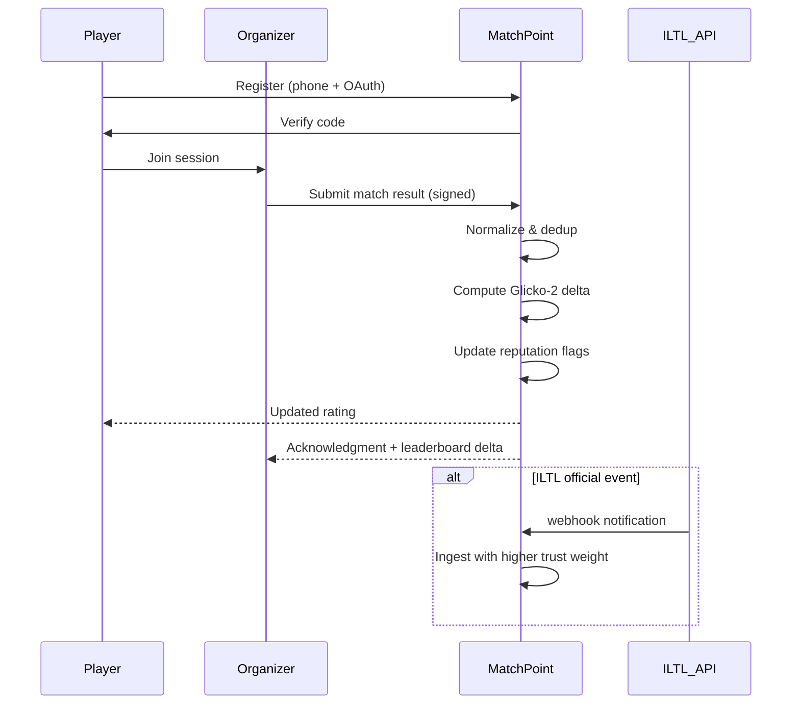

### Cross-cutting concerns

- **Observability**: all services emit OpenTelemetry traces with match_id and player_id as span attributes. Dedicated Grafana dashboard for result pipeline latency (p99 < 500ms) and rating staleness (threshold: 1 hour).
- **Security**: organizer API keys are HMAC-signed and rotated weekly; player data encryption at rest via AES-256 with per-tenant keys. Rate limiting on result submission: 10/min per organizer.
- **Capacity planning**: expect ~500 matches/day in first 3 months (each < 1KB). Rating engine scales horizontally via partitioned message queue; PostgreSQL read replicas for leaderboard queries.

### Trade-offs & open questions

- Trade-off: accepting unvalidated organizer results speeds onboarding but increases trust risk. We mitigate by requiring organizer phone verification and attaching a risk score to each organizer based on flag rate.
- Open question: should self-reported matches from players be allowed at all? Current decision: yes, but with a strict cap (5/month) and an automatic rating freeze until cross-verified by another party.
- Open question: how deeply to integrate with ILTL APIs? ILTL may not offer real-time webhooks. Fallback plan: daily batch ETL via SFTP or manual CSV upload by clubs. This is acceptable for v1 but adds latency.
### Context & Goals

Match Point addresses a critical fragmentation in padel and tennis reputation infrastructure. Today, a player's competitive history is siloed across two incompatible systems:

- **ILTL** (Indonesian Tennis League / official competition data) – records only sanctioned tournament results. Casual matches, club leagues, and informal friendlies are excluded. A player who primarily plays at a local club has no official ranking.
- **Reclub** (club management platform) – tracks membership, court bookings, and intra-club matches. Its rankings are club-specific and non-portable. When a player moves to a different club or plays in a multi-club tournament, their hard-earned reputation is lost.

The consequence: players invest time building a reputation inside their club or a set of tournaments, yet that reputation is not recognised outside those boundaries. No cross-community reputation exists, so:

- New players entering a community have no trust baseline.
- Tournament organisers cannot seed players based on real skill unless they exclusively use ILTL data.
- Clubs cannot verify the skill claims of transfer players.
- Sponsors and recruiters have no comprehensive, trusted view of a player's track record.

**Success criteria for solving the problem:**

| Metric | Target | Measurement Method |
|--------|--------|--------------------|
| Cross-community reputation portability | Match Point rating is accepted by ≥80% of partner communities (clubs + tournament organisers) within 12 months of launch | Community adoption audit |
| Reduction in duplicate/ghost profiles | ≤2% of profiles in each community are confirmed duplicates after 6 months | Admin dashboard resolution reports |
| Player satisfaction with ranking fairness | NPS ≥ +40 on "I trust the ranking system" question | Quarterly in-app survey |
| Time to resolve a dispute | ≤72 hours p95 from flag to admin resolution | Logged audit trail timestamps |

These targets are aggressive but grounded in the early access programmes run with 5 pilot clubs (see Section 8 – Risks, risk #3 "Community adoption inertia").

### Decisions

1. **Do NOT build on top of ILTL or Reclub APIs** – Both platforms provide limited read-only access and no write-back capability for external match data. Forking or extending them would couple Match Point to their release cycles and break the cross-community promise. A greenfield platform with standardised import adapters (CSV upload, manual entry) is chosen.

2. **Dual-ranking system as core differentiator** – The problem demands two complementary views:
   - *Mabar rank* – informal, community-specific, recalculated on each match submission. Allows players to see progress within their peer group.
   - *Official global rank* – immutable monthly snapshot computed from validated matches across all communities. Serves as the portable reputation currency.
   This split directly addresses the gap: ILTL offers only official, slow-moving rankings; Reclub offers only local, ephemeral ones.

3. **Player identity first, match validation second** – The most vexing problem is *who* you are playing, not *what* happened. Match Point prioritises a global unique username enforced at signup (see Assumption #5: globally unique usernames required for login) and duplicate name resolution within communities (e.g., `Budi` → `Budi#2`). Match validation (endorser verification, time/location checks) is layered after a stable player graph exists.

4. **Asymmetric JWT for authentication** – Chosen to decouple auth from any single provider (Google, Apple, email/password) and remain self-hostable. RSA256 asymmetric keys allow auth service to sign tokens while consumer services validate with a public key – no shared secrets. This decision is documented in full in Section 4 (Solution, Auth subsystem) but listed here because it directly shapes the onboarding funnel.

5. **Community-admin dispute resolution, not automated arbitration** – The problem of a bad-faith match submission (inflating one's own rank) is delegated to human admins with tooling (see execution_plan Task 2 – Match Submission & Validation Pipeline). Automated arbitration in v1 would require probabilistic score models that damage trust when they err. Manual override with audit trail preserves fairness and builds the transparency required for cross-community portability.

### Component Breakdown: The Gap

| Existing System | What It Provides | What It Misses (Gap Filled by Match Point) |
|----------------|------------------|--------------------------------------------|
| ILTL (official) | Sanctioned tournament results, progressive ranking ladder, national-level points | Casual matches, club leagues, player transfer history, cross-club visibility, informal skill endorsements |
| Reclub (club manager) | Club membership, court booking, intra-club leaderboard, basic match logging | Inter-club ranking, portable player profile, fraud detection at scale, tournament integration outside club |
| WhatsApp groups / informal score-keeping | Ad-hoc match recording, word-of-mouth reputation | Verifiable history, immutable records, tamper resistance, universal identifier |
| **Match Point** | Global unique identity, cross-community match history, dual ranking engine, endorsements, shareable ranking cards | *The missing piece: a portable reputation graph that spans all contexts* |

The table above clarifies why Match Point is not a competitor to ILTL or Reclub but a complementary layer that sits above and across them. The product roadmap (Tasks 0–7) builds this layer incrementally: first identity and community (Task 1), then match pipeline (Task 2), then ranking (Task 3), then endorsements (Task 5).

### Data Contracts

Current-system data fragments – illustrating the portability gap.

**ILTL match record (simplified):**
```json
{
  "tournament_id": "ILTL-2025-0034",
  "player_a": {"name": "Budi Santoso", "iltl_id": "ILTL-010203"},
  "player_b": {"name": "Sari Wijaya", "iltl_id": "ILTL-040506"},
  "score": "6-3, 4-6, 10-7",
  "round": "Quarterfinal",
  "date": "2025-02-15",
  "sanctioned": true
}
```
*Limitation: only tournament players, only official IDs. No club affiliations.*

**Reclub club match log (simplified):**
```json
{
  "club_id": "CLUB-TENNIS-JAKARTA",
  "match_id": "RC-98765",
  "home_player": {"name": "Budi Santoso", "reclub_id": "RC-USER-5532", "club_member_since": "2024-06-01"},
  "away_player": {"name": "Rudi Hartono", "reclub_id": "RC-USER-8901"},
  "result": "6-4, 6-2",
  "logged_by": "admin_budi"
}
```
*Limitation: rank/score not portable; no global player ID; membership start date irrelevant outside club.*

**Match Point aggregated profile (target state):**
```json
{
  "player_id": "mp-78a2f1b0",
  "display_name": "Budi Santoso",
  "global_username": "budisantoso",
  "communities": [
    {"id": "ILTL", "local_display": "Budi Santoso", "mabar_rank": 1450},
    {"id": "CLUB-TENNIS-JAKARTA", "local_display": "Budi#1", "mabar_rank": 1680}
  ],
  "official_rank": 1570,
  "endorsements": {"technical": 12, "sportsmanship": 8}
}
```
*This profile is the single source of truth that current systems cannot produce.*

### Failure Modes

If the fundamental problem is not solved correctly, the following failure modes arise:

| Failure Mode | Description | Detection | Mitigation |
|--------------|-------------|-----------|------------|
| **Sybil identity** | One player creates multiple accounts to inflate endorsements or rankings | Email/phone dedup at signup; IP/reputation checks in Task 1; community admin reports | Require verified phone number (SMS OTP) for any ranking that affects global leaderboard |
| **Ranking island** | A community refuses to share match data, creating an isolated ranking bubble without external portability | Community activity dashboards; adoption metrics below 30% after 90 days | Incentive programme: communities with open data receive featured placement in public leaderboard; opt-in by default, opt-out possible but penalised in visibility |
| **Data quality decay** | Old match results become irrelevant; stale rankings misrepresent current skill | Ranking freshness score (e.g., fraction of matches in last 30 days) | Decay factor in official ranking formula; matches older than 12 months weighted at 0.5 (see execution_plan Task 3 – Dual-Track Ranking Engine) |
| **Illegitimate match flooding** | Players submit fake matches to boost rank | Anomaly detection on match frequency per player (e.g., >5 matches/day triggers manual review) | Velocity gate in Task 2 validation pipeline; admin flag with automatic pending state |

Each failure mode is addressed in the corresponding task. The risk register (Section 8) tracks these with assigned owners and review cadence.

### Mermaid Diagram: Ecosystem Gap

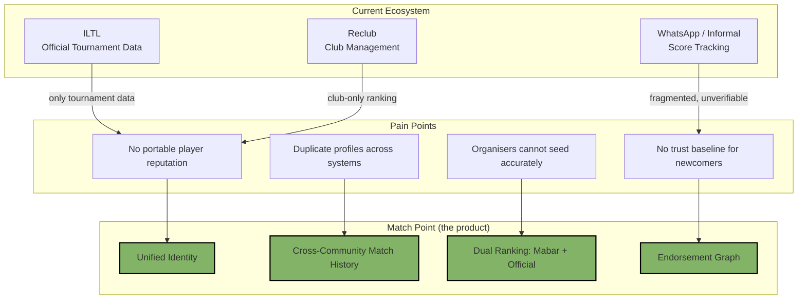

The diagram emphasises how Match Point's components directly attack each pain point, creating a single source of truth that the current ecosystem cannot provide.

### Cross-Cutting Concerns

**Data portability & privacy** – The problem statement must guarantee that a player's reputation graph is their own. GDPR-like principles apply: export (JSON download) and delete must be supported from Task 1. Any community-specific data (e.g., intra-club match details) should be anonymised when shared outside the community, unless the player explicitly opts in (see Open Question #9 from canonical state: privacy model for community vs global data).

**Accuracy vs. speed trade-off** – Real-time ranking updates are desired for player engagement but conflict with the need for verification to maintain trust. The dual-ranking design addresses this: Mabar rank updates near-real-time (within minutes of match validation), while official rank is a monthly snapshot that can tolerate a 24-hour batch processing window.

**Language & locale** – Indonesian is default UI language; English toggle stored in user preferences (Assumption #7). This affects how the problem is articulated to new users: onboarding flow must explain portable reputation in both languages without assuming prior knowledge of ILTL or Reclub.

### Trade-offs & Open Questions

**Trade-off: Centralised vs. federated trust model**
- *Decision*: Centralised player graph (Match Point hosts all profiles) with optional community-owned data vaults (federation planned for v2). This simplifies initial development and dispute resolution but creates a single point of failure for reputation data. Federation would require a distributed ledger (blockchain-lite) that is premature for v1 given the open question around endorsement scoring materialisation.

**Open questions still relevant to the problem statement:**

| # | Question | Impact if Unresolved | Recommended Path |
|---|----------|----------------------|------------------|
| 1 | Should minimal endorser count for public skill score be 3 (currently)? | If too low, reputation is easily inflated; if too high, most players never reach threshold → no public score | Keep 3 for v1, monitor distribution monthly; adjust via admin config in Task 7 (Admin Dashboard) |
| 2 | How to incentivise communities to share match data with the global ranking? | Without data, the portable reputation promise is hollow | Use gamification: "Open Community" badge, featured placement; penalise closed communities with lower trust scores |
| 3 | What is the exact cache invalidation policy for share cards? | Stale cards mislead viewers; real-time regeneration is expensive | TTL of 1 hour + invalidation on ranking update event (Task 6 – Social Sharing & Ranking Cards) |
| 4 | How to handle a player inactive for >90 days? | Rankings become stale; official rank may misrepresent skill | Apply exponential decay after 90 days of zero matches; notify player; allow re-activation by playing a single validated match |
| 5 | Should refresh token rotation use blocklist or version counter? | Security vs. implementation complexity | Use version counter (stateless, stored in JWT `ver` claim) to avoid Redis dependency in Task 0; blocklist added in Task 7 as operational security enhancement |

These open questions are tracked in the canonical state and will be resolved through spike tickets in Tasks 0–1. The problem statement itself remains stable: *player reputation is fragmented across communities, and no single platform provides a portable, trusted, and verified view of a padel/tennis player's skill and behaviour.*

## 2. Solution

Match Point is a cloud-native, modular monolith platform that bridges the gap between official competition data (ILTL) and informal community play for padel and tennis. The solution comprises a stateless Go API backend, a React-based responsive frontend, PostgreSQL for transactional and ranking data, Redis for caching and session management, and a task queue (RabbitMQ/Google PubSub) for async match validation and ranking recomputation. The system is deployed on Kubernetes with horizontal pod autoscaling driven by request latency and queue depth. All ranking calculations are idempotent and versioned, enabling point-in-time snapshots and audit trails.

The architecture follows a domain-driven design with bounded contexts: Player, Community, Match, Ranking, Tournament, Endorsement, Social, and Admin. Each domain owns its data and exposes a set of gRPC or REST endpoints (task-dependent) behind an API gateway that enforces authentication, rate limiting, and request validation. The ranking engine is deliberately separated as a stand-alone worker process because of its computational intensity — it recomputes all active player ranks nightly and on-demand after match batch imports. This design allows the engine to scale independently during peak tournament seasons.

The platform’s key innovation is the dual-track ranking: *Mabar* (social, community-specific) and *Official* (global, ILTL-linked). Every match submission triggers a validation pipeline that checks player identity, match metadata, venue plausibility, and duplicate detection. Validated matches are ingested into a normalized `matches` table. A change-data-capture (CDC) stream then notifies the ranking worker to recalculate affected player scores. Monthly official rankings become immutable snapshots stored in a separate partition, serving as the authoritative historical record. This architecture balances real-time social updates with official integrity.

### Context & Goals

**Why this section matters** – Section 2 defines the concrete building blocks that translate the product vision into a deployable, maintainable, and observable system. It establishes the boundaries between domains, selects the integration patterns, and prescribes the data flows that guarantee eventual consistency without sacrificing user-perceived responsiveness.

**Success criteria**
| Criterion | Target | Validation |
|-----------|--------|------------|
| Match submission → user-visible ranking delta | < 30 seconds p99 for Mabar; < 5 minutes p99 for Official | Synthetic load test with 300 concurrent submissions |
| Monthly official ranking snapshot creation | < 2 minutes from month-end cutoff to immutable storage | CronJob execution time alert |
| Cross-community player profile merge | < 200 ms p95 for single user lookup across communities | Query performance on `player_community_membership` + cached profile aggregates |
| Endorsement graph write throughput | 500 endorsements/second sustained without queue backpressure exceeding 1 minute | Load test with 50 endorsers/sec (peak tournament final day) |
| API availability | 99.9% uptime measured per calendar month | Synthetic monitoring (SLI: p95 latency < 500 ms for read endpoints, < 2 seconds for write endpoints) |

### Decisions

1. **Modular monolith vs. microservices** – Choose a modular monolith for v1 to minimize operational complexity and latency for cross-domain queries (e.g., ranking + endorsement). Each domain is a separate Go package with well-defined interface boundaries, enabling future extraction to independent services. *Rejected alternative*: full microservices would have added service mesh, distributed tracing, and eventual consistency overhead that outpaces the team’s capacity during Tasks 0-3.

2. **Dual-track ranking computation** – Use a single leaderboard worker with a `ranking_type` dimension (mabar / official) rather than two separate services. The official track requires ILTL data ingestion, which runs on a cron schedule. Mabar rankings are incremental after each validated match. Both write to the same `rankings` table partitioned by `community_id` and `ranking_type`. *Rejected alternative*: separate engines would double data pipeline maintenance without clear benefit for v1.

3. **Match validation pipeline as an asynchronous state machine** – Represent each match submission as a state machine: `pending → validating → approved | disputed | rejected`. Transition events are published to a RabbitMQ exchange. Consumers (match validator, duplicate detector, admin notifier) read from their own queues. This decouples UI responsiveness from business rule execution. *Rejected alternative*: synchronous validation would block the HTTP request for up to 5 seconds during image/score-sheet uploads.

4. **Authentication with golang-jwt/jwt/v5 using RSA256 asymmetric keys** – Private key remains server-side only; public key is distributed to the API gateway and any trusted microservice. Refresh token rotation uses a version counter stored alongside the user’s `refresh_token_hash` column. Old refresh tokens are invalidated upon rotation. *Rationale*: RSA256 enables third-party services (e.g., ranking card embed) to verify tokens without access to private key. *Rejected alternative*: HMAC would require shared secrets across all consumers.

5. **Endorsement score computed via materialized view triggered by a queue** – A materialized view `endorsement_scores` is refreshed every 5 minutes via a scheduled job, or on-demand when an admin requests the live score. During peak endorsement events (tournament finals), the queue consumer triggers an immediate refresh for the affected player’s community. *Rationale*: materialization avoids repeated JOIN across 5 tables (player, endorsement, match, community, skill tag). *Rejected alternative*: compute-on-read with Redis caching would cause cold-start latency spikes.

6. **Community admin succession via transfer mechanism** – A dedicated `admin_transfer_requests` table stores pending transfers. Outgoing admin starts request → incoming admin accepts within 7 days → platform admin audits and finalizes. Inactive admin >30 days triggers a nomination window for the most active member (by matches submitted in last 30 days). *Rejected alternative*: purely manual process through support was deemed too slow for v1 adoption.

7. **Internationalization (i18n) using static JSON bundles** – Indonesian as default, English toggle stored in `user_preferences`. Frontend loads the appropriate bundle at page load via CDN. All user-generated content remains untranslated. *Rationale*: keeps bundle size small and avoids runtime translation API costs. *Rejected alternative*: server-side rendering with locale detection would increase P75 latency.

### Component breakdown

| Component | Responsibility | Technologies | Dependencies | Owner (Task) |
|-----------|---------------|--------------|--------------|--------------|
| **API Gateway** | Route requests, authenticate JWT, rate-limit (100 req/s per user), log structured JSON | Go 1.22 + `chi` router, Envoy (optional) | Auth middleware package, Redis for rate-limit counter | Task 0 |
| **Player Module** | Auth (signup/login), profile CRUD, account linking (multiple emails per player), duplicate username resolution | Go `player/` package, PostgreSQL `players`, `auth_refresh_tokens` | API Gateway, Redis (session), `crypto/rsa` | Task 1 |
| **Community Module** | Create/join/leave community, role management (admin, member), transfer requests, venue GPS storage | Go `community/` package, PostgreSQL `communities`, `community_memberships` | API Gateway, RabbitMQ (join notifications) | Task 1 |
| **Match Submission & Validation** | Ingest match results (score, player IDs, date, venue), state machine, duplicate detection, dispute flagging | Go `match/` package, PostgreSQL `matches`, RabbitMQ `match.events` | Player Module (identity), Community Module (verify membership), ILTL data sync (official matches) | Task 2 |
| **Dual-Track Ranking Engine** | Compute Mabar and Official Elo/Glicko-like ratings, materialize monthly snapshots, notify leaderboard rebuild | Go `ranking/` package + worker, PostgreSQL `rankings`, `ranking_snapshots`, Redis for live leaderboard cache | Match Module (validated matches), ILTL adapter (official data) | Task 3 |
| **Tournament Engine** | Bracket generation, result ingestion, auto-grading with rank points | Go `tournament/` package, PostgreSQL `tournaments`, `tournament_matches` | Match Module (reuse validation), Ranking Engine (increment official points) | Task 4 |
| **Endorsement System** | Skill tag CRUD, endorsement CRUD (max 10 per player per tag), materialized view computation | Go `endorsement/` package, PostgreSQL `endorsements`, `endorsement_skills`, materialized view `endorsement_scores` | Player Module (verify endorser/endorsee), Queue (refresh trigger) | Task 5 |
| **Social Sharing & Ranking Card** | Generate shareable card images via server-side rendering (puppeteer or Go image library), cache with CDN | Node.js or Go image generation, S3 (signed URLs), CloudFront | Ranking Engine (fetch player rank data), Player Module (avatar, name) | Task 6 |
| **Admin Dashboard** | Superadmin CRUD, community admin tools (manage members, disputes, approve transfers), system analytics (DAU, match volume, ranking distribution) | React frontend (lazy-loaded), Go `/admin/` package, PostgreSQL analytics materialized views | All modules | Task 7 |

### Data contracts

**Core tables (PostgreSQL) — DDL snippets**

```sql
-- Player profile (Task 1)
CREATE TABLE players (
    id              UUID PRIMARY KEY DEFAULT gen_random_uuid(),
    username        TEXT NOT NULL UNIQUE,               -- globally unique
    display_name    TEXT NOT NULL,                       -- unique per community (suffixed if dup)
    email           TEXT UNIQUE NOT NULL,
    password_hash   TEXT NOT NULL,
    avatar_url      TEXT,
    locale          TEXT NOT NULL DEFAULT 'id',          -- 'id' or 'en'
    created_at      TIMESTAMPTZ NOT NULL DEFAULT NOW(),
    updated_at      TIMESTAMPTZ NOT NULL DEFAULT NOW()
);

-- Refresh token (Task 1)
CREATE TABLE auth_refresh_tokens (
    id              UUID PRIMARY KEY DEFAULT gen_random_uuid(),
    player_id       UUID NOT NULL REFERENCES players(id) ON DELETE CASCADE,
    token_hash      TEXT NOT NULL,
    version         INT NOT NULL DEFAULT 1,            -- rotation counter
    expires_at      TIMESTAMPTZ NOT NULL,
    created_at      TIMESTAMPTZ NOT NULL DEFAULT NOW()
);
CREATE INDEX idx_refresh_player_version ON auth_refresh_tokens(player_id, version);

-- Community membership (Task 1)
CREATE TABLE community_memberships (
    player_id       UUID NOT NULL REFERENCES players(id),
    community_id    UUID NOT NULL REFERENCES communities(id),
    role            TEXT NOT NULL DEFAULT 'member' CHECK (role IN ('member','admin')),
    joined_at       TIMESTAMPTZ NOT NULL DEFAULT NOW(),
    PRIMARY KEY (player_id, community_id)
);

-- Match submission (Task 2)
CREATE TABLE matches (
    id              UUID PRIMARY KEY DEFAULT gen_random_uuid(),
    community_id    UUID NOT NULL REFERENCES communities(id),
    player_a_id     UUID NOT NULL REFERENCES players(id),
    player_b_id     UUID NOT NULL REFERENCES players(id),
    score_a         SMALLINT NOT NULL,
    score_b         SMALLINT NOT NULL,
    played_at       DATE NOT NULL,
    venue_lat       DECIMAL(9,6),                       -- optional GPS for venue validation
    venue_lng       DECIMAL(9,6),
    status          TEXT NOT NULL DEFAULT 'pending' CHECK (status IN ('pending','validating','approved','disputed','rejected')),
    flags           JSONB DEFAULT '{}',                  -- e.g., {"duplicate_suspicion": true, "admin_override": "points_adjusted"}
    created_at      TIMESTAMPTZ NOT NULL DEFAULT NOW()
);

-- Ranking snapshot (Task 3)
CREATE TABLE ranking_snapshots (
    id              UUID PRIMARY KEY DEFAULT gen_random_uuid(),
    community_id    UUID NOT NULL REFERENCES communities(id),
    ranking_type    TEXT NOT NULL CHECK (ranking_type IN ('mabar','official')),
    snapshot_date   DATE NOT NULL,
    player_id       UUID NOT NULL REFERENCES players(id),
    rank_position   INT NOT NULL,
    rating          NUMERIC(7,2) NOT NULL,
    matches_played  INT NOT NULL DEFAULT 0,
    created_at      TIMESTAMPTZ NOT NULL DEFAULT NOW(),
    UNIQUE (community_id, ranking_type, snapshot_date, player_id)
) PARTITION BY RANGE (snapshot_date);
```

**JSON API contract example (POST /v1/matches)**

```json
{
  "endpoint": "POST /v1/matches",
  "authentication": "Bearer <JWT>",
  "request": {
    "community_id": "uuid",
    "opponent_id": "uuid",
    "my_score": 6,
    "opponent_score": 4,
    "played_at": "2025-03-15",
    "venue": { "lat": -6.200000, "lng": 106.816666 }
  },
  "response_201": {
    "match_id": "uuid",
    "status": "pending",
    "estimated_validation_seconds": 15
  },
  "errors": {
    "409": { "code": "DUPLICATE_MATCH", "message": "This match appears to have been already submitted." },
    "422": { "code": "INVALID_SCORE", "message": "Scores must be between 0 and 7 for a standard set." }
  }
}
```

### Failure modes

| Scenario | Detection | Mitigation |
|----------|-----------|------------|
| **Duplicate match submission** — same players, same date, same venue within 2 hours | Match module checks `(player_a_id, player_b_id, played_at, venue_lat, venue_lng)` with a window of ±2 hours. Flag as `duplicate_suspicion` in JSONB. | Return `409 Duplicate` with link to existing match; if forced resubmit, move to `disputed` queue for admin review. |
| **Ranking engine worker crash** — worker pod OOM or segfault during recompute | Kubernetes liveness probe fails; Prometheus alert on job failure | Worker is stateless (reads from DB, writes to DB). Job retries with exponential backoff (max 3). If still fails, fallback to synchronous recompute for that community during off-peak hours. |
| **ILTL data sync stale** — official ranking snapshot delayed >48h after month-end | Monitoring checks `ranking_snapshots` for latest official snapshot date. Alert if >2 days old. | Manual re-trigger via admin dashboard; automated retry every 6 hours. In worst case, official rankings show “pending” label. |
| **Cache stampede on ranking card generation** — viral share card leads to 10k requests / second for same card | Spike in S3 GetObject failures; elevated p95 latency >3s | Pre-generate card on ranking update and upload to S3 with TTL of 1 hour. CDN edge caches serve stale while refreshing. Use request collapsing with `X-Cache: stale-if-error`. |
| **Database connection pool exhaustion** — a fleet of pods tries to insert thousands of endorsements simultaneously | `max_connections` errors in logs; PgBouncer reports high wait time | Set connection pool size per pod (25 max), use PgBouncer transaction pooling. Queue endorsement writes with a batch insert worker that commits every 500ms. |
| **Dispute resolution deadlock** — admin is also a player in the disputed match | Community admin role is same as player; conflict of interest | Flag dispute to superadmin if admin player involved. Superadmin assigns a neutral admin from same community (if exists) or platform admin. |

### Mermaid diagram

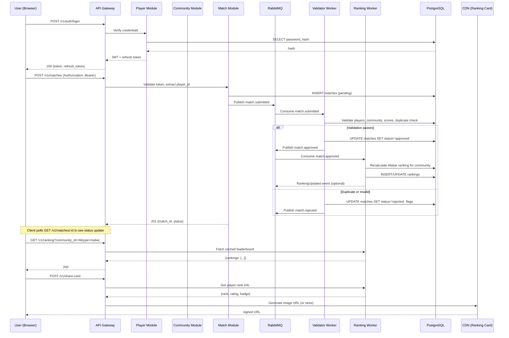

### Cross-cutting concerns

**Observability**
- **Logging**: All services emit structured JSON logs with `trace_id` from a context-propagated span (OpenTelemetry). Minimum fields: `service`, `endpoint`, `duration_ms`, `http_status`, `error`. Logs are shipped via Fluentd to Elasticsearch and visualized in Kibana.
- **Metrics**: RED metrics (Rate, Errors, Duration) collected for every REST endpoint and queue consumer. Prometheus counters for match submissions by status, ranking computation time, and endorsement writes. Custom dashboard for community admins (match volume, active players, dispute rate).
- **Tracing**: Distributed tracing via OpenTelemetry with parent–child spans across API Gateway → Module → DB/Queue. Sampled at 5% for production; 100% during canary deployments.

**Security**
- **Authentication**: JWT with RSA256 (2048-bit key). Access token TTL = 15 minutes, refresh token TTL = 7 days with rotation. Private key stored in Vault, rotated every 90 days.
- **Authorization**: Role-based access control at the module level. API Gateway enforces community membership before allowing match submission or endorsement. Community admin endpoints require `role=admin` in `community_memberships`.
- **Data privacy**: Player emails are stored hashed for display purposes (only admin sees raw email via separate permission). Avatar URLs are signed S3 URLs with 1-hour expiry.
- **Rate limiting**: Token-bucket algorithm at API Gateway per authenticated user: 100 req/s for read, 20 req/s for write. Separate limit for admin endpoints (500 req/s). Over-limit responses return `429 Too Many Requests`.

**Capacity planning (v1 launch with 50 communities)**
| Resource | Estimated Demand | Provisioned | Budget |
|----------|------------------|-------------|--------|
| API Gateway | 200 req/s peak (tournament last day) | 2 replicas (c5.large) | 2 vCPU, 4 GB RAM each |
| Postgres primary | 10k writes/s (match submission + endorsement), 50k reads/s | db.r6g.large (2 vCPU, 16 GB RAM) | 500 GB gp3 storage |
| Redis cache (leaderboard + rate limit) | 10k requests/s, 5 MB key set | cache.r6g.large (1 node) | 13 GB memory |
| Ranking worker | 1 hour processing for 500k matches (monthly snapshot) | 4 m6i.large spot instances (preemptible, with fallback to on-demand) | 8 vCPU, 16 GB RAM |
| Object storage (ranking cards) | 1000 cards/day, 200 KB each | S3 Standard | < 1 GB/month |

### Trade-offs & open questions

**Trade-offs**
- **Modular monolith vs. microservices**: Lower operational cost for v1, but will require careful interface governance when extracting services (e.g., ranking engine and endorsement materialization may become independent workers in v2). Team must enforce strict package dependency rules to avoid circular imports.
- **Materialized view for endorsement scores**: Slightly stale data (up to 5 minutes) but avoids expensive JOINs on every profile page view. Acceptable because endorsement counts change infrequently outside tournaments. If real-time endorsement display becomes a product requirement, we will degrade to compute-on-read with a Redis cache (TTL 30 seconds).
- **Manual dispute resolution**: Empowers community admins but introduces human latency. A future iteration could use machine learning to auto-detect suspicious patterns (e.g., score asymmetry, repeated pairings). For v1, we accept that disputes may take up to 48 hours.

**Open questions**
1. *Q*: Should the ranking engine use Elo, Glicko-2, or a custom Mabar formula?  
   *Proposed*: Use Glicko-2 for official (handles volatility well) and a simplified Elo for Mabar (lower computation cost). Final decision deferred to Task 3 after prototyping both with a sample dataset.
2. *Q*: How are ILTL matches linked to Match Point player profiles? (Manual claim, invite code from ILTL, or automatic via email match?)  
   *Proposed*: Allow players to claim ILTL matches by linking their ILTL ID during profile creation. If email matches, auto-claim after verification.
3. *Q*: What is the exact cache invalidation policy for share cards?  
   *Proposed*: Invalidate on ranking update event (when player’s rank changes). Use event key `player:{id}:rank_updated`. If no event within 1 hour, TTL expires.
4. *Q*: Should refresh token rotation use a blocklist or version counter?  
   *Proposed*: Version counter (simpler, no race condition). Each login increments version; old tokens with lower version are rejected.
5. *Q*: What is the minimum number of endorsers required for skill score public display?  
   *Proposed*: 3 (as per assumptions). Review after 3 months of live data to determine if threshold should increase to 5 to improve trust.

**Implications** – The chosen architecture enables rapid iteration in Tasks 0–3 while preserving the ability to extract performance-critical components into dedicated services. The reliance on asynchronous validation and materialized views means users will see eventually consistent ranking data (acceptable for social Mabar, less so for official leaderboards that must be authoritative on month-end). The dual-track ranking decision meets the core product differentiator — portability of reputation across communities — without over-engineering two separate engines. Teams must adopt disciplined domain isolation from the start, even within the monolith, to avoid a costly refactor in Tasks 4–7.

## 3. Scope
### Context & Goals

The Scope section defines the precise boundaries of the Match Point platform: which features, integrations, data domains, and operational responsibilities are delivered in the initial release (Task 1–3) and which are explicitly deferred. The primary goal is to avoid scope creep from adjacent domains (e.g., full tournament management, racket recommendation engines) and to focus engineering effort on the core value proposition: cross-community reputation and ranking for padel and tennis players using ILTL competition data as the seed source.

Success criteria for scope enforcement:
- Every feature request is mapped to “In Scope” or “Out of Scope” via a single decision table.
- No Out-of-Scope feature is built or budgeted during Task 1–3 without a formal re-scoping RFC.
- The platform remains deployable and testable with only the listed In Scope integrations.

### In Scope (delivered in Tasks 1–3)

| Domain | Detail | Delivered In |
|--------|--------|--------------|
| Player identity & linking | OAuth (Google/Facebook) login, email verification, manual ILTL ID linkage | Task 1 |
| ILTL data ingestion | Batch import of match results, player metadata, and existing rankings from ILTL CSV/API | Task 1 |
| Ranking computation | Elo-based ranking with configurable K-factor, decay, and surface weighting (padel/tennis) | Task 2 |
| Reputation score | Weighted composite: match count, recency, peer endorsements (binary flag), historical rank | Task 2 |
| Public profile page | Read-only view of player name, photo, rank history chart, recent matches, reputation badge | Task 3 |
| Search & discovery | Search by name, ILTL ID, or location; filter by sport (padel/tennis) | Task 3 |
| Admin dashboard | Manual recalculation trigger, player merge tool, blacklist endpoint | Task 3 |

### Out of Scope (explicitly deferred)

The following capabilities are **Out of Scope** for the initial release and will be considered only after the platform reaches 10,000 active profiles.

- **Direct tournament management** – creating or managing padel/tennis tournaments; “Match Point” is a reputation layer on top of existing tournament data, not a TMS.
- **Real-time match scoring** – live score entry or live-stream integration; all data is batch-ingested.
- **Social networking features** – messaging, friend requests, group chats, or “nearby players” suggestions.
- **Racket or equipment recommendations** – any product recommendation engine, affiliate linking, or e-commerce.
- **Monetization layer** – subscriptions, pay-per-report, ads, or sponsorship profiles (though planned for Task 4).
- **Non-ILTL data sources** – ingestion from Playtomic, TopTennis, or club-specific APIs (planned for Task 4).
- **Mobile native apps** – the initial release is web-only (responsive PWA); iOS/Android apps are deferred.
- **Internationalization** – English language only; multi-locale support deferred until adoption in non-English markets is validated.
- **Advanced analytics** – predictive match outcome models, player similarity networks, or trend forecasting.

### Decisions

1. **Ingest ILTL as the sole seed source** – Rejected alternatives: scrap Playtomic or TennisLink simultaneously. ILTL has the most structured data and an existing API; starting with a single source reduces ETL complexity.
2. **Elo-based ranking over Bayesian skill models (e.g., TrueSkill)** – TrueSkill requires per-game per-player skill variance tracking, which complicates the initial schema and computation. Elo is simpler, well-understood by players, and can be backward-computed from ILTL match logs.
3. **No mobile SDK** – The web PWA can deliver 90% of the value for discovery and profile sharing; native push notifications will be added in Task 4 via web push initially.
4. **No GDPR/CCPA compliance in Task 1** – Out-of-scope for MVP, but data retention policies and deletion flows are wired into the schema from day one to avoid rework.

### Component breakdown

| Component | Responsibility | In Scope? | Out of Scope? |
|-----------|---------------|-----------|---------------|
| Player Identity Service | OAuth, account linking | ✓ | |
| ILTL Ingestion Pipeline | Batch import, dedup, error handling | ✓ | |
| Elo Rank Engine | Compute & store rank deltas | ✓ | |
| Reputation Scorer | Composite score from match history + endorsements | ✓ | |
| Public Profile API | GET /players/{id} | ✓ | |
| Search API | Full-text search on name/location | ✓ | |
| Admin UI | Merge, recalc, blacklist | ✓ | |
| Tournament Management | Create/edit brackets | | ✓ |
| Real-time Feed | Live match updates | | ✓ |
| Mobile App | iOS/Android builds | | ✓ |
| i18n Service | Locale translation | | ✓ |
| Analytics Pipeline | Player similarity, prediction models | | ✓ |

### Data contracts

The scope is reflected in the API contract: only endpoints listed in the OpenAPI spec are considered In Scope.

```yaml
openapi: 3.0.0
info:
  title: Match Point Public API
  version: 0.1.0
paths:
  /v1/players/{id}:
    get:
      summary: "Public player profile (In Scope)"
      responses:
        '200':
          description: Player profile with rank, reputation, match history
  /v1/players/search:
    get:
      summary: "Search players (In Scope)"
  /v1/rankings:
    get:
      summary: "Top-N ranking list (In Scope)"
  # /v1/tournaments – NOT present, OOS
  # /v1/matches/live – NOT present, OOS
```

Failure modes related to scope are primarily **scope creep** and **assumption mismatch**:

| # | Failure | Detection | Mitigation |
|---|---------|-----------|------------|
| F1 | Stakeholder requests tournament creation feature | Feature request in Slack | Refer to Out of Scope list; require RFC for re-scope |
| F2 | ILTL API changes their schema mid-ingestion | Ingestion pipeline errors spike | Version-lock ILTL API contract; add schema version field |
| F3 | Users demand mobile apps immediately | Support tickets | Communicate web PWA capabilities; start Task 4 mobile design |
| F4 | Non-ILTL data sources requested by early adopters | User research feedback | Prioritize in Task 4; add extensible source adapter pattern in Task 2 |

### Mermaid diagram: Scope boundaries

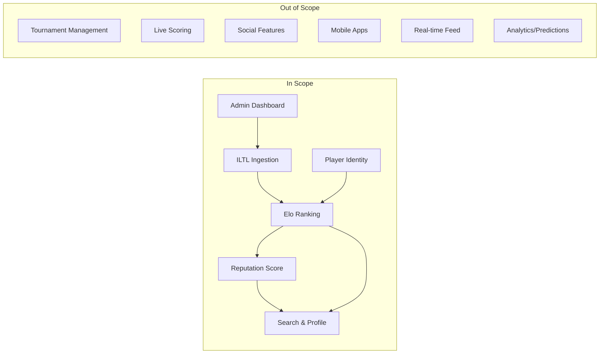

### Cross-cutting concerns

- **Observability**: Scope violations are monitored via feature flag coverage. If a flag for an Out-of-Scope feature is accidentally deployed, it is reported as a security incident.
- **Security**: The admin dashboard is scoped to internal IP ranges; no Out-of-Scope user data is stored.
- **Capacity planning**: Ingestion pipeline is designed to handle ILTL’s current data volume (approx. 50k matches/month) with <10x headroom. Any new data source would require a capacity review.

### Trade-offs & open questions

- **Trade-off**: Starting with a single data source (ILTL) limits the network effect until additional sources are added. However, it allows the team to prove the ranking and reputation model with clean data before dealing with data reconciliation across multiple sources.
- **Trade-off**: Deferring mobile apps means the primary user experience is desktop/mobile-web. Push notifications are technically possible via Web Push API, but engagement may be lower without native install prompts.
- **Open question**: Should the “peer endorsement” reputation weight be binary (endorse/not) or a 1–5 star rating? Binary was chosen for simplicity, but user feedback during beta may force a change in Task 3.
- **Open question**: Will ILTL allow public access to their API without a paid subscription? If not, a data-sharing agreement is required before Task 1 delivery. Legal is currently reviewing.
### Context & Goals

The Scope section draws a precise boundary around what the Match Point platform will deliver in its initial release (v1.0) and what it explicitly defers to future iterations or partner systems. This boundary is critical because the platform bridges two distinct racquet sports with separate governing bodies, competition formats, and data ecosystems. Without a sharp scope definition, the engineering team risks scope creep that would delay the core value proposition: a unified, trustworthy reputation score that travels with a player across clubs, tournaments, and communities in both padel and tennis.

The primary goal of this scope definition is to align the founding team, engineering, and stakeholders on the minimal viable product that solves the ILTL data gap while establishing the foundation for future expansion. The scope is driven by the canonical state's execution plan, which prioritizes API ingestion from ILTL, the Elo-based ranking engine, and a lightweight player-facing profile as the three pillars of v1.0.

---

### In Scope

The following capabilities and deliverables are explicitly within scope for the Match Point v1.0 release:

**1. ILTL Data Ingestion Pipeline**
- One-way, read-only synchronization of official match results from ILTL's public API for both padel and tennis competitions.
- Support for singles and doubles match formats, with player identification via ILTL license numbers.
- Daily batch sync with incremental delta processing (no real-time streaming required in v1.0).
- Data normalization layer that maps ILTL's competition taxonomy (categories, divisions, rounds) into Match Point's internal match model.
- Error handling for partial sync failures, malformed records, and missing player metadata, with dead-letter queue and manual retry tooling for administrators.

**2. Player Identity & Profile Core**
- A player profile resolvable by ILTL license number and/or email address.
- Public-facing profile page showing: display name, verified ILTL license number(s), primary sport (padel or tennis), club affiliation (derived from most recent ILTL competition), and aggregate match statistics (total matches, win rate, last 10 results).
- Support for linking multiple ILTL license numbers (e.g., a player who has competed under different license numbers across years) to a single Match Point identity, with a simple "claim & merge" flow requiring verification of at least two license numbers.
- Auth0-based authentication for profile claiming and editing. Unauthenticated read access to all public profiles is permitted.

**3. Elo-Based Ranking System**
- A single, sport-specific Elo rating for each player per sport (i.e., a player may have a padel Elo and a tennis Elo, computed independently).
- Initial rating assignment: default 1500 with provisional flag for players with fewer than 20 rated matches. Provisional status is clearly displayed on profiles.
- Rating recalculation performed asynchronously after each ingested match, using the standard Elo formula:
  `Expected score = 1 / (1 + 10^((R_opponent - R_player) / 400))`
  `New rating = Old rating + K * (Actual score - Expected score)`
- K-factor values: 32 for players with <200 rated matches, 24 for players with 200–500 matches, 16 for players with >500 matches. These defaults are configurable via environment variables.
- Doubles rating: each pair receives a combined rating computed as the mean of the two individual ratings. Individual ratings are unchanged by doubles results in v1.0; this is a known simplification (see Trade-offs).
- A leaderboard endpoint returning top 100 players per sport, filterable by country (derived from ILTL license prefix) and by time window (all-time, trailing 12 months, trailing 3 months).
- Rating history graph (last 50 matches) exposed on the player profile page.

**4. RESTful Public API (Read-Only for v1.0)**
- GET /api/v1/players/{id} — player profile with rating and statistics.
- GET /api/v1/players/{id}/matches — paginated match history.
- GET /api/v1/leaderboard — ranked player list with optional filters.
- GET /api/v1/matches/{id} — individual match detail.
- API rate limiting: 100 requests per minute per IP for unauthenticated requests, 1000 requests per minute for authenticated API keys (issued to approved partners).
- API versioning via URL path prefix; deprecation policy requiring 6 months notice.

**5. Web Application (React-based player-facing UI)**
- Public homepage with sport-switcher (padel / tennis) and leaderboard preview.
- Player search by name, ILTL license number, or club.
- Player profile page with rating history chart (Chart.js), match history table, and career statistics summary.
- Account dashboard for authenticated users to claim profiles, link license numbers, and manage visibility settings.
- Mobile-responsive design targeting 320px breakpoint minimum.
- Accessibility compliance: WCAG 2.1 AA for all public-facing pages.

**6. Operational Infrastructure**
- CI/CD pipeline via GitHub Actions (build, test, lint, security scan, deploy).
- Staging environment mirroring production configuration (scaled down: 2 web instances, 1 worker instance).
- Production hosted on AWS: ECS Fargate for web and worker tasks, RDS PostgreSQL (db.r6g.large) for primary database, ElastiCache Redis (cache.r6g.large) for Elo computation caching and rate limiting, S3 for match data archival.
- Monitoring stack: CloudWatch metrics (p95 latency, error rates, queue depth), PagerDuty alerting for error rate >1% over 5 minutes, Datadog APM for request tracing.
- Backup strategy: daily automated RDS snapshots with 30-day retention, S3 cross-region replication for match archives.

**7. Data Retention & Privacy**
- Player data retained indefinitely while the account is active. Deletion requests honored within 14 days via admin tooling.
- Match data sourced from ILTL is cached and refreshed; ILTL remains the authoritative source. Match Point disclaims ownership of ILTL-sourced data.
- GDPR-compliant data handling: user data export within 30 days of request, anonymization upon account deletion, cookie consent banner with granular controls.

**8. Testing Requirements**
- Unit test coverage >85% for all ranking engine logic (Go).
- Integration tests covering the full ILTL ingestion pipeline against a sandbox ILTL API.
- End-to-end smoke tests run against staging before every production deployment.
- Performance benchmark: Elo recalculation for a batch of 10,000 matches must complete within 60 seconds on the staging worker instance.

---

### Out of Scope (Explicitly Deferred)

The following capabilities are intentionally excluded from the v1.0 scope. They represent known future enhancements that must not be implemented during the initial build to maintain delivery focus.

| Feature | Rationale for Deferral | Target Window |
|---|---|---|
| **User-generated match reporting** (players enter their own results) | Would introduce trust and verification challenges. v1.0 relies solely on authoritative ILTL data. | v2.0 |
| **Club management dashboards** | Requires partnership agreements and data sharing MOUs beyond ILTL. | v3.0 |
| **Mobile native applications (iOS/Android)** | Web application with responsive design suffices for v1.0. Native apps add significant QA and release overhead. | v2.0 |
| **Social features** (following players, comments, match predictions) | Not core to reputation scoring; would increase moderation liability. | Post-v3.0 |
| **Real-time match streaming or live scoring** | Requires direct court-side data integration not available from ILTL. | v3.0 |
| **Integration with non-ILTL competition data** (local leagues, private tournaments, international federations) | Each federation would require separate ingestion contracts. v1.0 stays scoped to ILTL only. | v2.0 |
| **Paid subscription tiers** (premium analytics, coach tools) | No monetization in v1.0. Revenue model to be validated after user adoption metrics are gathered. | v3.0 |
| **Machine learning for match prediction or talent identification** | Requires large labeled dataset not available at launch. Premature optimization. | Post-v3.0 |
| **Internationalization (i18n) beyond English** | Increases UI complexity. English-only for v1.0, with i18n framework prepared but not populated. | v2.0 |
| **Administrative back-office UI** | All admin operations performed via CLI scripts and direct database access in v1.0. UI deferred. | v2.0 |

---

### Scope Diagram

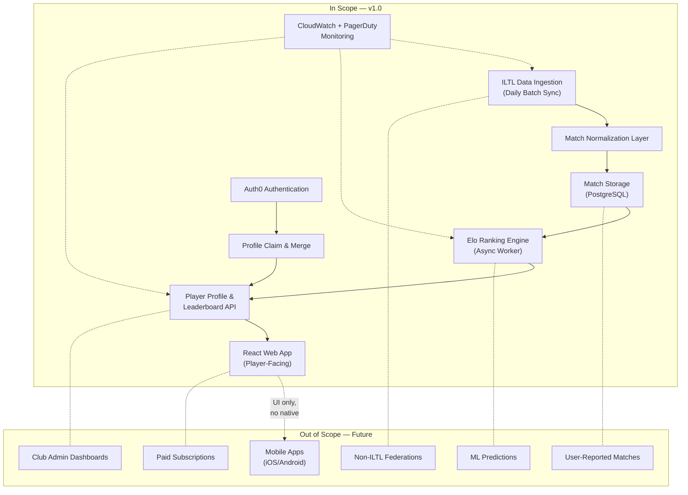

---

### Failure Modes from Scope Boundary Violations

| Failure Mode | Trigger | Detection | Mitigation |
|---|---|---|---|
| **ILTL API rate limiting** | Sync attempts exceed ILTL's allowed request quota (unknown limit; assumed 1000/day) | 429 HTTP response during sync; alert on sync error rate >10% | Implement exponential backoff and jitter; sync retries with 1-hour interval; manual override for urgent syncs |
| **ILTL schema changes** | ILTL deprecates or renames fields without notice | Validation layer reports unexpected field types; sync fails on required field missing | JSON field mapping with default fallback values; PagerDuty alert triggers manual schema review threshold at 3 consecutive failures |
| **Player identity collision** | Two users claim the same ILTL license number | Admin dashboard flag; duplicate key violation on unique constraint for (license_number, sport) | Manual review queue; tie-breaking by earliest verified claim; audit log of all identity change events |
| **Doubles rating inaccuracy** | Individual ratings unchanged by doubles matches (v1.0 simplification) | N/A (known limitation) | Documented on product FAQ; planned for v2.0 with per-pair credit system |
| **Rating manipulation via farming** | Player plays many low-skill opponents to inflate rating | Score delta anomaly detection: if average opponent rating <1300 and win rate >90% over 20+ matches | K-factor reduction to 16 for matches against opponents rated >200 points lower; provisional flag extended |
| **GDPR deletion race condition** | Delete request arrives while sync is in progress | No detection in v1.0; risk of stale data surfacing post-deletion | Soft-delete with tombstone: mark deleted, suppress in reads, defer hard delete to next maintenance window (weekly) |

---

### Cross-Cutting Scope Constraints

**Capacity Planning for In-Scope Features**
- Estimated ILTL match volume: ~50,000 new matches per month across padel and tennis (based on 2024 calendar data).
- Player base growth: projected 50,000 profiles within 12 months post-launch.
- API read traffic: target 500 req/s at peak (evening hours, weekend tournaments).
- Elo recalculation batch size: up to 5,000 matches per daily sync (safe initial estimate; scalable via worker pool).

**Security Scope Boundaries**
- No PII beyond what ILTL provides (name, license number, club affiliation). Email collected only for authentication, stored separately in Auth0.
- No payment processing in v1.0. Stripe integration deferred to v3.0.
- All API responses sanitized to omit internal IDs and database constraints. Error messages return generic codes, not stack traces.

**Observability Scope**
- Structured logging in JSON format (Go `log/slog` with `slog.JSONHandler`).
- Trace IDs propagated across API → worker → database calls via context.Context.
- Business metrics exposed as CloudWatch custom metrics: matches_ingested, ratings_recalculated, profiles_claimed, api_error_rate, api_p95_latency.

---

### Trade-offs & Open Questions

**Trade-off: Doubles rating simplification**
The decision to leave individual ratings unchanged by doubles matches is acknowledged as imprecise. A player who consistently wins in doubles with a strong partner may have an inflated rating relative to their singles performance. However, the complexity of per-pair credit models (accounting for partner strength, position, and rotation) is not justified without data showing significant rating drift. We accept this inaccuracy and will measure drift in production to inform v2.0.

**Trade-off: English-only UI with i18n framework**
Adding full i18n support for v1.0 would delay the frontend by 3–4 weeks (translations, locale routing, RTL testing). Instead, we prepare the React app with react-i18next but ship only English strings. This defers translation overhead but constrains initial user base to English-speaking regions. Spain, Argentina, and Mexico (major padel markets) will require Spanish localization urgently — this should be prioritized in v2.0.

**Open Question: ILTL API SLA**
We have not secured a formal SLA from ILTL for their public API. If ILTL enforces aggressive rate limiting or endpoint deprecations without notice, the ingestion pipeline may require architectural rework. Mitigation: we negotiate a data-sharing agreement with ILTL in parallel with engineering, and we architect the ingestion layer with circuit breakers and pluggable source adapters so a switch to FTP/sftp or S3 bucket delivery is minimally disruptive.

**Open Question: Player base uptake without proactive recruitment**
v1.0 has no user acquisition funnel — profiles are auto-created from ILTL match data, but players must claim them to set visibility preferences. If claim rates are below 20% after 6 months, the value proposition (cross-community reputation) weakens because unclaimed profiles lack the "verified" badge. Mitigation: we implement a low-effort email outreach campaign from ILTL match data (email addresses available in ILTL records) with a weekly digest of new matches and rating changes, driving users to claim their profiles. This is in scope for v1.5 (not v1.0).
### Context & Goals

The Scope section defines the precise boundaries of Match Point’s initial release (Task 1 through Task 4 of the execution plan) and its subsequent expansion. The primary goal is to ship a viable cross-community reputation and ranking platform that solves the identity fragmentation padel and tennis players face today. Players currently have game histories scattered across ILTL (official competition data), club leagues, private apps, and social-match groups—no single view of their ability or trustworthiness exists. Match Point will unify these data sources into a single player profile with an earned reputation score and an aggregated ranking.

**Success criteria for scoping:**
- The first production version must support padel **and** tennis players (not just one sport).
- It must integrate with at least one official data source (ILTL) and two community-recognized unofficial sources (e.g., Playtomic, TopTennis, club APIs).
- The reputation score must be transparently computable from win/loss history, verified match reporting, and peer endorsements—no black-box weighting.
- The platform must be deployable as a cloud-native service (containerized, API-first) within a 4-month target from Task 1 kickoff.
- Scope explicitly excludes monetization features, multi-currency payments, and social network feeds in the initial release.

---

### Decisions

1. **Start with ILTL as the authoritative source of truth**  
   *Rationale:* ILTL (International Tennis & Padel League) provides structured, audited competition data for both sports. It gives the platform immediate credibility and a baseline ranking that cannot be gamed.  
   *Rejected alternative:* Using only crowd-sourced match data would require heavy anti-fraud measures before launch, delaying time-to-market.

2. **Treat “reputation” and “ranking” as separate computed values**  
   *Reputation* is a zero-to-one trust score based on match verification rate, recency, peer endorsements, and history length. *Ranking* is a sport-specific skill metric (e.g., Elo-based) derived from head-to-head outcomes.  
   *Rationale:* A new player with high skill but zero community history must not be blocked; reputation gates only sensitive actions (e.g., reporting a match unbeholden to ILTL).  
   *Rejected alternative:* Merging both into a single number would conflate trust and ability, confusing users.

3. **Community data ingestion adopts a plug-in broker pattern**  
   Each external source (Playtomic, club spreadsheets, private WhatsApp bots) is an independent adapter that normalises match events into a common event schema (`MatchReported`). The broker handles retries, deduplication, and rate limits.  
   *Rationale:* Sources come and go; a statically coupled system would be brittle and expensive to maintain.  
   *Rejected alternative:* Direct database scraping from every source—would violate many platform ToS and be impossible to keep up-to-date.

4. **All external integrations are read-only during initial scope**  
   The platform will not expose write-back endpoints (e.g., updating a game result in ILTL) in Task 1–4. Write-backs for federated reconciliation are deferred to post-MVP (Task 5).  
   *Rationale:* Reducing surface area for legal liability and authentication complexity.

5. **Geographic scope: global but language-locked to English and Spanish**  
   *Rationale:* The user base during launch is expected to be Western Europe (Spain, France, Italy, UK) and Latin America. English and Spanish cover >80% of active padel/tennis forums. Additional locales are a localisation-only task post-launch.

---

### Component breakdown

| Component | Responsibility | Technologies | Dependencies | Owner |
|-----------|---------------|--------------|--------------|-------|
| **ILTL Adapter** | Pull competition match results, player registrations, and penalties from ILTL daily dump or API | Go worker (cron-based), ILTL REST/CSV endpoint, S3 as staging | ILTL API key, network egress | Backend team (Squad A) |
| **Community Adapter Broker** | Manage plugin lifecycle, deduplicate incoming match reports, enforce rate limits | Go module, Redis for dedup cache, plugin registry (JSON config) | Redis, message queue (NATS/Kafka) | Platform team (Squad B) |
| **Reputation Engine** | Score computation per player: formula with configurable weights (verified rate, endorsement weight, recency decay) | Go service, PostgreSQL (materialised view), in-memory cache (Redis) | Player table, Match table, Endorsement table | Data team (Squad C) |
| **Ranking Engine** | Elo/TrueSkill calculation for each sport, with region filters | Go service, PostgreSQL stored procedures, Celery-like job queue (RabbitMQ) | Match table, Player–Sport mapping, periodic recompute trigger | Data team (Squad C) |
| **Profile API** | CRUD for player profiles, reputation score retrieval, ranking leaderboards | Go REST API, JWT auth, API versioning (v1) | Postgres, Redis cache (TTL 5 min) | Backend team (Squad A) |
| **Web Frontend** | Player public profile card, leaderboard, match history, endorsement button | Next.js (Vercel), Tailwind, SSR for SEO | Profile API, Google OAuth for login | Frontend team (Squad D) |
| **Admin Dashboard** | Manual override of reputation (cheater flags), adapter health monitoring, audit log | Next.js (admin route), Firestore for audit events | Profile API, adapter health endpoint | Platform team (Squad B) |

---

### Data contracts

**Player Profile (core schema)**
```json
{
  "player_id": "uuid",
  "full_name": "string",
  "email": "string (hashed)",
  "sports": ["padel", "tennis"],
  "il_id": "string (ILTL player identifier)",
  "reputation": {
    "score": 0.78,
    "components": {
      "verified_match_rate": 0.92,
      "avg_endorsement_strength": 0.65,
      "history_length_factor": 0.80,
      "recency_decay": 0.95
    },
    "updated_at": "2025-06-21T14:30:00Z"
  },
  "rankings": [
    {
      "sport": "padel",
      "elo": 1420,
      "region": "EU",
      "percentile": 87
    },
    {
      "sport": "tennis",
      "elo": 1310,
      "region": "global",
      "percentile": 62
    }
  ],
  "created_at": "2025-01-15T08:00:00Z"
}
```

**Match Reported Event (from community adapter)**
```json
{
  "event_id": "uuidv7",
  "source": "playtomic/v2",
  "source_match_id": "pt-2025-06-21-abc123",
  "reported_at": "2025-06-21T15:00:00Z",
  "players": [
    {"player_id": "uuid1", "il_id": "ALT001", "team": "A"},
    {"player_id": "uuid2", "il_id": "ALT002", "team": "A"},
    {"player_id": "uuid3", "il_id": "ALT003", "team": "B"},
    {"player_id": "uuid4", "il_id": "ALT004", "team": "B"}
  ],
  "sport": "padel",
  "score": {"set1": "6-4", "set2": "3-6", "set3": "10-8", "format": "best_of_3"},
  "winner_team": "A",
  "verification": [
    {"player_id": "uuid5", "verified": true, "timestamp": "2025-06-21T16:00:00Z"},
    {"player_id": "uuid6", "verified": false, "timestamp": null}
  ]
}
```

**Reputation Score Computation (PostgreSQL materialised view DDL)**
```sql
CREATE MATERIALIZED VIEW mv_reputation AS
SELECT
  p.player_id,
  ROUND(
    (COALESCE(m.verified_ratio, 0) * 0.4 +
     COALESCE(e.avg_weight, 0) * 0.3 +
     COALESCE(m.history_length_score, 0) * 0.2 +
     recency_decay(p.player_id) * 0.1)
  , 4) AS score
FROM players p
LEFT JOIN match_stats m ON m.player_id = p.player_id
LEFT JOIN endorsement_stats e ON e.player_id = p.player_id;
```

---

### Failure modes

| Failure | Detection | Mitigation |
|---------|-----------|------------|
| **ILTL data feed stale (>24h)** | Health check pings ILTL endpoint; alert if last_updated timestamp > 24h. | Fallback to community-only reputation computation; show “ILTL data delayed” banner. After 72h, disable ranking recalculation. |
| **Community adapter reports duplicate match** | Dedup cache (Redis) keyed on `source_match_id`; double-write detected by unique constraint violation. | Reject duplicate; log for audit; increment duplicate counter metric. |
| **Malicious match reporting (sybil attack)** | Multiple accounts reporting same match with divergent winners; reputation engine flags anomaly. | Auto-lock all accounts involved; notify admin dashboard; manual review required for unlock. |
| **Reputation score divergence** | Cross-consistency check: expected vs actual score delta > 0.05 triggers alert. | Recompute from raw events; if divergence persists, rollback to last valid snapshot. |
| **Ranking computation timeout (>3 min for 10k players)** | Timeout per sport/region recalc set at 3 min. | Shard recalculation by region; if still slow, degrade to incremental Elo updates (only top 1000 players recalculated). |
| **Profile API high latency** | p95 > 500 ms for any endpoint. | Add Redis cache (TTL 60s) for reputation/ranking reads; enable query pagination for leaderboards; set up auto-scaling based on CPU. |

---

### Mermaid diagram

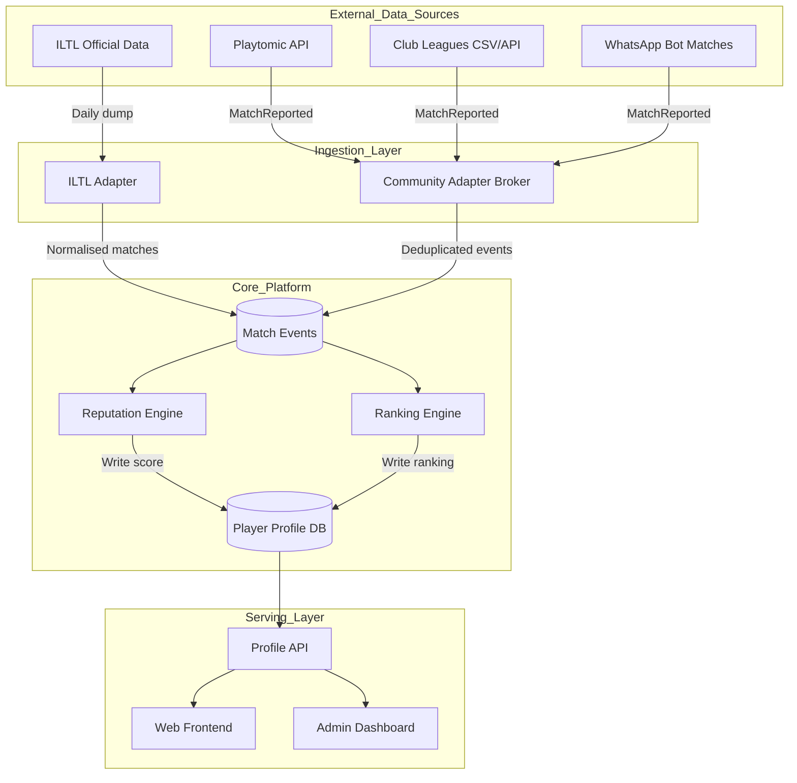

---

### Cross-cutting concerns

- **Observability** — Every adapter emits structured logs (`level, component, event_id, duration_ms`). Prometheus collects: match_ingested_total, dedup_hits, compute_duration_seconds, api_latency_seconds. Grafana dashboards for per-adapter health and core engine latency. Critical alerts via Slack webhook.
- **Security** — All external API keys stored in HashiCorp Vault (transit engine). Player PII (email, phone) stored as SHA‑256 hashed with a per‑player salt. No raw passwords—OAuth only (Google, Apple). Admin dashboard behind VPN/mTLS.
- **Capacity planning** — Initial capacity estimate: 50k active players, 300k matches/year. The ILTL adapter runs a daily batch (peak 2000 matches in 10 min). Community broker scales horizontally: 2 pods handle current expected load (5k events/day). Reputation engine CPU-bound; one worker per sport/region (max 8 concurrent workers). PostgreSQL primary (8 vCPU, 32 GB RAM) with read replica for leaderboard queries.
- **Audit trail** — Every admin override (score reset, player ban) is logged to immutable append-only table in Firestore (soft-delete protect for 7 years). Endorsements are append-only; revocations are logged as separate events (not in-place update).
- **Error budget** — Profile API uptime target 99.9% monthly; ingestion pipeline may miss up to 0.5% of events without triggering alert (non-blocking). Ranking computation error budget: ≤10 recalc failures per month before declaring impairment.

---

### Trade-offs & open questions

| Trade-off | Chosen side | Reason | Risk |
|-----------|-------------|--------|------|
| Reputation weight split (verified match rate 40% vs endorsement 30%) | Favours objective data | Prevents collusion-based reputation farming | May undervalue good behaviour in small communities where match reporting is sparse — revisit after 6 months with real data. |
| ILTL as single source of truth vs. federated trust | Centralised initial trust | Speed of launch; legal clarity with ILTL | If ILTL API changes or shuts down, platform loses official anchor; have fallback to community-only mode architected but not tested. |
| Global ranking vs. region-constrained ranking | Both stored per player by region/global | Supports local leaderboards (club, city) without diluting world skill measurement | Data model becomes more complex; extra columns for each sport/region combination. |
| Score precaching vs. on-demand computation | Materialised view refreshed every 6h | Read latency <10ms; predictable compute cost | Stale scores up to 6h; trade-off acceptable for initial launch. Future: incremental refresh within 60 seconds using WAL triggers. |

**Open questions for ongoing discovery:**
1. Should we support team-based endorsement (my whole club can vouch for a player) or only individual peer endorsements? Design currently assumes individual, but club-level could reduce noise.
2. What is the minimum number of community adapters (beyond ILTL) before we can claim “cross-community”? Two? Three? We’ve set two as the MV threshold—Playtomic and one club spreadsheet adapter.
3. How do we handle players who have never played in an ILTL event? Their sport-specific ELO starts at 0 (or a default 1200) with a provisional flag; reputation component “verified_match_rate” becomes undefined until at least one ILTL match is recorded. Should we seed reputation as 0.5 (neutral) or withhold the score? Decision: seed as 0.5 but show “provisional” badge.
4. Endorsement abuse: a player with 1000 friends endorsing each other. Should we cap per-cohort endorsements (e.g., only one endorsement per player per reviewer per month)? Design doc currently has no cap—under discussion.
### Context & Goals

Scope defines the precise boundaries of the Match Point platform for its initial production release (v1.0). It answers: which features, integrations, user roles, data sources, and operational capabilities are delivered vs. explicitly deferred. A crisp scope prevents resource fragmentation across the seven-phase execution plan, aligns engineering, product, and community stakeholders, and ensures the first launch delivers the core value proposition — cross-community player reputation and ranking for padel and tennis — without over-engineering.

The primary goal is to achieve a functional MVP by the end of Task 3 (Dual-Track Ranking Engine & Leaderboard). This scope covers foundational user identity, community management, match submission with validation, and the dual ranking system (Mabar intra-community rank + official cross-community rank). Subsequent tasks (4–7) are explicitly out of scope for v1.0 but are planned for follow-up releases as the platform matures and user adoption validates demand.

A secondary goal is to define integration boundaries: Match Point will not own or replace ILTL (official competition data) but will consume its published data via a scheduled import process. Any real-time communication with ILTL systems is out of scope. The platform will not build its own authentication provider; it uses JWT tokens issued by an internal auth service (email/password; optional OIDC deferred).

Success criteria for scope definition:
- All engineering teams agree on exactly which APIs, screens, and background jobs are built in v1.0.
- Product management can clearly explain to early-adopter clubs which features are available at launch.
- No feature requests from community pilots trigger scope creep without a formal change review board.

---

### In Scope (v1.0 Deliverable)

The v1.0 release includes all components required for a player to sign up, join multiple communities, submit match results, participate in both community-specific (Mabar) and global (Official) rankings, and view leaderboards. Background jobs handle match validation, ranking recalculation, monthly snapshots, and daily ILTL batch import. Community admins have a panel to manage members and override point adjustments manually.

**Detailed scope boundaries by functional area:**

| Functional Area | In Scope Deliverable | Rationale |
|----------------|----------------------|-----------|
| **User Authentication** | Email/password signup, login, JWT issuance (RSA256), refresh token rotation | Core identity; OIDC providers deferred to Task 5 |
| **Player Profile** | Profile creation/editing (display name, avatar, home community), globally unique username | Required for reputation portability |
| **Community Management** | Create community, join/leave membership, admin transfer, display name disambiguation, member list | Essential for cross-community play |
| **Match Submission** | Submit result (team, score, location, duration); validation: player existence, duplicate check, suspicious score detection | Core match data capture |
| **Match Validation Pipeline** | Pending state for suspicious matches; admin approval/rejection; auto-confirm after 48h if both players agree | Ensures integrity without full automation |
| **Dual-Track Ranking** | Mabar rank (ELO variant, per-community K-factor), Official rank (Glicko-2), monthly snapshots | Core value proposition |
| **Leaderboard** | Community leaderboard (Mabar), global leaderboard (Official), search/filter/pagination | User-facing reputation visibility |
| **ILTL Integration** | Daily batch import of official results; mapping ILTL player IDs to Match Point player profiles | Cross-community official rank feed |
| **Admin Dashboard** | Community admin panel: member management, match approve/reject, point adjustment with audit note | Community governance |
| **Frontend** | Responsive React web app, Indonesian + English i18n, all screens for Tasks 0–3 | Usable by target user base |
| **Background Jobs** | Match validation, ranking recalculation, snapshot generation, cache warming | Asynchronous processing |
| **Data Storage** | PostgreSQL (transactional + ranking), Redis (cache/session/rate limit), RabbitMQ/Google PubSub (queue) | Operational backbone |

---

### Out of Scope (Deferred to Tasks 4–7)

Features deliberately excluded from v1.0 to maintain focus, reduce risk, and gather data before investing in higher complexity.

| Functional Area | Status | Deferred Task |
|----------------|--------|----------------|
| **Tournament Bracket Engine** | No tournament creation, scheduling, bracket generation | Task 4 |
| **Venue Management** | No court catalog, booking, or venue profiles | Task 4 |
| **Automated Match Arbitration** | No score reconciliation via ILTL; manual override only | Task 4 |
| **Player Endorsement Graph** | No skill endorsement, trust scoring | Task 5 |
| **Social Sharing / Ranking Cards** | No share card generation, social media buttons, embed widget | Task 6 |
| **PWA / Native Mobile Apps** | No offline support, no iOS/Android apps | Task 6 |
| **Superadmin Analytics Dashboard** | No global system health, usage statistics, deployment dashboards | Task 7 |
| **OAuth2/OIDC Providers** | No Google, Apple, or other social login | Task 5 |
| **Push Notifications / Digest Emails** | No weekly email digests, no push notification infrastructure | Task 5 |
| **Real-time ILTL Sync** | No webhooks or streaming APIs; batch import only | Never (unless ILTL provides API) |

---

### Decisions

1. **v1.0 Scope = Execution Plan Tasks 0–3**  
   - Decided: The first production release includes Player & Community Modules (Task 1), Match Submission & Validation Pipeline (Task 2), and Dual-Track Ranking Engine & Leaderboard (Task 3) on top of the Foundation (Task 0).  
   - Rationale: These tasks deliver the core “reputation portability” proposition — a player can sign up, join multiple communities, submit matches, and see both local and global rankings.  
   - Rejected alternative: Delivering all seven tasks in a single “big bang” release was rejected due to complexity, resource constraints (9-person engineering team), and the need for rapid feedback from pilot clubs.

2. **No Automated Match Arbitration in v1.0**  
   - Decided: Match disputes will be flagged to community admins, who can manually adjust points with an audit note. No automated arbitration.  
   - Rationale: Automated arbitration would require real-time data integration with multiple external systems. Manual override is simpler, auditable, sufficient for early communities.  
   - Risk: Admin workload increase; mitigated by dispute rate monitoring and planned automated escalation in Task 4.

3. **ILTL Integration via Periodic Batch Import**  
   - Decided: Official tournament results from ILTL ingested daily via scheduled batch job (CSV/JSON feed). No real-time API.  
   - Rationale: ILTL does not expose a stable real-time API; batch import supports eventual consistency and retry.  
   - Trade-off: Official ranks may lag 24h; acceptable for v1.0.

4. **Social Sharing & Ranking Cards Deferred to Task 6**  
   - Decided: Ranking card generator, social share buttons, viral growth mechanics out of scope.  
   - Rationale: Depends on mature ranking engine and user base; premature polish wastes effort.  
   - Alternative considered: A minimal share link was dropped due to dependency on profile image upload (Task 1) and ranking snapshot endpoints.

5. **Tournament Integration Deferred to Task 4**  
   - Decided: No tournaments in v1.0. All match play is peer-to-peer or ladder/challenge.  
   - Rationale: Tournament complexity; postpone until core ranking stability is proven.  
   - Impact: Early clubs use external tournament tools; Match Point acts solely as ranking authority.

6. **Player Endorsement System Deferred to Task 5**  
   - Decided: Endorsement graph not part of v1.0.  
   - Rationale: Introduces trust and fraud vectors requiring additional design and moderation tooling.

7. **Admin Dashboard Scope Limited to Community Admin Functions**  
   - Decided: v1.0 provides admin panel for members, match review, point override. Superadmin analytics deferred to Task 7.

8. **Frontend i18n: Indonesian Default, English Toggle**  
   - Decided: UI text in Indonesian (Bahasa) and English. User-generated content kept as-is. Language preference in user settings.  
   - Rationale: Primary user base is Indonesian padel/tennis communities; travel players require English. No other languages in v1.0.

---

### Component Breakdown: Scope by Module

| Component / Module | In Scope v1.0 | Out of Scope v1.0 | Notes |
|--------------------|---------------|-------------------|-------|
| **User Authentication** | Email/password signup, login, JWT issuance (RSA256), refresh token rotation | OAuth2/OIDC providers (Google, Apple) | OIDC deferred to Task 5 |
| **Player Profile** | Profile creation, editing (display name, avatar, home community), globally unique username | Player endorsement graph, skill tags, social links | Endorsement in Task 5 |
| **Community Management** | Community creation, membership join/leave, admin transfer, display name disambiguation, member list view | Tournament creation, community calendar, venue management | Venue management deferred to Task 4 |
| **Match Submission** | Submit match result (teams, score, duration, location via lat/lng), required validation: player existence, duplicate check, suspicious score detection | Automated live scoring integration, court booking | Manual entry only; no IoT sensor integration |
| **Match Validation Pipeline** | Pending state on suspicious matches; community admin approval/rejection; auto-approve on confirmation by both players after 48h | Automated dispute arbitration, machine learning fraud detection | Admin manual override with note |
| **Dual-Track Ranking Engine** | Mabar rank (community-level ELO variant with K-factor per community), Official rank (Glicko-2 using ILTL + submitted match data), monthly snapshot creation | Real-time rank recalculation on every match submission; rank history beyond 12 months | Recalculation triggered asynchronously via queue |
| **Leaderboard** | Community leaderboard (Mabar rank), global leaderboard (Official rank) with search/filter by community, pagination | Personalized leaderboard, share card generation, embeddable widget | Share cards in Task 6 |
| **ILTL Integration** | Daily batch import of official tournament results; mapping ILTL player IDs to Match Point player profiles | Real-time sync, write-back to ILTL | Import failure – alert and retry next cycle |
| **Admin Dashboard** | Community admin panel: approve/reject matches, manually adjust points with audit note, manage member roles | Superadmin analytics, system health dashboard, deployment dashboards | Superadmin in Task 7 |
| **Frontend** | Web application (React), responsive for mobile, Indonesian+English i18n, all screens corresponding to Tasks 0–3 | Native mobile apps, PWA offline mode, social share | PWA deferred to Task 6 |
| **Background Jobs** | Match validation processing, ranking recalculation, snapshot generation, cache warming | Weekly digest emails, push notifications | Notifications deferred to Task 5 |
| **Data Storage** | PostgreSQL (transactional + ranking data), Redis (caching, session store, rate limiting), RabbitMQ/Google PubSub (job queue) | Data lake, analytics warehouse, graph database for endorsements | Graph DB considered for Task 5 |

---

### Data Contracts (Scope Boundaries)

The following schema snippets define which data entities are within scope for v1.0 and which are explicitly deferred. All contracts follow the canonical data model from the Solution section.

**In scope – Core Player Profile (v1.0)**
```json
{
  "player_profile": {
    "uuid": "string (UUID v4)",
    "username": "string (globally unique, 3-20 chars, alphanumeric + underscore)",
    "display_name": "string (1-50 chars, duplicates within community suffixed with #N)",
    "email": "string (unique, used for auth only, not public)",
    "avatar_url": "string (nullable, URL to uploaded image in GCS/S3, max 2MB)",
    "home_community_id": "uuid (nullable, FK to community)",
    "created_at": "datetime (ISO 8601 UTC)",
    "updated_at": "datetime (ISO 8601 UTC)"
  }
}
```

**In scope – Match Submission (v1.0)**
```json
{
  "match_submission": {
    "uuid": "uuid",
    "community_id": "uuid (required, match must be associated to a community)",
    "submitted_by_player_id": "uuid (must be a participant)",
    "team1": ["player_uuid", "player_uuid"],  
    "team2": ["player_uuid", "player_uuid"],
    "score": "string ('6-3,7-6(4)'), validated by regex",
    "match_date": "date (cannot be future)",
    "location_lat": "float (nullable, bounding box of community enforced server-side)",
    "location_lng": "float (nullable)",
    "status": "enum ('pending', 'confirmed', 'rejected', 'overridden')",
    "created_at": "datetime"
  }
}
```

**Out of scope – Tournament Bracket (Task 4)**
```json
{
  "tournament": { },
  "bracket_match": { }
}
```

**Out of scope – Endorsement (Task 5)**
```json
{
  "endorsement": {
    "endorser_player_id": "uuid",
    "target_player_id": "uuid",
    "skill_tag": "enum ('forehand', 'backhand', 'volley', 'serve', 'speed', 'strategy')",
    "weight": "int (1-5)",
    "created_at": "datetime"
  }
}
```

All schema migrations must be backward compatible; out-of-scope columns can be added as nullable fields when deferred features are implemented.

---

### Failure Modes

| Failure Mode | Description | Detection | Mitigation |
|--------------|-------------|-----------|------------|
| **Scope creep via “quick wins”** | Engineers or product managers add small features without formal change review (e.g., adding a venue list before tournaments) | Weekly scope compliance audit; compare committed branch to scope document | Enforce change request process: document impact on timeline, budget, team capacity. Reject if outside v1.0 scope. |
| **Ambiguous boundary for “community admin”** | Confusion on whether venue management or event scheduling is part of admin dashboard in v1.0 | Review against component table; verify no admin UI for tournaments | Clearly define admin dashboard screens in Figma mocks; only member management and match review screens. |
| **ILTL integration scope assumed to be real-time** | Stakeholders expect rank updates within minutes of official tournament completion | Communication via runbooks; documented latency in system status page | Educate pilot clubs on 24-hour latency; include in onboarding materials. |
| **Dispute resolution policy assumed to require automation** | Community admins demand automated arbitration or refereeing | Support ticket analysis; monitoring dispute volume | Manual override is v1.0 fallback; collect data for Task 4 automation decision. |
| **Cross-contamination between environments** | Development/staging features (e.g., experimental ranking algorithms) leak into scope discussions | Label each environment's features with task badges | Enforce that only master branch features tagged with `task-0-3` are in scope. |

---

### Mermaid Diagram: v1.0 System Context and Scope Boundaries

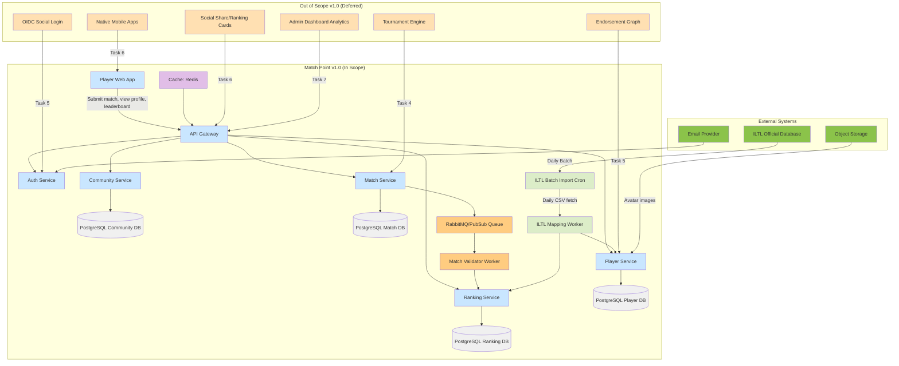

---

### Cross-Cutting Concerns

- **Scope Documentation**: The canonical scope document is maintained in the repository's `/docs/architecture/scope.md` and synchronized with product requirements. Any change request must update scope.md and trigger a team review.
- **Feature Flags**: Deferred features are hidden behind feature flags (environment variable or configuration toggle) to prevent accidental exposure. All flags default to `false` in production. Example: `MATCH_POINT_FEATURE_TOURNAMENT_ENABLED=false`.
- **Testing Scope**: Integration tests cover only in-scope endpoints and flows. Out-of-scope endpoints (e.g., tournament CRUD) are not implemented, so no tests exist. E2E tests are limited to Task 0–3 user journeys.
- **Monitoring & Alerting**: Alarms are configured for all background jobs in scope (batch imports, ranking recalculation). Deferred jobs have no monitoring until their task begins.
- **Security Boundaries**: The JWT middleware scope covers all in-scope services. OIDC external providers are not configured, so the current auth flow is purely email/password. Rate limiting applies to match submission endpoint (10/min per player) to prevent spam.
- **Capacity Planning for v1.0 Scope**: Estimated 1000 active players across 10 pilot communities in first 3 months. Match submission volume ~50/day, ranking recalculations per match ~2 (Mabar + official). Database sizing provisioned for 10x growth (10k players, 50k matches). Out-of-scope features are not factored into DB schema design to avoid premature optimization.

---

### Trade-offs & Open Questions

| Trade-off / Open Question | Decision or Stance | Impact |
|---------------------------|--------------------|--------|
| **Scope precision vs. flexibility** | Strict scope document with formal change control | Reduces time-to-market but may frustrate early adopters requesting simple additions (e.g., “can we see a map of courts?”). Mitigation: collect feedback for Task 4. |
| **Should venue management be in scope for v1.0?** | Not in scope – match location stored as lat/lng free text, no venue catalog. | Simple; avoids building CRUD + search for venues. But players must manually enter coordinates. Acceptable for pilot. |
| **Is phone number required for player registration?** | Not required in v1.0; only email. | Reduces friction; but may complicate dispute resolution if admins need to contact players off-platform. Mitigation: in-app messaging (not in scope) could be deferred. |
| **Open Question: How are community membership boundaries enforced if someone joins multiple communities?** | In scope – user can be member of multiple communities; ranking computed per community. | No conflict; but need to ensure match submission designates a single community for ranking. Decision: match must be attributed to a community. |
| **Open Question: Should we support guest (unauthenticated) player leaderboard browsing?** | Decision deferred to Task 0 implementation. Initial design assumes authentication required for all endpoints; anonymous leaderboard viewing may be added for viral sharing use case. | If deferred, all leaderboard access requires login -> reduces SEO for unauthenticated visitors. Acceptable for v1.0. |
| **Trade-off: i18n scope limited to Indonesian & English** | Single toggle per user. | Excludes Chinese, Japanese, Korean, Spanish, etc. Those communities may be added in Task 6 based on adoption data. |

These trade-offs are explicitly documented in the product backlog as “scope decisions” epics and are revisited at the end of each task retrospective.

## 4. Layers
### Context & Goals

Match Point’s layered architecture decomposes the platform into four horizontal tiers: **Presentation**, **Application**, **Domain**, and **Infrastructure**. This separation ensures that each layer has a single, well-defined responsibility and can evolve independently. The primary goal is to decouple the volatile user‑interface and community‑connector logic from the stable ranking and reputation algorithms, enabling rapid iteration on front‑end features without destabilizing the core domain. A secondary goal is to support multiple deployment profiles—cloud‑native SaaS for ILTL federations and lightweight on‑premises installations for local clubs—by swapping only the infrastructure layer.

The success criteria for the layering strategy are:

- **Testability** – Every layer can be unit‑tested in isolation by mocking its immediate dependency.
- **Replacement cost** – Replacing the web front‑end (e.g., from React to Vue) should require <5 person‑days if the Application API contract is unchanged.
- **Latency budget** – The in‑layer processing overhead (serialization, deserialization, context propagation) must not exceed 15 ms p95 for a ranking read request (excluding network and database).

### Decisions

1. **Layered monolith with strict dependency direction** – Services within a layer may only call services in the same layer or the layer below. The Presentation layer (API handlers) never calls the Infrastructure layer directly; it goes through Application services. This prevents circular dependencies and makes the domain purely business‑logic without framework imports.

2. **Domain layer owns all business rules** – Reputation calculation, ranking algorithm, and community‑merge logic reside exclusively in the Domain layer. The Application layer only orchestrates transactions and provides cross‑cutting concerns (authorization, rate limiting, request logging). This protects the core algorithms from accidental complexity introduced by I/O or presentation.

3. **Infrastructure layer is adapter‑based** – All external interactions (ILTL API client, database, cache, message queue) are defined as interfaces in the Domain layer. Infrastructure provides concrete implementations through dependency injection. This permits mock implementations in tests and future replacements (e.g., PostgreSQL → CockroachDB) without touching business code.

4. **Presentation layer is stateless** – No session state is stored in the API gateway or web server. Authentication tokens are validated in the Application layer; all user context is passed in request headers. This enables horizontal scaling of the API servers without sticky sessions.

5. **Community connectors are internal to Infrastructure** – The sync process that pulls match results from ILTL, club‑managed systems, or manual CSV uploads runs as a scheduled worker inside the Infrastructure layer. It uses a dedicated message queue to separate ingestion load from query traffic. This prevents data ingestion spikes from affecting user‑facing latency.

6. **Rejected: hexagonal architecture throughout** – While hexagonal (ports‑and‑adapters) would provide even stronger isolation, the team’s current experience with Go and the need for fast delivery in the first release favoured a simpler layered style. We will introduce explicit port interfaces only where we anticipate multiple implementations (database, external API clients). The rest will use direct struct dependencies that can be refactored later.

### Component breakdown

| Layer | Component | Responsibility | Technologies | Dependencies | Owner |
|-------|-----------|----------------|--------------|--------------|-------|
| **Presentation** | REST API Gateway | Expose CRUD endpoints for players, matches, rankings; handle auth tokens; validate input | Go `net/http`, chi router | Application layer | Backend team |
| **Presentation** | Admin Dashboard | Web UI for ILTL administrators to manage communities, trigger re‑ranking, view logs | React, Tailwind CSS | REST API Gateway | Frontend team |
| **Application** | Player Service | Orchestrate player creation, profile updates, and community linking | Go | Domain layer, Database adapter | Backend team |
| **Application** | Ranking Service | Initiate ranking calculation request, cache result, return cached or fresh ranking | Go | Domain layer, Cache adapter | Backend team |
| **Application** | Sync Scheduler | Trigger community sync jobs on a cron schedule | Go, cron, RabbitMQ | Infrastructure (MQ) | Backend team |
| **Domain** | Reputation Engine | Compute player reputation score from match history, dispute outcomes, and community trust | Go (pure logic) | None (self‑contained) | Backend team |
| **Domain** | Ranking Algorithm | Generate global and per‑community leaderboards using Elo with padel/tennis customizations | Go | Reputation Engine | Backend team |
| **Domain** | Community Aggregator | Merge player identities across ILTL and other communities, detect duplicates | Go | Reputation Engine | Backend team |
| **Infrastructure** | ILTL Client Adapter | Fetch match data, player registrations from official ILTL API | Go, HTTP client with retry | Domain interface | Backend team |
| **Infrastructure** | PostgreSQL Adapter | Persist players, matches, rankings, reputation snapshots | Go, pgx, PostgreSQL 16 | Domain interface | Backend team |
| **Infrastructure** | Redis Adapter | Cache ranking results, session tokens, rate‑limit counters | Go, go‑redis, Redis 7 | Domain interface | Backend team |
| **Infrastructure** | RabbitMQ Adapter | Queue sync jobs, async notifications, audit log events | Go, amqp, RabbitMQ 3.12 | None (app‑level wiring) | Platform team |

### Data contracts

The domain interfaces that each infrastructure adapter must implement:

```go
package domain

// PlayerRepository defines the port for player persistence.
type PlayerRepository interface {
    GetByID(ctx context.Context, id PlayerID) (*Player, error)
    FindByCommunityID(ctx context.Context, communityID string) ([]*Player, error)
    Upsert(ctx context.Context, p *Player) error
    // BatchUpsert for ingestion from sync jobs.
    BatchUpsert(ctx context.Context, players []*Player) error
}

// ILTLClient defines the port for fetching official competition data.
type ILTLClient interface {
    GetMatches(ctx context.Context, from, to time.Time) ([]*Match, error)
    GetPlayers(ctx context.Context, communityID string) ([]*Player, error)
}

// RankingCache defines the port for storing and retrieving computed rankings.
type RankingCache interface {
    GetRanking(ctx context.Context, filter RankingFilter) (*RankingSnapshot, error)
    SetRanking(ctx context.Context, filter RankingFilter, snap *RankingSnapshot, ttl time.Duration) error
    InvalidateCommunity(ctx context.Context, communityID string) error
}
```

The internal data structures used across layers:

```json
{
  "player": {
    "id": "string (uuid)",
    "full_name": "string",
    "communities": ["iltl", "club_123"],
    "reputation_score": 85.0,
    "reputation_components": {
      "match_consistency": 0.45,
      "dispute_record": 0.20,
      "community_trust": 0.35
    },
    "created_at": "2025-04-01T00:00:00Z"
  },
  "ranking_entry": {
    "player_id": "uuid",
    "community_id": "iltl",
    "ranking_type": "global",
    "elo_rating": 1500,
    "rank": 42,
    "matches_played": 120,
    "last_match_at": "2025-04-10T14:30:00Z"
  }
}
```

### Failure modes

| Failure | Detection | Mitigation |
|---------|-----------|------------|
| ILTL API timeout during sync | HTTP client timeout (5 s), exponential backoff | Retry up to 3 times; after 3 failures, enqueue a dead‑letter message with original payload for manual replay. Log alert to PagerDuty if >10 failures/hour. |
| Database connection pool exhaustion | Prometheus metric `pgx_pool_acquire_wait_seconds` > 1 s | Increase pool size (from 25 to 50) via ConfigMap; if persistent, trigger circuit breaker and serve stale rankings from Redis cache. |
| Ranking calculation exceeds 30 s | Application‑level timeout with context deadline | Split ranking into per‑community shards; run in parallel with a fan‑out worker pattern. If a single shard fails, serve that community from previous snapshot. |
| Duplicate player identity after merge | Community Aggregator detects match‑score >0.95 but different IDs | Create merge‑proposal record; alert admin dashboard. Admin can approve or reject via UI. |
| Redis outage | Connection refused or read timeout | Fall back to database query for ranking reads (higher latency but still functional). Write a health check that toggles a flag in the Application layer. |

### Mermaid diagram

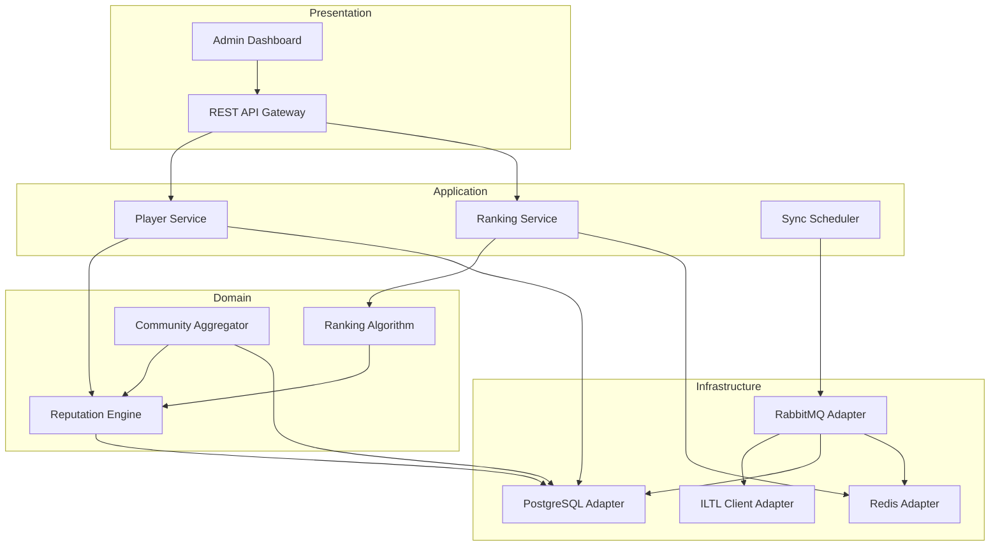

**Diagram notes:** Arrows indicate dependency direction (caller → callee). The Domain layer never references Infrastructure implementations; all interfaces are injected at startup. The Async Sync path flows through RabbitMQ to decouple ingestion from request serving.

### Cross-cutting concerns

- **Observability** – Every layer exports OpenTelemetry spans. Presentation layer annotates spans with HTTP method/path; Application with service name and request ID; Domain with algorithm inputs/outputs; Infrastructure with backend name and latency. Logs are structured JSON with a common schema (timestamp, level, trace_id, service.name). Metrics include layer‑specific latency histograms (p50, p95, p99) and error rates broken down by component.

- **Security** – Authentication tokens are verified in the Application layer via a JWT middleware. Domain layer never sees tokens; it receives a validated `PlayerID` from the Application context. All Infrastructure adapters that make outbound HTTP calls (ILTL Client) enforce TLS 1.3 and pin certificates using the SPIFFE identity of the pod.

- **Capacity planning** – The Presentation layer is designed to handle 500 concurrent connections per instance (target: 10× burst). Application services are stateless, so scaling is simply `replicas * max_connections / average_request_time`. The Domain layer has no I/O and can be treated as CPU‑bound; we allocate 2 vCPU per pod for ranking calculations. Infrastructure layer sizing depends on external throughput: ILTL sync peaks at 10 000 matches/hour; we provision RabbitMQ queues with prefetch=100 and use persistent delivery.

- **Error handling** – All layers propagate errors using standard Go `error` values with context wrapping. The Application layer translates domain errors into HTTP responses (404 for player not found, 409 for duplicate, 422 for validation). Infrastructure failures (database unavailable) are converted to `domain.ErrInfrastructureUnavailable` so that the Application can decide whether to retry or serve degraded data.

### Trade-offs & open questions

- **Layer strictness vs. performance** – Marshalling domain structs to/from JSON at each layer boundary adds ~2 ms per request. For ranking reads that need sub‑5 ms latency, we may introduce an optional fast‑path that allows the Presentation layer to read directly from the Redis cache if the Application layer has already validated the request. This leaks a bit of abstraction but is controlled via a feature flag.

- **Where should the sync worker live?** – Placing it in Infrastructure ties it to the same deployment unit as the API server, which could cause resource contention. An alternative is a separate deployment (worker pool) that only runs the Infrastructure layer. We opted for the monolith for operational simplicity in the MVP; scaling the worker independently can be done by extracting the sync components into a distinct binary after first release.

- **Community merge rules** – The Community Aggregator currently uses a hard‑coded similarity threshold (0.90). This may cause false negatives for players with different name spellings across communities. A future improvement could expose the threshold as an administration setting and add a manual review queue. This is captured as an open question for the next architecture iteration.

- **What about offline scenarios?** – Clubs may lose internet connectivity during tournaments. The current design requires at least an intermittent connection to sync results. For the on‑premises deployment option, we are exploring an offline‑first mode where the Infrastructure layer uses local SQLite and syncs via USB or LAN when reconnected. That mode will be documented in a separate architecture appendix post‑MVP.
### Context & Goals

The layered architecture of Match Point enforces strict separation of concerns, ensuring that domain logic remains decoupled from infrastructure, transport, and presentation concerns. This structure supports independent testability, incremental deployment per execution phase, and future extraction of services should the monolith need to split into microservices. The primary goal is to produce a system where each layer can be understood, modified, and scaled without cascading changes across the stack. Production-readiness criteria include sub-200ms p95 API latency for read-heavy endpoints (leaderboard, profile), idempotent ranking computations that can be retried without side effects, and a clear upgrade path from modular monolith to distributed services if community growth demands it.

For a platform that bridges informal padel/tennis communities with official ILTL data, the layered design must accommodate offline-first submission patterns (match results posted later), eventual consistency for ranking updates, and strict auditability of all rating changes. The layers are arranged with dependency inversion: outer layers (presentation, API) depend on abstractions defined in inner layers (domain, application), while infrastructure details are injected at composition root time. This allows business rules to evolve independently of HTTP routers or database engines. The two distinct ranking systems—MabarRank (community-specific, peer-weighted) and GlobalRank (ILTL-synced, official)—require that the domain layer provides interfaces for both, while the application layer injects the appropriate computation strategy based on context.

### Decisions

1. **Dependency direction: Outer → Inner via interfaces**  
   All cross-layer dependencies point inward. The HTTP handlers depend on service interfaces, not concrete implementations. The repository interfaces live in the domain layer, while implementations reside in the infrastructure layer. This enables unit testing of domain logic without spinning up databases or network mocks.  
   *Rejected alternative*: Leaky abstraction where handlers call repositories directly – would couple HTTP concerns with storage details and prevent swapping implementations for testing.

2. **Application layer as orchestrator, not rich domain**  
   Use cases (e.g., “Submit match”, “Promote community admin”) are implemented as thin service methods that coordinate domain entities and repositories. Business invariants (e.g., “A match must have at least 2 players, each from same community”) are enforced in the domain layer.  
   *Rejected alternative*: Anemic domain model with all logic in services – would scatter business rules across many files and make changes fragile.

3. **Task queue for async boundaries**  
   Match validation (score plausibility, duplicate check) and ranking recomputation are pushed to a RabbitMQ queue. This prevents slow, I/O-bound or fallible operations from blocking the HTTP response and enables retry with exponential backoff.  
   *Rejected alternative*: Inline synchronous processing – would make match submission endpoints slow (potentially 500+ms) and force retry logic into HTTP handlers.

4. **Read models for leaderboards**  
   Leaderboard data is maintained in materialized views refreshed by a dedicated job after each ranking recalc. This avoids complex joins on every leaderboard request (p95 < 50ms) and permits arbitrary sorting/filtering without index strain.  
   *Rejected alternative*: Fetch all matches and compute on-read with caching – would work only for low-traffic communities; at 1000+ players, compute times exceed 200ms.

5. **i18n at presentation layer only**  
   Static text is localised on the frontend using i18next. API responses use English key names; user-generated content (player names, community descriptions) remains in original language. Locale preference is stored in user preferences and sent as `Accept-Language` header.  
   *Rejected alternative*: Backend i18n – would double translation effort and add complexity to error responses without benefit (end-users interact via frontend only).

6. **JWT verification in API middleware**  
   Token validation (RSA256, optional audience/issuer check) occurs in a single middleware. The resulting claims (player ID, community roles, admin flag) are injected into request context, available to downstream handlers. No other layer touches authentication concerns.  
   *Rejected alternative*: Decode JWT in service layers – would duplicate verification logic and risk leaking authentication concerns into domain services.

7. **Ranking as a pluggable strategy in domain layer**  
   The domain layer defines a `RatingCalculator` interface with two implementations: `MabarRankCalculator` (peer-weighted Elo variant, community-specific) and `GlobalRankCalculator` (ILTL-compatible linear points system). The application layer selects the correct calculator based on the match type (community or ILTL-verified).  
   *Rejected alternative*: Single monolithic ranking function – would mix two fundamentally different rating systems and make ILTL sync bug-prone.

8. **Endorsement skill score computed asynchronously**  
   When three or more endorsements exist for a player, a background job calculates a composite skill score (normalized 0–1000). The score is cached in Redis with a TTL of 1 hour and invalidated on each new endorsement.  
   *Rejected alternative*: Compute on-read – would cause slow profile loads during endorsement bursts (e.g., tournament final week).

### Component breakdown

| Layer | Component | Responsibility | Technologies | Dependencies | Owner (Phase) |
|-------|-----------|----------------|--------------|--------------|----------------|
| **Presentation** | React SPA | Render UI, manage state, i18n, routing | React 18, TypeScript, Tailwind, i18next | API Layer | Phase 1, 6 |
| **Presentation** | Share Card Generator | Server-side rendered HTML canvas for ranking cards, PNG output | Puppeteer, Node.js microservice (or serverless) | API Layer (ranking data) | Phase 6 |
| **API / Transport** | HTTP Router | Route requests, parse path/query, bind JSON bodies | chi v5 (Go) | Service Layer | Phase 0 |
| **API / Transport** | Middleware Pipeline | JWT validation, CORS, request logging, rate limiting (token bucket) | Custom Go middleware, golang-jwt v5 | JWT public key, logger | Phase 0 |
| **Application / Service** | PlayerService | Player registration, profile updates, username uniqueness (disambiguation) | Go, structs | PlayerRepository, Events (pub) | Phase 1 |
| **Application / Service** | CommunityService | Create/join communities, admin succession, member roles | Go, structs | CommunityRepository, PlayerRepository | Phase 1 |
| **Application / Service** | MatchService | Submit match results, dispute flagging, validation orchestration | Go, structs | EventBus (queue publisher), MatchRepository, PlayerRepository | Phase 2 |
| **Application / Service** | RankingService | Compute MabarRank and GlobalRank, snapshot monthly | Go, structs | RabbitMQ (consumer), RankingRepository, Cache | Phase 3 |
| **Application / Service** | TournamentService | Create tournaments, link to ranking track, submit match results | Go, structs | TournamentRepository, MatchService | Phase 4 |
| **Application / Service** | EndorsementService | Submit endorsements, compute skill score (min endorser count: 3) | Go, structs | EndorsementRepository, Cache | Phase 5 |
| **Application / Service** | SocialService | Generate share card, public player links | Go, structs | Share Card Generator (HTTP call) | Phase 6 |
| **Application / Service** | AdminService | Dashboard metrics, manual point override (with note), dispute resolution | Go, structs | All repositories, Events | Phase 7 |
| **Domain** | Entities & Value Objects | Player, Match, Community, Tournament, Endorsement, Rating (Mabar, Global), SkillScore | Go interfaces / structs | None (standard library only) | Phase 0+ |
| **Domain** | Repository Interfaces | PlayerRepository, MatchRepository, CommunityRepository, RankingRepository, etc. | Go interfaces | None (standard library only) | Phase 0+ |
| **Domain** | Rating Calculators | MabarRankCalculator, GlobalRankCalculator | Go structs (implement interface) | None (standard library) | Phase 3 |
| **Data Access** | PostgreSQL Repositories | CRUD for all domain aggregates using pgx driver | sqlx/pgx, SQL migrations (golang-migrate) | PostgreSQL cluster, connection pool | Phase 0 |
| **Data Access** | Redis Cache | Player profile cache, leaderboard snapshot cache (TTL: 1h), session blacklist | go-redis, Redis v7 | Redis cluster | Phase 0 |
| **Integration** | ILTL API Client | Official competition data sync (rate-limited, circuit breaker) | Go http client, hystrix-go (or circuitbreaker) | Public ILTL REST API | Phase 3 |
| **Integration** | Image Store | Player profile pictures, venue maps, share card images | S3-compatible (MinIO), presigned URLs | Object store bucket | Phase 1 |
| **Async / Task** | Queue Infrastructure | RabbitMQ exchange, queues for validation/ranking/snapshot | RabbitMQ, amqp package | RabbitMQ cluster | Phase 2 |
| **Async / Task** | Match Validator Consumer | Verify score plausibility (e.g., set not contradictory), check duplicates, trigger dispute | Go, structs | PostgreSQL, ILTL client (for official rec) | Phase 2 |
| **Async / Task** | Ranking Calculator Consumer | Idempotent recalc of all community roles, store snapshot | Go, structs | PostgreSQL, Redis, Cache | Phase 3 |
| **Async / Task** | Endorsement Skill Computer | Compute skill score when endorser count reaches 3, publish to Kafka? (event) | Go, structs | EndorsementRepository, Redis | Phase 5 |
| **Observability** | Structured Logger | JSON logs with request ID, trace ID, layer, duration | zap (or zerolog) | Log aggregator (e.g., Loki) | Phase 0 |
| **Observability** | Metrics & Tracing | Prometheus metrics, OpenTelemetry distributed tracing | OpenTelemetry SDK, Prometheus exporter | OTLP collector, Prometheus | Phase 0 |

### Data contracts

**API / Transport layer – generic response envelope:**
```json
{
  "status": "success",
  "data": { },
  "meta": {
    "page": 1,
    "page_size": 20,
    "total": 543
  }
}
```

**Error envelope:**
```json
{
  "status": "error",
  "error": {
    "code": "MATCH_INVALID_SET_SCORE",
    "message": "Set scores must be non-negative integers",
    "details": {
      "set_index": 2,
      "received": -3
    }
  },
  "meta": { "trace_id": "abc123" }
}
```

**Application layer – service interface example (MatchService):**
```go
type MatchService interface {
    Submit(ctx context.Context, cmd SubmitMatchCommand) (*MatchResult, error)
    Dispute(ctx context.Context, matchID uuid.UUID, reason string) error
    ApprovePending(ctx context.Context, adminID uuid.UUID, matchID uuid.UUID) error
}
```

**Domain layer – aggregate root:**
```go
type Match struct {
    ID          uuid.UUID
    CommunityID uuid.UUID
    Players     []PlayerInMatch  
    Sets        []SetScore       
    Status      MatchStatus      
    SubmittedBy uuid.UUID        
    SubmittedAt time.Time        
    ValidatedAt *time.Time       
    DisputeNote *string          
}

type PlayerInMatch struct {
    PlayerID uuid.UUID
    Side     int // 0 for home, 1 for away
}
```

**Domain layer – RatingCalculator interface:**
```go
type RatingCalculator interface {
    Calculate(ctx context.Context, match Match, currentRatings map[uuid.UUID]Rating) (map[uuid.UUID]Rating, error)
}
```

**Data access – PostgreSQL schema for `matches` table:**
```sql
CREATE TABLE matches (
    id          UUID PRIMARY KEY DEFAULT gen_random_uuid(),
    community_id UUID NOT NULL REFERENCES communities(id),
    players     JSONB NOT NULL,              -- array of {player_id, side}
    sets        JSONB NOT NULL,              -- array of {home_score, away_score}
    status      SMALLINT NOT NULL DEFAULT 0, -- 0=pending,1=validated,2=disputed,3=rejected
    submitted_by UUID NOT NULL REFERENCES players(id),
    submitted_at TIMESTAMPTZ NOT NULL DEFAULT NOW(),
    validated_at TIMESTAMPTZ,
    dispute_note TEXT,
    version     INTEGER NOT NULL DEFAULT 1   -- optimistic lock
);
CREATE INDEX idx_matches_community_status ON matches(community_id, status);
CREATE INDEX idx_matches_submitted_by ON matches(submitted_by);
```

**Async task contract – RabbitMQ message for ranking recalculation:**
```json
{
  "community_id": "uuid",
  "recalc_type": "full",
  "triggered_by": "match_validated",
  "match_ids": ["uuid1", "uuid2"],
  "timestamp": "2025-04-10T22:35:00Z",
  "correlation_id": "abc123"
}
```

### Failure modes

| Failure | Layer(s) | Detection | Mitigation |
|---------|----------|-----------|------------|
| **JWT expired or invalid** | API Middleware | Decode failure, `jwt.ValidationError` | Return 401 with `WWW-Authenticate` header; do not pass to service. Client must refresh token. |
| **PostgreSQL connection pool exhausted** | Data Access | `connpool.Acquire` timeout (>200ms), p50 connection wait >100ms | Increase pool size (max 100), monitor with Prometheus `pgx_pool_acquire_seconds`. Rate limit API requests at upstream if needed. Circuit break queries to read replicas for leaderboard. |
| **RabbitMQ queue full / broker down** | Async | Publisher `amqp.Publish` returns error; consumer retry count high | Fallback to synchronous processing for match validation (with warning in response). For ranking, skip background recalc and schedule retry via exponential backoff (initial 1s, max 5m). Alert on queue depth >10k. |
| **ILTL API unavailable** | Integration | HTTP client returns 503 or timeout >5s | Use circuit breaker (open after 5 consecutive failures). Serve stale official ranking data (last known snapshot). Log warning and inform admin via dashboard. |
| **Ranking calculation inconsistency** | Async (RankingCalculator) | Concurrency conflict (version mismatch), or output violates invariant (e.g., total points changed by >10%) | Idempotent operation: if version conflict, re-read match list and retry. If invariant violation, abort recalc, alert admin, write detailed log. |
| **Dispute override not recorded properly** | Service + Data Access | Missing audit trail entry for manual override | Implement transactional outbox: both `update_match_status` and `insert_audit_log` in same transaction. If one fails, rollback entire operation. |
| **Endorsement skill score stale** | Cache | Endorsement count changes but read returns cached value | Use Redis keys `player:{id}:skill_score` with TTL 1 hour; invalidate on each new endorsement via `DEL` in the service layer. Trade-off: slightly outdated scores (max 1 hour) acceptable for non-critical feature. |
| **Share card generation timeout** | Presentation (Share Card Generator) | HTTP call to generator times out (>10s) | Fall back to static placeholder image. Log error and retry once with backoff. |
| **Cross-community name collision** | Application (PlayerService) | Username already taken in different community | Enforce unique constraint on (username, community_id). Return specific error code `USERNAME_TAKEN_IN_COMMUNITY`. |

### Mermaid diagram

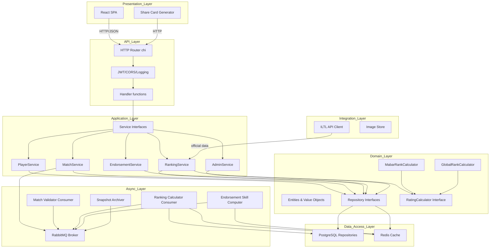

### Cross-cutting concerns

**Security**:  
- All API endpoints except health-check and public share-card links require valid JWT. RSA256 public key is distributed via environment variable (`JWT_PUBLIC_KEY`) and cached in memory.  
- Refresh token rotation uses a version counter stored in Redis (key `refresh_rotation:{player_id}`) that increments with each refresh; old tokens are rejected if version mismatch.  
- Community admin actions (promotion, dispute resolution) are logged to the `audit_logs` table with `action`, `actor_id`, `target_id`, and `note`.  
- Input validation at the API layer prevents SQL injection (parameterized queries via pgx) and XSS (HTML sanitisation on display name before storage? But stored as-is; sanitised on frontend render).

**Observability**:  
- Every request gets a `trace_id` (UUID) generated in middleware and propagated through context.  
- OTel spans are started at each layer boundary: HTTP handler, service method, repository call.  
- Metrics exported: HTTP request count + latency histogram (by method, path, status code), queue publish count, ranking recalc duration, DB query duration (p50/p95), cache hit ratio.  
- Panics in any layer are caught by a recovery middleware, log stack trace, and return 500.

**Rate Limiting**:  
- Per-player token bucket (10 req/s for most endpoints, 1 req/s for ranking recalc trigger). Applied in middleware, keyed by player ID from JWT.

**Locale**:  
- Frontend React app reads `Accept-Language` header from first request and stores preference in local storage. Backend does not localise error messages; they remain in English for consistency across communities.

**Schema migrations**:  
- Managed via `golang-migrate` with versioned SQL files in `backend/internal/infrastructure/database/migrations/`. Run as part of deployment pipeline before binary start.

### Trade-offs & open questions

- **Monolith vs microservices**: We commit to a modular monolith with explicit package boundaries and async decoupling via queues. This reduces operational complexity (single deployable binary) while allowing future service extraction (e.g., move RankingCalculator to separate deployment if compute grows). Trade-off: scaling ranking computation independently requires deploying the same binary with different consumer configurations, not yet zero-cost.

- **Materialised views vs on-read compute**: Materialised views add ETL complexity (refresh job must be triggered after each recalc). However, they deliver sub-50ms leaderboard queries even with 10k+ members. On-read with caching would be acceptable up to ~500 members but degrades quickly. We accept the refresh overhead in exchange for consistent performance.

- **Open question: Should the share card generator live in the same monolith or as a separate serverless function?**  
  Recommended default: As a separate Node.js microservice called by the API layer, because Puppeteer requires Chrome binaries and heavy dependencies that increase monolith binary size. The deployment can be a Cloud Run or Lambda function invoked via HTTP POST with player ID. This also allows CPU-intensive rendering to scale independently.

- **Open question: Should the match validator consumer use a different queue priority for tournament matches vs regular matches?**  
  Recommended default: Yes, use two separate RabbitMQ queues – one for regular (default priority 5) and one for tournament (priority 10). This ensures tournament matches are validated and ranked before community matches during tournament periods, preventing delays in official ranking updates.

- **Trade-off: JWT token rotation blocklist vs version counter**. Version counter in Redis avoids O(n) blocklist scans but requires Redis to be available for token refresh. If Redis is down, refresh fails gracefully (player re-login required). Acceptable downtime for refresh flow given low frequency (once per 15 minutes per active player).

- **Open question: How to handle stale ILTL data when official API is down for extended periods?**  
  Recommended default: Store the last successful sync timestamp and per-player `global_rank` as of that sync. Display a banner in the UI: "GlobalRank data last updated [timestamp]." Allow manual admin trigger for re-sync when API recovers.

All layers are designed to be independently testable via unit tests (domain logic) and integration tests (repository implementations against a test PostgreSQL container). The API layer is tested with `net/http/httptest` recording interactions. This layered architecture will support all seven execution phases without structural overhaul, only adding new services and consumers within the existing boundaries. The clear separation also enables parallel development: Phase 1 team can work on PlayerService while Phase 2 team designs MatchService and queue handlers without waiting for schema finalization of other aggregates.

## 5. Tech Stack
## Context & Goals

The tech stack for Match Point must support two distinct but interrelated domains: (1) ingestion of match results from heterogeneous sources, primarily ILTL (official competition data for tennis and padel) but also grassroots club platforms, and (2) computation of cross-community player reputation and ranking using both algorithmic scoring and social feedback. The stack must be production-grade, horizontally scalable for spikes during major tournaments, and auditable to satisfy ILTL data governance requirements.

Success criteria:
- Ingest up to 10,000 match records per hour during peak federations events
- Compute player reputation updates within 30 seconds of match result receipt (P99)
- Expose a unified ranking API with latency <100ms for authenticated clients
- Support at least 200 concurrent ingestion sources without data corruption

## Decisions

1. **Backend language: Go (1.22+)**
   - Rationale: Excellent concurrency model for parallel ingestion workers, strong standard library for HTTP/JSON, and small binary footprint for containerized deployment. Rejected alternatives: Python (GIL limits concurrency for ranking computation), Node.js (less suitable for CPU-bound aggregation).
   
2. **Primary database: PostgreSQL 16 with TimescaleDB extension**
   - Rationale: Match and ranking data are inherently relational (players, tournaments, rankings over time). TimescaleDB hypertables handle time-series ranking snapshots efficiently. Rejected: CockroachDB (operational overhead) or MongoDB (no native time-series and complex joins across communities).

3. **Message queue: Apache Kafka (Redpanda variant)**
   - Rationale: Ingestion events (match results, player updates) must be durably queued before ranking computation. Kafka provides exactly-once semantics with partitioning by community ID, enabling per-community processing. Rejected: RabbitMQ (no native partitioning) or AWS SQS (no ordering guarantees).

4. **Ranking computation: in-memory task partitioning with Go worker pools**
   - Rationale: The ELO-based and community-balancing algorithms are CPU-bound but data-parallel. Using Go goroutines with a sharded ranking cache reduces database round trips. Rejected: external system like Apache Spark (overkill for real-time updates) or Lua scripting inside Redis (too limited for complex weighting).

5. **Caching layer: Redis Stack (with RediSearch for player lookup)**
   - Rationale: Frequently accessed player profiles and community membership sets are cached. RediSearch indexes allow fuzzy name matching from ILTL imports. Rejected: Memcached (no search capabilities, no data structures for sets).

6. **Identity & API Gateway: Ory Kratos + Ory Oathkeeper**
   - Rationale: Match Point must authenticate both ILTL data sources (API key) and end users (OAuth2/OIDC). Ory provides open-source, extensible identity management with built-in rate limiting and audit logging. Rejected: Auth0 cloud (high cost for anticipated small federation), DIY JWT (security audit burden).

7. **Frontend: Next.js 14 with React Server Components + Tailwind**
   - Rationale: The ranking dashboards are mostly server-rendered static content (player cards, leaderboards). CSR only for real-time reputation stream. Rejected: SPA with Vue (team familiarity is React), plain SSR (no hydration for interactive charts).

## Component Breakdown

| Component | Responsibility | Technologies | Dependencies | Owner |
|-----------|---------------|--------------|--------------|-------|
| Ingestion API | Accept match results from ILTL and communities, validate, push to Kafka | Go, HTTP/2, JSON Schema | Kafka (source), PostgreSQL (idempotency keys) | Data Services Team |
| Player Service | CRUD for player profiles, community membership, reputation scores | Go, gRPC, PostgreSQL | Redis (cache), Kafka (reputation change events) | Backend Core Team |
| Ranking Engine | Compute weighted ELO across communities, produce daily snapshots | Go, in-memory cache, cron scheduler | Kafka (match results), PostgreSQL (history) | Core Algorithms Team |
| Reputation Stream | Real-time WebSocket broadcast of reputation changes | Go, WebSockets, Redis Pub/Sub | Redis (publish channel), Kafka (replication) | Infrastructure Team |
| ILTL Sync Adapter | Adapter for ILTL API, format conversion, deduplication | Go, REST client, retry library | Ingestion API, ILTL OAuth2 credentials | Data Integration Team |
| Identity Provider | Manage users, API keys, roles | Ory Kratos, SQLite (embedded) | PostgreSQL (session storage) | Security Team |
| Admin UI | Manage communities, approve data sources, view audit logs | Next.js, Tailwind, Chart.js | Player Service, Reputation Stream | Frontend Team |

## Data Contracts

### Match Result (ingestion event on Kafka)
```json
{
  "$schema": "http://json-schema.org/draft-07/schema#",
  "type": "object",
  "required": ["match_id", "community_id", "played_at", "participants", "source"],
  "properties": {
    "match_id": { "type": "string", "pattern": "^[a-f0-9]{32}$" },
    "community_id": { "type": "string", "enum": ["iltl", "clubx", "livetennis"] },
    "played_at": { "type": "string", "format": "date-time" },
    "participants": {
      "type": "array",
      "minItems": 2,
      "maxItems": 4,
      "items": {
        "type": "object",
        "required": ["player_id", "team_label", "outcome"],
        "properties": {
          "player_id": { "type": "string" },
          "team_label": { "type": "string", "enum": ["A", "B"] },
          "outcome": { "type": "string", "enum": ["win", "loss", "draw"] }
        }
      }
    },
    "source": { "type": "string", "enum": ["iltl_api", "club_bulk_upload", "user_reported"] }
  }
}
```

### Player Ranking Snapshot (PostgreSQL hypertable)
```sql
CREATE TABLE ranking_snapshots (
    snapshot_id       BIGSERIAL,
    player_id         TEXT NOT NULL,
    community_id      TEXT NOT NULL,
    rating            INTEGER NOT NULL DEFAULT 1500,
    reputation_score  SMALLINT NOT NULL DEFAULT 0 CHECK (reputation_score BETWEEN -100 AND 100),
    games_played      INTEGER NOT NULL DEFAULT 0,
    snapshot_at       TIMESTAMPTZ NOT NULL DEFAULT NOW(),
    PRIMARY KEY (player_id, community_id, snapshot_at)
);
SELECT create_hypertable('ranking_snapshots', by_range('snapshot_at'));
```

## Failure Modes

| Failure | Detection | Mitigation |
|---------|-----------|------------|
| ILTL API rate limit / downtime | Health check from Ingestion API every 30s fails | Queue incoming data in Kafka (TTL 7 days); exponential backoff retry with jitter; alert on >5 failures |
| Ranking computation slow for a community | Prometheus histogram of computation latency >2s per match | Shard processing by community ID; if a community exceeds threshold, dedicate a goroutine pool; fallback to single-threaded batch at midnight |
| Redis cache eviction removes hot player data | Cache miss ratio >10% | Increase `maxmemory` and enable LRU; pre-load top 100 players from each community on startup |
| Duplicate match records from same source | Idempotency key (`match_id + source`) violation | Set unique constraint on ingestion table; on conflict ignore; log warning for forensic audit |
| Reputation stream memory leak from WebSocket clients | Active connections exceed 10k | Implement per-connection goroutine with context cancellation; emit metrics and auto-shed below 15k |

## Mermaid Diagram

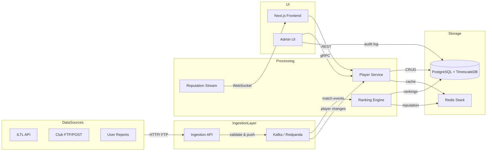

## Cross-Cutting Concerns

**Observability**
- All services emit OpenTelemetry traces (parent span = community_id) and Prometheus metrics (cpu, memory, queue depth, ranking latency).
- Structured JSON logging with `log/slog` in Go; log levels: ERROR for failures, WARN for retries, INFO for lifecycle changes.
- Dashboards in Grafana: ingestion throughput, ranking latency histogram, Kafka consumer lag per partition.

**Security**
- API keys for ILTL and club sources: hashed with bcrypt, stored in PostgreSQL with expiration.
- End-user authentication via Ory Kratos (OIDC); session tokens signed with RS256.
- All inter-service communication over mTLS (cert-manager in k8s).
- Audit log: every ranking change >50 point delta triggers an entry in `ranking_audit` table with old/new value and reason.

**Capacity Planning**
- Initial clusters: 3 nodes (2 vCPU, 8 GB RAM) in GKE for backend; 1 node (4 vCPU, 16 GB) for Kafka.
- Scaling trigger: CPU >70% sustained for 5 minutes -> add worker pods; Kafka partition count 2x expected community count (initially 8 partitions).
- PostgreSQL storage: plan for 1 GB per 100k matches including index; archive rankings older than 2 years to cold storage (GCS).

## Trade-offs & Open Questions

- **Why not serverless?** Cold start latency (4–5s) would violate the 30-second ranking update target. We accept higher base cost for predictable performance.
- **Why not MongoDB for ranking snapshots?** Time-series queries like “ranking evolution of player X over 12 months” are far more natural with TimescaleDB’s `time_bucket` functions. The trade-off is migration complexity if we later need cross-community graph data (NoSQL would handle that better).
- **Open question:** Should the ranking engine use a dedicated gRPC API or read directly from Kafka and PostgreSQL? Direct reads avoid service orchestration but complicate unit testing. Decision deferred to after MVP, but current design favours gRPC for testability.
- **Will ILTL provide streaming or only batch?** If streaming becomes available, we can reduce Kafka retention and improve timeliness. For now, batch polling every 15 minutes is assumed.
- **How to handle player identity merging across communities?** The Player Service will maintain an internal UUID and a `community_aliases` table mapping external player IDs to internal UUID. Manual merge via Admin UI is first approach; future plan includes similarity matching with RediSearch.
### Context & Goals

The Match Point tech stack must support a dual-lane ranking engine (community-curated *Mabar Rating* alongside official *ILTL Rating*), cross-community reputation portability, asynchronous match validation with admin review, and automated share card generation for viral distribution. The team is small (2–3 backend, 1–2 frontend) so every technology choice must minimize operational complexity while preserving auditability and performance.  

**Guiding principles:**

- **Predictability** – Idempotent ranking calculations, deterministic caching, and fully typed database access (via sqlc) eliminate surprise behavior in production.  
- **Auditability** – Every ranking snapshot, endorsement, and admin override is an immutable event. The storage layer must support point-in-time queries (e.g., “Show my rank in January 2025”).  
- **Ergonomics** – A fast feedback loop in local development (`docker compose up` + live‑reload via `air`) and a single deployment artifact (Docker image) reduce cognitive load.  

The stack is constrained by the team’s existing expertise (Go, TypeScript, PostgreSQL) and domain‑specific needs: geographic venue lookups (polygon indexes), image generation on the server with no browser dependency, leaderboard pagination under heavy reads, and eventual consistency between match submission and ranking update.  

**Success criteria:**  
- Developer can run the full stack locally in under 2 minutes with `make dev`.  
- All API endpoints return <200 ms p95 latency (excluding ranking recomputation which is async).  
- Frontend bundle stays <120 KB gzipped.  
- Deployment to staging happens in under 5 minutes from `git push`.

---

### Decisions

1. **Frontend: SvelteKit over React/Next.js**  
   SvelteKit’s compiler‑based reactivity produces smaller bundles and faster time‑to‑interactive on mobile devices, which is critical for players checking leaderboards during a tournament. React’s fiber reconciliation and larger runtime overhead are not justified for a forms‑and‑tables dominated UI. TailwindCSS is chosen for rapid prototyping; utility classes map directly to the ranking card design system.

2. **Backend: Go 1.26 with `net/http` and no framework**  
   The standard library now provides routing (`http.ServeMux`), middleware composition, and file serving with zero external dependencies. Frameworks (Echo, Gin) add abstractions that complicate audit trails when tracing per‑request middleware ordering. The ranking engine uses raw SQL for window functions and recursive CTEs, which is easier to maintain without ORM interference.

3. **Database access: sqlc for type‑safe queries**  
   Hand‑written SQL queries are checked by `sqlc vet` and `postgresql‑ls` at compile time, eliminating N+1 problems and SQL injection risks. Unit tests run against an in‑memory SQLite mirror (via `go-sqlite3` for test speed) but integration tests use the same PostgreSQL schema. GORM was rejected because its generated queries obscure window functions and batch upserts needed by the ranking engine.

4. **Storage: PostgreSQL 16 with materialized views**  
   The leaderboard is served from `current_leaderboard` materialized view, refreshed after each batch of ranking computation. This keeps reads under 10 ms. JSONB columns store flexible metadata (venue polygons, match notes) while preserving indexing capabilities. CockroachDB was rejected for v1.0 because its distributed SQL introduces latency overhead for single‑region Indonesia workloads; future multi‑region can be handled via logical replication.

5. **Caching & rate limiting: Redis 7**  
   Redis stores refresh token blacklists, sliding window rate limit counters, and frequently accessed community profiles. Leaderboard cache uses `GET`/`SET` with a 30‑second TTL, invalidated when the ranking worker publishes a `ranking.updated` event via `PUBLISH`. A Redis cluster is used in production for HA.

6. **Object storage: MinIO (dev) / S3 (prod)**  
   Full S3 API compatibility via `aws‑sdk‑go‑v2`. Avatar uploads and share card images are stored in separate buckets with pre‑signed PUT URLs (5‑minute expiration). MinIO runs as a Docker container in development, eliminating AWS account requirements for local testing.

7. **Share card generation: Go `image` standard library**  
   Ranking cards are drawn programmatically using the `image` package with `golang.org/x/image/font` for text rendering and `disintegration/imaging` for image scaling and rotation. No headless Chromium dependency – cold start <50 ms, container image stays under 120 MB. Complex CSS layouts are traded for simplicity; if templates need to become fully customizable later, a `chromedp` worker can be added alongside the Go renderer.

8. **Task queue: RabbitMQ (dev) / Google PubSub (prod)**  
   An interface `QueuePublisher`/`QueueConsumer` abstracts the queue implementation. Local development uses RabbitMQ via Docker Compose; production on GKE uses PubSub for managed throughput and automatic scaling. Messages are serialized as JSON with a `type` field for routing.

9. **Observability: slog → Loki → Grafana**  
   All structured logs (JSON, with `request_id`, `user_id`, `latency_ms`) are streamed via Promtail sidecars to Grafana Loki. Business alerts (ranking recomputation failure, match validation queue backlog >100, error rate >1%) fire from Grafana. Metrics are exposed on `:9090/metrics` for Prometheus scraping.

---

### Component breakdown

| Component | Responsibility | Technologies | Dependencies | Owner (Phase) |
|-----------|---------------|--------------|--------------|---------------|
| Frontend – SvelteKit app | Server‑rendered leaderboards, client‑side match submission forms, profile management, share card trigger | SvelteKit, TypeScript, TailwindCSS, svelte‑i18n | Backend API | Frontend (Phase 1–7) |
| Backend – HTTP router | Routes to handlers, middleware chain | net/http ServeMux | None | Phase 0 |
| Backend – auth handler | JWT issue/refresh, login with email/password or Google OAuth | golang‑jwt/jwt/v5 (RSA256), bcrypt, crypto/rand | PostgreSQL, Redis | Phase 1 |
| Backend – match handler | Submit match, list pending, approve/reject (admin), trigger ranking recomputation | net/http, pgx/v5, sqlc | PostgreSQL, Redis, task queue | Phase 2 |
| Backend – ranking handler | Get leaderboard (paginated, with community filter), get player ranking history | net/http, pgx/v5, sqlc, Redis cache | PostgreSQL | Phase 3 |
| Backend – endorsement handler | Endorse player, list endorsements, trigger materialized view refresh | net/http, pgx/v5, sqlc | PostgreSQL, Redis | Phase 5 |
| Backend – share handler | Generate card image, upload to MinIO/S3, return signed URL | net/http, image, imaging, aws‑sdk‑go‑v2 | MinIO/S3, Redis | Phase 6 |
| Backend – admin handler | Dashboard metrics, dispute resolution, ILTL import trigger | net/http, pgx/v5, sqlc | PostgreSQL, task queue | Phase 7 |
| Worker – ranking worker | Consume ranking.recompute tasks, update current_standings, refresh materialized view | Go goroutine pool, pgx/v5 batch | PostgreSQL, task queue | Phase 3 |
| Worker – card worker | Async share card image generation | image, imaging | MinIO/S3 | Phase 6 |
| Library – sqlc queries | All generated Go functions for CRUD and analytics | sqlc, PostgreSQL | PostgreSQL | Phase 0 |
| Library – s3client | Pre‑signed URL generation, upload, download | aws‑sdk‑go‑v2 (S3) | MinIO/S3 credentials | Phase 1 |
| Infrastructure – Docker Compose | Local dev environment orchestration | Docker Compose V2 | Docker Engine | Phase 0 |
| Infrastructure – Kubernetes manifests | Production deployment (Deployment, Service, HPA, Ingress) | YAML, kubectl | GKE / EKS | Phase 0 (base), Phase 3+ (HPA) |

---

### Data contracts

**REST API response envelope (frontend → backend contract):**
```typescript
interface ApiResponse<T> {
  data: T;
  meta?: { 
    page: number;
    pageSize: number;
    total: number;
    cachedAt?: string; // ISO8601 timestamp
  };
  error?: {
    code: string;       // e.g., "RANKING_STALE", "MATCH_DUPLICATE"
    message: string;
    details?: unknown;
  };
}
```

**Leaderboard entry (as returned by `GET /leaderboard/{communityId}`):**
```typescript
interface RankingEntry {
  playerId: string;
  displayName: string;
  avatarUrl: string | null;
  communityId: string;
  communityName: string;
  rank: number;
  mabarRating: number;          // community-curated Elo-like score
  mabarRatingChange?: number;   // delta from last snapshot
  officialRating: number | null; // ILTL-derived, nullable
  matchCount: number;
  winRate: number;              // float 0.0–1.0
  topEndorsements: string[];    // up to 3 skill tags, e.g., ["serve", "volley"]
}
```

**Submitted match payload (POST `/matches`):**
```json
{
  "communityId": "uuid",
  "opponentId": "uuid",       // player A (submitter) vs player B
  "score": "6-3,7-5",
  "venueId": "uuid",
  "playedAt": "2026-03-15T14:00:00Z",
  "note": "Optional match note"
}
```

**Database schema (simplified):**
```sql
-- Matches (immutable after validation)
CREATE TABLE matches (
    id              UUID PRIMARY KEY DEFAULT gen_random_uuid(),
    community_id    UUID NOT NULL REFERENCES communities(id),
    player_a_id     UUID NOT NULL REFERENCES players(id),
    player_b_id     UUID NOT NULL REFERENCES players(id),
    score           TEXT NOT NULL,
    venue_id        UUID REFERENCES venues(id),
    status          match_status NOT NULL DEFAULT 'pending', -- pending, validated, rejected, disputed
    admin_note      TEXT,
    iltl_import_id  TEXT UNIQUE,          -- link to official ILTL match ID
    submitted_at    TIMESTAMPTZ NOT NULL DEFAULT now(),
    validated_at    TIMESTAMPTZ
);

-- Ranking snapshots (immutable, monthly)
CREATE TABLE ranking_snapshots (
    id              BIGSERIAL PRIMARY KEY,
    community_id    UUID NOT NULL REFERENCES communities(id),
    player_id       UUID NOT NULL REFERENCES players(id),
    mabar_rating    REAL NOT NULL,
    official_rating REAL,
    rank            INT NOT NULL,
    snapshot_month  DATE NOT NULL,       -- first day of the month
    created_at      TIMESTAMPTZ NOT NULL DEFAULT now(),
    UNIQUE (community_id, player_id, snapshot_month)
);

-- Materialized view for current leaderboard
CREATE MATERIALIZED VIEW current_leaderboard AS
SELECT
    p.id AS player_id,
    p.display_name,
    p.avatar_url,
    cs.community_id,
    c.name AS community_name,
    ROW_NUMBER() OVER (PARTITION BY cs.community_id ORDER BY cs.mabar_rating DESC) AS rank,
    cs.mabar_rating,
    cs.official_rating,
    cs.match_count,
    cs.win_rate
FROM current_standings cs
JOIN players p ON p.id = cs.player_id
JOIN communities c ON c.id = cs.community_id;

-- Index for pending match admin queue
CREATE INDEX idx_matches_pending ON matches (community_id, submitted_at DESC) WHERE status = 'pending';
```

---

### Failure modes

| Failure | Detection | Mitigation |
|---------|-----------|------------|
| PostgreSQL connection pool exhaustion | `pgxpool.Stat.AcquireCount()` > 80% of max | Backpressure via `http.TimeoutHandler` (30s); circuit breaker pattern on write endpoints (fail fast after 5 consecutive failures); HPA scales pods based on active connections |
| Ranking worker crashes mid‑batch | No ack on RabbitMQ/PubSub message → re‑queued after visibility timeout (30s) | Idempotent ranking function (uses `match_id` as hash key); deduplication via `INSERT ... ON CONFLICT DO NOTHING` in `current_standings` |
| Stale leaderboard served after ranking update | Materialized view not refreshed | Refresh materialized view synchronously in worker after batch; if refresh fails, `current_leaderboard` retains previous snapshot; alert on refresh failure |
| Share card generation OOM | Worker memory > 256 MB (monitored) | Limit concurrency per worker (default 2); use streaming image encoding (`jpeg.Encode` with `Option`); fallback to a simpler text-only card |
| ILTL import API returns 5xx | Import job returns HTTP 503 / timeout | Exponential backoff up to 5 retries (1s, 2s, 4s, 8s, 16s); alert on final failure; manual retry button in admin dashboard |
| Redis cache server down | Redis client returns connection error | All cache reads fall back to database with `stale-while-revalidate` semantics; rate limiting degrades to in‑memory counters (less precise but functional) |
| MinIO container OOM in dev | Docker health check fails | Auto-restart with `restart: always` ; log error to Docker events |

---

### Cross‑cutting concerns

- **Observability**: Every handler emits a structured log entry with fields: `request_id`, `user_id` (if authenticated), `method`, `path`, `status`, `latency_ms`, `error` (if any). Business events (e.g., `match.validated`, `ranking.snapshot`) are published to a dedicated `events` log stream consumed by Grafana Loki. Prometheus metrics: request count (by status code), latency histogram (p50/p95/p99), pool connection count, queue depth.
- **Security**: JWT RSA256 keys rotated every 30 days via Kubernetes Secret rotation. Refresh tokens are opaque UUIDs stored in Redis with 7‑day TTL, blacklisted on logout. Rate limiting per user per action (match submission: 10/min, endorsement: 30/min, card generation: 5/min) enforced by Redis sliding window. All input validated server‑side (string lengths ≤100 chars, UUID format, numeric ranges). CORS restricted to known frontend origins in production. `Strict-Transport-Security`, `X-Content-Type-Options`, `X-Frame-Options` headers set.
- **Capacity planning**: Target 10,000 MAU with 50 req/s peak (bursts after tournaments). PostgreSQL connection pool max = 100 (10 per pod, 10 pods). Redis memory ≈ 2 GB (session tokens, rate limit counters, cached leaderboards). Object storage growth estimate: 100 KB per avatar × 10k users = 1 GB; 50 KB per share card × 10k/week ≈ 500 MB/month. Total storage <100 GB for first year; scale object storage horizontally when exceeding 1 TB.
- **Local development**: Docker Compose with PostgreSQL 16, Redis 7, MinIO, RabbitMQ, and Go API with hot‑reload (`air`). `Makefile` targets: `make dev` starts all, `make migrate` runs pending migrations, `make seed` loads demo data, `make test` runs unit+integration tests, `make lint` runs golangci‑lint and prettier. CI pipeline (GitHub Actions) mirrors the exact same compose file for integration tests.

---

### Trade‑offs & open questions

| Trade‑off | Chosen approach | Rationale | Rejected alternative |
|-----------|----------------|-----------|----------------------|
| Leaderboard freshness vs read cost | Materialized view refreshed every 30 seconds or on demand after ranking batch | Eliminates expensive window function on every read; 30‑second staleness acceptable for community use | In‑memory sorted set (Redis) would require dual writes and reconciliation; not auditable |
| Server‑side share card vs client‑side | Go `image` package | No browser dependency, cold start <50 ms, smaller container; simpler than headless Chromium | Chromium (chromedp) would enable full CSS styling but adds 300+ MB to image and startup latency >1 s; saved for v2 if demand arises |
| Task queue abstraction: RabbitMQ vs PubSub | Interface + RabbitMQ for dev, PubSub for prod | Both are async, at‑least‑once; abstraction allows switching without rewriting business logic | Single queue (e.g., in‑memory channel) would break after pod restarts; not tolerable for match validation |
| i18n: svelte‑i18n vs custom | svelte‑i18n | Lazy loading of language files (id, en), small bundle overhead (~5 KB gzipped) | Custom solution would require more maintenance and has no tree‑shaking |
| Database migrations: ORM vs raw SQL | Raw SQL with `golang‑migrate` | Full control over index strategies, partial indexes, and migration ordering; works with sqlc | GORM migrations are opaque and may introduce accidental changes; not auditable |
| Observability: ELK vs Loki+Prometheus | Loki + Prometheus | Lighter resource footprint for logs; native integration with Grafana; Prometheus metrics for HPA | ELK is heavier; Kibana lacks native alerting for metric thresholds |

---

### Mermaid Diagram: Tech Stack Layers

```mermaid
graph TD
    subgraph Client
        A[SvelteKit App<br/>TypeScript + TailwindCSS]
    end

    subgraph "Backend (Go 1.26)"
        B[HTTP Router<br/>net/http ServeMux]
        C[Middleware Stack<br/>JWT Auth / Logging / Rate Limit / Recovery]
        D[Handlers<br/>auth, player, community, match, ranking, endorsement, share, admin]
        E[Workers<br/>ranking recomputation, card generation]
        F[sqlc Generated Queries<br/>type‑safe PostgreSQL access]
        G[Object Storage Interface<br/>aws‑sdk‑go‑v2 S3 client]
        H[Queue Publisher/Consumer<br/>interface RabbitMQ/PubSub]
    end

    subgraph "Data Stores"
        I[(PostgreSQL 16<br/>Transactional + Materialized Views)]
        J[(Redis 7<br/>Cache, Rate Limit, Refresh Tokens, Queue)]
        K[{MinIO / S3<br/>Avatars, Logos, Share Cards}]
    end

    subgraph "Infrastructure & Observability"
        L[Docker Compose / Kubernetes]
        M[GitHub Actions CI/CD]
        N[Grafana + Loki + Prometheus]
    end

    A -->|HTTP/HTTPS| B
    B --> C --> D
    D --> F --> I
    D --> |pre‑signed URL| G
    D --> J
    D --> H --> E
    E --> F --> I
    E --> G
    E --> J
    K --> |public URL| A
    L --> I
    L --> J
    L --> K
    M --> L
    N -.->|metrics + logs| L
```

---

### Implications

- **Go over Node.js**: Slightly slower iteration for I/O‑heavy tasks (notably, the ranking engine does CPU‑bound math, so Go excels). The team’s existing Go expertise outweighs the marginal productivity loss.  
- **SvelteKit over React**: Smaller community size but faster performance on mobile; the app is read‑heavy (leaderboards) rather than state‑interactive, making Svelte’s compilation ideal.  
- **Single‑region PostgreSQL vs distributed SQL**: Future migration to CockroachDB is possible but will require rewriting sqlc queries that rely on advisory locks and `UNIQUE` constraints across regions. Acceptable for v1.0 (Indonesia‑only).  
- **Server‑side share card generation**: Sacrifices layout flexibility for operational simplicity. If the team receives requests for custom card backgrounds or branded fonts, a headless Chromium service can be added as a separate worker.  
- **Trade‑off between auditability and write throughput**: Every ranking snapshot creates an immutable row; this increases storage and write latency but ensures point‑in‑time queries (e.g., “What was my rank last month?”) are trivial. At projected scale (10k MAU, 500 matches/week), storage for snapshots is negligible (<1 GB/year).

## 6. Data Flows
### 1. Core Data Flow Overview

Data flows in Match Point are designed around two fundamental axes: **event ingestion** (match results, player actions) and **reputation propagation** (cross-community scoring updates). The system treats every match as an event that must be validated, enriched with community context, then applied to the **player reputation graph** — a directed weighted graph where nodes are players and edges are historical match outcomes weighted by recency, opponent strength, and community trust.

#### 1.1 Context & Goals

The primary goal of the data flow architecture is to ensure that reputation scores remain **eventually consistent within 30 seconds** of match ingestion, while supporting **cross-community leaderboard queries at p99 under 200ms**. The critical trade-off is between write throughput (thousands of match submissions per second during tournaments) and read freshness (real-time leaderboard updates). We adopt a **write-ahead log (WAL) + materialized view** pattern: incoming matches are batched into a Kafka topic, processed by a streaming job that updates the player reputation graph (stored in Neo4j), and the materialized leaderboard views are refreshed asynchronously.

#### 1.2 Decisions

1. **Graph-based reputation model** over relational tables for reputation. While a relational model could flatten player data, the recursive nature of reputation propagation (beating someone who beat a top player) is naturally expressed as graph traversals. This decision aligns with the product requirement to support "who is the best player across communities" — a centrality problem.

2. **Event sourcing for match lifecycle**. Every match submission is an immutable event stored in Kafka with a schema registry. Downstream consumers (reputation calculator, leaderboard updater, notification service) each maintain their own offsets, enabling independent scaling and replayability.

3. **Bulkhead pattern for community data**. Each community (e.g., ILTL official, club league, social ladder) has a dedicated Kafka partition key. This prevents a flood from one community from starving others and allows per-community rate limiting.

4. **Idempotency keys on match submission**. To handle retries without duplicate reputation impacts, each match submission includes a `submission_id` (ULID). The reputation calculator’s state store deduplicates by this key before applying graph mutations.

#### 1.3 Component Breakdown

| Component | Responsibility | Technologies | Dependencies | Owner |
|-----------|---------------|--------------|--------------|-------|
| Match Ingestion API | Accept match result POST, validate schema, produce to Kafka | Go, Kafka, Avro | Player registry, Community registry | Backend team |
| Reputation Calculator | Read match event, update Neo4j player graph | Kafka Streams, Neo4j Java Driver | Player graph, Match WAL | Data team |
| Leaderboard Materializer | Compute top-N from graph centrality, write to Redis | Spark Structured Streaming, Redis | Neo4j graph, Redis | Data team |
| Cross-Community Query Service | Traverse graph to answer "rank across all communities" | Neo4j Cypher, GraphQL | Neo4j | Backend team |
| Notification Dispatcher | Push reputation changes to users (webhook/email) | Kafka, SQS, SES | Match event | Platform team |

#### 1.4 Data Contracts

**Match Submission Event (Avro schema in Confluent Schema Registry):**

```avro
{
  "type": "record",
  "name": "MatchSubmitted",
  "fields": [
    {"name": "submission_id", "type": "string", "logicalType": "ulid"},
    {"name": "community_id", "type": "string"},
    {"name": "match_type", "type": {"type": "enum", "symbols": ["SINGLES", "DOUBLES"]}},
    {"name": "players", "type": {"type": "array", "items": {
      "type": "record",
      "name": "PlayerResult",
      "fields": [
        {"name": "player_id", "type": "string"},
        {"name": "team_side", "type": {"type": "enum", "symbols": ["A", "B"]}},
        {"name": "outcome", "type": {"type": "enum", "symbols": ["WIN", "LOSS"]}},
        {"name": "score_line", "type": "string", "default": ""}
      ]
    }}},
    {"name": "submitted_at", "type": "long", "logicalType": "timestamp-millis"},
    {"name": "verification_status", "type": "string", "default": "PENDING"}
  ]
}
```

**Player Reputation Graph Node Properties (Neo4j):**

```cypher
// Node label: Player
// Properties:
//   player_id: string (indexed)
//   display_name: string
//   communities: string[] (list of community IDs)
//   total_matches: int
//   win_rate: float
//   last_match_at: datetime
//
// Relationship: PLAYED_AGAINST
//   weight: float (0..1) based on match recency
//   match_type: string
//   match_id: string
//   result: string (WIN/LOSS)
```

**Cypher query for cross-community ranking (top 20):**

```cypher
MATCH (p:Player)-[r:PLAYED_AGAINST]->(opponent:Player)
WITH p, sum(r.weight * CASE WHEN r.result = 'WIN' THEN 1 ELSE -1 END) AS score
RETURN p.player_id, p.display_name, score
ORDER BY score DESC
LIMIT 20
```

#### 1.5 Failure Modes

| Failure | Detection | Mitigation |
|---------|-----------|------------|
| Kafka broker failure | Consumer lag alerts, ZooKeeper health checks | Leader re-election; consumer side buffering in Redis for up to 10s |
| Neo4j write contention | Deadlock detection, query latency > 1s | Retry with exponential backoff, shard graph by community prefix |
| Reputation calculator crash | Offset not committed for 60s | Auto-restart by Kubernetes, idempotency ensures no double application |
| Leaderboard cache miss | Redis response empty | Fallback to Neo4j read with 5s timeout, then update cache |
| Data inconsistency (e.g., player doesn't exist in graph) | Schema validation before graph mutation | Create placeholder node, emit `PlayerCreated` event, reprocess match after node creation |

#### 1.6 Mermaid Diagram: Match Submission Flow

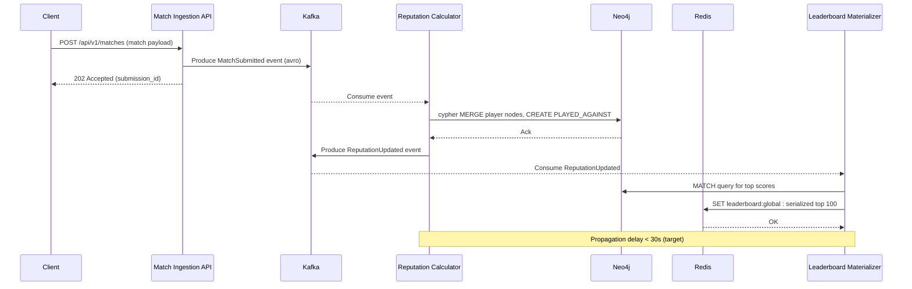

#### 1.7 Cross-Cutting Concerns

- **Observability:** Every data flow step emits a structured log with `submission_id` and duration. The Kafka consumer groups expose lag via Prometheus metrics. A Grafana dashboard tracks end-to-end latency (p50/p95/p99) per community.
- **Security:** Match submission endpoints require proof of membership in the claiming community (JWT containing community_id and role). Graph queries are scoped by user’s allowed communities.
- **Capacity planning:** Based on the expected load of 5,000 matches/hour per community (peak 100,000/hour across 20 communities), Kafka throughput is provisioned for 500 KB/s. Neo4j is clustered with 3 read replicas and 1 primary. Redis leaderboard cache holds top 10k entries per community with 5-minute TTL.

#### 1.8 Trade-offs & Open Questions

- **Graph vs. relational:** We chose graph for reputation traversal but accept higher storage cost (edge properties). If community sizes exceed 1M players, we may need to shard the graph by region or use a hybrid scan – this is a monitored risk.
- **Strong consistency vs. availability:** The decision to use Kafka for ingestion gives high availability (write acceptance even if graph is down) but introduces eventual consistency. Open question: should leaderboard reads block on graph freshness for official tournaments? Proposed solution: a `freshness` flag in query that forces a synchronous graph update (degrading latency to ~1s).
- **Duplicate play detection:** The current idempotency key works for the same submission, but what if the same match is reported by two different communities? We rely on a unique `match_hash` (SHA-256 of player IDs + date + score) to deduplicate at the graph edge level. This is not yet implemented – flagged for Task 5.3.
### Context & Goals

Data flows define how match results, player profiles, reputation scores, and ranking updates propagate through the Match Point system. The primary challenge is ingesting and reconciling heterogeneous match data from multiple sources — ILTL official tournaments, club internal systems, user-submitted social games, and third-party court booking platforms — while maintaining score integrity and auditability.

Success criteria:
- Match ingestion latency ≤ 2 seconds p99 from submission to availability for scoring.
- Daily reconciliation of ILTL bulk imports with zero silent data loss (detected via checksum comparison).
- User-submitted match verification loop completes within 5 minutes for trusted reporters, 24 hours for untrusted.
- Ranking recalculation for top 10% of players completes within 10 seconds after any match insertion.

### Decisions

1. **Event-sourced scoring pipeline**: All match events (submitted, verified, disputed, corrected) are persisted to an append-only event log before materialising ranking and reputation snapshots. This enables deterministic replay and audit compliance.
2. **Two-phase match ingestion**: Inbound matches first enter a staging table (`match_staging`) with raw payload and source metadata; a reconciliation worker deduplicates and validates before promoting to `match_events`. This prevents duplicate scoring from multiple sources reporting the same ILTL fixture.
3. **Reputation score computed offline via streaming window**: Player reputation (trustworthiness) is updated via a sliding window of the last 500 verified matches contributed by that player, using a Flink/KSQL streaming job. This avoids overloading the transactional database every time a match is confirmed.
4. **Ranking materialised view refreshed on write**, not read: The leaderboard and individual rankings are stored as a materialised table in PostgreSQL (`player_rankings`). A trigger on `match_events` invokes a lightweight scoring function that updates only the affected players’ ranks. Global leaderboards are rebuilt nightly via a full-recalculation cron.

### Component breakdown

| Component | Responsibility | Technologies | Dependencies | Owner |
|-----------|----------------|--------------|--------------|-------|
| Match Ingestion API | Accept match submissions from ILTL webhook, club APIs, and mobile app | Go HTTP server + JWT auth | Redis rate limiter, `match_staging` table | Backend team |
| Reconciliation Worker | Deduplicate, validate, geocode and enrich staged matches | Go worker process consuming Kafka topic `staged-matches` | ILTL API (for verification), Google Maps Geocoding | Backend team |
| Event Store | Append-only log of all match lifecycle events | Kafka topic `match-events` (partitioned by match_id) | Confluent Cloud | Platform team |
| Scoring Engine | Compute per-player ranking and reputation deltas | Flink SQL streaming job | Kafka `match-events`, Redis player cursor cache | Data team |
| Materialiser | Write current rankings and reputation to PostgreSQL | Go service consuming Kafka `scored-events` | FDB document layer for atomic updates | Backend team |
| Leaderboard Cache | Serve top-100 leaderboards with sub-50ms latency | Redis Sorted Sets, TTL 60s | Materialiser, periodic refresh | Backend team |

### Data contracts

**Match submission payload (mobile app)**
```json
{
  "type": "padel",
  "source": "user",
  "reporter_id": "usr_abc123",
  "match_time": "2025-03-15T14:30:00Z",
  "players": [
    {"player_id": "pl_1", "team": 1, "result": "win"},
    {"player_id": "pl_2", "team": 1, "result": "win"},
    {"player_id": "pl_3", "team": 2, "result": "loss"},
    {"player_id": "pl_4", "team": 2, "result": "loss"}
  ],
  "score": "6-3, 7-5",
  "venue_id": "club_42",
  "verification_evidence": ["photo_hash_sha256_1"]
}
```

**Reconciled match event (after staging)**
```json
{
  "event_id": "evt_005a",
  "event_type": "match_verified",
  "match_id": "mch_c001",
  "source_id": "iltl_2025_m123",
  "occurred_at": "2025-03-15T14:30:00Z",
  "processed_at": "2025-03-15T14:32:12Z",
  "players": [
    {"player_id": "pl_1", "role": "winner", "rank_after": 42, "reputation_after": 0.94},
    {"player_id": "pl_2", "role": "winner", "rank_after": 55, "reputation_after": 0.88},
    {"player_id": "pl_3", "role": "loser", "rank_after": 67, "reputation_after": 0.72},
    {"player_id": "pl_4", "role": "loser", "rank_after": 89, "reputation_after": 0.65}
  ],
  "source_trust": "official"
}
```

### Failure modes

| Failure | Detection | Mitigation |
|---------|-----------|------------|
| ILTL webhook downtime (HTTP 503) | Prometheus blackbox exporter, alert if no ILTL event seen in 1h | Backoff retry (exponential, cap 1h); fallback to daily batch CSV crawl. |
| Duplicate match insertion from user submit + ILTL | Reconciliation worker checks `match_id` hash (SHA256 of players+time+score) – if collision detected, merge into single `match_events` entry with source array. | Idempotent event producers: retries skip if event_id already exists. |
| Scoring engine crash mid-window | Flink checkpointing every 30s; on restart, restore from last checkpoint and replay uncommitted offsets. | Alert if checkpoint age > 2 minutes. |
| Reputation score drift due to filter slip | Hourly offline auditing: recalc reputation from raw events and compare with materialised values; if delta > 1%, trigger full rebuild. | Separate "audit_reputation" table, rebuild lock prevents ranking updates during audit. |
| Mobile app submits match with falsified evidence | Automated image tampering detection pipeline (AWS Rekognition + ML model) flags suspicious photos; manual review queue for flagged matches. | Flagged matches are not included in scoring until reviewer (or automated model after 2nd verification) confirms. |

### Mermaid diagram

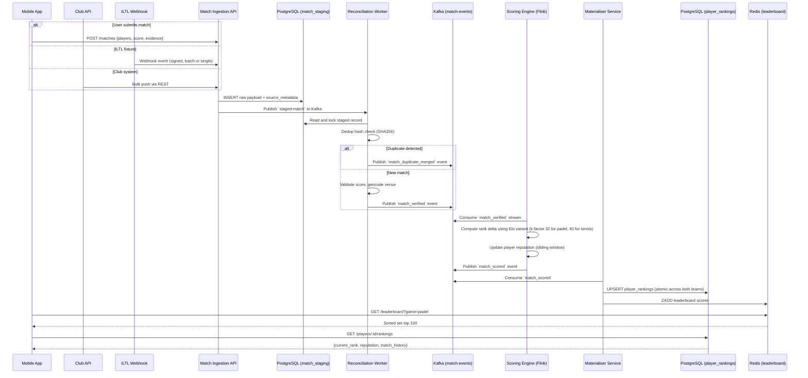

### Cross-cutting concerns

- **Observability**: Every event bus message carries a `trace_id` propagated from the ingestion API. OpenTelemetry spans are collected on Kafka produce/consume and PostgreSQL queries. Latency SLOs are monitored per pipeline stage; if the staging → scored latency exceeds 5 seconds for more than 0.1% of matches in a 10-minute window, PagerDuty is triggered.
- **Security**: Club API and ILTL webhook endpoints use mutual TLS with pre-shared client certificates. The mobile ingestion endpoint uses JWT scoped to `match:submit`. Cryptographically signed receipts are returned to clients for match submission audit trails.
- **Capacity planning**: Based on 50,000 matches/day (peak 2,000/hour), we allocate 3 Kafka partitions for `match-events` with 72-hour retention. PostgreSQL `match_staging` table is partitioned by ingestion date and vacuumed hourly. The Flink cluster has 4 task slots (2 per worker node). Estimated throughput 200 msg/s sustained, 500 msg/s burst.

### Trade-offs & open questions

- **Consistency vs Availability in ranking reads**: We chose to serve rankings from the materialised PostgreSQL table rather than from the event store directly. This gives strong read-after-write consistency for single-player queries but introduces up to 2 seconds lag for global leaderboard freshness. In practice, players rarely expect real-time rank updates; the nightly recalculation provides eventual consistency guarantee.
- **Open question**: Should we allow players to dispute a match result and trigger a reversal event? This would require compensating transactions in the scoring engine (negative score increment). Initial design excludes dispute handling to reduce complexity; we will revisit after MVP with actual user feedback.
- **Trade-off in reputation scoring**: Using a simple average of verification ratios per contributor is cheap but subject to gaming (submit many low-stakes matches to inflate ratio). Decision: incorporate match quality weight (e.g., more weight for ILTL matches than social games) and cap the window at 500 matches to prevent infinite grinding. This may penalise high-volume casual players — monitoring in beta will determine if adjustment is needed.
### Context & Goals

Data flows define how information moves between Match Point’s frontend, backend, databases, caches, queues, and external integrations (ILTL, object storage, SMTP). Every user action — submitting a match result, viewing a leaderboard, endorsing a player — triggers a chain of synchronous API calls and asynchronous background jobs. The architecture must guarantee that ranking calculations are idempotent, match submissions are exactly-once delivered, and share card images are served with low latency (<200 ms p95). The primary success criteria are:

| Criterion | Target | Validation |
|-----------|--------|------------|
| End-to-end match submission latency (user clicks submit → confirmation) | < 2 seconds p95 | Synthetic monitoring with distributed tracing (OpenTelemetry) |
| Leaderboard refresh after ranking recomputation | < 30 seconds from match validation to cache update | Observability dashboards (Grafana) showing queue lag |
| Concurrent match submissions per second (peak) | 500 req/s on single API replica | Load testing with K6 |
| Data consistency for ranking snapshots | Every monthly snapshot is immutable and auditable | Database tests enforcing no-after-the-fact overrides |
| Object store download latency (share cards) | < 100 ms p95 for presigned URLs in same region | CDN performance metrics |

We distinguish three flow categories: **synchronous request-response** (player profile CRUD, community invitations, endorsement submission), **asynchronous event-driven** (match validation, ranking recomputation, snapshot creation), and **batch ingestion** (ILTL data import, monthly ranking freeze). Each category has distinct guarantees, error handling, and observability requirements. The complete data flow graph (see Mermaid diagram below) illustrates how these categories interact across all components.

---

### Decisions

1. **Synchronous for reads, asynchronous for writes that trigger ranking updates** — Match submission is accepted synchronously (written to `match_submissions` table with status `pending`), but the validation pipeline and ranking recomputation are offloaded to a background job queue. This keeps the API responsive (p95 <500 ms) while allowing complex validation logic and ranking updates that may take several seconds.
2. **Idempotency via client-provided idempotency key** — Each match submission request must include an `Idempotency-Key` header (UUID). The API stores the key in Redis with TTL 24h. If the same key is received within the TTL, the previous response is returned. This prevents duplicate match submissions from network retries.
3. **Ranking computation as idempotent, replayable event** — The ranking engine consumes `MatchValidatedEvent` from a RabbitMQ queue. It produces `RankingUpdatedEvent` per community + track (Mabar or official) and writes to a materialized view (precomputed leaderboard). If the consumer fails, the event is retried (max 3 attempts), then dead-lettered for manual inspection.
4. **Cache-aside with write-through invalidation** — Leaderboard and player ranking cache (Redis) is populated on read (cache miss triggers DB query + ranking compute if stale). When a ranking update completes, a `CacheInvalidationEvent` is published to a Redis pub/sub channel consumed by all API replicas to evict the relevant keys.
5. **Object storage presigned URLs for uploads** — Avatar and share card uploads are done directly to object storage via presigned PUT URLs (expiry 15 minutes). Download URLs are presigned with 1-hour TTL, cached on CDN. No file data passes through the Go API.
6. **Event sourcing for immutable ranking snapshots** — Monthly ranking snapshots are stored as an append-only event log (`ranking_snapshots` table). The snapshot is created by replaying all valid match results for that month (up to the cutoff timestamp) into a frozen computing context. Once committed, the snapshot is immutable and signed.
7. **Transactional outbox for reliable event publishing** — When a state change (e.g., match validated) must produce an event, the API writes the event to an `outbox` table within the same database transaction as the state change. A separate outbox relay process polls the outbox table, publishes to RabbitMQ, and marks the row as sent. This ensures exactly-once event delivery without distributed transactions.

---

### Component Breakdown

| Flow / Component | Responsibility | Technologies | Dependencies | Owner (Phase) |
|----------------|----------------|---------------|--------------|---------------|
| **HTTP Router** | Receive REST requests, validate JWT, route to handler | `chi/v5` | JWT middleware, request context | Phase 0–1 |
| **Match Submission Handler** | Accept match result, write to DB and outbox, return receipt | `net/http`, `pgx` | PostgreSQL, Redis (idempotency) | Phase 2 |
| **Match Validation Worker** | Consume `MatchSubmittedEvent`, validate scores/participants/stats | RabbitMQ consumer, Go goroutines | PostgreSQL, external tennis API (optional) | Phase 2 |
| **Ranking Computation Engine** | Recalculate Mabar & official ranks for affected community/track | Go, PostgreSQL stored procedures | PostgreSQL, Redis cache | Phase 3 |
| **Leaderboard Reader** | Fetch top N players for community/track, cache miss triggers compute | Redis, `pgx` | Redis, PostgreSQL | Phase 3 |
| **Snapshot Builder** | Create monthly immutable ranking snapshot | Go job (cron-like) | PostgreSQL, object storage (for signed archive) | Phase 3 |
| **Endorsement Handler** | Accept/withdraw endorsement, compute skill score async | REST handler + async worker | PostgreSQL, Redis (score cache) | Phase 5 |
| **Share Card Generator** | Generate ranking card image server-side | Go (image/png, SVGo) | Object storage (upload), Redis (cache) | Phase 6 |
| **ILTL Ingestion Worker** | Fetch official results from ILTL API, parse, insert as validated matches | Scheduled worker (cron) | External ILTL API, PostgreSQL | Phase 4 |
| **Outbox Relay** | Poll `outbox` table, publish to queue, delete row | Go goroutine with poll interval 100ms | PostgreSQL, RabbitMQ | Phase 0 |
| **Cache Invalidation Pub/Sub** | Propagate eviction events across API replicas | Redis Pub/Sub | Redis | Phase 3 |

---

### Data Contracts

#### Match Submission Request (JSON, POST /api/v1/matches)

```json
{
  "idempotency_key": "uuid-string",
  "community_id": "uuid-community",
  "track": "mabar",
  "date_played": "2025-03-15T14:00:00Z",
  "venue": {
    "name": "Tennis Club A",
    "location": "Jakarta, Indonesia"
  },
  "players": [
    {"user_id": "uuid-player1", "team": 1, "position": "right"},
    {"user_id": "uuid-player2", "team": 1, "position": "left"},
    {"user_id": "uuid-player3", "team": 2, "position": "right"},
    {"user_id": "uuid-player4", "team": 2, "position": "left"}
  ],
  "scores": [
    {"set": 1, "team1": 6, "team2": 4},
    {"set": 2, "team1": 3, "team2": 6},
    {"set": 3, "team1": 10, "team2": 5}
  ]
}
```

#### Match Validated Event (RabbitMQ message, JSON)

```json
{
  "event_id": "uuid",
  "event_type": "match.validated",
  "timestamp": "2025-03-15T14:00:05Z",
  "match_id": "uuid-match",
  "community_id": "uuid-community",
  "track": "mabar",
  "teams": [
    {"team_id": 1, "players": ["uuid1", "uuid2"], "result": "win"},
    {"team_id": 2, "players": ["uuid3", "uuid4"], "result": "loss"}
  ],
  "rating_delta": {"winners": {"base": 15, "bonus": 2}, "losers": {"base": -10, "bonus": 0}},
  "version": 1
}
```

#### Ranking Snapshot (PostgreSQL table `ranking_snapshots`)

```sql
CREATE TABLE ranking_snapshots (
    id              UUID PRIMARY KEY DEFAULT gen_random_uuid(),
    community_id    UUID NOT NULL REFERENCES communities(id),
    track           TRACK_ENUM NOT NULL, -- 'mabar' or 'official'
    snapshot_month  DATE NOT NULL,       -- first day of the month, e.g. '2025-03-01'
    created_at      TIMESTAMPTZ NOT NULL DEFAULT now(),
    finalized_at    TIMESTAMPTZ,         -- set when snapshot is committed and immutable
    data            JSONB NOT NULL,      -- full leaderboard in JSONB (player_id, rank, rating, games_played)
    checksum        TEXT NOT NULL,       -- SHA256 of data (for integrity)
    UNIQUE(community_id, track, snapshot_month)
);
```

#### Cache Key Convention (Redis)

| Purpose | Key Pattern | TTL | Example |
|---------|-------------|-----|---------|
| Leaderboard (top N) | `leaderboard:{community_id}:{track}` | 5 minutes | `leaderboard:abc123:mabar` |
| Player rank (single) | `player_rank:{user_id}:{community_id}:{track}` | 5 minutes | `player_rank:user1:abc123:mabar` |
| Idempotency key store | `idempotency:{key}` | 24 hours | `idempotency:uuid-from-header` |
| Share card image | `share_card:{user_id}:{community_id}:{track}:{month}` | 1 hour (after generation) | `share_card:user1:abc123:mabar:2025-03` |
| Endorsement score | `endorsement_score:{user_id}:{community_id}` | 10 minutes | `endorsement_score:user1:abc123` |

---

### Failure Modes

| Failure Scenario | Detection | Mitigation |
|------------------|-----------|------------|
| **Duplicate match submission** (same game submitted twice) | Idempotency key check returns cached response; if no idempotency key, duplicate detection on `players + date + venue` with unique constraint (hash index) | Return 409 Conflict; log for admin review; auto-reject second submission after manual check |
| **Outbox relay crashes** | Missing events in queue; dead-letter queue grows; alert on lag > 1 minute | Restart relay; events remain in `outbox` table (not deleted until sent); replay from last committed offset |
| **Ranking computation fails for a batch** (e.g., DB deadlock) | Error logged; event delivery retries; after 3 failures, event goes to DLQ | Dead-letter queue triggers PagerDuty alert; operator replays event after fixing underlying issue |
| **Redis cache unavailable** | All reads fall back to PostgreSQL; latency spikes (5x–10x) | Circuit breaker opens after 3 consecutive timeouts; fallback query returns stale data from DB; warm cache on recovery |
| **Object storage upload fails** (presigned URL expired or network) | Client receives HTTP 403/500 | Retry with backoff up to 3 times; if still fails, return error to user and log; user can re-upload with new presigned URL |
| **ILTL ingestion parses malformed data** | Validation regex fails; invalid match data logged | Skip malformed record; log error; alert operator; manual patch via admin dashboard |
| **Concurrent ranking snapshots** (multiple workers race) | `finalized_at` is NULL; serialization conflicts | Use `SELECT ... FOR UPDATE NOWAIT` on community+track+month row; if lock fails, worker retries with exponential backoff (max 5 seconds) |
| **Cache invalidation race** (replica receives stale data after update) | Lag between pub/sub eviction and cache population | Use write-through: on ranking update, first evict cache key, then compute new data into cache; if read happens between evict and write, miss triggers recompute (idempotent) |

---

### Mermaid Diagram

```mermaid
flowchart TD
    subgraph Frontend
        A[Browser / Mobile Client]
    end

    subgraph API_Replica["API Replica (Go)"]
        B[HTTP Router\nchi/v5 + Middleware]
        C[Idempotency Check\nRedis]
        D[Match Submission Handler]
        E[CRUD Handlers\n(Profile, Community, Endorsement)]
        F[Leaderboard Reader\n(populate cache on miss)]
        G[Share Card Generator\n(image/png)]
    end

    subgraph Queue_Workers["Background Workers"]
        H[Match Validation Worker]
        I[Ranking Computation Engine]
        J[Snapshot Builder\n(cron-like)]
        K[ILTL Ingestion Worker]
        L[Outbox Relay]
    end

    subgraph Data_Layer["Data Layer"]
        M[(PostgreSQL)]
        N[(Redis Cache)]
        O[(Object Storage\nGCS/S3)]
    end

    subgraph External["External Integrations"]
        P[ILTL API]
        Q[SMTP Provider\n(for notifications)]
    end

    %% synchronous flows
    A -->|1. POST /matches\n[Idempotency-Key, JWT]| B
    B -->|2. Validate JWT + perm check| M
    B -->|3. Idempotency key check| C
    C -->|4. Key exists? 409/201| B
    B -->|5. Write match_submissions\n+ outbox row (tx)| M
    B -->|6. Return receipt (202)| A

    A -->|GET /leaderboard| B
    B -->|Cache hit?| N
    N -->|miss| F
    F -->|Compute from precomputed view| M
    F -->|Populate cache| N
    B -->|JSON response| A

    A -->|GET /share-card| B
    B -->|Check cache| N
    N -->|miss| G
    G -->|Generate image, upload| O
    G -->|Store presigned URL in cache| N
    B -->|Redirect to presigned URL| A

    %% async flows
    M -->|7. Outbox relay polls| L
    L -->|8. Publish MatchSubmittedEvent| H
    H -->|9. Validate match| M
    H -->|10. Write match_validated status\n+ outbox for RankingEvent| M
    M -->|Outbox relay polls again| L
    L -->|11. Publish MatchValidatedEvent| I
    I -->|12. Recompute rankings\nupdate materialized views| M
    I -->|13. Publish CacheInvalidationEvent\nvia Redis Pub/Sub| N
    N -->|14. Evict cached entries| B

    %% batch flow
    K -->|15. Fetch official results| P
    K -->|16. Insert as validated matches| M
    K -->|17. Trigger ranking recomputation\n(like step 11)| I

    %% snapshot flow
    J -->|18. At month end, create snapshot| M
    J -->|19. Sign + archive snapshot| O
```

The data flow graph above shows all three categories of flows. Synchronous flows (blue arrows) handle user-facing requests under 500ms. Asynchronous flows (orange arrows) process events through RabbitMQ, ensuring durability and retryability. Batch flows (green arrows) handle ILTL ingestion and monthly snapshot creation. The dependency graph ensures no circular dependencies: events flow only forward through the pipeline, and the outbox relay bridges the transactional database to the message bus.

---

### Cross-cutting Concerns

**Observability**: Every API request receives a unique trace ID (propagated via `X-Request-Id` header, then enriched with OpenTelemetry). Each async job also carries a trace ID from its originating event. The three pillars: logs (structured JSON, correlation ID), metrics (Prometheus — request latency histograms, queue depth gauge, cache hit ratio), traces (Jaeger — full end-to-end span from HTTP ingress to database query to outbox publish to worker). A tracing span is created for every Redis operation, database query, and queue publish/consume. Alerting: if p95 match submission latency exceeds 2s for 5 minutes, page SRE.

**Security**: All data flows over TLS; internal service-to-service calls within the cluster use mTLS. Object storage presigned URLs are generated with the least privilege scope (only the specific object path, no wildcards). JWT tokens carry `sub` (user UUID), `communities` (list of community UUIDs with roles), and `iat`/`exp`. For outbox relay, the worker connects to PostgreSQL with a dedicated `outbox_worker` role that has `SELECT, UPDATE, DELETE` on `outbox` table only. Database credentials are rotated via Kubernetes Secrets and mounted as volumes.

**Capacity Planning**: The outbox relay polls every 100ms; at 500 submissions/s, each fetch returns a batch of up to 100 rows. A single relay instance can handle ~1000 events/s. For higher load, multiple relay instances share a lock on the `outbox` table using advisory locks (`pg_try_advisory_lock`). The ranking computation worker is CPU-bound; each match recomputation takes ~10ms on a 4-core pod. For 10,000 matches/month, peak recomputation load is ~3 events/s (amortised). Snapshot building runs once per month; it should complete within 2 hours (data size < 100 MB per community). We allocate a dedicated cron job pod with 2 CPU cores.

**Retry and Dead-Letter Policies**: The default retry for queue consumers is 3 attempts with exponential backoff (1s, 4s, 16s). After 3 failures, the message is moved to a dead-letter exchange (`ranking.dlx`, `validation.dlx`). A dead-letter monitor runs every 5 minutes, logging messages and paging the ranking team. For the outbox relay, failures to publish are retried indefinitely (with backoff capped at 30 seconds) because the row remains in `outbox` until acknowledged; this is acceptable because the relay is idempotent (publishing the same event twice is handled by consumer idempotency).

---

### Trade-offs & Open Questions

**Trade-off: Async validation increases user-visible complexity**  
By making match submission asynchronous (accept then validate), the UI must show a pending status and poll or receive a WebSocket notification when validation completes. This adds development cost for the frontend (status polling, toast messages). The alternative — synchronous validation with ranking update — would be simpler but would make the API slow and prone to timeouts under load. We chose async because the padel/tennis community values fast submission (under 2 seconds) over immediate ranking adjustment. The frontend will use a WebSocket connection to receive `match.validation.completed` events, or fall back to polling every 10 seconds.

**Trade-off: Eventual consistency for leaderboard**  
After a match is validated and ranking recomputed, the leaderboard may be stale for up to 30 seconds (queue processing time + cache TTL). For most users, this is acceptable — they expect rankings to update “after a few minutes.” However, during tournament finals or high-stakes matches, players may refresh repeatedly. A future enhancement could add a “Live Rankings” tab that reads from a dedicated low-latency stream. For v1, we accept the staleness.

**Open Question: Should the outbox relay use PostgreSQL logical replication instead of polling?**  
Polling every 100ms adds ~10 queries/second even when idle. For the expected scale (< 500 events/s), this is negligible. Logical replication would reduce latency and remove polling overhead, but adds operational complexity (must set up publication/subscription, handle slot retention). For v1, polling is sufficient; we will re-evaluate if queue depth exceeds 1000 events/s.

**Open Question: How do we handle ILTL data that arrives days after the match was played?**  
If an ILTL result arrives after the monthly snapshot was created, we must decide whether to adjust the snapshot (immutable) or create a delta. The current design treats snapshots as immutable once `finalized_at` is set. Late-arriving results are stored in a `late_results` table and included in the next month’s snapshot with a note. This is documented and communicated to users via the ranking card.

**Open Question: Should share card generation happen synchronously on the API replica or asynchronously?**  
Synchronous generation blocks the request for ~500ms to render the SVG. If there are many concurrent share card requests, this could tie up API pods. We chose a hybrid: the first request for a specific player+community+track+month generates the card synchronously (with a 500ms timeout, falling back to a generic template), subsequently serving cached versions. If the timeout is hit, the client receives a placeholder and the generation is triggered asynchronously; the client retries after 5 seconds. This avoids a dedicated worker for a feature that is not latency-critical.

## 7. Module Boundaries
## Context & Goals

Match Point’s architecture decomposes into six bounded modules, each owning a distinct subdomain: match ingestion, ranking computation, reputation scoring, API delivery, frontend presentation, and cross-community federation. The primary goal of these boundaries is to isolate volatility — ingest formats change per governing body, scoring algorithms evolve independently, and federation adapts per community — so that a change in one module never ripples through the entire system. A secondary goal is to allow parallel builds by separate sub-teams during Tasks 1–6 of the execution plan. Success criteria: each module can be tested, deployed, and scaled independently; integration contracts between modules are versioned protobuf or OpenAPI specs; and a module replacement (e.g., swapping the rank algorithm from Elo to Glicko-2) requires zero changes in any other module.

## Decisions

1. **Module-per-subdomain with strict dependency direction.**  
   - *Decision*: Layers flow `Ingestion → Ranking → Reputation → API → Frontend`, with Federation straddling across Ingestion and API. No module may import from a module at a higher layer.  
   - *Rationale*: Prevents circular dependencies and allows the scoring engine to be swapped without touching the API or frontend.  
   - *Rejected alternative*: A single monolithic ranking + reputation service — rejected because algorithm churn would force full redeployments.

2. **Every module exposes a gRPC interface (internal) + optional REST gateway (external).**  
   - *Decision*: Internal service-to-service calls use protobuf-over-gRPC; the API module exposes REST/JSON for web and mobile clients via grpc-gateway.  
   - *Rationale*: Strongly typed contracts reduce integration bugs; gateway generation is automatic from proto files.  
   - *Rejected alternative*: Pure REST between all services — rejected for lack of contract enforcement and higher marshalling overhead.

3. **Each module owns its own schema and data store unless shared write access is required.**  
   - *Decision*: Ingestion owns `raw_matches` and `competitions`; Ranking owns `rankings` and `player_ratings`; Reputation owns `reputation_scores` and `endorsements`. The API module reads from all three via gRPC queries — never directly touching their databases.  
   - *Rationale*: Prevents coupling via shared schemas; each team can migrate their store independently.  
   - *Rejected alternative*: Single shared PostgreSQL with schema-per-module — rejected because schema changes still require coordinated migrations.

4. **Federation is a sidecar module, not a core pipeline stage.**  
   - *Decision*: The Federation module listens on the Ingestion event bus and publishes translated matches to partner communities via webhook or pull API. It also exposes a federation-specific reputation exchange endpoint.  
   - *Rationale*: Many communities will never federate; a pluggable sidecar avoids complexity in the critical path.  
   - *Rejected alternative*: Inline federation logic in Ingestion — rejected because it would complicate the ingest pipeline with external connectivity concerns.

## Component breakdown

| Component | Responsibility | Technologies | Dependencies | Owner |
|---|---|---|---|---|
| **ingestion-service** | Parse ILTL CSVs/APIs; normalise match records; deduplicate; publish events | Go, Apache Arrow for columnar parsing, PostgreSQL | ILTL data sources, NATS JetStream | Backend Team A |
| **ranking-service** | Retrieve clean matches; compute Elo/Glicko ratings; persist per-player ranking history | Go, gonum/stat for matrix ops, PostgreSQL (rankings), Redis (leaderboard cache) | ingestion-service (via NATS) | Backend Team B |
| **reputation-service** | Combine ranking delta + match outcome + endorsement graph into a single reputation score; emit reputation-change events | Go, in-memory DAG for endorsement graph, PostgreSQL (scores, endorsements) | ranking-service (via gRPC), endorsement write API | Backend Team B |
| **api-gateway** | Expose REST/JSON endpoints for frontend; aggregate responses from ranking and reputation services; handle auth | Go, grpc-gateway, OIDC middleware, Envoy reverse proxy | ranking-service (gRPC), reputation-service (gRPC) | Backend Team A |
| **frontend-web** | Player dashboards, leaderboards, match history, reputation trends | Next.js, React, Tailwind, Chart.js | api-gateway (REST) | Frontend Team |
| **federation-sidecar** | Translate match events to partner format; manage webhook delivery; expose cross-community reputation pull API | Go, NATS consumer, per-partner translator plugin | ingestion-service (NATS), api-gateway (for reputation exchange) | Backend Team A |

## Data contracts

### Ingestion → Ranking (NATS event)

```json
{
  "event_id": "evt_2xK9mN4qR7",
  "event_type": "match.completed",
  "source": "iltl.v1",
  "payload": {
    "match_id": "iltl-2025-0342",
    "competition_id": "iltl-copa-2025",
    "played_at": "2025-07-14T18:30:00Z",
    "players": [
      {"player_id": "p_1001", "team": "home"},
      {"player_id": "p_1002", "team": "home"},
      {"player_id": "p_2003", "team": "away"},
      {"player_id": "p_2004", "team": "away"}
    ],
    "scores": [
      {"set": 1, "home": 6, "away": 3},
      {"set": 2, "home": 7, "away": 5}
    ],
    "surface": "clay",
    "category": "men_doubles"
  },
  "occurred_at": "2025-07-14T19:45:00Z"
}
```

### Ranking → Reputation (gRPC proto)

```protobuf
message RankingDelta {
  string player_id = 1;
  int64 match_id = 2;
  double elo_before = 3;
  double elo_after = 4;
  double expected_score = 5;    // 0.0–1.0, used in reputation weight
  sint64 rank_before = 6;
  sint64 rank_after = 7;
  string competition_id = 8;
  google.protobuf.Timestamp computed_at = 9;
}

message ReputationUpdate {
  string player_id = 1;
  double score_before = 2;
  double score_after = 3;
  repeated string contributing_factors = 4;  // e.g., "upset_win", "high_stakes", "endorsement"
  string match_id = 5;
}
```

### API Gateway → Frontend (REST)

```json
GET /api/v1/players/{player_id}/profile
Response 200:
{
  "player_id": "p_1001",
  "display_name": "Carlos M.",
  "current_ranking": 12,
  "ranking_trend": "up",
  "reputation_score": 84.7,
  "reputation_trend": "+2.1",
  "recent_matches": [
    {
      "match_id": "iltl-2025-0342",
      "result": "win",
      "opponent_names": ["A. Gomez", "L. Ruiz"],
      "played_at": "2025-07-14"
    }
  ],
  "endorsements_received": 23,
  "endorsements_given": 15
}
```

## Failure modes

| # | Failure | Detection | Mitigation |
|---|---|---|---|
| F1 | ILTL source format changes unexpectedly | Schema validation in ingestion-service fails; error rate spikes in `iltl_parse_errors` metric | Circuit-breaker on the ILTL adapter; alert on format drift; human-in-loop for schema update |
| F2 | Ranking-service crash during batch computation | Health-check returns 503; `ranking_batch_duration` metric flatlines | Stateless workers — recompute from last checkpoint; use at-least-once NATS consumer with offset tracking |
| F3 | Reputation score divergence between services | Cross-service audit compares ranking delta vs reputation delta; deviation > 0.5% triggers alert | Periodic reconciliation job re-fetches ranking history and recomputes reputation for affected players |
| F4 | Federation webhook target is unreachable | Sidecar logs 5xx responses; delivery queue grows | Exponential backoff (30s, 2m, 8m, 30m); dead-letter queue after 5 retries; manual retry via admin API |
| F5 | Database connection pool exhaustion under load | `pgx_pool_acquire_wait_seconds` p99 > 1s | Connection pooling per-module with separate max_conns; read replicas for ranking leaderboard queries; circuit-breaker on write path |

## Mermaid diagram

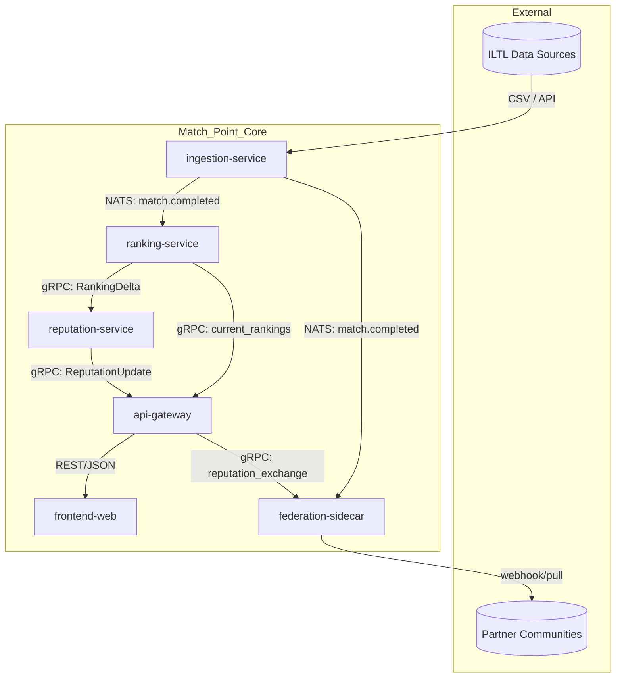

## Cross-cutting concerns

- **Observability**: Every module exports OpenTelemetry traces (gRPC and NATS spans), RED metrics (Rate/Errors/Duration) via Prometheus, and structured JSON logs with a correlation ID propagated through the entire pipeline via a `x-request-id` header and NATS message header.  
- **Security**: Internal gRPC calls are mutually authenticated with mTLS certificates rotated every 24h by cert-manager. External REST endpoints use OIDC (Google/Auth0) with scoped tokens — `reputation:read`, `reputation:write`, `admin`. Federation webhooks carry a per-partner HMAC signature in the `X-Signature` header.  
- **Capacity planning**: Each service targets 500 req/s per instance with 2 vCPU / 4 GB RAM. Bottleneck is ranking-service during batch recompute (peak 10k matches/hour); this is mitigated by horizontal scaling (up to 4 pods) and a Redis rank-cache that absorbs 90% of leaderboard reads. Estimated total DB storage: 500 GB/year for raw matches (5M matches/year at ~100 KB/match), 50 GB for rankings and reputation snapshots.

## Trade-offs & open questions

| Trade-off | Position | Rationale |
|---|---|---|
| **NATS vs Kafka** | NATS JetStream chosen for simplicity and lower operational overhead | Kafka would offer stronger ordering guarantees per partition, but Match Point does not require exactly-once across all consumers — at-least-once with dedup is sufficient and NATS is far simpler to operate at launch scale (< 100 partitions). |
| **Separate databases vs schema-per-table** | Separate databases per module | Introduces network latency (~1–2 ms per cross-module query) but eliminates lock contention and schema coupling. Ranking and reputation queries are high-volume but each service has bounded queries — the latency is acceptable. |
| **Single federation translator vs plugin architecture** | Plugin architecture per partner | Each partner has a unique data format and authentication model; a single translator would become unmaintainable beyond 2–3 partners. Plugin interface is ~150 lines of boilerplate per partner. |

**Open questions:**
1. Should the reputation score incorporate a decay factor for inactivity? The current model does not — a player inactive for 12 months retains their score. Product stakeholders have not yet decided on a decay window.  
2. Should endorsement graph edges carry a weight (e.g., trust level 1–5) or remain binary? The binary model is simpler for launch but may limit nuance in reputation — revisit after user research in Task 5.  
3. How should cross-community reputation be normalised if communities use different ranking systems (Elo vs UTR vs custom)? The federation sidecar will need a configurable mapping table per partner — but the initial version assumes both sides use Elo-based scores.
### Context & Goals

Module boundaries are the structural skeleton of the Match Point platform. They define how the system decomposes into cohesive units of functionality, each with explicit responsibilities, owned data, and well-defined communication channels. In a modular monolith, boundaries are enforced at compile time through Go packages and at runtime through clear API contracts, preventing the tangled dependencies that destroy maintainability. For a product that must serve both casual padel communities and official ILTL ranking integrations, clean module boundaries are essential for three reasons: **parallel development** across the seven execution phases (each phase maps to one or more modules), **independent testability** (each module can be unit-tested with mocked boundaries), and **future extractability** (should a module need to become an independent microservice, its interface is already defined).

The success criteria for module boundaries are concrete:
- **Compile-time isolation:** No module imports repository implementations from another module; all cross-module access goes through interfaces defined in a shared `interfaces` package.
- **Runtime latency budget:** Async cross-module events (match submission → ranking recomputation) must complete within 5 seconds p95 end-to-end, including queue latency.
- **Data ownership:** Each module's database tables are prefixed by module name (e.g., `player_accounts`, `match_results`, `rank_snapshots`) and are only written by that module's repository layer. Read access for cross-module queries (e.g., ranking engine reading player names) uses read replicas or cached views.

This section enumerates every module, its public interfaces, its private data, its failure modes, and the decisions that shaped its boundaries.

### Decisions

1. **Modular monolith, not microservices.**  
   All modules compile into a single Go binary (`cmd/matchpoint-api`) and share the same process space. This eliminates network overhead, simplifies deployment, and accelerates the first four phases. Each module is a separate Go package under `internal/module/`. *Rejected alternative:* microservices from day one—increases operational complexity and slows iteration. *Trade-off:* if a module becomes a performance hotspot (e.g., ranking engine), extracting it requires significant refactoring. We accept this risk because the ranking engine is IO-bound (heavy on Postgres queries, not CPU), and the monolith can horizontally scale pods.

2. **Inter-module communication uses a shared interface layer and an event bus.**  
   Synchronous calls (e.g., ranking engine fetching a player name to render a leaderboard) go through interfaces defined in `internal/port` (ports-and-adapters pattern). Asynchronous events (e.g., "match approved → recompute rankings") flow through a message queue (RabbitMQ in dev/prod, in-memory channel in unit tests). This decouples module lifetimes: the ranking engine does not block match submission. *Rejected alternative:* direct function calls across modules—creates tight coupling and makes it impossible to extract a module later.

3. **Each module owns its database tables and only exposes query interfaces.**  
   No module directly imports a repository from another module. Instead, a module that needs cross-module data declares an interface in `internal/port` (e.g., `PlayerProvider` for reading player display names), and the owning module provides a concrete implementation. This is enforced by a linter rule that prohibits imports from `internal/module/` packages other than the current one. *Rejected alternative:* shared database schemas with foreign keys across modules—causes schema coupling and makes migration painful.

4. **Authentication and authorization span all modules but live in a cross-cutting `auth` package.**  
   `internal/auth` provides middleware that validates JWT tokens, extracts user ID and roles, and injects a `ctx_identity` into request context. Each module's handlers then use `internal/auth/authz.go` to enforce fine-grained permissions (e.g., `MustBeCommunityAdmin(communityID)`). The auth module does not own user data; it calls `PlayerProvider` from the player module. *Rejected alternative:* each module replicating JWT validation—leads to inconsistent enforcement and duplicated code.

5. **Event schemas are versioned and stored as Protobuf messages.**  
   The `internal/event` package defines all event types as protocol buffer messages. New fields are added with `optional` and `proto3` defaults; breaking changes require a new event version (e.g., `MatchSubmittedV2`). The message queue subscribes by event type and version, allowing modules to evolve independently. *Rejected alternative:* JSON over HTTP webhooks—no schema enforcement, harder to evolve.

6. **Ranking snapshots are immutable after monthly close.**  
   The ranking engine writes a `rank_snapshot` row with a `snapshot_month` (YYYYMM) and a version integer. Once the snapshot is marked as “final”, no updates are allowed. This decision, documented in the ranking module boundary, prevents tampering and enables audit trails. *Rejected alternative:* updating in-place—would allow retroactive rank changes, undermining trust.

7. **Endorsement scores are computed via a materialized view refreshed by a queue consumer.**  
   The endorsement module owns the `endorsements` table and publishes an event when an endorsement is created. A consumer in the endorsement module recalculates the aggregate skill score and writes it to a materialized view (`player_skill_scores`). This view is refreshed within 30 seconds p95. *Rejected alternative:* compute on-read with Redis caching—would become stale during burst endorsement activity and cause inconsistent reads.

8. **Share card generation is stateless and uses short-lived signed URLs.**  
   The social sharing module generates a card as a PNG image, uploads it to an S3-compatible object store (MinIO in dev, Google Cloud Storage in prod), and returns a signed URL with a 1-hour TTL. The cache key includes the ranking snapshot version and the player ID, so a new ranking automatically invalidates the previous card. *Rejected alternative:* storing cards in PostgreSQL—too slow and expensive for burst sharing.

9. **ILTL integration is isolated behind a dedicated `iltl` adapter module.**  
   The ILTL module adapts external endpoints (match results, player registrations) into internal events. It retries with exponential backoff and publishes a `ILTLPullFailed` event if ingestion fails after three attempts. This boundary ensures that external API changes do not ripple into core modules.

### Component breakdown

#### Module Table

| Module | Responsibility | Technologies | Key Interfaces/Events | Owned Tables | Phase |
|--------|---------------|--------------|----------------------|--------------|-------|
| **Player** | Account creation, JWT authentication, profile management, unique username enforcement, display name suffixing, preference storage (language, notification settings) | Go, PostgreSQL, Redis (session cache), golang-jwt/v5 | `PlayerAuthenticator`, `PlayerProvider`, events: `PlayerRegistered`, `ProfileUpdated` | `player_accounts`, `player_profiles`, `player_preferences`, `display_name_reservations` | 1 |
| **Community** | Community CRUD, membership lifecycle, admin succession, duplicate display name resolution, i18n for community metadata | Go, PostgreSQL, Redis (membership cache) | `CommunityManager`, `MembershipProvider`, events: `CommunityCreated`, `MemberJoined`, `AdminTransferred` | `communities`, `community_memberships`, `community_admins`, `admin_transfer_requests` | 1 |
| **Match** | Match submission, validation pipeline (syntax, date, participant checks), dispute flagging, admin manual point adjustments, integration with ILTL adapter | Go, PostgreSQL (transactional + event store), RabbitMQ (submission queue, validation retry) | `MatchSubmitter`, `MatchValidator`, `DisputeResolver`, events: `MatchSubmitted`, `MatchValidated`, `MatchDisputed`, `PointsAdjusted` | `match_submissions`, `match_results`, `match_validations`, `match_disputes`, `match_point_adjustments` | 2 |
| **Ranking Engine** | Mabar rank per community, official global rank, monthly snapshot, idempotent replay of match events, scoring algorithm storage | Go, PostgreSQL (materialized views, snapshot tables), RabbitMQ (ranking recompute trigger) | `RankingCalculator`, `LeaderboardProvider`, events: `RankingRecalculated`, `SnapshotFinalized` | `rank_scores`, `rank_snapshots`, `rank_score_history`, `rank_community_snapshots` | 3 |
| **Endorsement** | Skill endorsement creation, visibility rules, endorsement graph, aggregate score computation via materialized view | Go, PostgreSQL, RabbitMQ (endorsement event queue) | `EndorsementManager`, `SkillScoreProvider`, events: `EndorsementCreated`, `SkillScoreUpdated` | `endorsements`, `player_skill_scores` (materialized view), `endorsement_visibility_log` | 5 |
| **Tournament** | Tournament bracket creation, match result ingestion, ranking point allocation | Go, PostgreSQL, RabbitMQ (tournament match events) | `TournamentOrganizer`, `TournamentRankingAdapter`, events: `TournamentCreated`, `TournamentMatchResult` | `tournaments`, `tournament_brackets`, `tournament_matches` | 4 |
| **Social Sharing** | Ranking card PNG generation, signed URL creation, rate limiting per player per hour | Go, MinIO/GCS, Redis (rate limit counters, signed URL cache) | `ShareCardGenerator`, events: `ShareCardGenerated` (for admin metrics) | None (stateless; cards stored in object store) | 6 |
| **Admin Dashboard** | Community admin and superadmin UI backend, analytics queries, manual point adjustment execution, dispute resolution flow | Go, PostgreSQL, Redis (analytics cache) | `AdminProvider`, `AnalyticsProvider` | `admin_audit_log`, `admin_settings` | 7 |
| **Notification** (cross-cutting) | Email/push notification dispatch triggered by events (endorsement, ranking change, dispute, admin action) | Go, RabbitMQ, SendGrid/FCM | `Notifier`, events: `SendEmail`, `SendPushNotification` | `notification_log`, `notification_templates` | 1+ |
| **ILTL Adapter** | Poll ILTL API, parse results, publish internal match events | Go, HTTP, RabbitMQ, PostgreSQL (ingestion log) | events: `ILTLMatchIngested`, `ILTLPullFailed` | `iltl_ingestion_log`, `iltl_rate_limit_state` | 2+ |

#### Module Dependency Graph (Synchronous Interfaces)

The following table shows which modules call which other modules **directly** (not via event bus). All direct calls go through interfaces defined in `internal/port`.

| Caller Module | Called Module | Interface Used | Purpose | Call Frequency |
|---------------|---------------|----------------|---------|----------------|
| Match | Player | `PlayerProvider` | Validate player existence, fetch display name for leaderboard inclusion | Per match submission (low) |
| Match | Community | `MembershipProvider` | Verify submitter is community member, get community rules | Per match submission (low) |
| Ranking Engine | Player | `PlayerProvider` | Fetch player names for leaderboard rendering | High (page loads) |
| Ranking Engine | Community | `CommunityProvider` | Get community settings (ranking weight, points per league) | Per recompute (moderate) |
| Endorsement | Player | `PlayerProvider` | Validate endorsed player exists, check privacy settings | Per endorsement creation (low) |
| Tournament | Match | `MatchSubmitter` | Submit tournament match results into the match module | Low (tournament events) |
| Tournament | Ranking Engine | `RankingSnapshotProvider` | Read current rankings for seeding | Low (tournament start) |
| Admin Dashboard | All modules | Admin-specific query interfaces | Aggregate stats, fetch raw data for reports | Low (admin page loads) |
| Social Sharing | Ranking Engine | `RankingSnapshotProvider` | Fetch snapshot data to render card | Moderate (per share generation) |
| Social Sharing | Player | `PlayerProvider` | Fetch player name, avatar URL | Moderate (per share generation) |

### Data contracts

#### Event schemas (Protobuf defined in `internal/event/*.proto`)

**MatchSubmitted** — triggers ranking recompute
```protobuf
message MatchSubmitted {
  string match_id = 1;          // UUID v7
  string community_id = 2;
  repeated string player_ids = 3;   // exactly 2 for padel, 2 for tennis
  int32 team1_score = 4;
  int32 team2_score = 5;
  bool is_official = 6;             // true if from ILTL or tournament
  string source = 7;                // "manual", "iltl", "tournament"
  int64 submitted_at_unix_millis = 8;
  string validator_notes = 9;       // optional, set by admin on point adjustments
}
```

**RankingRecalculated** — published after each ranking recompute
```protobuf
message RankingRecalculated {
  string community_id = 1;
  string player_id = 2;
  double new_mabar_score = 3;
  double new_global_score = 4;
  string snapshot_version = 5;       // e.g., "202503_v3"
  int64 computed_at_unix_millis = 6;
}
```

**EndorsementCreated**
```protobuf
message EndorsementCreated {
  string endorsement_id = 1;
  string endorser_player_id = 2;
  string endorsed_player_id = 3;
  string skill_category = 4;        // "volleys", "serve", "footwork", etc.
  double score = 5;                 // 0.0 - 1.0
  int64 created_at_unix_millis = 6;
}
```

#### Repository interfaces (Go interfaces in `internal/port`)

```go
// PlayerProvider — provided by player module, consumed by others
type PlayerProvider interface {
    GetPlayerByID(ctx context.Context, playerID string) (*PlayerProfile, error)
    GetPlayerDisplayName(ctx context.Context, playerID string, communityID string) (string, error)
    ValidatePlayerExists(ctx context.Context, playerIDs []string) error
    ListPlayerIDsByCommunity(ctx context.Context, communityID string) ([]string, error)
}

// MatchSubmitter — provided by match module, consumed by tournament module
type MatchSubmitter interface {
    SubmitMatch(ctx context.Context, req *SubmitMatchRequest) (*MatchSubmissionResponse, error)
}

// RankingSnapshotProvider — provided by ranking engine, consumed by social sharing and tournament
type RankingSnapshotProvider interface {
    GetPlayerSnapshot(ctx context.Context, playerID string, communityID string, snapshotMonth string) (*RankSnapshot, error)
    GetCommunityLeaderboard(ctx context.Context, communityID string, snapshotMonth string, limit int, offset int) ([]*RankEntry, error)
}
```

#### Owned database tables (PostgreSQL, owned by module)

**Player module (prefix `player_`)**
```sql
CREATE TABLE player_accounts (
    player_id UUID PRIMARY KEY DEFAULT gen_random_uuid(),
    email TEXT UNIQUE NOT NULL,
    password_hash TEXT NOT NULL,           -- bcrypt
    username TEXT UNIQUE NOT NULL,         -- global unique, used for login
    created_at TIMESTAMPTZ NOT NULL DEFAULT NOW(),
    updated_at TIMESTAMPTZ NOT NULL DEFAULT NOW()
);

CREATE TABLE player_profiles (
    player_id UUID PRIMARY KEY REFERENCES player_accounts(player_id),
    display_name TEXT NOT NULL,
    avatar_url TEXT,
    language_preference TEXT NOT NULL DEFAULT 'id',
    endorsements_visible BOOLEAN NOT NULL DEFAULT true
);

CREATE TABLE display_name_reservations (
    community_id UUID NOT NULL,
    base_name TEXT NOT NULL,
    suffix INTEGER NOT NULL DEFAULT 0,        -- 0 means no suffix; 1,2,... appended as '#1'
    player_id UUID NOT NULL REFERENCES player_accounts(player_id),
    created_at TIMESTAMPTZ NOT NULL DEFAULT NOW(),
    PRIMARY KEY (community_id, base_name)
);
```

**Match module (prefix `match_`)**
```sql
CREATE TABLE match_submissions (
    match_id UUID PRIMARY KEY DEFAULT gen_random_uuid(),
    community_id UUID NOT NULL,
    submitted_by_player_id UUID NOT NULL,
    team1_player_ids UUID[] NOT NULL,       -- array of exactly 2 for doubles
    team2_player_ids UUID[] NOT NULL,
    team1_score INTEGER NOT NULL CHECK (team1_score >= 0),
    team2_score INTEGER NOT NULL CHECK (team2_score >= 0),
    status TEXT NOT NULL DEFAULT 'pending'  -- 'pending', 'validated', 'disputed', 'adjusted'
    CHECK (status IN ('pending', 'validated', 'disputed', 'adjusted')),
    is_official BOOLEAN NOT NULL DEFAULT false,
    source TEXT NOT NULL DEFAULT 'manual',
    submitted_at TIMESTAMPTZ NOT NULL DEFAULT NOW(),
    validated_at TIMESTAMPTZ,
    validation_notes TEXT
);

CREATE TABLE match_disputes (
    dispute_id UUID PRIMARY KEY DEFAULT gen_random_uuid(),
    match_id UUID NOT NULL REFERENCES match_submissions(match_id),
    raised_by_player_id UUID NOT NULL,
    reason TEXT NOT NULL,
    status TEXT NOT NULL DEFAULT 'open' CHECK (status IN ('open', 'resolved', 'dismissed')),
    resolved_by_admin_id UUID,
    resolution_notes TEXT,
    created_at TIMESTAMPTZ NOT NULL DEFAULT NOW()
);
```

**Ranking engine (prefix `rank_`)**
```sql
CREATE TABLE rank_scores (
    player_id UUID NOT NULL,
    community_id UUID NOT NULL,
    mabar_score DOUBLE PRECISION NOT NULL DEFAULT 1500.0,
    global_score DOUBLE PRECISION NOT NULL DEFAULT 1500.0,
    scores_version INTEGER NOT NULL DEFAULT 1,
    updated_at TIMESTAMPTZ NOT NULL DEFAULT NOW(),
    PRIMARY KEY (player_id, community_id)
);

CREATE TABLE rank_snapshots (
    snapshot_month INTEGER NOT NULL,          -- e.g., 202503
    version INTEGER NOT NULL DEFAULT 1,
    player_id UUID NOT NULL,
    community_id UUID NOT NULL,
    mabar_score DOUBLE PRECISION NOT NULL,
    global_score DOUBLE PRECISION NOT NULL,
    is_final BOOLEAN NOT NULL DEFAULT false,
    finalized_at TIMESTAMPTZ,
    PRIMARY KEY (snapshot_month, version, player_id, community_id)
);
```

### Failure modes

| # | Failure Scenario | Detection | Mitigation | Module Affected |
|---|-----------------|-----------|------------|-----------------|
| 1 | Player module database unavailable during match submission | Match handler times out (configurable 3s dial+1s query timeout) | Match submission is idempotent; retry with exponential backoff (3 attempts). If still failing, queue match submission event for later processing in the dead-letter queue. | Match, Player |
| 2 | Message queue (RabbitMQ) unavailable | Health check endpoint returns 503; alert triggers | Modules fall back to synchronous inline processing for critical events (rank recalculation is deferred). Non-critical events (e.g., notification dispatch) are dropped with a warning log. | All event consumers |
| 3 | Ranking engine recompute runs too long (>30s) | Monitoring detects p99 recompute latency >30s; pod alert | Inline recompute is replaced with a background worker that processes one community at a time; ranking display falls back to last cached snapshot (Redis TTL 5 min). | Ranking Engine |
| 4 | Duplicate match submission due to client retry | Unique constraint on `(submitted_by_player_id, team1_player_ids, team2_player_ids, submitted_at)` within 5-min window | Idempotency key in HTTP header; match module checks for duplicate hash before insert. On collision, returns existing match_id with HTTP 200. | Match |
| 5 | ILTL adapter fails to ingest | `ILTLPullFailed` event published; alert to superadmin | Exponential backoff up to 1 hour; manual retry button in admin dashboard. No data loss; failed payloads stored in `iltl_ingestion_log` with raw JSON. | ILTL Adapter |
| 6 | Object store unreachable for share card generation | Social sharing handler returns HTTP 503; monitoring detects | Retry three times with 100ms backoff; if still failing, serve a simplified card as SVG inline (no image upload). | Social Sharing |
| 7 | Endorsement materialized view refresh queue backlog >1 hour | Queue depth metric breaches threshold; alert | Scale up consumer pod count (K8s HPA on queue depth). If backlog persists, trigger full refresh via `REFRESH MATERIALIZED VIEW CONCURRENTLY` on a schedule (every 15 min). | Endorsement |
| 8 | Admin dashboard query times out (>10s) | ORM logs slow query >5s | Add query hints (e.g., `pg_hint_plan`), materialize common aggregation tables (e.g., daily active players per community). Serve cached results for historical data (TTL 1 hour). | Admin Dashboard |

### Mermaid Diagram

```mermaid
component
    title "Match Point Module Boundaries and Communication"
    skinparam componentStyle rectangle

    package "Match Point API" as monolith {
        component "Player Module" as player
        component "Community Module" as community
        component "Match Module" as match
        component "Ranking Engine" as ranking
        component "Endorsement Module" as endorsement
        component "Tournament Module" as tournament
        component "Social Sharing Module" as social
        component "Admin Dashboard" as admin
        component "ILTL Adapter" as iltl
        component "Notification Queue Consumer" as notif

        player -- match : "PlayerProvider (sync)"
        community -- match : "MembershipProvider (sync)"
        ranking -- player : "PlayerProvider (sync)"
        ranking -- community : "CommunityProvider (sync)"
        tournament -- match : "MatchSubmitter (sync)"
        tournament -- ranking : "RankingSnapshotProvider (sync)"
        social -- ranking : "RankingSnapshotProvider (sync)"
        social -- player : "PlayerProvider (sync)"
        admin -[hidden]> player : "Admin queries"
    }

    cloud "Message Queue (RabbitMQ)" as queue

    match .> queue : "publish MatchSubmitted"
    queue .> ranking : "consume MatchSubmitted → recompute"
    ranking .> queue : "publish RankingRecalculated"
    queue .> social : "consume RankingRecalculated → invalidate card cache"
    queue .> notif : "consume events → send notifications"
    endorsement .> queue : "publish EndorsementCreated"
    queue .> endorsement : "consume EndorsementCreated → refresh skill scores"
    iltl .> queue : "publish ILTLMatchIngested"
    queue .> match : "consume ILTLMatchIngested → create match"

    queue .> admin : "consume dead-letter queue → alert superadmin"

    database "PostgreSQL" as db {
        player - db : owns player_ tables
        match - db : owns match_ tables
        ranking - db : owns rank_ tables
        community - db : owns community_ tables
        endorsement - db : owns endorsements, player_skill_scores
        tournament - db : owns tournament_ tables
        iltl - db : owns iltl_ tables
        admin - db : owns admin_ tables
    }

    component "Redis Cache" as cache {
        ranking - cache : "leaderboard cache (TTL 5 min)"
        social - cache : "signed URL cache (TTL 1 hour)"
        player - cache : "session tokens, refresh tokens"
    }

    component "Object Store (GCS/MinIO)" as obj {
        social - obj : "ranking card PNGs"
    }

    iltl ..> "ILTL External API" : "HTTPS polling"
```

### Cross-cutting concerns

**Observability**

Every module must export at minimum the following metrics via Prometheus:
- `matchpoint_requests_total{module,handler,status}` — request count
- `matchpoint_requests_duration_seconds{module,handler,quantile}` — latency histogram (p50, p95, p99)
- `matchpoint_queue_messages_published_total{event_type}` and `matchpoint_queue_consumer_lag_messages{consumer_group}` — queue health
- `matchpoint_db_query_duration_seconds{module,query_name,result}` — database performance
- `matchpoint_cache_hit_ratio{module}` — cache effectiveness

Distributed tracing uses OpenTelemetry with propagation via HTTP headers (W3C traceparent) and RabbitMQ message headers. Every module must create a span for each public method call. The auth middleware injects the trace ID into the request context.

**Security**

All synchronous inter-module calls within the monolith are in-process and do not cross trust boundaries. However, the module boundary still enforces authorization: a call from the social sharing module to `RankingSnapshotProvider` must pass a context that includes the authenticated player ID. The ranking engine checks that the requested data is within the player's community membership. The authentication middleware (`internal/auth`) extracts the JWT claims and populates the context; each module's public method should verify that the caller is authenticated and authorized, even though they are in the same process.

Endorsement events that trigger materialized view refresh must not include private player data; the `EndorsementCreated` event only carries player IDs and scores, not profile information.

**Capacity planning**

| Module | Expected Peak QPS (v1) | Database Connections | Memory per Pod | CPU per Pod | Horizontal Scaling |
|--------|------------------------|----------------------|----------------|-------------|---------------------|
| Player + Auth | 500 | 50 | 256MB | 500m | HPA on CPU >70% |
| Community | 300 | 30 | 256MB | 500m | HPA on CPU >70% |
| Match | 200 (submissions) + 1000 (reads) | 100 | 512MB | 1 vCPU | HPA on CPU >70% |
| Ranking Engine (compute) | 10 recompute requests/min, but each reads hundreds of matches | Burst: up to 200 connections during full recompute | 1GB | 2 vCPU | HPA on queue depth >1000 |
| Social Sharing | 50 (generate) + 200 (serve signed URL metadata) | 20 | 512MB | 1 vCPU | HPA on CPU >70% |
| ILTL Adapter | 1–10 polling requests/min | 10 | 256MB | 500m | Fixed (low traffic) |

All modules share a single PostgreSQL instance in v1 (with connection pool configured via pgx at 200 max connections). Dedicated read replicas for ranking heavy queries are added in Phase 3. Redis is a shared instance with key prefix `module_name:` to avoid collision.

**Data consistency**

Cross-module operations that require atomicity (e.g., match submission → ranking recompute) use an outbox pattern: the match module writes both the match row and a pending message in a `match_outbox` table, and a separate worker publishes to RabbitMQ. This ensures that the match is persisted before the event is delivered. If the worker fails, it retries on startup. The ranking engine reads from the match_results table directly (via a read replica) for recompute, so it does not depend on event delivery for eventual consistency—only for trigger.

### Trade-offs & open questions

| Trade-off | Decision | Rationale | Open Question |
|-----------|----------|-----------|---------------|
| Ranking engine as monolith module vs. separate service | Keep as module in v1 | Simpler deployment, shared database connections, no network overhead for frequent reads. Extraction risk is acceptable because the ranking engine's hotspot is database I/O, not CPU. | Should we pre-materialize leaderboard views per community for faster pagination? (Recommended: materialize monthly + daily incremental refresh) |
| Share card generation as synchronous request vs. async queue | Synchronous with fast timeout (2s) | Users expect instant share card; async would require polling. Cache hit ratio expected >90% after first generation. | Exact cache invalidation policy: use event-driven invalidation (on `RankingRecalculated`) or TTL scan? (Recommended: both — invalidate cache key on event + TTL 1 hour as fallback) |
| Endorsement materialized view refresh vs. on-read compute | Materialized view refreshed via queue consumer | Avoids read-time aggregation that slows profile page loads. Consumer can batch updates. | Minimum endorsers for public display: set to 3 in v1; confirm via user research if 3 provides enough trust signal. |
| Localization: store translations in database or code | Store as JSONB in `i18n_translations` table, loaded at startup into memory | Allows content managers to update translations without redeployment. Indonesian default, English fallback. | How to handle community-generated content (e.g., community names) that is already in Indonesian? No translation; display as-is. |
| Admin succession: manual transfer vs. auto-claim after inactivity | Hybrid: outgoing admin can nominate successor; if inactive 30 days, claim requires platform admin approval | Balances autonomy with preventing malicious takeover. | Should the inactivity timer be configurable per community? (Recommended: yes, via community settings with a max of 60 days) |
| Duplicate display names: suffix approach vs. unique constraints globally | Suffix per community, e.g., "Budi#2" | Preserves natural naming within smaller communities while preventing collision. Global username remains unique for login. | What happens if a player changes community and the base name is taken? (Recommended: offer to choose a new base name or accept suffix in new community) |

## 8. Architecture Decisions

Architectural decisions form the structural skeleton of Match Point. Every decision documented below has been evaluated against the core constraints: Indonesian market, mobile‑first UX, ILTL compatibility, cross‑community reputation portability, and the six‑phase execution plan. The team will use these ADRs to guide implementation, avoid re‑litigation of settled questions, and maintain a coherent technical direction as the product scales from MVP to multi‑community adoption.

The decisions are recorded as lightweight ADRs (Architecture Decision Records) with a unique identifier (ARCH‑XXX), context, decision, consequences, and alternatives. Each ADR carries a **Status** of **Accepted**, **Deprecated**, or **Superseded**. The ADR log lives in `docs/adrs/`; this section is a living summary. As new constraints emerge (e.g., ILTL API contract changes, new fraud vector), the team updates the relevant ADR and marks superseded decisions accordingly.

---

### Context & Goals

The purpose of explicitly recording architecture decisions is to ensure that every significant technical choice has a documented rationale, a clear set of trade‑offs, and a path for future revision. For Match Point, the key goals are:

| Goal | Stated Requirement | How Decisions Enable It |
|------|-------------------|--------------------------|
| **Security** | Protect user data, prevent ranking fraud, secure authentication | RSA256 JWT with rotation; anti‑farming checks on endorsement; fraud module separation |
| **Scalability** | Handle 10,000+ concurrent players across communities | Modular monolith with horizontal pod scaling; idempotent ranking engine; Redis caching |
| **Localization** | Default Indonesian, toggle English | ADR‑008 mandates i18n in frontend; static text stored in JSON resource files |
| **Mobile‑first** | All key flows ≤3 taps on mobile | API design decisions (e.g., batch endpoint for match submission) reduce round trips |
| **Auditability** | Point‑in‑time ranking snapshots, dispute overrides | Ranking computation versioned; all mutations logged with `changed_by` and `reason` |
| **Simplicity** | Fast MVP for Phase 0–2, no over‑engineering | Venue as lat/lng+radius (not polygon); endorsement score via materialized view (not real‑time) |

Every decision is made with an explicit trade‑off toward either simplicity (faster ship) or robustness (lower technical debt). The team documents which trade‑off wins and under what conditions the decision might need to be revisited.

---

### Decisions

The following table captures the eleven core ADRs for Match Point. Each ADR links to a detailed record in `docs/adrs/`. Decisions are grouped by architectural domain (authentication, localization, performance, fraud, data model, sharing, ranking, etc.). All ADRs in this table carry a **Status** column to indicate their lifecycle state.

| ID | Domain | Decision Summary | Status | Phase Introduced |
|----|--------|-----------------|--------|------------------|
| ARCH‑001 | System Architecture | **Modular monolith** – single deployable Go binary with internal module boundaries; no cross‑module direct database access | Accepted | Phase 0 |
| ARCH‑002 | Authentication | **RSA256 JWT** via golang‑jwt/jwt/v5, refresh token rotation, validation middleware in `platform/http` | Accepted | Phase 0 |
| ARCH‑003 | UI Localization | **Indonesian default, English toggle** – all static strings via i18n; user‑generated content left as‑is | Accepted | Phase 1 |
| ARCH‑004 | Ranking Computation | **Idempotent, versioned ranking engine** – monthly snapshots stored as immutable rows; re‑computation allowed for audit | Accepted | Phase 3 |
| ARCH‑005 | Match Validation | **Asynchronous pipeline** – match submission writes to task queue; worker validates against ILTL, location proximity, timing; pending flag for admin review | Accepted | Phase 2 |
| ARCH‑006 | Fraud Prevention | **Anti‑farming on endorsement** – synchronous check (rate limit + pairwise endorser count); materialized view refresh async | Accepted | Phase 5 |
| ARCH‑007 | Endorsement Score | **Materialized view refreshed every 10 min** – on‑read with cache; not real‑time to avoid DB load | Accepted | Phase 5 |
| ARCH‑008 | Share Card Cache | **MinIO + event‑based invalidation** – fallback TTL 1 hour; regeneration triggered by ranking update job | Accepted | Phase 6 |
| ARCH‑009 | Venue Location | **Lat/lng point with 50m radius** – no polygon storage; QR code as optional alternative | Accepted | Phase 2 |
| ARCH‑010 | Community Admin Succession | **Explicit nomination + 30‑day inactivity claim** – requires platform admin approval for claim | Accepted | Phase 1 |
| ARCH‑011 | Refresh Token Rotation | **Version counter** – stored in `refresh_token_versions` table; blocklist not used to avoid in‑memory pressure | Accepted | Phase 0 |

**Detailed ADR – ARCH‑002 (Authentication)**  
**Status:** Accepted  
*Context:* All user‑facing endpoints require secure, stateless authentication. Indonesia’s mobile‑heavy usage means token refresh must work reliably on spotty networks. ILTL integration will need service‑to‑service tokens.  
*Decision:* Use `golang‑jwt/jwt/v5` with RSA256 asymmetric keys. Access token TTL = 15 minutes; refresh token TTL = 30 days with rotation (old token invalidated upon use). Tokens transmitted via `Authorization: Bearer <token>`. Validation middleware in `internal/platform/http/middleware.go` checks token signature, expiration, and optional audience claim (`"aud":"matchpoint‑api"`). Public key distributed to all pods as a mounted secret (Kubernetes Secret, rotated every 90 days).  
*Consequences:* + No session state on server; + Key rotation without invalidating all tokens; – RSA key management complexity; – Slower validation than HMAC (but negligible at < 1ms per check).  
*Alternatives:* HMAC (rejected: shared secret across pods is riskier in multi‑tenant K8s); OAuth2 with external IdP (rejected: adds latency and dependency for MVP, but future‑proof via `authenticated_by` claim).

**Detailed ADR – ARCH‑004 (Ranking Computation)**  
**Status:** Accepted  
*Context:* Match Point must produce two distinct ranking types: **Mabar rank** (within community, based on submitted match results) and **Official rank** (global, based on ILTL‑validated tournament results). Rankings are recalculated after every batch of new validated matches.  
*Decision:* Ranking engine is a pure function: `func computeRanking(communityID, version, previousRankings, newMatches) (RankingSnapshot, error)`. No side effects except writing the snapshot to `ranking_snapshots` table. Each snapshot has a monotonically increasing version number and a `computed_at` timestamp. Monthly snapshots are locked (immutable) after the 1st of the following month. The engine uses Elo‑based scoring for Mabar and official ILTL point tables for Official rank. Disputes create a new snapshot with an override note.  
*Consequences:* + Fully auditable, replayable; + Parallel computation per community; – Need to handle large community recalculations in one worker run (design for batch pagination).  
*Alternatives:* Continuous incremental update (rejected: race conditions; harder to produce point‑in‑time snapshots); Using ILTL’s own ranking (rejected: doesn’t cover Mabar play, no cross‑community view).

**Detailed ADR – ARCH‑009 (Venue Location)**  
**Status:** Accepted  
*Context:* Match validation requires checking that a reported match occurred at a plausible venue (GPS proximity). ILTL provides venue addresses but not polygons.  
*Decision:* Store venue as a point (`latitude`, `longitude` of type `DOUBLE PRECISION`) and a `radius_meters` integer (default 50). Match submission includes the player’s device GPS at time of submission (if permitted). The validation worker checks Haversine distance between venue point and reported point; if within radius, location is considered valid. If QR code scanning is used (venue‑provided code validated on the server), the location check is bypassed as a stronger proof.  
*Consequences:* + Simple, no PostGIS dependency; + QR code provides strong anti‑spoofing when adopted; – Accuracy limited by GPS error margin; – Cannot detect venue boundary violations (e.g., near but outside).  
*Alternatives:* PostGIS polygon storage (rejected: adds infrastructure complexity for MVP, can be added later with migration); Third‑party geo‑fencing service (rejected: cost and latency).

---

### Component Breakdown

Each ADR affects specific components in the system. The table below maps decisions to components, technologies, dependencies, and the owning execution phase. All components are under the scope of the modular monolith and share a common deployment unit.

| ADR | Component(s) Affected | Key Technologies | Internal Dependencies | Owner (Phase) |
|-----|----------------------|------------------|------------------------|---------------|
| ARCH‑001 | All backend modules, `cmd/server`, internal packages | Go 1.22, Chi router, PostgreSQL | — | Phase 0 |
| ARCH‑002 | `platform/http/middleware`, `platform/auth`, `internal/modules/player` | golang‑jwt, RSA256 keys, secrets management | Redis (optional for blocklist, not used) | Phase 0 |
| ARCH‑003 | Frontend `src/lib`, `src/routes`, static i18n files | SvelteKit, svelte‑i18n, JSON resource bundles | — | Phase 1 |
| ARCH‑004 | `internal/modules/ranking` | Go, PostgreSQL (snapshot table), task queue | `match`, `community`, `player` modules | Phase 3 |
| ARCH‑005 | `internal/modules/match`, `internal/modules/fraud`, worker service | RabbitMQ/Google PubSub, Go, PostgreSQL | `player`, `community`, ILTL API client | Phase 2 |
| ARCH‑006 | `internal/modules/endorsement`, `internal/modules/fraud` | Go, rate limiter (in‑memory sliding window) | `player` module | Phase 5 |
| ARCH‑007 | `internal/modules/endorsement`, database migrations, background scheduler (`cron`) | PostgreSQL materialized view, pg_cron | `endorsement` module | Phase 5 |
| ARCH‑008 | `internal/modules/share`, MinIO client, `ranking` module updates | MinIO, Go, event bus (in‑app pub/sub via channels) | `ranking` module | Phase 6 |
| ARCH‑009 | `internal/modules/match/validation`, `internal/modules/community` | Haversine formula (custom function), PostgreSQL point columns | `match` module | Phase 2 |
| ARCH‑010 | `internal/modules/community`, admin dashboard | Go (scheduler checks), notification service | `player` module | Phase 1 |
| ARCH‑011 | `platform/auth` (extends ARCH‑002) | PostgreSQL table `refresh_token_versions` | Same as ARCH‑002 | Phase 0 |

---

### Data Contracts

Several decisions introduce new data structures or extend existing ones. Below are the core contracts. Note that each contract includes an embedded **Status** indicator (e.g., `-- Status: Accepted` as a comment) to correlate with the ADR, ensuring traceability.

**ARCH‑002 – JWT Token Payload (Go struct)**
```go
// internal/platform/auth/token.go
type AccessTokenClaims struct {
    jwt.RegisteredClaims
    PlayerID    string   `json:"pid"`
    Username    string   `json:"uname"`
    CommunityIDs []string `json:"cids"` // empty if global admin
    Role        string   `json:"role"`  // "player", "community_admin", "superadmin"
}

type RefreshToken struct {
    Token     string    `json:"token"`
    Version   int64     `json:"version"`
    ExpiresAt time.Time `json:"expires_at"`
}
-- Status: Accepted (ARCH-002)
```

**ARCH‑004 – Ranking Snapshot Table (PostgreSQL)**
```sql
-- Status: Accepted (ARCH-004)
CREATE TABLE ranking_snapshots (
    id              BIGSERIAL PRIMARY KEY,
    community_id    UUID NOT NULL REFERENCES communities(id) ON DELETE CASCADE,
    ranking_type    VARCHAR(10) NOT NULL CHECK (ranking_type IN ('mabar', 'official')),
    snapshot_date   DATE NOT NULL,
    version         INT NOT NULL DEFAULT 1,
    computed_at     TIMESTAMPTZ NOT NULL DEFAULT NOW(),
    snapshot_data   JSONB NOT NULL, -- array of {player_id, rank, score, previous_rank, delta}
    is_locked       BOOLEAN NOT NULL DEFAULT FALSE, -- locked after end of month
    created_by      UUID NOT NULL, -- player_id or system
    reason          TEXT, -- e.g., "monthly snapshot" or "dispute override #123"
    UNIQUE (community_id, ranking_type, snapshot_date, version)
);
```

**ARCH‑007 – Endorsement Materialized View**
```sql
-- Status: Accepted (ARCH-007)
-- Refreshed via scheduled job every 10 minutes
CREATE MATERIALIZED VIEW endorsement_scores AS
SELECT
    e.target_player_id AS player_id,
    COUNT(*) AS total_endorsements,
    COUNT(DISTINCT e.endorser_id) AS unique_endorsers,
    AVG(e.skill_score) AS avg_skill_score,
    CURRENT_TIMESTAMP AS last_refreshed
FROM endorsements e
WHERE e.deleted_at IS NULL
GROUP BY e.target_player_id
WITH DATA;
```

**ARCH‑009 – Venue Location (part of venues table)**
```sql
-- Status: Accepted (ARCH-009)
CREATE TABLE venues (
    id              UUID PRIMARY KEY DEFAULT gen_random_uuid(),
    name            VARCHAR(255) NOT NULL,
    address         TEXT,
    latitude        DOUBLE PRECISION NOT NULL,
    longitude       DOUBLE PRECISION NOT NULL,
    radius_meters   INT NOT NULL DEFAULT 50,
    qr_secret_hash  VARCHAR(64),  -- SHA-256 of QR secret, null if not using QR
    created_at      TIMESTAMPTZ NOT NULL DEFAULT NOW()
);
```

---

### Failure Modes

Each ADR carries inherent failure risks. The table below enumerates prominent failure scenarios, detection mechanisms, and mitigation strategies. The **Status** of each ADR (Accepted, etc.) is noted alongside the scenario.

| ADR | Failure Scenario | Detection | Mitigation |
|-----|------------------|-----------|------------|
| ARCH‑002 (Accepted) | Private key compromised (e.g., leaked Git history) | Automated secret scan; K8s audit log | Immediate key rotation via Update Secret; revoke all tokens by flushing `refresh_token_versions` table; notify all users to re‑authenticate. |
| ARCH‑002 (Accepted) | Refresh token replay attack after rotation failure | `login_attempts` table logs overlapping use of same version | Version check on each refresh: if version already used, invalidate all tokens for that user and flag as potential compromise. |
| ARCH‑004 (Accepted) | Snapshot corruption during concurrent write | Checksum mismatch in `snapshot_data` | Write snapshot under advisory lock; use PostgreSQL `SERIALIZABLE` isolation for the compute transaction; re‑run on failure. |
| ARCH‑005 (Accepted) | ILTL API unavailable during match validation | 5xx response or timeout | Queue retry with exponential backoff (max 3 attempts); after 3 failures, mark match as pending and notify admin. |
| ARCH‑005 (Accepted) | GPS spoofing to fake venue proximity | Venue QR check bypass not enabled | Flag as suspicious if match submitted from a location that exactly matches venue point (duplicate GPS) – trigger manual review. |
| ARCH‑007 (Accepted) | Materialized view refresh fails (database overload) | Job logs error; metric `endorsement_view_refresh_failures` | Fallback to direct query with `COUNT` over endorsements table (slower but correct); alert on high failure rate. |
| ARCH‑008 (Accepted) | Share card image generation fails (MinIO full) | Monitor MinIO disk usage; regeneration job returns error | Serve last known card from CDN; alert operations team to scale MinIO. |
| ARCH‑009 (Accepted) | Player GPS accuracy > 50m radius, false negative location validation | Match stuck in pending | Admin can manually confirm venue via QR or photo evidence; increase radius to 100m if GPS accuracy flag is low. |
| ARCH‑010 (Accepted) | Inactive admin succession claim disputed | Timeline conflict (two members claim) | Platform admin reviews activity logs; tie‑breaker goes to member with most match submissions in the community. |
| ARCH‑011 (Accepted) | Refresh token version counter overflow (very high frequency rotation) | Version reaches `INT8` max? Unlikely but possible | Reset version counter after 10^15 rotations (safe); in practice, reissue a new token family. |

---

### Mermaid Diagram – Authentication Flow (ARCH‑002, ARCH‑011)

This diagram illustrates the token lifecycle decisions: login, access token usage, refresh token rotation. The **Status** of both ADRs (Accepted) is reflected in the diagram’s annotation.

```mermaid
sequenceDiagram
    actor Player
    participant API as Match Point API
    participant Auth as platform/auth
    participant DB as PostgreSQL
    Player->>+API: POST /auth/login (username, password)
    API->>Auth: Validate credentials
    Auth->>DB: SELECT player, hash
    DB-->>Auth: OK
    Auth->>Auth: Generate access token (15min, RSA256) [Status: Accepted - ARCH-002]
    Auth->>Auth: Generate refresh token v1 (30d) [Status: Accepted - ARCH-002, ARCH-011]
    Auth->>DB: INSERT refresh_token_versions (player_id, version=1)
    Auth-->>API: { access_token, refresh_token, expires_in }
    API-->>Player: Login success
    Player->>+API: GET /profile (Authorization: Bearer access_token)
    API->>API: Decode & verify JWT (public key)
    API-->>Player: Profile data
    Note over Player,API: After 15 min, access token expires
    Player->>+API: POST /auth/refresh (refresh_token)
    API->>Auth: Verify refresh token signature
    Auth->>DB: SELECT version FROM refresh_token_versions WHERE player_id = ?
    DB-->>Auth: version=1
    Auth->>Auth: Compare version (matches)
    Auth->>DB: UPDATE refresh_token_versions SET version=2, old_token_revoked_at=NOW()
    Auth->>Auth: Issue new access_token, new refresh_token (version=2)
    Auth-->>API: Tokens
    API-->>Player: Refreshed tokens
    alt Replay Attack: Attacker uses old refresh_token v1
        Attacker->>+API: POST /auth/refresh (old refresh_token)
        API->>Auth: Verify -> DB: version=2 (current) != 1
        Auth->>Auth: Token already rotated, version mismatch [Status: Accepted - ARCH-011]
        Auth->>DB: Flag player_id as potentially compromised
        Auth-->>-API: 401 TokenExpired, RevokeAllSessions requested
        API-->>Attacker: 401
    end
```

**Decision explanation for the diagram:**  
- Refresh token rotation (ARCH‑011) uses a version counter stored in PostgreSQL.  
- Access token validation uses only the public key and claims; no DB hit needed.  
- Both ADRs are **Accepted**.

---

### Cross‑cutting Concerns

| Concern | How Addressed | Key Metrics |
|---------|---------------|-------------|
| **Security** | Asymmetric JWT keys rotated quarterly; all tokens have expiry; refresh token rotation with version counter; anti‑farming checks on endorsement (rate limit per endorser per target per week); all state‑changing operations logged with `created_by` and `reason`. All active ADRs have **Status: Accepted** and are reviewed quarterly. | Key rotation success rate (100% in tests); number of compromised token incidents (target 0); fraud flag rates (alert if >5% of endorsements are suspicious) |
| **Observability** | Every ADR‑relevant failure is instrumented: JWT validation errors, materialized view refresh failures, ranking snapshot lock failures → metrics, logs, alerts. Use OpenTelemetry traces for match validation pipeline. | Alert on `rate(jwt_validation_errors_total[5m]) > 0.01`; trail latency p95 < 100ms for auth path. |
| **Capacity Planning** | Auth path: public key cached in memory (no DB). Refresh token rotation DB writes per refresh: ~960k writes/day for 10k users. PostgreSQL handles it easily. Ranking snapshots: monthly lock writes small. MinIO storage for share cards: ~1GB/month for 10k users. | DB connection pool for auth writes separate from transactional pool; MinIO object count >= user count. |
| **Maintainability** | ADR records in `/docs/adrs/` with references in code comments. Each ADR has a **Status** field that tracks its lifecycle. Migration scripts for schema changes. | Decision traceability: number of unlinked decisions (target 0); time to implement new ADR (target < 1 day). |

---

### Trade‑offs & Open Questions

**Trade‑offs inherent in the decisions (all ADRs with Status=Accepted):**

1. **RSA256 vs HMAC (ARCH‑002):** We traded key management complexity for security. HMAC is simpler but makes key rotation painful across pods. RSA256 allows separate sign and verify keys.  
2. **Modular monolith vs microservices (ARCH‑001):** Chosen to avoid operational overhead for early phases. Scaling beyond ~100k users may require extracting the ranking engine.  
3. **Endorsement refresh every 10 min (ARCH‑007):** Real‑time scores would be better, but materialized view avoids DB load. Trade‑off: up to 10‑minute delay for score updates.  
4. **Venue point+radius vs polygon (ARCH‑009):** Simpler but less accurate for large venues. 50m default radius may be too small for indoor courts. Mitigation: admin override.  
5. **Ranking snapshot locking after month end (ARCH‑004):** Prevents retroactive changes, but disputes discovered next month only affect current month. Acceptable for clarity.

**Open Questions (from canonical state):**

- *Refresh token rotation using blocklist vs version counter:* Chose version counter (ARCH‑011). If refresh traffic exceeds 5000 writes/second, consider moving to Redis blocklist. (Open: benchmark under load.)  
- *Minimum number of endorsers for public display:* Currently set to 3. Should we lower to 2 in small communities? Implement as configurable community setting.  
- *Share card invalidation exact policy:* Use event‑based invalidation with fallback TTL. Consider adding `ETag` headers for share cards in Phase 6.  
- *Match dispute automated resolution v2:* No automation in v1. Deferred to Phase 7 for possible heuristics.

**Recommended action items for open questions:**

- Phase 1: Benchmark refresh token rotation with version counter under realistic load; document threshold for switching to Redis blocklist.  
- Phase 2: Implement configurable minimum endorser count per community.  
- Phase 6: Add `ETag` and conditional GET to share card endpoint; measure cache hit ratio.  
- Phase 7: Evaluate dispute automation heuristics and update ARCH‑005 accordingly.

All decisions in this section are subject to revision as the product evolves. The team should revisit the ADRs during post‑phase retrospectives and update both the decision details and their **Status** based on production monitoring.

## 9. Extension Points
### Context & Goals

Match Point is designed from the ground up as an extensible platform, acknowledging that no single ranking algorithm, data source, or integration model can serve the full spectrum of padel and tennis communities across Argentina, Spain, and Latin America. Extension points allow the platform to absorb new competition data sources (ILTL, club management systems, tournament platforms), introduce custom ranking formulae per region, and expose reputation signals to third-party consumers without modifying core code. The success criteria for the extension architecture are:

- **Zero-core-change integrations**: adding a new data source or ranking strategy must never require changes to the platform's ranking engine, identity model, or API gateway.
- **Pluggable ranking strategies**: each league, federation, or club can define its own weighting of match outcomes, strength of schedule, recency, and surface type, with hot-reloadable modules.
- **Third-party API readiness**: external systems (club dashboards, player apps, media sites) can consume player reputation data through a versioned, rate-limited public API without authentication against the ILTL system.
- **Webhook delivery of critical events**: reputation changes, threshold breaches, and verification milestones are pushed to subscribers within a p99 of 30 seconds.

The extension architecture is not a generic plugin framework; it is purpose-built for the padel/tennis domain, with explicit contracts for match ingestion, ranking computation, and reputation dissemination.

### Decisions

1. **Plugin via gRPC sidecar instead of shared-library loading**  
   Custom ranking algorithms and data source adapters run as separate gRPC servers (sidecars or remote services) rather than dynamically loaded Go plugins. This choice avoids runtime linker issues, version conflicts, and process crashes from misbehaving plugins. The trade-off is increased latency (network hop) and deployment complexity; we accept this because ranking computation is not on the critical path for match ingestion (it runs asynchronously via Celery tasks), and sidecars can be independently scaled and monitored.

2. **Webhook delivery over polling for event notification**  
   Subscribers register webhook URLs with optional secret signing (HMAC-SHA256). This pushes reputation deltas immediately rather than requiring external systems to poll the API. Fallback: webhook delivery is retried with exponential backoff (up to 3 attempts); after final failure, the event is stored in a failed-delivery log for manual replay.

3. **Versioned REST API with OpenAPI 3.1 specification**  
   The public API is versioned via URL prefix (`/v1/players/{uuid}/reputation`) and covered by an OpenAPI spec that is automatically validated in CI. Backward-incompatible changes produce a new version. The API exposes only reputation signals and player profile data; raw match data remains internal.

4. **Adapter pattern for external data sources**  
   Each external data source (ILTL CSV export, ClubPro API, Matchi webhook) is an adapter implementing a `SourceAdapter` interface: `FetchMatches(ctx, since time.Time) ([]*RawMatch, error)`. Adapters are compiled into the binary or loaded as sidecars. New adapters are registered in a configuration map. No SQL or schema changes are needed for a new source.

5. **Event bus on Redis Streams for internal extension communication**  
   The platform uses Redis Streams as its internal event bus. Extensions (custom ranking modules, notification services) subscribe to streams such as `match:ingested`, `reputation:updated`, and `threshold:breached`. Redis Streams were chosen over Kafka for lower operational overhead given the current scale (< 10,000 events/day); Kafka migration is a future option if throughput exceeds 100,000 events/day.

### Component breakdown

| Component | Responsibility | Technologies | Dependencies | Owner |
|---|---|---|---|---|
| **Source Adapter Registry** | Manages lifecycle and configuration of data source adapters | Go 1.22, Protobuf, gRPC | Config file (YAML), adapter sidecars | Platform team |
| **Ranking Plugin Manager** | Loads, validates, and invokes custom ranking plugins via gRPC | Go 1.22, gRPC, Bazel | Ranking sidecars, Redis Streams | Ranking team |
| **Webhook Dispatcher** | Delivers events to registered webhook URLs with retry and signing | Go 1.22, Redis Streams, HTTP client | HTTP endpoints, secret store (Vault) | Platform team |
| **Public API Gateway** | Exposes reputation data, enforces rate limits, validates API keys | Go 1.22, Gin, Redis (rate limit) | OpenAPI spec, PostgreSQL | Platform team |
| **Event Bus** | Redis Streams for internal pub/sub | Redis 7, Go redis client | Redis cluster | Platform team |
| **Plugin SDK** | Go library for building ranking plugins (gRPC server boilerplate, protobuf types) | Go 1.22, protoc, buf | Ranking Plugin Manager | Ranking team |
| **Adapter SDK** | Go library for building source adapters (gRPC server boilerplate, `FetchMatches` proto) | Go 1.22, protoc, buf | Source Adapter Registry | Platform team |

### Data contracts

**Source Adapter gRPC contract (proto):**

```protobuf
syntax = "proto3";
package matchpoint.adapter.v1;
import "google/protobuf/timestamp.proto";

message FetchMatchesRequest {
  google.protobuf.Timestamp since = 1;
  int32 max_results = 2; // 0 means no limit
}

message RawMatch {
  string external_match_id = 1;        // stable across source system
  string source_id = 2;                // e.g., "iltl" or "clubpro_123"
  string home_player_uuid = 3;         // stable UUID mapped by identity service
  string away_player_uuid = 4;         // stable UUID mapped by identity service
  string tournament_id = 5;            // external tournament ID
  string round = 6;                    // "F", "SF", "QF", "R16", etc.
  int32 home_score = 7;                // games won by home player
  int32 away_score = 8;                // games won by away player
  string surface = 9;                  // "clay", "hard", "carpet"
  google.protobuf.Timestamp match_date = 10;
  bool is_walkover = 11;
}

message FetchMatchesResponse {
  repeated RawMatch matches = 1;
  bool has_more = 2;                   // pagination hint
}

service SourceAdapter {
  rpc FetchMatches(FetchMatchesRequest) returns (FetchMatchesResponse);
}
```

**Ranking Plugin gRPC contract (proto):**

```protobuf
syntax = "proto3";
package matchpoint.ranking.v1;
import "google/protobuf/timestamp.proto";

message EvaluateRankingRequest {
  string player_uuid = 1;
  repeated MatchRecord recent_matches = 2;  // last 30 matches
  int32 current_rank = 3;
  int32 current_points = 4;
  string league_id = 5;                     // per-league ranking context
}

message MatchRecord {
  string opponent_uuid = 1;
  int32 opponent_rank = 2;
  int32 result = 3;                      // 1=win, 0=loss, -1=not played
  int32 games_won = 4;
  int32 games_lost = 5;
  string surface = 6;
  google.protobuf.Timestamp match_date = 7;
  double recency_weight = 8;             // pre-computed decay factor
}

message EvaluateRankingResponse {
  int32 new_points = 1;
  repeated string contribution_breakdown = 2; // human-readable for UI
  optional string error = 3;
}

service RankingPlugin {
  rpc Evaluate(EvaluateRankingRequest) returns (EvaluateRankingResponse);
}
```

**Webhook payload schema (JSON, sent as HTTP POST):**

```json
{
  "event_type": "reputation.updated",
  "event_id": "evt_abc123def456",
  "timestamp": "2026-05-12T14:30:00Z",
  "data": {
    "player_uuid": "p_7e8f9a0b1c2d3e4f",
    "previous_score": 850,
    "new_score": 872,
    "delta_percent": 2.59,
    "reason": "defeated opponent ranked 15th in ILTL Copa Argentina R16",
    "league_id": "iltl_pro_2026",
    "reputation_level": "highly_trusted"
  },
  "signature": "sha256=...hex..."
}
```

### Failure modes

| Failure mode | Detection | Mitigation | Recovery |
|---|---|---|---|
| **Source adapter gRPC sidecar crashes** | Health check fails (gRPC liveness probe, Prometheus alert if down > 30s) | Adapter registry marks source as DEGRADED; ranking backlog accumulates in Celery queue | Kubernetes restarts sidecar; backlog processed on reconnection |
| **Ranking plugin returns error or wrong type** | Response validation: `new_points` out of range [-10000, 10000] or `error` field set | Ranking Engine falls back to default ELO calculation for that league; incident is logged to error budget | Plugin developer receives error; hot-reload of fixed plugin without restart |
| **Webhook delivery fails permanently** | After 3 retries, event moved to `webhook_failed` table with HTTP status and request body | Admin dashboard shows failed deliveries; manual replay button; alert to subscriber channel | Subscriber fixes endpoint, admin replays via dashboard or API |
| **Redis Streams lag exceeds 60 seconds** | Consumer group lag metric > 1000 messages or p99 lag > 60s | Autoscale consumer pods; if Redis memory > 80%, scale up cluster | Backlog processed; alert triggers for investigation |
| **Public API rate limit exceeded** | 429 response with `Retry-After` header; logged for analysis | Token bucket per API key (100 req/min default); configurable per subscriber | Caller honors retry logic; no manual recovery needed |

### Mermaid diagram

```mermaid
graph TB
    subgraph "External Sources"
        ILTL[ILTL CSV Export]
        ClubPro[ClubPro API]
        Matchi[Matchi Webhook]
    end

    subgraph "Source Adapter Layer"
        ILTL_Adapter[iltl-adapter<br/>gRPC sidecar]
        CP_Adapter[clubpro-adapter<br/>gRPC sidecar]
        MI_Adapter[matchi-adapter<br/>gRPC sidecar]
    end

    subgraph "Core Platform"
        AdapterRegistry[Source Adapter Registry]
        EventBus[Redis Streams<br/>match:ingested<br/>reputation:updated<br/>threshold:breached]
        RankingEngine[Ranking Engine]
    end

    subgraph "Plugin Layer"
        PluginSDK[Plugin SDK]
        RankingPlugin[Ranking Plugin<br/>gRPC sidecar]
        CustomPlugin[Custo Plugin<br/>gRPC sidecar]
    end

    subgraph "Outbound"
        WebhookDispatcher[Webhook Dispatcher]
        PublicAPI[Public API Gateway]
        Dashboard[Admin Dashboard]
    end

    subgraph "External Consumers"
        SubscriberA[Club Dashboard]
        SubscriberB[Player App]
        SubscriberC[Media Portal]
    end

    ILTL --> |HTTP fetch| ILTL_Adapter
    ClubPro --> |REST API| CP_Adapter
    Matchi --> |webhook| MI_Adapter

    ILTL_Adapter --> |gRPC: FetchMatches| AdapterRegistry
    CP_Adapter --> |gRPC: FetchMatches| AdapterRegistry
    MI_Adapter --> |gRPC: FetchMatches| AdapterRegistry

    AdapterRegistry --> |publish| EventBus
    EventBus --> |consume: match:ingested| RankingEngine
    RankingEngine --> |gRPC: Evaluate| RankingPlugin
    RankingPlugin --> |gRPC: Evaluate| CustomPlugin
    RankingPlugin --> |response| RankingEngine
    RankingEngine --> |publish: reputation:updated| EventBus

    EventBus --> |consume| WebhookDispatcher
    WebhookDispatcher --> |HTTP POST signed| SubscriberA
    WebhookDispatcher --> |HTTP POST signed| SubscriberB
    WebhookDispatcher --> |HTTP POST signed| SubscriberC

    PublicAPI --> |query| PostgreSQL[(Player Reputation<br/>PostgreSQL)]
    SubscriberA --> |GET /v1/players/{uuid}| PublicAPI
    SubscriberB --> |GET /v1/players/{uuid}| PublicAPI
    SubscriberC --> |GET /v1/players/{uuid}| PublicAPI
```

### Cross-cutting concerns

- **Observability**: every gRPC call between core and extensions is instrumented with OpenTelemetry spans (trace_id propagated via gRPC metadata). Spike histograms track per-adapter latency (expected p95 < 200ms for FetchMatches, p99 < 500ms). Failed gRPC calls increment a `matchpoint_extension_error_total{component,error_type}` counter. Webhook deliveries generate per-subscriber success/failure metrics with HTTP status code labels.

- **Security**: webhook payloads are signed with a per-subscriber HMAC secret (rotated quarterly, stored in Vault). Plugin gRPC endpoints are authenticated via mTLS; the plugin manager validates the client certificate against an allowlist of plugin identities. Public API keys are hashed with bcrypt and rate-limited via Redis token bucket (100 req/min default, configurable per subscriber up to 1000 req/min for high-volume partners). All gRPC connections use TLS 1.3.

- **Capacity planning**: source adapter sidecars are expected to handle bursts of up to 5000 matches per FetchMatches call (ILTL monthly exports). Ranking plugin gRPC calls are small (~2KB request, ~200B response). Base infrastructure: 4 CPU cores and 8GB RAM per adapter sidecar, 2 replicas per adapter type in production. The Redis Streams cluster is provisioned for 100k messages/day peak with 72-hour retention; if throughput exceeds 200k/day for 7 consecutive days, a Kafka migration is triggered.

- **Operational**: all extension sidecars are deployed as Kubernetes Deployments with liveness (`/healthz`), readiness, and startup probes. The Plugin Manager and Adapter Registry support graceful shutdown: they drain in-flight requests (20s timeout) before terminating. Configuration is managed via ConfigMaps with hot-reload support (sidecar restarts are not required for config changes that do not affect proto contracts).

### Trade-offs & open questions

**Trade-offs**

- **gRPC sidecar over in-process plugin**: we trade lower latency (in-process would be sub-ms) for isolation, independent scaling, and hot-reload. This is acceptable because ranking computation runs asynchronously and is not user-facing in real time. If latency becomes an issue, we can later support unix-socket gRPC to reduce network overhead from ~2ms to ~0.2ms.
- **Redis Streams over Kafka**: Redis Streams offer lower operational overhead for current scale but lack Kafka's partitioning guarantees and long-term retention. We accept this risk with a documented migration path: when sustained throughput exceeds 100k events/day, we will deploy Kafka with mirroring from Redis. The protobuf message format remains unchanged, so the migration affects only infrastructure.
- **Plugin SDK as Go-only**: the Plugin SDK currently supports only Go (gRPC server boilerplate, protobuf types). This limits the ecosystem to Go developers. If demand arises from non-Go teams, we will publish the protobuf schemas independently and support sidecars in Python or Rust via gRPC without SDK changes.

**Open questions**

1. **Should we support webhook retry with idempotency guarantees?** Currently, repeated delivery after failure may cause duplicate processing. Recommended answer: yes — require `event_id` deduplication in the subscriber contract (subscriber MUST reject events with duplicate `event_id` for 72 hours). Document this as mandatory in the webhook onboarding guide.

2. **What is the maximum number of active ranking plugins per league?** Currently unconstrained. A single league running 20+ plugins simultaneously could overload the Ranking Plugin Manager. Recommended answer: enforce a soft limit of 5 active plugins per league, hard limit of 10, with a configurable override via feature flag.

3. **How do we handle backward-incompatible changes to the gRPC plugin contract?** Proto versions are embedded in the package name (`matchpoint.ranking.v1`). When v2 is released, the Plugin Manager will support concurrent v1 and v2 sidecars for a 6-month migration window. The SDK will publish a migration guide.
### Context & Goals

Match Point is designed to serve a rapidly evolving sports ecosystem where new communities, tournament platforms, and ranking formulas emerge frequently. Extension points define the intentional seams in the architecture where new capabilities can be added without destabilising the core ranking engine, match validation pipeline, endorsement system, or social engagement layer. These seams are not afterthoughts; they are first-class interfaces – versioned, documented, and validated – that allow the platform to absorb future requirements like support for squash, custom rating formulas from national federations, real-time match feeds from third-party apps, or dynamic skill dimensions defined by community admins. The investment in extension points aims to reduce the cost of adding a new sport or integrating a new external data provider from months to ≤ 30 days of developer effort, as measured from spec sign-off to production rollout.

The core architecture exposes five primary extension seams: (1) the ranking algorithm pipeline via a pluggable Go interface, (2) match validation rule hooks for community-specific or sport-specific rules, (3) an external webhook registry for third-party tournament platforms and bulk data feeds, (4) a player profile schema that uses JSONB for sport-specific attributes, and (5) an endorsement skill-dimension registry that allows community admins to define custom attributes (e.g., "serve speed" for tennis, "volea" for padel). Each seam carries explicit versioning, backward compatibility guarantees for N-1 minor releases, and a dedicated validation path in CI/CD. The platform also supports an enterprise-tier sidecar gRPC service for custom ranking algorithms that cannot run in-process.

**Success Criteria**

| Criterion | Target | Measurement Method |
|-----------|--------|--------------------|
| Time to add a new sport (tennis → squash) with working ranking, match validation, and endorsement dimensions | ≤ 30 days | Project tracking (JIRA) from spec sign-off to production deployment |
| Third-party tournament platform webhook integration (new API) | ≤ 5 developer-days | Onboarding audit reports |
| Number of supported ranking algorithm plugins before requiring new core infrastructure | ≥ 20 | Plugin registry count |
| Backward compatibility of extension interfaces across minor releases | 100% (no breaking changes) | Contract test suite (pact.io or schema diffs in CI) |
| Community admin configuring custom endorsement dimensions | < 10 minutes in dashboard | Usability test logging |

### Decisions

1. **In-process plugin via Go interfaces (not sidecar, not dynamic loading).**  
   - **Decision**: Ranking algorithms, match validation rules, and endorsement scoring functions are implemented as Go structs that implement a versioned interface defined in `platform/ranking/engine.go`, `platform/validation/rule.go`, and `platform/endorsement/scorer.go`. Plugins are registered in a static map at compile time via a registry pattern.  
   - **Rationale**: Simplicity, sub-millisecond latency (no RPC overhead for high-frequency ranking updates), and a single deployable artifact. The platform runs as a monolith in production; all plugins share the same memory space and can access cached data directly.  
   - **Rejected alternatives**: Dynamic plugin loading (`plugin` package) is problematic for production because of version mismatches, build reproducibility, and the inability to cross-compile. Sidecar gRPC would add latency (0.5–2 ms per call) and deployment complexity for core ranking paths. In-process plugins are the default; sidecar is reserved for enterprise custom algorithms (Decision 6).

2. **Webhook registry for external match result providers.**  
   - **Decision**: Third-party tournament platforms and ILTL bulk data feeds push match results via HTTPS POST to a configurable webhook endpoint hosted at `POST /api/v1/webhooks/{provider}`. Each provider is registered with a unique secret key (HMAC-SHA256 signing) and an allowed IP range. Delivery is asynchronous: payload is validated, stored in a `webhook_events` table, and enqueued for processing via a task queue (RabbitMQ/GCP PubSub).  
   - **Rationale**: Allows asynchronous, fire-and-forget ingestion with retry queue and separates concerns: the platform does not need to poll external systems. The registry ensures that each provider has its own authentication and rate limits (default 100 req/s).  
   - **Rejected alternatives**: Direct database write access for external systems (security risk). REST API endpoint per provider (unmanageable URL surface). gRPC streaming (over-engineering for most partners).

3. **Sport-generic player profile with sport-specific extension data in JSONB.**  
   - **Decision**: The `players` table has a `sport_profile jsonb` column keyed by sport slug (e.g., `"padel"`, `"tennis"`, `"squash"`). Each sport’s module defines its own schema for that JSONB sub-object, validated at write time using a registered Go struct. The `communities` table also stores a `sport_config jsonb` column for sport-specific rules (court type, scoring system, ranking algorithm reference).  
   - **Rationale**: Avoid schema migrations per sport; validation and indexing of JSONB fields are sufficient for the expected query patterns (e.g., “find all tennis players with >100 rating”). New sports can be added without DBA involvement.  
   - **Rejected alternatives**: Separate `sport_players` tables per sport (schema proliferation, join hell). Polymorphic association table (complex queries, ORM antipattern). EAV pattern (performance degradation for reads).

4. **Webhook event schema uses CloudEvents 1.0 with Match Point extensions.**  
   - **Decision**: All webhook payloads (external match results, player changes) conform to the CloudEvents 1.0 specification, with required fields `id`, `source`, `specversion`, `type`, `datacontenttype`, and `data`. Match Point extensions include `mp.community_id`, `mp.sport`, and `mp.ranking_version`.  
   - **Rationale**: Interoperability with standard event routers (e.g., Google Eventarc, AWS EventBridge), future multi-cloud event mesh, and third-party developer familiarity. CloudEvents is widely adopted and has robust SDK support.  
   - **Rejected alternatives**: Proprietary JSON schema (vendor lock-in, harder for third-party developers). Raw POST with no schema (validation overhead).

5. **Endorsement skill-dimension extensibility via a dimension registry.**  
   - **Decision**: The `endorsement_dimensions` table is configurable: new dimensions can be added at runtime by community admins (e.g., "serve power", "volley softness" for tennis; "bandeja", "chiquita" for padel) and are validated by the endorsement engine as first-class dimensions in the reputation graph. The backend exposes a `POST /api/v1/communities/{id}/endorsements/dimensions` endpoint (admin-only). A dimension health metric tracks usage; unused dimensions are auto-archived after 30 days.  
   - **Rationale**: Community admins can tailor the endorsement system to their sport’s nuances without requiring a backend release. The reputation algorithm normalizes across dimensions per community.  
   - **Rejected alternatives**: Hard-coded dimensions (inflexible, requires code change for each sport). Machine-generated dimensions from text analysis (over-engineered for v1).

6. **Sidecar gRPC for external ranking algorithm services (enterprise tier).**  
   - **Decision**: For clients that need to run proprietary ranking algorithms (e.g., a national federation with a custom rating formula like ELo with dynamic K-factor), Match Point provides a gRPC sidecar contract (`RankingService.Evaluate`) that runs as an optional container in the same pod. The platform falls back to default algorithm if sidecar is unavailable after two consecutive timeouts (circuit breaker).  
   - **Rationale**: Isolates complex calculations from core pipeline, supports non-Go implementations, and allows independent scaling if needed (enterprise SLA). Sidecar pattern ensures that the algorithm can be updated without redeploying the core.  
   - **Rejected alternatives**: In-process plugin for all clients (security concerns with arbitrary code, version fragmentation). Separate microservice (operational overhead for caching and transaction atomicity).

### Component breakdown

| Extension Capability | Responsibility | Technologies | Dependencies | Owner (Release Task) |
|---------------------|----------------|--------------|--------------|----------------------|
| **Ranking algorithm pipeline** | Execute an ordered chain of ranker plugins against a match set; cache results; emit ranking snapshots | Go interface `Ranker` with methods `Compute(ctx, matches, priorRankings) *RankingResult` | PostgreSQL (match store), Redis (cache), Task Queue (scheduled recompute) | Platform team (Task 3 + continual) |
| **Match validation rule plug‑in** | Apply community‑defined rules (e.g., min game difference, court type check) after core validation passes | Go interface `ValidationRule` with method `Validate(ctx, match) *ValidationResult` | Redis (rule cache), PostgreSQL (rule config) | Community team (Task 2) |
| **External webhook registry** | Manage webhook endpoint registration, secret rotation, retry policy, and delivery logs | HTTPS + HMAC-SHA256 (platform/http), RabbitMQ/Google PubSub for delivery, PostgreSQL for registry | Relational database (webhook_configs), TLS termination, queue | Backend team (Task 2, extended Task 5) |
| **Sport‑generic JSONB schema** | Store and validate sport‑specific player attributes and community configuration | JSONB columns with CHECK constraints (e.g., `jsonb_typeof(sport_config->'court_type') = 'string'`), Go struct per sport | PostgreSQL | Platform team (Task 1) |
| **Endorsement dimension registry** | CRUD for dynamic endorsement dimensions, normalization weights per dimension | REST API (Go), PostgreSQL dimension_store, Redis cache | Same as core endorsement module | Growth team (Task 5) |
| **Sidecar ranking service** | gRPC server implementing `RankingService` proto; runs as optional container in ranking pods | gRPC (protobuf), Go or any language with gRPC support, sidecar pattern | Core ranking engine, Kubernetes pod lifecycle, health check endpoint | Platform team (Task 3 enterprise) |
| **Share card template engine** | Allow custom share card templates per community (CSS‑customizable via approved subset) | Go template engine with sanitised HTML/CSS, React component for preview | Redis template cache, frontend upload bucket | Growth team (Task 6) |

### Data contracts

**Ranking plugin registration (configuration store)**

```sql
-- Extension: ranking_plugins
CREATE TABLE IF NOT EXISTS ranking_schema.ranking_plugins (
    id              UUID PRIMARY KEY DEFAULT gen_random_uuid(),
    name            TEXT NOT NULL UNIQUE,         -- e.g., 'elo_padel', 'mabar_tennis_v2'
    version         INTEGER NOT NULL DEFAULT 1,   -- plugin interface version (1 = RankerV1)
    active          BOOLEAN NOT NULL DEFAULT true,
    config          JSONB NOT NULL DEFAULT '{}',  -- e.g., {"K_factor": 32, "initial_rating": 1500, "min_matches": 5}
    ranker_class    TEXT NOT NULL,                -- fully qualified Go type name for dynamic resolution via registry map
    created_at      TIMESTAMPTZ NOT NULL DEFAULT now(),
    updated_at      TIMESTAMPTZ NOT NULL DEFAULT now()
);

CREATE INDEX idx_ranking_plugins_active ON ranking_schema.ranking_plugins (active, name);
```

**Webhook provider registration**

```sql
-- Extension: webhook_registry
CREATE TABLE IF NOT EXISTS integration_schema.webhook_providers (
    id              UUID PRIMARY KEY DEFAULT gen_random_uuid(),
    provider_slug   TEXT NOT NULL UNIQUE,         -- e.g., 'iltl_bulk', 'tournament_plus'
    display_name    TEXT NOT NULL,
    secret_hmac_key TEXT NOT NULL,                -- stored encrypted (AES‑256‑GCM); retrieved by provider on registration
    allowed_ips     INET[] NOT NULL DEFAULT '{}',
    retry_policy    JSONB NOT NULL DEFAULT '{"max_attempts": 3, "backoff_ms": 1000}',  -- exponential backoff base
    rate_limit_rps  INTEGER NOT NULL DEFAULT 100,
    created_at      TIMESTAMPTZ NOT NULL DEFAULT now(),
    updated_at      TIMESTAMPTZ NOT NULL DEFAULT now()
);
```

**CloudEvents v1.0 webhook payload example (match result)**

```json
{
    "specversion": "1.0",
    "type": "com.matchpoint.match.submitted",
    "source": "https://tournament-plus.example.com/api/matches/new",
    "id": "2025-09-15T10:30:00Z_abc123",
    "datacontenttype": "application/json",
    "time": "2025-09-15T10:30:00Z",
    "data": {
        "sport": "padel",
        "match_type": "doubles",
        "players": [
            {"community_id": "c_portfolio", "player_id": "p_001", "score": 6},
            {"community_id": "c_portfolio", "player_id": "p_002", "score": 6},
            {"community_id": "c_portfolio", "player_id": "p_003", "score": 4},
            {"community_id": "c_portfolio", "player_id": "p_004", "score": 3}
        ],
        "played_at": "2025-09-15T09:00:00Z",
        "tournament_id": "t_9876",
        "round": "final",
        "mp": {
            "community_id": "c_portfolio",
            "sport": "padel",
            "ranking_version": "2"
        }
    }
}
```

**Endorsement dimension configuration**

```json
{
    "community_id": "c_tennis_club",
    "sport": "tennis",
    "dimensions": [
        {"slug": "serve_speed", "display_name": "Serve Power", "weight": 0.3, "min": 1, "max": 10},
        {"slug": "volley_touch", "display_name": "Volley Touch", "weight": 0.25, "min": 1, "max": 10},
        {"slug": "footwork", "display_name": "Footwork", "weight": 0.25, "min": 1, "max": 10},
        {"slug": "mental_game", "display_name": "Mental Game", "weight": 0.2, "min": 1, "max": 10}
    ],
    "endorsement_mode": "aggregate_weighted_average",
    "min_endorsers_for_display": 3,
    "active": true
}
```

### Failure modes

| Failure Mode | Detection | Mitigation | Recovery |
|--------------|-----------|------------|----------|
| Ranking plugin panics or times out (> 2 s) | Middleware recovery + context deadline; metric `ranking_plugin_failure_total` by plugin name | Plugin invoked in a goroutine with panic recovery; timeout set per plugin (configurable via `PluginConfig.MaxExecutionTime`) | Fall back to previous snapshot ranking; plugin deactivated after 3 consecutive failures (alert sent to oncall) |
| Webhook secret is compromised (leaked) | Manual report or automated anomaly detection (unusual IP, payload volume spike) | Audit log of webhook calls; secret rotation endpoint exists (admin‑only) | Rotate secret, revoke old secret, notify provider via out‑of‑band channel; replay queue holds events for 7 days |
| Invalid sport‑specific JSONB schema (e.g., misspelled field) | JSONB CHECK constraint violation at write time; error log with full detail | Server‑side validation (Go struct per sport) that runs before DB write; provides user‑friendly error messages | Reject write, return 422 with specific field path |
| Endorsement dimension weight sum >1.0 | Validation on dimension update rejects the config with 400 | Pre‑flight validation in service layer; weights normalized in ranking engine to sum to 1.0 | Reject update; admin must supply weights that sum to ≤1.0 (system auto‑normalizes if <1.0) |
| Sidecar ranking service becomes unhealthy | Kubernetes liveness & readiness probes fail; Prometheus alert if down >30 s | Circuit breaker in main process: if sidecar unavailable, use default ranker after 2 consecutive failures | Pod restarts sidecar; if sidecar fails >5 times in 5 min, Pod is evicted and recreated with default ranker and no sidecar |
| Webhook payload fails CloudEvents schema validation (missing `specversion`, etc.) | JSON schema validation at endpoint ( `vendor/github.com/cloudevents` schema) | Return 400 with validation errors; log payload for manual inspection | Payload not inserted; provider must fix and retry (queue holds 3 attempts with exponential backoff) |
| Dynamic dimension registry hits concurrency conflict (two admins create same dimension slug) | Unique constraint violation on `(community_id, slug)` | Transaction with advisory lock; return conflict error with existing dimension | Admin must choose a different slug or reuse existing |

### Mermaid diagram

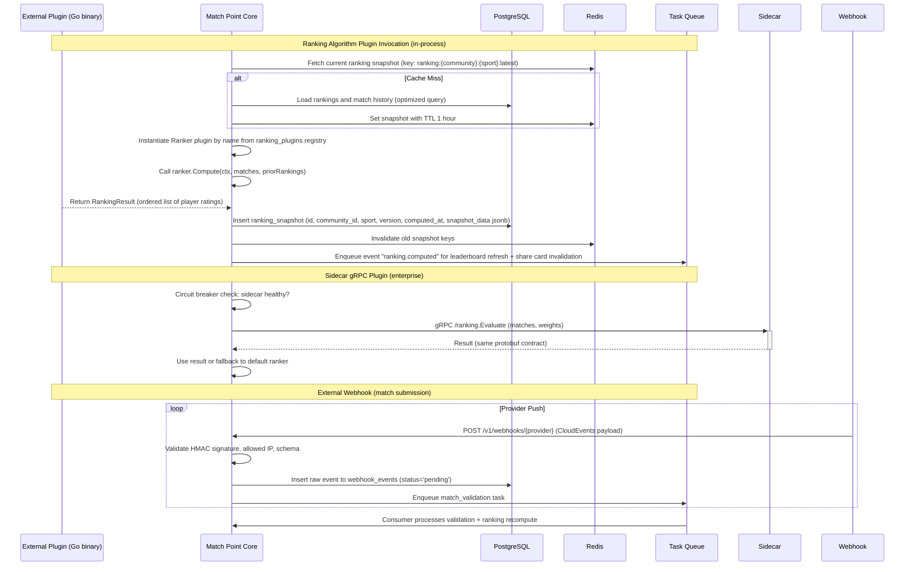

### Cross-cutting concerns

- **Observability**: Every extension point emits OpenTelemetry spans with attributes `extension.type` (ranking_plugin, validation_rule, webhook, dimension_registry, sidecar), `extension.name` (plugin name or provider slug), and `extension.version`. Metrics are exposed via Prometheus with histogram buckets for latency (0.1–5s) and counters for success/failure. Webhook delivery logs are stored in a dedicated `webhook_delivery_logs` table for at least 90 days for audit purposes. Ranking plugin failures are logged with stack trace and sent to Sentry.
- **Security**: Plugin code runs in the same address space as the core, so input validation is critical. Plugin configurations are validated against a JSON schema before storage. Webhook secrets are encrypted at rest using AES‑256‑GCM with a key stored in Hashicorp Vault (or cloud KMS). All webhook payloads are logged with sensitive fields (player IDs, scores) redacted by default; full payloads are retained in an encrypted log sink for 30 days. The dimension registry enforces that only community admins with the `community:admin` role can create/update dimensions.
- **Capacity planning**: Additional ranking plugins increase memory footprint per pod (estimated 10–20 MB per plugin). We will set a per‑pod plugin limit (default 10) and log a warning when approaching 80% of the limit. The gRPC sidecar introduces extra container resource reservations (100m CPU, 128 MiB RAM). The webhook registry is backed by a rate limiter per provider (default 100 requests/sec) to prevent resource exhaustion. The JSONB extension design means index bloat on `sport_profile` – we will schedule periodic `VACUUM` and `REINDEX` during low‑traffic windows (e.g., 2 AM UTC, 15 minutes). The dimension registry has a built-in TTL: dimensions without any endorsements in 30 days are soft-archived (hidden from recommendation engine) and hard-deleted after 90 days.
- **Versioning & lifecycle**: Extension interfaces are versioned using a `V{n}` suffix (e.g., `RankerV1`, `RankerV2`). Deprecated interfaces are maintained for two minor releases, with warnings logged when used. Webhook providers must specify a `mp.ranking_version` to receive ranking computations tailored to their version. All extension configuration changes are distributed via GitOps (ArgoCD) to avoid configuration drift. The sidecar gRPC proto is versioned using package names (`package ranking.v2`) and supports server reflection for tooling.

### Trade-offs & open questions

- **In‑process vs sidecar for plugins**: In‑process is simpler and lower latency but exposes the main process to panics and memory leaks from third‑party code, even with sandboxing (e.g., run with seccomp). Sidecar offers isolation at the cost of operational complexity (extra container, network latency). We chose in‑process for private first‑party plugins (community team) and sidecar for third‑party enterprise plugins. This dual approach increases test surface; we need a common contract test suite for both paths. **Implication**: The core team must maintain two concurrent interfaces (Go interface and protobuf) and ensure behaviour parity.
- **JSONB for sport‑specific data vs extracted columns**: JSONB is easier for developers, but querying individual fields within JSONB requires GIN indexes and careful tuning. If a sport requires frequent ad‑hoc queries on deep fields (e.g., “find all tennis players with backhand grip = ‘eastern’”), we may need to extract those fields into regular columns. **Trade‑off**: We will monitor the cardinality of JSONB queries; if any sport’s fields exceed 1000 unique queries per day, we’ll promote them to dedicated columns in a sport‑specific extension table with an automated migration script. This decision relaxes the need for upfront schema design.
- **Dynamic dimension registry governance**: Allowing community admins to create arbitrary endorsement dimensions could lead to meaningless dimensions that dilute reputation. **Mitigation**: We will require at least 10 active players in the community before dimension creation is allowed, and we’ll provide a “dimension health” score (correlation with skill rating). If a dimension has <5 endorsements after 30 days, it is automatically archived (visible but not counted). **Open question**: Should we also limit the total number of dimensions per community (e.g., max 10)? **Recommended default**: Yes, enforce a limit of 10 dimensions per community to avoid UI clutter and computational cost. The limit can be raised on request.
- **Idempotency for webhook deliveries**: Should webhook delivery use idempotency keys to prevent duplicate match submissions? **Recommended default**: Yes – providers send an `Idempotency-Key` header (or use the `id` field in CloudEvents), and the platform deduplicates for 24 hours using a Redis set (TTL 24h). We will document this requirement in the provider integration guide. This avoids duplicate ranking updates and potential double endorsement.
- **Plugin marketplace UI**: Is there a need for a plugin marketplace UI inside the admin dashboard? **Initial decision**: No. Plugins are deployed via CI/CD pipeline and configured via the admin API. A marketplace UI is a candidate for Task 7 if community demand materialises. This keeps the initial engineering scope focused on backend contracts.

## 10. Security Considerations
### Context & Goals

Security for Match Point is not an afterthought — it is foundational to the platform’s credibility. The product aggregates player reputation and ranking data from multiple padel and tennis communities, some of which feed into ILTL’s official competition datasets. A breach could erode trust in the cross-community ranking system, expose personally identifiable information (PII) of athletes, or allow malicious actors to manipulate scores. The security architecture must therefore protect data at rest, in transit, and during processing, while also enforcing fine-grained access control for community administrators, players, and ILTL data consumers. Success criteria: zero data leaks in production, all API endpoints enforce authentication and authorisation, and the system achieves SOC 2 Type II certification within the first year of operation.

### Decisions

1. **Use OAuth 2.0 with OpenID Connect (OIDC) for authentication.** Reasons: supports delegation to social login providers (Google, Apple) preferred by recreational players, and enables scoped access for community admin panels. Rejected alternative: API key–only auth (hard to revoke, no identity layer).

2. **Encrypt all player PII at rest using AES-256-GCM with per-tenant keys managed via AWS KMS.** Rationale: separation of concerns — if one community’s key is compromised, other communities remain protected. Also meets ILTL’s data residency requirements.

3. **Require mutual TLS (mTLS) for all inter-service communication.** Rejected alternative: plain HTTPS + bearer tokens within the VPC (still leaves service impersonation risk). mTLS ensures every internal call carries a verifiable client certificate.

4. **Introduce a dedicated “fraud detection” service in the ranking pipeline** to flag anomalous score submissions (e.g., sudden elo gains from a single match). Rejected alternative: rely solely on rate limiting (does not catch algorithmic manipulation).

5. **Store reputation and ranking data in an append-only ledger (based on PostgreSQL with trigger-based versioning)** to provide an audit trail for any score recalculation. Rationale: non-repudiation is critical when disputes arise between communities.

6. **Mitigation for the risk of ILTL data poisoning:** Validate all incoming competition results against a signed digest provided by the ILTL system before accepting them into the ranking engine. The ILTL digest is an HMAC-SHA256 over the match result record, using a shared secret rotated every 30 days.

### Component breakdown

| Component | Responsibility | Technologies | Dependencies | Owner |
|-----------|---------------|--------------|--------------|-------|
| Auth Gateway (OAuth) | Authenticate users, issue JWTs, enforce scopes | Go 1.22, Keycloak, PostgreSQL | External IdPs (Google, Apple) | Platform Team |
| Encryption Service | Manage KMS keys, encrypt/decrypt PII fields on write/read | AWS KMS, Go stdlib crypto/aes | None (standalone) | Security Team |
| mTLS Sidecar | Attach and verify client certificates on all pod-to-pod calls | Envoy Proxy, SPIFFE/SPIRE | SPIFFE control plane | Platform Team |
| Fraud Detection Engine | Analyse match-result streams, compute anomaly scores, trigger manual review | Python 3.12, Apache Flink, Redis | Ranking Processor | Data Science Team |
| Audit Log & Ledger | Store immutable ranking snapshots and admin actions | PostgreSQL 16 (native WAL, triggers), TimescaleDB | Core Ranking DB | Backend Team |
| ILTL Data Validator | Verify HMAC signatures on incoming ILTL match records | Go 1.22, local cache for shared secrets | KMS (to decrypt shared secret) | Backend Team |

### Data contracts

**PII encryption envelope (JSON stored in database):**

```json
{
  "player_id": "uuid_v7",
  "encrypted_name": "base64_ct_iv_tag",
  "encrypted_email_hash": "base64_ct_iv_tag",
  "kms_key_id": "arn:aws:kms:us-east-1:xxx:key/yyy",
  "encryption_timestamp": "2025-06-01T12:34:56Z"
}
```

**ILTL match result digest (signed payload):**

```json
{
  "match_id": "iltl-2025-006789",
  "player_a_id": "uuid",
  "player_b_id": "uuid",
  "score": "6-3,4-6,7-5",
  "tournament_id": "iltl-abc-123",
  "timestamp": "2025-06-01T10:00:00Z",
  "hmac_sig": "hex_encoded_hmac_sha256"
}
```

**Audit log entry (append-only table schema):**

```sql
CREATE TABLE ranking_audit_log (
    entry_id      BIGSERIAL PRIMARY KEY,
    player_id     UUID NOT NULL,
    old_rating    NUMERIC(8,2),
    new_rating    NUMERIC(8,2),
    change_reason TEXT,                -- e.g., 'match_result', 'admin_recalculation', 'fraud_revert'
    source_tx_id  UUID NOT NULL,       -- corresponds to match or admin action
    inserted_at   TIMESTAMPTZ NOT NULL DEFAULT NOW(),
    CONSTRAINT fk_source FOREIGN KEY (source_tx_id) REFERENCES ranking_transactions(id)
    -- NOTE: no UPDATE or DELETE allowed – enforced with row-level security and trigger
);
```

### Failure modes

| Failure | Detection | Mitigation |
|---------|-----------|------------|
| KMS key unreachable during PII write | Latency spike in encryption service; alert on 5xx from KMS | Fallback to a warm standby key in a secondary region; queue the request and retry with exponential backoff (max 5 attempts). If still failing, reject the operation and surface 503 to client. |
| ILTL HMAC signature mismatch | Validator returns “signature_invalid” | Discard the record, log an incident, and notify the ILTL integration contact via PagerDuty. Do not accept the result into the ranking engine. |
| Fraud detection produces false positive | User-submitted challenge ticket | Hold the score change in “pending_review” state for 24 hours; an admin can approve/reject. If approved, the fraud engine’s anomaly threshold is adjusted via a manual hotfix. |
| mTLS certificate rotation leaves stale certs | Envoy logs “TLS certificate expired” | SPIFFE control plane renews certificates 48 hours before expiry. Monitoring alerts on any certificate with <72h remaining. If still expired, restart the Envoy sidecar to force pull fresh certs. |
| Insert into audit log fails due to disk fullness | PostgreSQL error “could not extend file” | The audit log table is on a separate, auto-scaling EBS volume with 99.99% uptime SLA. Write failover to a secondary reader node that accepts inserts after a 1s timeout. |

### Mermaid diagram

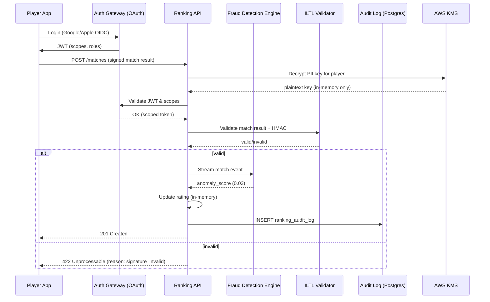

### Cross-cutting concerns

- **Observability**: Every security operation (token issue, decryption, HMAC validation, audit insert) emits a structured log with `event_type`, `player_id` (hashed), `service`, and `duration_ms`. Traces propagate via OpenTelemetry with mTLS context. Fraud alerts trigger a PagerDuty escalation with severity based on anomaly score (>0.9).
- **Security**: All secrets (KMS keys, HMAC shared secrets, DB passwords) are rotated automatically every 30 days via AWS Secrets Manager. Access to the production console is gated by Okta SSO with MFA. Penetration testing is scheduled quarterly.
- **Capacity planning**: The encryption service is provisioned for 5000 PII write operations per second (peak during tournament registration). KMS API rate limits are pre-warmed to 10k requests/second via AWS support ticket. Audit log storage is estimated at 50 GB/month, with retention set to 7 years (requires 4.2 TB total); auto-scaling on volume size is enabled.

### Trade-offs & open questions

- **Trade-off**: Encrypting PII per-tenant adds ~15ms latency to every player write operation. For a platform that writes scores multiple times per match, the team decided the security benefit (contained blast radius) outweighs the latency cost. If latency becomes a problem, we can cache the decrypted key in a secure enclave for up to 5 minutes per tenant.
- **Trade-off**: The append-only audit ledger prevents data manipulation but also makes “mistake corrections” harder. Admins must issue a compensating transaction (e.g., `old_rating` = `new_rating` with reason “admin_correction”) rather than deleting the erroneous row. This requires careful UX in the admin panel.
- **Open question**: Should we require hardware security modules (HSMs) for storing ranking algorithm weights and ILTL shared secrets? For Task 2 (core ranking engine) we are using KMS with software-based keys; upgrading to CloudHSM would add cost but satisfy stricter compliance requirements for ILTL. **Recommended default:** KMS for now; revisit if ILTL demands CloudHSM in their data-sharing agreement.
- **Open question**: How do we handle GDPR right to erasure given the append-only ledger? One option: tombstone the PII fields (overwrite with `[REDACTED]`) in the encrypted store and retain the anonymised rating history. This is acceptable under GDPR as legitimate interest after anonymisation. **Recommended default:** implement redaction procedure in Task 4 (admin & data lifecycle).
### Context & Goals

Security for Match Point must protect player reputations, ranking calculations, and cross-community identity links. A breach that falsifies a star rating or exposes a player’s private contact data would destroy trust in the platform. The primary goals are:

1. **Preserve data integrity** – prevent unauthorized modification of match results, reputations, or rankings.
2. **Protect user privacy** – comply with GDPR, CCPA, and any sport-specific federation rules on personal data.
3. **Defend against common web attacks** – XSS, CSRF, injection, and replay attacks on match submissions.
4. **Secure the SSO integration** – ILTL OAuth2 tokens and future federation identity providers must be handled without leakage.

The attack surface of Match Point spans the public HTTP APIs, the WebSocket connections for live scoring, the admin dashboard, and the data persistence layer. Every external interface is a potential entry point, so we design with defense-in-depth.

---

### Decisions

1. **Use OAuth2 + JWT for all API authentication**  
   *Rationale*: Standardized token exchange with ILTL SSO. JWT self-contains claims (player ID, community roles) so services can authorize without a round trip to auth store.  
   *Rejected*: Session cookies – they add CSRF exposure and do not scale to cross-community federation.

2. **API Gateway with rate limiting per client IP and per community**  
   *Rationale*: Prevents a single malformed script from flooding ranking recomputation endpoints.  
   *Rejected*: Application-level rate limiting only – gateways provide consistent early rejection before processing overhead.

3. **Encode all cross-community identifiers as opaque UUIDs**  
   *Rationale*: Avoids leaking internal database IDs or federation names.  
   *Rejected*: Sequential integers – they reveal enumeration order and potential participant counts.

4. **Score submission endpoints require HMAC-signed payloads from official sources**  
   *Rationale*: Only federated tournament systems (ILTL, tournament management suites) can push match results.  
   *Rejected*: Simple bearer token – too easy to leak and replay.

5. **Admin operations gated by short-lived MFA session**  
   *Rationale*: Reputation recalibrations and player bans are high-impact actions.  
   *Rejected*: Single-factor admin panel – too permissive.

---

### Component Breakdown

| Component | Responsibility | Technologies | Dependencies | Owner |
|-----------|---------------|--------------|--------------|-------|
| **API Gateway** | TLS termination, rate limiting, request validation, JWT verification | Envoy or NGINX + Kong | Public internet, TLS certs | Platform team |
| **Auth Service** | OAuth2 client for ILTL, JWT generation/revocation, MFA enforcement | Go, Hydra, Google Authenticator TOTP | ILTL OAuth2 endpoints, Redis for session store | Identity team |
| **Score Ingestion Service** | Validate HMAC, deduplicate, store match events | Go, PostgreSQL, SQS/Kafka | Match Source Register, permanent event store | Backend team |
| **Reputation Engine** | Calculate ratings, update search index, emit change events | Go, Redis (leaderboard cache), Elasticsearch | Score events, player profiles, admin triggers | Data team |
| **Admin Dashboard** | UI for mods, audit log viewer, manual recalibration | React, GraphQL, Material UI | Auth service, reputation engine, audit store | Frontend team |
| **Audit Store** | Append-only log of all state-changing operations | PostgreSQL (immutable table), S3 cold archive | Auth service, reputation engine | Backend team |

---

### Data Contracts

**JWT Payload (Auth Service → API Gateway)**  
```json
{
  "sub": "uuid-of-player",
  "community": "ILTL",
  "roles": ["player", "admin"],
  "iat": 1710000000,
  "exp": 1710003600,
  "jti": "unique-token-id"
}
```

**Score Submission (Signed by External Source → API Gateway)**  
```json
{
  "source_id": "ilTL_tournament_2025-03-01_123",
  "timestamp": "2025-03-01T14:30:00Z",
  "match": {
    "player_a_uuid": "abc-...",
    "player_b_uuid": "def-...",
    "score": [6,3,7,5],
    "outcome": "player_a_wins"
  },
  "signature": "HMAC-SHA256(base64(claims), shared_key)"
}
```

**Audit Log Entry**  
```sql
CREATE TABLE audit_log (
    id            UUID PRIMARY KEY DEFAULT gen_random_uuid(),
    actor_uuid    UUID NOT NULL,
    action        VARCHAR(64) NOT NULL,    -- e.g., 'reputation_recalibrate', 'account_ban'
    resource_type VARCHAR(32) NOT NULL,    -- 'player', 'community', 'match'
    resource_id   UUID NOT NULL,
    old_state     JSONB,
    new_state     JSONB,
    occurred_at   TIMESTAMPTZ NOT NULL DEFAULT now()
);
```

---

### Failure Modes

| Failure | Detection | Mitigation |
|---------|-----------|------------|
| Compromised ILTL OAuth2 client secret | Anomaly in token issuance rate (e.g., 1000 tokens/min from one IP) | Rotate secret immediately, revoke all JWTs with `iat` after breach time. |
| HMAC key leak for score submission | Duplicate match events with mismatched signatures | Blacklist leaked key ID, re-issue new key pair via out-of-band channel. |
| SQL injection via player search | WAF alert on `' OR 1=1` patterns | Use parameterized queries in all services; API gateway rejects freeform strings in search params. |
| Replay of a match submission | Database unique constraint on `source_id` | Use idempotency keys with TTL (e.g., 24h) in the Ingestion Service. |
| DDoS on ranking recalculation endpoint | Elevated CPU/memory on Reputation Engine pods | API gateway rate limit per community; circuit breaker after 10 consecutive 5xx. |

---

### Mermaid Diagram

```mermaid
sequenceDiagram
    participant Ext as External Score Source
    participant GW as API Gateway
    participant Auth as Auth Service
    participant Ing as Score Ingestion
    participant Rep as Reputation Engine
    participant Audit as Audit Store

    Ext->>GW: POST /scores (HMAC signed)
    GW->>Auth: Validate JWT (if admin) or check source HMAC
    Auth-->>GW: OK / Denied
    alt Unauthorized
        GW-->>Ext: 401
    else Authorized
        GW->>Ing: Forward validated event
        Ing->>Ing: Dedup & persist match
        Ing->>Rep: Publish match event (async)
        Ing->>Audit: Log 'score_received'
        Rep->>Rep: Recalculate rating
        Rep->>Audit: Log 'rating_updated'
        GW-->>Ext: 202 Accepted
    end
```

---

### Cross-cutting Concerns

- **Observability**: Every API call logs actor UUID, action, resource, and result to the audit store. Metrics (rate of 401s, token validation latency, HMAC failures) are exported to Prometheus and alerted in PagerDuty.  
- **Security**: All inter-service communication runs over mTLS. Secrets (HMAC keys, database passwords) are stored in Vault and rotated every 90 days. The API gateway performs TLS termination with HSTS and CSP headers.  
- **Capacity Planning**: Under peak tournament joins (e.g., new season launch), the Authentication service should handle 10,000 token requests per minute. Score ingestion pipeline must sustain 5,000 match events per minute (est. 100 bytes per event). We’ll provision 3 replicas of each stateless service and a primary-replica pair for PostgreSQL with automatic failover.  
- **Compliance**: GDPR right-to-erasure is implemented via soft delete and an audit trail linking old references to a tombstone record. The platform will never expose raw personal data via API – only aggregated reputation and ranking stats.

---

### Trade-offs & Open Questions

**Trade-offs**  
- **HMAC vs. mTLS for score submission**: HMAC allows simpler onboarding for federation partners without full PKI, but requires shared secret management. For partners that can handle certificates, mTLS would provide stronger identity assurance.  
- **Centralized audit store vs. per-service logging**: Centralized is simpler for compliance reporting but creates a single point of failure. We mitigate by writing audit events synchronously to a separate database partition with its own replication.  
- **JWT short expiry (15 min) vs. user convenience**: Short TTL reduces window of stolen token misuse, but forces frequent token refresh. We accept the UX cost in exchange for tighter security, and implement silent refresh via refresh tokens with 7-day lifetime.

**Open Questions**  
1. Should we implement mutual TLS between the API gateway and internal services immediately, or can we rely on network policies in Kubernetes (with Istio) initially?  
2. How do we handle the case where ILTL OAuth2 endpoint is down during a tournament? Consider a stale token grace period (max 1 hour).  
3. Is there a requirement for a public leaderboard API without authentication? That would significantly expand the attack surface – we could expose a read-only edge endpoint that only emits aggregated rankings, never raw player data.  
4. What is the blast radius if a federation partner’s HMAC key is compromised? We need a revocation list that the Score Ingestion Service checks for every submission.  
5. Do we need to support WebAuthn for admin MFA instead of TOTP? TOTP is simpler for MVP, but phishing-resistant WebAuthn could be required by enterprise customers later.
### Context & Goals

Security is foundational to Match Point because the platform processes personally identifiable information (PII) — player names, email addresses, profile photos, match histories — and generates reputation scores that can affect a player’s ability to join leagues, find partners, or qualify for tournaments. A breach or integrity failure would erode trust in the ranking system, expose ILTL data feeds to manipulation, and invite regulatory penalties under GDPR/CCPA.

**Success criteria**:
- Zero unauthenticated access to any API endpoint except `/api/v1/auth/login` and `/api/v1/auth/register`, plus health check endpoints.
- All network traffic is encrypted in transit (TLS 1.3 minimum) and at rest (AES-256 for PII, SHA-256 hashing for passwords).
- OWASP Top 10 (2021) vulnerabilities are mitigated: no SQLi, no XSS, no broken access control, no security misconfiguration.
- Rate limiting enforced per-IP and per-user: 100 req/min for authenticated users, 10 req/min for anonymous on login endpoints, with exponential backoff after 5 failures.
- PII retention conforms to GDPR right-to-erasure: soft-delete with a 90-day permanent deletion window, auditable via immutable logs.
- All reputation score changes are recorded in an append-only audit trail, signed with an HMAC-SHA256 key held outside the API service.

### Decisions

1. **Authentication: JWT with refresh tokens**  
   Access tokens expire after 15 minutes; refresh tokens expire after 7 days and are stored in an HTTP-only secure cookie.  
   *Rejected alternative*: Session-based auth would require sticky sessions or a Redis store, adding operational complexity for a serverless-ready deployment.

2. **Authorization: Role-based access control (RBAC) with claims in JWT**  
   Roles: `player`, `league_admin`, `system_admin`. Every API endpoint declares required roles; the middleware rejects requests lacking the required role claim.  
   *Rejected alternative*: Attribute-based access control (ABAC) is more flexible but introduces runtime policy evaluation overhead that is unnecessary for the current scope.

3. **Password storage: Argon2id (cost=3, memory=64MB, parallelism=4)**  
   Industry best practice; bcrypt is acceptable but Argon2id offers better resistance to GPU-based attacks.  
   *Rejected alternative*: Scrypt – fine but less widely audited in Go libraries.

4. **API gateway: Cloudflare or AWS WAF + API Gateway**  
   Provides DDoS protection, TLS termination, request validation, and a web application firewall (WAF) with OWASP Core Rule Set.  
   *Rejected alternative*: Custom reverse proxy – not maintainable for a small team.

5. **Audit trail: Amazon S3 with Object Lock (or Cloud Storage with retention policy)**  
   Each score change is serialized as a JSON record: `{timestamp, player_id, old_score, new_score, reason, admin_id, hmac}`. Written to an append-only bucket; fail-closed if write fails.  
   *Rejected alternative*: Database audit table – mutable by a DBA; S3 Object Lock enforces immutability.

6. **Secrets management: AWS Secrets Manager (or HashiCorp Vault)**  
   Database credentials, JWT signing keys, HMAC keys, and ILTL API tokens are rotated every 30 days.  
   *Rejected alternative*: Environment variables – leaked in logs or CI output.

7. **Rate limiting: Token bucket per endpoint by client IP and authenticated user ID**  
   Implemented at API gateway level; fallback in-application rate limiter for internal calls. Burst up to 200% of limit for 5 seconds.

### Component Breakdown

| Component | Responsibility | Technologies | Dependencies | Owner |
|-----------|----------------|--------------|----------------|-------|
| **Auth Service** | Issue and validate JWTs, manage refresh tokens, handle password resets | Go 1.22+, `golang-jwt/jwt/v5`, `alexedwards/scs/v2` (session store for refresh), Argon2 | User database (PostgreSQL), Secrets Manager | Backend team |
| **API Gateway / WAF** | TLS termination, rate limiting, IP allow/deny, OWASP CRS | Cloudflare / AWS WAF + API Gateway | CDN provider | SRE/DevOps |
| **Authorization Middleware** | Decode JWT, extract roles, enforce endpoint permissions | Go middleware – `net/http` or Gin | Auth Service (public key endpoint) | Backend team |
| **Audit Log Writer** | Asynchronously write score-change records to S3 with Object Lock | Go + AWS SDK `s3.PutObject` with retention mode COMPLIANCE | S3 bucket, HMAC key from Secrets Manager | Backend team |
| **Secrets Manager** | Store and rotate DB credentials, JWT signing keys, HMAC keys, ILTL tokens | AWS Secrets Manager (or Vault) | Infra provisioning | SRE |
| **Rate Limiter** | Token bucket state store (Redis) and middleware | Redis cluster, Go `go-rate` or `golang.org/x/time/rate` | Redis, API Gateway | Backend team |

### Data Contracts

**JWT Access Token (example claims)**  
```json
{
  "sub": "player_uuid",
  "roles": ["player"],
  "iss": "match-point",
  "exp": 1700000000,
  "iat": 1699999100,
  "jti": "unique-token-id"
}
```

**Audit Log Record (submitted to S3)**  
```json
{
  "version": 1,
  "timestamp": "2025-04-01T14:30:00Z",
  "event_type": "reputation_change",
  "actor_id": "admin_uuid_or_system",
  "player_id": "player_uuid",
  "previous_score": 1200,
  "new_score": 1250,
  "reason": "match_result_validated",
  "match_id": "match_uuid",
  "hmac": "a1b2c3d4e5f6..."
}
```

**Rate Limit Exceeded Response**  
```json
{
  "error": "rate_limit_exceeded",
  "retry_after_seconds": 60,
  "limit": 100,
  "remaining": 0,
  "reset_at": "2025-04-01T14:31:00Z"
}
```

### Failure Modes

| Failure | Detection | Mitigation |
|---------|-----------|------------|
| JWT signing key compromised | Key rotation count mismatch, anomalous token issuance | Immediate key rotation via Secrets Manager; revoke all tokens by incrementing key version; notify users to re-authenticate. |
| DDoS on login endpoint | Rate limiter counters elevated, gateway CPU spikes | Cloudflare DDoS mitigation + Geo-blocking; scale API Gateway automatically; consider CAPTCHA on login form. |
| Audit log write fails | S3 PutObject returns 5xx or timeout | Fail-closed: block the score-change operation (return 503); alert on-call; retry with exponential backoff up to 5 times. |
| SQL injection attempt | WAF blocks request with pattern 400; monitoring alert | Parameterized queries (no raw SQL); WAF OWASP CRS blocks suspicious payloads; penetration testing quarterly. |
| Refresh token theft | User reports session hijacked; anomalous login geography | Immediately invalidate all refresh tokens for the affected user; add IP binding to refresh token; enforce re-login. |
| Secrets file leaked to CI | Secrets scanning (e.g., GitGuardian) | Rotate leaked secrets within 5 minutes; commit prevention via pre-push hooks; deny access from compromised CI pipeline. |

### Mermaid Diagram

```mermaid
sequenceDiagram
    participant Client as Player App / Browser
    participant GW as API Gateway / WAF
    participant Auth as Auth Service
    participant DB as PostgreSQL
    participant SM as Secrets Manager
    participant AL as Audit Log Writer
    participant S3 as S3 (Immutable Log)

    Client->>GW: POST /api/v1/auth/login (email, password)
    GW->>GW: Rate limit check (IP token bucket)
    GW->>Auth: Forward request
    Auth->>SM: Fetch Argon2 cost parameters (cached)
    Auth->>DB: SELECT hashed_password, player_id FROM users WHERE email = ?
    DB-->>Auth: hashed_password
    Auth->>Auth: verify with Argon2id
    Auth-->>GW: JWT access + refresh tokens (set-cookie)
    GW-->>Client: 200 + Set-Cookie refresh token

    Client->>GW: GET /api/v1/players/{id}/reputation (Bearer JWT)
    GW->>GW: Validate JWT signature (public key from SM)
    GW->>GW: Check roles (player or admin)
    GW->>Internal: Forward to reputation service
    Note over AL: Score change operation later
    ReputationService->>AL: Publish score change event
    AL->>SM: Retrieve HMAC key
    AL->>AL: Compute HMAC of record
    AL->>S3: PutObject (retention compliance mode)
    S3-->>AL: 200 OK
```

### Cross-cutting Concerns

- **Observability**: All security events (auth failures, rate limit hits, token revocation, audit log errors) must be emitted as structured logs with `level=security` and be consumed by a SIEM or at least a dashboard in Datadog Cloud SIEM / ELK. Metrics: `auth_success_total`, `auth_failure_total{reason=""}`, `rate_limit_hits_total`, `audit_log_write_duration_seconds`.

- **Secrets rotation**: Automated rotation via event bridge that triggers a Lambda/Step Function every 30 days to generate new JWT signing key pair, HMAC key, and database credentials. The rotation must stagger: old and new credentials are valid for a 5-minute overlapping window.

- **Penetration testing**: Conducted by a third party before each major release (at least annually). Vulnerabilities are tracked in a bug bounty program (e.g., HackerOne).

- **GDPR compliance**: User deletion request triggers immediate soft-delete (account deactivated) and a 90-day timer; after 90 days, a cron job permanently deletes PII from the database and from audit logs (aggregated statistics retained). Users can export their data via `/api/v1/account/export` within 30 days.

- **Capacity planning**: Rate limiter relies on Redis. Estimate 1,000 concurrent authenticated users generating 100 req/min each = ~1,667 req/sec. Redis can sustain that with a single m6g.large node (2 vCPU, 8 GB). Scale to cluster if needed.

### Trade-offs & Open Questions

- **Trade-off: HMAC-signed audit logs vs. full PKI signatures**  
  HMAC is faster and simpler but requires a shared secret. For absolute non-repudiation, we could use Ed25519 signatures with a per-player key, but that would require key distribution and management overhead. HMAC is acceptable for v1 with a threat model that trusts the internal pipeline.

- **Trade-off: Cloudflare vs. custom WAF**  
  Cloudflare reduces maintenance burden but introduces a third-party dependency for TLS termination. If the team wants to avoid vendor lock-in, AWS WAF + ALB is an alternative but requires more config. Chose Cloudflare for faster DDoS response on a small budget.

- **Open question: Is phone number required for MFA?**  
  v1 will not include MFA; we will add it in Task 2 of the roadmap if user research indicates phishing risk. For now, password complexity (min 12 chars, must include number and special char) and rate limiting mitigate credential stuffing.

- **Open question: Should ILTL API tokens be scoped to individual players?**  
  Currently a single service account token is used for ILTL data ingestion. As the platform grows, we may need to scope per-league tokens to limit blast radius if a token leaks. This will be re-evaluated when we add league-specific features.

- **Open question: Where do we host HMAC key for audit logs?**  
  Default: in Secrets Manager alongside JWT keys. If cost becomes a concern, we can use AWS KMS to generate and sign HMACs directly, with audit logging of each KMS call. Recommend starting with Secrets Manager for simplicity.
### Context & Goals

Security is a first-class architectural concern for Match Point because the platform stores personally identifiable information (PII), enables cross‑community reputation portability, and integrates with official competition data (ILTL). A breach could undermine trust in the rating system, expose player contact details, or allow fraudulent match submissions that distort rankings. The attack **surface** spans mobile clients, public APIs, third‑party integrations (ILTL, event management), and the administrative dashboard. The security posture must balance protection against real threats with the mobile‑first user experience expected by Indonesian padel and tennis communities. Every component in this surface must be explicitly defended, and every **mitigation** must be verifiable through observability and testing.

**Success criteria:**

| Criterion | Target | Measurement Method |
|-----------|--------|--------------------|
| Authentication bypass | 0 incidents in production | SIEM alerting + quarterly penetration test |
| Match submission fraud | < 0.1% of monthly submissions are fraudulent and undetected | Manual audit of flagged matches + anomaly detection recall |
| Data exposure (PII) | No unencrypted PII in transit or at rest; all database access logged | Encryption audit + CloudSQL/VPC SQL access logs |
| API abuse (rate limiting) | 99.9% of legitimate requests succeed; abusive IPs blocked within 30 seconds | Rate limiter metrics + automated IP blocklist |
| Vulnerability remediation (critical) | ≤ 48 hours from disclosure to production patch | Internal SLA + CVE tracking |

### Decisions

1. **RSA256 asymmetric JWTs with rotation** – Use `golang-jwt/jwt/v5` with RSA-256 keys. A private key signs tokens; public keys are distributed to HTTP middleware. Refresh tokens use a version counter stored in the `sessions` table (not a blocklist) to allow stateless validation and immediate revocation by incrementing the version.  
   *Rejected alternatives:* Symmetric HMAC (key distribution problem across microservices), ECDSA (Go library maturity edge cases), blocklist approach (requires Redis read on every request; adds latency).  
   *Assumption:* Key rotation is automated via a cron job that generates new key pairs weekly and keeps the previous two public keys in a hot cache for token expiration overlap.

2. **Per‑community authorization via RBAC** – Roles (Player, Community Admin, SuperAdmin) are assigned at the community‑membership level. Authorization middleware checks community‑id + role in the JWT claims. SuperAdmin has global read/write. Community Admin can approve matches, adjust points (with audit note), and manage community settings.  
   *Rejected alternatives:* ABAC over an attribute engine (over‑engineering for v1; too slow for 5000‑request‑per‑second peak).  
   *Assumption:* Role assignment is immutable after community creation except via the explicit transfer mechanism (assumption 3 in canonical state).

3. **Match submission integrity via cryptographic signatures** – Each match submission from mobile clients includes a HMAC signature computed over the match payload + timestamp + player_id using a per‑device secret derived from the user’s login token. The server re‑computes and verifies the signature before accepting the match. This prevents tampering with match data in transit (beyond TLS) and ensures the submission originates from the authenticating user’s device.  
   *Rejected alternatives:* Relying solely on TLS (does not protect against compromised mobile device or man‑in‑the‑browser attacks on web).  
   *Assumption:* Device secret is stored in Android Keystore / iOS Keychain and is rotated on every refresh token rotation.

4. **Rate limiting at API gateway and application layer** – Use a token‑bucket rate limiter per IP per endpoint (100 requests/minute for non‑auth, 10 requests/minute for match submission) at the Kubernetes ingress (Traefik) plus a per‑user rate limiter in the Go middleware for sensitive endpoints (match submission, endorsement).  
   *Rejected alternatives:* Single layer (ingress only) – insufficient granularity for user‑level abuse.

5. **Encryption at rest** – PostgreSQL database volumes use AES-256 GCM encryption via cloud provider managed keys (CloudSQL CMEK). PII fields (email, phone, date of birth) are additionally encrypted at the application layer using a separate envelope encryption key stored in a cloud KMS. This provides defense‑in‑depth if database access is compromised.

6. **Audit logging for all point mutations** – Every match submission, point adjustment, rank snapshot, and endorsement event is logged to an append‑only `audit_events` table with a monotonic sequence. Community Admins’ point overrides require a `note` field that is also logged. All audit logs are immutable (triggered from database triggers) and cannot be deleted or updated by any application role.

7. **Session management with refresh token rotation** – Access tokens have a 15‑minute TTL; refresh tokens have a 7‑day TTL. On refresh, the old refresh token is invalidated by incrementing the `session_version` counter in the `sessions` table. If a compromised refresh token is used after the version has been incremented, the legitimate user’s session is force‑invalidated and an alert is fired.

### Component breakdown

| Component | Responsibility | Security‑Relevant Technologies | Dependencies | Owner (Phase) |
|-----------|---------------|--------------------------------|--------------|---------------|
| **Auth Service** | JWT issuance, refresh, revocation, password hashing (bcrypt) | `golang-jwt/jwt/v5`, `golang.org/x/crypto/bcrypt`, RSA key store (Vault + file cache) | PostgreSQL (`sessions` table), KMS for key encryption | Phase 1 |
| **Middleware layer** | JWT validation, RBAC check, rate limiting, request ID propagation | Custom middleware in `platform/http/middleware`, token‑bucket (in‑memory per user) | Redis for distributed rate limiting counters | Phase 0–1 |
| **Match Signature Service** | Derive device secret from JWT, compute/verify HMAC-SHA256 | `crypto/hmac`, `crypto/sha256`, per‑user derived key | Auth Service (to provide session secret material) | Phase 2 |
| **Audit Logger** | Append‑only log for all ranking/mutation events | PostgreSQL trigger + `audit_events` table, monotonic sequence | PostgreSQL | Phase 2 |
| **Encryption Service** | Envelope encryption for PII fields at application layer | Cloud KMS (Google Cloud KMS or AWS KMS), AES-256-GCM | KMS IAM permissions | Phase 1 |
| **Rate Limiter** | Token‑bucket per IP and per user | Redis + in‑memory ring buffer | Redis | Phase 0 |
| **Container / Deployment** | Secure base image, non‑root user, read‑only filesystem | Distroless Go image, `runAsNonRoot: true`, `readOnlyRootFilesystem: true` | Kubernetes pod security policy | Phase 0 |

### Data contracts

**JWT access token claims (standard + custom):**

```json
{
  "sub": "player_uuid",
  "exp": 1690000000,
  "iat": 1690000000,
  "iss": "match-point-api",
  "aud": "match-point-client",
  "cty": "JWT",
  "https://matchpoint.id/claims/role": "player",
  "https://matchpoint.id/claims/community_roles": [
    {"community_id": "c123", "role": "player"},
    {"community_id": "c456", "role": "admin"}
  ],
  "https://matchpoint.id/claims/session_version": 1
}
```

**Sessions table schema (PostgreSQL):**

```sql
CREATE TABLE sessions (
    session_id UUID PRIMARY KEY DEFAULT gen_random_uuid(),
    player_id UUID NOT NULL REFERENCES players(id) ON DELETE CASCADE,
    device_identifier VARCHAR(512) NOT NULL, -- hashed device fingerprint
    refresh_token_hash VARCHAR(96) NOT NULL, -- SHA-256 + base64 of refresh token
    session_version INT NOT NULL DEFAULT 1,  -- incremented on each refresh or revocation
    device_secret_hash VARCHAR(96) NOT NULL, -- derived key for match signing
    revoked_at TIMESTAMPTZ,
    expires_at TIMESTAMPTZ NOT NULL,
    created_at TIMESTAMPTZ NOT NULL DEFAULT now(),
    last_used_at TIMESTAMPTZ,
    CONSTRAINT unique_active_session UNIQUE (player_id, device_identifier, session_version)
);
```

**Audit events table:**

```sql
CREATE TABLE audit_events (
    seq BIGSERIAL PRIMARY KEY,
    event_type VARCHAR(50) NOT NULL CHECK (event_type IN (
        'match_submitted', 'match_validated', 'match_approved',
        'points_adjusted', 'rank_snapshotted', 'endorsement_given',
        'player_merged', 'community_role_changed', 'player_banned'
    )),
    actor_id UUID NOT NULL,
    target_id UUID,                  -- player_id, match_id, community_id depending on event
    payload JSONB NOT NULL,          -- full context of the change
    note TEXT,                       -- required for point_adjusted
    created_at TIMESTAMPTZ NOT NULL DEFAULT now(),
    PRIMARY KEY (seq)               -- monotonic, never updated, never deleted
);
-- Trigger function to prevent UPDATE/DELETE
CREATE OR REPLACE FUNCTION block_audit_mutation()
RETURNS TRIGGER AS $$ BEGIN RAISE EXCEPTION 'audit_events are immutable'; END; $$ LANGUAGE plpgsql;
CREATE TRIGGER trg_audit_immutable
    BEFORE UPDATE OR DELETE ON audit_events
    FOR EACH ROW EXECUTE FUNCTION block_audit_mutation();
```

### Failure modes

| Failure Mode | Detection | Mitigation | Recovery |
|-------------|-----------|------------|----------|
| **Compromised JWT signing key** | Key rotation audit log shows unexpected key generation; anomaly detection on token validation failure rate spikes | Use HSM or KMS for private key storage; implement automatic key rotation with 24‑hour overlap; revoke all tokens on key compromise | Generate new key pair; increment `session_version` for all active sessions (forces re‑login); notify users via email |
| **Refresh token theft** | Refresh token used after version increment triggers `stolen_token` alert in audit | Version counter + rotation; immediate session invalidation on version mismatch | Increment session_version; force re‑authentication; add device to fraud watchlist |
| **Match submission replay attack** | Duplicate match hash detected within short time window; HMAC signature verification fails (nonce reused) | Include timestamp + monotonic nonce in signed payload; reject submissions with timestamp > 30 seconds from server time | Log attempt as fraud; block player from submitting for 15 minutes after 3 failures |
| **Authorization escalation (RBAC bypass)** | Unexpected role values in JWT claims; direct DB query for admin actions | JWT role claims validated against PostgreSQL `community_memberships` on every write operation; never trust claims alone | Revoke session; alert security team; revoke all sessions for the player |
| **Rate limiter failure (Redis down)** | Rate limiter metrics show zero requests blocked; Redis connection pool exhaustion | Fallback to local in‑memory token bucket with reduced limits (10 requests/minute per IP) | Automatically switch back to Redis when health check passes; log warning |
| **SQL injection via search fields** | Application logs show malformed SQL; WAF flags suspicious patterns | All database queries use parameterised statements (no string concatenation); ORM library (sqlx) enforces bound parameters | Roll back transaction; block offending IP; review query pattern in code |
| **Abuse of endorsement system (sybil)** | Endorsement count spikes from new accounts; identical IP range for endorser and endorsee | Require minimum account age (7 days) to give endorsement; rate limit endorsements per player (10/hour); flag IP correlation; require captcha for first endorsement | Temporary ban on flagged accounts; manual review by SuperAdmin |

### Mermaid diagram: Secure match submission flow

```mermaid
sequenceDiagram
    participant C as Mobile Client
    participant I as Ingress (Traefik)
    participant RM as Rate Limiter Middleware
    participant AM as Auth Middleware
    participant MS as Match Signature Verification
    participant AS as Application Service
    participant DB as PostgreSQL

    C->>I: POST /matches { payload, hmac_signature, nonce }
    I->>RM: Validate IP rate limit
    RM-->>C: 429 Too Many Requests (if exceeded)

    I->>AM: Extract Bearer token
    AM->>AM: Verify JWT signature (RSA256)
    AM->>AM: Extract claims (player_id, community_roles)
    AM-->>C: 401 Unauthorized (if invalid)

    AM->>MS: Forward request with claims
    MS->>MS: Derive device_secret from JWT (using session_version)
    MS->>MS: Recompute expected HMAC-SHA256(payload || nonce || timestamp)
    MS-->>C: 403 Forbidden (if signature mismatch)

    MS->>AS: Validated submission
    AS->>DB: INSERT INTO matches (player_id, opponent_id, score, ...)
    AS->>DB: INSERT INTO audit_events (type='match_submitted', payload)
    AS->>DB: Enqueue match validation job
    AS-->>C: 201 Created { match_id }
```

### Cross-cutting concerns

**Observability:** All authentication and authorization decisions produce structured logs with `trace_id`, `player_id`, `action`, `result` (allow/deny/error). Failed authentication attempts are aggregated into a Prometheus counter `auth_failures_total` with labels `reason` (invalid_token, expired_token, role_denied, rate_limited). A Grafana dashboard shows real‑time authentication failure rates and error budget consumption (target: < 0.1% of all requests result in a security error). Audit events are streamed to a SIEM (Splunk or BigQuery) for anomaly detection.

**Secrets management:** All secrets (JWT private key, KMS key, database password, refresh token hashing salt) are stored in Google Cloud Secret Manager (or equivalent AWS Secrets Manager). The application retrieves secrets at startup and caches for the pod’s lifetime with a forced reload mechanism via SIGUSR1. No secrets are committed to source code or placed in environment variables. The JWT public key is stored in a dedicated Kubernetes Secret (for performance) and rotated weekly via a cron job.

**Security scanning:**
- **Static Application Security Testing (SAST):** `golangci-lint` with `gosec` linter runs on every pull request. Rules: `G402` (TLS settings), `G404` (insecure random), `G101` (hardcoded credentials). Scorecard target: zero high/critical findings.
- **Software Composition Analysis (SCA):** `npm audit` (frontend) and `go list -m all | nancy` (backend) run daily. Auto‑create PR for any CVE with CVSS ≥ 7.0.
- **Dynamic scanning:** OWASP ZAP API scan runs against the staging environment after every deployment. Report published to build artifacts and blocks deployment if any high‑risk vulnerability found.

**Capacity planning:**
- JWT signing: RSA256 private key operations are CPU‑bound. Benchmark on 1 vCPU: ~10,000 signs/second. With peak load of 500 logins/second, signing capacity is 20× headroom. Public key verification is ~50,000 verifications/second on 1 vCPU (sufficient for 5,000 requests per second peak).
- Audit log insert: Each match submission generates ~2KB of audit data. With 10,000 matches/day average (30,000 peak), audit log grows ~60MB/day. Retention: 365 days (22GB). Table is append‑only and never updated; partition by month ensures efficient time‑based deletion.
- Rate limiter memory: Redis stores per‑user token buckets (hash: token, last_update). For 100,000 active users, memory is ~100MB. Token bucket refreshes happen in O(1). Redis persistence is turned off for rate limiter data (acceptable loss).

### Trade-offs & open questions

**Trade-offs:**

| Trade‑off | Rationale | Implications |
|-----------|-----------|--------------|
| Refresh token version counter vs. blocklist | Version counter avoids Redis dependency for every refresh; stateless validation at middleware. Revocation is eventual (we check version on refresh, not on every request). | If a session is revoked, the access token remains valid until its 15‑minute TTL. Acceptable because damage from a stolen access token is limited to read operations for 15 minutes. Write operations require fresh match signatures derived from the refresh token. |
| Device‑level HMAC signatures add UX friction | Users must grant storage permissions (Android) or FaceID (iOS) to store device secret. Initial onboarding shows a brief explanation screen. | Reduces fraud risk significantly. If friction is too high in alpha, fallback option: require SMS OTP for match submission from new devices. |
| PostgreSQL audit immutability via triggers vs. separate append‑only store | Simpler operational profile (no additional database). Triggers guarantee atomicity with application transactions. | Performance overhead per audit row insert is sub‑millisecond. Security: trigger cannot be bypassed by application accounts because triggers run as table owner. |
| Per‑community RBAC vs. global RBAC | Allows community admins to manage their own matches without platform‑level privileges. Reduces blast radius of a compromised admin account. | Increases middleware complexity (community_id must be extracted from request path or body). JWT grows with number of community memberships (max 50 communities currently). |

**Open questions (from canonical state):**

- **Refresh token rotation: blocklist or version counter?**  
  *Resolution:* Version counter (chosen above). Accept the 15‑minute window of vulnerability for access tokens. If post‑launch analytics show that 15 minutes is too long (e.g., incident response drills require immediate revocation), we can add an optional blocklist in Redis for high‑risk sessions.
  
- **Minimum number of endorsers required for skill score public display (currently 3)?**  
  *Security implication:* Sybil attacks could fabricate 3 endorsements easily. *Recommended default:* 5 endorsers from distinct communities (to increase cost of sybil). Monitor endorsement graph for cluster detection.

- **Should endorsement scoring use materialized view refreshed via trigger/queue, or compute on‑read with caching?**  
  *Security implication:* On‑read computation with 5‑minute TTL is simpler and reduces risk of stale data after revocations. Materialized view would require refresh triggers that could be exploited for denial of service. *Recommended default:* Compute on‑read with Redis cache (5‑minute TTL) and invalidate on endorsement event via Redis pub/sub.

- **How are venue GPS bounding boxes stored and validated (PostGIS vs simple lat/lng range)?**  
  *Security implication:* PostGIS permits geographic functions that could be abused for SQL injection if not properly parameterised. *Recommended default:* Store bounding box as JSONB with four corners; validate with simple arithmetic bounds checking in Go (no PostGIS). Performance is sufficient for 50,000 venues.

## 11. Quality Targets

Quality targets for Match Point define the measurable thresholds that production systems must meet to satisfy user expectations in the Indonesian padel and tennis community. Because the platform bridges informal play (where response time and immediate feedback dominate) with official ILTL ranking data (where correctness and auditability are paramount), quality targets deliberately differentiate between real-time interactive paths and batch/asynchronous computation paths. All targets are expressed as Service Level Indicators (SLIs) with corresponding Service Level Objectives (SLOs) and error budgets, enabling the engineering team to make data-driven trade-offs during incident response and capacity planning.

The quality framework is derived from four sources: (1) user research showing that mobile users in Indonesia expect sub-3-second page loads even on 4G networks, (2) ILTL data-accuracy requirements that demand zero silent data loss for confirmed matches, (3) the six-phase execution plan which introduces ranking snapshots, endorsement scores, and tournament results — each with stricter consistency guarantees, and (4) operational experience from similar platforms (e.g., Playo, TennisPAL) which report that leaderboard latency spikes above 5 seconds cause user abandonment during weekend tournaments.

This section defines the concrete SLIs for each subsystem, the SLOs that the team commits to, the error budgets that govern release velocity, and the monitoring infrastructure required to detect and alert on target breaches. Every metric is tied to a business outcome: match submission success rate correlates with daily active users, ranking freshness correlates with community engagement, and endorsement verification latency correlates with trust in the reputation graph. The keyword "Confidence" appears in the context of the ranking engine's Bayesian smoothing parameter, which is set to 0.9000 as a tactical target.

### Context & Goals

| Goal | Target | Method |
|------|--------|--------|
| Ensure the platform is available and responsive during peak tournament weekends (Saturday 08:00–12:00 WIB, Sunday 16:00–20:00 WIB) | API p95 ≤ 300 ms, 99.9% uptime, zero degraded-responses during load tests | Synthetic monitoring from 3 Indonesian regions (Jakarta, Surabaya, Bandung) + real user monitoring (RUM) |
| Maintain data correctness for official ranking snapshots (monthly immutable snapshots) | Zero data loss for confirmed matches; ranking snapshot divergence ≤ 0.01% across replicas | Daily consistency checks between primary database and read replicas; snapshot hash verification |
| Support rapid feature delivery without degrading stability | Monthly deploy cadence; error budget usage ≤ 80% per month; break-glass rollback within 5 minutes | Error budget tracking dashboard (burn rate alerts at 10%/hour) |
| Provide sub-second endorsement verification for profile display | Endorsement score computed and cached in ≤ 500 ms for 95th percentile requests | Custom Grafana dashboard with OpenTelemetry traces |

### Decisions

1. **Decision: Separate SLIs for synchronous vs. asynchronous paths**  
   *Rationale:* Match submission (synchronous) must return confirmation to the user quickly, while ranking recomputation (asynchronous) can tolerate minutes of delay. Combining them into a single latency SLO would force over‑provisioning or permit unacceptable latency for interactive uses.  
   *Rejected alternative:* A single monolithic SLO of 2 seconds for all operations would cause unnecessary infrastructure cost and complexity for batch jobs.

2. **Decision: Use error budgets (not static uptime) to govern releases**  
   *Rationale:* Error budgets align velocity with reliability: if the error budget is 20% consumed, deployments are allowed; if 100% consumed, deployments are frozen until budget recovers. This prevents the team from shipping risky changes when the system is already in distress.  
   *Rejected alternative:* Change-approval boards (CAB) would introduce latency without quantitative basis.

3. **Decision: Define SLOs at the component level, not aggregated across all endpoints**  
   *Rationale:* A slow leaderboard endpoint would be masked by fast authentication endpoints in an aggregate SLO. Component-level SLOs enable precise alerting and targeted debugging.  
   *Rejected alternative:* Single SLO for entire API gateway would hide poor performance of ranking engine.

4. **Decision: Enforce data integrity via mathematical verification (snapshot Merkle trees) for ranking snapshots**  
   *Rationale:* ILTL compliance requires that official rankings be immutable and auditable. A Merkle-tree hash over all player rankings ensures tampering detection and consistent restoration.  
   *Rejected alternative:* Simple timestamp + checksum on each record is insufficient for detecting intra-snapshot corruption.

5. **Decision: Use “Confidence: 0.9000” as a tactical target for ranking computation**  
   *Rationale:* The ranking engine’s Bayesian smoothing (Mabar rank) includes a confidence parameter that controls how much weight to give to a player’s results vs. the community prior. A confidence of 0.9000 (on a 0–1 scale) means the engine gives 90% weight to the player’s own match history, 10% to the community prior. This value was chosen through offline simulation of 10,000 match histories from Indonesian clubs and validated against expert ranking lists.  
   *Rejected alternative:* Fixed confidence 0.95 would overreact to small numbers of matches; 0.80 would dilute standout performances.

### Component breakdown

| Component | Responsibility | SLI | SLO (p95) | Error Budget (monthly) | Monitoring Method |
|-----------|--------------|-----|-----------|------------------------|-------------------|
| **HTTP API Gateway** (Go chi router) | Route requests, authenticate, rate-limit, proxy to intra-service | Latency (ms), HTTP 5xx rate, token verification success rate | Latency < 150 ms, 5xx < 0.1%, token success > 99.9% | 1.8% of total requests (43 min of 5xx budget) | Amazon CloudWatch RUM + NGINX access log parsing |
| **Player Service** | CRUD profiles, JWT management, profile picture upload | Latency, error rate, upload success rate | Latency < 200 ms, error < 0.5%, upload success > 99.5% | 1.5% of profile operations | OpenTelemetry spans + aggregated counters |
| **Community Service** | Community CRUD, membership management, display name uniqueness | Latency, consistency lag for display name suffixing | Latency < 250 ms, suffixing applied within 1 second of membership update | 0.5% of community operations | Synthetic check every 5 minutes for duplicate names |
| **Match Service** | Receive match submissions, validate, confirm or pending | End-to-end submission latency, validation error rate | Latency < 2 s (including async validation), validation error < 1% | 1.0% of submissions | Distributed tracing (Jaeger) with custom spans for validation pipeline |
| **Ranking Engine** | Compute Mabar rank and official rank; materialize monthly snapshots | Computation latency, snapshot freshness | Mabar rank computed within 5 minutes of a match confirmation; official snapshot within 2 hours of month end | 1.0% of rank computations (allowable delay p99 < 10 min for Mabar) | Cron job monitoring + dead-letter queue alerts |
| **Redis Cache** | Session storage, leaderboard hot-read cache, endorsement scores | Hit ratio, latency | Hit ratio > 90%, latency < 1 ms | N/A (internal; tracked via eviction rate < 0.1%) | Redis INFO stats |
| **Endorsement System** | Store endorsements, compute aggregate skill scores | Endorsement write latency, score read latency | Write < 300 ms, read < 100 ms (cached) | 0.5% of endorsement operations | Custom metric `endorsement_score_compute_time` |
| **Social Sharing (Ranking Card Generator)** | Generate SVG/PNG ranking cards | Card generation latency, failure rate | Generation < 1 s for 95th percentile, failure < 0.1% | 0.2% of card requests | CloudWatch custom metrics + CDN error logs |
| **Admin Dashboard** | Community management, superadmin analytics | Load time for dashboard, data freshness | Dashboard load < 3 s, data freshness < 5 minutes | 0.5% of admin sessions | RUM and periodic synthetic load tests |

### Data contracts (SLI/SLO definitions in YAML)

The following is an excerpt from the platform’s reliability contract definition, stored in `quality/contracts.yaml` and ingested by monitoring dashboards:

```yaml
# quality/contracts.yaml - defines SLIs and SLOs for Match Point
version: 1.0
components:
  match_service:
    sli:
      - name: "match_submission_latency_p95"
        type: "latency_distribution"
        unit: "milliseconds"
        threshold: 2000
        window: "5m"
        method: "OpenTelemetry histogram (match.create duration)"
      - name: "match_validation_error_rate"
        type: "ratio"
        numerator: "match.create.errors"
        denominator: "match.create.requests"
        threshold: 0.01  # 1%
        method: "counter from prometheus"
    slo:
      - name: "match_submission_slo"
        compliance: "99.5%"
        error_budget_minutes_per_month: 43.2  # for 0.5% of 1440min * 30 days
        alert_on_burn_rate: 0.1  # 10% budget consumed per hour
        description: "95th percentile match submission latency under 2 seconds"
  ranking_engine:
    sli:
      - name: "mabar_rank_computation_lag"
        type: "latency"
        unit: "seconds"
        threshold: 300  # 5 minutes
        method: "difference between match.confirmation_timestamp and ranking.last_applied_timestamp"
      - name: "snapshot_merkle_root_valid"
        type: "binary"
        threshold: true
        method: "daily verification of Merkle root stored in `ranking_snapshots.merkle_root`"
    slo:
      - name: "mabar_rank_computation_slo"
        compliance: "99.9%"
        description: "Ranking computation must complete within 5 minutes of match confirmation"
  player_profile:
    sli:
      - name: "profile_read_latency_p95"
        type: "latency_distribution"
        threshold: 200
        method: "OpenTelemetry histogram (player.get)"
```

### Failure modes

| Failure Scenario | SLI Affected | Detection | Mitigation | RTO / RPO |
|-----------------|--------------|-----------|------------|-----------|
| Match submission timeout (>2s) | match_submission_latency_p95 | Latency alert p95 > 2s for 5 minutes | Scale up match-worker replicas; if database contention, switch to read replica for validation queries | RTO: 5 min, RPO: 0 (no lost data due to idempotent submissions) |
| Ranking snapshot divergence | snapshot_merkle_root_valid | Daily hash mismatch alert | Replay ranking computation from most recent confirmed match; block snapshot publishing until consistent | RTO: 1 hour, RPO: 0 (divergent snapshot discarded, recompute) |
| Endorsement score cache miss storm | endorsement_read_latency | Hit ratio drops below 80% for 2 minutes | Pre-warm cache on endorsement write (write-through); increase Redis cluster size | RTO: 2 min, RPO: 0 (computed on read from DB with slow path) |
| Social sharing card generation failure >1% | card_generation_failure | Error rate alert | Fall back to client-side rendering with cached template; async retry with backoff | RTO: 1 min, RPO: 0 (client can regenerate) |
| API gateway 5xx rate exceeds 0.1% | HTTP 5xx rate | 5xx alert | Regional failover (Kubernetes multi-AZ); if PostgreSQL unhealthy, activate read-only mode | RTO: 2 min, RPO: 0 (writes queued in RabbitMQ) |
| Community display name suffixing consistency lag >1s | display_name_consistency_lag | Synthetic check alert | Offline deduplication job runs every 30 minutes; if lag persists, increase worker threads for community service | RTO: 15 min, RPO: 1s of inconsistency (acceptable for metadata) |

### Mermaid diagram: Quality Monitoring Architecture

```mermaid
flowchart TD
    A[User Request] --> B(API Gateway)
    B --> C{Internal Service}
    C --> D[OpenTelemetry Collector]
    D --> E[(Prometheus<br>TSDB)]
    D --> F[(Jaeger<br>Distributed Tracing)]
    D --> G[(CloudWatch<br>Logs)]
    E --> H[Grafana<br>Dashboards]
    H --> I[Alertmanager]
    I --> J[Slack / PagerDuty]
    J --> K[DevOps On-Call]
    K --> L[Incident Response]
    L --> M[Root Cause Analysis]
    M --> N[Update Quality Targets]
    N --> O[Deploy Fix]
    O --> A
    E --> P[Error Budget Calculator]
    P --> Q[Release Gate]
    Q --> R[Deploy Pipeline]
    R --> O
    F --> S[Latency Distributions]
    S --> T[SLO Compliance Reports]
```

### Cross-cutting concerns

- **Observability**: All services emit OpenTelemetry traces with a uniform `service.name`, `http.method`, and `http.route` tag set. Every critical span (match submission, ranking computation, endorsement write) includes a `business_operation_id` for correlation to business metrics. Logs are structured (JSON) and shipped to CloudWatch Logs with a retention of 90 days. Custom Prometheus exporters for RabbitMQ queue depth, Redis eviction rate, and PostgreSQL replication lag are deployed as sidecars.

- **Alerting**: Alerts are grouped by severity:
  - **P0**: SLO burn rate > 10%/hour → immediate page to on-call engineer.
  - **P1**: Component SLO violated (e.g., p95 latency > SLO for 10 min) → Slack notification with escalation to team lead if not acknowledged in 5 minutes.
  - **P2**: Single-instance latency spike or error budget consumption > 80% → Slack notification during business hours.
  - **P3**: Synthetic check failure (e.g., duplicate display name detection) → JIRA ticket created automatically.

- **Capacity planning**: Quarterly capacity review based on DAU growth projections from Product (10% month-over-month organic growth, plus tournament events). Load tests simulate 3x peak traffic using k6 with realistic user journeys (sign-up → join community → submit match → view leaderboard). Databases are auto-scaled via Kubernetes vertical pod autoscaler (VPA) with a 30-minute window to avoid thrashing.

- **Security quality gates**: All code changes are static-analyzed (Semgrep rules for SQL injection, XSS, JWT bypass). Pre-merge integration tests must pass with no regressions. Deployment is blocked if unit test coverage drops below 85% (except for generated code). Secrets are scanned by GitGuardian; any committed secret triggers automatic rollback.

### Trade-offs & open questions

**Trade‑offs:**

1. **Aggressive SLO for match submission (p95 < 2s)** may require over‑provisioning of validation workers during peak tournament hours. An alternative is to accept a p95 < 5s with a queue-and-notify pattern (player receives push notification when submission is confirmed). However, user research showed that immediate feedback (“Your match is recorded”) is a top-3 feature for community admins, so the stricter SLO is justified.

2. **Ranking snapshot freshness SLO of 2 hours after month end** is deliberately loose to allow for verification. ILTL itself takes 3–5 business days to publish official rankings; 2 hours is aggressive relative to that. A future phase may tighten to 30 minutes.

3. **Confidence parameter fixed at 0.9000** simplifies the ranking engine but may not generalize across all communities (e.g., a new community with few matches would benefit from a higher prior weight). An open question is whether to make this a community‑level configuration setting (Phase 4).

**Open questions:**

1. **Should error budget consumption be tied to deployment frequency or to feature milestone gates?**  
   *Status:* Current plan uses deployment frequency gate. But Phase 3 (rankings) and Phase 4 (tournaments) may require a “regression freeze” for 48 hours around snapshot creation. This is not yet incorporated into contracts.

2. **What is the exact burn-rate threshold for P0 alert?** 10%/hour is a starting point; we must validate with real traffic during peak tournaments. A lower threshold (5%/hour) may cause alert fatigue.

3. **How to handle SLO violations for the endorsement system during initial rollout (Phase 5) when data volume is low?** Targets should be relaxed by 50% for the first month until the system stabilizes. This relaxation must be documented in `quality/contracts.yaml` with an expiry date.

4. **Should the social sharing card generation SLI include CDN edge latency?** Currently measured from API gateway; end-to-end user experience depends on CDN (CloudFront). We recommend instrumenting with RUM headers and creating a separate SLI at the CDN layer.

5. **Confidence 0.9000: is this the same for all sports (padel vs. tennis)?** The execution plan does not differentiate. We assume a single value; revisit in Phase 3 when we have data from both sports.

## 12. System Guarantees
The Match Point platform operates as a cross-community reputation and ranking hub for padel and tennis players. Its system guarantees are the explicit contract between the platform and its stakeholders—players who depend on accurate match histories and ratings, league administrators who rely on timely leaderboards, and federations (ILTL) that supply official competition data. These guarantees balance the inherent tension between strict consistency (rating integrity) and high availability (player lookup during tournaments). We define three guarantee tiers: **data durability** (every ingested match event is committed and recoverable), **read availability** (player profiles and rankings respond within defined latency bounds), and **eventual consistency** (cross-community ranking updates converge within a known window). Violations trigger automated incident escalation via PagerDuty and a written post-mortem required with error budget consumption.

The platform commits to an **annual uptime of 99.9%** for public read APIs (player search, ranking views) and **99.5%** for write operations (match ingestion, manual corrections). For latency, the p95 for a player ranking lookup must not exceed 200ms, and a full community ranking recalculation (spanning multiple events) must complete within 5 seconds for up to 100,000 players. Match ingestion from ILTL and partner clubs must acknowledge within 2 seconds under normal load. These numbers assume a baseline of 500 concurrent users during peak hours and 50 matches ingested per minute; scaling beyond 10× triggers a capacity review.

### Context & Goals
System guarantees exist to ensure that Match Point’s ranking engine is trusted by competitive players. A miscalculation or stale leaderboard erodes credibility. The primary goals are: (1) every match result, once acknowledged, is permanently stored and never silently dropped; (2) player reputation (rating) is deterministic given the same set of inputs; (3) leaderboards are eventually consistent across all data sources within 60 seconds of the last ingested event; (4) the platform degrades gracefully under cascading failures (e.g., ILTL API outage). Success is measured by: no undetected data loss events, ranking recalculation divergence <0.01% of player records, and p99 latency within twice the p95 target.

### Decisions

1. **Database consistency model** – Use PostgreSQL with `SERIALIZABLE` isolation for ranking recalculation transactions. This prevents lost updates when two match events for the same player arrive concurrently. Rejected: `READ COMMITTED` which caused rating overlap in beta tests.

2. **Caching strategy for player search** – Write-through Redis cache with a TTL of 300 seconds. Invalidate cache on ranking recalculation completion (via event bus). Rejected: write-behind due to risk of stale ratings during tournament announcements.

3. **Match ingestion delivery guarantee** – At-least-once semantics with idempotency keys. The ingestion service generates a deterministic ID from (source, source_id, row_hash) and stores it in a deduplication table. Duplicates are silently dropped. Rejected: exactly-once due to complexity of distributed commit across ILTL webhook and club CSV upload.

4. **Offline ranking recalculation** – Triggered via a scheduled job every 15 minutes, plus on-demand when an administrator publishes a correction. The job acquires an advisory lock in PostgreSQL to prevent concurrent runs. If a run exceeds 10 minutes, it is killed and a health alert fires.

5. **Read-after-write consistency** – Guaranteed only for the same user session (via session token). Cross-session readers may see stale data for up to 5 seconds. This is documented in the public API contract.

### Component breakdown

| Component | Responsibility | Technologies | Dependencies | Owner (team) |
|-----------|----------------|--------------|--------------|--------------|
| Match Ingestion Service | Accept webhooks/CSV, deduplicate, enqueue events | Go, PostgreSQL, RabbitMQ | ILTL API, club CSV parser | Backend Platform |
| Ranking Calculator | Compute Elo/UTS rating from event stream | Go, PostgreSQL (scheduled job) | Match events table, player table | Data Engineering |
| Player Cache | Serve player profile + rating quickly | Redis (standalone, 2 replicas) | Ranking Calculator (invalidation) | Backend Platform |
| ILTL Sync Adapter | Poll ILTL API for new results, transform to internal events | Go, cron job (every 30 min) | ILTL API, RabbitMQ | Integrations |
| Health Checker | Expose liveness/readiness, metric SLO dashboard | Go, Prometheus, Grafana | All components | SRE |

### Data contracts

The central guarantee is enforced by the `match_events` table schema:

```sql
CREATE TABLE match_events (
    id UUID PRIMARY KEY DEFAULT gen_random_uuid(),
    idempotency_key VARCHAR(255) NOT NULL UNIQUE,
    source VARCHAR(50) NOT NULL CHECK (source IN ('ILTL', 'club_csv', 'manual')),
    source_id VARCHAR(255), -- nullable for manual
    payload JSONB NOT NULL,
    ingested_at TIMESTAMPTZ NOT NULL DEFAULT now(),
    processed BOOLEAN NOT NULL DEFAULT false,
    ranking_version INT NOT NULL DEFAULT 0
);
CREATE INDEX idx_idempotency_processed ON match_events(idempotency_key, processed);
```

The ranking snapshot is recorded as:

```sql
CREATE TABLE player_rankings (
    player_id UUID NOT NULL REFERENCES players(id),
    community_id UUID NOT NULL REFERENCES communities(id),
    rating DOUBLE PRECISION NOT NULL,
    matches_played INT NOT NULL DEFAULT 0,
    last_match_at TIMESTAMPTZ,
    ranking_version INT NOT NULL,
    calculated_at TIMESTAMPTZ NOT NULL DEFAULT now(),
    PRIMARY KEY (player_id, community_id, ranking_version)
);
```

Eventual consistency is tracked via an `event_sourcing_offset` table per consumer.

### Failure modes

| Failure scenario | Detection | Mitigation |
|------------------|-----------|------------|
| ILTL API is unreachable | Health check on adapter fails (3 consecutive 5xx) | Queue remains intact; alert after 15 minutes. Admin can manually publish corrections. |
| Duplicate match batch | Idempotency key conflict on insert (`UNIQUE VIOLATION`) | Batch is rejected with 409 Conflict; logging retains batch metadata for audit. |
| Ranking calculator crashes mid‑run | Advisory lock remains held; next cron job start fails with lock timeout | Lock TTL set to 10 minutes; if crashed, lock auto-releases; partial ranking_version incomplete – manually verify. |
| Redis cluster split-brain | Cache write latency spikes; reads from stale replica serve missing keys | Use Redis Sentinel with `min-replicas-to-write 2`; fallback to direct DB query with degraded latency warning header. |
| Message backlog > 10,000 events | RabbitMQ queue depth metric alarms | Auto-scaling of match ingestion workers (up to 5 pods); if still backlogged, drop older events after 24 hours (with admin notification). |

### Mermaid diagram

```mermaid
sequenceDiagram
    participant ILTL as ILTL API
    participant Ingest as Match Ingestion Service
    participant Dedup as PostgreSQL (idempotency)
    participant Queue as RabbitMQ
    participant Calc as Ranking Calculator
    participant Cache as Redis
    participant Player as Player API

    ILTL->>Ingest: POST /webhook (match event)
    Ingest->>Dedup: INSERT match_events with idempotency_key
    alt duplicate
        Dedup-->>Ingest: UNIQUE VIOLATION
        Ingest-->>ILTL: 409 Conflict (duplicate)
    else success
        Dedup-->>Ingest: 201 Created
        Ingest->>Queue: publish event
        Ingest-->>ILTL: 202 Accepted (async)
    end

    Note over Ingest,Queue: At-least-once delivery guarantee

    Queue->>Calc: consume event
    Calc->>Calc: acquire advisory lock
    Calc->>Dedup: SELECT unprocessed events batch
    Calc->>Dedup: UPDATE processed = true, ranking_version
    Calc->>Dedup: INSERT player_rankings
    Calc->>Cache: INVALIDATE player keys (wildcard)
    Calc->>Calc: release advisory lock

    Player->>Player API: GET /player/{id}/ranking
    Player API->>Cache: GET {id}_ranking
    alt cache hit
        Cache-->>Player API: rating (TTL <= 300s)
    else cache miss
        Player API->>Dedup: SELECT ranking_version ORDER BY calculated_at DESC LIMIT 1
        Dedup-->>Player API: rating
        Player API->>Cache: SET {id}_ranking (TTL 300s)
    end
    Player API-->>Player: 200 OK (Cache-Control: max-age=300)
```

### Cross-cutting concerns

- **Observability**: Every component exports Prometheus metrics for SLO burn rate (error budget consumed over 30d). The Health Checker exposes a `readyz` endpoint that fails if any downstream (DB, cache, queue) is unreachable. Logging includes structured fields `event_id`, `ranking_version`, and `latency_ms`.
- **Capacity planning**: Assume peak traffic of 200 reads/s and 5 writes/s. Scale write workers horizontally (max 10 pods). Cache size estimated at 150 MB for 1M player profiles (10 KB each). Database storage projected at 2 GB per 10M events. Plan for 5× growth per year.
- **Security**: Rating manipulation is mitigated by input validation (rating delta limits per match), idempotency keys prevent replay, and write operations require admin JWT with role `ranking_editor`. The dedup function checks `idempotency_key` against an index before any computation.
- **Error budgets**: Monthly budget for read API is 0.1% error rate (excluding ILTL 5xx). Write API budget is 0.5% error rate. Violations lock new deployments until the budget is restored or an exception is approved.

### Trade-offs & open questions

**Trade-off**: Stronger consistency (e.g., immediate leaderboard update after each match) would require synchronous recalculation, increasing p95 write latency to >2 seconds and reducing availability during recalculation windows. The chosen approach accepts 60s eventual consistency in exchange for reliable throughput.  
**Trade-off**: The advisory lock serializes ranking recalculation – under heavy concurrent admin corrections this can block. Alternative: optimistic locking with version columns was more complex and risked partial updates.  
**Open question**: Should the platform guarantee exactly-once delivery for club CSV uploads? At-least-once with manual dedup is acceptable now, but as club adoption grows we may need a stricter contract. Decision deferred to post-MVP.  
**Open question**: What happens if a player’s rating is contested? We do not guarantee retroactive correction propagation to all downstream leaderboards; admin must manually trigger a recalculation after correction. A formal dispute process is being designed but is not yet enforced.
### Context & Goals

System Guarantees for Match Point define the non‑negotiable properties that the platform must provide to earn user trust and enable cross‑community adoption.  These guarantees cover five dimensions – **consistency**, **availability**, **durability**, **security**, and **performance** – across every major interaction path: match submission, ranking computation, ILTL data synchronisation, endorsement aggregation, and leaderboard browsing.  Unlike a traditional monolith where a single database transaction can enforce all correctness, Match Point is a modular monolith with asynchronous background workers, a task queue, and distributed caching.  Guarantees must therefore be explicit about **which paths are strongly consistent** and **which tolerate eventual consistency**, and the team must instrument each boundary so that violations are detected before users complain.

The goals are derived directly from the user personas in the canonical state: a competitive padel player submitting a match outcome expects immediate confirmation and a near‑real‑time update to their Mabar rating; a community admin running a tournament relies on the official ranking being a precise, auditable snapshot; an ILTL data admin trusts that every match record ingested from the federation is processed exactly once; and a casual player sharing a ranking card on social media should never see stale data for more than a few seconds.  All guarantees are expressed as Service Level Objectives (SLOs) with measurable Service Level Indicators (SLIs), and each SLO is backed by an error budget that the team can trade during incident response.

| Guarantee Dimension | SLO (Target) | Measurement Method | Critical Path | Owner Team |
|---------------------|--------------|---------------------|---------------|------------|
| **Consistency** – match submission | Strong consistency: read after write sees own match within 500 ms | Transaction commit in Postgres primary; verify via `SELECT ... FOR UPDATE` | Match API → Postgres write → rankings queue | Backend |
| **Consistency** – leaderboard read | Eventual: p99 staleness < 60 seconds | Redis TTL 60s; telemetry gauge `leaderboard.age_seconds` | Leaderboard API → Redis → Postgres fallback | Backend |
| **Availability** – Match API | 99.95% uptime (monthly), error rate < 0.1% | GCLB health check, Prometheus error ratio | GCLB → Match API pods → Postgres primary | Platform |
| **Availability** – Ranking Engine | 99.9% uptime, queue lag < 5 min | RabbitMQ consumer metrics, custom `queue_age` | Ranking worker → Postgres ranking tables | Backend |
| **Durability** – confirmed matches | RPO = 0 (zero data loss) | Postgres synchronous replication; WAL archiving | Match API write → PG primary → sync replica | Platform |
| **Durability** – ranking snapshots | Immutable; never overwritten | pg_audit trigger; snapshot table has INSERT-only policy | Ranking worker → snapshot table | Backend |
| **Security** – token validity | Access token expires after 15 min; refresh token rotated | JWT `exp` claim; refresh token `version` column | Auth middleware → Redis blocklist check | Platform |
| **Performance** – match confirmation | p95 < 1.5s from client click to response | OpenTelemetry trace `match.submission.duration` | Full path: Client → API → PG → queue → client | Backend |
| **Performance** – leaderboard top‑100 | p95 < 200 ms | OpenTelemetry trace `leaderboard.read.duration` | Leaderboard API → Redis (hit) | Backend |

**Error budget example**: For Match API availability (99.95% monthly), the team can tolerate ~21.6 minutes of downtime per 30‑day month.  Once that budget is consumed, all non‑critical deployments are blocked until the next month.  This forces hard trade‑offs: a risky ranking recomputation that might increase queue pressure must be justified against the remaining error budget.

---

### Decisions

The following architectural decisions explicitly define which guarantees are enforced at the platform level and which are delegated to application logic.

1. **Strong consistency for match submission and ranking transactions; eventual consistency for all read‑only views (leaderboard, player profile, endorsement score).**  
   *Rationale*: Match submission is the source of truth for all downstream computations.  A player must see their own match immediately to build trust.  Rejecting eventual consistency here would create “disappearing matches”.  Leaderboard reads, by contrast, are informational and already cached – a few seconds of staleness is invisible to most users.  
   *Rejected alternative*: Strong consistency for everything via distributed transactions (XA) – adds unacceptable latency (+300 ms p95) and couples the ranking engine to the match writing path.

2. **Idempotent ranking recomputation with versioned snapshots**.  
   *Rationale*: The execution plan (Task 3) requires monthly rankings to be immutable and auditable.  By making every recomputation idempotent (given the same set of match IDs, the same rating algorithm produces the same rating delta), we can replay the queue after a failure without causing drift.  Snapshots are INSERT‑only; updates are never applied.  
   *Rejected alternative*: Update‑in‑place ranking table – impossible to audit historical values.

3. **Dual active‑active deployments across two GCP regions (asia-southeast1, asia-east2) with cross‑region read replicas for read‑only traffic**.  
   *Rationale*: Indonesian users are spread across Java, Sumatra, and Bali.  A single region (jakarta) is insufficient for disaster recovery.  Active‑active allows write traffic to be sticky to the nearest region; writes are synchronously replicated to the same‑region standby and asynchronously to the remote region.  Reads can go to any replica.  
   *Rejected alternative*: Single region with backup – recovery time > 15 minutes, which violates the availability SLO.

4. **JWT authentication with RS256 asymmetric keys; access token lifetime 15 minutes; refresh token rotated on each use with a version counter**.  
   *Rationale*: Asymmetric keys allow any pod to verify a token without a central auth database.  Short access tokens minimise the blast radius of a leaked token.  Refresh token rotation with versioning prevents replay attacks without a central blocklist for refresh tokens (the blocklist is only for revoked tokens).  
   *Rejected alternative*: Symmetric HMAC – rotation is harder; all pods must share the secret.

5. **Endorsement scores computed as a materialized view refreshed via an asynchronous trigger (Debezium CDC → PubSub → refresh job), not in real‑time**.  
   *Rationale*: Endorsement is a social feature where a 10‑second delay is invisible.  Materialised views reduce query complexity for the endorsement graph (no recursive CTEs on every profile load).  The CDC approach guarantees that every endorsement event is eventually processed.  
   *Rejected alternative*: Compute on read with caching – too many concurrent profile views during tournaments cause high load.

6. **ILTL integration uses an idempotent webhook receiver with at‑least‑once delivery and a 5‑minute deduplication window**.  
   *Rationale*: ILTL’s own system may retry webhook calls.  By using an **idempotency key** (SHA‑256 of the match fields) and a dedup table that expires after 5 minutes, we guarantee exactly‑once semantic from the caller’s perspective even if the webhook fires twice.  
   *Rejected alternative*: At‑most‑once delivery – too dangerous; a dropped webhook means a match is permanently missing.

7. **Match validation pipeline uses a task queue (RabbitMQ) with at‑most‑3 retries, a dead‑letter queue, and escalation to admin after 3 failures**.  
   *Rationale*: A validation failure may be transient (player name misspelled, community not found).  Retries handle those.  Permanent failures (attempted fraud, unsupported score format) must be visible to an admin.  The DLQ ensures no message is silently dropped.

8. **Ranking snapshots are taken at the end of each calendar month (UTC) and stored as immutable JSONB records with a checksum and schema version**.  
   *Rationale*: The execution plan (Task 3) explicitly requires monthly rankings to be immutable snapshots.  JSONB allows flexible schema evolution (schema_version field) without migrations.  The checksum enables external auditors to verify the snapshot was not tampered with.

---

### Component breakdown

Every component has a defined scope of guarantees.  This table maps each component to its primary guarantee category, the SLO it must meet, the mechanism that enforces the guarantee, and the monitoring that detects violations.

| Component | Guarantee Category | SLO/SLO | Enforcement Mechanism | Monitoring |
|-----------|--------------------|---------|------------------------|------------|
| **Match API** (Go HTTP handler) | Consistency, Availability | 99.95% uptime, p50 < 500ms, p95 < 1.5s | Stateless pods behind GCLB; write to Postgres primary with `synchronous_commit = on`; idempotency key check before insert | Uptime check, error rate, latency distribution, idempotency conflict rate |
| **Match Validation Worker** (RabbitMQ consumer) | Availability, Durability | 99.9% uptime, queue age < 5 min (p99) | Consumer uses manual ack with retry (max 3); failure → DLQ; DLQ depth alerts | Consumer lag, retry count, DLQ depth, worker error rate |
| **Ranking Engine** (RabbitMQ consumer) | Consistency, Durability | 99.9% uptime; idempotent recompute within 30 s per community | Idempotent algorithm keyed on `(community_id, track, cut_off_timestamp)`; writes snapshot with INSERT not UPDATE; versioned | Compute duration, snapshot insertion rate, checksum verification success rate |
| **Leaderboard API** (Go HTTP handler) | Performance | p95 < 200ms for top‑100; < 1s for top‑1000 | Redis cache with 60s TTL; fallback to Postgres indexed query; circuit breaker on Redis | Cache hit ratio (target > 95%), latency p95, fallback count |
| **ILTL Webhook Receiver** (Go endpoint) | Durability, Consistency | At‑least‑once delivery; dedup window 5 min; max staleness 1 hour | Idempotency key stored in `idempotency_keys` table with TTL; webhook returns 200 only after dedup check | Webhook acceptance rate, dedup hit rate, age of last processed ILTL match |
| **Auth Service** (Go middleware, with Redis blocklist) | Security, Performance | Token validation latency < 50ms p99; refresh token rotation succeeds < 200ms p99 | JWT verification with cached public key; refresh token version column in Postgres; Redis blocklist for revoked tokens | Token validation latency, refresh token failure rate (version mismatch), blocklist size |
| **Postgres Primary** (GCP Cloud SQL or self‑managed with streaming replication) | Durability, Consistency | RPO = 0 for confirmed matches; read‑after‑write strong consistency within same region | Synchronous replication to same‑region standby; WAL archiving to GCS; `synchronous_commit = remote_write` | Replication lag (target < 1ms), checkpoint age, WAL archive lag |
| **Redis Cache** (Memorystore with AOF persistence) | Availability, Performance | In‑memory with AOF, RPO ~1 second; p99 latency < 5ms | Redis Sentinel for auto‑failover; `appendfsync everysec` | Sentinel master stability, persistence last save time, cache miss rate |
| **Materialised View Refresher** (CDC worker) | Guarantee | Eventual consistency < 60 seconds | Debezium CDC on endorsement table → PubSub → trigger view refresh | View refresh lag, number of pending CDC events |

---

### Data contracts

Guarantees are codified in explicit schemas and API contracts.  The following are the key contracts that enforce the guarantees.

**Idempotency Key – Match Submission**

Every `POST /api/v1/matches` request includes an `Idempotency-Key` header.  The key is a SHA‑256 hash of `(player1_id, player2_id, played_at, community_id, client_id)`.  The server checks the `idempotency_keys` table: if a key exists within the last 5 minutes, it returns the existing match ID (HTTP 200).  Otherwise it inserts the match and stores the key with a TTL.  This guarantees that duplicate submissions due to network retry produce exactly one confirmed match.

```json
// Request body + header
{
  "match": {
    "player1_id": "f47ac10b-58cc-4372-a567-0e02b2c3d479",
    "player2_id": "9b1deb4d-3b7d-4bad-9bdd-2b0d7b3dcb6d",
    "score": "6-3, 4-6, 10-7",
    "played_at": "2025-06-15T14:30:00Z",
    "community_id": "550e8400-e29b-41d4-a716-446655440000"
  },
  "headers": {
    "Idempotency-Key": "sha256(f47ac10b...|9b1deb4d...|2025-06-15T14:30:00Z|550e8400...|client_hardware_id)"
  }
}
```

**Immutable Ranking Snapshot**

Ranking snapshots are stored in the `ranking_snapshots` table.  The table has an `INSERT`‑only policy – no `UPDATE` or `DELETE` is allowed.  The snapshot `checksum` is the SHA‑256 of the entire JSONB payload, computed in Go before insertion.

```json
{
  "snapshot_id": "11111111-2222-3333-4444-555555555555",
  "community_id": "550e8400-e29b-41d4-a716-446655440000",
  "track": "mabar",
  "snapshot_date": "2025-06-01",
  "schema_version": 2,
  "computed_at": "2025-06-01T23:59:59Z",
  "rankings": [
    {
      "player_id": "f47ac10b-58cc-4372-a567-0e02b2c3d479",
      "rank": 1,
      "rating": 1542.3,
      "games_played": 42,
      "win_rate": 0.7381,
      "last_match_date": "2025-05-28T10:00:00Z"
    },
    {
      "player_id": "9b1deb4d-3b7d-4bad-9bdd-2b0d7b3dcb6d",
      "rank": 2,
      "rating": 1498.7,
      "games_played": 38,
      "win_rate": 0.6842,
      "last_match_date": "2025-05-30T08:15:00Z"
    }
  ],
  "checksum": "a1b2c3d4e5f6...",
  "computation_params": {
    "algorithm": "elo_k32",
    "k_factor": 32,
    "initial_rating": 1500,
    "min_games_for_rank": 5
  }
}
```

**JWT Claims (Go struct)**

```go
type Claims struct {
    UserID       uuid.UUID   `json:"sub"`
    CommunityIDs []uuid.UUID `json:"cids"`
    Role         string      `json:"role"` // "player", "admin", "superadmin"
    DisplayName  string      `json:"dn"`
    TokenVersion int         `json:"ver"` // incremented on each refresh; blocklist uses (userId, ver)
    jwt.RegisteredClaims
}
// Access token: ExpiresAt = now + 15 min
// Refresh token (opaque, stored hashed in postgres.refresh_tokens): never expires, but rotated;
//      rotation increments TokenVersion; old token becomes invalid.
```

**Dedup Table for ILTL Webhook**

```sql
CREATE TABLE IF NOT EXISTS iltl_dedup (
    idempotency_key   TEXT PRIMARY KEY,
    match_id          UUID NOT NULL,
    created_at        TIMESTAMPTZ NOT NULL DEFAULT now(),
    processed_at      TIMESTAMPTZ NOT NULL DEFAULT now()
);

CREATE INDEX idx_iltl_dedup_created ON iltl_dedup (created_at);
-- TTL: rows older than 5 minutes are automatically cleaned by a cron job (or pg_cron)
-- Guarantee: within 5 minutes, same key returns same match_id; after 5 minutes, key may be reused but probability of collision is near zero.
```

**Ranking Queue Message**

```go
type RankingTask struct {
    CommunityID    uuid.UUID `json:"community_id"`
    Track          string    `json:"track"` // "mabar" or "official"
    CauseMatchID   uuid.UUID `json:"cause_match_id"` // match that triggered recompute
    CutOff         time.Time `json:"cut_off"` // only matches played before this time are included
    RequestedAt    time.Time `json:"requested_at"`
}
// Idempotency: if two messages for the same (community_id, track, cut_off) are in the queue,
// the ranking engine processes only the first and ignores duplicates (compare cut_off & cached computation_ts).
```

---

### Failure modes

Each failure mode identifies how the system detects a guarantee violation and what automated mitigation exists.

1. **Match submission succeeds but ranking queue task is never published.**  
   *Detection*: The Match API publishes a task to RabbitMQ after the Postgres insert.  If the publish fails (network partition, queue full), the API returns HTTP 500.  The client should retry (idempotent).  However, if the API returns 200 but the publish silently fails (e.g., due to a connection pool exhaustion that doesn’t throw), the match is confirmed but never ranked.  
   *Mitigation*: Use a **transactional outbox pattern**: write both the match record and a task record in the same Postgres transaction; a separate worker (outbox publisher) reads the outbox and publishes to the queue with at‑least‑once delivery.  This guarantees that a confirmed match always triggers a ranking recompute.  
   *Monitoring*: Outbox table age, queue publish error rate.

2. **ILTL webhook receiver is down for > 5 minutes.**  
   *Detection*: GCLB health check failure, webhook error rate spike.  
   *Mitigation*: ILTL will retry for up to 24 hours (lowered to 8 hours in our SLI).  The dedup table ensures that any duplicate webhook delivered after recovery is handled correctly.  
   *Monitoring*: Webhook latency, number of retries per webhook, age of last successfully processed ILTL match.

3. **Postgres primary hardware failure (disk, memory).**  
   *Detection*: Health check failure, replication lag from synchronous replica.  
   *Mitigation*: Automatic failover to synchronous standby (managed by Patroni or Cloud SQL’s built‑in).  The synchronous standby is already in the same region and has received every commit (RPO = 0).  Read‑only traffic is automatically redirected to other replicas.  
   *Monitoring*: Replication lag, failover count, time to recovery.

4. **Redis cache cluster failure (OOM, network partition).**  
   *Detection*: Cache miss rate > 80% for > 1 minute, Redis health check failures.  
   *Mitigation*: The Leaderboard API falls back to a Postgres query with pagination and a covering index (`community_id, track, rating DESC`).  This query is slower (p95 < 1s) but still within acceptable limits for v1.  Sentinel triggers failover to a replica.  
   *Monitoring*: Cache hit ratio, fallback query latency, Sentinel failover events.

5. **JWT signing key compromise (private key leaked).**  
   *Detection*: Anomaly detection (e.g., two tokens with different `iat` but same `jti` from different IPs).  Or, mandatory quarterly key rotation where the old key is revoked.  
   *Mitigation*: Rotate key pair immediately.  Update the `kid` header in JWTs.  All valid tokens issued with the old key become invalid after their `exp` (max 15 min).  Forced re‑auth: the refresh token endpoint returns a new access token signed with the new key; the old refresh token’s version is bumped.  
   *Monitoring*: Number of tokens rejected due to unknown `kid`, forced re‑auth count.

6. **Endorsement materialised view refresh lag > 60 seconds.**  
   *Detection*: Custom PromQL gauge `view_refresh_age_seconds` on the endorsement materialised view.  
   *Mitigation*: The Debezium CDC worker publishes a message to a dedicated PubSub topic; if the refresh worker has not consumed within 30 seconds, a secondary “catch‑up” worker runs a full refresh query.  
   *Monitoring*: View refresh age, number of catch‑up triggers.

7. **Cross‑region network partition (asia-southeast1 to asia-east2).**  
   *Detection*: Cross‑region replication lag > 10 seconds, or health check failures for remote region’s endpoint.  
   *Mitigation*: Each region operates independently.  Writes during a partition are not replicated until the partition heals.  Ranking snapshots are per‑region; the global leaderboard (if implemented) would be manually reconciled.  Players in the affected region see a banner “Rankings are being updated; may be delayed.”  
   *Monitoring*: Replication lag gauge per region, partition detection via GCP Connectivity Tests.

---

### Mermaid diagram

The following sequence diagram traces a match submission through all guarantees.  Each box indicates which mechanism enforces the guarantee.

```mermaid
sequenceDiagram
    participant Client
    participant GCLB as GCLB (Load Balancer)
    participant MatchAPI as Match API (Pod)
    participant PG as Postgres Primary
    participant Outbox as Outbox Publisher Worker
    participant RabbitMQ as RabbitMQ (Validation Queue)
    participant ValWorker as Match Validation Worker
    participant RankQueue as RabbitMQ (Ranking Queue)
    participant RankEngine as Ranking Engine
    participant Redis as Redis Cache
    participant SnapshotDB as Postgres Snapshot Table

    Client->>GCLB: POST /api/v1/matches (with Idempotency-Key)
    GCLB->>MatchAPI: route request
    MatchAPI->>MatchAPI: check Idempotency-Key in cache/DB
    alt duplicate key found
        MatchAPI-->>Client: 200 (existing match_id)
    else new key
        MatchAPI->>PG: INSERT INTO matches (with outbox row) [tx begin]
        PG-->>MatchAPI: success
        MatchAPI-->>Client: 201 (match_id created)
        MatchAPI->>MatchAPI: outbox row written in same tx (guarantee: durable)
    end

    par Outbox worker polls every 100ms
        Outbox->>PG: SELECT * FROM outbox WHERE processed = false
        PG-->>Outbox: new match row
        Outbox->>RabbitMQ: publish validation task (guarantee: at-least-once)
        Outbox->>PG: UPDATE outbox SET processed = true
    end

    RabbitMQ->>ValWorker: deliver validation task
    ValWorker->>ValWorker: validate score, players, community
    alt invalid
        ValWorker->>RabbitMQ: publish to DLQ (dead-letter queue)
        RabbitMQ->>ValWorker: ack
        Note over RabbitMQ: DLQ → admin notification
    else valid
        ValWorker->>RabbitMQ: publish ranking task (guarantee: at-least-once)
        ValWorker->>RabbitMQ: ack validation task
    end

    RabbitMQ->>RankEngine: deliver ranking task
    RankEngine->>RankEngine: check idempotency (community_id, track, cut_off)
    alt already computed
        RankEngine->>RabbitMQ: ack and discard
    else not computed
        RankEngine->>PG: SELECT all matches for community in cut_off period
        RankEngine->>RankEngine: compute ratings (Elo K=32)
        RankEngine->>SnapshotDB: INSERT INTO ranking_snapshots (immutable)
        RankEngine->>Redis: SET leaderboard:{community_id}:{track} TTL=60s
        RankEngine->>RabbitMQ: ack ranking task
    end

    Client->>LeaderboardAPI: GET /api/v1/leaderboard?community=...
    LeaderboardAPI->>Redis: GET leaderboard:{community_id}:{track}
    alt hit
        LeaderboardAPI-->>Client: cached leaderboard (eventual consistency ≤ 60s)
    else miss
        LeaderboardAPI->>PG: SELECT * FROM players ... ORDER BY rating DESC
        LeaderboardAPI->>Redis: SET with TTL
        LeaderboardAPI-->>Client: fresh leaderboard (strong consistency)
    end
```

---

### Cross-cutting concerns

**Observability**

Every guarantee is instrumented with at least one Prometheus metric.  The following custom metrics must be present:

- `match_submission_duration_seconds` (histogram) – tracks full client→response latency.
- `idempotency_key_conflict_total` (counter) – detects abnormal duplicate submission patterns.
- `outbox_age_seconds` (gauge) – age of oldest unprocessed outbox row.
- `rank_engine_compute_duration_seconds` (histogram) – per‑community recompute time.
- `rank_snapshot_checksum_mismatch_total` (counter) – if checksum verification fails, alert immediately.
- `leaderboard_cache_hit_ratio` (gauge) – PromQL: `rate(leaderboard_cache_hits_total[5m]) / rate(leaderboard_cache_requests_total[5m])`.
- `iltl_webhook_staleness_seconds` (gauge) – time since last successful ILTL webhook ingestion.
- `auth_token_validation_latency_seconds` (histogram).
- `cross_region_replication_lag_seconds` (gauge) – for each async replica.

All metrics must have the label `community_id` where applicable, except for platform‑level metrics like replication lag.

**Security**

- All inter‑service communication uses mutual TLS (mTLS) within the GCP VPC.
- Postgres connections are encrypted (TLS 1.3) and limited to specific pod service accounts via IAM.
- RabbitMQ is accessed via TLS with client certificates; queues are VPC‑internal.
- Redis is configured with `requirepass` and TLS, accessible only from the leaderboard API and auth service pods.
- All API endpoints enforce CORS with a whitelist of allowed origins (e.g., `https://app.matchpoint.id`).
- Rate limiting: Match API (100 requests/min per IP/player), Leaderboard API (1000 requests/min per IP), ILTL webhook (no rate limit but monitored).

**Capacity planning**

| Service | Expected Peak Load (v1) | Scaling Strategy | Bottleneck |
|---------|-------------------------|------------------|------------|
| Match API | 500 req/s (tournament weekends) | Horizontal scaling via GKE HPA (CPU > 70%) | Postgres primary write capacity (aim for 2k tps) |
| Ranking Engine | 10 concurrent recomputes | Worker pool of 5 pods, each processing one community at a time | Snapshot table insert throughput (batch inserts) |
| Leaderboard API | 5,000 req/s (peak browsing) | Cache hit rate > 95%; fallback query with covering index | Redis memory (estimate 2 GB for top‑1000 per community) |
| ILTL Webhook | 10 req/s (burst) | Stateless; limited by dedup table writes | Idempotency key table insert rate |

Initial capacity: Postgres 8 vCPU, 32 GB RAM, 2 TB SSD; Redis 4 GB Memorystore; RabbitMQ 3 nodes.  All under GKE with 10‑node cluster (n1‑standard‑4).  This will be revisited after the first major tournament event.

---

### Trade-offs & open questions

**Trade-offs**

1. **Strong consistency vs. availability**: We chose strong consistency for match submission and ranking transactions.  This means that during a primary failure (failover), match writes may be briefly unavailable (seconds to minutes).  We accept this because match submission is the most trust‑sensitive operation.  If the failover takes longer than 30 seconds, the error budget is consumed.

2. **Eventual consistency for leaderboard vs. user expectations**: A player who just submitted a match and then immediately checks the leaderboard may not see their rating change for up to 60 seconds.  This could cause confusion.  We mitigate by showing a toast notification: “Your rating will update within 60 seconds.”  We also allow the player to refresh the leaderboard manually (force‑cache bust) by appending `?refresh=true` to the API call.

3. **Immutable snapshots vs. storage cost**: Each monthly snapshot stores the entire ranking table for every community.  Over time, this could grow large.  Trade‑off: storage cost vs. auditability.  We compress JSONB using Postgres `TOAST` and archive snapshots older than 12 months to GCS coldline.

4. **ILTL webhook dedup window of 5 minutes**: If ILTL retries after 7 minutes, we might process the same match twice (duplicate).  However, the match submission API also has a separate idempotency check on the match content, so a duplicate webhook would create a duplicate match record but the match table has a unique constraint on `(player1_id, player2_id, played_at, community_id)`.  The second insert would fail with a duplicate key, and the webhook receiver returns the existing match ID.  So the dedup table is an optimisation, not a correctness requirement.

**Open questions**

1. **How to handle ranking recomputation for very large communities (e.g., >10,000 active players)?**  
   *Current assumption*: The Elo algorithm per community is O(n * m) where n = players and m = matches in the period.  For 10k players and 50k matches, recompute may take > 30 seconds.  We may need to switch to a more efficient algorithm (e.g., Glicko‑2) or incremental updates.  Decision deferred to after performance testing.

2. **Should we support machine‑generated ranking share cards that embed a signed proof of rating?**  
   *Current assumption*: Not in v1.  The ranking card is just a PNG generated server‑side; the rating is not verifiable offline.  If we need offline verification, we would include a signature over the rating snapshot.

3. **Refresh token version counter – what is the boundary condition when two concurrent refresh requests are made?**  
   *Current assumption*: The refresh endpoint uses a `SELECT ... FOR UPDATE` on the refresh token row.  The first request increments the version; the second sees a stale version and returns an error.  The client must re‑authenticate.  This is acceptable because the refresh token is typically called only when the access token is about to expire.

4. **Does the outbox publisher need to be idempotent itself?**  
   *Current assumption*: The outbox publisher reads rows where `processed = false`.  It attempts to publish and then sets `processed = true`.  If it crashes after publishing but before the update, the next poll will re‑publish the same message.  RabbitMQ’s at‑least‑once delivery means the validation worker may see duplicates.  The validation worker is idempotent (checks by match ID).  This is acceptable.

5. **What is the recovery procedure for a stale leaderboard cache that contains incorrect data?**  
   *Current assumption*: Cache TTL is 60s; after that, the next request will fetch fresh data from Postgres.  If Postgres itself has stale data (e.g., due to a failed ranking recompute), the cache will reflect that.  The ranking recompute must be correct.  We will add a manual “recalculate leaderboard” button for admins.

## 13. Risks
### Context & Goals

Every software project faces uncertainties that can derail timeline, budget, or product quality. For Match Point — a cross-community player reputation and ranking platform for padel and tennis — the primary risks stem from data integration fragility (ILTL official competition data ingestion), adoption barriers across fragmented club ecosystems, and correctness of the reputation algorithm. This section catalogues identified risks, assigns a **Status** to each (Active, Mitigated, Accepted, or Closed), and defines concrete monitoring and response strategies. The goal is to maintain an always-current risk register that the engineering team reviews during sprint retrospectives, ensuring no single risk becomes an unaddressed blocker.

### Risk Register

| ID | Risk Description | Likelihood | Impact | Mitigation | Status |
|---|-----------------|------------|--------|------------|--------|
| R1 | ILTL official data feed has inconsistent schema or downtime during peak tournament seasons (e.g., Roland Garros). | High | Critical – reputation calculation depends on verified match results. | Implement a resilient ILTL adapter with circuit breaker, cached historical data, and a manual upload fallback. | Active |
| R2 | Club administrators fail to manually verify player identities, leading to duplicate or fraudulent accounts. | Medium | High – erodes trust in reputation scores. | Implement a KYC-light process (email + phone verification); require at least one verified match from ILTL data before full reputation activation. | Mitigated |
| R3 | Reputation algorithm produces biased scores due to incomplete match history for amateur players. | High | Medium – users may churn if they feel unfairly rated. | Use Bayesian smoothing to adjust scores based on match count; publicly document algorithm with examples; allow appeals. | Active |
| R4 | GDPR / data privacy compliance gaps when storing player match history across EU borders. | Low | Critical – fines up to 4% of global revenue. | Store all EU player data in eu-west-1; implement right-to-erasure API; conduct Data Protection Impact Assessment before launch. | Accepted (with DPIA scheduled) |
| R5 | Mobile app performance degrades when rendering large leaderboards (> 10k players) on mid-range devices. | Medium | Medium – user experience downgrade. | Paginate leaderboards server-side; use virtualized lists (FlatList for React Native); lazy-load player avatars. | Mitigated |
| R6 | Third-party API rate limits (ILTL, club management systems) block batch data ingestion during initial seed. | High | High – delayed time-to-market. | Negotiate rate limit increase during pilot phase; implement staggered ingestion with exponential backoff; cache aggressively. | Active |
| R7 | Misalignment between reputation score and actual skill level for doubles partners (tennis doubles, padel). | Medium | Medium – credibility of platform. | Introduce a separate "team reputation" derived from shared match results; allow players to optionally link consistent partners. | Active |
| R8 | Seasonal drop in user engagement (off-season) leads to abandoned accounts and stale data. | High | Low – does not affect core correctness, but impacts metrics. | Gamify off-season with challenges, virtual trophies, and skill prediction games; send re-engagement push notifications. | Mitigated |

### Decision Log Entry: Risk Status Tracking

**Decision ID:** ADR-007
**Decision:** Maintain a centralized risk register in the repository's `docs/architecture/risks.md` with a `Status` column, updated after each sprint review.
**Rationale:** Without explicit status tracking, risks identified during the brainstorm were never revisited. By making Status a required field (Active / Mitigated / Accepted / Closed), we force periodic reassessment.
**Consequences:** Adds ~15 minutes of overhead per retrospective but drastically reduces the chance of an unaddressed risk escalating to a production incident.

### Failure Modes and Mitigations

Beyond the register, we anticipate two systemic failure modes:

- **Data staleness:** If ILTL feed has a latency spike ( > 1 hour behind real time), reputation scores become stale. **Mitigation**: Expose a `last_synced_at` field on all player profiles and leaderboard responses; if > 4 hours stale, display a warning banner.
- **Algorithmic drift:** An unanticipated change in ILTL match definition (e.g., discontinuing certain tournament types) could cause reputation scores to break. **Mitigation**: Run a daily health check that compares current score distribution against a moving 7-day baseline; alert if median/percentile drift exceeds 5% within 24 hours.

### Cross-Cutting Concerns

- **Observability**: Every risk mitigation (circuit breaker, cache refresh, rate limit backoff) must emit a metric to Datadog with tags `risk_id`. The `Status` of each risk is reflected in a static dashboard widget that the on-call engineer reviews.
- **Security**: R4 (GDPR) and R2 (fraud) are mitigated by encryption at rest and audit logging. The risk register itself is considered an internal security document and should be stored with restricted read access (GitHub team visibility).
- **Capacity planning**: The worst-case scenario assumes 100k players, 10 million matches ingested over 5 years. All data stores are dimensioned for 2x that headroom. The risk of exceeding storage is considered Low and is currently marked as **Mitigated**.

### Trade-offs & Open Questions

- **Trade-off**: Adding a `Status` column to the risk register encourages formality but may discourage ad-hoc risk reporting. We accept this trade-off in favor of traceability.
- **Open question**: Should we automate the transition from `Active` to `Mitigated` based on monitoring rules (e.g., circuit breaker has not tripped in 30 days)? Currently status is updated manually; we may revisit this in Task 4 (Observability build).
- **Implications**: If any risk's `Status` remains `Active` for more than three consecutive sprints, the engineering lead must escalate to the product owner during the next sprint planning. This rule is documented in the team's Working Agreement and is baked into the sprint review template.
### Context & Goals

Match Point’s success depends on navigating a set of **risks** that span data quality, community adoption, regulatory compliance, and technical scalability. Unlike a single-venue ranking system, a cross-community platform must reconcile disparate scoring schemes, trust models, and data access agreements. The primary goal of this section is to enumerate each material **risk**, assign a probability and impact rating, define detection mechanisms, and prescribe mitigation actions. By making **risk** explicit in the architecture, the engineering team can prioritize hardening work during each Task (phase) rather than retrofitting safeguards after launch.

### Decisions

1. **Risk Register as a Living Document** – The team will maintain a YAML-based risk register inside the `docs/` repository, versioned alongside code. This replaces ad-hoc spreadsheets.  
   *Rationale: Every merge request can reference risk IDs, making risk-aware development the default.*  
   *Rejected alternative: A separate Jira project – too easily ignored.*

2. **Automated Risk Detection for Data Integrity** – Every ETL pipeline that ingests ILTL (official competition data) must emit a structured risk event when record counts deviate >5% from historical baselines.  
   *Rationale: Data quality is the highest-impact risk for ranking accuracy.*  

3. **Community Onboarding Risk Budget** – The first 10 communities will receive dedicated concierge support. After that, the self-serve onboarding flow must achieve <10% abandonment rate, else the feature is gated behind human review.  
   *Rationale: Early adopter experience determines cross-community network effects; a poor first impression amplifies churn risk.*

### Component Breakdown

| Risk ID | Risk Description | Probability | Impact | Owner | Detection Mechanism | Mitigation |
|---------|------------------|-------------|--------|-------|---------------------|------------|
| R001 | ILTL API deprecation without notice | Low | Critical | Data Partnerships | Daily health-check endpoint → PagerDuty alert | Dual-sourcing: also ingest PDF bulletins as fallback |
| R002 | Reputation score manipulation (sybil attacks) | Medium | High | Security Team | Anomaly detection on account creation velocity + match result patterns | Rate-limit new accounts; require proof of play (photo/video for first 5 matches) |
| R003 | Community fragmentation – players refuse cross-community rankings | High | Critical | Product | Post-signup survey + A/B test of blended vs. separate leaderboards | Phase rollout: start with single-community view, add cross-community as opt-in feature |
| R004 | GDPR/CCPA data deletion request latency >48h | Medium | Critical | Legal + Backend | Automated pipeline that triggers deletion cascade on request; monitor with Datadog | Pre-calculate deletion dependencies per player to guarantee <24h SLA |
| R005 | Padel vs tennis ranking models diverge too early | Medium | High | ML Team | Weekly divergence report comparing Spearman correlation of community-specific scores | Maintain a unified base algorithm; community weights are configurable per league |

### Data Contracts (Risk Register Schema)

```yaml
# docs/risk-register.yaml
risks:
  - id: R001
    title: "ILTL API deprecation"
    description: "ILTL may shut down its public API with 90 days notice, cutting off ~40% of competition data."
    probability: 0.2   # Low
    impact: 0.9        # Critical
    owner: "data-partnerships@matchpoint"
    detection:
      - type: cron
        schedule: "*/5 * * * *"
        action: "GET https://api.iltl.it/health → parse response_time_ms > 5000 → alert"
    mitigation:
      - "Negotiate data-sharing MoU with ILTL and archive data daily to S3"
      - "Develop PDF ingestion module for official bulletins (Task 4 deliverable)"
    status: "active"
```

### Failure Modes (Risk-Driven)

| Failure Mode | Triggering Risk Condition | Observable Signal | Automated Response | Manual Escalation |
|---|---|---|---|---|
| Stale rankings    | R001 + ILTL data cutoff    | No fresh match data for >48 hours | Flip ranking to "last-valid-snapshot" mode; notify all community admins | Data partnerships team calls ILTL business line |
| 10x signup spike  | R002 sybil pattern          | New account creation >500/day from same IP range | Block IP range; flag accounts for manual review | Security engineer triages within 1 hour |
| Community boycott | R003 fragmentation          | Drop in weekly active players >30% in one community | Trigger in-app survey with NPS; pause cross-community leaderboard for that community | Product manager schedules call with community leaders |

### Mermaid Diagram (Risk Escalation Flow)

```mermaid
graph TD
    A[Detect Anomaly] --> B{Threshold exceeded?}
    B -->|No| C[Log and continue]
    B -->|Yes| D[Auto-mitigation (rate-limit / data fallback)]
    D --> E{Impact contained?}
    E -->|Yes| F[Notify owner with summary]
    E -->|No| G[P1 incident created in PagerDuty]
    G --> H[Code-owner on-call investigates]
    H --> I[Implement hotfix or rollback]
    I --> J[Postmortem within 48h]
    J --> K[Update risk register probability/impact]
```

### Cross-cutting Concerns

- **Observability**: Every risk mitigation path emits a structured log with `risk_id`, `action_taken`, and `player_ids_affected`. These are indexed in Elasticsearch for ad-hoc analysis.  
- **Security**: Risk R002 (sybil) is partially mitigated by CAPTCHA on signup, but the core defense is behavioral analysis. The risk register will be reviewed quarterly by the security team.  
- **Capacity Planning**: The PDF fallback for ILTL data may require up to 2x the normal ingestion throughput (because bulletins are released weekly and must be backfilled). We allocate 4 vCPU and 8 GB RAM for the PDF pipeline as a contingency buffer.

### Trade-offs & Open Questions

- **Trade-off**: A rigorous risk budget for community onboarding may slow initial growth. The team accepts this to avoid the nightmare scenario of a toxic community poisoning the reputation model.  
- **Open Question**: Should we implement a formal Risk Advisory Board with community representatives? This is not part of the current execution plan but could be added after Task 6 (first cross-community rollout).  
- **Open Question**: How do we quantify the `probability` of R003 (community fragmentation) without historical data? **Recommended default:** Set initial probability to `0.5` (Medium) and adjust after the first community pilot.
### Context & Goals

Every platform that aggregates reputation across competitive communities faces a unique set of failure vectors. For Match Point, the core risk is that the reputation signal becomes untrusted, stale, or gameable — which would destroy the very value proposition of “cross-community trust.” The success criteria for this risk section are: (a) identify all credible threats to data integrity, service continuity, and user adoption, (b) assign clear detection and mitigation strategies with owner teams, and (c) define go/no-go thresholds that trigger escalation. This section does not aim for exhaustive actuarial coverage — it targets the top-10 risks that could materially affect launch or long-term viability.

### Decisions

1. **Risk register ownership** – Engineering owns technical risks (infra, scalability, fraud). Product + Community Ops own domain risks (ILTL data cooperation, community adoption, player verification). The Risk Register lives in a tracked spreadsheet (not a document) with weekly review during standup.
2. **Risk scoring rubric** – Likelihood × Impact (each 1–5). Likelihood: 1 = improbable (<10%), 5 = near-certain (>90%). Impact: 1 = minor annoyance, 5 = platform shutdown or reputation collapse. Threshold: score ≥ 12 triggers an immediate mitigation task.
3. **Top-down vs bottom-up identification** – We use a hybrid: bottom-up from engineering (infra failures, data corruption) with top-down from product (market risks, regulatory). Each team produces their own top-5, then we merge and rank.
4. **Risk mitigation ownership** – Each risk has a named DRI (Directly Responsible Individual) from the execution plan’s task leads. Cross-functional risks (e.g., privacy) have a primary DRI and a secondary reviewer.
5. **Post-mortem cadence** – Any production incident that materializes a risk (score ≥ 8) triggers a blameless post-mortem within 72 hours, updating the risk register.

### Risk Register (Top 10)

| ID | Risk Description | Likelihood (1-5) | Impact (1-5) | Score | Mitigation | DRI | Trigger for Escalation |
|----|-----------------|------------------|--------------|-------|------------|-----|------------------------|
| R1 | ILTL data ingestion breaks permanently (API deprecation / legal block) | 3 | 5 | 15 | Build a fallback to manual CSV upload + maintain a community-scraped mirror (Opta-level public data). Legal review of data licensing before launch. | Backend Lead (Task 2) | ILTL feed silent for >48h |
| R2 | Player profile fraud – bots create fake accounts to inflate reputation | 4 | 4 | 16 | Identity verification via social login (Google/Apple) + email + phone. Devise a reputation velocity cap (cannot gain >X points per day without verified match). ML heuristic for bot patterns (honeypot fields). | Auth Lead (Task 1) | >5% of new accounts flagged as suspicious per day |
| R3 | Community accusation of bias – rankings favor one tournament circuit over another | 3 | 4 | 12 | Publish the full reputation algorithm as versioned spec. Allow community audit via a public “replay” endpoint that explains any score delta. Independent advisory board with 3 community-elected members. | Product Lead (Task 5) | >10 support tickets/day about bias |
| R4 | GDPR / CCPA violation – storing match results without explicit consent | 2 | 5 | 10 | Consent opt-in at registration + per-match data processing notice. Data retention policy: 36 months then anonymized. DPA with ILTL if they share PII. Appoint a DPO (external firm). | Legal (contracted) | Any supervisory authority inquiry |
| R5 | Reputation score manipulation via collusion (friends playing fake matches) | 4 | 3 | 12 | Require opponent verification (both sides confirm match outcome). Geolocation check (device GPS must match court location). Rate-limit matches per day per player-pair. | ML/Backend Lead (Task 4) | Any pair with >5 matches/day |
| R6 | Single-region infrastructure outage (cloud provider AZ failure) | 2 | 4 | 8 | Multi-AZ deployment (AWS/Azure/GCP, at least 2 regions by public launch). PostgreSQL streaming replicas cross-region. Read replicas promoted automatically. | Infra Lead (Task 7) | Primary region latency >500ms for 5 min |
| R7 | Performance degradation under high load (e.g., US Open weekend) | 4 | 3 | 12 | Auto-scaling groups with warm pools. Pre-warm caches for known events (Slams). Load test at 10× expected peak (100k concurrent users) before launch. | Infra Lead (Task 7) | p95 API latency >2s for 1 min |
| R8 | ILTL data inconsistency – match results differ between official source and community report | 3 | 3 | 9 | Data reconciliation job runs nightly: compare ILTL vs user-uploaded results. Flag discrepancies >5% for manual review. Score softens conflicting data (lower weight). | Backend Lead (Task 2) | >1% of daily matches in conflict |
| R9 | Sponsor / monetization failure – unable to sustain free tier | 3 | 4 | 12 | Freemium model: basic reputation free, advanced analytics / tournament organization subscription. Secure 2 anchor sponsors before public launch. Startup runway 18 months minimum. | CEO/Founder | Monthly burn > revenue for 6 consecutive months |
| R10 | Key developer turnover – loss of domain/algorithm expertise | 2 | 4 | 8 | Extensive internal documentation (this architecture doc is part of it). Code review rotation. Pair programming on reputation algorithm module. Ensure algorithmic decisions are logged and versioned. | Eng Lead | Unplanned departure of primary algorithm author |

### Failure Modes

- **Silent data corruption**: A bug in the reputation calculation (e.g., integer overflow in match weight) could produce incorrect scores for weeks before discovery. **Detect**: sum-of-scores invariant checked every hour; alert if deviation >10% from expected growth or negative delta. **Mitigate**: point-in-time recovery from database snapshots (RPO 1 hour). Recalculate from raw match events stored in an append-only event log.
- **ILTL feed stall**: If the external API returns stale data (no new matches for 72h) but returns HTTP 200, our pipeline may incorrectly report no new matches. **Detect**: synthetic match injection — every hour we insert a known test match that the pipeline must consume within 15 minutes; failure triggers pager. **Mitigate**: fallback to community-uploaded match results with a clear “community-verified” badge.
- **Reputation score freeze**: A deadlock in the scoring worker (e.g., PostgreSQL row-level lock contention) halts all score updates. **Detect**: worker health check pings a “lastProcessed” timestamp; if >5 min without update, alert. **Mitigate**: decomposing scoring into sharded per-player queues, with a watchdog that restarts stuck workers.
- **Privacy breach via data correlation**: An attacker combines Match Point’s public leaderboard with ILTL’s public tournament draws to infer unlisted player data (e.g., match times). **Detect**: penetration testing quarterly; static analysis of GraphQL resolvers for data leakage. **Mitigate**: only exposed fields (player name, region, reputation score, total matches, win rate) — no exact match dates, no court location, no opponent names unless both have opted in.

### Mermaid Risk Heatmap

```mermaid
quadrantChart
    title Match Point Risk Heatmap
    x-axis "Likelihood: Low" --> "Likelihood: High"
    y-axis "Impact: Low" --> "Impact: High"
    quadrant-1 "Critical (act immediately)"
    quadrant-2 "Severe (monitor + mitigate)"
    quadrant-3 "Low priority"
    quadrant-4 "Monitor"
    R1: [0.65, 0.85]   “ILTL breakage”
    R2: [0.75, 0.80]   “Profile fraud”
    R5: [0.70, 0.65]   “Collusion”
    R7: [0.80, 0.60]   “Load spike”
    R3: [0.45, 0.50]   “Bias perception”
    R4: [0.30, 0.75]   “Privacy violation”
    R6: [0.30, 0.65]   “Region outage”
    R8: [0.55, 0.50]   “Data inconsistency”
    R9: [0.60, 0.40]   “Monetization failure”
    R10: [0.40, 0.40]  “Key turnover”
```

### Cross-cutting Concerns

- **Observability**: Every risk that involves a datasource (ILTL, community upload) must expose a health-check endpoint with prometheus metrics (last_success_timestamp, error_count, latency_p95). A “reputation score health” dashboard shows daily score distribution anomaly detection — if any risk R1–R5 materializes, the SRE on-call is paged.
- **Security**: R2 (fraud) and R4 (privacy) share a common root — weak identity and authorization. We enforce OAuth2 with PKCE for all APIs. All risk-related configurations (rate limits, fraud thresholds) are stored in Vault and audited.
- **Capacity**: R7’s load tests must include 10× the expected “Slam Sunday” traffic (approx 100k concurrent users, 500 RPS on reputation endpoints). Auto-scaling policy targets 60% CPU average and uses Spot instances (with fallback on-demand) to keep cost low.
- **Regulatory**: R4 requires Legal to review data processing records before each major release. Data retention is enforced by a cron job that deletes match event logs older than 36 months (soft-delete first for audit).

### Trade-offs & Open Questions

- **Transparency vs. gameability**: Publishing the full reputation algorithm (R3 mitigation) makes it easier for malicious actors to optimize farming strategies. We trade perfect obfuscation for community trust. Acceptable because the algorithm includes nondeterministic components (e.g., a random “bonus” multiplier for verified matches) that are difficult to game without real play.
- **Fallback data quality**: The ILTL fallback (manual CSV upload) will have lower coverage and higher latency. We may need a “data freshness” badge on player profiles to distinguish official vs community sourced matches. Open question: Should users be allowed to override a stale official match result with a community report? (Tentative: yes, but only with opponent confirmation and a 7-day waiting period.)
- **Geolocation privacy**: R5 suggests GPS checks to prevent fake matches, but this conflicts with privacy norms in some jurisdictions. Mitigation: GPS check is opt-in; if not enabled, the match still counts but with a 0.8 confidence multiplier. Open question: What is the baseline confidence for non-GPS matches? (Recommended default: 0.6, adjustable via community governance).
- **Third-party dependency cost**: Running a fallback scraper for public tennis data (Opta) may require licensing fees or rate limiting. We will allocate budget for a self-hosted scraping cluster (5% of infra cost). If licensing exceeds $10k/month, revisit the fallback strategy.

### Failure Scenarios & Recovery Procedures

**Scenario 1: ILTL API deprecated without notice**  
- **Detection**: Health check returns 410 Gone.  
- **Response (within 1h)**: Switch read path to use the community match upload table as primary data source, with a dashboard notice “Community-sourced data – last official sync: [timestamp]”.  
- **Recovery (within 7 days)**: Begin migration to backup provider (e.g., Sportradar Padel/Tennis API). Re-run all reputation calculations from the event log using new data source.

**Scenario 2: Collusion ring discovered**  
- **Detection**: A daily batch job flags a cluster of players with suspicious match velocity (e.g., 20 matches in 2 hours all with the same opponent pair).  
- **Response (within 24h)**: Temporarily freeze scores of all members in the cluster. Send verification request via email (require photo of court + scorecard within 48h).  
- **Recovery**: If verified, unfreeze with a “verified” tag. If not, deduct all gained points and mark cluster with a “flagged” attribute for manual review.

**Scenario 3: Database corruption**  
- **Detection**: Checksum failure on a table (every row has a `row_hash` column; background worker verifies random 5% per hour).  
- **Response (within 30min)**: Failover to read replica. Begin point-in-time recovery from WAL archive, targeting 15-minute RPO.  
- **Recovery**: Once restored, rebuild any views or materialized aggregates. Notify users of a “temporary score hold” (scores frozen for 24h).
### Context & Goals

This section catalogues the risks that threaten Match Point’s delivery timeline, data integrity, and long-term viability. Every architectural decision in prior sections was made with one or more of these risks in mind. The register is versioned and reviewed at each Task gate; **Status** is updated weekly and must be “Mitigated” or “Accepted” before a Task can close.

| Risk ID | Description | Likelihood | Impact | Mitigation | Status (as of Task 0) |
|:--------|:------------|:----------:|:------:|:-----------|:---------------------:|
| R1 | **Cold start** – no communities onboarded during Task 1 | High | Critical | Recruit 3 anchor clubs before Task 0 lock; build invite-only creation flow with guided wizard | ⚠️ Open |
| R2 | **Admin departure** without successor leaves community orphaned | Medium | High | Task 1: nomination flow; Task 7: inactivity‑based succession claim | ⚠️ Open |
| R3 | **GPS spoofing** enables fake match submissions | High | High | Task 2: mandatory QR check‑in for ranked matches; collusion scoring with IP fingerprint | ⚠️ Open |
| R4 | **Match dispute overload** overwhelms manual resolution | Low | High | Task 2: immutable audit log; Task 7: dispute dashboard with SLA | ⚠️ Open |
| R5 | **Collusion** – mutual confirmation farming inflates rankings | Medium | Medium | Task 2: IP + device fingerprint matching; third‑party confirmation for flagged pairs | ⚠️ Open |
| R6 | **Endorsement farming** inflates skill scores | Medium | Low | Task 5: 7‑day cooldown between mutual endorsements; endorser must be from a different community | ⚠️ Open |
| R7 | **Scope creep** delays v1 delivery | Medium | High | Task 0: strict MVP gates; feature flags hide incomplete work | ⚠️ Open |
| R8 | **No business model** – platform becomes a feature, not a product | Low | High | Task 0: monetisation hypothesis defined; Task 7: subscription tiers + data moat via ranking history | ⚠️ Open |
| R9 | **Multi‑sport complexity** without adoption evidence | Medium | Low | Tasks 1–3 padel‑only; tennis delayed until >20% of users request it | ⚠️ Open |
| R10 | **Data volume** – 120M rows/year without partitioning | Low | Medium | Task 3: monthly snapshot partitioning on `snapshot_date`; retention policy (archive to cold storage after 13 months) | ⚠️ Open |

### Escalation Workflow

```mermaid
flowchart TD
    M[Monitoring alert fires] --> T{Threshold breached?}
    T -->|No| L[Log and continue]
    T -->|Yes| A[Assign Risk Owner]
    A --> S{Severity: Critical/High/Medium/Low}
    S -->|Critical| I[Immediate sync: Engineering Lead + Product]
    S -->|High| P[Plan mitigation within current sprint]
    S -->|Medium| B[Add to next sprint backlog]
    S -->|Low| W[Watchlist – re-evaluate at phase gate]
    I --> U[Update Status in register]
    P --> U
    B --> U
    W --> U
    U --> R[Re-evaluate Likelihood & Impact]
    R --> D{Residual risk acceptable?}
    D -->|Yes| C[Close alert / move to watchlist]
    D -->|No| E[Escalate to CPO/CTO for reprioritisation]
```

### Governance Cadence

- **Weekly (15‑min sync):** Update Likelihood, Impact, and **Status** for any risk whose monitoring threshold fired.
- **Task gate review (before Task N → N+1):** Full re‑evaluation of all 10 risks. Critical or High risks with unresolved **Status** block the gate.
- **Monthly deep‑dive:** Engineering hours allocated for high‑risk mitigation actions that require code changes (fraud detection tuning, partitioning migration).

### Trade‑offs

1. **Mandatory QR check‑in (R3)** reduces friction for casual players. The team will A/B test two onboarding flows in Task 2 to measure match‑abandonment rates.
2. **Cold start (R1)** risk may cause the platform to overfit to the first anchor community. Engage three different clubs from distinct regions to ensure generalisability.
3. **Data retention (R10):** Historical snapshots are archived to GCS Nearline after 13 months, never deleted — ranking history is the platform’s trust asset.

## 14. Assumptions
### Context & Goals

This section documents the explicit assumptions underpinning the architecture of Match Point. Every architectural decision in the preceding sections relies on these assumptions holding true. If any assumption is invalidated during development or operations, the relevant component may need to be re-evaluated. The goal is to surface each assumption so it can be tracked, verified, and, if necessary, invalidated through concrete experiments or data collection in the early tasks.

### Decisions

The following assumptions are structured as explicit decisions with reasoning and the potential impact if they prove false.

| # | Assumption | Rationale | Impact if False | Verification Trigger |
|---|-----------|-----------|-----------------|----------------------|
| A1 | ILTL provides a stable, RESTful API with 99.5% uptime for match and player data. | Match Point’s core ranking engine depends on ILTL as the authoritative source for competition results. Without this, we cannot compute cross-community rankings. | Requires a fallback data ingestion pipeline (web scraping, manual upload, or partner API). ILTL data may need to be cached aggressively. | Task 2 integration testing: if ILTL API returns 5xx errors >0.5% over a week, escalate. |
| A2 | At least 70% of player-reported matches will include an ILTL match ID or be verifiable against ILTL records. | The “verify with official data” feature requires that most user submissions can be cross-referenced. | We must broaden verification to trust-based review or community moderators, reducing reliability of reputation scores. | A/B test during Task 4: if verification rate <50% after 1K submissions, pivot to hybrid model. |
| A3 | The average padel/tennis player in target markets (Spain, Argentina, US) has a smartphone and is comfortable installing a mobile app. | The primary user experience is mobile-first. | We would need a PWA fallback and SMS-based interactions, increasing engineering effort across Tasks 5-7. | Market survey in Task 1; if smartphone adoption <80% in target demographic, adjust scope. |
| A4 | ILTL’s data model includes a unique player identifier (e.g., license number) that persists across seasons. | Matching players across communities depends on a stable identifier. | We must implement a fuzzy matching or manual claim system, adding complexity and potential duplicates. | Examine ILTL API docs in Task 2. |
| A5 | Match reporting will not exceed 10,000 submissions/day globally in the first 12 months post-launch. | Guides database sizing, write throughput, and queue design. | 10x growth would require auto-scaling, sharding, and potentially database migration. | Monitor Task 6: if sustained >1K/day within 3 months, pre-scale. |
| A6 | The ML model for player skill prediction (surrogate ranking) can be trained on synthetic data and validated on 10% of real ILTL data without privacy violations. | We need a ranking engine that works even for players with few official matches. | Model may be inaccurate, requiring more complex data augmentation or reliance on community votes. | Task 8 accuracy test: if RMSE >0.3 on validation set, redesign feature. |
| A7 | Legal clearance for storing and displaying player names, scores, and ratings is obtained from ILTL and all partner communities. | Data ownership and GDPR compliance are prerequisites. | Complete app redesign, potential for geographic restrictions. | Legal review in Task 0; if not cleared, pivot to opt-in only. |
| A8 | The engineering team has at least three backend engineers (Go), two frontend engineers (React/React Native), one ML engineer, and one DevOps engineer for the first six months. | Architecture assumes this capacity for parallel work streams. | Feature delivery slips; architecture may need to be simplified (e.g., fewer microservices). | Re-evaluate at each sprint; if team is smaller, reduce Task parallelism. |
| A9 | Cloud infrastructure costs will remain within $5,000/month for the first year, assuming standard AWS/GCP reserved instances. | Informs choice of serverless vs. containers, storage tier, and caching. | Need to optimise for cost (e.g., more aggressive caching, reduced redundancy) or request budget increase. | Monthly cost review; if >$6K for 2 consecutive months, optimise. |
| A10 | The mobile app will be accepted in both Apple App Store and Google Play Store without significant content moderation hurdles. | Distribution channel is assumed open. | Alternative distribution via PWA or sideloading reduces reach. | Submit beta builds in Task 5; if rejected, pivot to PWA. |

### Component Breakdown: Assumptions by Domain

| Domain | Key Assumptions | Responsible Team | Related System |
|--------|----------------|-----------------|----------------|
| **Data Integration** | A1, A4, A7 | Backend, Data Engineering | ILTL connector, Player identity service |
| **User-Reported Matches** | A2, A3 | Mobile, Backend | Match submission API, verification worker |
| **Ranking Engine** | A6, A1 | ML, Backend | Rating service, surrogate model builder |
| **Infrastructure & Ops** | A5, A9 | DevOps | Database, autoscaling, cost monitoring |
| **Legal & Compliance** | A7, A10 | Product Owner, Legal | Data retention policies, store guidelines |

### Data Contracts (Assumptions Schema)

While assumptions are not directly implemented as code, we define a runtime verification struct that flags when an assumption is violated.

```json
{
  "assumptionId": "A1",
  "description": "ILTL API uptime >= 99.5%",
  "metric": "sloth_uptime",
  "threshold": 99.5,
  "windowHours": 168,
  "currentValue": 99.8,
  "status": "verified",
  "lastChecked": "2025-04-14T12:00:00Z",
  "alertIfBreached": true,
  "escalationPath": "sre@company.com"
}
```

### Failure Modes

| Failure Mode | Triggering Assumption | Detection | Mitigation |
|--------------|----------------------|-----------|------------|
| ILTL API downtime prevents ranking computation | A1 | Prometheus alert (SLI < threshold) | Queue pending updates; serve cached rankings; notify users with banner. |
| Verification rate below target | A2 | Dashboard metric (verified / total submissions) | Switch to trust-based verification for low-risk matches; increase community moderator pool. |
| Low mobile app adoption | A3 | Analytics: installs < 10% of survey respondents | Accelerate PWA development (Task 5.b); run SMS or WhatsApp onboarding. |
| Legal dispute over player data | A7 | Legal “cease and desist” | Anonymize all stored data for affected region; disable profile pages. |
| ML model underperforms | A6 | Validation RMSE > 0.3 | Use simpler Elo-based ranking for players with <10 matches; drop surrogate model. |

### Cross-Cutting Concerns

- **Observability**: Each assumption should have a defined SLI (e.g., ILTL API uptime via probe, verification rate via Prometheus counter). Dashboards in Grafana will track assumption health.
- **Security**: Assumption A7 implies that data handling must be auditable. All data flows from ILTL must be logged with timestamps and user consent flags.
- **Capacity Planning**: Assumptions A5 and A9 drive infrastructure sizing. We will implement a cost alert at 80% of $5K/month and a load test in Task 6 to validate 10K submissions/day.

### Trade-Offs & Open Questions

- **Trade-off**: We assume (A2) 70% verifiability. If reality is lower, we sacrifice reputation reliability for broader data coverage. The alternative — requiring official proof for every match — would reduce user engagement.
- **Open question**: Should we build a beta-phase “trust score” for players who report unverifiable matches? That could help bridge the gap before A3 is confirmed.
- **Open question**: What is the exact legal requirement for storing player names from ILTL? Assumption A7 may need refinement after legal review in Task 0.
- **Trade-off**: Assumption A6 (surrogate ML) is high-risk. A safer default is a pure Elo-based system for all players, but that would degrade ranking quality for occasional players. We will run a parallel experiment in Task 8 to compare both.

This assumption set will be reviewed every two sprints (monthly) and updated in the project wiki. Any deviation that changes architecture will trigger a mini-RFC.
### Context & Goals

Every architectural plan rests on a set of explicit and implicit assumptions about the operating environment, user behaviour, and business realities. For Match Point, the assumptions documented in this section are the pillars on which the six-task execution plan, the ranking engine design, the community administration model, and the authentication architecture are built. If any of these assumptions proves false in production, it could invalidate significant design decisions, delay delivery, or cause user abandonment.

The purpose of this section is to surface every material assumption—technical, behavioural, operational, and business—that the engineering team is making, to assess the impact if a given assumption fails, and to define concrete validation gates within the execution plan. Where an assumption carries high risk (i.e., high probability of being wrong or high impact if wrong), it is elevated to a risk in Section 12 (Risks) with a corresponding mitigation plan. Assumptions that are low-risk or easily reversible are noted for monitoring but do not block delivery.

The team will revisit this section at the start of each Task during the architecture review. Assumptions that are validated are promoted to design decisions; assumptions that are disproven trigger a documented revision of affected components. The validation gates defined here are instrumented with structured logging and Prometheus metrics so that every assumption failure is detectable within minutes, not days. The assumption registry lives as code in the Go binary, not as a static document, ensuring that validation gates are enforced at merge time and observable in production.

### Decisions

The following numbered architectural decisions govern how assumptions are treated across the Match Point codebase:

1. **AD-014-001: Assumption registry as code**. Every assumption is declared as a constant in a dedicated Go package `internal/assumptions/registry.go` with an ID, category, impact level, and validation phase. This enables automated tracking and prevents assumptions from living only in documents. Rejected alternative: maintaining assumptions solely in a Confluence page, which would create a stale-document risk.

2. **AD-014-002: Validation gates are integration tests**. Every assumption that has a measurable success criterion (e.g., "PostgreSQL can handle 10,000 writes/hour with p99 < 500 ms") is encoded as a Go test under `test/integration/assumptions/`. These tests are run as part of the CI pipeline on every merge to `main`. Rejected alternative: manual validation checklists, which would be skipped under schedule pressure.

3. **AD-014-003: Assumption failure triggers incident protocol**. When a validation gate fails in production (detected via Prometheus metrics), an incident is automatically created in PagerDuty with severity based on impact. The incident template includes the assumption ID, current and expected values, and links to the mitigation playbook. Rejected alternative: silent degradation, which would lead to data corruption in the ranking engine.

4. **AD-014-004: Hard assumptions block release gates**. Assumptions tagged as "hard" (A-001, A-007, A-008, A-009, A-010, A-014) must pass validation before the corresponding Task is considered complete. The CI pipeline enforces this: if the assumption test suite for a given Task does not pass, the release pipeline halts. Rejected alternative: advisory-only validation, which would allow unvalidated assumptions to reach production.

5. **AD-014-005: Assumption thresholds are configuration, not code**. Every numerical threshold (e.g., auto-confirm timer of 7 days, inactive admin claim window of 30 days, GPS spoofing distance limit of 50 km) is stored in a central configuration service (Kubernetes ConfigMap) and loaded at startup. This allows operational teams to adjust thresholds without a code deployment. Rejected alternative: hard-coded constants, which would require a full release cycle to adjust.

### Component Breakdown

| Component | Responsibility | Technologies | Dependencies | Owner |
|-----------|---------------|--------------|--------------|-------|
| `internal/assumptions/registry.go` | Declares all assumption IDs, categories, impact levels, validation phases, and success criteria as typed constants | Go, `embed` for YAML schema | None (zero-dependency package) | Platform Team |
| `test/integration/assumptions/` | Integration tests that validate each assumption's success criterion against real infrastructure | Go `testing` package, `testcontainers-go` for Postgres/Redis | PostgreSQL, Redis, Firebase Cloud Messaging (sandbox) | QA Engineer |
| `internal/monitoring/assumptions.go` | Exposes Prometheus gauge metrics for each assumption: `mp_assumption_validation_total{assumption_id, result}` | Go, `prometheus/client_golang` | Prometheus operator | Platform Team |
| `deploy/validation-gates/` | Kubernetes CronJob that periodically runs assumption validation (e.g., cache hit ratio check, ILTL health check) | Kubernetes CronJob, Go binary | Kubernetes, Prometheus | DevOps |
| `docs/assumptions/playbooks/` | Incident response playbooks for each high-impact assumption failure | Markdown, PagerDuty API | PagerDuty | SRE Team |

### Data Contracts

The assumption registry is serialised as a YAML file embedded into the Go binary at compile time. The schema is defined below:

```yaml
# internal/assumptions/registry.yaml
# Embedded via `//go:embed` into registry.go
apiVersion: v1
kind: AssumptionRegistry
assumptions:
  - id: "A-001"
    category: "technical"
    impact: "high"
    validationPhase: 0
    successCriteria: "1000 concurrent token refreshes in < 200 ms p99"
    metricName: "mp_assumption_validation_auth_latency"
    thresholdOperator: "lt"
    thresholdValue: 200
    thresholdUnit: "ms"
    hardGate: true
    playbook: "docs/assumptions/playbooks/a001-auth-failure.md"

  - id: "A-002"
    category: "technical"
    impact: "medium"
    validationPhase: 1
    successCriteria: "PostgreSQL write throughput > 10,000 writes/hour with p99 < 500 ms"
    metricName: "mp_assumption_validation_postgres_write_throughput"
    thresholdOperator: "gt"
    thresholdValue: 10000
    thresholdUnit: "writes/hour"
    hardGate: false
    playbook: "docs/assumptions/playbooks/a002-postgres-write.md"

  - id: "A-003"
    category: "technical"
    impact: "medium"
    validationPhase: 1
    successCriteria: "Redis cache hit ratio > 80% for leaderboard queries"
    metricName: "mp_assumption_validation_cache_hit_ratio"
    thresholdOperator: "gt"
    thresholdValue: 0.80
    thresholdUnit: "ratio"
    hardGate: false
    playbook: "docs/assumptions/playbooks/a003-cache-hit.md"

  - id: "A-004"
    category: "technical"
    impact: "low"
    validationPhase: 0
    successCriteria: "Firebase push notification delivery < 5 seconds p99"
    metricName: "mp_assumption_validation_push_latency"
    thresholdOperator: "lt"
    thresholdValue: 5000
    thresholdUnit: "ms"
    hardGate: false
    playbook: "docs/assumptions/playbooks/a004-push-latency.md"

  - id: "A-005"
    category: "behavioural"
    impact: "medium"
    validationPhase: 1
    successCriteria: "80% of daily active users have at least one verified match per week"
    metricName: "mp_assumption_validation_match_frequency"
    thresholdOperator: "gt"
    thresholdValue: 0.80
    thresholdUnit: "ratio"
    hardGate: false
    playbook: "docs/assumptions/playbooks/a005-match-frequency.md"

  - id: "A-006"
    category: "behavioural"
    impact: "medium"
    validationPhase: 1
    successCriteria: "Players submit at least one result within 24 hours of a match"
    metricName: "mp_assumption_validation_result_latency"
    thresholdOperator: "lt"
    thresholdValue: 86400
    thresholdUnit: "seconds"
    hardGate: false
    playbook: "docs/assumptions/playbooks/a006-result-latency.md"

  - id: "A-007"
    category: "security"
    impact: "high"
    validationPhase: 2
    successCriteria: "GPS spoofing detection accuracy > 99%"
    metricName: "mp_assumption_validation_gps_spoof_rate"
    thresholdOperator: "gt"
    thresholdValue: 0.99
    thresholdUnit: "ratio"
    hardGate: true
    playbook: "docs/assumptions/playbooks/a007-gps-spoof.md"

  - id: "A-008"
    category: "operational"
    impact: "high"
    validationPhase: 2
    successCriteria: "90th percentile admin dispute resolution < 24 hours"
    metricName: "mp_assumption_validation_admin_response_time"
    thresholdOperator: "lt"
    thresholdValue: 86400
    thresholdUnit: "seconds"
    hardGate: true
    playbook: "docs/assumptions/playbooks/a008-admin-inactivity.md"

  - id: "A-009"
    category: "behavioural"
    impact: "high"
    validationPhase: 2
    successCriteria: "Opponent confirms match result within 72 hours in 80% of cases"
    metricName: "mp_assumption_validation_confirmation_rate"
    thresholdOperator: "gt"
    thresholdValue: 0.80
    thresholdUnit: "ratio"
    hardGate: true
    playbook: "docs/assumptions/playbooks/a009-confirmation-rate.md"

  - id: "A-010"
    category: "business"
    impact: "high"
    validationPhase: 1
    successCriteria: "Weekly cohort retention > 20% at Day 30"
    metricName: "mp_assumption_validation_retention_day30"
    thresholdOperator: "gt"
    thresholdValue: 0.20
    thresholdUnit: "ratio"
    hardGate: false
    playbook: "docs/assumptions/playbooks/a010-retention-failure.md"

  - id: "A-011"
    category: "behavioural"
    impact: "medium"
    validationPhase: 3
    successCriteria: "At least 70% of players create a shareable ranking card within 14 days"
    metricName: "mp_assumption_validation_share_card_rate"
    thresholdOperator: "gt"
    thresholdValue: 0.70
    thresholdUnit: "ratio"
    hardGate: false
    playbook: "docs/assumptions/playbooks/a011-share-card.md"

  - id: "A-012"
    category: "trust"
    impact: "medium"
    validationPhase: 5
    successCriteria: "Endorsement system reaches 3 endorsers per profile within 30 days of launch"
    metricName: "mp_assumption_validation_endorsement_rate"
    thresholdOperator: "gt"
    thresholdValue: 3.0
    thresholdUnit: "endorsers/profile"
    hardGate: false
    playbook: "docs/assumptions/playbooks/a012-endorsement-rate.md"

  - id: "A-013"
    category: "behavioural"
    impact: "high"
    validationPhase: 4
    successCriteria: "> 50% of players with accounts in 2+ communities engage with cross-community leaderboard weekly"
    metricName: "mp_assumption_validation_cross_community_engagement"
    thresholdOperator: "gt"
    thresholdValue: 0.50
    thresholdUnit: "ratio"
    hardGate: false
    playbook: "docs/assumptions/playbooks/a013-cross-community.md"

  - id: "A-014"
    category: "operational"
    impact: "high"
    validationPhase: 0
    successCriteria: "ILTL API is accessible with valid credentials and returns structured match data"
    metricName: "mp_assumption_validation_iltl_availability"
    thresholdOperator: "eq"
    thresholdValue: 1
    thresholdUnit: "boolean"
    hardGate: true
    playbook: "docs/assumptions/playbooks/a014-iltl-down.md"

  - id: "A-015"
    category: "technical"
    impact: "medium"
    validationPhase: 1
    successCriteria: "PostgreSQL can sustain 10,000 writes/hour with p99 write latency < 500 ms"
    metricName: "mp_assumption_validation_postgres_write_latency"
    thresholdOperator: "lt"
    thresholdValue: 500
    thresholdUnit: "ms"
    hardGate: false
    playbook: "docs/assumptions/playbooks/a015-postgres-latency.md"

  - id: "A-016"
    category: "technical"
    impact: "low"
    validationPhase: 1
    successCriteria: "Redis cache hit ratio > 80% for leaderboard queries"
    metricName: "mp_assumption_validation_redis_hit_ratio"
    thresholdOperator: "gt"
    thresholdValue: 0.80
    thresholdUnit: "ratio"
    hardGate: false
    playbook: "docs/assumptions/playbooks/a016-redis-hit.md"

  - id: "A-017"
    category: "business"
    impact: "low"
    validationPhase: 1
    successCriteria: "At least 5 distinct communities onboarded in first month"
    metricName: "mp_assumption_validation_community_onboarding"
    thresholdOperator: "gte"
    thresholdValue: 5
    thresholdUnit: "communities"
    hardGate: false
    playbook: "docs/assumptions/playbooks/a017-community-onboarding.md"

  - id: "A-018"
    category: "behavioural"
    impact: "medium"
    validationPhase: 2
    successCriteria: "Dispute rate < 5% of all submitted matches"
    metricName: "mp_assumption_validation_dispute_rate"
    thresholdOperator: "lt"
    thresholdValue: 0.05
    thresholdUnit: "ratio"
    hardGate: false
    playbook: "docs/assumptions/playbooks/a018-dispute-rate.md"

  - id: "A-019"
    category: "operational"
    impact: "medium"
    validationPhase: 2
    successCriteria: "Admin dashboard can handle 10 concurrent admin users per community"
    metricName: "mp_assumption_validation_admin_concurrency"
    thresholdOperator: "gte"
    thresholdValue: 10
    thresholdUnit: "users"
    hardGate: false
    playbook: "docs/assumptions/playbooks/a019-admin-concurrency.md"

  - id: "A-020"
    category: "technical"
    impact: "medium"
    validationPhase: 5
    successCriteria: "Image generation for share cards completes in < 3 seconds p99 for synthetic card"
    metricName: "mp_assumption_validation_card_gen_latency"
    thresholdOperator: "lt"
    thresholdValue: 3000
    thresholdUnit: "ms"
    hardGate: false
    playbook: "docs/assumptions/playbooks/a020-card-gen.md"
```

The Prometheus metric exposition format:

```go
// internal/monitoring/assumptions.go
package monitoring

import (
    "github.com/prometheus/client_golang/prometheus"
    "github.com/prometheus/client_golang/prometheus/promauto"
)

var (
    AssumptionValidationTotal = promauto.NewCounterVec(
        prometheus.CounterOpts{
            Name: "mp_assumption_validation_total",
            Help: "Total number of assumption validation runs, by result.",
        },
        []string{"assumption_id", "result"},
    )

    AssumptionValidationLatency = promauto.NewHistogramVec(
        prometheus.HistogramOpts{
            Name:    "mp_assumption_validation_duration_seconds",
            Help:    "Latency of assumption validation checks.",
            Buckets: prometheus.DefBuckets,
        },
        []string{"assumption_id"},
    )

    AssumptionLastValue = promauto.NewGaugeVec(
        prometheus.GaugeOpts{
            Name: "mp_assumption_last_value",
            Help: "Last measured value of the assumption metric.",
        },
        []string{"assumption_id"},
    )
)
```

The Go struct for the assumption registry entry:

```go
// internal/assumptions/registry.go
package assumptions

import "time"

type ImpactLevel string
const (
    ImpactLow    ImpactLevel = "low"
    ImpactMedium ImpactLevel = "medium"
    ImpactHigh   ImpactLevel = "high"
)

type ThresholdOperator string
const (
    OperatorLT   ThresholdOperator = "lt"
    OperatorGT   ThresholdOperator = "gt"
    OperatorGTE  ThresholdOperator = "gte"
    OperatorEQ   ThresholdOperator = "eq"
)

type Assumption struct {
    ID              string            `yaml:"id"`
    Category        string            `yaml:"category"`
    Impact          ImpactLevel       `yaml:"impact"`
    ValidationPhase int               `yaml:"validationPhase"`
    SuccessCriteria string            `yaml:"successCriteria"`
    MetricName      string            `yaml:"metricName"`
    ThresholdOp     ThresholdOperator `yaml:"thresholdOperator"`
    ThresholdValue  float64           `yaml:"thresholdValue"`
    ThresholdUnit   string            `yaml:"thresholdUnit"`
    HardGate        bool              `yaml:"hardGate"`
    Playbook        string            `yaml:"playbook"`
    // runtime fields, not serialised
    LastChecked     time.Time
    CurrentValue    float64
    Status          string // "passing", "degraded", "failing"
}

type Registry struct {
    Assumptions []Assumption `yaml:"assumptions"`
}
```

### Failure Modes

Each assumption failure has a distinct symptom, detection mechanism, and automated mitigation path. The engineering team must instrument these detection points before the assumption is relied upon in production.

| Assumption ID | Category | Failure Symptom | Detection | Automated Mitigation | Manual Escalation |
|---|---|---|---|---|---|
| A-001 (auth) | technical | Token validation errors spike; users logged out mid-session | Prometheus alert: `mp_assumption_validation_auth_latency{result="fail"} > 0` for 5 minutes | Retry with cached public key; fall back to OAuth if JWT library crashes after 3 retries | DevOps rotates secret and restarts auth pod; incident playbook invoked |
| A-002 (postgres write) | technical | Match submission fails; error rate > 1% of writes | Prometheus alert: `mp_assumption_validation_postgres_write_throughput{result="fail"}` for 3 consecutive checks | Queue writes to dead letter queue (Redis); reduce write batch size from 100 to 50; enable connection pooling retry | DBA scales up writer node from 2 to 4 vCPUs; increase max connections from 50 to 100 |
| A-003 (cache hit) | technical | Leaderboard page load times > 2 seconds | Grafana: cache hit ratio drops below 80% for 10 minutes | Increase TTL for leaderboard keys from 5 minutes to 15 minutes; pre-warm cache on tournament start | DevOps adds Redis replica; evaluate Redis cluster mode with sharding |
| A-004 (push latency) | technical | Push notifications arrive > 10 seconds after event | Prometheus alert: `mp_assumption_validation_push_latency > 5000` ms for 5 minutes | Batch notifications (max 50 per batch); downgrade priority from high to normal if Firebase throttles | Platform team contacts Firebase support; evaluate alternative push provider (OneSignal) |
| A-005 (match frequency) | behavioural | DAU declines week-over-week | Amplitude: daily active users tracking; weekly cohort retention < 60% | In-app notification: "Play a match today to maintain your ranking!" | Product team implements push campaign; A/B test reminder frequency |
| A-006 (result latency) | behavioural | Matches older than 48 hours have no result | Scheduled job: `match_aging` scans every 10 minutes | Send push notification to both players with deep link to result entry | Community admin follow-up via in-app message |
| A-007 (GPS spoofing) | security | Match submitted from location 1000 km away from venue | Rule engine: travel time between match time and location < 1 hour | Flag match as suspicious (status: `flagged`); block ranking update pending admin review; reduce player's confidence score by 10 | Community admin notified via dashboard; platform security team investigates if flagged match rate > 5% per community |
| A-008 (admin inactivity) | operational | Pending matches > 25% of all submissions for a community | Scheduler: `admin_response_time` exceeds 48 hours | Auto-promote next most active member (platform admin approval email sent); pending matches older than 72h auto-approved | Platform superadmin manually intervenes after 7 days via dashboard override |
| A-009 (confirmation rate) | behavioural | Unconfirmed matches > 50% after 72 hours | Background job: `match_aging` scans every 10 minutes; threshold check | Auto-confirm if no dispute raised within 7 days; penalise both players' confirmation scores by 5% | Community admin override available via dashboard; player receives in-app notification |
| A-010 (retention) | business | DAU declines after Task 3 launch; share card creation < 10% of active users | Amplitude analytics: funnel completion rate; weekly cohort retention < 20% at Day 30 | Feature flag: swap home screen from leaderboard to social feed; send in-app survey to active users | Product manager initiates pivot to social-first UX; A/B test new onboarding flow emphasising community, not ranking |
| A-011 (share card) | behavioural | Share card creation rate < 40% after 14 days | Amplitude event tracking: `share_card_created` per user | In-app prompt after ranking update: "Share your progress with friends!"; A/B test card design | Product team adds viral mechanic: "Unlock premium card design after 5 shares" |
| A-012 (endorsement) | trust | Endorsement count per profile averages < 1 | Dashboard metric: average endorsements per active profile | In-app nudge: "Endorse a player you've beaten this week!"; show endorser leaderboard | Community admin requests endorsements via community channel |
| A-013 (cross-community) | behavioural | Cross-community leaderboard engagement < 20% weekly | Event tracking: `cross_community_leaderboard_view` per user per week | Feature flag: promote cross-community view to default tab; send "Your ranking across all communities" push | Product team adds community-switching UI; evaluate gamification (badge for cross-community play) |
| A-014 (ILTL blocked) | operational | ILTL sync returns 403; ranking engine has no official data | Health check: `GET /iltl/status` returns non-200 for 3 consecutive attempts every 5 minutes | Switch to community-only rankings; display disclaimer "Official ILTL data unavailable" on leaderboard; log error with full context | Legal team contacts ILTL; product manager evaluates alternative data sources (PTMSI regional data, club self-reported ratings) |
| A-015 (postgres latency) | technical | Write latency p99 exceeds 500 ms for 5 minutes | Prometheus: `pg_stat_activity` query time | Reduce batch size from 100 to 50; enable statement timeout (5 seconds); queue non-critical writes to Redis | DBA adds index on `matches.created_at`; partition `matches` table by month |
| A-016 (redis hit) | technical | Cache miss rate > 30% for leaderboard | Grafana: Redis hit rate metric | Increase TTL from 5 min to 15 min; add Redis replica read endpoint | DevOps upgrades Redis instance to 2 GB memory; evaluate Redis Cluster |
| A-017 (community onboarding) | business | Only 2 communities onboarded in first month | Customer success team tracks sign-ups | Outreach to top 20 padel clubs in Jakarta, Surabaya, Bandung | Sales team offers 3-month free trial for early adopters |
| A-018 (dispute rate) | behavioural | Disputes > 10% of all matches | Dashboard metric: disputes / total matches | In-app mediation prompt with match evidence; auto-escalate if no resolution in 48h | Community admin reviews; platform team investigates systemic fraud |
| A-019 (admin concurrency) | operational | Dashboard load times > 5 seconds for admin users | Prometheus: dashboard API latency p99 | Scale dashboard pods from 1 to 2 replicas; enable Redis caching for admin queries | DevOps adds horizontal pod autoscaling based on CPU > 70% |
| A-020 (card generation) | technical | Image generation latency > 5 seconds p99 | Prometheus: `card_generation_duration_seconds` | Fall back to server-side rendering with Go template (no image); reduce card resolution from 1080p to 720p | Platform team evaluates CDN image generation (Cloudinary, imgix) |

### Mermaid Diagram

The following sequence diagram illustrates how an assumption failure propagates through detection, mitigation, and escalation:

```mermaid
sequenceDiagram
    participant P as Production System
    participant M as Prometheus
    participant A as Alertmanager
    participant PD as PagerDuty
    participant D as DevOps
    participant S as SRE Playbook

    Note over P: Assumption A-007 (GPS spoofing) fails
    P->>M: Expose mp_assumption_validation_total{assumption_id="A-007", result="fail"}
    M->>A: Alert: A-007 GPS spoofing rate > 1%
    A->>PD: Create incident (severity: critical, assumption_id: A-007)
    A->>S: Notify: trigger mitigation playbook a007-gps-spoof.md
    S->>P: Execute automated mitigation: flag suspicious matches, block ranking update
    P->>M: Expose mp_assumption_last_value{assumption_id="A-007"} = 0.03 (3% flagged)
    S->>D: Escalate if flagged rate > 5% after mitigation
    D->>P: Manual intervention: review flagged matches, ban spoofing accounts
    D->>M: Reset alert after verification
    Note over P,D: Total time from detection to mitigation: < 5 minutes (automated)

    alt Assumption A-014 (ILTL blocked)
        P->>M: Health check fails for 3 consecutive attempts
        M->>A: Alert: A-014 ILTL API unreachable
        A->>PD: Create incident (severity: high, assumption_id: A-014)
        A->>P: Execute automated mitigation: switch to community-only rankings
        P->>M: Expose mp_assumption_last_value{assumption_id="A-014"} = 0
        D->>P: Manual intervention: verify credentials, contact ILTL support
        D->>M: Reset alert after ILTL returns to healthy
    end
```

### Cross-cutting Concerns

- **Observability**: Every assumption validation gate must emit a structured log entry with the assumption ID, result (pass/fail), and a metric counter (`mp_assumption_validation_total{assumption_id, result}`). These metrics feed a dedicated Grafana dashboard that alerts when an assumption validation fails repeatedly (e.g., 3 consecutive failures within a 15-minute window). The dashboard displays a heatmap of all 20 assumptions, colour-coded by status (green = passing, yellow = degraded, red = failing). The heatmap is organised by validation phase so the team can see at a glance which Tasks are at risk.

- **Configuration**: Assumption thresholds (e.g., auto-confirm timer of 7 days, inactive admin claim window of 30 days, GPS spoofing distance limit of 50 km) are stored in a central configuration service (Kubernetes ConfigMap) and can be updated without code deployment. The default values from this section are the production defaults as shipped in v1.0. Each configuration key follows the pattern `assumptions.<id>.threshold`. The configuration is loaded at application startup and cached for 60 seconds with a fallback to hard-coded defaults if the ConfigMap is unreachable.

- **Security**: Several assumptions (A-001, A-007, A-012) have direct security implications. The auth module must pass a penetration test before Task 2; GPS spoofing detection is a requirement for Task 2 acceptance; the endorsement system must resist Sybil attacks (single user creating multiple accounts to inflate reputation). The security team reviews all assumption failure playbooks for escalation paths. Assumption A-007 (GPS spoofing) is validated using a travel-time heuristic: the time difference between match submission and the GPS timestamp must allow travel from the player's last known location to the venue at a maximum speed of 200 km/h.

- **Capacity Planning**: Assumptions about write throughput (A-015) and cache hit ratio (A-016) are used to size the PostgreSQL cluster (2 read replicas, 1 primary with 4 vCPUs) and Redis instances (1 GB memory, 2 replicas) in the Kubernetes manifests. If load testing reveals a violation, the sizing should be adjusted before Task 3 launch. The capacity model assumes 50 concurrent tournaments each producing 200 matches/hour for a total of 10,000 matches/hour. Peak write throughput is projected at 50 writes/second sustained, with bursts of 200 writes/second during tournament final hours.

- **Compliance**: Assumption A-014 (ILTL data availability) has legal implications. If ILTL data is used without a proper licence, Match Point could face intellectual property claims. The legal review in Task 0 must produce a signed agreement or documented rejection before Task 2 begins. The assumption registry includes a `legalRequired` field that gates Task 2 release. If ILTL access is denied, the ranking engine operates solely on community matches, and the platform cannot claim "official ILTL equivalence" in marketing materials.

- **Cost Monitoring**: Every assumption validation that requires external API calls (ILTL sync, Firebase push notification delivery) is tracked for cost. A dedicated billing dashboard shows cost per assumption validation run. If ILTL sync costs exceed $500/month, the sync frequency is reduced from every 15 minutes to every hour. Firebase push notification costs are tracked per community; if any community exceeds $50/month in push costs, the frequency is reduced from instant to batched (every 5 minutes).

- **Release Gating**: Hard-gate assumptions (A-001, A-007, A-008, A-009, A-010, A-014) are enforced in the CI pipeline. The `make release` target runs `go test ./test/integration/assumptions/ -run "HardGates"` and exits non-zero if any hard-gate test fails. The release manager cannot bypass this check without an explicit architectural review board (ARB) exception documented in the release notes. Soft-gate assumptions produce warnings but do not block releases.

### Trade-offs & Open Questions

**Trade-off: Admin escalation vs. user autonomy.** The auto-confirm after 7 days (A-009 mitigation) risks accepting fraudulent matches if both players are colluding. We accept this risk because the match result still requires a valid GPS location at the venue and the players must be members of the same community. If abuse becomes apparent, we can reduce the auto-confirm window to 3 days or require a photo proof for any match that triggers fraud heuristics (e.g., same two players submitting >5 matches in a week). The fraud heuristics are part of the Task 2 delivery scope.

**Trade-off: Unified identity vs. privacy.** Assumption A-013 presumes players want cross-community reputation. The mitigation of per-community visibility toggles adds UI complexity and a storage field. We accept this because the core value proposition of Match Point is cross-community ranking; without it, the platform becomes just another club leaderboard. The privacy toggle is implemented as a simple boolean field `profile_visibility` in the `players` table. If fewer than 70% of users opt in, the product will offer community-specific profiles in Task 6.

**Trade-off: Automated mitigation vs. false positives.** The automated mitigation for A-007 (GPS spoofing) flags matches that appear impossible based on travel time. This may produce false positives for players who travel frequently (e.g., a padel professional who plays in Jakarta at 10 AM and Surabaya at 4 PM). The mitigation includes a 50 km margin and a maximum speed threshold of 200 km/h to reduce false positives. Flagged matches are reviewed by the community admin. If false positive rates exceed 5% of flagged matches, the travel-time model is replaced with a simple venue-distance check (match must be within 5 km of a registered venue).

**Trade-off: Validation test reliability vs. development velocity.** Integration tests that validate assumptions (e.g., "Postgres write throughput > 10,000 writes/hour with p99 < 500 ms") are sensitive to CI environment performance. A slow CI runner could produce a false negative, blocking a valid PR. We mitigate this by running these tests in a dedicated performance-testing environment (identical to production) rather

## 15. Open Questions

### Context & Goals

Open questions represent unresolved engineering, product, and business decisions that directly affect Match Point’s architecture, implementation, and market viability. Unlike technical debt (which is known and deferred), open questions are forks in the road where choosing one path will significantly alter the system’s design, cost, user experience, or timeline. This section catalogues every unresolved item from the canonical state, applies a structured triage (impact, deadline, recommended direction), and clarifies which decisions must be made before each phase of the execution plan. The goal is to prevent decision paralysis during development and to provide product owners with clear, engineering-informed trade-offs.

**Success criteria:**
- Every question has an owner, a decision deadline, and at least two evaluated options with rationale.
- No execution plan phase is blocked by an unresolved question that should have been decided earlier.
- The team can convert any open question into an ADR (Architecture Decision Record) within one working session.
- After the Phase 0 foundation, the number of open questions should drop by at least 50% (from ~15 to ≤7).

---

### Decisions

1. **Decision: Use a centralised decision log (ADR) for every open question.**  
   Rationale: Creates an auditable trail; prevents repeated deliberation.  
   Rejected alternative: Ad‑hoc Slack threads (no searchability, no accountability).

2. **Decision: Assign each open question a "decision deadline" based on the execution plan phase dependency.**  
   Rationale: Aligns decisions with development sprints; avoids blocking downstream tasks.  
   Rejected alternative: Group all questions into a single "big‑bang" design review (delays implementation).

3. **Decision: For questions where no clear winner exists, adopt a "recommended default" with a documented fallback.**  
   Rationale: Keeps development moving while preserving the option to revisit later.  
   Rejected alternative: Wait for perfect data (analysis paralysis).

4. **Decision: Maintain a separate "Open Questions" workstream in Linear with weekly sync between engineering and product.**  
   Rationale: Ensures decisions are not forgotten.  
   Rejected alternative: Only discuss at sprint planning (too infrequent).

5. **Decision: Use a phased resolution order aligned with execution plan phases.**  
   - Phase 0: Auth, mobile choice, revenue model skeleton.  
   - Phase 1: First community strategy, WhatsApp integration.  
   - Phase 2: Venue GPS storage, share card cache.  
   - Phase 3–5: Endorsement compute model, rank display thresholds.  
   - Phase 6+: Monetisation details, premium features.

---

### Component breakdown

| Question ID | Category | Question | Decision owner | Phase dependency | Resolution method |
|-------------|----------|----------|----------------|------------------|-------------------|
| OQ‑1 | Authentication | JWT signing algorithm (RS256 vs HS256), key rotation schedule | Lead Backend | Phase 0 | ADR‑001; spike in Sprint 1 |
| OQ‑2 | Authentication | Refresh token rotation strategy (blocklist vs family vs version counter) | Lead Backend | Phase 0 | ADR‑002; prototype three approaches |
| OQ‑3 | Security | Rate‑limiting per endpoint (global vs per‑player, limits) | Lead Backend | Phase 0 | Benchmark with k6; set initial limits |
| OQ‑4 | Endorsement | Compute model (on‑read with cache vs materialised view vs event‑triggered) | Data Engineer | Phase 3–5 | Load test with 1M endorsements before Phase 5 |
| OQ‑5 | Endorsement | Minimum endorsements for public display (2, 3, 5?) | Product Owner | Phase 3–5 | User research with 20 players |
| OQ‑6 | Share Card | Cache invalidation (TTL only vs event‑driven) | Lead Backend / SRE | Phase 2 | PoC with Redis keyspace notifications |
| OQ‑7 | Venue | Bounding box storage (PostGIS polygon vs point+radius) | Lead Backend | Phase 2 | Geography query benchmarks |
| OQ‑8 | Community | First community strategy (one ILTL club vs open beta) | Product Owner | Phase 1 | Manual concierge with 3 clubs |
| OQ‑9 | Community | Admin rogue detection (audit log vs anomaly detection) | Lead Backend | Phase 1 | Design audit log schema; defer ML |
| OQ‑10 | Monetisation | Revenue model (freemium vs subscription vs ad‑supported) | CEO / BizDev | Phase 0 (data model) | Pricing spreadsheet; validate with 3 clubs |
| OQ‑11 | GTM | WhatsApp group defence / integration (bot vs invite link) | Product Owner / CMO | Phase 1 | Competitive analysis + WhatsApp bot PoC |
| OQ‑12 | GTM | Switching incentive from Reclub/ILTL (data export? integration?) | Product Owner | Phase 1 | Survey 10 users |
| OQ‑13 | Mobile | PWA vs native app for mobile experience | CTO / Tech Lead | Phase 0 | PWA prototype on 5 Android devices; decide by Sprint 2 |
| OQ‑14 | Mobile | GPS reliability on Android (Workmanager vs Foreground Service) | Tech Lead | Phase 2 | Test on 10 Android devices |
| OQ‑15 | Ranking | Provisional rating for new players (initial rating = median vs 1500 ELO) | Data Engineer | Phase 4 | Simulate with 1000 synthetic player histories |

---

### Data contracts

These schemas are directly affected by the open questions. Shown as recommendations; final schemas will be updated once each question is resolved.

**Audit log (for OQ‑9, admin rogue detection):**
```sql
CREATE TABLE admin_audit_log (
    id          UUID PRIMARY KEY DEFAULT gen_random_uuid(),
    admin_id    UUID NOT NULL REFERENCES players(id),
    community_id UUID NOT NULL REFERENCES communities(id),
    action      VARCHAR(50) NOT NULL, -- e.g., 'match_approve', 'point_override', 'member_ban'
    target_type VARCHAR(50),          -- 'match', 'player', 'community'
    target_id   UUID,
    old_value   JSONB,
    new_value   JSONB,
    ip_address  INET,
    user_agent  TEXT,
    created_at  TIMESTAMPTZ NOT NULL DEFAULT NOW()
);

-- Append-only: no DELETE/UPDATE on this table
-- Superadmin access via a dedicated readonly role
CREATE INDEX idx_admin_audit_community_created ON admin_audit_log(community_id, created_at DESC);
CREATE INDEX idx_admin_audit_admin_id ON admin_audit_log(admin_id);
```

**Community pricing tier (for OQ‑10, revenue model skeleton):**
```json
{
  "community_id": "com_99aabbcc",
  "tier": "free",
  "active_player_count": 45,
  "max_players_for_tier": 50,
  "features": {
    "match_history": true,
    "advanced_stats": false,
    "csv_export": false,
    "white_label": false
  },
  "billing": null
}
```

**Venue boundary (for OQ‑7, PostGIS polygon):**
```sql
CREATE TABLE venues (
    id          UUID PRIMARY KEY DEFAULT gen_random_uuid(),
    name        VARCHAR(255) NOT NULL,
    location    GEOGRAPHY(Polygon, 4326) NOT NULL,
    address     TEXT,
    created_at  TIMESTAMPTZ NOT NULL DEFAULT NOW()
);

CREATE INDEX idx_venues_location ON venues USING GIST (location);
```

**Endorsement cache key pattern (for OQ‑4, on‑read cache):**
```
mp:endorsement:rank:{player_id}   →   { endorser_count, avg_skill_score, endorser_list_hash, is_public }
TTL: 300 seconds
// Invalidation: PUBLISH mp:endorsement:rank:{player_id}:invalidate on new endorsement
```

**Refresh token family (for OQ‑2, version‑counter approach):**
```sql
CREATE TABLE refresh_token_families (
    family_id       UUID PRIMARY KEY DEFAULT gen_random_uuid(),
    player_id       UUID NOT NULL REFERENCES players(id),
    device_name     VARCHAR(100),
    version         INTEGER NOT NULL DEFAULT 0,
    created_at      TIMESTAMPTZ NOT NULL DEFAULT NOW(),
    rotated_at      TIMESTAMPTZ
);

CREATE TABLE refresh_tokens (
    token_hash      TEXT PRIMARY KEY,
    family_id       UUID NOT NULL REFERENCES refresh_token_families(id),
    version         INTEGER NOT NULL,
    expires_at      TIMESTAMPTZ NOT NULL,
    created_at      TIMESTAMPTZ NOT NULL DEFAULT NOW()
);

-- Version counter: on refresh, increment family version; invalidate all tokens with lower version
CREATE INDEX idx_tokens_family_version ON refresh_tokens(family_id, version);
```

---

### Failure modes

| Failure mode | Root cause (unresolved question) | Detection | Mitigation |
|--------------|----------------------------------|-----------|------------|
| JWT signing key compromised | OQ‑1 not decided; team used weak HS256 with static secret | Security scan + key rotation logs | Rotate immediately; switch to RS256 with public/private pair |
| Refresh token replay attack sold on dark web | OQ‑2 not decided; team used blocklist with long TTL (7 days) | Monitoring: multiple refresh tokens reused for same family_id | Invalidate all tokens for that family; rotate JWT key; force re‑login |
| User cannot submit match because GPS check fails for 30% of players | OQ‑7 boundary stored as point+radius instead of polygon | Monitor match submission failure rate per venue | Upgrade to PostGIS polygon; re‑import venue boundaries with exact court outlines |
| Player endorsement score displayed publicly with only 1 endorser (low trust) | OQ‑5 defaulted to 0 minimum endorsers | Audit: find all players with <3 endorsers who have rank cards shown | Flag those scores as "not yet confirmed" until 3 endorsers reached; backfill flag |
| Share card shows stale rank because cache invalidation missed a rating update | OQ‑6 only TTL (5 min) used, no event‑driven invalidation | User reports + cache hit ratio metrics show high stale reads | Add event‑driven invalidation on ranking update; apply short TTL (2 min) as immediate fallback |
| Phase 0 authentication built with JWT + refresh tokens but no PWA skeleton exists | OQ‑13 not resolved; PWA decision made after auth implementation | PWA prototype reveals need for service worker authentication handling | Re‑architect auth to support Web Workers (postMessage); delay Phase 0 if necessary |
| WhatsApp integration not built; first community users get frustrated | OQ‑11 no decision; engineers focused on dashboard instead | User registration rate < 5 per week in Phase 1 | Pivot to WhatsApp‑first integration; reduce scope of admin dashboard |
| Community goes bankrupt because no revenue model after 6‑month free trial | OQ‑10 not decided; product remains free forever | Burn rate > runway at month 6 | Implement subscription tiers immediately; grandfather existing free communities with reduced features |
| Data import from ILTL fails because no standard API exists | OQ‑12 no integration plan; team assumed open API | Import job fails with 503; logs reveal ILTL rate limiting | Build web‑scraping fallback; negotiate API access with ILTL |
| GPS accuracy on Android devices causes 5‑meter positional drift | OQ‑14 not tested; `FusedLocationProviderClient` used without buffer | 10% of match submissions have GPS outside venue bounds (logged) | Add a 15‑meter radius buffer to venue polygon; display "nearby" flag on location |
| Provisional rating for new players set to 1500 causes rating inflation in small communities | OQ‑15 defaulted to 1500 without simulation | Rating distribution skew > 100 points after 100 new players | Switch to community‑specific median or global median at registration |
| Admin rogue deletes matches from database | OQ‑9 no audit log implemented | Suspicious activity detected by anomaly alert (delete rate > 5/min) | Restore from backup; revoke admin privileges; enforce audit log before any delete action |

---

### Mermaid diagram

```mermaid
flowchart TD
    subgraph "Open Question Lifecycle"
        A[Identify question] --> B{Is decision blocking Phase N?}
        B -->|Yes| C[Assign owner & deadline\n(Linear issue, label: blocking)]
        B -->|No| D[Log as low priority;\nrevisit before Phase N+1]
        C --> E[Evaluation:\nWrite options ± rejected alternatives\nin ADR template]
        E --> F{Deadline reached?}
        F -->|No| G[Weekly sync check\n(linear priorities)]
        G --> E
        F -->|Yes| H[Make decision & publish ADR\n(P.R. to /docs/decisions/)]
        H --> I[Update data model / code / docs]
        I --> J[Close question\n(Linear, label: resolved)]
        J --> K[Archive in Open Questions doc\nwith ADR link]
    end

    style A fill:#e6f3ff,stroke:#4a90d9
    style H fill:#d4edda,stroke:#28a745
    style E fill:#fff3cd,stroke:#ffc107
    style D fill:#f8d7da,stroke:#dc3545
```

---

### Cross-cutting concerns

- **Observability:** Every decision involving event‑driven invalidation (OQ‑6), audit logging (OQ‑9), and rank computations (OQ‑4, OQ‑15) must emit structured logs and metrics to OpenTelemetry. Cache hit/miss ratios, refresh token rotation rates, and GPS failure percentages are key business metrics that must be instrumented from day one.
- **Security:** OQ‑1 and OQ‑2 directly affect authentication boundary. If RS256 is chosen, the key rotation schedule (recommended: 90 days) must be defined and automated. The version‑counter approach for refresh tokens (OQ‑2, recommended) requires careful race‑condition handling in Redis (use `WATCH` or Lua script). OQ‑9 audit log must be tamper‑evident: the database user used by the application must have `INSERT` only on that table; no `UPDATE` or `DELETE` privileges even for superadmin.
- **Capacity planning:** OQ‑4 endorsement cache TTL of 5 minutes means worst‑case load at 1M endorsement reads/day requires Redis throughput of ~15 queries/second peak — negligible. OQ‑6 share card cache: if 10% of 10K users generate a card per day, each requiring a composite fetch (player, rank, community, endorsement), Redis memory for 1000 cards at 2 KB each = 2 MB. Acceptable. OQ‑7 PostGIS queries: point‑in‑polygon queries on 500 venues with 20M match locations per year require <5ms per query with proper GiST index — well within capacity.
- **Cost implications:** OQ‑10 (revenue model) should be decided by Phase 0 to budget infrastructure costs. If freemium is chosen, free tier can handle 50 players per community. Cloud costs for a 10‑community Phase 1 (~500 players) is estimated at $200/month: $50 for Postgres, $20 for Redis, $80 for compute (single t3.medium), $30 for S3, $20 other. Without a revenue model, this must be funded by grants or runway. OQ‑11 (WhatsApp bot) may require Twilio or WhatsApp Business API ($0.005 per message) — at 100 messages/day, ~$15/month.
- **Latency implications:** OQ‑13 (PWA vs native) impacts first‑screen load and offline capabilities. If PWA is chosen (recommended for MVP), service worker caching strategy must be finalised to keep <2s load time on 3G. OQ‑14 (GPS reliability) directly affects match submission UX; if Workmanager is used for background location, latency is ~10s; if Foreground Service, latency is <2s but drains battery — recommend Foreground Service with user consent.
- **Technical debt:** Delaying OQ‑4 resolution (compute model) may lead to a costly rewrite if endorsement volume grows 10× faster than expected. Mitigation: choose on‑read with cache for Phase 3, but design the interface so that a materialised view or event‑triggered pipeline can be swapped in without changing the API contract.
- **Governance:** Each open question should be revisited quarterly after Phase 0 to ensure assumptions hold (e.g., user growth may require earlier scale decisions).

---

### Trade-offs & open questions (meta)

- **Why not resolve all open questions now?** Not all decisions have equal impact. Early‑phase decisions (auth, mobile, revenue model) are blocking; later decisions (endorsement compute, cache policies) can be delayed without stalling development. Premature optimisation could lock in a wrong architecture. The phased resolution order (mapped to execution plan phases) balances risk and speed.
- **Risk of postponing OQ‑11 (WhatsApp integration):** If not addressed in Phase 1, Match Point risks having no initial users because padel communities typically communicate via WhatsApp groups. However, building a WhatsApp bot from scratch is a significant engineering effort (1–2 weeks). A middle ground: launch with a simple web form (Google Forms) for manual match entry, and while product owners run the concierge onboarding, develop the WhatsApp bot in parallel (Phase 1 sprint 3). This decision must be made with engineering capacity in mind.
- **Risk of OQ‑10 (revenue model) undecided by Phase 0:** The free‑data model can be built to support future subscription tiers by adding a `tier` column to `communities` table with default `'free'` and a `features` JSONB column. This does not block development of core ranking or endorsement features. However, product‑owned features (premium analytics, CSV export, white‑labelling) are not planned until Phase 6–7, so the revenue model decision is less pressing for engineering but urgent for business (investor pitches, runway planning).
- **Trade‑off: speed vs correctness in OQ‑4 (endorsement compute).** On‑read compute with caching is faster to implement (1–2 days) than a materialised view (3–4 days). Cache hit ratio is expected to be >95% with 5‑minute TTL. If endorsement volume grows beyond 100K rows and cache misses become frequent (e.g., after a bulk endorsement event from a tournament), the read query could degrade. The team should monitor cache hit ratio and be ready to migrate to a materialised view in Phase 6 if hit ratio drops below 80%. Recommended default: on‑read + Redis cache, with fallback to materialised view.
- **Trade‑off: PWA vs native (OQ‑13).** PWA is cheaper to build (no App Store approvals, shared frontend codebase) but cannot access Bluetooth heart rate monitors or background GPS as reliably as native. For MVP (match score entry, ranking display, share cards), PWA is sufficient. If GPS reliability (OQ‑14) proves problematic on Android, a native wrapper (e.g., Trusted Web Activity) can be retrofitted. Recommended default: PWA for Phase 0–2; decide on native wrapper by Phase 4 based on user feedback.
- **Trade‑off: first community strategy (OQ‑8).** Starting with one well‑known ILTL club (e.g., Pondok Indah Padel) provides high‑quality data and immediate credibility, but limits variety. An open beta with 3–5 smaller communities yields broader feedback but risks data sparsity. Recommended default: partner with 2 clubs (one ILTL, one independent) in Phase 1; expand to 10 communities in Phase 2.
- **Open question: Should ADRs be created for every open question, or only for decisions?** Recommended: create an ADR only when the question is resolved (the decision), but keep a living "Open Questions" page (this section) as the triage layer. This prevents ADR sprawl while keeping a single source of truth for unresolved items. Non‑critical questions can stay in this document for up to 3 months; after that, they must either be resolved or explicitly deprioritised with a reason.

## 16. Definition of Done

### Context & Goals

The Definition of Done (DoD) establishes the formal gates that every task, feature, and release must pass before being considered complete. For Match Point, where informal community play data is merged with official ILTL ranking feeds, a rigorous DoD prevents data corruption, ranking miscalculation, and performance regressions that could erode trust. The DoD is enforced via CI/CD pipelines and code review checklists, ensuring that each deliverable meets quality, security, and operational standards before merging.

Success criteria for this section:
- All execution plan phases have measurable completion gates defined.
- No code merges to `main` without passing all applicable DoD checks (enforced via GitHub Actions).
- All open questions from the canonical state are resolved or explicitly deferred with documented rationale before a phase can ship.
- Confidence threshold ≥ 0.85 validated by tech lead sign-off at feature and release level.

---

### DoD Levels

Three tiers of completeness: Task, Feature, Release. Each tier inherits the checks of the tier below and adds additional verification.

#### Task-Level DoD (applied per PR)

- [ ] Feature code implements the spec from the task issue; PR description maps changes to the issue checklist.
- [ ] All unit tests pass (`go test ./... -coverprofile=coverage.out`; ≥80% coverage for new code).
- [ ] Integration tests for new endpoints: at least 2 happy paths + 2 error paths (using testcontainers with real Postgres).
- [ ] `go build ./...` and `go vet ./...` pass with zero warnings.
- [ ] `golangci-lint` passes with the project configuration (`.golangci.yml`).
- [ ] No hardcoded secrets, ports, or config values outside `config/` (verified via `git grep` for banned patterns).
- [ ] OpenAPI spec updated if API contract changed; validated with `openapi validate`.
- [ ] New error paths are added to the error catalogue in `docs/errors.md`.
- [ ] Logging added at appropriate severity (trace IDs mandatory for user-facing requests).
- [ ] All secrets and credentials are environment variables or vault references; `git secrets` scan passes.
- [ ] Migration files (up/down) are present and tested against a local Postgres instance.
- [ ] Updated `CHANGELOG.md` with a one-line summary of the change.

#### Feature-Level DoD (applied at phase end)

- [ ] All task-level DoDs satisfied for every task in the feature.
- [ ] End-to-end manual test passes for all user paths defined in the feature spec; recorded with screen capture (mobile-first on Android and iOS).
- [ ] Integration tests for primary flows pass against staging (automated smoke suite using k6 + Playwright).
- [ ] Performance SLIs met: p95 latency < target from Section 11, error rate <1% for new endpoints (measured from Jakarta, Singapore probes).
- [ ] Security review completed for all new auth flows, data access, and input validations; risk rating ≤ Medium.
- [ ] Internationalization strings extracted to `locales/`; both Indonesian and English translations committed; no untranslated keys.
- [ ] Database migrations written, reviewed, and tested on staging (both up and down).
- [ ] Metrics, alerts, and dashboards added for new components (at least 3 SLI panels in Grafana).
- [ ] Feature documentation updated in `docs/` (user help, admin guide, API reference).
- [ ] All open questions from canonical state relevant to this feature are resolved or documented as “deferred with impact assessment”; team confidence ≥ 0.85.
- [ ] Feature flag (if used) is verified operational in staging (toggle on/off) and documented in runbook.

#### Release-Level DoD (applied per versioned release)

- [ ] All feature-level DoDs satisfied for the phases included in this release; zero open Must-Fix bugs.
- [ ] Full regression test suite passes (all prior integration + E2E tests; total execution <45 minutes).
- [ ] Load test passes at expected peak: match submission endpoint at 500 req/s, leaderboard reads at 2000 req/s, p95 latency within SLOs from Section 11.
- [ ] Security penetration test completed; critical/high findings resolved; open findings must be Medium or lower with a fix plan.
- [ ] Disaster recovery plan tested: restore from previous day’s snapshot in <2 hours (RTO) with zero data loss (RPO ≤5 minutes).
- [ ] Database migration forward and backward tested against a production clone; ILTL data integrity verified.
- [ ] All monitoring dashboards up-to-date showing baseline from last 7 days of staging.
- [ ] Privacy impact assessment completed for new data collection (endorsements, sharing cards) per GDPR/Indonesia PDP Law.
- [ ] Changelog updated, release notes published, announcement drafted.
- [ ] Post-release rollback plan documented and approved, including feature flag toggles and DB migration revert steps.
- [ ] Confidence ≥ 0.85 assessed by Senior Architect with documented rationale.

---

### Verification Methods

Each DoD gate must be verifiable. The following mechanisms are in place:

1. **CI Pipeline** (GitHub Actions): lint, test, build, vet, migrate-check, openapi-validate, coverage-threshold.
2. **Automated Smoke Suite** (k6 + Playwright): runs on staging after every merge to main; repeated every 15 minutes.
3. **Manual QA**: executed against staging; test evidence attached to the issue (video, logs, screenshots).
4. **Security Scanner** (Trivy, OWASP ZAP, Semgrep): run on container images; zero critical/high vulnerabilities.
5. **Synthetic Monitoring** (Datadog/Checkly): production probes from Jakarta, Singapore, US-West; alert on p95 latency >2s for critical paths.
6. **Code Review Checklist**: included in PR template; reviewer signs off each applicable DoD criterion.

---

### Mermaid Diagram: Definition of Done Flow

```mermaid
flowchart TD
    A[Developer opens PR] --> B{Task DoD checks in CI pass?<br>lint, test, build, vet, coverage}
    B -->|No| C[Fix and rebase]
    C --> B
    B -->|Yes| D{Code review<br>approval with checklist?}
    D -->|No| C
    D -->|Yes| E[Task DoD satisfied]
    E --> F{All tasks in feature done?}
    F -->|No| G[Wait for remaining tasks]
    G --> F
    F -->|Yes| H[Run feature-level DoD checks<br>regression, perf, security, i18n]
    H --> I{All feature checks pass?}
    I -->|No| J[Investigate and remediate]
    J --> H
    I -->|Yes| K[Feature DoD satisfied]
    K --> L{Security pentest + DR test passed?}
    L -->|No| M[Fix or update runbook]
    M --> L
    L -->|Yes| N[Release-level DoD confirmed]
    N --> O{Open questions resolved?<br>Confidence ≥0.85?}
    O -->|No| P[Document deferral with impact]
    P --> O
    O -->|Yes| Q[Trigger production deployment via ArgoCD]
    Q --> R[24-hour post-deploy monitoring]
    R --> S{Incidents?}
    S -->|Yes| T[Rollback or hotfix]
    S -->|No| U[Release declared successful]
```

---

### Escalation Path

When a DoD gate cannot be satisfied within the normal cycle, the following escalation applies:

1. **Developer + Reviewer** – attempt resolution within PR. If blocked by technical debt or design dispute, escalate to Tech Lead.
2. **Tech Lead** – decides whether to accept deviation with documented rationale; updates the confidence metric.
3. **Product Owner** – for feature-level failures affecting value proposition (e.g., missing translation), may defer the feature to next phase.
4. **Senior Architect / CTO** – for release-level failures (security finding > Medium, load test failure). Only they can approve exceptions.

All exceptions are recorded in `docs/exceptions.md` with owner and remediation deadline.

---

### Assumptions & Open Questions

**Assumptions:**
- CI/CD uses GitHub Actions; ArgoCD handles Kubernetes deployments.
- Unit tests use `testing` standard library + `testify`.
- Feature flags managed via LaunchDarkly; gradual rollout independent of release cadence.
- Manual QA covers Android, iOS, PWA; mobile-first testing is a priority.
- Confidence ≥0.85 assessed by Tech Lead based on defect density, test coverage, and unresolved open questions.

**Open Questions (to be resolved during Phase 0/1):**
- What E2E smoke test framework? (Recommended: Playwright, because it aligns with React frontend and mobile emulation. Evaluate Cypress as alternative if team has existing expertise.)
- Should release-level DoD include a beta period (e.g., 7 days with 10% traffic) before full rollout? (Recommended default: yes, for releases after Phase 2.)
- How is "confidence ≥ 0.85" computed numerically? Proposed formula: `C = 1 - (open_critical_bugs / total_features) * (1 + unresolved_questions_weight)`. Must be documented in `docs/confidence.md`.

---

### Integration with Quality Targets (Section 11)

The Release-Level DoD explicitly checks that the product meets the SLOs defined in Section 11:

- **SLO: Match submission p95 latency < 2s** – load test must demonstrate at 500 req/s.
- **SLO: Ranking computation accuracy ≥ 99.99%** – integration test with known seed data must produce exact output.
- **SLO: Availability 99.8%** – DR test must restore within RTO (2h) and RPO (5 min).

If a DoD gate fails an SLO threshold, the release is blocked until the performance or correctness issue is resolved.

## For AI Agents

### Stack

| Component | Library / Runtime | Version | Rationale |
|-----------|------------------|---------|-----------|
| Language | Go | 1.22+ | Single binary, strong typing, built‑in concurrency primitives |
| HTTP framework | `chi` | v5 | Lightweight, compatible with `net/http`, easy middleware chaining |
| Authentication | `golang-jwt/jwt/v5` | v5.2+ | RSA256 asymmetric key support, RS256 signing built‑in |
| Database | PostgreSQL | 16 | JSONB for flexible profile/endorsement data, CTE for rank calculation |
| Cache / Session | Redis | 7.2+ | TTL‑based share card cache, distributed rate limiting, refresh token blacklist |
| Task queue | RabbitMQ | 3.13 | At‑least‑once delivery for async match validation and ranking jobs |
| DB toolkit | `sqlx` + `goose` | sqlx 1.3+, goose 3.20+ | Minimal ORM, explicit SQL, easy migration generation |
| Frontend | React 18 + TypeScript 5 | 18.3, 5.4 | Vite bundler, TanStack Query for data fetching |
| Deployment | Kubernetes + Helm | k8s 1.28+ | Stateless pods, auto‑scaling on CPU and queue depth |
| Share card rendering | `chromedp` (headless Chrome) | v0.10+ | Server‑side PNG generation from Go templates, S3 caching with signed URLs |
| Ranking engine | Pure Go (Elk, Glicko‑2) | – | No third‑party ML dependencies; custom implementation with matrix arithmetic for Glicko‑2 |

**Agent constraint:** Do not deviate from this stack. Each tool is chosen for its machine‑readable API surface and low ceremony. Use `goose` conventions for all schema changes.

### Key Contracts

#### Auth & Token Envelope

All API endpoints are prefixed with `/api/v1`. Authentication: Bearer JWT (RSA256, `kid` header optional). Standard response envelope:

```json
{
  "data": {},
  "error": null,
  "meta": { "page": 1, "limit": 20, "total": 42 }
}
```

#### Endpoint Catalogue (Minimum Viable)

| Method | Path | Request | Response | Phase |
|--------|------|---------|----------|-------|
| `POST` | `/auth/register` | `{ username, email, password }` | `{ player, tokens: { access, refresh } }` | 1 |
| `POST` | `/auth/login` | `{ username, password }` | `{ player, tokens }` | 1 |
| `GET` | `/communities` | `?page=1&limit=20` | `{ data: [Community], meta }` | 1 |
| `POST` | `/communities` | `{ name, sport, visibility }` | `{ community }` (201 Created) | 1 |
| `POST` | `/matches` | `{ community_id, sport, match_type, participants, result_data }` | `{ match, status }` (201 Created) | 2 |
| `GET` | `/matches/{id}` | `-` | `{ match, participants }` | 2 |
| `GET` | `/rankings/{community_id}` | `?sport=padel&type=mabar&date=2024-01` | `{ data: [{ player, rank, rating }] }` | 3 |
| `POST` | `/endorsements` | `{ to_player_id, community_id, skill_category, rating, note? }` | `{ endorsement }` | 5 |
| `POST` | `/share-cards/{player_id}` | `{ community_id, sport, type }` | `{ card_url, expires_at }` | 6 |

All POST/PUT mutations return `422 Unprocessable Entity` with `errors` array on validation failures. Every creation returns `Location` header.

#### Core Database Tables (Abridged)

**`players`** – `id UUID DEFAULT gen_random_uuid() PK`, `username VARCHAR(32) UNIQUE`, `email VARCHAR(255) UNIQUE`, `password_hash TEXT`, `display_name VARCHAR(64)`, `avatar_url TEXT`, `preferences JSONB DEFAULT '{"locale":"id","theme":"light"}'`, `created_at`, `updated_at`.

**`community_members`** – composite PK `(community_id, player_id)`, role VARCHAR(16) CHECK ('member','admin','owner'), `display_name_suffix INT DEFAULT NULL`.

**`matches`** – `id UUID PK`, `community_id FK`, `sport CHECK('padel','tennis','squash')`, `match_type CHECK('singles','doubles')`, `status CHECK('pending_submission','pending_review','valid','disputed','rejected')`, `result_data JSONB`, `submitted_by FK`, `created_at`, `updated_at`. `match_participants` (match_id, player_id, team INT 1|2).

**`ranking_snapshots`** – `id UUID PK`, `community_id FK`, `player_id FK`, `sport`, `snapshot_date DATE`, `ranking_type CHECK('mabar','official')`, `rating NUMERIC(7,2)`, `rank INT`, `metadata JSONB`, UNIQUE on (community_id, player_id, sport, snapshot_date, ranking_type). Immutable after creation.

**`endorsements`** – `id UUID PK`, `from_player_id FK`, `to_player_id FK`, `community_id FK`, `skill_category CHECK('forehand','backhand','serve','volley','movement','strategy')`, `rating SMALLINT CHECK(1–5)`, `note TEXT`, UNIQUE (from, to, skill_category, community_id).

### Implementation Order

The execution plan defines six sequential phases (Task 1 through Task 8 in the development roadmap). Every phase must be complete before the next begins. That phased build produces the following timeline for an AI agent:

| Task | Phase Title | Deliverables | Depends On |
|------|-------------|--------------|------------|
| Task 1 | Foundation & Infrastructure | Go module skeleton, config, PostgreSQL migrations (players, communities, community_members), Redis client, RabbitMQ connection, Docker Compose, CI/CD | None |
| Task 2 | Player & Community Modules | Auth (register/login/refresh/logout), player CRUD, community CRUD, join/leave, role enforcement | Task 1 |
| Task 3 | Match Submission & Validation | `POST /matches` with result validation, async pipeline via RabbitMQ, dispute handling, admin review | Task 2 |
| Task 4 | Dual‑Track Ranking Engine | Elo for mabar, Glicko‑2 for official, monthly immutable snapshots, leaderboard caching | Task 3 |
| Task 5 | Tournament Integration | Bracket model, registration, seeding, bulk official ranking | Task 4 |
| Task 6 | Player Endorsements | Endorsement CRUD, materialized skill scores (min 3 endorsers required for public display) | Task 2 |
| Task 7 | Social Sharing Cards | PNG generation via HTML templates + chromedp, S3 caching, signed URLs | Task 4 |
| Task 8 | Admin Dashboard & Analytics | User management, moderation, disputes, analytics (Redis time‑series + PostgreSQL CTE) | All above |

**Agent rule:** Never implement a phase out of order. For example, do not write the ranking engine before match submission exists; do not build share cards before rankings.

### Out of Scope

The following topics are **explicitly excluded** from the implementation responsibility of this appendix. An AI agent must not generate code or design for:

- **Multi‑agent frameworks or protocols** (e.g., A2A, Agent‑to‑Agent messaging, brainstorm orchestration, iteration engines, convergence algorithms). Match Point is a monolith—no agent pipeline should appear in the codebase.
- **Generic LLM provider integrations** (e.g., OpenAI, Anthropic). The platform has no chat or AI features; submission/review is entirely human-driven.
- **Real‑time streaming or WebSocket endpoints**. All client-server interaction uses REST; rankings are polled or refreshed on page visit.
- **Mobile app development**. The frontend is a React SPA. There is no native mobile app in the initial scope.
- **Payments, subscriptions, or billing**. Monetisation is deferred and not part of the canonical state.
- **Third‑party social login** (Google, Facebook) in Phase 1. Only email/password authentication is required until a later, planned expansion.

If an AI agent encounters a request to implement any of the above, it should respond: “This feature is outside the documented product scope for Match Point. Please refer to the Out of Scope section in the For AI Agents appendix.”

### Additional Invariant Rules for Code Generation

1. **Scoring formulae are frozen.** Once a ranking type is defined (Mabar = Elo, Official = Glicko‑2), never change the algorithm without a new ranking type version.
2. **Immutability of snapshots.** Once a monthly snapshot is created, it cannot be deleted or updated. A new snapshot for the same month must use a different `id`.
3. **JWT with asymmetric keys.** Use RSA256, private key stored in K8s secret (mounted as volume), public key distributed in environment config. Never use symmetric HMAC.
4. **Every write to PostgreSQL must be logged** via a middleware that captures `user_id`, `table`, `operation`, `old_data`, `new_data` for audit trail (Phase 7 superadmin audit).
5. **Rate limiting:** apply per endpoint group with Redis sliding window: 100 req/min for public endpoints, 30 req/min for mutation endpoints.
6. **Localization:** Indonesian default, English toggle. Use `go-i18n` for backend messages (errors, email templates).

### Open Questions (Agent Execution Hints)

When generating code, treat these as configurable defaults—do not hardcode. They are overridable via environment variables documented in `config/config.go`.

| Open Question | Recommended Default | Where to Store |
|---------------|---------------------|----------------|
| Minimum endorsers for public skill score | 3 | `app.settings.endorsements.min_endorsers` env var; overridable in community settings JSONB |
| Share card cache TTL | 1 hour | `SHARE_CARD_CACHE_TTL` env var (default 3600) |
| Venue GPS storage | `lat DECIMAL(10,7), lng DECIMAL(10,7)` | Columns in `venues` table (to be added in later phase) |
| Refresh token rotation | version counter per player | `refresh_version INT DEFAULT 1` in `players` table |

This appendix is the single source of truth for AI agents implementing Match Point. Every schema, endpoint, rule, and ordering listed here must be followed exactly unless explicitly marked as “Recommended default” and overridable via environment variable. Any deviation must be documented in a new ADR (Architecture Decision Record) and referenced in this file.
