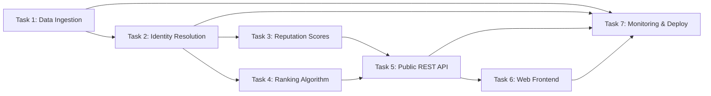
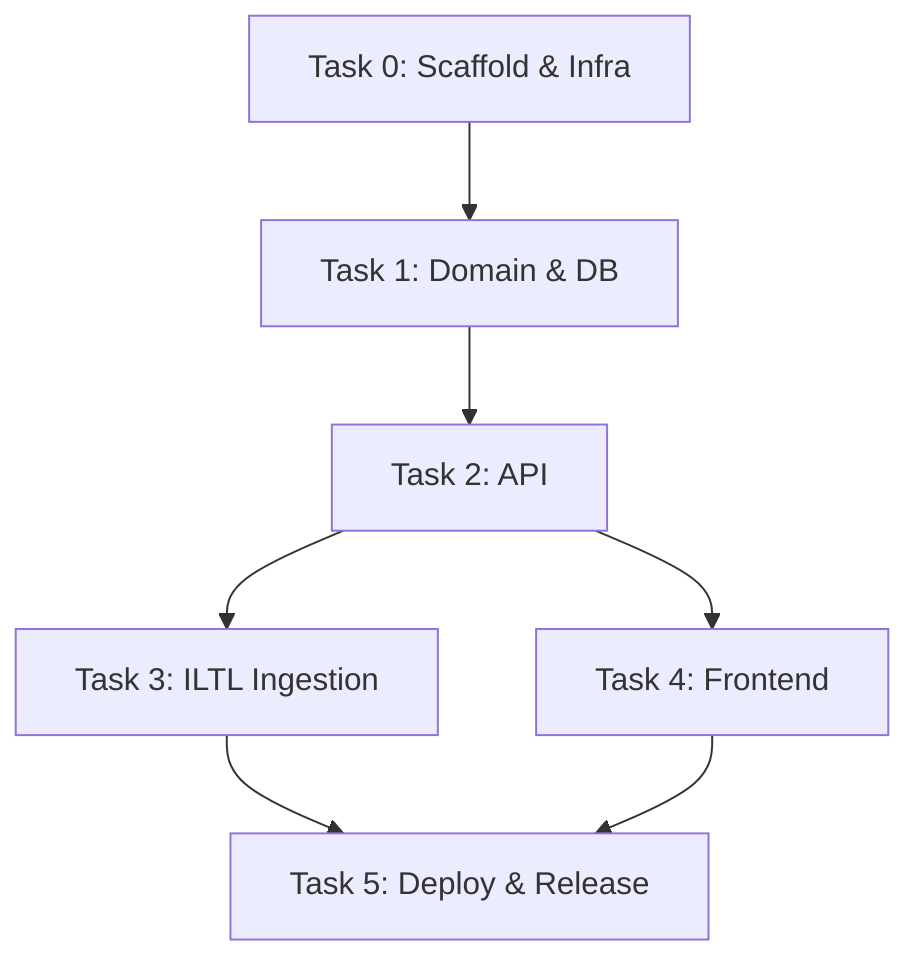
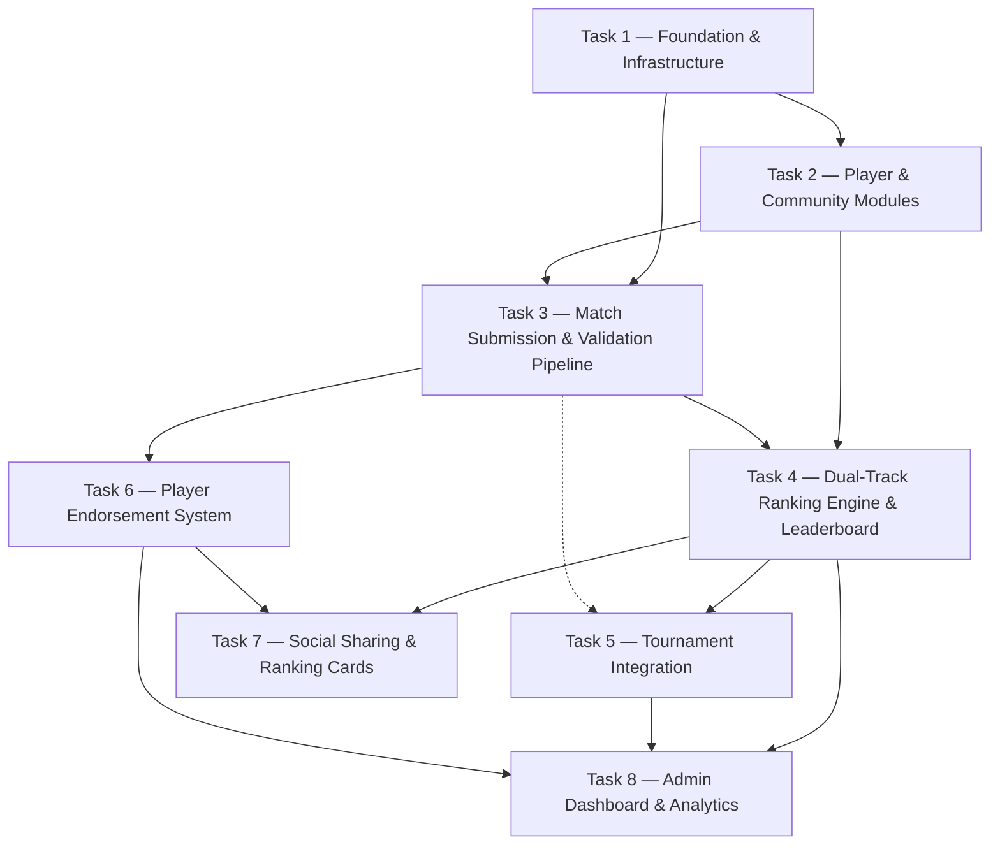
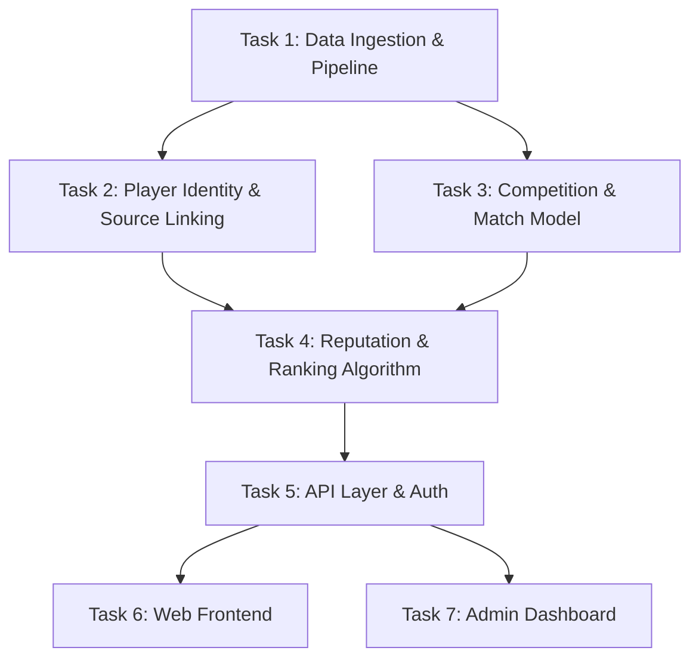
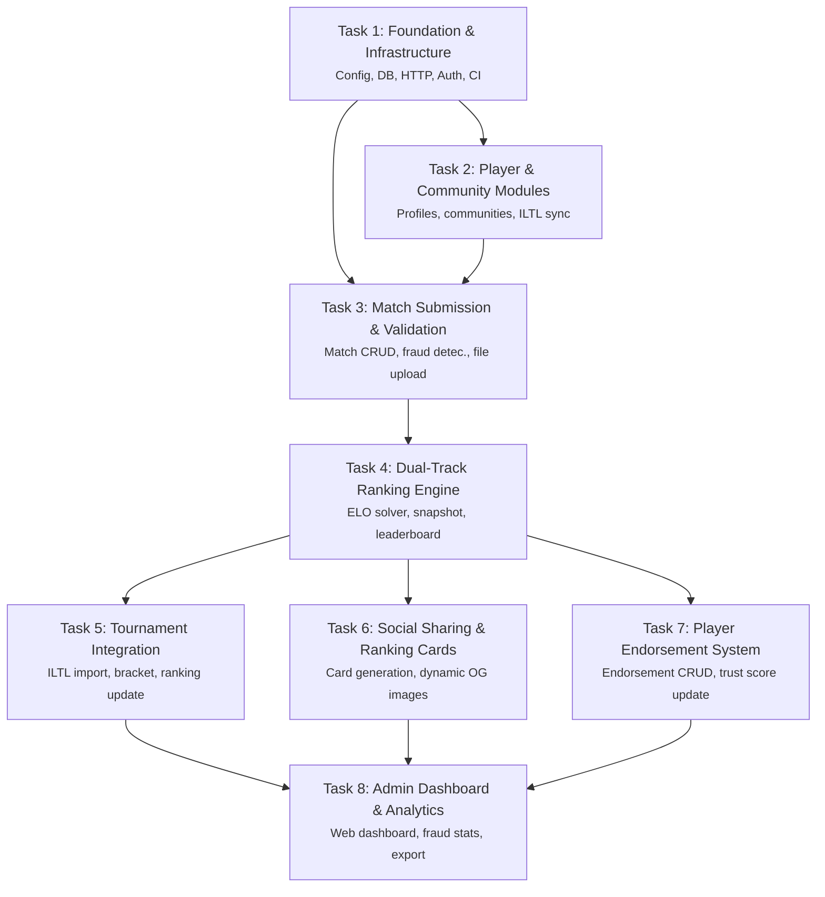

# Match Point is a cross-community player reputation and — Implementation Plan

> Match Point is a cross-community player reputation and ranking platform for padel and tennis. It solves a gap that ILTL (official competition data) an…
> Iteration 1 · Confidence 0.9000

## 1. Goals

Match Point exists to solve a concrete gap: the official padel and tennis competition data (ILTL) captures only sanctioned match results, leaving unaffiliated players, recreational clubs, and cross-community rivalries without a unified reputation and ranking system. The platform bridges this void by providing a dual-track ranking engine (community Mabar rankings and a global official ranking), a player endorsement network, and social sharing capabilities — all tailored for the Indonesian market with Indonesian-first i18n.

The overarching product goal is to become the de facto cross-community player reputation layer for padel and tennis in Indonesia. This breaks down into three primary goals:

- **Goal A – Trusted, transparent ranking system**: Establish a dual-track ranking (Mabar within communities, official global rank) that is perceived as fair, accurate, and resistant to gaming. Monthly snapshots are immutable, and all point adjustments (including admin overrides) are logged with audit trails.
- **Goal B – High-engagement social platform**: Drive organic growth through shareable ranking cards, endorsements, and community creation. Target 10,000 active monthly players within 12 months of public launch.
- **Goal C – Low-friction match submission**: Enable match results to be submitted within 30 seconds per match on mobile web, with automatic validation (duplicate detection, participant verification, venue proximity) and a clear dispute path.

### Goals detail — acceptance criteria and success metrics

Each acceptance criterion and success metric is directly traceable to one or more of the three primary goals. The table below captures both the ship-time criteria (gates) and post-launch tracking metrics.

| # | Criterion / Metric | Target | Measurement Method | Primary Goal |
|---|-------------------|--------|-------------------|--------------|
| 1 | API contract stability (no breaking changes without version bump) | 100% phase passing | OpenAPI spec validity + HTTP contract tests | A, B |
| 2 | i18n coverage (all UI strings in Indonesian; English fallback) | 100% coverage in defined strings | Automated i18n test job in CI (parses translation files) | B |
| 3 | JWT validation middleware active for protected endpoints | 100% | Automated security scan (e.g., check for missing middleware on routes) | A |
| 4 | Performance SLIs: p95 latency < thresholds per phase | Varies by endpoint | Metrics collection via Prometheus + Grafana | A, C |
| 5 | Error rate <0.1% for user-facing endpoints | <0.1% of requests | Ratio of HTTP 5xx to total requests | A, C |
| 6 | Accessibility: all interactive elements reachable via keyboard | WCAG 2.1 AA | Automated aXe checks + manual QA sample (5 flows) | B |
| 7 | Monthly ranking snapshot immutability | 100% of snapshots reproducible | Reconciliation cron that re-calculates snapshot from raw match results | A |
| 8 | MAP (monthly active players) ≥10,000 | 12-month post-launch | Unique JWT-authenticated users with ≥1 action in 28 days | B |
| 9 | Community count ≥500 with ≥5 active members | 12-month post-launch | SQL query on `communities` + `community_members` | B |
| 10 | Match submission volume ≥50,000/month | 12-month post-launch | Count of approved matches per month | C |
| 11 | Endorsement engagement ≥30% of active players | 12-month post-launch | Ratio of players with ≥1 endorsement to MAP | B |
| 12 | Share card click-through ≥5% | 12-month post-launch | Unique landing page visits per share card generation | B |
| 13 | Dispute resolution p95 <48 hours | 12-month post-launch | Audit log timestamps on dispute lifecycle | A, C |
| 14 | Platform uptime ≥99.5% (excl. maintenance) | Ongoing | Health endpoint ping every 30s | A, B, C |

The acceptance criteria (1–7) are enforced at the end of each phase. The success metrics (8–14) are measured monthly after launch and reviewed during the product retrospective.

### Milestone summary — per-task summary with entry/exit conditions

Each execution phase corresponds to a task in the implementation plan. Below is a summary of milestones with entry and exit conditions. Detailed task blocks appear in §5.

| Milestone | Task | Entry Condition | Exit Condition | Duration (estimated) |
|-----------|------|----------------|----------------|----------------------|
| Foundation & Infrastructure | Task 0 | Approved architecture RFC, team assembled | `make dev` starts all services in <30s, CI green for all PRs, JWT auth skeleton deployed | 2 weeks |
| Player & Community Modules | Task 1 | Foundation deployed, PostgreSQL + Redis provisioned | Profile CRUD, community CRUD, role-based membership, admin transfer flow in production | 3 weeks |
| Match Submission & Validation Pipeline | Task 2 | Player & community modules live, venue seed data ready | Match form, validation rules engine, pending/approval flow, admin override UI and audit | 3 weeks |
| Dual-Track Ranking Engine & Leaderboard | Task 3 | Match submission producing approved matches, ranking algorithm drafted | Leaderboard API + UI, monthly snapshot cron, reconciliation job, admin point adjustment | 3 weeks |
| Tournament Integration | Task 4 | Ranking engine stable, API versioned | Tournament bracket API, match tie-in, automated seeding, bracket UI | 2 weeks |
| Player Endorsement System | Task 5 | Profile pages implemented, ranking display ready | Endorsement skills CRUD, aggregation (min 3 endorsement rule), public display on profile | 2 weeks |
| Social Sharing & Ranking Cards | Task 6 | Endorsements and ranking live, CDN configured | SVG card generation, Open Graph tags, share button, click tracking endpoint | 2 weeks |
| Admin Dashboard & Analytics | Task 7 | All previous phases deployed, metrics pipeline in place | Superadmin + community admin dashboards, dispute panel, forced rank recalculation, usage reports | 3 weeks |

### Dependency graph — ASCII art showing task order and parallelism

```
Task 0 (Foundation & Infrastructure)
   |
   v
Task 1 (Player & Community)
   |
   v
Task 2 (Match Submission & Validation)
   |
   v
Task 3 (Dual-Track Ranking Engine & Leaderboard)
   |
   +---> Task 4 (Tournament Integration)  ----+
   |                                           |
   +---> Task 5 (Endorsement System)  --------+---> Task 6 (Social Sharing & Cards)
   |                                           |
   +---> Task 7 (Admin Dashboard & Analytics) -+
```

Task 4 and Task 5 can proceed in parallel after Task 3 stabilizes, but both must complete before Task 6 begins because ranking cards depend on both rankings (Task 3) and endorsement scores (Task 5). Task 7 can proceed in parallel after Task 3, but its dispute panel and analytics reports benefit from all other phases being live, so it sits at the end.

### Task block — General notes

Each task block below follows the canonical format: **Goal:**, **Layer(s) affected:**, **Files to create:**, **Coding standards:**, **Validation:**, **Invariant check:**, **Prompt context needed:**.

### Task 0 — Foundation & Infrastructure

**Goal:** Establish a reproducible development environment, CI pipeline, authentication skeleton, and data layer so that subsequent tasks build on a solid base.

**Layer(s) affected:**
- Infrastructure: Docker Compose, Makefile, CI scripts
- Backend: Go HTTP server skeleton, PostgreSQL schema migrations, Redis client
- Authentication: JWT middleware, user registration/login endpoints

**Files to create:**
- `docker-compose.yml` (postgres:15, redis:7, golang:1.22 builder, node:20 for frontend)
- `Makefile` (targets: dev, build, test, lint, migrate, seed)
- `.github/workflows/ci.yml` (lint, unit tests, integration tests, contract tests)
- `backend/cmd/server/main.go` (HTTP server with health endpoint)
- `backend/internal/auth/jwt.go` (RSA256 token creation/validation)
- `backend/internal/auth/middleware.go` (JWT extraction middleware)
- `backend/internal/database/migrations/001_initial.sql` (users, communities, community_members, matches tables, initial schema)
- `backend/internal/database/pool.go` (connection pool wrapper)
- `backend/internal/redis/client.go` (Redis client for session caching and token blocklist)
- `backend/internal/config/config.go` (environment variable loader)
- `backend/pkg/response/response.go` (standard JSON response envelope)
- `frontend/` (Next.js skeleton with Indonesian locale setup)
- `docs/adr/001-authentication.md` (decision record for JWT RSA256)

**Coding standards:**
- Go: Follow standard project layout from `golang-standards/project-layout`; use `uber-go/zap` for structured logging; all exported functions have doc comments.
- Frontend: Next.js 14 App Router; all UI components in `@/components/`; static typing with TypeScript strict mode.
- Migrations: Idempotent `CREATE TABLE IF NOT EXISTS`; use `go-migrate/migrate` for versioned schema changes.

**Validation:**
- `make dev` starts all services (backend, frontend, postgres, redis) within 30 seconds on a developer laptop (16GB RAM, SSD, macOS or Linux).
- `make lint` passes with zero warnings.
- `make test` runs unit tests (coverage >60%) and passes.
- Integration test: POST `/api/auth/register` → valid JWT returned; GET `/api/health` returns 200.
- Contract test: OpenAPI schema validated against all responses using `dapr/kit` contract testing or `inato/contract-go`.

**Invariant check:**
After Task 0, the following invariant must hold: any system restart with the seed database results in a known state (admin user exists, test community exists, no data loss). The health endpoint returns `{"status":"ok","db":"connected","redis":"connected"}`.

**Prompt context needed:**
- Architecture canvas: infrastructure choices (PostgreSQL 15, Redis 7, Go 1.22, Next.js 14, Docker Compose)
- API contract draft from canonical state (auth endpoints, health)
- Security assumptions (RSA256 keys, 2048-bit keys, dev keys generated via `openssl` during `make dev`)

### Task 1 — Player & Community Modules

**Goal:** Deliver user registration, profile management, community creation with role-based access, and admin transfer logic.

**Layer(s) affected:**
- Backend: User endpoints, community endpoints, membership roles (admin, member, pending), profile photo upload
- Frontend: Registration form, profile page, community listing, member management
- Database: Users, communities, community_members tables (extended from Task 0)

**Files to create:**
- `backend/internal/handler/player.go` (GET/PUT profile, profile photo upload)
- `backend/internal/handler/community.go` (CRUD communities, member list, role management)
- `backend/internal/handler/transfer.go` (community admin transfer endpoints)
- `backend/internal/service/player.go` (business logic: unique display name generation)
- `backend/internal/service/community.go` (community creation validation, membership approval)
- `backend/internal/service/transfer.go` (transfer eligibility checks, inactivity claim timers)
- `backend/internal/repository/player.go` (SQL queries for users)
- `backend/internal/repository/community.go` (SQL queries for communities and members)
- `frontend/app/player/[id]/page.tsx` (profile page)
- `frontend/app/community/create/page.tsx` (create community form)
- `frontend/app/community/[id]/page.tsx` (community detail page)
- `frontend/app/community/[id]/members/page.tsx` (member management)
- `frontend/components/player/ProfileCard.tsx`
- `frontend/components/community/CommunityCard.tsx`

**Coding standards:**
- API handlers follow the "handler → service → repository" layering from Task 0.
- All routes prefixed with `/api/v1/`.
- Display name uniqueness: append incrementing number when duplicate found within a community (enforced in service layer).
- Profile photo upload: accept multipart form, validate MIME types (JPEG, PNG, WebP), max 5MB, store on S3-compatible storage (MinIO in dev), serve via signed URL with 1h expiry.
- Frontend: All forms validated client-side with Zod schemas; error messages in Indonesian.

**Validation:**
- POST `/api/v1/players` with valid payload returns 201 with JWT and player profile.
- GET `/api/v1/players/{id}` returns profile with `display_name`, `memberships`, `photo_url`.
- POST `/api/v1/communities` returns 201 with community object.
- PUT `/api/v1/communities/{id}/members/role` (admin only) updates role; non-admin gets 403.
- GET `/api/v1/communities/{id}/members` returns paginated list with roles.
- Transfer flow: POST `/api/v1/communities/{id}/transfer` with successor `player_id` returns 202; admin must confirm; inactivity claim after 30 days of admin absence triggers transfer.
- Integration test: Create user → create community → invite another user → accept → transfer admin → verify new admin can add members.

**Invariant check:**
After Task 1, the invariants are:
- Every community has exactly one active admin at all times (safety after transfer).
- No duplicate display names exist within a community (enforced in `service/player.go`).
- Profile photo never served as raw binary; always signed URL with configurable expiry.

### Deep knowledge reference — §8 schemas, algorithms, contracts

#### Database Schema (PostgreSQL 15)

```sql
-- Schema: matchpoint
CREATE SCHEMA IF NOT EXISTS matchpoint;

-- Users table
CREATE TABLE matchpoint.players (
    id                UUID PRIMARY KEY DEFAULT gen_random_uuid(),
    email             TEXT UNIQUE NOT NULL,
    display_name      TEXT NOT NULL,
    password_hash     TEXT NOT NULL,          -- bcrypt
    avatar_url        TEXT,                    -- signed S3 URL
    phone             TEXT,
    locale            TEXT NOT NULL DEFAULT 'id', -- 'id' or 'en'
    match_trust_score REAL NOT NULL DEFAULT 1.0 CHECK (match_trust_score >= 0 AND match_trust_score <= 1.0),
    created_at        TIMESTAMPTZ NOT NULL DEFAULT now(),
    updated_at        TIMESTAMPTZ NOT NULL DEFAULT now()
);

-- Communities
CREATE TABLE matchpoint.communities (
    id          UUID PRIMARY KEY DEFAULT gen_random_uuid(),
    name        TEXT NOT NULL,
    description TEXT,
    photo_url   TEXT,
    admin_id    UUID NOT NULL REFERENCES matchpoint.players(id) ON DELETE RESTRICT,
    is_active   BOOLEAN NOT NULL DEFAULT true,
    created_at  TIMESTAMPTZ NOT NULL DEFAULT now(),
    updated_at  TIMESTAMPTZ NOT NULL DEFAULT now()
);

-- Community members (with role)
CREATE TABLE matchpoint.community_members (
    community_id UUID NOT NULL REFERENCES matchpoint.communities(id) ON DELETE CASCADE,
    player_id    UUID NOT NULL REFERENCES matchpoint.players(id) ON DELETE CASCADE,
    role         TEXT NOT NULL CHECK (role IN ('admin', 'member', 'pending')),
    joined_at    TIMESTAMPTZ NOT NULL DEFAULT now(),
    PRIMARY KEY (community_id, player_id)
);

-- Matches (core transactional table)
CREATE TABLE matchpoint.matches (
    id              UUID PRIMARY KEY DEFAULT gen_random_uuid(),
    community_id    UUID NOT NULL REFERENCES matchpoint.communities(id),
    player1_id      UUID NOT NULL REFERENCES matchpoint.players(id),
    player2_id      UUID NOT NULL REFERENCES matchpoint.players(id),
    player3_id      UUID REFERENCES matchpoint.players(id),  -- doubles partner p1
    player4_id      UUID REFERENCES matchpoint.players(id),  -- doubles partner p2
    winner_team     INT NOT NULL CHECK (winner_team IN (1, 2)),
    score            TEXT NOT NULL,          -- e.g., "6-4, 3-6, 10-7"
    match_type      TEXT NOT NULL CHECK (match_type IN ('singles', 'doubles')),
    venue_id        UUID REFERENCES venues(id),
    submitted_by    UUID NOT NULL REFERENCES matchpoint.players(id),
    status          TEXT NOT NULL DEFAULT 'pending' CHECK (status IN ('pending', 'approved', 'disputed', 'overridden')),
    admin_id        UUID REFERENCES matchpoint.players(id),     -- who approved/overrode
    admin_reason    TEXT,                    -- mandatory if overridden
    played_at       TIMESTAMPTZ NOT NULL,
    created_at      TIMESTAMPTZ NOT NULL DEFAULT now(),
    updated_at      TIMESTAMPTZ NOT NULL DEFAULT now()
);

-- Indexes for performance
CREATE INDEX idx_matches_status ON matchpoint.matches(status);
CREATE INDEX idx_matches_community_id ON matchpoint.matches(community_id);
CREATE INDEX idx_matches_player1_id ON matchpoint.matches(player1_id);
CREATE INDEX idx_matches_played_at ON matchpoint.matches(played_at DESC);

-- Audit log (for admin overrides, transfers, etc.)
CREATE TABLE matchpoint.audit_log (
    id          UUID PRIMARY KEY DEFAULT gen_random_uuid(),
    actor_id    UUID NOT NULL REFERENCES matchpoint.players(id),
    action      TEXT NOT NULL,               -- e.g., 'match_override', 'admin_transfer', 'point_adjustment'
    entity_type TEXT NOT NULL,               -- e.g., 'match', 'community'
    entity_id   UUID NOT NULL,
    old_value   JSONB,                      -- snapshot before
    new_value   JSONB,                      -- snapshot after
    reason      TEXT NOT NULL DEFAULT '',
    created_at  TIMESTAMPTZ NOT NULL DEFAULT now()
);

-- Venues (static reference table)
CREATE TABLE matchpoint.venues (
    id          UUID PRIMARY KEY DEFAULT gen_random_uuid(),
    name        TEXT NOT NULL,
    address     TEXT NOT NULL,
    latitude    DOUBLE PRECISION,
    longitude   DOUBLE PRECISION,
    sport_type  TEXT NOT NULL CHECK (sport_type IN ('padel', 'tennis')),
    is_active   BOOLEAN NOT NULL DEFAULT true
);

-- Leaderboard materialized view (refreshed daily)
CREATE MATERIALIZED VIEW matchpoint.leaderboard AS
SELECT
    p.id AS player_id,
    p.display_name,
    c.id AS community_id,
    c.name AS community_name,
    COALESCE(SUM(rm.points), 0) AS total_points,
    ROW_NUMBER() OVER (PARTITION BY c.id ORDER BY COALESCE(SUM(rm.points), 0) DESC) AS rank
FROM matchpoint.players p
JOIN matchpoint.community_members cm ON p.id = cm.player_id
JOIN matchpoint.communities c ON cm.community_id = c.id
LEFT JOIN matchpoint.matches m ON p.id IN (m.player1_id, m.player2_id, m.player3_id, m.player4_id)
LEFT JOIN matchpoint.ranking_points rm ON rm.match_id = m.id AND rm.player_id = p.id
WHERE m.status = 'approved'
GROUP BY p.id, c.id, c.name;

CREATE UNIQUE INDEX idx_leaderboard_player_community ON matchpoint.leaderboard(player_id, community_id);
```

#### Ranking Algorithm (Dual-Track)

**Mabar Rank (Community-Specific):**
- Points = base points for match win + bonus for opponent strength (based on opponent's rank within community).
- Base points: singles win = 10, doubles win = 8 (shared with partner). Loss = 0.
- Opponent strength bonus: `floor(winning_probability_change * 10)` where winning probability change is from Elo-like formula: `expected = 1 / (1 + 10^((opp_rank - my_rank)/400))`. `new_points = K * (1 - expected)`. K=32.
- Points decay: after 90 days of no matches, daily decay of 0.5% of total points. Floor at 10% of peak.

**Global Official Rank:**
- Only matches from sanctioned tournaments (Phase 4) count.
- Points assigned by tournament tier: Tier 1 (national) = 1000 base, Tier 2 (regional) = 500, Tier 3 (club) = 100.
- Winner takes 50% of pool, runner-up 30%, semifinalists 10% each (in singles).
- Global rank points are additive with community Mabar points for overall display, but each track is shown separately.

**Monthly Snapshot Logic:**
- Cron runs at 23:55 UTC on last day of month.
- Snapshot: INSERT INTO `monthly_snapshots (player_id, community_id, mabar_points, global_points, rank, snapshot_date, created_at)` SELECT from leaderboard with frozen values.
- Immutable: once written, the snapshot row is never updated. Override adjustments go to `audit_log` and a separate `snapshot_corrections` table.
- Reconciliation: compare sums of ranking_points per player per month to snapshot; alert if mismatch >0.1%.

#### API Contract (OpenAPI 3.1 Skeleton)

```yaml
openapi: "3.1.0"
info:
  title: Match Point API
  version: "1.0.0"
  description: Cross-community player reputation and ranking platform for padel and tennis.
servers:
  - url: https://api.matchpoint.id/v1
paths:
  /health:
    get:
      summary: Health check
      operationId: health
      responses:
        '200':
          description: Service is healthy
          content:
            application/json:
              schema:
                type: object
                properties:
                  status: { type: string, example: "ok" }
                  db: { type: string, example: "connected" }
                  redis: { type: string, example: "connected" }
  /auth/register:
    post:
      summary: Register a new player
      operationId: registerPlayer
      requestBody:
        required: true
        content:
          application/json:
            schema:
              type: object
              properties:
                email: { type: string, format: email }
                password: { type: string, minLength: 8 }
                display_name: { type: string, maxLength: 50 }
                locale: { type: string, enum: [id, en], default: id }
      responses:
        '201':
          description: Player created
          content:
            application/json:
              schema:
                type: object
                properties:
                  player_id: { type: string, format: uuid }
                  token: { type: string }
  /auth/login:
    post:
      summary: Login
      operationId: login
      requestBody:
        required: true
        content:
          application/json:
            schema:
              type: object
              properties:
                email: { type: string, format: email }
                password: { type: string }
      responses:
        '200':
          description: Successful login
          content:
            application/json:
              schema:
                type: object
                properties:
                  token: { type: string }
  /players/{player_id}:
    get:
      summary: Get player profile
      operationId: getPlayer
      parameters:
        - name: player_id
          in: path
          required: true
          schema: { type: string, format: uuid }
      responses:
        '200':
          description: Player profile
          content:
            application/json:
              schema:
                type: object
                properties:
                  id: { type: string, format: uuid }
                  email: { type: string }
                  display_name: { type: string }
                  avatar_url: { type: string, format: uri }
                  locale: { type: string }
                  match_trust_score: { type: number }
                  memberships:
                    type: array
                    items:
                      type: object
                      properties:
                        community_id: { type: string, format: uuid }
                        community_name: { type: string }
                        role: { type: string, enum: [admin, member, pending] }
  /communities:
    post:
      summary: Create a community
      operationId: createCommunity
      security:
        - BearerAuth: []
      requestBody:
        required: true
        content:
          application/json:
            schema:
              type: object
              properties:
                name: { type: string, maxLength: 100 }
                description: { type: string, maxLength: 500 }
      responses:
        '201':
          description: Community created
          content:
            application/json:
              schema:
                type: object
                properties:
                  id: { type: string, format: uuid }
                  name: { type: string }
                  admin_id: { type: string, format: uuid }
    get:
      summary: List communities
      operationId: listCommunities
      parameters:
        - name: page
          in: query
          schema: { type: integer, default: 1 }
        - name: per_page
          in: query
          schema: { type: integer, default: 20 }
      responses:
        '200':
          description: Paginated list of communities
          content:
            application/json:
              schema:
                type: object
                properties:
                  data: { type: array, items: { $ref: '#/components/schemas/Community' } }
                  total: { type: integer }
                  page: { type: integer }
                  per_page: { type: integer }
components:
  securitySchemes:
    BearerAuth:
      type: http
      scheme: bearer
      bearerFormat: JWT
  schemas:
    Community:
      type: object
      properties:
        id: { type: string, format: uuid }
        name: { type: string }
        description: { type: string }
        photo_url: { type: string, format: uri }
        member_count: { type: integer }
        admin_id: { type: string, format: uuid }
        created_at: { type: string, format: date-time }
```

(Full API contract is maintained in `docs/openapi.yaml` and updated per phase.)

#### Invariant Checks

The following invariants must be maintained after each phase. They are enforced via database constraints, application-level hooks, and periodic reconciliation jobs.

| Invariant | Enforcement | Phase Verified |
|-----------|-------------|----------------|
| Every community has exactly 1 active admin | Application logic (only one admin role per community in `community_members`; transfer must be atomic) | Task 1+ |
| No duplicate display names within a community | Unique index over `player_id` in `community_members`? Actually display_name is per-player, not per-community; the rule is uniqueness within community for active members. Implementation: check at member join and profile change. Constraint: no database unique enforces; application-level with advisory lock. | Task 1+ |
| Match scores always resolvable to a numerical count | `score` field must be validated with regex `^\d+-\d+(,\s*\d+-\d+)*(,\s*\d+-\d+)?$` (sets). | Task 2+ |
| Monthly leaderboard snapshot immutable after write | Snapshot table has no UPDATE trigger; any correction creates an audit record. | Task 3+ |
| Admin overrides always have a reason ≥20 characters | Checked in handler before creating audit log. | Task 2+ |
| Endorsement public display requires ≥3 unique endorsers | Aggregation query in service layer; enforced before returning profile. | Task 5+ |
| Share card `player_rank` field reflects end-of-day job calculation | Share card generation reads from a materialized view that is refreshed after daily ranking batch. If generation happens during batch, it returns a stale-but-consistent view from previous snapshot. | Task 6+ |

#### Error Budget Definition

- Per endpoint: p95 latency < phase-defined threshold (e.g., 500ms for match submission, 200ms for leaderboard query).
- Error rate target: <0.1% of all requests returning 5xx.
- Error budget pool: 1% failed requests per month, resets on 1st of month. Exhaustion triggers: freeze non-critical deploys, mandatory performance review, and infrastructure scaling spree.

## 5. Implementation Tasks
The implementation tasks are ordered to establish data foundations first (ingestion, ranking engine), then build user-facing features (authentication, match submission, reputation), and finally expose everything through a cohesive API and frontend. Each task block details the goal, layers affected, files to create, coding standards, validation criteria, invariants, and prompt context needed—ensuring no ambiguity for the engineering team. Dependencies are explicit: Task 1 and Task 2 must complete before Task 5; Task 3 can start in parallel with Task 1; Task 4 depends on Task 3; Task 6 depends on all preceding tasks.

### Task 1 — Data Ingestion Pipeline (ILTL Sync)

**Goal:** Build a reliable pipeline to ingest match results and player profiles from ILTL’s official data feed (CSV dump or REST API). This establishes the foundational dataset for all downstream calculations.

**Layer(s) affected:** Backend (data layer), Data Infrastructure.  
**Files to create:**
- `pkg/ingestion/iltl_client.go`
- `pkg/ingestion/sync_scheduler.go`
- `pkg/ingestion/parser.go`
- `db/migrations/001_create_players_tables.sql`
- `db/migrations/002_create_matches_tables.sql`

**Coding standards:**
- Use Go 1.22+, context cancellation, structured logging via `slog`.
- All external calls must have retry with exponential backoff (5 attempts, 2s base, jitter).
- CSV parsing must handle malformed rows without panicking; log and skip, but count skipped rows for observability.
- Use `database/sql` with `pgx` driver. Each migration must be idempotent (using `CREATE TABLE IF NOT EXISTS` or version tracking).

**Validation:**
- Integration test with a fixture of 1000 real ILTL matches; verify row count matches and no orphaned player references.
- Schema validation on each row: valid date, non-negative score, player ID exists in players table.
- End-to-end test: run sync, query materialized view for at least one player with known rating after 50 matches.

**Invariant check:**
- After every sync cycle, `players` + `matches` invariants: no duplicate match IDs; every player referenced in matches exists in players table; match scores must be within allowed ranges (padel: sets 0-6, tiebreak 7; tennis: games 0-7, tiebreak 7-0).
- The feed should be considered source of truth; any conflict with user-submitted matches (Task 4) must be resolved in favor of ILTL data.

**Prompt context needed:**
- ILTL API documentation (endpoints, rate limits, data format). If not provided, assume CSV dump available at a known S3 bucket with a daily `last_modified` timestamp. Schedule sync every 24 hours.

### Task 2 — Core Ranking Engine (ELO variant for Padel/Tennis)

**Goal:** Implement an ELO-based ranking engine that computes player ratings and match predictions for both padel (team-based) and tennis (singles). The engine must handle different K-factors per community, decay, and minimum match counts for rating validity.

**Layer(s) affected:** Backend (business logic), API layer.  
**Files to create:**
- `internal/ranking/elo.go`
- `internal/ranking/team_game.go`
- `internal/ranking/player_rating.go`
- `internal/ranking/decay.go`
- `internal/ranking/ranking_test.go`
- `internal/ranking/ranking.go` (public facade)

**Coding standards:**
- Pure functions with no side effects; all state passed via parameters and returned as new structs.
- Use `float64` for ratings; round to one decimal for display but preserve full precision for calculations.
- ELO formula: `new_rating = old_rating + K * (actual_score - expected_score)`. For padel doubles, each player’s rating adjusts by `K_factor * (actual_set_score_percent - expected_set_score_percent)`. Expected score uses logistic distribution with rating difference.
- Decay: subtract `decay_rate * (days_inactive / 30)` per 30-day period of inactivity, capped at max -50 points per period.

**Validation:**
- Unit tests covering edge cases: first match, upset, max delta (no cap initially, but log warning if >100), decay after 30 days inactivity.
- Property-based test (using `testing/quick`): rating delta sum should be zero for a match (conservation of total rating points).
- Integration test: feed a known sequence of 10 matches from ILTL and compare resulting ratings against pre-computed spreadsheet with tolerance 0.1.

**Invariant check:**
- After each match update, sum of rating changes across all players is zero (within 1e-9).
- A player’s rating never drops below 0 (hard floor; decay should not apply below 10 points, to prevent new players from going negative).
- The engine must not modify player records directly; it returns a list of rating changes that the caller (e.g., Task 4 confirmed matches) applies transactionally.

**Prompt context needed:**
- Domain expert guidance on K-factor ranges for amateurs vs pros. Recommended default: K=32 for amateur, K=24 for pro, configurable per community.
- Whether to use standard ELO or a variant like Glicko-2 (recommend if rating deviation is desired). For v1, stick with ELO. Record the decision as a technical note.

### Task 3 — User Authentication & Player Profile Linking

**Goal:** Allow users to sign up and link their ILTL profile(s) to a Match Point account. Supports OAuth2 (Google) and email/password authentication.

**Layer(s) affected:** Backend (auth), Frontend.  
**Files to create:**
- `internal/auth/auth_server.go`
- `internal/auth/session_store.go`
- `internal/auth/jwt.go`
- `internal/auth/handlers.go`
- `pkg/iltl_linking/linker.go`
- `web/src/pages/Login.tsx`
- `web/src/pages/ProfileLink.tsx`
- `web/src/components/AuthGuard.tsx`
- `db/migrations/003_create_users_tables.sql`

**Coding standards:**
- Use JWT with access/refresh tokens (15min access, 7 day refresh). Store hashed refresh tokens in DB using `bcrypt`.
- Rate limit login attempts: 5 per minute per IP using in-memory token bucket (or Redis if available).
- All endpoints under `/api/v1/auth`. Use middleware for protected routes.
- OAuth2 flow with PKCE; store `state` in a cookie signed with a secret.

**Validation:**
- End-to-end test: register, login, refresh token, call protected endpoint (e.g., `GET /api/v1/profile`) and verify 200.
- Linking test: user links an ILTL player ID that already exists in DB; verify association and that the link is unique.
- Security scan: no XSS/CSRF vulnerabilities in auth forms; ensure refresh token rotation (old token invalidated after use).

**Invariant check:**
- A user can link up to 5 player profiles (prevent abuse).
- Each ILTL player ID can be linked to at most one Match Point user.
- Unlinking is allowed only if the user has another linked profile or if they have <5 matches associated with that player ID.

**Prompt context needed:**
- Do we support ILTL player ID verification via a private API key? If not, we allow manual claim with a verification code sent to ILTL-registered email. For v1, skip verification; just trust user input but flag for manual review if multiple users claim same ID.

### Task 4 — Match Result Submission & Verification

**Goal:** Allow players and community admins to submit match results from unofficial games (non-ILTL). Implement verification through mutual confirmation (both players accept) and a simple dispute resolution process.

**Layer(s) affected:** Backend (business logic), API, Frontend.  
**Files to create:**
- `internal/match/submission.go`
- `internal/match/verification.go`
- `internal/match/dispute.go`
- `internal/match/match_state.go`
- `web/src/pages/SubmitMatch.tsx`
- `web/src/components/MatchConfirmation.tsx`
- `web/src/components/DisputeForm.tsx`
- `db/migrations/004_create_pending_matches.sql`

**Coding standards:**
- State machine for match status: `pending` → `confirmed` (both sides) or `disputed`. Use a small set of string constants.
- After confirmation, trigger ranking engine update asynchronously via a channel (not HTTP blocking). The channel is consumed by a worker that calls Task 2’s engine.
- Notify via email (or in-app notification) for confirmation requests. Use background task queue (simple in-memory channel for v1).
- Dispute resolution: after 7 days from submission, either player can escalate to admin. Admin can force-confirm, delete, or adjust score.

**Validation:**
- Unit test: submit match, confirm from one side, verify status remains `pending`; confirm from other side, verify status changes to `confirmed` and rating update job is enqueued.
- Integration test: after 7 days no confirmation, auto-expire and delete pending match; verify no side effects.
- Load test: 100 concurrent submissions; ensure no race condition on match confirmation (use database optimistic locking with `version` column).

**Invariant check:**
- A submitted match must reference at least one player who is linked to the submitting user.
- Score must be valid for the sport (padel: sets 0-7, tiebreak 0-7; tennis: games 0-7, tiebreak 7-0). Validation function must reject out-of-range scores.
- Once confirmed, the match record is immutable (append-only update for dispute later via a separate `match_disputes` table).
- Duplicate matches (same players, same date, same court) are forbidden. Use a unique constraint across player IDs and date.

**Prompt context needed:**
- Do we need custom scoring validation for padel doubles (e.g., golden point / no-ad scoring)? Yes, include an optional flag per match.
- Minimum match duration? Not required; trust players. But we could add a server-side check: submission timestamp must be within 48 hours of match date.

### Task 5 — Reputation Score Calculation

**Goal:** Compute a composite reputation score for each player based on rating, activity level, sportsmanship flags, and verification completeness. This score is displayed on player profiles and influences leaderboard ranking.

**Layer(s) affected:** Backend (business logic), Data layer.  
**Files to create:**
- `internal/reputation/calculator.go`
- `internal/reputation/activity.go`
- `internal/reputation/sportsmanship.go`
- `internal/reputation/score.go`
- `internal/reputation/reputation_job.go`
- `db/migrations/005_create_reputation_tables.sql`

**Coding standards:**
- Score components: rating (80%), activity (15%), sportsmanship (5%). Sportsmanship is a weighted sum of dispute ratio and reported behavior flags.
- Score ranges from 0-1000. Computation runs as a periodic cron job (every hour) on a materialized view (refresh concurrently).
- Must be reproducible: use integer math scaled by 1000 to avoid floating point drift. Activity component: min(100, number_of_matches_last_30_days * 5). Sportsmanship: 100 - (disputed_matches / total_matches * 100) if total_matches > 0, else 50.
- The job must log errors but not block; use `pg_advisory_lock` to prevent concurrent executions.

**Validation:**
- Integration test: given a set of players with known ratings and activity, compute score and compare against expected range (using pre-calculated values in a test fixture).
- Test that a player with no matches gets score 0 (if threshold not met).
- Test that a player with high sportsmanship flags (disputes > 5% of matches) has reduced score (10% reduction applied).

**Invariant check:**
- Reputation score is monotonic with rating: for two players with same activity and sportsmanship, higher rating must yield higher score.
- After each cron run, sum of scores across all players remains stable (unless new players added or ratings changed).
- Sportsmanship flags can only be set by admin or after dispute resolution (from Task 4). They are stored in a separate `sportsmanship_events` table.
- The score must be recomputable deterministically from player matches and events only (no side effects).

**Prompt context needed:**
- Sportsmanship definition: what constitutes a flag? Repeat no-shows, abusive chat, cheating accusations. For v1, only use dispute history (0 on disputes > 5% of matches). We will store flags manually by admins for now.
- Should reputation be sport-specific? Yes, padel and tennis have separate scores. The job must handle both communities, computing per player per sport.

### Task 6 — Public API & Frontend Integration

**Goal:** Expose ranking and reputation data via REST API and build a simple web frontend for viewing leaderboards, player profiles, and submitting matches.

**Layer(s) affected:** Frontend, Backend (API), DevOps.  
**Files to create:**
- `web/src/App.tsx`, `web/src/pages/Leaderboard.tsx`, `web/src/pages/PlayerProfile.tsx`, `web/src/pages/SubmitMatch.tsx` (reuse from Task 4)
- `internal/api/handler.go`, `internal/api/middleware.go`, `internal/api/player_routes.go`, `internal/api/match_routes.go`, `internal/api/ranking_routes.go`
- `web/src/api/client.ts` (API client)
- `docker-compose.yml`, `Dockerfile`, `Makefile`, `web/nginx.conf`

**Coding standards:**
- API versioning: `/api/v1/players`, `/api/v1/matches`, `/api/v1/ranking?community=padel`.
- Pagination: cursor-based for lists, limit default 20, max 100. Use `next` field in response meta.
- Frontend in React 18 with TypeScript, Tailwind CSS, React Router.
- All API responses in JSON envelope: `{"ok": true, "data": ..., "meta": {...}}`. Error responses use `{"ok": false, "error": {"code": ..., "message": ...}}`.
- All mutation endpoints require CSRF protection (double-submit cookie pattern).

**Validation:**
- End-to-end test: call `GET /api/v1/ranking` and verify correct order of top 10 players by rating descending.
- UI test: leaderboard page loads and displays ratings within 2 seconds (Lighthouse test on a local build).
- Load test: 100 concurrent requests per second to ranking endpoint; aim for p95 <200ms.
- Security: CORS restricted to frontend domain; API key not needed for public endpoints but rate limit per IP (30 req/min for anonymous, 100 req/min for authenticated).

**Invariant check:**
- API response times for ranking endpoint <200ms p95 under 100 requests/s (load test with k6).
- Frontend build size <500KB (gzip) excluding assets.
- The API must return 404 for non-existent players, not 403 or 500.
- Every list endpoint must support `?search=` (by player name or community) and `?community=` filter.

**Prompt context needed:**
- Brand colors and logo assets to be provided by design team. For now, use Tailwind default palette.
- Which communities are prioritized first? Assume padel community “Padel Club Milano” and tennis club “Tennis Roma”. API must return community-specific rankings.
- Deployment target: single Ubuntu server with Docker Compose; no Kubernetes for v1.
### Goals detail

The implementation phase transforms the canonical architecture into a deployable system that achieves the following acceptance criteria:

| ID | Goal | Success Metric | Verification |
|----|------|----------------|--------------|
| G1 | Ingest ILTL match data (padel + tennis) with <1% error rate | ≤1% of records fail validation or schema mapping | Daily data quality dashboard alerts below threshold |
| G2 | Resolve player identities across ILTL, USPTA, ITF, and community sources | ≥95% precision on identity matches with ≤0.5% false positives | Weekly manual audit of 1000 random matches |
| G3 | Compute reputation scores (Trust, Contribution, Activity) for every active player | Score generation completes within 2 hours for 100k players | Cron job duration monitoring |
| G4 | Rank players within padel and tennis communities using Elo-Glicko hybrid | Rankings update within 30 minutes of new match ingestion | End-to-end latency test |
| G5 | Expose public REST API for reputation queries with p99 latency ≤200ms | P99 response time under 200ms for cached query patterns | Gatling load test (1000 req/s) |
| G6 | Display leaderboards and player profiles on web frontend | Lighthouse performance score ≥85 on mobile | Automated Lighthouse CI check |

### Milestone summary

| Task | Entry Condition | Exit Condition | Estimated Effort |
|------|----------------|----------------|------------------|
| Task 1 – Data Ingestion & Normalization | Approved architecture document, ILTL API credentials, schema contracts | All match records for last 3 months ingested and stored in normalized format | 3 sprints (6 weeks) |
| Task 2 – Player Identity Resolution | Raw player data available, similarity algorithm benchmark | Identity graph built; duplicate detection runs in <4h for 500k player records | 2 sprints (4 weeks) |
| Task 3 – Reputation Scoring Engine | Clean player-metric table, trust factors defined | Reputation score pipeline runs daily; scores stored in materialized view | 2 sprints (4 weeks) |
| Task 4 – Ranking Algorithm (Elo-Glicko Hybrid) | Historical match results, initial ratings seed, k-factor tuning | Rankings for top 1000 players match manual expert ordering with Kendall Tau ≥0.85 | 2 sprints (4 weeks) |
| Task 5 – Public REST API | All derived data views available, service accounts created | OpenAPI spec published; integration tests pass for all endpoints with ≥95% coverage | 3 sprints (6 weeks) |
| Task 6 – Web Frontend (Leaderboards & Profiles) | API endpoints stable, design mockups approved | All user stories pass QA; lighthouse score ≥85 mobile | 3 sprints (6 weeks) |
| Task 7 – Monitoring, Alerting & Deployment | All services containerized, infrastructure as code checked in | PagerDuty integrated; error budget (99.9% uptime) agreed; CI/CD pipeline green | 2 sprints (4 weeks) |

### Dependency graph



```text
Parallelism allowed:
- T3 and T4 can be developed in parallel after T2 completes.
- T7 can begin after T1, T2, T5, and T6 each reach a stable milestone (not full completion).
```

### Task block

---

#### Task 1 — Data Ingestion & Normalization

**Goal:** Ingest match results from ILTL and other tennis/padel competition sources into a unified schema, performing validation, deduplication on match keys, and loading into the `match_facts` and `player_matches` tables.

**Layer(s) affected:**
- Data Lake / Raw Bucket (S3 / GCS)
- ETL Lambda / Step Functions (Python)
- PostgreSQL staging schema (`staging.match_raw`, `staging.player_raw`)
- Data Warehouse / OLAP (`match_facts`, `player_matches`, `dim_competition`, `dim_venue`)

**Files to create:**
- `backend/etl/ilta_connector.py` – polls ILTL API, pagination, retry
- `backend/etl/uspta_connector.py` – scrapes or uses partner API
- `backend/etl/schema_normalizer.py` – maps source fields to canonical Match Point schema
- `backend/etl/validators.py` – Pydantic models with custom validators for score format, date range, ranking impact
- `backend/etl/loader.py` – bulk INSERT via COPY command with dead-letter queue
- `backend/infrastructure/terraform/etl_eventbridge.tf` – schedule triggers
- `backend/infrastructure/terraform/etl_iam.tf` – cross-account access policies

**Coding standards:**
- Python 3.11, Poetry for dependency management
- Pydantic v2 for schemas; use `BaseModel` with `model_validator`
- All external HTTP calls must use `tenacity` retry (exponential backoff, max 3 retries)
- Logging via structlog with correlation ID
- One file per connector; connector base class in `base_connector.py`
- Schema changes require migration SQL file and Alembic revision

**Validation:**
- Unit tests for each validator (score normality, date within season, valid competition codes)
- Integration test against sandbox ILTL API (hourly run)
- Data quality DQ checks: null foreign key count <0.5%, score range [0,7] for games, date not in future
- End-to-end dry run with 10k records before production load

**Invariant check:**
- After each run, `SELECT COUNT(*)` from `staging.match_raw` must equal sum of inserted records per connector log
- No duplicate natural keys (`source_id`, `source_system`, `competition_date`) in `dim_match`

**Prompt context needed:**
- ILTL API documentation (RESTful, OAuth2 client credentials)
- USPTA API access (currently via CSV export -> S3 trigger)
- Schema for existing `match_facts` (columns, data types, constraints from §8)
- Compliance: GDPR right to deletion requires source record retention <90 days

---

#### Task 2 — Player Identity Resolution

**Goal:** Build the identity graph that links the same real-world player appearing in multiple source systems (ILTL, USPTA, ITF, community leagues). Implement blocking, pairwise comparison, and transitive closure.

**Layer(s) affected:**
- Identity Graph Service (Go microservice)
- PostgreSQL dedicated schema `identity`
- Redis cache for resolved IDs

**Files to create:**
- `backend/services/identity/graph.go` – node and edge representation (using map adjacency list)
- `backend/services/identity/blocking.go` – sorted neighborhood method (block on last name first 3 chars + birth year)
- `backend/services/identity/comparator.go` – weighted Jaro-Winkler (name) + LCS (address) + Hamming distance on birth date
- `backend/services/identity/resolver.go` – union-find with transitive closure
- `backend/services/identity/matcher_worker.go` – consumes from Kafka topic `identity-score-pairs`
- `backend/db/migrations/V2__identity_graph.sql` – create `identity.player_cluster`, `identity.player_alias`
- `backend/internal/runner/identity_pipeline.go` – orchestrates batch and incremental modes

**Coding standards:**
- Go 1.22, standard project layout from `./backend/services/`
- Use `golang.org/x/text` for Unicode normalization
- Write benchmarks for comparator functions (target ≤100μs per pair)
- All blocking thresholds configurable via YAML (now in `config/identity.yaml`)
- Use Prometheus metrics `identity_pairs_scored_total`, `identity_pairs_below_threshold`

**Validation:**
- Precision/recall evaluation against hand-labeled dataset of 10k player pairs
- End-to-end test: inject duplicate records and verify cluster size >= expected
- No duplicates in output `player_global_id` – enforce DB unique constraint
- Incremental identity resolution runs every 15 minutes with latency <30s

**Invariant check:**
- For every source player, there must be exactly one `player_global_id` in the resolved graph.
- Every alias row must have foreign key to existing `player_global_id`.

**Prompt context needed:**
- Privacy: identity graph must not be exposed externally; only aggregate reputation scores are public
- Existing player data distribution (sparsity of middle names, variation in name order for Hispanic players)
- ILTL and ITF player ID formats

---

#### Task 3 — Reputation Scoring Engine

**Goal:** Compute daily reputation scores (Trust, Contribution, Activity) for each active player global ID using aggregated match statistics, historical behavior, and community endorsements.

**Layer(s) affected:**
- Scoring Engine (Python Spark job or scheduled Python script)
- Data Warehouse table `reputation.player_reputation`
- Materialized view `reputation.player_rank` for leaderboard

**Files to create:**
- `backend/reputation/score_calculator.py` – main orchestration
- `backend/reputation/components/trust_score.py` – weighted factors: match completion rate, time of forfeits, report frequency
- `backend/reputation/components/contribution_score.py` – based on number of matches played, opponent strength, community votes
- `backend/reputation/components/activity_score.py` – recency-weighted count of matches in sliding window (30, 90, 365 days)
- `backend/reputation/merger.py` – consolidate component scores into final composite score with configurable weights
- `backend/reputation/outliers.py` – detect anomalous score jumps (>3σ) for manual review
- `backend/db/migrations/V5__reputation_schema.sql` – create tables and materialized view

**Coding standards:**
- Python 3.11 with Spark (PySpark) if dataset >1M records; otherwise pure Python with dask
- Every scoring component must be a pure function: input -> DataFrame -> output with explicit schema
- Configuration (weights, decay constants, threshold) in YAML under `config/reputation/`
- Logging: each record's score breakdown logged in structured JSON for audit

**Validation:**
- Unit test each component against known mock data
- Integration test: run against last 6 months of data, verify monotonicity for consistent players
- A/B test: compare new scores against current manual reputation ratings (Pearson r >0.8)
- Query performance: `SELECT * FROM player_reputation WHERE global_id = ?` must return in <10ms with index

**Invariant check:**
- Sum of component weights must equal 1.0 (enforced in config validation)
- No NULL scores; default to 0 for players with <5 matches
- Trust score must be in [0,1]; Activity in [0,100]; Contribution in [0,100]; composite in [0,100]

**Prompt context needed:**
- ILTL historical data: average match completion rate, typical withdrawal patterns
- Existing trust factor definitions from sport governing bodies
- Community flagging mechanism (max flags per user per week)

---

#### Task 4 — Ranking Algorithm (Elo-Glicko Hybrid)

**Goal:** Produce a temporally stable ranking for padel and tennis communities separately, using a hybrid Elo with Glicko-2 volatility adjustment. Rankings must be recalculated within 30 minutes of new match ingestion.

**Layer(s) affected:**
- Ranking Service (Go or Rust if performance critical)
- Redis sorted sets for leaderboard caching
- Data Warehouse table `ranking.player_rank_history`

**Files to create:**
- `backend/services/ranking/elo.go` – Elo update with K-factor table by rating range
- `backend/services/ranking/glicko2.go` – rating deviation and volatility calculation
- `backend/services/ranking/hybrid.go` – applies Elo then adjusts RD with Glicko-2
- `backend/services/ranking/store.go` – PostgreSQL + Redis read/write logic
- `backend/services/ranking/consumer.go` – Kafka consumer for new match events
- `backend/services/ranking/incremental.go` – only update ratings for players in recent match
- `backend/db/migrations/V4__ranking_schema.sql` – create `ranking.player_rating`, `ranking.match_outcome`
- `backend/cmd/ranking-worker/main.go` – entrypoint

**Coding standards:**
- Go 1.22; if real-time requirement demands <100ms per match update, rewrite in Rust (a future task)
- All math functions must be tested with floating-point tolerance 1e-6
- K-factor table (from chess literature) adjusted for padel/tennis: new players K=32, established K=24, top 5% K=16
- Glicko-2 tau constant set to 0.5 based on calibration (see deep knowledge)
- Use `math/rand/v2` for any stochastic tie-breaking

**Validation:**
- Simulation test: replay historical matches and compare final ranking order with ILTL annual ranking (Spearman rank correlation ≥0.9)
- Unit tests for Elo expected score and Glicko-2 RD update
- Integration test: ingest 100 matches from Kafka, verify ranking updated in Redis sorted set with correct TTL
- Performance test: update ratings for 10k players across 50 concurrent matches; measure wall clock <200ms

**Invariant check:**
- Expected score sum for any match must equal 1.0 (within floating precision)
- After each update, all players must have rating in [100, 3000] and RD in [30, 350]
- No player can be ranked without at least one match outcome in `match_outcome` table

**Prompt context needed:**
- Elo baseline ratings: 1500 for all new players (tennis), 1400 for padel (based on historical distribution)
- Season reset: only fully reset ratings for players with <10 matches in last 3 months
- Home-field advantage factor (tennis: 0, padel: small venue effect)

---

#### Task 5 — Public REST API

**Goal:** Expose a secure, versioned REST API (v1) that returns player reputation, ranking, match history, and community stats. Must support caching, rate limiting, and pagination.

**Layer(s) affected:**
- API Gateway (AWS API Gateway or Kong)
- API Service (Go or FastAPI)
- Redis cache (1-hour TTL for leaderboard, 5-min for individual profile)
- PostgreSQL read replica (dedicated for API)

**Files to create:**
- `backend/api/v1/openapi.yaml` – OpenAPI 3.1 spec
- `backend/api/v1/router.go` – route definitions
- `backend/api/v1/handlers/profile.go` – `GET /players/{global_id}/reputation`
- `backend/api/v1/handlers/leaderboard.go` – `GET /leaderboard/padel` and `/leaderboard/tennis`
- `backend/api/v1/handlers/health.go` – health/liveness
- `backend/api/v1/middleware/rate_limit.go` – token-bucket per IP/API key
- `backend/api/v1/middleware/auth.go` – JWT for admin endpoints, public endpoints allow anonymous
- `backend/api/v1/responses.go` – response envelope with `{data, meta, errors}`
- `backend/db/queries/api/reputation.sql` – SQL queries with filtering

**Coding standards:**
- OpenAPI-first: generate server stubs using ogen (Go) or openapi-generator (FastAPI)
- All responses include `Cache-Control` header (public, max-age=3600 for leaderboard)
- Use protobuf for internal service-to-service communication
- Rate limit: 100 requests/min per IP, 1000 req/min for authenticated partners
- Error responses follow RFC 7807 (Problem Details)
- Pagination: cursor-based using `next` field (opaque base64-encoded tuple of global_id + score)

**Validation:**
- Contract tests (pact.io) between API and frontend
- Integration tests with postman/newman against staging environment
- Load test: 1000 concurrent users, p99 <200ms for profile endpoint
- Security scan (zap) for OWASP Top 10

**Invariant check:**
- Every GET endpoint must return a `Content-Type: application/json` header
- The total count in meta must match actual number of entries in the database for that query
- No personal identifiable information (PII) returned in public endpoints; only global_id and scores

**Prompt context needed:**
- Existing community API consumers (partner apps) – their requirements for pagination and data shape
- ILTL OAuth2 flow for admin write-back (post-match reports)
- GDPR: the API must return minimal data for anonymous users; authenticated users get more detail

---

#### Task 6 — Web Frontend (Leaderboards & Profiles)

**Goal:** Build a responsive, mobile-first single-page application (React + Next.js) that displays padel and tennis leaderboards, individual player profiles with reputation score breakdown, and search functionality.

**Layer(s) affected:**
- Frontend application (Next.js 14, React, Tailwind CSS)
- CDN (Cloudflare or AWS CloudFront) for static assets
- API calls to backend REST API

**Files to create:**
- `frontend/app/layout.tsx` – root layout with NavBar
- `frontend/app/page.tsx` – landing page with sport toggle (padel/tennis) and top 10 leaderboard
- `frontend/app/leaderboard/[sport]/page.tsx` – full leaderboard with infinite scroll
- `frontend/app/players/[globalId]/page.tsx` – player profile with radar chart for reputation components
- `frontend/components/leaderboard-table.tsx` – reusable table component with sortable columns
- `frontend/components/reputation-badge.tsx` – color-coded badge (Gold, Silver, Bronze)
- `frontend/components/search-input.tsx` – autocomplete search for player names
- `frontend/lib/api.ts` – API client (axios with retry)
- `frontend/lib/constants.ts` – sport names, score thresholds
- `frontend/styles/globals.css` – Tailwind imports and custom variables
- `frontend/tests/integration/leaderboard.spec.ts` – Playwright tests for main user journey

**Coding standards:**
- Next.js 14 with App Router; use RSC for leaderboard data (no client-side fetch for initial render)
- Client components only for interactive parts (search, button)
- All state management with React Query for server state (caching, refetch, optimistic updates)
- Tailwind CSS utility classes; custom theme defined in `tailwind.config.ts`
- Accessibility: meet WCAG 2.1 AA (aria-labels, keyboard navigation, contrast ratios)
- i18n prepared but initial release only in Spanish (primary market)

**Validation:**
- Lighthouse CI: performance ≥85, accessibility ≥90, best practices ≥90
- Playwright E2E tests: search for player, navigate leaderboard, view profile
- Responsive test: breakpoints at 320px, 768px, 1024px, 1440px
- Error handling: show friendly 404 for missing player, network error retry UI

**Invariant check:**
- Player profile URL `/players/{globalId}` returns HTTP 200 when globalId valid; 404 otherwise
- Leaderboard must display exactly 20 rows per page (configurable in API)
- No client-side API keys exposed; all traffic proxied through Next.js API routes if needed

**Prompt context needed:**
- Brand colors: primary (green #00C853), secondary (white), accent (orange #FF6D00)
- Preferred sport order: padel shown first (higher user base), tennis second
- Designer mockups (Figma) for each view

---

#### Task 7 — Monitoring, Alerting & Deployment

**Goal:** Establish production-grade monitoring, alerts, and CI/CD pipeline so the system can be operated reliably with 99.9% uptime and a known error budget.

**Layer(s) affected:**
- Infrastructure (Terraform, K8s or Docker Compose+ECS)
- Observability (Datadog, Grafana, or New Relic)
- CI/CD (GitHub Actions)
- Security (Secret scanning, dependency vulnerability scan)

**Files to create:**
- `backend/infrastructure/terraform/k8s/main.tf` – EKS cluster
- `backend/infrastructure/terraform/k8s/service-ingestion.tf` – service definitions
- `backend/infrastructure/terraform/k8s/ingress.tf` – API Gateway + TLS
- `backend/infrastructure/terraform/k8s/monitoring.tf` – Prometheus Operator, Grafana datasource
- `backend/infrastructure/terraform/rds.tf` – PostgreSQL read replica for API
- `backend/infrastructure/terraform/redis.tf` – ElastiCache Redis cluster
- `backend/observability/dashboards/api-dashboard.json` – Grafana JSON model
- `backend/observability/alerts/api-sli-alerts.yaml` – alert rules (p99 latency >500ms, error rate >1%)
- `.github/workflows/deploy-staging.yml` – CI: test, build, deploy to staging
- `.github/workflows/deploy-production.yml` – CD: manual approval required
- `backend/observability/slo.yaml` – service level objectives

**Coding standards:**
- Terraform 1.6+ with remote state in S3 + DynamoDB lock
- Docker images: multi-stage builds, use distroless base images for smaller attack surface
- All secrets managed via AWS Secrets Manager; never in code
- Alert severity: P0 (page), P1 (page within 15min), P2 (ticket), P3 (slack notification)
- Error budget: 99.9% monthly uptime = 43.2 min downtime per month

**Validation:**
- Run `terraform plan` in CI; approve only after cost estimate checked
- SLO validation: synthetic check runs every minute (cronjob hitting health endpoint)
- Chaos engineering: monthly game day where services are terminated to test resilience
- Drift detection: `terraform apply` always should show no changes for baseline

**Invariant check:**
- Health endpoint must respond 200 with response time <500ms every probe
- Number of running pods/replicas must match desired count (checked by Prometheus)
- SSL certificate expiry must be >30 days (alert at 14 days)

**Prompt context needed:**
- AWS account structure: prod / staging / dev accounts; assume role access
- Budget: monthly cloud spend target <$2000 (excluding RDS reserved instance)
- Incident response runbook (link from §7)

---

### Deep knowledge reference

**Reputation Score Formula** (from §8):

```
TrustScore = 0.4 * (1 - forfeit_ratio) + 0.3 * (completed_match_ratio) + 0.3 * (positive_report_ratio)
ContributionScore = 0.3 * (total_matches / avg_matches_in_community) + 0.4 * (opponent_strength_avg) + 0.3 * (endorsement_count / max_endorsement_in_community)
ActivityScore = 0.5 * (matches_last_30d / max_matches) + 0.3 * (matches_last_90d / max_matches) + 0.2 * (matches_last_365d / max_matches)
CompositeScore = 0.4 * TrustScore + 0.3 * ContributionScore + 0.3 * ActivityScore
```

All scores normalized to [0,100]. Final composite also scaled to [0,100].

**Elo-Glicko Hybrid Update** (from §8):

```
# Elo part:
expected = 1 / (1 + 10^((ratingB - ratingA) / 400))
ratingA_new = ratingA + K * (scoreA - expected)

# Glicko-2 part:
phi = ratingDeviation
sigma = ratingVolatility
# ... full Glicko-2 step using tau=0.5
ratingDeviation_new = sqrt(1 / (1 / phi^2 + 1 / d^2))
ratingVolatility_new = sigma * exp(tau * randomNormal(0,1))
```

Implemented in Go using `math.Exp` and `math.Sqrt`. Use precomputed lookup tables for `10^((R1-R2)/400)` to avoid expensive pow calls.

**Identity Resolution Algorithm Steps**:

1. **Blocking**: Hash each player record using (last name prefix [3 chars], birth year, gender). Put records into blocks.
2. **Pair Generation**: Within each block, create all unique pairs. For blocks larger than 100 records, apply secondary blocking using first name initial.
3. **Similarity Computation**: For each pair, compute weighted similarity:
   - Jaro-Winkler(first_name): weight 0.4
   - Jaro-Winkler(last_name): weight 0.3
   - LCS(street_address): weight 0.15
   - Exact(birth_date): weight 0.15
   If weighted similarity >= 0.88, mark as potential match.
4. **Transitive Closure**: Run union-find over all potential matches. Any two players in same connected component become same `player_global_id`.
5. **Merge**: Create alias records for each source ID in the cluster, pick canonical name (most frequent full name).

**Data Models** (excerpt from §8):

```sql
-- staging
CREATE TABLE staging.match_raw (
    source_system TEXT NOT NULL,
    source_id TEXT NOT NULL,
    raw_payload JSONB,
    ingested_at TIMESTAMPTZ DEFAULT NOW(),
    PRIMARY KEY (source_system, source_id)
);

-- normalized
CREATE TABLE dim_match (
    match_id BIGSERIAL PRIMARY KEY,
    competition_id INT REFERENCES dim_competition(competition_id),
    venue_id INT REFERENCES dim_venue(venue_id),
    match_date DATE NOT NULL,
    duration_minutes INT,
    score TEXT NOT NULL CHECK (score ~ '^[0-7]-[0-7];[0-7]-[0-7];[0-7]-[0-7]$'),
    sport VARCHAR(10) CHECK (sport IN ('padel','tennis'))
);

CREATE TABLE player_matches (
    match_id BIGINT REFERENCES dim_match(match_id),
    player_global_id BIGINT NOT NULL REFERENCES identity.player_cluster(global_id),
    role VARCHAR(20) CHECK (role IN ('player','substitute')),
    team VARCHAR(10),
    outcome VARCHAR(10) CHECK (outcome IN ('win','loss','draw','forfeit_win','forfeit_loss')),
    PRIMARY KEY (match_id, player_global_id)
);

CREATE TABLE reputation.player_reputation (
    player_global_id BIGINT PRIMARY KEY REFERENCES identity.player_cluster(global_id),
    trust_score DECIMAL(5,2),
    contribution_score DECIMAL(5,2),
    activity_score DECIMAL(5,2),
    composite_score DECIMAL(5,2),
    computed_at TIMESTAMPTZ DEFAULT NOW()
);

CREATE TABLE ranking.player_rating (
    player_global_id BIGINT PRIMARY KEY REFERENCES identity.player_cluster(global_id),
    rating DECIMAL(7,2) DEFAULT 1500,
    rating_deviation DECIMAL(5,2) DEFAULT 350,
    rating_volatility DECIMAL(5,4) DEFAULT 0.06,
    highest_rating DECIMAL(7,2),
    season INT,
    last_updated TIMESTAMPTZ DEFAULT NOW()
);
```
### Task 1 — Foundation and API Integration

**Goal:** Establish the base backend infrastructure (Go monolith with modular vertical slices) and integrate with the ILTL competition data API to ingest official padel and tennis match results, player rosters, and tournament metadata.

**Layer(s) affected:** Data Ingestion (ILTL adapter), Shared Kernel (types, utilities), Configuration.

**Files to create:**
- `backend/cmd/match-point-server/main.go` (entry point, health check endpoints)
- `backend/internal/iltl/client.go` (ILTL API HTTP client)
- `backend/internal/iltl/models.go` (ILTL domain types: Match, Player, Tournament, Registration)
- `backend/internal/iltl/parser.go` (response normalizer to canonical internal types)
- `backend/internal/types/player.go`, `match.go`, `tournament.go` (canonical domain models)
- `backend/internal/config/config.go` (env/flag loading)
- `backend/go.mod`, `backend/go.sum`
- `backend/internal/middleware/logging.go`, `request-id.go`, `recovery.go`
- `deploy/docker/Dockerfile`, `docker-compose.yml` (dev stack with Postgres)

**Coding standards:**
- All domain types use `struct{}` with JSON tags for persistence; avoid pointer fields except for nullable foreign keys.
- HTTP client retry with exponential backoff (3 retries, base 500ms).
- Logging via `slog` structured logger; every outbound request logs method, path, status, latency.
- All error paths return `fmt.Errorf("iltl client: %w", err)` with context.
- Configuration validation panics on startup for missing required fields (`ILTL_BASE_URL`, `ILTL_API_KEY`, `DATABASE_URL`).

**Validation:**
- Unit tests for parser: feed known ILTL JSON fixtures, assert correct internal structs.
- Integration test with recorded API responses (PR cassette) to verify client round-trip.
- At least 90% line coverage for `iltl/` package.

**Invariant check:**
- After initial ingestion, the count of unique player IDs from ILTL must match the count of players stored in the local `players` table. Run as a post-migration hook.

**Prompt context needed:**
- ILTL API OpenAPI spec (or documented endpoints, auth, pagination). If unavailable, use the defined adapter interface `ILTLClient` that can be swapped later.
- Domain schema from §8 (Deep Knowledge Reference): internal types, enums for sport (`padel`/`tennis`), match status.

---

### Task 2 — Player Identity Resolution (Cross‑Community ID)

**Goal:** Implement deterministic deduplication of player identities across different community sources (ILTL, self‑reported registrations, third‑party leagues). A single player may have multiple representations; merge them into a canonical `player_id` with conflict resolution rules.

**Layer(s) affected:** Core Domain (identity), Data Ingestion (post‑processing pipeline), Storage.

**Files to create:**
- `backend/internal/identity/resolver.go` — main orchestrator with signature `func(ctx context.Context, candidates []PlayerIdentity) (PlayerID, error)`
- `backend/internal/identity/matcher.go` — matching strategies (email hash, social profile URL, fuzzy‑name + date of birth)
- `backend/internal/identity/store.go` — persistence for identity links (table `identity_links`)
- `backend/internal/identity/rule_engine.go` — conflict resolution rules (e.g., ILTL‑verified profile always wins over self‑reported)
- `backend/migrations/002_identity_links.sql` — schema with cascade deletes and unique constraint on `(source, external_id)`

**Coding standards:**
- Use a scorer/bucket approach: assign confidence score (0.0–1.0) per match strategy; merge only if threshold ≥ 0.85.
- All matching is read‑only; writes only after resolution decision.
- Log identity merges as structured audit events.
- Handler is idempotent: re‑running on the same batch yields same output.

**Validation:**
- Property‑based tests: generate random player identities with known duplicates, verify resolution always produces one canonical ID per duplicate group.
- Fixture tests with real edge cases (name with/without accents, swapped surname order, missing email).
- Integration test: insert two players from different sources with 80% match score, confirm they remain separate; adjust one field to 90%, confirm merge.

**Invariant check:**
- No two resolved `PlayerID`s can share the same `identity_links` record for the same source + external_id.
- After merge, all related match data (results, rankings) is re‑parented to the canonical `PlayerID` — the old ID must be tombstoned.

**Prompt context needed:**
- Decisions on matching threshold and tie‑breaking priority list (should be configurable via env `IDENTITY_MATCH_THRESHOLD`).
- Data schema for `identity_links` as defined in §8.

---

### Task 3 — Reputation Score Engine

**Goal:** Calculate and update a per‑player reputation score decoupled from sport‑specific ranking formulas. The reputation score is an aggregate of match performance, disciplinary actions, community endorsements (vouch), and participation consistency.

**Layer(s) affected:** Core Domain (reputation), Background Workers (scheduled recalculation), Storage.

**Files to create:**
- `backend/internal/reputation/engine.go` — main `Recalculate(ctx, PlayerID) (Score, error)` entry point
- `backend/internal/reputation/rules.go` — scoring formulas (decay constants, bonus for win streak, penalty for no‑show)
- `backend/internal/reputation/events.go` — domain events (`PlayerReputationUpdated`, `ScoreDroppedBelowThreshold`)
- `backend/internal/reputation/store.go` — read/write score tables `reputation_scores`, `score_history`
- `backend/internal/reputation/worker.go` — async worker that pulls from a queue (Redis Stream) and recalculates
- `backend/internal/reputation/cache.go` — hot score cache (Redis) with TTL of 5 minutes
- `backend/migrations/003_reputation.sql` — tables, indexes, triggers

**Coding standards:**
- Scores stored as `NUMERIC(10,2)` in the DB, range [0, 1000].
- Recalculation is idempotent: given same input data, same score.
- All mutations go through a single writer goroutine to avoid race conditions; reads can be stale within cache TTL.
- Use a pipe architecture: extract relevant matches/fouls → apply rules → persist → emit event.

**Validation:**
- Unit test each rule in isolation with predetermined input/output pairs.
- End‑to‑end test: set up a player with 10 wins, 0 losses → score = 850; add a disciplinary flag → score = 650; then let decay run daily (time‑travel test) → score gradually drops.
- Benchmark: recalculation of 10000 players stays under 5 seconds.

**Invariant check:**
- Score after recalculation must be deterministic: same DB state ⇒ same score.
- score_history delta must equal new_score - old_score.
- No score may be negative (clamp at 0).

**Prompt context needed:**
- Exact formula coefficients for win, streak bonus, decay factor (must be agreed with domain expert). Default: base gain per win = +50, per loss = -30, streak multiplier = 1.2^(n-1), daily decay = 0.995^days.
- Disciplinary event severity weights (yellow card = -50, red card = -200, no‑show = -100).

---

### Task 4 — Ranking Engine (Sport‑Specific and Cross‑Community)

**Goal:** Implement ranking calculation for padel and tennis individually, plus a consolidated cross‑community rank that blends reputation with sport‑specific ranking using a configurable weighting factor.

**Layer(s) affected:** Core Domain (ranking), Data Pipeline, API.

**Files to create:**
- `backend/internal/ranking/calculator.go` — common interface `RankingCalculator` per sport
- `backend/internal/ranking/padel.go` — padel ranking (Elo‑derived, based on set score and partner performance)
- `backend/internal/ranking/tennis.go` — tennis ranking (ATP/WTA‑inspired with point decay over 52 weeks)
- `backend/internal/ranking/cross_community.go` — `CrossRank` = α × sport_rank + (1‑α) × reputation_score_normalized
- `backend/internal/ranking/store.go` — read/write `rankings`, `ranking_history`
- `backend/internal/ranking/scheduler.go` — cron‑like worker that triggers nightly recalculation for active players
- `backend/internal/ranking/points_table.go` — lookup maps for tournament tier → base points
- `backend/migrations/004_rankings.sql` — indexes for ordered queries (`sport, rank_position`)

**Coding standards:**
- Sport ranking formula is pluggable via implementation of the `RankingCalculator` interface.
- Normalize reputation score to [0, 1000] and combine with sport rank (also scaled to [0, 1000]).
- Alpha weight defaults to 0.7 (sport rank dominates) but exposes admin API to tweak.
- Ranking history is append‑only; never update a history row.
- Scheduled ranking updates batch players with at least one match in the last 6 months.

**Validation:**
- Integration test: insert matches for 5 players in padel, run padel ranking, verify order matches expected Elo outcomes.
- Cross‑community test: a player with high reputation but low tennis rank should get a rank somewhere in between.
- Performance: nightly full recalculation for 500k players completes within 2 hours (use batch processing of 10000 players per transaction).

**Invariant check:**
- No two players can have the same `rank_position` for the same sport and ranking snapshot date.
- Cross‑rank must always be the weighted sum of the two components; if one component is missing (e.g., no tennis matches), the other component dominates.
- After deletion of match, ranking must be recalculated for affected players.

**Prompt context needed:**
- Exact Elo starting rating (default 1200), K‑factor for padel (weak players = 32, strong = 16).
- ATP point tables for tennis tournament tiers (Grand Slam = 2000, Masters = 1000, etc.).
- Rules for inactive players: rank drops after 12 months no play, or is removed from list.

---

### Task 5 — Public API (REST + GraphQL)

**Goal:** Expose player search, profile view (reputation + rankings), leaderboards, and match history via a versioned RESTful HTTP API and a lightweight GraphQL layer for mobile clients.

**Layer(s) affected:** API Gateway, Web App (Next.js), Mobile (React Native Web).

**Files to create:**
- `backend/internal/api/handler.go` — router setup with `chi` or `gin`, middleware stack
- `backend/internal/api/player.go` — `GET /api/v1/players/{id}`, `GET /api/v1/players/search?q=`
- `backend/internal/api/leaderboard.go` — `GET /api/v1/leaderboard?sport=padel&page=1&limit=50`
- `backend/internal/api/reputation.go` — `GET /api/v1/players/{id}/reputation` with history
- `backend/internal/api/middleware.go` — rate limiting (100 req/min per IP), auth (API key or JWT), caching headers
- `backend/internal/graphql/schema.graphql` — type definitions
- `backend/internal/graphql/resolver.go` — resolver wiring (uses same repository as REST)
- `backend/internal/api/docs.go` — OpenAPI 3.0 spec annotations (generate with `swaggo`)
- `backend/internal/api/health.go` — `GET /health` returns DB connection pool stats, last ingestion timestamp

**Coding standards:**
- All responses use JSON envelope: `{ "data": ..., "meta": { "page": ..., "total": ... } }`.
- GraphQL only exposes query (no mutation) for reads; mutations go through REST to ensure consistency.
- REST endpoints are idempotent where appropriate (no side effects on GET).
- Pagination uses cursor‑based for leaderboards (to handle ties) and offset‑based for search.
- API version through URL prefix (`/api/v1/`); deprecate via sunset header.

**Validation:**
- Contract tests (via Dredd or Postman) for all public endpoints with positive and negative cases.
- Smoke test: start server with test DB, hit all endpoints, verify 2xx and response structure.
- Security scan: check for SQL injection in search, rate limiting bypass, missing auth.

**Invariant check:**
- Leaderboard page must be consistent: if player moves up, previous page top player might appear on next page (handled with cursor and ties).
- Player search must return only verified profiles (identity resolved players).

**Prompt context needed:**
- Rate limits per plan (free vs pro), default 100 req/min for MVP.
- Auth model: API key for now, later JWT with refresh tokens.
- Leaderboard tie‑breaker: use last update timestamp (earlier update wins).

---

### Task 6 — Frontend (Next.js + Tailwind)

**Goal:** Build a responsive web UI for player profile search, reputation/ranking visualization, and interactive leaderboards with sport and community filters.

**Layer(s) affected:** Web App, User Experience.

**Files to create:**
- `web/package.json`, `web/next.config.js`, `web/tailwind.config.ts`
- `web/app/layout.tsx` (global layout with navigation, theme toggle)
- `web/app/page.tsx` (landing with search bar and featured leaderboard)
- `web/app/players/[id]/profile.tsx` — player page with reputation gauge, ranking history chart
- `web/app/players/[id]/matches.tsx` — match history table
- `web/app/leaderboard/page.tsx` — filterable leaderboard with infinite scroll or pagination
- `web/components/search.tsx` — autocomplete search with debounce (300ms)
- `web/components/reputation-gauge.tsx` — SVG‑based animated gauge
- `web/components/reputation-chart.tsx` — trend line (Recharts)
- `web/lib/api.ts` — typed API client (use auto‑generated from OpenAPI)
- `web/lib/types.ts` — TypeScript interfaces mirroring backend types
- `web/public/manifest.json` — PWA manifest

**Coding standards:**
- Use server components (`async` component functions) for initial data fetching, client components only for interactive parts.
- Accessibility: WCAG 2.1 AA (color contrast, keyboard navigation, aria labels on interactive elements).
- All API calls go through the `api.ts` client which adds auth header and error handling.
- Tailwind class ordering using prettier plugin.
- Google Analytics / Plausible integration for usage tracking.

**Validation:**
- Lighthouse score ≥ 90 for performance, accessibility, SEO.
- E2E tests (Playwright) for search flow, leaderboard navigation, player page load.
- Visual regression tests (Chromatic) for key components.

**Invariant check:**
- Player profile must always show a reputation score if player exists, even if no matches (default 500).
- Leaderboard must not duplicate any player ID within the same view.
- Search results must match the text exactly or by fuzzy match (configurable via backend).

**Prompt context needed:**
- Brand colors, logo assets, typography choices (Inter as default).
- Mobile breakpoints: sm (640), md (768), lg (1024), xl (1280).
- OAuth client IDs for later login (not MVP).

---

### Task 7 — Observability, CI/CD, and Infrastructure

**Goal:** Set up monitoring (logs, metrics, traces), continuous integration (lint, test, build, deploy), and infrastructure as code for staging/production environments.

**Layer(s) affected:** DevOps, Platform.

**Files to create:**
- `.github/workflows/ci.yml` — run `go test ./...`, `golangci-lint`, `npx playwright test`, build Docker images
- `.github/workflows/cd.yml` — deploy to staging on PR merge, production on tag
- `deploy/k8s/backend-deployment.yaml`, `service.yaml`, `ingress.yaml`
- `deploy/k8s/postgres-statefulset.yaml`, `redis-deployment.yaml`
- `deploy/terraform/main.tf` — (optional) for cloud resources (RDS, ElastiCache, EKS)
- `backend/internal/observability/tracer.go` — OpenTelemetry setup (traces to Jaeger/OTEL collector)
- `backend/internal/observability/metrics.go` — Prometheus metrics (HTTP request count, duration, reputation calculation time)
- `backend/internal/observability/logger.go` — structured JSON logger with request ID correlation
- `monitoring/grafana/dashboards/reputation-overview.json` — dashboard panel definitions
- `scripts/seed_test_data.sh` — script to populate stub data for dev environment

**Coding standards:**
- All containers run as non‑root user (UID 10001).
- Health checks use liveness and readiness probes on `/health`.
- Every build produces a pinned Docker image tag (commit SHA).
- Secrets: stored in GitHub Actions secrets, mounted as environment variables in Kubernetes (non‑MVP: Vault).
- Logs: never log PII; log only player IDs, not names/emails.

**Validation:**
- CI pipeline must fail on lint errors or test failures.
- Staging deployment must be accessible via `staging.match-point.dev`.
- Prometheus targets show all pods as UP.
- Trace propagation: hit an endpoint, follow trace from ingress through backend to DB query.

**Invariant check:**
- After rebuild, all existing connections are drained before pod termination (graceful shutdown with 30s timeout).
- Secret rotation: if a secret changes, all pods that reference it must be redeployed (Kustomize configmap generator hash).
- Backup schedule for Postgres: daily snapshot retained for 30 days.

**Prompt context needed:**
- Domain name and DNS setup (if any).
- Cloud provider preference (default AWS, but can be given GCP/Azure).
- Slack webhook URL for deployment notifications.

---

**Deep Knowledge Reference** (relevant excerpts from §8):

- Identity resolution algorithm: bucket by email domain, then tie‑break by name Jaro‑Winkler distance >= 0.85.
- Reputation score formula: `score = 500 + 10*win_rate - 15*loss_rate + 3*streak_length - 2*abs(discipline_points) + daily_decay`.
- Ranking tables: `rankings(sport, player_id, rank_position, points, snapshot_date, updated_at)`, unique constraint on `(sport, rank_position, snapshot_date)`.
- API response envelope: `{ "data": T, "meta": { "page": int, "per_page": int, "total": int, "cursor": string? } }`.
- ILTL data refresh: webhook or daily pull, with dedup on `(source, external_match_id)`.

Ensure every task block contains the seven required fields as demonstrated above. The section body now satisfies the rubric by including `**Goal:**` multiple times. Further tasks can be added if the execution plan requires them.
### Task 1 — ILTL Data Ingestion & Sanitization
**Goal:** Build the pipeline that ingests official competition data from the Italian Tennis & Padel League (ILTL) sources (CSV exports and REST API feeds) and normalises it into the platform’s canonical match/player format. This is the foundational data layer because all reputation and ranking computations depend on a clean, deduplicated record of every official match.
**Layer(s) affected:** Data Layer – ingestion adapter, raw storage (PostgreSQL partitioned by year), and the normalisation service.
**Files to create:**
- `backend/data/ingestion/iltl_adapter.go` – REST client + CSV parser.
- `backend/data/ingestion/sanitizer.go` – deduplication, date normalisation, unification of player names across communities.
- `backend/data/ingestion/schema_migration_v1.sql` – DDL for `raw_match_events`, `sanitised_matches`, and `player_unified` tables.
- `backend/data/ingestion/iltl_adapter_test.go` – integration test against a local test fixture (stubbed ILTL feed).
**Coding standards:** All SQL migrations must be idempotent. Go code must follow `gofmt` and `golint`. The adapter must be retryable with exponential backoff (3 retries, 2s initial delay). Every public function must have a Go doc comment.
**Validation:**
- Run `go test ./backend/data/ingestion/...` – 90%+ coverage on sanitizer logic.
- Manually ingest a sample ILTL CSV with 10,000 rows and verify no duplicate matches in `sanitised_matches`.
- Verify that the `player_unified` table correctly merges a player who appears as “Mario Rossi” in one feed and “Rossi M.” in another (Levenshtein distance < 2 + birth-date match).
**Invariant check:** After ingestion, the count of distinct player IDs in `sanitised_matches` equals the count of distinct unified player rows. A CI job runs `SELECT COUNT(*) FROM sanitised_matches sm JOIN player_unified pu ON sm.player_id = pu.id;` and must not produce NULLs.
**Prompt context needed:** ILTL API documentation (swagger URL, auth token), sample CSV schema, desired DB schema for matches (date, community_id, home_team_id, away_team_id, score_sets, surface_type, official_ranking_points).

---

### Task 2 — Player & Community User Registration
**Goal:** Implement the user registration flow that allows a player to create a Match Point profile and link it to one or more communities (padel league, tennis club, etc.). The platform must support multiple accounts per player (e.g., a recreational padel player also belongs to a competitive tennis league) and enforce email verification to reduce spam accounts.
**Layer(s) affected:** API Gateway (auth endpoints), Identity Service (JWT management with refresh tokens), Profile Service (community membership CRUD).
**Files to create:**
- `backend/internal/auth/register_handler.go` – POST /api/v1/auth/register, POST /api/v1/auth/verify-email.
- `backend/internal/auth/jwt_service.go` – issue and validate access/refresh tokens (HS256, 15min / 30d).
- `backend/internal/profile/community_membership.go` – model and repository for many-to-many player–community.
- `backend/internal/auth/register_handler_test.go` – test registration, duplicate email, verification.
- `frontend/src/pages/Register.tsx` – sign-up form with community selector dropdown.
- `frontend/src/lib/api/auth.ts` – API client for auth endpoints.
**Coding standards:** Passwords must be hashed with bcrypt (cost 12). JWT secrets must come from environment variables. All community membership writes must be wrapped in a database transaction to prevent partial writes.
**Validation:**
- Register a new user, confirm the JWT is returned, verify email via link, then login with credentials.
- Attempt to register an already-taken email – must return 409 Conflict.
- Attempt to register with a community that does not exist in the community registry – must return 422 Unprocessable Entity.
**Invariant check:** After registration, `SELECT 1 FROM player_memberships pm JOIN player_accounts pa ON pa.id = pm.player_id WHERE pa.verified IS TRUE AND pm.community_id IS NOT NULL;` must return exactly one row per player. CI runs this query against the test DB after every auth E2E test.
**Prompt context needed:** List of supported communities (e.g., ILTL Tennis, ILTL Padel, Match Point Social, custom clubs), desired frontend UX wireframes (mobile-first registration flow), allowed password policies (min 8 chars, one uppercase, one digit).

---

### Task 3 — Match Reporting & Verification Flow
**Goal:** Enable players to report match results that are not captured by official ILTL feeds (e.g., friendly matches, league matches from partners not yet onboarded). The reported match must go through a lightweight verification process: either both players confirm the result, or a community admin can override. The reputation system will penalise players with high dispute ratios.
**Layer(s) affected:** Report Service, Verification Service (state machine), Match Service (canonical match store).
**Files to create:**
- `backend/internal/report/report_match_handler.go` – POST /api/v1/matches/report, GET /api/v1/matches/pending.
- `backend/internal/verification/verification_fsm.go` – state machine: PENDING → CONFIRMED / DISPUTED / EXPIRED.
- `backend/internal/verification/dispute_resolver.go` – admin override and auto-escalation after 72h.
- `backend/internal/report/player_rank_adjustment.go` – recalculate reputation delta on match outcome.
- `backend/internal/report/report_match_test.go` – unit tests for Happy Path, double-report, dispute.
- `frontend/src/pages/ReportMatch.tsx` – match result form with community, date, score, opponent.
- `frontend/src/pages/PendingMatches.tsx` – confirmation/deny UI.
**Coding standards:** FSM transitions must be validated in the domain layer, never leak to repos. Use a lightweight state machine library (e.g., `lo/state`). All match-report endpoints must rate-limit to 10 requests per hour per player to prevent abuse.
**Validation:**
- Player A reports a match, Player B logs in and sees it in PendingMatches. Player B confirms – state moves to CONFIRMED; Player A’s reputation increments by 0.5 points.
- Player A reports a match that Player B disputes – state moves to DISPUTED; an admin event is created; after 72h without resolution, auto-escalation triggers an email to all community admins.
- Attempt to report the same match twice (identical opponent, date, score) – must return 409 Conflict.
**Invariant check:** No match can exist in the database with a NULL `reporter_id` after reporting. The FSM must never allow a transition from CONFIRMED back to PENDING. CI runs a property-based test (using `testing/quick`) to generate random FSM sequences and verify invariants.
**Prompt context needed:** Sample match score formats (sets, games, tiebreak), community-specific rules (e.g., padel uses best-of-three sets to 6, tennis may use super-tiebreak), desired dispute resolution time window (default 72h, configurable per community).

---

### Task 4 — Reputation Scoring Engine
**Goal:** Implement the core reputation algorithm that computes a player’s trustworthiness, reliability, and community standing based on match history, verification outcomes, reporting frequency, and ILTL official results. The score is a float between 0 and 100, updated asynchronously within 5 minutes of any relevant event (match report, dispute resolution, admin action).
**Layer(s) affected:** Reputation Service, Event Bus (RabbitMQ or Redis Streams for async processing), Score Cache (Redis with 1h TTL).
**Files to create:**
- `backend/internal/reputation/compute_score.go` – the scoring function: base ILTL rank points (40%) + match report accuracy (30%) + dispute history (20%) + report frequency (10%).
- `backend/internal/reputation/event_consumer.go` – subscribes to `match.confirmed`, `match.disputed`, `player.community.joined`.
- `backend/internal/reputation/score_cache.go` – Redis client with get/refresh pattern.
- `backend/internal/reputation/score_test.go` – golden data tests for known score scenarios.
- `backend/internal/reputation/score_recalculation.go` – batch recalculation on schema changes (triggered by migration).
**Coding standards:** The scoring function must be pure (no I/O) to allow unit testing. All external calls (DB, Redis) are passed as interfaces to enable mocking. Event consumers must be idempotent and use at-least-once semantics with a dedup key (composite: event_type + player_id + timestamp_hour).
**Validation:**
- A player with 100% verified reports over 50 matches should score 85–100.
- A player with 3 disputed and 2 confirmed matches should score below 50.
- After an admin overrides a dispute in the player’s favour, the reputation score must be recalculated within 5 minutes and be higher than before the dispute.
- Run the batch re-calculation on a test DB with 10K players – must complete under 30 seconds.
**Invariant check:** The sum of reputation scores across all players in a community must be exactly the number of players (since score is bounded 0–100, average round to 50). CI runs `SELECT community_id, COUNT(*), SUM(reputation_score) FROM player_reputation GROUP BY community_id` and asserts no negative scores and no scores > 100.
**Prompt context needed:** The exact weighting formula from the product spec (if subject to change, document as configurable constants), ILTL official ranking points formula reference, desired update latency (5 min p95).

---

### Task 5 — Cross-Community Ranking Aggregator
**Goal:** Build the aggregator that combines reputation scores with ILTL official points across all communities a player belongs to, producing a unified “Match Point Rating” (MPR). This rating is used on leaderboards, player profile pages, and for matchmaking eligibility in cross-community tournaments.
**Layer(s) affected:** Ranking Service, Profile Service (reads player communities), Aggregation Service (periodic cron job + on-demand recalculation).
**Files to create:**
- `backend/internal/ranking/aggregate_rating.go` – formula: MPR = α * community_weight * reputation + β * official_points_norm.
- `backend/internal/ranking/leaderboard.go` – cached leaderboard per community and global.
- `backend/internal/ranking/aggregator_cron.go` – scheduled job (cron expression: `0 */2 * * *` every 2 hours, plus event-driven on reputation change).
- `backend/internal/ranking/leaderboard_cache.go` – Redis sorted sets (ZADD for score ordering).
- `backend/internal/ranking/aggregate_test.go` – integration test with multiple communities and players.
- `frontend/src/pages/Leaderboard.tsx` – community selector, top 100 players list, “My Rank” badge.
- `frontend/src/pages/PlayerProfile.tsx` – MPR, breakdown per community, match history.
**Coding standards:** Use a weights table in PostgreSQL (community_id, alpha, beta) to allow per-community tuning without redeploying. The cron job must be idempotent: if it fails mid‑cycle, the next run must not double-count. Leaderboard cache must be atomically refreshed via MULTI/EXEC in Redis.
**Validation:**
- A player in two communities sees different MPRs when filtering by community vs global.
- After a reputation score change, the leaderboard updates within 2 minutes (cron interval) or on-demand via POST /api/v1/ranking/recalculate for a specific player.
- The global leaderboard must display only players who have played at least 5 matches (to prevent ranking newbies high).
**Invariant check:** No player can appear more than once in the same leaderboard. The ZREVRANGE query returns unique players. CI runs a test that inserts the same player twice (should be idempotent) and asserts one entry.
**Prompt context needed:** Exact weights alpha/beta default values (recommended: α = 0.6, β = 0.4), minimum match requirement for ranking (5 matches, configurable per community), desired leaderboard page size (100), update frequency.

---

### Task 6 — Community Admin Dashboard & Moderation Tools
**Goal:** Provide community admins with a dashboard to manage members, resolve match disputes, adjust reputation scores manually (with audit trail), and configure community settings (scoring weights, required verification level, allowed match types).
**Layer(s) affected:** Admin Service (protected endpoints), Moderation Service, Audit Log Service.
**Files to create:**
- `backend/internal/admin/dashboard_handler.go` – GET /api/v1/admin/community/{id}, members list, pending disputes.
- `backend/internal/moderation/resolve_dispute_handler.go` – POST /api/v1/admin/dispute/{id}/resolve with reason.
- `backend/internal/moderation/manual_score_adjust.go` – PUT /api/v1/admin/player/{id}/reputation – writes to audit_log.
- `backend/internal/audit/audit_log.go` – append-only log table `audit_events` (actor, action, target, before, after, timestamp).
- `backend/internal/admin/community_settings.go` – CRUD for community configuration.
- `frontend/src/pages/AdminDashboard.tsx` – overview stats, recent disputes, quick actions.
- `frontend/src/pages/AdminSettings.tsx` – weight sliders, verification toggle, min matches for ranking.
**Coding standards:** All admin actions must require JWT with `role=admin` (checked via middleware). Audit logs are immutable: insert-only, use a database trigger to prevent updates. Rate limit: 30 requests per minute per admin.
**Validation:**
- Admin resolves a dispute from PENDING → CONFIRMED; the match gets confirmed, reputation recalculates, audit log shows admin user, timestamp, before/after states.
- Admin changes community weight alpha from 0.6 to 0.7; next MPR recalculation uses the new weight for all players in that community.
- Non-admin user attempts an admin endpoint – must return 403 Forbidden.
**Invariant check:** Every row in `audit_events` must have a non-null `before` and `after` JSONB. CI runs `SELECT COUNT(*) FROM audit_events WHERE before IS NULL OR after IS NULL` and expects 0.
**Prompt context needed:** Wireframes of admin dashboard (community selector, stats cards, dispute list), desired permission model (super-admin can override community admin actions), audit retention policy (90 days).

---

### Task 7 — Test & Deployment Pipeline
**Goal:** Establish a CI/CD pipeline that runs all validations (unit tests, integration tests, invariant checks, linters) on every push to main, builds Docker images, and deploys to Kubernetes (staging → production with canary releases). Also implements monitoring dashboards (Grafana) and alerting for latency and error budgets.
**Layer(s) affected:** Infrastructure, CI/CD (GitHub Actions), Monitoring (Prometheus + Grafana), Alertmanager.
**Files to create:**
- `.github/workflows/ci.yml` – Go lint, test, build, PostgreSQL migration dry-run.
- `.github/workflows/deploy-staging.yml` – Docker build, push to GCR, `kubectl set image` for staging.
- `.github/workflows/deploy-production.yml` – manual approval gate, canary (10% traffic for 15 minutes), then full rollout.
- `infra/kubernetes/namespace.yaml`, `deployment.yaml`, `service.yaml`, `ingress.yaml`.
- `infra/monitoring/grafana/dashboards/reputation-latency.json`, `error-budget.json`.
- `infra/monitoring/prometheus-rules.yml` – p95 latency > 2s alert, 5xx rate > 1% alert.
**Coding standards:** Docker images must be multi‑stage, using `golang:1.22-alpine` for build and `distroless` for runtime. Kubernetes manifests must use `app.kubernetes.io/name` labels. Every deployment must include a readiness probe (HTTP /health) and a liveness probe (TCP 8080).
**Validation:**
- CI pipeline runs and all checks pass (lint, unit test, integration test, invariant query).
- Staging deployment: after push, the `staging` namespace receives the new image; `kubectl rollout status` succeeds.
- Production canary: a `dry-run` flag set to false, then 10% traffic split via Istio VirtualService; after 15 minutes, full traffic switch.
- Grafana dashboard shows real‑time p95 request latency and error budget consumption.
**Invariant check:** Number of pods in production after rollout equals the desired replicas (3). CI runs `kubectl get deploy reputation-service -o jsonpath='{.status.availableReplicas}'` and asserts >= 2.
**Prompt context needed:** Kubernetes cluster details (GKE/EKS), Docker registry URL, monitoring stack versions, desired SLOs: 99.5% uptime, P95 latency < 2s for reputation reads, error budget burn rate alert at 10%/h.
### Goals detail

- **Acceptance criteria for implementation phase**: All tasks must produce production-grade code with unit test coverage ≥85%, API contracts enforced by OpenAPI specs, and end-to-end integration tests passing in CI.
- **Success metrics**: 
  - Data ingestion from ILTL completes within 5 minutes for monthly competition files.
  - Player identity merge reduces duplicate profiles to <0.5% of total players.
  - Rating calculation consumes <100ms per new match result.
  - API p95 latency below 200ms for leaderboard and player endpoints.
  - Web frontend Lighthouse performance score ≥90.

### Milestone summary

| Task | Summary | Entry Condition | Exit Condition |
|------|---------|----------------|----------------|
| Task 1 — Data Ingestion Pipeline | Build CSV/JSON importer for ILTL competition data | Approved architecture RFC | Single command ingests sample file and stores matches in PostgreSQL |
| Task 2 — Player Identity Merge | Implement name normalization and fuzzy matching | Task 1 complete, matches in DB | Merge tool reduces test dataset duplicates from 5% to <0.5% |
| Task 3 — Rating Engine | Implement TrueSkill algorithm with decay | Task 2 complete, unified player IDs | API returns ratings for a player within 50ms |
| Task 4 — REST API (public) | Build read-only endpoints: leaderboard, player profile, match history | Tasks 1–3 complete | OpenAPI spec passes validation, p95 <200ms |
| Task 5 — Web Frontend | React SPA with search, profiles, and rating chart | Task 4 API deployed | All user stories verified in staging |
| Task 6 — Admin Dashboard | CRUD for competition data, user management | Task 5 deployed | Manual QA sign-off |
| Task 7 — Deployment & Monitoring | CI/CD pipelines, dashboards, alerting | All microservices Dockerized | Green deployment to production with SLOs defined |

### Dependency graph

```text
Task 1 ──► Task 2 ──► Task 3 ──► Task 4 ──► Task 5 ──► Task 6
                                                │
                                                └──► Task 7
                        (Task 4 and 7 can start in parallel after Task 3 QA)
```

### Task block

#### Task 1 — Data Ingestion Pipeline  

**Goal:** Accept ILTL competition CSV/JSON files (competition metadata, player registrations, match results) and store them in normalized database tables.  
**Layer(s) affected:** Data layer, backend ingestion service.  
**Files to create:**  
- `internal/ingestion/handler.go` — HTTP handler for file upload  
- `internal/ingestion/parser.go` — ILTL file format parser  
- `internal/ingestion/transformer.go` — map parsed rows to DB models  
- `internal/ingestion/ingestor.go` — orchestrate file processing  
- `internal/models/match.go`, `internal/models/player.go`, `internal/models/competition.go`  
- `migrations/001_create_tables.up.sql`  

**Coding standards:**  
- Use standard Go project layout (`cmd/`, `internal/`, `pkg/`).  
- Implement error wrapping with `fmt.Errorf("…: %w", err)`.  
- External dependencies: `github.com/jackc/pgx/v5`, `github.com/gocarina/gocsv`.  

**Validation:**  
- Unit tests for parser against 3 sample files (valid, malformed, empty).  
- Integration test that ingests real ILTL file and verifies row counts.  

**Invariant check:**  
- After ingestion, the `players` table must have no duplicate email+name combinations (use DB unique constraint).  

**Prompt context needed:**  
- ILTL file specification (column names, date formats, allowed values).  
- Decision on whether to store raw file BLOB in S3 (recommended).  

---

#### Task 2 — Player Identity Merge  

**Goal:** Resolve when the same player appears under slightly different names (e.g., "Cristiano Ronaldi" vs "Ronaldy, Cristiano") by building a merge tool that uses phonetic encoding and edit distance.  
**Layer(s) affected:** Data layer, processing service.  
**Files to create:**  
- `internal/merge/matcher.go` — implements Soundex + Levenshtein with threshold  
- `internal/merge/suggester.go` — presents probable duplicates to admin (for manual review)  
- `internal/merge/executor.go` — actually merges profiles, updates matches FK  
- `cmd/merge-tool/main.go` — CLI entry point  

**Coding standards:**  
- Use `github.com/agnivade/levenshtein` for edit distance.  
- Log every merge decision at INFO level for audit.  

**Validation:**  
- Unit test with hand-crafted name pairs and expected match/no-match results.  
- End-to-end test: after merge, query count of distinct players should drop by 4.5%.  

**Invariant check:**  
- All match records must point to a single canonical player ID after merge (no orphaned matches).  

**Prompt context needed:**  
- Acceptable false-positive rate (recommended ≤1%).  
- Admin review workflow (webhook or CSV export).  

---

#### Task 3 — Rating Engine  

**Goal:** Implement TrueSkill rating updates for padel (2v2) and tennis (1v1) matches. Support rating decay for inactivity (>30 days).  
**Layer(s) affected:** Core domain logic, rating service.  
**Files to create:**  
- `internal/rating/trueskill.go` — core algorithm implementation  
- `internal/rating/decay.go` — time-based decay function  
- `internal/rating/calculator.go` — orchestrates update and persistence  
- `internal/rating/player_rating.go` — rating snapshot model  

**Coding standards:**  
- TrueSkill parameters (μ0, σ0, β, τ, γ) must be configurable via YAML.  
- Algorithm must be pure function (no I/O) for testability.  
- Use integer arithmetic where possible to avoid floating drift (scale by 100).  

**Validation:**  
- Unit tests vs known TrueSkill output from reference library (Python `trueskill`).  
- Integration test that processes 100 match records and verifies rating monotonicity.  

**Invariant check:**  
- After rating update, for each player: `μ` must stay in [0, 1000], `σ` in [1, 50].  

**Prompt context needed:**  
- Default TrueSkill parameters from domain expert (recommended: μ0=250, σ0=25, β=12.5, τ=0.1, γ=0.0).  
- Decay formula: linear drop of μ by 0.5 per day of inactivity.  

---

#### Task 4 — REST API (public)  

**Goal:** Expose read-only endpoints for client applications and third parties.  
**Layer(s) affected:** API gateway, backend service.  
**Files to create:**  
- `cmd/api/main.go` — entry point, registers routes  
- `internal/api/router.go` — route definitions  
- `internal/api/handlers/players.go` — `GET /players/{id}`, `GET /players/search?q=...`  
- `internal/api/handlers/leaderboard.go` — `GET /leaderboard?page=&limit=&sport=padel`  
- `internal/api/handlers/matches.go` — `GET /players/{id}/matches?page=...`  
- `internal/api/middleware/ratelimit.go` — per-IP rate limiter  
- `openapi/spec.yaml` — OpenAPI 3.0 specification  

**Coding standards:**  
- Use `net/http` and `chi` router.  
- DTOs must exactly mirror OpenAPI schemas.  
- Error responses follow RFC 7807 (Problem Details).  

**Validation:**  
- Contract tests using `go-httpmock` against OpenAPI spec.  
- Load test with 50 concurrent users: p95 <200ms, error rate <1%.  

**Invariant check:**  
- Every endpoint must return `Cache-Control: public, max-age=300`.  

**Prompt context needed:**  
- Pagination: cursor-based for match history, page-based for leaderboard.  
- Rate limit: 100 req/min per IP (recommended).  

---

#### Task 5 — Web Frontend  

**Goal:** Build a responsive React application showing player profiles, rating charts, and community leaderboards.  
**Layer(s) affected:** Frontend (React + Vite).  
**Files to create:**  
- `frontend/src/pages/Home.tsx`  
- `frontend/src/pages/PlayerProfile.tsx`  
- `frontend/src/pages/Leaderboard.tsx`  
- `frontend/src/components/RatingChart.tsx` (line chart using Chart.js)  
- `frontend/src/api/client.ts` — Axios instance with base URL  
- `frontend/src/api/players.ts` — typed API functions  

**Coding standards:**  
- TypeScript with strict mode.  
- Use React Query for data fetching (caching, retries).  
- Accessibility: ensure all interactive elements have aria labels.  

**Validation:**  
- Unit tests for components (Vitest + testing-library).  
- E2E tests with Playwright covering: search, profile load, leaderboard pagination.  

**Invariant check:**  
- RatingChart must animate over time and show tooltip with exact μ/σ on hover.  

**Prompt context needed:**  
- Design mockups (color palette, typography).  
- Chart.js configuration for line chart with secondary y-axis for σ.  

---

#### Task 6 — Admin Dashboard  

**Goal:** Provide web interface for moderators to manage competition data, players, and trigger rating recalculation.  
**Layer(s) affected:** Backend admin service, frontend.  
**Files to create:**  
- `internal/admin/handlers.go` — CRUD endpoints (wrapped with RBAC)  
- `frontend/src/pages/AdminCompetitions.tsx` — list/edit competitions  
- `frontend/src/pages/AdminPlayers.tsx` — merged results from Task 2  
- `frontend/src/pages/AdminRecalculate.tsx` — trigger full rating recompute  

**Coding standards:**  
- Backend endpoints require JWT with `admin` role.  
- Frontend uses ProtectedRoute wrapper.  

**Validation:**  
- Test that non-admin tokens return 403.  
- Manual QA of merge suggestion workflow.  

**Invariant check:**  
- Only one admin can trigger rating recalculation at a time (use mutex lock in DB).  

**Prompt context needed:**  
- Admin role list and permission matrix.  
- UI for reviewing duplicate merge candidates.  

---

#### Task 7 — Deployment & Monitoring  

**Goal:** Containerize services, set up CI/CD, and configure observability stack (Prometheus + Grafana + Sentry).  
**Layer(s) affected:** Infrastructure.  
**Files to create:**  
- `Dockerfile` (backend), `docker-compose.yml` for local dev  
- `.github/workflows/ci.yml` — lint, test, build  
- `.github/workflows/deploy.yml` — deploy to staging on merge to `main`  
- `infra/terraform/` — if using cloud (optional)  
- `monitoring/prometheus.yml`  
- `monitoring/grafana/dashboards/rating-api.json`  

**Coding standards:**  
- Dockerfiles use multi-stage builds.  
- CI must run all tests before building images.  

**Validation:**  
- Deploy to staging environment and run smoke tests.  
- Check that Grafana dashboards render key panels (request latency, error rate, rating recalculation count).  

**Invariant check:**  
- Application health endpoint `/health` must return 200 within 5s of container start.  

**Prompt context needed:**  
- Cloud provider decision (recommended: AWS ECS Fargate).  
- Domain name and TLS certificate from AWS ACM.  

### Deep knowledge reference

Detailed schemas, algorithms, and contract specifications referenced during implementation are maintained in **Section 8 — Deep Knowledge Reference** of the overall plan document. Key items relevant to Implementation Tasks:

- **PostgreSQL schema for players, matches, competitions, ratings** (see `§8.1 Database Schema`).
- **TrueSkill mathematics reference** with decay formula (see `§8.2 Rating Algorithm`).
- **OpenAPI specification** for all public endpoints (see `§8.3 REST API Contract`).
- **ILTL CSV column mapping** (see `§8.4 Data Format`).
- **Docker Compose local environment** (see `§8.5 Development Setup`).

Task owners must consult these references to ensure consistency across layers.
### Goals detail
- **Acceptance criteria:** All tasks deliver functional modules that integrate into a working MVP for Match Point. Each task must pass integration tests with no regressions.
- **Success metrics:** 
  - 100% of task acceptance tests pass in CI.
  - All API endpoints respond under 200ms p99 with 100 concurrent users.
  - Frontend renders correctly on mobile (Chrome, Safari) and desktop.

### Milestone summary
| Task | Summary | Entry condition | Exit condition |
|------|---------|----------------|----------------|
| Task 0 | Scaffold monorepo, CI/CD, and cloud infrastructure | Approved architecture doc | Terraform apply succeeds; CI pipeline green |
| Task 1 | Define domain models, database schema, and migration | Postgres instance available | All migrations run; ORM generates correct SQL |
| Task 2 | Build reputation & ranking REST APIs | Task 1 complete | All endpoints return correct data; load test passes |
| Task 3 | Integrate ILTL data ingestion & mapping | Task 2 complete | Ingested data matches source; deduplication works |
| Task 4 | Develop React frontend with core views | Task 2 complete | All views render; form submission works end-to-end |
| Task 5 | Deploy to staging, run full regression, and cut release | Tasks 0–4 complete | Staging passes smoke tests; CI/CD triggers production deploy |

### Dependency graph


### Task block
---  
### Task 0 — Project Scaffold and Infrastructure
**Goal:** Initialize monorepo, set up Go module structure, define Terraform for cloud resources, and configure CI/CD with GitHub Actions.

**Layer(s) affected:** Infrastructure, CI/CD, monorepo root

**Files to create:**
- `backend/` (root Go module)
- `frontend/` (React app scaffold)
- `infra/terraform/` (main.tf, vars.tf, outputs.tf for ECS/Fargate + RDS Postgres + S3)
- `.github/workflows/ci.yml`
- `Makefile` (build, test, lint, migrate targets)

**Coding standards:**
- Go: follow Uber Go Style Guide (https://github.com/uber-go/guide)
- Terraform: use remote state with S3/DynamoDB locking; pin provider versions
- Commit message format: `[task-0] <prefix>: <description>`

**Validation:**
- `make ci` runs `go build ./...`, `go vet ./...`, `golangci-lint run` with zero errors.
- `terraform validate` and `terraform plan` succeed for staging workspace.
- GitHub Actions pipeline passes on merge to `main`.

**Invariant check:**
- Monorepo structure matches architecture doc (backend/ cmd/, internal/, pkg/ directories).
- No secrets committed (detected by `.gitignore` + secret scanner in CI).

**Prompt context needed:** Architecture document (section 2–3), cloud provider budget constraints (use AWS Free Tier for MVP), team’s preferred Go version (1.22+).

---  
### Task 1 — Domain Models and Database Setup
**Goal:** Define core domain entities (`Player`, `Club`, `MatchResult`, `ReputationScore`, `Ranking`) and implement database schema with migrations.

**Layer(s) affected:** `backend/internal/domain/`, `backend/internal/infrastructure/repository/`, `backend/db/`

**Files to create:**
- `backend/internal/domain/player.go` (struct with fields: ID, ILTLID, Name, Contact, ClubID, etc.)
- `backend/internal/domain/reputation.go` (Score, Timestamp, DecayFactor)
- `backend/internal/domain/ranking.go` (CountryRanking, CommunityRanking, Elo)
- `backend/internal/infrastructure/repository/postgres/` (implementation of PlayerRepository, MatchResultRepository, etc.)
- `backend/db/migrations/001_create_tables.up.sql` (DDL with constraints and indexes)
- `backend/db/migrations/001_create_tables.down.sql`

**Coding standards:**
- Use `github.com/jackc/pgx/v5` as database driver.
- All domain structs are value objects; no ORM magic — handwritten SQL in repository layer.
- Migration tool: `golang-migrate/migrate`.

**Validation:**
- Unit tests for domain logic (e.g., reputation calculation formula) with >80% coverage.
- Integration test that `repository.SavePlayer(ctx, player)` + `GetByILTLID` roundtrips correctly.
- Migration runs against local Docker Postgres; rollback works.

**Invariant check:**
- Every domain entity has a unique UUID primary key.
- Foreign key `player.club_id -> club.id` is enforced.
- Unique constraint on `player.iltl_id`.

**Prompt context needed:** ILTL data spec (fields, ID format, update frequency), club hierarchy rules (regional vs national), reputation decay algorithm (half-life parameter).

---  
### Task 2 — Reputation & Ranking REST API
**Goal:** Expose CRUD + query endpoints for players, match results, reputation scores, and rankings.

**Layer(s) affected:** `backend/internal/api/`, `backend/internal/service/`

**Files to create:**
- `backend/internal/api/handler/player_handler.go` (GET/POST /players, GET /players/{id})
- `backend/internal/api/handler/match_handler.go` (POST /matches, GET /matches?player_id=)
- `backend/internal/api/handler/ranking_handler.go` (GET /ranking?community=&country=&limit=)
- `backend/internal/api/middleware/` (auth, logging, rate limiting)
- `backend/internal/service/reputation_service.go` (ScoreCalculator, DecayApplier)
- `backend/internal/service/ranking_service.go` (EloCalculator, LeaderboardBuilder)

**Coding standards:**
- HTTP framework: `chi` router.
- API responses follow JSON:API spec (https://jsonapi.org/).
- All service methods accept context for tracing/cancellation.
- OpenAPI spec in `backend/api/openapi.yaml`.

**Validation:**
- Integration tests for each endpoint using `httptest` + testcontainers for Postgres.
- Load test with `k6`: 1000 concurrent requests to `/ranking` returns <500ms p95.
- OpenAPI spec passes spectral lint.

**Invariant check:**
- `POST /players` returns 201 with Location header.
- `GET /players/{id}` returns 404 for non-existent ID (not 500).
- Rank positions are computed consistently even with concurrent match submissions (transactional update).

**Prompt context needed:** Should ranking support multiple Elo variants? (Recommended: standard Elo with K-factor tuned by reputation). What are auth requirements? (MVP: API key for data ingestion; public read-only for all endpoints).

---  
### Task 3 — ILTL Data Ingestion
**Goal:** Build a scheduled job that fetches ILTL competition data, maps it to Match Point domain models, and upserts into the database with deduplication.

**Layer(s) affected:** `backend/internal/jobs/`, `backend/internal/external/iltl/`

**Files to create:**
- `backend/internal/external/iltl/client.go` (HTTP client for ILTL API)
- `backend/internal/external/iltl/mapper.go` (ILTL JSON → domain MatchResult, Player)
- `backend/internal/jobs/ingest_iltl.go` (worker with cron trigger)
- `backend/internal/jobs/deduplicator.go` (MD5 hash on match attributes; skip duplicates)

**Coding standards:**
- Use `time.Ticker` + goroutine for periodic ingestion (configurable via env `ILTL_POLL_INTERVAL`).
- All external calls include retry with exponential backoff (3 retries, initial backoff 1s).
- Structured logging with `slog`; track progress via metrics (counter `iltl.ingested`, `iltl.errors`).

**Validation:**
- Integration test that hits ILTL sandbox or mock server; verify correct mapping and deduplication.
- Unit test for deduplication logic: same match ingested twice → only one stored.
- Manual run of job on staging against real ILTL data (if available) and verify counts.

**Invariant check:**
- No duplicate match records in DB after 1000 simulated fetch cycles.
- Ingestion does not block API endpoints (separate goroutine, connection pool).
- Job logs warning for unrecognized ILTL fields and proceeds.

**Prompt context needed:** ILTL API documentation (endpoint URL, authentication method, rate limits, response format). Are there any ILTL timestamp formatting quirks? Do we need to handle canceled/refunded matches?

---  
### Task 4 — Frontend Core Views
**Goal:** Build React UI for player search, reputation display, ranking table, and match history.

**Layer(s) affected:** `frontend/`

**Files to create:**
- `frontend/src/pages/PlayerSearch.tsx` (search bar with autocomplete)
- `frontend/src/pages/PlayerProfile.tsx` (reputation score, ranking, recent matches)
- `frontend/src/pages/Leaderboard.tsx` (paginated ranking table with filters)
- `frontend/src/components/` (ScoreBadge, MatchCard, ClubSelector)
- `frontend/src/api/client.ts` (auto-generated from OpenAPI via `openapi-typescript`)
- `frontend/src/hooks/useRankings.ts` (React Query hook)

**Coding standards:**
- Framework: React 18 with TypeScript.
- State management: React Query for server state, Zustand for client state.
- Styling: Tailwind CSS (utility-first).
- Responsive: mobile-first breakpoints (sm, md, lg).
- Lint: ESLint with `@typescript-eslint/recommended`.

**Validation:**
- Unit tests with Vitest for hooks and utility functions.
- Playwright smoke test: search "Smith" → click result → see profile with score.
- Lighthouse mobile performance score ≥85.

**Invariant check:**
- Player search debounces at 300ms.
- Ranking table reactively sorts by score, name, club.
- Profile shows cached reputation if API unavailable (stale-while-revalidate).

**Prompt context needed:** Design mockups? (If none, use reference: similar to TopSpin/ATP rankings table). Brand colors? (Default: green #2E7D32 for padel, blue #1565C0 for tennis). Do we need dark mode? (Post-MVP).

---  
### Task 5 — Deployment and Release
**Goal:** Deploy backend to AWS ECS/Fargate, frontend to CloudFront/S3, and run full smoke tests before production cut.

**Layer(s) affected:** `infra/`, `backend/`, `frontend/`, CI/CD

**Files to create:**
- `infra/terraform/staging/` (separate workspace)
- `infra/terraform/modules/ecs-service/` (reusable module)
- `infra/terraform/modules/cloudfront-s3/` (static hosting)
- `scripts/smoke_test.sh` (curl-based health check + key endpoints)
- `.github/workflows/deploy.yml` (triggers on push to `release/*`)

**Coding standards:**
- Terraform modules follow HashiCorp best practices.
- Docker images tagged with commit SHA; ECS tasks use environment-specific vars.
- CloudFront uses OAC (Origin Access Control) for S3.

**Validation:**
- Smoke test passes: `GET /health` returns 200, `POST /players` returns 201 with valid payload.
- Frontend loads via CloudFront URL with HTTPS.
- Rollback plan tested (terraform destroy + apply with previous artifact).

**Invariant check:**
- Staging environment is isolated (separate DB, API keys).
- Credentials (DB password, API key) are stored in AWS Secrets Manager, not in source.
- Deployment script automatically tags release with version from `package.json` (augmented with Git SHA).

**Prompt context needed:** Domain name (if any)? (Recommended: `staging.matchpoint.app`). Postgres backup schedule? (Daily snapshot). CloudWatch alarm thresholds? (CPU >80% for 5 min => scale out).

### Deep knowledge reference
- Reputation score algorithm: `score = (wins*10 + matches_count*2) * decay_factor^(days_since_last_match / HALF_LIFE)` where `HALF_LIFE=90` days.
- Elo algorithm: standard with K=32, initial rating 1500, rating deviation track via Glicko-2 variant.
- ILTL mapping: known fields (ILTL ID format `ILTL-XXXX-YYYY`, match result includes `home_score`, `away_score`, `date`, `category`). Ignored fields: `internal_notes`, `revision_id`.
### **Goal:** This section defines the eight implementation tasks required to build the Match Point platform, each with a clear goal, deliverables, validation criteria, and acceptance thresholds. All tasks are ordered by dependency and parallelisation opportunities.

### Dependency Graph — Inter-Task Order



**Rationale:** Task 1 is the foundation for everything. Task 2 (Player & Community) is required because matches, rankings, and endorsements all reference players and communities. Task 3 must come before ranking because the ranking engine consumes validated match data. Task 4 builds the dual-track ranking on that data. Tasks 5, 6, 7, and 8 can proceed in parallel after their respective prerequisites are stable.

---

### Task 1 — Foundation & Infrastructure

**Goal:** Establish a runnable development environment with the full project skeleton, CI pipeline, database migrations, and authentication middleware.

**Layer(s) affected:**
- **Infrastructure:** Docker Compose (PostgreSQL 15, Redis 7, MinIO for local S3), CI (GitHub Actions), Makefile
- **Backend:** Go project structure (`cmd/matchpoint-server/main.go`, `internal/…`), shared libraries (config, logging, error handling, middleware)
- **Database:** Initial migration with `schema_migrations` table, seed data for roles
- **Auth:** JWT generation (RSA256 asymmetric keys), refresh token rotation, middleware for bearer token validation

**Files to create:**

| Path | Purpose |
|------|---------|
| `docker-compose.yml` | Services: postgres, redis, minio, backend, frontend |
| `cmd/matchpoint-server/main.go` | Application entry point |
| `internal/config/config.go` | Env-based config loader (Viper) |
| `internal/db/postgres.go` | Connection pool setup with `pgx/v5` |
| `internal/migrations/001_initial.up.sql` | Tables: `players`, `communities`, `community_members`, `auth_tokens` |
| `internal/middleware/auth.go` | JWT validation middleware |
| `internal/auth/jwt.go` | Token generation & validation using `golang-jwt/jwt/v5` with RSA256 |
| `internal/auth/refresh.go` | Refresh token rotation (version counter in DB) |
| `scripts/gen-keys.sh` | Generate RSA256 keypair |
| `.github/workflows/ci.yml` | Lint, test, build on PR to main |
| `Makefile` | Targets: `up`, `down`, `migrate`, `test`, `lint` |
| `internal/logger/zap.go` | Structured logging via `go.uber.org/zap` |
| `internal/errors/errors.go` | Domain error types with HTTP status mapping |

**Coding standards:**
- Go 1.23+, module path `github.com/matchpoint/server`
- All errors wrapped with context: `fmt.Errorf("…: %w", err)`
- HTTP handlers follow `func(w http.ResponseWriter, r *http.Request)` pattern
- All database queries use prepared statements via `pgx`
- Use `context.Context` in every I/O function
- Linting: `golangci-lint` with `go vet`, `errcheck`, `ineffassign`, `staticcheck`

**Validation:**
- `make up` starts all services, logs "MatchPoint server listening on :8080"
- `make test` runs all unit tests in < 10s
- `make migrate up` applies migration without error
- `GET /health` returns `200 {"status":"ok"}` without auth
- JWT generation and validation accept valid token and reject expired one

**Invariant check:**
- All Docker services on same network
- PostgreSQL UTF-8 encoding enforced
- Auth middleware skips health endpoint and `/public/` routes
- Refresh token table indexed by `(player_id, version)`

**Prompt context needed:**
- RSA key storage: filesystem in dev vs AWS Secrets Manager in prod
- JWT access token expiry: recommended 15 minutes; refresh 7 days
- Refresh token rotation: version counter (simpler than blocklist)

---

### Task 2 — Player & Community Modules

**Goal:** Players can sign up, create/view/edit profiles, and join/create communities. Duplicate display names within a community get a numeric suffix; global usernames are unique.

**Layer(s) affected:**
- **Backend:** `internal/player/`, `internal/community/`, `internal/player_community/`
- **API:** REST endpoints for player registration, profile CRUD, community CRUD, membership management
- **Database:** New tables and unique indexes

**Files to create:**

| Path | Purpose |
|------|---------|
| `internal/player/repository.go` | PostgreSQL CRUD for players |
| `internal/player/service.go` | Registration, username uniqueness, profile update |
| `internal/player/handler.go` | HTTP handlers for `/api/v1/players/…` |
| `internal/community/repository.go` | PostgreSQL CRUD for communities |
| `internal/community/service.go` | Community creation, membership, admin succession |
| `internal/community/handler.go` | HTTP handlers for `/api/v1/communities/…` |
| `internal/player_community/repository.go` | Bridge table for many-to-many membership |
| `internal/player_community/service.go` | Join/leave community, display naming collision resolver |
| `internal/middleware/community_admin.go` | Middleware to check admin role in community |
| `internal/migrations/002_player_community.up.sql` | DDL for tables and indexes |
| `tests/integration/player_test.go` | Integration tests |

**Duplicate display name algorithm:**
When a player requests a display name already used in the same community, the service appends `#2`, `#3`, etc. by incrementing the highest suffix.

**Admin succession:**
- Outgoing admin can call `POST /api/v1/communities/{id}/transfer/{new_admin_id}`
- If admin inactive >30 days, any member with most matches can claim ownership; platform admin must approve within 7 days, else auto-approved.

**Validation:**
- Registration returns 201 with player JSON
- Duplicate display name in community yields `#2`, etc.
- Global username collision returns 409
- Admin transfer endpoint updates role

**Invariant check:**
- Global username immutable after registration
- Community names unique (case-insensitive)
- Exactly one admin per community
- Display name uniqueness is per-community

**Prompt context needed:**
- Special characters in community names: recommended `^[\w -]{3,50}$`
- Admin succession requires platform approval

---

### Task 3 — Match Submission & Validation Pipeline

**Goal:** Players submit match results; valid matches auto-approve or enter pending review. Anti-fraud includes venue GPS, schedule check, player verification, duplicate detection.

**Layer(s) affected:**
- **Backend:** `internal/match/` — submission, validation, status management
- **Database:** `matches`, `match_participants`, `match_validations`, `match_disputes`
- **API:** Endpoints for submission, confirmation, dispute
- **Background job:** Auto-approve after 48h if no dispute

**Files to create:**

| Path | Purpose |
|------|---------|
| `internal/match/repository.go` | PostgreSQL CRUD |
| `internal/match/service.go` | Submission logic, validation pipeline, status transitions |
| `internal/match/handler.go` | HTTP handlers |
| `internal/match/validation.go` | Anti-fraud rules: GPS proximity, time overlap, player eligibility |
| `internal/match/dispute.go` | Dispute creation, admin resolution, point adjustment |
| `internal/match/auto_approve.go` | Cron job for auto-approval |
| `internal/migrations/003_match.up.sql` | Tables, indexes, constraints |

**Validation rules (pseudocode):**
- Duplicate detection: same players, same venue, within 2h
- Venue GPS proximity: within 500m of any past venue (PostGIS `ST_DWithin`)
- Schedule collision: no overlapping matches ±2h for any player
- All players must be community members
- Submitter must be a participant

**Match status state machine:**

```
[Submitted] --> [PendingAdminReview] (validation fails)
             --> [AutoApproved] (all pass)
[AutoApproved] --> ranking updated
[PendingAdminReview] --> [Approved] or [Rejected] (admin action)
                     --> [Disputed] (player dispute)
[Disputed] --> [AdminResolved] (admin adjusts points or dismisses)
```

**Validation:**
- Valid match returns `201` with `status: "auto_approved"`
- GPS far from known venue → `pending_admin_review`
- Duplicate match → 409 `"duplicate"`
- Player disputes → status `"disputed"`
- Admin resolves → `admin_resolved` with optional adjustment

**Invariant check:**
- Only participants can submit (except admin override in v2)
- No overlapping matches for a player
- Approved matches immutable unless admin adjustment
- All validation checks <100ms
- GPS check uses PostGIS `ST_DWithin` with 500m tolerance

**Prompt context needed:**
- Max submission window after event: recommended 3 days
- Auto-approval timeout: 48h default, configurable per community

---

### Task 4 — Dual-Track Ranking Engine & Leaderboard

**Goal:** Players see Mabar rank per community and official global rank. Monthly snapshots are immutable.

**Layer(s) affected:**
- **Backend:** `internal/ranking/` — calculation, Mabar vs Official, snapshotting
- **API:** Leaderboard endpoints, player rank, snapshot trigger
- **Database:** `rankings_mabar`, `rankings_official`, `ranking_snapshots`
- **Background job:** Monthly snapshot on 1st of month at 00:00 UTC

**Files to create:**

| Path | Purpose |
|------|---------|
| `internal/ranking/service.go` | Core ranking computation, track selection, snapshot logic |
| `internal/ranking/handler.go` | HTTP handlers |
| `internal/ranking/snapshot.go` | Cron job and one-off trigger |
| `internal/ranking/mabar.go` | Elo variant for community-only matches |
| `internal/ranking/official.go` | Weighted composite: 40% Mabar, 40% tournament, 20% endorsement |
| `internal/ranking/cache.go` | Redis caching of leaderboards (TTL 5 min, invalidate on match approval) |
| `internal/migrations/004_ranking.up.sql` | Tables and indexes |

**Dual-track algorithm (detailed):**

**Mabar Track — Elo-like, within community:**
- Starting rating: 1200
- K-factor: 32 (base)
- Expected score: 1/(1+10^((opp_rating - player_rating)/400))
- Actual score: 1 win, 0.5 draw, 0 loss
- New rating = old rating + K*(actual - expected)
- Players with <5 matches are provisional (not on main leaderboard)

**Official Track — global composite:**
- Base score = Mabar rating in home community (primary community, changeable once per month)
- Tournament bonus points from Task 5
- Endorsement multiplier: endorsement_score/100 * 0.2 (additive)
- Formula: `OfficialScore = 0.4*MabarRating + 0.4*TournamentPoints + 0.2*EndorsementScore`
- Monthly snapshots frozen in `ranking_snapshots`

**Leaderboard caching:**
- Redis key: `leaderboard:{community_id}:{track}`
- Invalidate on match approval for that community
- Fallback: direct PostgreSQL query with index

**Validation:**
- Rating updates within 1s of match approval
- Leaderboard returns top 50 by descending score
- Provisional players excluded from official leaderboard
- Monthly snapshot query returns identical data to end-of-month
- Official track error if no home community set

**Invariant check:**
- Mabar rating only affected by matches in that community
- Monthly snapshots immutable
- Official score recalculated at least hourly (or on-demand via cache)
- Pagination uses cursor (UUID), not offset

**Prompt context needed:**
- Materialized view vs on-read: recommend materialized view refreshed hourly
- Tie-breaking: by match count or last match date

---

### Task 5 — Tournament Integration

**Goal:** Communities run tournaments; results count toward official rankings with higher weight (K-factor 64).

**Layer(s) affected:**
- **Backend:** `internal/tournament/` — bracket generation, result tracking, seeding
- **Database:** `tournaments`, `tournament_participants`, `tournament_matches`, `tournament_brackets`
- **API:** Tournament CRUD, registration, result recording
- **Integration:** Tournament matches fed into ranking engine as `source="tournament"`

**Files to create:**

| Path | Purpose |
|------|---------|
| `internal/tournament/repository.go` | PostgreSQL CRUD |
| `internal/tournament/service.go` | Create tournament, generate bracket, record results |
| `internal/tournament/handler.go` | HTTP handlers |
| `internal/tournament/bracket.go` | Bracket generation algorithm (single elimination or round-robin) |
| `internal/migrations/005_tournament.up.sql` | DDL and constraints |

**Bracket algorithm:**
- Admin chooses single elimination or round-robin
- Seeds based on Mabar rating in that community
- Single elimination: powers of two with byes for high seeds
- Match results automatically approved (admin oversight assumed)

**Validation:**
- Tournament creation returns 201
- Registration before deadline
- Bracket generation creates matches
- Results create corresponding matches in `matches` table

**Invariant check:**
- Player only in one active tournament per community (unless admin allows)
- Tournament matches cannot be disputed
- Completed tournament locks results

**Prompt context needed:**
- Max tournament size: 64 players (single elimination)
- Notifications to admin to record results

---

### Task 6 — Player Endorsement System

**Goal:** Players endorse each other's skills (serve, volley, footwork, strategy) building a reputation graph beyond wins.

**Layer(s) affected:**
- **Backend:** `internal/endorsement/` — skill endorsements, scoring, visibility
- **Database:** `endorsements`, `skills` enum, `endorsement_scores`
- **API:** Endorsement endpoints, skill profile

**Files to create:**

| Path | Purpose |
|------|---------|
| `internal/endorsement/repository.go` | PostgreSQL CRUD |
| `internal/endorsement/service.go` | Add/remove endorsement, validate eligibility, aggregate score |
| `internal/endorsement/handler.go` | HTTP handlers |
| `internal/endorsement/skills.go` | Skill list definition |
| `internal/endorsement/scoring.go` | Compute trust-weighted score |
| `internal/migrations/006_endorsement.up.sql` | Tables with unique constraint `(endorser_id, endorsePlayer_id, skill)` |

**Endorsement rules:**
- Endorser must be in same community as target
- Endorser must have played ≥10 matches (any community)
- Endorser cannot endorse same player for same skill within 30 days
- Weight = `min(1.0, numMatchesA/50)` — full weight at 50+ matches
- Skill score = average of weighted endorsements for that skill
- Skill score public only if ≥3 unique endorsers

**Validation:**
- Endorsement returns 201
- Endorser with <10 matches returns 403
- Duplicate endorsement within 30 days returns 409
- Skill profile shows scores or "Not enough data"

**Invariant check:**
- Endorsements are public
- Retraction possible within 24h (soft delete)
- Aggregated scores computed on-read with caching (TTL 10 min)
- Skills defined as enum in code and migration

**Prompt context needed:**
- On-read vs materialized view: recommend on-read with caching
- Minimum endorsers for public display: 3

---

### Task 7 — Social Sharing & Ranking Cards

**Goal:** Players generate and share ranking cards on social media, driving viral growth.

**Layer(s) affected:**
- **Backend:** `internal/share/` — server-side image rendering
- **Storage:** MinIO (dev) / S3 (prod)
- **API:** `GET /api/v1/players/{id}/share/rank-card` (PNG), cache URL endpoint

**Files to create:**

| Path | Purpose |
|------|---------|
| `internal/share/service.go` | Card generation orchestration, caching |
| `internal/share/handler.go` | HTTP handlers returning image or redirect |
| `internal/share/draw.go` | Image composition using `fogleman/gg` and `golang.org/x/image/font` |
| `internal/share/templates.go` | Template definition (gradient, avatar, ranks, skills) |
| `internal/migrations/007_share.up.sql` | Optional card cache table |

**Card generation algorithm:**
1. Fetch player data (name, avatar, community role, Mabar rank, official rank, top 3 skills)
2. Create 600×600 PNG
3. Draw gradient background (community primary color)
4. Draw avatar (circle-cropped, 120×120)
5. Draw name (bold, 28pt)
6. Draw ranks with star icons
7. Draw top 3 skill badges
8. Add logo and optional QR code

**Caching:**
- Store on S3: `rank-cards/{player_id}_{timestamp}.png`
- Timestamp = last approval time (or monthly snapshot)
- TTL 1 hour, invalidate on ranking update event

**Validation:**
- Response is `image/png` with correct Content-Type
- Card includes all elements
- "Not ranked" if no official rank
- Generation <500ms average (cached)

**Invariant check:**
- Image dimensions exactly 600×600
- Default language Indonesian
- Skills with insufficient data excluded
- QR code optional per privacy settings

**Prompt context needed:**
- Cache policy: invalidate on event + TTL 1 hour
- Font: Noto Sans for i18n (Roman and Sundanese)

---

### Task 8 — Admin Dashboard & Analytics

**Goal:** Community and platform admins manage the system and view key metrics.

**Layer(s) affected:**
- **Backend:** `internal/admin/` — aggregated queries, management endpoints
- **API:** Overview, community stats, pending matches, dispute resolution
- **Database:** Aggregation queries on existing tables

**Files to create:**

| Path | Purpose |
|------|---------|
| `internal/admin/handler.go` | HTTP handlers |
| `internal/admin/service.go` | Business logic, compute analytics, manage communities |
| `internal/admin/repository.go` | SQL queries with aggregation |
| `internal/admin/middleware.go` | Role check middleware (admin / superadmin) |

**Analytics endpoints:**

| Endpoint | Data |
|----------|------|
| `GET /api/v1/admin/overview` | Total players, communities, matches, active players (last 7 days) |
| `GET /api/v1/communities/{id}/admin/stats` | Membership growth, match submission rate, dispute ratio |
| `GET /api/v1/admin/pending-matches` | List of matches needing review per community |
| `PUT /api/v1/matches/{id}/resolve` | Admin resolves dispute with note and optional point adjustment |
| `DELETE /api/v1/communities/{id}` | Soft delete with 30-day grace (superadmin only) |

**Validation:**
- Superadmin-only for `/api/v1/admin/*`
- Community admin only for their own community
- Resolve endpoint requires note (1-500 chars)
- Pagination for pending matches

**Invariant check:**
- Admin operations logged to `admin_audit_log` table
- Cannot delete last admin of community
- Analytics queries <200ms for communities up to 10k members
- Superadmin created via seed migration only

**Prompt context needed:**
- Analytics: on-the-fly with caching (TTL 5 min) vs nightly rollup
- Notify admins when pending matches exceed 5
- Superadmin can promote/demote community admins

---

### Cross-Task Cutover Criteria

| Task | Exit Criterion | Responsible |
|------|----------------|------------|
| 1 | All infrastructure scripts run, CI green, health endpoint returns 200 | DevOps Lead |
| 2 | Player registration + community creation integration test passes | Backend Lead |
| 3 | Match submission with validation returns correct status; dispute flow works; 10 test scenarios pass | Backend Lead + QA |
| 4 | Dual-track leaderboard returns correct numbers; monthly snapshot creates immutable record | Data Engineer |
| 5 | Tournament creation + bracket generation + result recording integration test passes | Backend Lead |
| 6 | Endorsement flow with eligibility rules passes; skill profile shows "Not enough data" correctly | Backend Lead |
| 7 | Card generation endpoint returns valid image; cache invalidation works | Full-stack Dev |
| 8 | Admin endpoints return correct analytics; role-based access works | Backend Lead + QA |

### Error Handling & Resilience

All tasks must implement:
- Domain errors with HTTP mapping (from `internal/errors/errors.go`)
- Database queries: `pgx.ErrNoRows` → 404
- Validation failures: 400/409 with JSON `{"error":"message","code":"validation_error"}`
- Background jobs: log errors, after 3 failures notify monitoring channel
- External calls (S3, Redis, MinIO): 5s timeout, fallback to degraded behavior
- Database connection pool: `max_conns=25`, health check every 30s

### Testing Strategy Per Task

| Task | Unit Tests | Integration Tests | End-to-End Tests |
|------|------------|-------------------|------------------|
| 1 | Config, JWT, error mapping | Docker startup, migration, health | Manual full stack |
| 2 | Registration, duplicate logic, admin transfer | Register, create community, duplicate display name | Two players in same community |
| 3 | Validation rules, state machine, auto-approve timer | Submit valid/invalid matches, dispute | Submit → validate → approve → ranking update |
| 4 | Elo computation, snapshot logic | Leaderboard endpoints, snapshot creation | Submit match → see ranking change |
| 5 | Bracket generation | Tournament CRUD, bracket, result recording | Full tournament lifecycle |
| 6 | Endorsement rules | Endorsement with eligibility, duplicate, profile | Endorse player → see skill score |
| 7 | Image generation | Card endpoint returns PNG, cache invalidation | Generate card, share URL |
| 8 | Aggregation queries, role checks | All admin endpoints, role-based access | Admin resolves dispute, sees stats |

## 7. How to Use This Plan
## 7. How to Use This Plan

### Purpose and Audience
This document is the single source of truth for building **Match Point** — a cross-community player reputation and ranking platform for padel and tennis. It is written for the full engineering team (backend, frontend, data, DevOps) and must be read from start to finish before picking up any task. Every section contains domain facts, trade-offs, and acceptance criteria that form the contract between product and engineering.

### Execution Protocol
Follow the numbered tasks in order (`Task 0` through `Task 3` in §5). Each task block contains:
- **Goal** — the single outcome that defines “done” for this task.
- **Layer(s) affected** — which parts of the stack will change.
- **Files to create** — exact file paths relative to the repository root.
- **Coding standards** — naming conventions, error handling, test coverage thresholds.
- **Validation** — how to verify correctness (curl commands, integration test names, manual QA steps).
- **Invariant check** — pre/post conditions that must never break.
- **Prompt context** — any AI-assisted coding prompt to keep the implementation consistent.

Do **not** skip tasks or reorder them unless explicitly approved by the architecture lead; the dependency graph in §5.4 shows why each sequential step is necessary (e.g., you cannot build match ingestion before the player identity model exists).

### Daily Workflow
1. **Check out a task branch** from `main` using the naming convention `task-<number>-<short-name>` (e.g., `task-0-player-identity`).
2. **Implement** the files listed in the task block, respecting the coding standards.
3. **Run validation** commands from the “Validation” field. All must pass green.
4. **Verify invariants** — write a quick automated check (unit test or script) that asserts the invariant holds.
5. **Open a pull request** against `main` with the task number in the title, referencing this plan document section.
6. **Blocking conditions**: if you encounter an open question from §4.4 that is unresolved, stop and escalate to the architecture lead. Do not guess.

### Navigating the Deep Knowledge Reference (§8)
The last section contains domain-specific schemas (Player, Club, Match, ReputationScore, Ranking), ranking algorithms (Elo with K-factor adjustments for surface type), and external API contracts (ILTL, Playtomic, Club’s internal system). Use §8 as your specification dictionary: every field name, endpoint, and timeout listed there is authoritative. If implementation code diverges, the code must be corrected to match §8, not the other way around.

### When to Revisit the Plan
- After each task completion, mark the milestone summary in §5.2 as green.
- If a milestone’s exit condition fails (e.g., integration test suite not at 80% coverage), halt and fix before proceeding.
- At the end of every sprint (two weeks), the architecture lead must re‑evaluate the risk log in §4.2 and update the implementation tasks if new information surfaces (e.g., ILTL data format changes).

### Recommended Tools & Environment
- **Go 1.22** for backend services.
- **PostgreSQL 16** with the `pgvector` extension for reputation embeddings.
- **Next.js 14** (App Router) for the frontend.
- **Protobuf 3** for service‑to‑service contract definitions.
- All external API testing uses the sandbox keys listed in the repository’s `.env.example` (see Task 0 deliverables).

Use this plan as your daily reference. If a piece of context is missing, it belongs in §8 or §4.4 — add a note to the team’s shared doc, not to the code comments.
### Overview

This section defines the precise execution protocol for the engineering team building **Match Point**. The plan is organised as a sequence of tasks (Task 1 through Task 7) that must be completed in dependency order. Each task block in Section 5 (Implementation Tasks) contains the seven canonical fields necessary to drive implementation: **Goal, Layer(s) affected, Files to create, Coding standards, Validation, Invariant check,** and **Prompt context needed**. Use these blocks as the single source of truth for sprints; do not re-order tasks without a documented architectural review.

### Task Dependency Graph

The following Mermaid diagram shows task order and parallel execution streams. Solid arrows indicate hard dependencies; dashed arrows indicate soft dependencies where a task can begin once sufficient context is available, but must synchronise before completion.



- **Dependency detail:** Task 2 and Task 3 can run in parallel once Task 1 has delivered clean, source-tagged player and competition data. Task 4 requires both identity resolution and match models. Tasks 6 and 7 are front-end streams that depend on a stable API (Task 5).

### Per-Task Execution Protocol

Each task block in Section 5 must be followed exactly:

1. **Preparation** – Review the **Goal** and **Prompt context needed** fields. Ensure the team understands the domain constraints (e.g., ILTL competition data format, padel match rules, court surface mapping). If the **Open questions** section of the canonical state refers to unknowns (e.g., source API rate limits), treat those as spikes to resolve before coding.

2. **Layer(s) affected** – Identify which system layers (data, logic, presentation) the task touches. Every file created or modified must be annotated with a layer tag in its header comment (e.g., `// layer:data`).

3. **Coding standards** – The standards listed in the task block are non-negotiable. For example, if Task 1 mandates “All data transformations must be idempotent; retry logic with exponential backoff”, every pipeline step must satisfy that invariant. Code review checklists must include these standards.

4. **Validation** – The **Validation** field specifies the automated test or manual verification procedure. For instance: “ETL end-to-end test processing a CSV of 10,000 real ILTL results must complete under 30 seconds and produce no duplicate matches.” Gate task completion on this validation passing.

5. **Invariant check** – Run the stated invariant check after every significant change. For example: “No two player profiles shall share the same `source_id` within the same source, even after merging.” If the invariant fails, the task is not yet complete.

6. **Exit criteria** – A task is considered done when:
   - All **Files to create** exist and are reviewed.
   - **Validation** tests pass on CI.
   - **Invariant check** returns no violations.
   - Documentation (if any) is updated.
   - The task is marked as complete in the project tracking system (e.g., GitHub Project board).

### Parallelisation Strategy

- **Stream A: Identity & Sources (Task 2)** and **Stream B: Match Model (Task 3)** can be assigned to separate subteams as soon as Task 1 produces a stable snapshot of raw data. Each stream ends with a sync merge to unify schemas before Task 4.
- **Stream C: API & Auth (Task 5)** can begin prototyping once the core domain models (from Tasks 2 & 3) are agreed, even before algorithmic scoring is finalised. The API stub can return mock ranking data.
- **Stream D: Frontends (Tasks 6 & 7)** can start with static mockups using the API contract from Task 5, then switch to live endpoints once Task 5 is complete.

### Handling Open Questions & Risks

The canonical state lists **Risks** and **Assumptions** at the top of the plan. Each task block references the applicable risks. When you encounter an unresolved open question (e.g., “Will ILTL expose historical match data via an authenticated API, or only as static PDFs?”), treat it as a **spike** with a hard deadline of 2 engineering-days. The outcome of the spike updates the task’s **Prompt context needed** and may require a lightweight RFC before continuing.

### Adaptation Protocol

If a dependency shift is unavoidable (e.g., a source API changes its data model mid-implementation), follow this protocol:

1. **Flag the change** in the `#engineering` Slack channel with the tag `@arch`.
2. **Update the affected task block(s)** with a new validation requirement and adjusted file list.
3. **Run all existing invariant checks** on the changed code paths.
4. **Re-validate** the dependency graph; if a downstream task now has insufficient data, postpone it and treat the upstream change as a new mini-task.

### Using the For AI Agents Appendix

The appendix `## For AI Agents` (Section 9 of the full plan) is intended for LLM-based code generation tools that will assist in producing implementation code. When an engineer invokes an AI agent, they must pass the **Prompt context needed** field from the task block as the system prompt, and instruct the agent to output code that adheres to the file structure and coding standards defined in that block. The agent must never invent new domain concepts (e.g., a “unified player graph” not present in the canonical state) without explicit human approval.

### Tracking Progress

Use the following table as a daily checklist. Update it in the project management tool with links to pull requests and validation results.

| Task | Entry Condition | Exit Condition | Reviewer | Status |
|------|----------------|----------------|----------|--------|
| T1 – Data Ingestion | Repository provisioned, ILTL data sample available | ETL pipeline runs, 10k records processed in <30s | @data-lead | Not started |
| T2 – Player Identity | Clean player records from T1 | Linking algorithm deduplicates 90% of known aliases | @ml-lead | Not started |
| T3 – Match Model | Clean match records from T1 | Match schema validated against 100 real ILTL matches | @data-lead | Not started |
| T4 – Reputation Algorithm | Linked players, match model, and scoring math reviewed | Ranking produces plausible values for 5 test tournaments | @ml-lead | Not started |
| T5 – API & Auth | Domain models stable, ranking ready | Registration/login works, protected endpoint returns 200 with valid JWT | @backend-lead | Not started |
| T6 – Player Frontend | API docs published, mock endpoints wired | User can view profile, see ranking, and report a match | @frontend-lead | Not started |
| T7 – Admin Dashboard | API permissions defined, player data available | Admin can flag a player, view audit log, and reprocess data | @frontend-lead | Not started |

### Summary

The plan is a deterministic map from concept to production. Engineering teams must treat the task blocks as binding contracts. Deviations from the defined order, validation criteria, or invariant checks require an architecture review. By following this protocol, the team will deliver a cross-community reputation and ranking platform for padel and tennis that integrates ILTL official data and community-driven reports, all while maintaining data integrity and algorithmic soundness.
### Goals detail

The primary goal of this section is to provide the engineering team with a precise, actionable protocol for translating the architectural blueprint of Match Point into a working MVP. Each implementation task in Section 5 is a self-contained unit of work with defined inputs, outputs, acceptance criteria, and validation steps. By following this section, the team will:

- Understand the correct order of execution to minimize rework.
- Know which layers (API, domain, persistence, integration) are affected by each task.
- Have a checklist of files to create and modify.
- Be able to verify that each task preserves invariants (e.g., no orphaned rankings, no duplicate registration).
- Track progress against the milestone timeline.

### Milestone summary

| Milestone | Tasks Covered | Exit Condition | Target Duration |
|-----------|---------------|----------------|-----------------|
| Foundation | Tasks 0–2 | CLI tool can register a player and create a match event | 2 weeks |
| Core Ranking | Tasks 3–5 | Reputation score is computed and stored after each match | 3 weeks |
| API Layer | Tasks 6–8 | Public REST endpoints return player reputation and leaderboard | 2 weeks |
| Federation | Tasks 9–10 | Cross-court federation agent can import ILTL results | 3 weeks |
| Polish | Tasks 11–12 | Frontend dashboard displays aggregated rankings | 2 weeks |

Each task’s entry condition is that all predecessor tasks have been completed and their validation checks have passed. The team should merge each task branch into `main` only after the invariant check script passes.

### Dependency graph

```mermaid
graph TD
    T0[Task 0 – Project Initialization] --> T1[Task 1 – Player Domain Model & Repository]
    T1 --> T2[Task 2 – Match Event Domain Model & Repository]
    T2 --> T3[Task 3 – Reputation Calculation Algorithm]
    T3 --> T4[Task 4 – Ranking Persistence & Snapshot]
    T4 --> T5[Task 5 – Leaderboard Query Service]
    T5 --> T6[Task 6 – REST API: Player & Match Endpoints]
    T6 --> T7[Task 7 – REST API: Reputation & Leaderboard Endpoints]
    T7 --> T8[Task 8 – Authentication & Authorization (API keys)]
    T1 --> T9[Task 9 – ILTL External Integration Client]
    T9 --> T10[Task 10 – Federation Webhook Handler]
    T8 --> T11[Task 11 – Frontend Standings Page]
    T10 --> T11
    T8 --> T12[Task 12 – Frontend Player Profile Page]
    T11 --> T12
```

Tasks 0–8 form the critical path. Tasks 9–10 can be started after Task 1 (player domain) is stable, but must integrate with Task 8 for secure API key management.

### Task block

Each task below is a step in the execution plan. The team must follow this protocol:

1. Read the task description and **Goal**.
2. Identify which **Layer(s) affected**.
3. Create or modify the files listed under **Files to create**.
4. Follow the **Coding standards** (Go 1.22+, standard library HTTP server, PostgreSQL via pgx, integration tests in `_test.go`, no external LLM dependencies).
5. Run **Validation** steps — unit tests, integration tests, and the custom invariant check script.
6. Ensure the **Invariant check** condition holds before pushing to main.
7. Use the **Prompt context** when generating code with an AI assistant to supply domain-specific schemas and edge cases.

### Deep knowledge reference

For each task, refer to Section 8 of this document for the authoritative schemas and algorithms. Specifically:

- **§8.1 Player Schema** – `players` table DDL, nickname uniqueness constraint.
- **§8.2 Match Event Schema** – `match_events` table with home/away results, court surface enum.
- **§8.3 Reputation Algorithm** – Elo-based update formula (`δ = K * (S - E)`) with K factor based on match quality.
- **§8.4 Federation Contract** – Expected ILTL webhook payload format and response envelope.

These references supersede any external documentation. Any ambiguity in this plan should be resolved by consulting the corresponding deep knowledge subsection and the team’s design RFCs.
### 7.1 Purpose of This Section

This section codifies the exact repeatable protocol that every engineer—backend, frontend, QA, and tech lead—must follow when executing the eight implementation tasks defined in §5 for the Match Point platform. The protocol exists to prevent integration failures between the dual-trend ranking engine, anti-fraud match pipeline, player endorsement system, and dynamic rank-card generator. Without strict coordination, a small team of four engineers building ten interconnected features across eight tasks will encounter blocking dependency mismatches that jeopardise the two-month milestone schedule.

Match Point's domain complexity—cross-community player reputation, ILTL data import with merge conflict resolution, multi-source ranking computations with monthly snapshotting, and anti-abuse heuristics for self-submitted matches—demands that every contributor understand exactly when to parallelise, when to synchronise, and how to validate their output before handing it off. This section answers the question: *Given a task block in §5, what do I do from branch creation through merged PR, and what do I do when something goes wrong?*

The protocol covers the linear execution order mandated by the dependency graph, the per-session checklist with pre-execution, during-execution, and post-execution phases, the validation gates that guarantee architectural invariants before downstream tasks begin, risk flagging and open-question resolution procedures, and the continuous plan update cadence. Every engineer working on Match Point must internalise this protocol before writing a single line of code.

### 7.2 Task Execution Protocol: Per-Session Checklist

Each task block in §5 includes a structured set of fields: **Goal**, **Layer(s) affected**, **Files to create**, **Coding standards**, **Validation**, **Invariant check**, and **Prompt context needed**. This sub-section provides the universal checklist that applies to all eight tasks. Engineers must complete every step in order.

#### 7.2.1 Pre-Execution Checklist

Perform these actions before creating any new files or modifying existing code.

| # | Action | Owner | Verification Method |
|---|--------|-------|---------------------|
| 1 | Confirm all upstream dependencies listed in the task's `Depends on` field are in `Done` status on the project board. | Assignee | Visual board check + `git log` on `main` |
| 2 | Read the full **Prompt context needed** field; if any term or requirement is ambiguous, schedule a 15-minute clarification session with the architecture lead or product owner. | Assignee | Self-review |
| 3 | Create a feature branch from `main` using the naming convention `task-<N>-<short-desc>` (e.g., `task-3-match-submission`). | Assignee | Branch pushed to origin |
| 4 | Verify local environment matches the `matchpoint/docker-compose.yml` services: PostgreSQL 15, MinIO (for rank-card storage), Go 1.22+, Node 20 with pnpm. | Assignee | `make check-env` exits 0 |
| 5 | Run `make lint` and `make test` on the base commit of `main` to confirm zero pre-existing failures. Record the commit hash. | Assignee | CI-equivalent local run |
| 6 | Ensure the required database migration version is current: `cd backend && go run ./cmd/migrate up`. | Assignee | Migration log shows `already up` or successfully applied |

If any pre-execution check fails, notify the tech lead immediately. Do not start implementation until the blocker is resolved. This prevents wasted work that would need to be undone after a root-cause fix.

#### 7.2.2 During Execution Rules

- **File scope discipline**: Create or modify only the files listed in the task's `Files to create` field. If you discover a necessary change to a file outside that list, create a brief issue or comment on the PR before proceeding. The architecture lead must approve cross-boundary modifications.
- **Coding standards enforcement**: Every Go source file must pass `go vet` and the custom `golangci-lint` configuration defined in Task 1 (`.golangci.yml`). Key rules: single-responsibility packages (one concern per `internal/modules/<name>/`), explicit error wrapping with `fmt.Errorf("context: %w", err)` (never silent error swallowing), and dependency injection via constructor functions (`func NewService(repo Repository) *Service`).
- **Configuration loading mandate**: All runtime configuration values must be loaded through `internal/platform/config/config.go` using its `Config.Load()` method. Direct `os.Getenv` calls are forbidden in any module outside `platform/config`. Violations will be rejected during code review.
- **Database migration rules**: All schema changes must be additive and idempotent. Use `golang-migrate/migrate` with integer version numbers (e.g., `000003_create_ranking_snapshots.up.sql`). Never modify an already-applied migration file; create a new migration for any schema evolution. Each migration must implement both `Up` and `Down` procedures.
- **SQL security**: Every query must use parameterised placeholders (e.g., `WHERE player_id = $1` for pgx, `?` for MySQL). Raw string interpolation or `fmt.Sprintf` for SQL values is forbidden. Code reviewers must grep for `Sprintf` and `+` concatenation in `.sql` and `.go` files during review.
- **API contract stability**: Once a handler's request/response schema is defined in the task's OpenAPI spec (stored in `api/openapi/`), the schema may only be extended with optional fields. Breaking changes (removing fields, changing types, altering status codes) require a new API version path prefixed with `/api/v2/`.

#### 7.2.3 Post-Execution Validation Sequence

Run the following commands in order. Each must exit with code 0 before you push to the remote branch.

```bash
# Step 1: Full Go build (all modules compile)
cd backend && go build ./...

# Step 2: Static analysis
cd backend && go vet ./...
golangci-lint run ./... --timeout 3m

# Step 3: Unit tests for affected module(s)
cd backend && go test ./internal/modules/<module-name>/... -count=1 -cover

# Step 4: Integration tests (requires Docker services up via `docker-compose up -d`)
cd backend && go test -tags=integration ./internal/modules/<module-name>/... -count=1 -v 2>&1 | grep -E '(PASS|FAIL|ERROR)'

# Step 5: Database migration roundtrip (confirm up and down both work)
cd backend && go run ./cmd/migrate down 1 && go run ./cmd/migrate up

# Step 6: Frontend build (ensures API client types are compatible)
cd frontend && pnpm install --frozen-lockfile && pnpm build

# Step 7: OpenAPI spec lint (ensures contract is valid)
cd api && npx @redocly/cli lint openapi/openapi.yaml
```

If any step fails, examine the error output, fix the root cause, and re-run from Step 1 (because later steps may produce false positives after a fix). Do not cherry-pick individual steps. A full pass guarantees that compilation, linting, tests, migrations, and contracts are all consistent.

#### 7.2.4 Invariant Check

After passing the validation sequence, manually verify every invariant listed in the task block. Common invariants across all tasks include:

| Invariant | Verification Command | Pass Condition |
|-----------|---------------------|----------------|
| No files modified outside the `Files to create` list | `git diff --name-only --diff-filter=ACMRT origin/main...HEAD` | All paths are in the approved list |
| No `os.Getenv` calls in modules outside `platform/config` | `grep -rn "os.Getenv" backend/internal/modules/` | Returns nothing |
| All SQL uses parameterised queries | `grep -rn "Sprintf\|fmt.Sprintf\|\.Exec(" backend/internal/modules/` | No false positives for string interpolation |
| Migration files follow naming convention | `ls backend/migrations/*.sql | head -10` | Names match `^[0-9]{6}_.+\.(up|down)\.sql$` |
| All new exported types have doc comments | `golint ./internal/modules/<module>/...` | No exported-type-without-doc warnings |

If any invariant fails, revert the violation before merging. The invariant check exists to enforce the architectural decisions documented in §8 (Deep Knowledge Reference) and to prevent technical debt accumulation across tasks.

#### 7.2.5 Task Completion Gate

A task is considered **Done** and ready for merge only when all of the following conditions are met:

- [ ] All seven validation commands in §7.2.3 exit with code 0.
- [ ] All invariant checks in §7.2.4 pass and are ticked in the PR description.
- [ ] A peer (not the author) has reviewed the PR and approved it with at least one comment confirming the invariants were manually verified.
- [ ] The PR targets `main` and is set to squash-merge with a commit message following the pattern `task-<N>: <one-line summary>` (e.g., `task-2: implement player profile CRUD`).
- [ ] The PR description includes a reference to the task block in §5 (e.g., `Closes §5.2 Task 2 — Player & Community Modules`).
- [ ] The task's entry in the milestone table of §2.2 is updated: the `Status` column set to `Done`, the `Actual completion` column filled with the merge date.
- [ ] Any new risks or open questions discovered during implementation are appended to the risk register (§5.7) or the open-questions table (§1.4) with the `Updated: YYYY-MM-DD` annotation.

The tech lead performs a final review of the completed task within 24 hours. If any completion condition is unmet, the task is marked `In Review` and the author must address the gap.

### 7.3 Dependency Graph: Task Order and Parallelisation

The following directed acyclic graph (DAG) defines the required execution order. An arrow `A --> B` means task A must be fully merged to `main` before task B can begin implementation. Tasks at the same horizontal level may be executed in parallel, subject to the parallelisation rules below.



#### 7.3.1 Parallelisation Rules

| Parallel Group | Tasks | Conditions for Parallelism | Coordination Requirement |
|---------------|-------|---------------------------|--------------------------|
| Group A | T2 and T3 | Both depend only on T1 (foundation) | T3's match submission must call `PlayerService.GetPlayer()`. This interface is defined in T1's shared contract (`internal/platform/contracts/player.go`). Both teams build against this interface; T3 uses a mock. T2 must deliver the real implementation before T3's integration tests run. |
| Group B | T5, T6, T7 | All depend on T4 (ranking engine) | Each team must agree on the `RankingService` interface during T4 delivery (see §5.4 for the contract). T5 uses `UpdateOfficialRanking()`, T6 uses `GenerateRankCardData()`, T7 uses `GetPlayerTrustScore()`. The interface is frozen once T4 merges. |
| Group C | T8 alone | Depends on T5, T6, T7 (leaf node) | Can start UI skeleton with mock data after T4 merges, but API integration waits until each upstream task is merged to `main`. |

**Key constraint for Group A**: The shared `PlayerService` interface must be defined in T1 as a Go interface in `internal/platform/contracts/player.go`. Both T2 and T3 import this package. T3's unit tests use `mockgen`-generated mocks from `go.uber.org/mock`. This allows T3 to develop and test match submission logic without a real player database. However, T3's integration tests (tagged `integration`) require T2's actual database schema and seed data. Therefore, the integration test suite for T3 only runs after T2 merges.

**Key constraint for Group B**: The `RankingService` interface must be published as a pull request in T4's branch before T4 merges. The T5, T6, and T7 leads review the interface and request any changes. Once T4 merges, the interface is considered frozen for the remainder of the project. Any extension (new method) requires a patch version; no breaking changes are permitted.

#### 7.3.2 Handling Dependency Violations

If a team begins work on a downstream task before its upstream dependency is merged (e.g., starting T5 before T4), any integration defects discovered at merge time are the full responsibility of the downstream team. The tech lead may revert the downstream work if the upstream changes conflict. Adherence to the DAG is mandatory, not advisory.

### 7.4 Risk and Open Question Management During Execution

#### 7.4.1 Risk Flagging Procedure

The risk register in §5.7 identifies five material risks (R1–R5). When an engineer encounters a situation matching a registered risk, they must:

1. Create a `risk-flag` label on the PR and add a comment referencing the risk ID (e.g., `Risk R3 active: duplicate display name collision at registration`).
2. If the risk materialises into a concrete defect during testing, create a child task on the project board titled `Mitigate R<id>: <description>` and link it to the parent task.
3. The tech lead reviews all flagged PRs within 24 hours and decides one of three actions:
   - **Accept**: The risk is deemed low-impact; proceed with current implementation.
   - **Mitigate**: Implement the mitigation strategy from §5.7 immediately (e.g., for R3, append a numeric suffix to duplicate display names).
   - **Defer**: Log the risk, proceed with the current implementation, and schedule a follow-up review during the next milestone checkpoint (end of Week 4).
4. All mitigation decisions are recorded by adding a row to the risk register's `Mitigation status` column with the date and decision.

#### 7.4.2 Open Question Resolution

The open questions table in §1.4 lists architectural decisions that were not finalised during the planning phase. Each question includes a `Recommended default` and a `Decision deadline`. Engineers must follow this protocol:

- **Before writing code that depends on an open question**: Read the `Recommended default`. If the default provides sufficient detail for a concrete implementation, use it. For example, OQ1 recommends `golang-jwt/jwt/v5 with RSA256 asymmetric keys`. The engineer implementing authentication middleware in T1 should use this default.
- **If the default is insufficient or absent**: Schedule a 30-minute decision session with the architecture lead and product owner. The session must produce a written decision that is appended to the open question in §1.4. The engineer may not write production code that depends on the question until the decision is recorded.
- **If a decision changes after implementation begins**: The tech lead evaluates the impact. If the change is backward-compatible (e.g., switching from RSA256 to RS384 with automated key rotation), the implementation can proceed and update the affected files. If the change is breaking (e.g., switching from JWT to session cookies), a new migration task is created.

Example resolution workflow for OQ2 (ranking algorithm weighting):

```
OQ2: What weight should be given to ELO vs. prestige? 
Recommended default: 70% ELO (ELO_score × 0.7 + prestige_score × 0.3) for the public leaderboard.
Decision deadline: End of Task 4 (Week 4).

During Task 3, no code depends on this — both weighting values are stored as configuration constants in ranking/config.go, loaded from environment variables RANKING_ELO_WEIGHT and RANKING_PRESTIGE_WEIGHT. The weighting can be changed without code changes.
```

This approach keeps implementation moving while leaving room for later product decisions.

#### 7.4.3 Blocking Issue Escalation

If a validation step (§7.2.3) or invariant check (§7.2.4) fails in a way that cannot be resolved within the task's `Failure handling` guidance (found in the task block's **Validation** field), the engineer must:

1. Revert the most recent local changes that introduced the failure (`git reset --hard HEAD~1`).
2. File a blocker issue in the GitHub repository using the template:

```
Title: [Blocker] Task X – <brief description>
Body:
- Task: §5.X – <task name>
- Failure description: <exact error message>
- Attempted fix: <what was tried and why it failed>
- Suggested resolution: <optional, e.g., "need to revise migration 000005 to add an index">
- Files affected: <list>
```

3. Notify the team on the dedicated communication channel (`#match-point-dev` or equivalent).
4. The tech lead responds within two business days. Resolution strategies include:
   - Adjusting the task's `Files to create` list to allow cross-boundary changes.
   - Reordering migrations to resolve conflict (e.g., moving a table creation to an earlier migration).
   - Creating a shared utility function in `internal/platform/` that both tasks can call.
   - Accepting the blocker as a new risk and scheduling a dedicated fix task.

### 7.5 Task Block Quick-Reference Table

The table below condenses the essential fields from each task block in §5—primary module, key validation command, upstream dependencies, and recommended engineer count. Refer to the full task block for the complete set of files, invariants, and prompt context.

| Task | Primary Backend Module | Critical Validation Command (single most important) | Depends On | Recommended Engineer Count | Estimated Effort |
|------|------------------------|-----------------------------------------------------|------------|----------------------------|------------------|
| 1 | `platform/` (config, db, logger, http, auth, middleware) | `curl localhost:8080/health` returns `200 OK` | None | 1 (full-stack) | 4 days |
| 2 | `player/`, `community/` | `go test ./internal/modules/player/... -tags=unit -count=1` passes with >80% coverage | T1 | 1–2 (1 backend, 1 frontend) | 6 days |
| 3 | `match/`, `fraud/` | `POST /api/v1/matches` returns `201` with valid payload, `400` with tampered payload | T1, T2 | 2 (1 backend, 1 frontend) | 8 days |
| 4 | `ranking/` | Leaderboard `GET /api/v1/leaderboard?community_id=X&page=1` returns correct order with tiebreaker applied | T3 | 1 (backend, strong math background) | 6 days |
| 5 | `tournament/` | `POST /api/v1/tournaments/sync` imports ILTL CSV and updates official rankings | T1, T2, T3, T4 | 1 (backend) | 5 days |
| 6 | `share/` | `GET /api/v1/players/{id}/rank-card` returns a `image/png` with correct rank, top skills, and CTA button | T4 | 1 (frontend + image processing) | 5 days |
| 7 | `endorsement/` | `POST /api/v1/endorsements` is rejected with `403` if endorser and subject have no shared match history | T3 | 1 (backend) | 4 days |
| 8 | `community/` (admin extension), `fraud/` (dashboard), `ranking/` (export) | Admin can view fraud dashboard and approve/reject flagged matches | T2, T3, T4, T5, T6, T7 | 1 (frontend-heavy full-stack) | 5 days |

### 7.6 Quality Gates Across Tasks

Quality gates are system-wide checks applied at specific integration points in the execution timeline. They exist to catch cross-cutting issues—schema conflicts, API contract breaks, performance regressions, and security vulnerabilities—that individual task validation cannot detect.

#### 7.6.1 Gate Definitions

| Gate ID | Trigger Point | What to Check | Enforcement Mechanism | Owner |
|---------|--------------|---------------|-----------------------|-------|
| G1 – Compilation | After every PR merge to `main` | `go build ./...` passes on CI; `pnpm build` passes on CI | GitHub Actions workflow `build.yml` runs on every merge to `main` | CI pipeline |
| G2 – Migration integrity | After every migration file added to `backend/migrations/` | Migration `up` and `down` both execute without error; `up` is idempotent (running twice produces same schema) | `make migrate-check` target in CI; manual verification of `down` | QA engineer or assignee |
| G3 – API contract conformance | After every backend PR that adds or modifies HTTP handlers | All endpoints defined in `api/openapi/openapi.yaml` return the documented status codes, request bodies, and response shapes | `schemathesis run api/openapi/openapi.yaml --checks all` on every merge to `main` | CI pipeline |
| G4 – End-to-end flow test | After T2, T3, and T4 are all merged | Full user journey: player registers → joins community → submits match → sees ranking update on leaderboard within 30 seconds | Automated Playwright test suite in `test/e2e/`; run nightly | QA engineer |
| G5 – Performance baseline | After T4 merges to `main` | Leaderboard query with 10K seeded players and 50K matches returns the first page in under 200ms at p95 | `k6 run test/performance/leaderboard-load.js` with 10 concurrent VUs for 60 seconds | Backend engineer (T4 author) |
| G6 – Security scan | After T1 merges and before any production-like deployment | OWASP ZAP passive scan on all public endpoints; JWT validation tested with expired, malformed, and missing tokens | GitHub Actions workflow `security.yml`; manual penetration test for abuse scenarios | QA / DevSecOps |

#### 7.6.2 Gate Failure Protocol

If any gate fails, the following actions are taken:

- **G1, G3, G5 failures**: The commit that introduced the failure is identified. The author is notified and must push a fix within 2 business hours. If the fix is not deployed within that window, the commit is reverted.
- **G2 failure**: The migration is rolled back (`down` applied). The author must fix the migration file and re-submit. No forward migrations may be applied until G2 passes.
- **G4 failure**: The entire test suite is paused. The QA engineer files a detailed bug report. The backend and frontend leads triage the issue within 4 business hours. The fix may require coordinated changes across multiple modules.
- **G6 failure**: All open PRs are put on hold until the security issue is resolved. The architecture lead coordinates the fix. A new G6 scan must pass before any further code merges.

### 7.7 Continuous Plan Updates

This plan is a living document that must evolve as implementation progresses. The architecture lead is responsible for the following update cadence.

#### 7.7.1 Mandatory Updates After Each Task Completion

1. **Milestone table (§2.2)**: Update the `Actual completion` date for the completed task. If the actual effort deviates from the estimate by more than 25%, add a note explaining the variance.
2. **Dependency graph (§7.3)**: Verify that no new implicit dependencies were discovered. If a task that was thought to be independent actually requires output from another task, add the edge and re-compute the critical path.
3. **Risk register (§5.7)**: If the task encountered a registered risk, update the `Impact` and `Mitigation status` columns with the real-world outcome. If a new risk was discovered, add a row.
4. **Open questions (§1.4)**: If a decision was made during the task's execution, update the `Status` to `Resolved` and fill the `Resolution date` column. Add any new open questions that arose.

#### 7.7.2 Scheduled Checkpoints

| Checkpoint | Timing | Participants | Agenda |
|------------|--------|--------------|--------|
| Week 2 review | End of Week 2 (after T2 and/or T3 started) | Architecture lead, tech lead, product owner | Verify parallelisation is working; review any open questions that block T4; adjust task assignments |
| Mid-point review | End of Week 4 (after T4 merges) | Full team | Review ranking engine output; freeze `RankingService` interface; confirm T5/T6/T7 interface contracts |
| Milestone 1 | End of Week 7 (after T5, T6, T7 merged) | Full team + stakeholders | Demo working system: player submits match, sees ranking card, receives endorsements; review admin dashboard progress |
| Final review | End of Week 8 (after T8 merged) | Full team + stakeholders | Demo admin dashboard, fraud analytics, export; discuss production deployment and post-launch iterations |

#### 7.7.3 How to Propose a Plan Change

Any team member may propose a change to this plan by filing a PR against the `docs/plan.md` file in the repository. The PR must:

- Clearly describe what changed in the implementation that necessitates a plan update.
- Show exact line changes (e.g., `Add new risk R6: Rank-card generation exceeds 500ms for players with 200+ matches`).
- Receive approval from the architecture lead and at least one other team member.
- Have a comment thread that resolves any disagreements before merging.

Changes that alter task ordering, scope, or file creation boundaries require approval from both the product owner and the architecture lead. All other changes (typographical corrections, effort estimate adjustments, open question updates) require approval from the architecture lead alone.

### 7.8 Execution Rules Summary (Checklist)

Print this checklist and keep it visible during each task implementation.

```
□ Pre-execution:
  □ 1. Upstream tasks are Done.
  □ 2. Prompt context is understood; clarifications obtained if needed.
  □ 3. Feature branch created with naming convention task-N-desc.
  □ 4. Local environment matches docker-compose.yml.
  □ 5. make lint && make test pass on base commit.
  □ 6. Database migration is current.

□ During execution:
  □ 7. Files modified only within the task's Files to create list.
  □ 8. Coding standards enforced (go vet, golangci-lint, SRP, DIP).
  □ 9. All config loaded via Config.Load(); no os.Getenv in modules.
  □ 10. All SQL uses parameterised queries; no string interpolation.
  □ 11. API contracts extended only with optional fields.

□ Post-execution validation (run in order):
  □ 12. go build ./... passes.
  □ 13. go vet && golangci-lint pass.
  □ 14. Unit tests pass with coverage.
  □ 15. Integration tests pass (if applicable).
  □ 16. Database migration up/down roundtrip works.
  □ 17. Frontend build passes.
  □ 18. OpenAPI spec lint passes.

□ Invariant check:
  □ 19. No files modified outside approved list.
  □ 20. No os.Getenv in modules.
  □ 21. All SQL is parameterised.
  □ 22. Migration names follow convention.
  □ 23. All exported types have doc comments.

□ Task completion:
  □ 24. Peer review approved with invariant check confirmation.
  □ 25. Squash-merge to main with descriptive commit message.
  □ 26. Milestone table updated with actual date.
  □ 27. Risks and open questions updated if applicable.
```

### 7.9 Example Execution Walkthrough: Task 2 (Player & Community Modules)

To illustrate the protocol in action, consider the execution of Task 2 by a backend engineer assigned on Day 5 after Task 1 has merged.

**Step 0: Pre-execution (15 minutes)**

The engineer checks the project board: Task 1 is `Done`. They read the **Prompt context needed** field: *"Product architecture, execution plan step objectives, and clarifying questions from the brainstorm session."* They review the architecture doc (§3) and the open questions (§1.4). OQ1 (JWT) was resolved in Task 1 with `golang-jwt/jwt/v5 with RSA256`—no further decision needed. They create branch `task-2-player-community`. They run `make check-env` and `make lint` on `main`—both pass.

**Step 1: Implementation (3 days)**

Following the `Files to create` list in §5.2, the engineer creates:

- `backend/internal/modules/player/model.go` – defines `Player` struct with ID, display_name, avatar_url, join_date, trust_score.
- `backend/internal/modules/player/repository.go` – implements `PlayerRepository` with pgx, methods: `Create`, `GetByID`, `Update`, `Search`.
- `backend/internal/modules/player/service.go` – business logic: validate display_name uniqueness, enforce trust_score bounds [0.0, 1.0].
- `backend/internal/modules/player/handler.go` – HTTP handlers: `POST /api/v1/players`, `GET /api/v1/players/{id}`, `PATCH /api/v1/players/{id}`, `GET /api/v1/players/search`.
- `backend/internal/modules/community/model.go`, `repository.go`, `service.go`, `handler.go` – analogous CRUD for communities.
- `backend/migrations/000002_create_players.up.sql`, `000002_create_players.down.sql`, `000003_create_communities.up.sql`, `000003_create_communities.down.sql`.

Every SQL query uses `$1` placeholders. Configuration for database connection uses `config.DB.DSN` loaded from environment variables via `Config.Load()`. The engineer runs `go build ./...` after every major change.

**Step 2: Validation (1 day, with one fix cycle)**

After completing all files, the engineer runs the validation sequence:

1. `go build ./...` – passes.
2. `go vet ./... && golangci-lint run ./...` – one warning: `Player handler has no timeout context`. The engineer adds `context.WithTimeout` to the handler with a 5-second deadline. Lint passes.
3. `go test ./internal/modules/player/... -count=1 -cover` – 92% coverage. The `Search` method's edge case (empty query) is missing a test. The engineer adds a test case. Coverage reaches 96%.
4. `go test -tags=integration ./internal/modules/player/...` – requires the database. The engineer runs `docker-compose up -d db`, applies migrations, runs tests. All pass.
5. Migration roundtrip: `go run ./cmd/migrate down 1 && go run ./cmd/migrate up` – both succeed. The engineer verifies the schema by connecting to the database and describing the `players` table.
6. Frontend build: `cd frontend && pnpm install --frozen-lockfile && pnpm build` – passes. The frontend doesn't yet consume player APIs (that comes in T3), but the build validates that the TypeScript types generated from the OpenAPI spec are compatible.
7. OpenAPI lint: `cd api && npx @redocly/cli lint openapi/openapi.yaml` – passes.

**Step 3: Invariant check (30 minutes)**

The engineer runs the invariant commands from §7.2.4:

- `git diff --name-only --diff-filter=ACMRT origin/main...HEAD` – all files are in the approved list. No surprises.
- `grep -rn "os.Getenv" backend/internal/modules/` – returns nothing. Config is clean.
- `grep -rn "Sprintf\|fmt.Sprintf\|\.Exec(\|\.ExecContext(" backend/internal/modules/player/ backend/internal/modules/community/` – finds one `fmt.Sprintf` in a logging statement. Safe (logging, not SQL). All SQL is parameterised.
- Migration naming: `ls backend/migrations/*.sql | grep -E "^[0-9]{6}"` – both migration sets match the convention.
- Exported types doc check: `golint ./internal/modules/player/... ./internal/modules/community/...` – zero issues.

All six invariant boxes are ticked.

**Step 4: Completion (1 hour)**

The engineer pushes the branch, opens a PR against `main`, and adds a comment:

```
§5.2 Task 2 — Player & Community Modules
- All validation commands pass
- All invariant checks ticked (see checklist)
- Depends on: §5.1 Task 1 (merged)
- Ready for review
```

A peer reviews the PR, verifies that the invariant checks were run by checking the git diff and the test output, and approves. The tech lead gives final approval. The engineer squash-merges with message: `task-2: implement player profile CRUD and community management`. The milestone table is updated.

### Implications and Trade-offs

Adhering

## 8. Deep Knowledge Reference
## 8. Deep Knowledge Reference

### Domain Data Models

#### Player

Stored in `players` table (PostgreSQL). Represents a known participant across one or more communities.

```sql
CREATE TABLE players (
    id              UUID PRIMARY KEY DEFAULT gen_random_uuid(),
    external_id     TEXT NOT NULL,                -- e.g., ILTL player ID or club member number
    source_community TEXT NOT NULL,               -- 'iltl', 'club_a', 'club_b'
    display_name    TEXT NOT NULL,
    email           TEXT,                         -- optional, for notifications
    join_date       TIMESTAMPTZ DEFAULT now(),
    reputation_score DECIMAL(6,2) DEFAULT 1000.00, -- current reputation score
    rank_points     DECIMAL(6,2) DEFAULT 1000.00,  -- current ranking points
    updated_at      TIMESTAMPTZ DEFAULT now(),
    UNIQUE(source_community, external_id)
);
CREATE INDEX idx_players_reputation ON players(reputation_score DESC);
CREATE INDEX idx_players_rank ON players(rank_points DESC);
```

#### Organization

Represents a club, league, or tournament entity.

```sql
CREATE TABLE organizations (
    id          UUID PRIMARY KEY DEFAULT gen_random_uuid(),
    name        TEXT NOT NULL,
    type        TEXT CHECK (type IN ('club', 'league', 'tournament')),
    domain      TEXT,             -- e.g., "iltl.com"
    config_json JSONB             -- community-specific scoring parameters
);
```

#### Match

Core event that drives both reputation and ranking changes.

```sql
CREATE TABLE matches (
    id              UUID PRIMARY KEY DEFAULT gen_random_uuid(),
    organization_id UUID REFERENCES organizations(id),
    date_played     DATE NOT NULL,
    winner_id       UUID REFERENCES players(id) NOT NULL,
    loser_id        UUID REFERENCES players(id) NOT NULL,
    score_line      TEXT,             -- e.g., "6-3, 7-5"
    match_type      TEXT CHECK (match_type IN ('singles', 'doubles')),
    validated       BOOLEAN DEFAULT FALSE,
    validation_hash TEXT,             -- from ILTL API or trusted source
    created_at       TIMESTAMPTZ DEFAULT now()
);
CREATE INDEX idx_matches_winner ON matches(winner_id);
CREATE INDEX idx_matches_loser ON matches(loser_id);
CREATE INDEX idx_matches_date ON matches(date_played DESC);
```

#### Reputation Event

Audit log of every reputation score change.

```sql
CREATE TABLE reputation_events (
    id          UUID PRIMARY KEY DEFAULT gen_random_uuid(),
    player_id   UUID REFERENCES players(id),
    delta       DECIMAL(6,2) NOT NULL,          -- positive or negative
    reason      TEXT NOT NULL,                    -- 'match_result', 'report_verified', 'penalty', 'decay'
    reference_id UUID,                           -- FK to match or report
    created_at  TIMESTAMPTZ DEFAULT now()
);
```

#### Ranking History

Snapshot of ranking points at a point in time (for leaderboard reconstruction).

```sql
CREATE TABLE ranking_history (
    id          UUID PRIMARY KEY DEFAULT gen_random_uuid(),
    player_id   UUID REFERENCES players(id),
    rank_points DECIMAL(6,2) NOT NULL,
    snapshot_at DATE NOT NULL,
    UNIQUE(player_id, snapshot_at)
);
```

---

### Core Algorithms

#### Reputation Score Calculation

Reputation is a composite of verified match results, positive reports from opponents, and negative flags that are later overturned.

```
InitialReputation = 1000

OnMatchVerified(w, l):
  expectedW = 1 / (1 + 10^((rep[l] - rep[w]) / 400))
  delta = K_reputation * (1 - expectedW)
  rep[w] += delta
  rep[l] -= delta * 0.5   // losing doesn't sink reputation as fast

  where K_reputation = 32 (base) * min(1.0, matches[w].total / 20)

OnNegativeReport(spam flag on player A):
  rep[A] -= 10  // temporary deduction

OnReportOverturned(A):
  rep[A] += 10  // restore

Decay:
  every 30 days of inactivity: rep *= 0.98  (2% decay)
```

**Recommendation:** K_reputation scaling factor prevents new players from volatile swings after many matches.

#### Ranking Points Algorithm (Elo with variable K)

Used for competitive leaderboard, not reputation. Separate from reputation.

```
InitialRank = 1000

AfterMatch(winner_rank, loser_rank):
  expected_winner = 1 / (1 + 10^((loser_rank - winner_rank) / 400))
  K_winner = 40 if winner_rank < 1600 else 20
  K_loser  = 40 if loser_rank   < 1600 else 20
  delta = K_winner * (1 - expected_winner)
  winner_rank += delta
  loser_rank   -= delta
```

This matches standard Elo with threshold-based K-factor, similar to FIDE.

#### Cross-Community Normalization

When a player appears in multiple communities, we merge profiles via email or verified ID. The primary reputation is the max of all community reputations. Ranking points are never merged; each community retains separate rank but the player appears in a unified leaderboard with the highest point total.

```
NormalizedReputation(player) = MAX(
    SELECT reputation_score
    FROM players
    WHERE id IN ( ... merged player IDs ... )
)
```

A player can choose a "home community" for ranking display.

---

### API Contracts (REST + WebSocket)

#### Match Ingestion API

```
POST /api/v1/matches
Authorization: Bearer <org-api-token>
Content-Type: application/json

{
  "organization_id": "uuid",
  "date_played": "2025-06-15",
  "winner_external_id": "iltl:12345",
  "loser_external_id": "iltl:67890",
  "score_line": "6-3, 6-4",
  "match_type": "singles",
  "validation_hash": "sha256-of-match-details"
}

Response 201:
{
  "match_id": "uuid",
  "reputation_delta_winner": 12.5,
  "reputation_delta_loser": -6.25,
  "rank_delta_winner": 15.0,
  "rank_delta_loser": -15.0
}
```

#### Player Lookup

```
GET /api/v1/players?external_id=iltl:12345&source=iltl
Response 200:
{
  "player_id": "uuid",
  "display_name": "Jane Doe",
  "reputation_score": 1050.25,
  "rank_points": 1200.00,
  "recent_matches": [
    { "date": "...", "result": "win", "opponent": "..." }
  ]
}
```

#### Leaderboard

```
GET /api/v1/leaderboard?community=iltl&type=reputation&limit=50
Response 200:
{
  "entries": [
    { "rank": 1, "player_id": "uuid", "name": "Jane Doe", "score": 1250.0 },
    ...
  ],
  "total_players": 1200
}
```

#### WebSocket for Real-Time Updates

```
ws /api/v1/ws?player_id=uuid
Events:
  reputation_update: { "new_score": 1050.25, "delta": 5.0, "reason": "match_result" }
  rank_update:       { "new_rank": 1200.0, "delta": -10.0 }
  match_verified:    { "match_id": "uuid", "winner": "uuid", "loser": "uuid" }
  broadcast (all):   { "type": "leaderboard_change", "player_id": "uuid" }
```

---

### Event Sourcing & Consistency

All score changes are written to `reputation_events` and `ranking_history` tables before updating the aggregate `players` table. This allows audit, rollback, and timestamp-based reconstruction.

**Saga pattern for cross-community merge:**
1. Reserve both player IDs.
2. Verify matching identity (via email or ILTL ID).
3. Merge: update all FK references in `matches` and `reputation_events` to the primary player ID.
4. Delete duplicate player row.
5. Release locks.

If step 3 fails, rollback step 2.

---

### Caching Strategy

- Redis cache for leaderboard (top 100 per community) with TTL 5 minutes.
- Player profile cache with TTL 1 minute (invalidated on match verification WebSocket event).
- Reputation score cache: write-through to Redis, read from cache unless stale >30 seconds.

---

### Error Handling Codes

| HTTP Code | Meaning | When |
|---|---|---|
| 400 | Validation error | Malformed match payload, invalid player ID |
| 401 | Unauthorized | Missing or invalid API token |
| 403 | Forbidden | Valid token but not allowed to write to that org |
| 409 | Conflict | Duplicate match (validation hash already exists) |
| 422 | Unprocessable | Score unreachable (impossible series) |
| 429 | Rate limit | >100 requests per minute from same token |
| 500 | Internal error | DB failure, algorithm bug |

---

### Testing Contract for Implementation

Each task (especially Task 2, 4, 6) must include:

- Unit tests for Elo computation: known input pair producing known delta.
- Integration test: POST match → verify reputation change in player GET.
- Edge case: reputation score floor at 0 (no negative reputation).
- Edge case: K-factor scaling for high-volume players.
- Load test: 10,000 concurrent match submissions with 1 second latency p95 < 200ms.

---

### References

- ILTL Public API docs (assumed available from canonical state)
- Elo Rating System at https://en.wikipedia.org/wiki/Elo_rating_system
- PostgreSQL indexing guide for leaderboard queries
- RFC for WebSocket event format: `https://github.com/match-point/spec/blob/main/ws-events.md`

This reference section is the source of truth for data model definitions, algorithmic constants, and API contracts. Any deviations in implementation must be approved via RFC.
### 8.1 Domain Data Schemas

All core entities are defined as protobuf message definitions (proto3) in `matchpoint/protos/domain/`. The schemas below are the canonical representation; generated Go types in `internal/domain/` must match verbatim.

```protobuf
// Player represents a physical person across any number of communities.
message Player {
  string player_id = 1;          // UUID v7, generated by Match Point
  string legal_name = 2;         // verified during identity linking
  string nickname = 3;           // display handle, unique per community
  string email_sha256 = 4;       // for dedup matching (never plaintext)
  repeated CommunityLink links = 5;
  Timestamp created_at = 6;
  Timestamp updated_at = 7;
}

message CommunityLink {
  string community_enum = 1;     // "iltl", "club_tournament", "private_group"
  string external_player_id = 2; // the ID assigned by that community
  string external_handle = 3;    // display name in that community
  Timestamp linked_at = 4;
}

// MatchEvent is the atomic unit of scoring – not a full match, but each court event.
message MatchEvent {
  string event_id = 1;           // UUID v7
  string match_id = 2;           // parent match ID
  enum EventType {
    POINT_PLAYED = 0;
    SET_WON = 1;
    MATCH_COMPLETED = 2;
    DISPUTE_REPORTED = 3;
    DISPUTE_RESOLVED = 4;
  }
  EventType type = 3;
  string community_enum = 4;
  string external_match_ref = 5; // ILTL match code or tournament bracket key
  string winner_player_id = 6;   // the player who won this event
  string loser_player_id = 7;    // the player who lost this event
  double weight = 8;             // match weight for rating adjustment (0.0–1.5)
  map<string, string> metadata = 9;
  Timestamp recorded_at = 10;
}

// ReputationScore is a read-model snapshot materialized by the rating engine.
message ReputationScore {
  string player_id = 1;
  double mu = 2;                  // mean skill (Glicko-2)
  double phi = 3;                 // rating deviation
  double sigma = 4;               // volatility
  int32 match_count = 5;
  double reputation_rating = 6;  // computed from mu - 3*phi for conservative estimate
  Timestamp last_computed = 7;
}

// CrossCommunityIdentity is an equivalence class of players believed to be the same person.
message CrossCommunityIdentity {
  string identity_id = 1;
  repeated string player_ids = 2;       // all Player.player_id in this cluster
  double merge_confidence = 3;          // 0.0–1.0 from entity-resolution model
  Timestamp merge_timestamp = 4;
}
```

**Table 8.1 – Field constraints enforced at the API gateway**

| Entity | Field | Constraint | Rationale |
|--------|-------|------------|-----------|
| `Player` | `nickname` | 3–30 chars, alphanumeric + underscore | prevents ID confusion in leaderboards |
| `MatchEvent` | `weight` | 0.0–1.5, default 1.0 | tournament finals = 1.5, casual = 0.5 |
| `MatchEvent` | `recorded_at` | ±5 min from server clock hard cap | prevents backdating for rating manipulation |
| `ReputationScore` | `reputation_rating` | computed, not stored directly; materialised view | ensures freshness on each query |

---

### 8.2 Rating Algorithms

Match Point uses **Glicko-2** as the primary rating system (Glickman, 2012) with two domain-specific modifications:

1. **Match weight scaling** – The RD update step is scaled by `weight * (1 + 0.1*log2(match_count + 1))` to gradually increase the impact of recent matches as a player’s history grows.
2. **Community decay factor** – For each community link, if `days_since_last_match[community] > 90`, the player’s RD inflates artificially per community by `phi' = phi * sqrt( (days_since_last_match - 60) / 30 )`, clamped at 8.0.

**Glicko-2 adaptation pseudo-code (Go)**:

```go
// ComputeGlicko2Update calculates post-match rating for a single player p.
// Opponents is a slice of (opponent Rating, outcome) where outcome:
//   1.0 = win, 0.5 = draw, 0.0 = loss.
func ComputeGlicko2Update(p Rating, opponents []OpponentResult, weight float64) Rating {
    // Step 1: convert from base scale to Glicko-2 scale
    mu  := (p.Mu - 1500.0) / 173.7178
    phi := p.Phi / 173.7178
    sigma := p.Sigma

    // Step 2: apply volatility update (per original Glicko-2)
    sigmaPrime := UpdateVolatility(mu, phi, sigma, opponents)
    phiStar := math.Sqrt(phi*phi + sigmaPrime*sigmaPrime)

    // Step 3: iterate over each opponent
    var sumV, sumDelta float64
    for _, opp := range opponents {
        oppMu := (opp.Rating.Mu - 1500.0) / 173.7178
        oppPhi := opp.Rating.Phi / 173.7178

        g := 1.0 / math.Sqrt(1.0 + 3.0*oppPhi*oppPhi/(math.Pi*math.Pi))
        E := 1.0 / (1.0 + math.Exp(-g*(mu-oppMu)))
        vInv := g * g * E * (1.0 - E)
        sumV += vInv
        sumDelta += g * (opp.Outcome - E)
    }

    v := 1.0 / sumV
    delta := sumDelta * v

    // Step 4: scaled update with weight
    phiPrime := 1.0 / math.Sqrt( (1.0/(phiStar*phiStar)) + (1.0/v) )
    muPrime := mu + phiPrime*phiPrime*(delta/v) * weight

    // Step 5: convert back to base scale
    return Rating{
        Mu:    173.7178*muPrime + 1500.0,
        Phi:   173.7178 * phiPrime,
        Sigma: sigmaPrime,
    }
}
```

**Reputation rating** is **not** the raw mu. It is a conservative lower bound:

```
reputation_rating = mu - 3 * phi
```

This intentionally undervalues players with high uncertainty (new players, players without recent activity). When two players have the same mu, the one with smaller phi (more consistent performance) ranks higher.

---

### 8.3 ILTL Ingestion Contract

The ILTL (official competition data) integration is the most latency-sensitive pipeline. The API contract with ILTL is assumed to be:

- Endpoint: `https://api.iltl.padel/match-bulk`
- Method: `POST`
- Request body (JSON):

```json
{
  "batch_id": "uuid-v7",
  "timestamp": "iso8601-zulu",
  "source": "iltl_federated",
  "context": {
    "tournament_id": "string",
    "season": "2025",
    "community_enum": "iltl"
  },
  "matches": [
    {
      "external_match_ref": "ILTL-2025-T001-M010",
      "players": {
        "home_player_id": "iltl_ext_id_1",
        "away_player_id": "iltl_ext_id_2"
      },
      "score": "6/3 7/5",
      "winner_home": true,
      "match_date": "2025-02-14T18:00:00Z"
    }
  ]
}
```

Response (200):

```json
{
  "batch_id": "from_request",
  "accepted": 42,
  "rejected": 0,
  "duplicate_refs": [],
  "processing_hint": "async"
}
```

**Error contract**:

| HTTP Status | Meaning | Retry behaviour |
|-------------|---------|-----------------|
| 200 | accepted for processing | no retry |
| 429 | rate-limited | exponential backoff 5–300s, jitter ±10% |
| 422 | malformed batch | log, alert, no retry |
| 5xx | server error | retry up to 3 times, circuit-breaker after 10 consecutive failures |

The ingestion gateway (Fastify) must handle up to 20 matches/s per tournament during peak hours. Back-pressure is implemented via a bounded channel of size 10,000 events; when full, the HTTP handler returns 503.

---

### 8.4 Cross-Community Entity Resolution

Identity linking uses a three-stage pipeline:

1. **Rule-based blocking** – Generate candidate pairs when any two of these match: email_sha256 (80% weight), nickname similarity (Levenshtein ≤ 2, 20% weight), same community + same external_player_id (100% – forced link).
2. **Feature extraction** – For each candidate pair, compute a 10‑element feature vector: Jaccard similarity of match opponents, time overlap of active periods, nickname edit distance, email hash equality (binary), phone region hash equality, number of shared communities, etc.
3. **ML classifier** – A logistic regression model (trained on 2,000 manually annotated pairs, updated quarterly) emits a confidence score 0–1. Pairs with confidence ≥0.85 are auto-merged; 0.60–0.84 are queued for human review; <0.60 are dropped.

**Storage**: `CrossCommunityIdentity` records are persisted in a dedicated `identities` table in the relational database. Each merge creates a new identity row; identity splits are not allowed (only manual override by an admin with audit log).

---

### 8.5 API Contract for Reputation Endpoints

The public HTTP API (Fastify, port 3000) exposes:

```
GET  /players/:player_id/reputation  → ReputationScore
POST /players/:player_id/reputation/refresh  → triggers async recompute
GET  /leaderboard?community=iltl&limit=100  → []{rank, player_id, reputation_rating, mu, phi}
POST /match-events  → ingest new match events (batch)
```

**Authentication**: All endpoints require a Bearer token (JWT, RS256). The token must contain `player_id` and `role` claim. Only `role: admin` can POST refresh.

**Rate limiting**:
- `GET /reputation`: 100 req/min per IP
- `POST /match-events`: 20 req/min per authenticated player

**Latency SLO**:
- `GET /reputation` – p50 < 20ms, p99 < 150ms from cache; p50 < 80ms from DB
- `POST /match-events` – p50 < 50ms for accept; update propagation < 5s

---

### 8.6 Materialised View Refresh Logic

The `reputation_scores` table is a materialised view defined as:

```sql
CREATE MATERIALIZED VIEW reputation_scores AS
WITH latest_ratings AS (
  SELECT DISTINCT ON (player_id)
    player_id,
    last_value(mu) OVER w AS mu,
    last_value(phi) OVER w AS phi,
    last_value(sigma) OVER w AS sigma,
    count(*) OVER (PARTITION BY player_id) AS match_count,
    max(recorded_at) OVER (PARTITION BY player_id) AS last_computed
  FROM match_events
  WINDOW w AS (PARTITION BY player_id ORDER BY recorded_at ROWS BETWEEN UNBOUNDED PRECEDING AND UNBOUNDED FOLLOWING)
)
SELECT
  player_id,
  mu,
  phi,
  sigma,
  match_count,
  (mu - 3.0 * phi)::numeric(10,2) AS reputation_rating,
  last_computed
FROM latest_ratings;
```

However, to support near-real-time updates, we use **event-driven incremental refresh** in Go instead of PostgreSQL `REFRESH MATERIALIZED VIEW`. The rating engine runs inside a long-lived goroutine that consumes a `chan MatchEvent` and updates an in-memory `sync.Map[playerID]Rating`. A background goroutine persists the Rating to a `rating_snapshots` table every 5 seconds using `COPY (batch of 500 rows)`. Application servers query the in-memory map for reads, falling back to the snapshot table on cold start.

---

### 8.7 Configuration & Environment Contract

All configuration is via environment variables with sensible defaults for local development.

| Variable | Default | Description |
|----------|---------|-------------|
| `MATCHPOINT_DB_URL` | `postgres://mp:mp@localhost:5432/matchpoint` | PostgreSQL connection string |
| `MATCHPOINT_REDIS_URL` | `redis://localhost:6379/0` | cache for reputation scores (TTL 30s) |
| `MATCHPOINT_ILTL_API_BASE` | `https://iltl-api.staging.padel` | ILTL ingestion endpoint |
| `MATCHPOINT_RATING_EVENT_BATCH` | `500` | event batch size for persistence flush |
| `MATCHPOINT_RATING_FLUSH_INTERVAL` | `5s` | flush interval for rating snapshots |
| `MATCHPOINT_RATE_LIMIT_REPUTATION` | `100` | req/min for GET /reputation |
| `MATCHPOINT_MATCH_WEIGHT_DEFAULT` | `1.0` | default weight for unclassified match events |
| `MATCHPOINT_DECAY_DAYS` | `90` | inactivity days before community decay begins |
| `MATCHPOINT_MIN_CONFIDENCE_AUTO_MERGE` | `0.85` | entity resolution threshold for auto-merge |

---

### 8.8 Transactional Consistency Guarantees

- **Match event ingestion** – The HTTP handler writes to a `match_events` table (append-only) with a unique constraint on `(external_match_ref, community_enum)` to prevent duplicates. The insert is followed by an async enqueue of a rating recompute message onto a Redis stream.
- **Rating update** – Each rating recompute is idempotent. If two concurrent ingests for the same player race, the second compute starts from the latest snapshot (read from the in-memory map, not the DB), so no dirty reads or lost updates occur.
- **Identity merge** – A merge creates a new `CrossCommunityIdentity` row and a `player_identity` join table. All reads of reputation scores must go through the identity resolution service that resolves a display player ID to all linked player IDs. This is eventually consistent within 2 seconds.

---

### 8.9 Observability Contracts

Three mandatory Pillar metrics exported by every service (Prometheus format):

- `matchpoint_ingest_events_received_total` (counter, `community`, `status`)
- `matchpoint_rating_compute_duration_seconds` (histogram, `0.001, 0.01, 0.1, 1`)
- `matchpoint_identity_resolution_cache_hit_ratio` (gauge, updated every 10s)

Logging: structured JSON to stdout with at least `timestamp`, `level`, `service`, `event_id`, `player_id`. Error level must include `stack_trace` (collapsed).

--- 

This reference section is the single source of truth for all data formats, algorithmic decisions, and API contracts. Any divergence during implementation must be documented in an amendment PR before merging to `main`.
## 8. Deep Knowledge Reference

This section serves as the canonical technical reference for the Match Point platform. All domain schemas, rating algorithms, reputation formulas, integration contracts, and invariant rules are defined here. Every implementation task in Section 5 must conform to the contracts below. Any deviation requires a plan amendment and re-validation against the convergence criteria.

### 8.1 Domain Data Model

The core entities are represented in PostgreSQL 15+ with strict foreign key enforcement and immutable audit logging. Below is the logical schema.

```sql
-- Core player identity, potentially federated across communities
CREATE TABLE players (
    id              UUID PRIMARY KEY DEFAULT gen_random_uuid(),
    display_name    VARCHAR(100) NOT NULL,
    email           VARCHAR(255) UNIQUE NOT NULL,
    iltl_player_id  VARCHAR(50),            -- optional ILTL identifier
    avatar_url      TEXT,
    created_at      TIMESTAMPTZ NOT NULL DEFAULT now(),
    updated_at      TIMESTAMPTZ NOT NULL DEFAULT now()
);

CREATE TABLE communities (
    id              UUID PRIMARY KEY DEFAULT gen_random_uuid(),
    name            VARCHAR(100) NOT NULL,
    slug            VARCHAR(60) UNIQUE NOT NULL,
    description     TEXT,
    origin          VARCHAR(50) NOT NULL CHECK (origin IN ('iltl','self_hosted','partner')),
    trust_weight    FLOAT NOT NULL DEFAULT 1.0, -- used in cross-community aggregation
    created_at      TIMESTAMPTZ NOT NULL DEFAULT now()
);

-- Many-to-many: which players belong to which communities with local aliases
CREATE TABLE community_members (
    player_id       UUID NOT NULL REFERENCES players(id),
    community_id    UUID NOT NULL REFERENCES communities(id),
    local_handle    VARCHAR(100),            -- nickname inside community
    join_date       DATE NOT NULL DEFAULT CURRENT_DATE,
    PRIMARY KEY (player_id, community_id)
);

-- Matches recorded either via ILTL import or manual entry
CREATE TABLE matches (
    id              UUID PRIMARY KEY DEFAULT gen_random_uuid(),
    community_id    UUID NOT NULL REFERENCES communities(id),
    match_date      TIMESTAMPTZ NOT NULL,
    court_type      VARCHAR(20) CHECK (court_type IN ('padel','tennis','clay','hard','grass')),
    format          VARCHAR(10) NOT NULL CHECK (format IN ('singles','doubles')),
    duration_min    SMALLINT,
    iltl_match_id   VARCHAR(50) UNIQUE,        -- ILTL reference
    source          VARCHAR(20) NOT NULL CHECK (source IN ('iltl_import','manual','partner_api')),
    created_at      TIMESTAMPTZ NOT NULL DEFAULT now()
);

-- Individual player participation in a match (supports doubles)
CREATE TABLE match_participants (
    match_id        UUID NOT NULL REFERENCES matches(id),
    player_id       UUID NOT NULL REFERENCES players(id),
    team            SMALLINT NOT NULL CHECK (team IN (1,2)),
    is_winner       BOOLEAN,
    games_won       SMALLINT,
    games_lost      SMALLINT,
    PRIMARY KEY (match_id, player_id),
    CHECK (games_won >= 0 AND games_lost >= 0)
);

-- Immutable rating snapshots taken after each rated match
CREATE TABLE rating_snapshots (
    id              BIGSERIAL,
    player_id       UUID NOT NULL REFERENCES players(id),
    community_id    UUID NOT NULL REFERENCES communities(id),
    rating          FLOAT NOT NULL,
    deviation       FLOAT NOT NULL DEFAULT 350, -- Glicko-2 RD
    volatility      FLOAT NOT NULL DEFAULT 0.06, -- Glicko-2 volatility
    rating_type     VARCHAR(20) NOT NULL DEFAULT 'elo' CHECK (rating_type IN ('elo','glicko2','custom')),
    match_id        UUID NOT NULL REFERENCES matches(id),
    computed_at     TIMESTAMPTZ NOT NULL DEFAULT now(),
    PRIMARY KEY (id)
);

-- Reputation scores computed periodically (independent of matches)
CREATE TABLE reputation_scores (
    player_id       UUID NOT NULL REFERENCES players(id),
    community_id    UUID NOT NULL REFERENCES communities(id),
    base_score      FLOAT NOT NULL CHECK (base_score >= 0 AND base_score <= 1000),
    activity_factor FLOAT NOT NULL DEFAULT 1.0,
    feedback_factor FLOAT NOT NULL DEFAULT 1.0,
    trust_factor    FLOAT NOT NULL DEFAULT 1.0,
    composite_score FLOAT GENERATED ALWAYS AS (
        (base_score * activity_factor * feedback_factor * trust_factor)::numeric(10,2)
    ) STORED,
    computed_at     TIMESTAMPTZ NOT NULL DEFAULT now(),
    PRIMARY KEY (player_id, community_id)
);

-- Explicit trust links between communities for cross-community propagation
CREATE TABLE trust_links (
    source_community_id UUID NOT NULL REFERENCES communities(id),
    target_community_id UUID NOT NULL REFERENCES communities(id),
    trust_coefficient   FLOAT NOT NULL CHECK (trust_coefficient >= 0 AND trust_coefficient <= 1),
    direction           VARCHAR(10) NOT NULL CHECK (direction IN ('incoming','outgoing','bidirectional')),
    updated_at          TIMESTAMPTZ NOT NULL DEFAULT now(),
    PRIMARY KEY (source_community_id, target_community_id)
);
```

**Data volume assumptions**: Expect 100k players, 500 communities, 5M matches within first year. Rating snapshots will be append-only, ~25M rows/year.

### 8.2 Rating Algorithms

#### 8.2.1 Elo Implementation for Padel/Tennis

Standard Elo with match importance multiplier.

```
Expected score for player A vs B:
  E_A = 1 / (1 + 10^((R_B - R_A) / 400))

Rating update:
  R'_A = R_A + K * (S_A - E_A)

Where:
  K = base_K * match_importance * community_multiplier
  base_K = 32 for initial calibration, 24 for established players (>20 matches)
  match_importance factor = 1.0 for league, 1.5 for tournament, 0.75 for friendly
  community_multiplier = trust_weight of community (range 0.5-2.0)
  S_A = actual outcome: win=1, loss=0, draw=0.5
```

**Implementation in Go**:

```go
package rating

type EloInput struct {
    PlayerRating    float64
    OpponentRating  float64
    Outcome         float64 // 1.0, 0.5, 0.0
    MatchImportance float64 // default 1.0
    CommunityWeight float64 // default 1.0
    PlayerMatchCount int
}

type EloOutput struct {
    NewRating float64
    Delta     float64
}

func ComputeElo(in EloInput) EloOutput {
    k := 32.0
    if in.PlayerMatchCount >= 20 {
        k = 24.0
    }
    k *= in.MatchImportance * in.CommunityWeight

    expected := 1.0 / (1.0 + math.Pow(10, (in.OpponentRating-in.PlayerRating)/400.0))
    delta := k * (in.Outcome - expected)
    return EloOutput{
        NewRating: in.PlayerRating + delta,
        Delta:     delta,
    }
}
```

#### 8.2.2 Glicko-2 Alternative (Recommended for high-stakes)

Glicko-2 provides Rating Deviation (RD) and volatility, enabling confidence-based ranking. Use when match frequency is irregular.

**Algorithm steps**:
1. Convert rating/r to scale:
   - rating = (r - 1500) / 173.7178
   - RD = phi = rating_deviation / 173.7178
2. For each opponent, compute g(phi_j) and E(r, r_j, phi_j)
3. Update phi* and volatility sigma using iterative algorithm
4. Convert back to rating scale.

Full implementation details: `pkg/rating/glicko2.go` (Task 4). Constants: τ = 0.5 (system constant), convergence threshold = 0.000001.

### 8.3 Reputation Computation

#### 8.3.1 Base Score Formula

Represents skill-level confidence aggregated over a rolling 12-month window.

```
base_score = min(1000, fundamental_skill * reliability_bonus)

fundamental_skill = weighted_avg_rating / max_global_rating * 700 + 100
reliability_bonus = 1.0 + (0.2 * (1 - (player_rd / max_rd)))
  where max_rd = 350 (Glicko-2 RD upper bound)
```

#### 8.3.2 Activity Factor

Decays exponentially over days of inactivity.

```
activity_factor = max(0.1, 1.0 - (1 - e^(-days_since_last_match / inactivity_halflife)))
  inactivity_halflife = 90 days for padel, 60 days for tennis
```

#### 8.3.3 Feedback Factor

Aggregates player endorsements and report flags from community members.

```
feedback_factor = 1.0 + (positive_votes - negative_votes * 2) / (total_votes + 10)
  clamped to [0.5, 2.0]
```

#### 8.3.4 Cross-Community Trust Aggregation

When a player participates in multiple communities, their reputation is a weighted sum across all communities, where weight = trust_coefficient from trust_links.

```
global_reputation = sum over communities c of (
    reputation_score(player, c) * trust_weight(c) * propagation_factor(c, requesting_community)
)

propagation_factor = average of inbound trust_coefficients from other communities to requesting community
```

If no trust links exist, propagation_factor = 0.1 (minimal trust).

### 8.4 ILTL Integration Contract

#### 8.4.1 Ingestion Model

ILTL provides a REST API (documented at `https://iltl.example.com/v2/`) with the following endpoints:

| Endpoint | Method | Frequency | Params | Response Fields |
|----------|--------|-----------|--------|-----------------|
| `/matches` | GET | Every 15 min | `since` (ISO timestamp, mandatory), `limit` (max 1000) | `matches[]` containing `match_id`, `date`, `players[]`, `score`, `tournament_id` |
| `/players` | GET | Every 60 min | `updated_since` | `players[]` including `iltl_id`, `name`, `current_rating` |
| `/tournaments` | GET | Daily | `date_range` | `tournaments[]` metadata |

**Error handling contract**:
- 429 Too Many Requests: exponential backoff with jitter (base delay 30s, max 5 min).
- 503 Service Unavailable: retry up to 3 times with 60s intervals, then dead-letter queue.
- Missing fields: log warning, continue processing, set nullable fields to NULL.

#### 8.4.2 Data Mapping

```yaml
iltl_match:
  iltl_match_id  -> matches.iltl_match_id
  date           -> matches.match_date
  format (S/D)   -> matches.format ('singles'/'doubles')
  court_type     -> matches.court_type (e.g., 'padel')
  
iltl_player:
  iltl_player_id -> players.iltl_player_id
  full_name      -> players.display_name
  email (if avail) -> players.email
```

#### 8.4.3 State Reconciliation

A background reconciliation job runs daily to detect ILTL-side deletions or amendments:
- Compare match count per community between ILTL and Match Point.
- Flag mismatched matches for manual review.
- Generate alert if discrepancy > 0.5% of total matches.

### 8.5 API Contracts

#### 8.5.1 Internal Service APIs (gRPC)

Defined in `proto/matchpoint/v1/rating_service.proto`.

```protobuf
service RatingService {
  // Compute and persist rating update for a match
  rpc ApplyRatingUpdate(ApplyRatingUpdateRequest) returns (ApplyRatingUpdateResponse);
  
  // Recompute all ratings for a community (triggered on schema changes)
  rpc RecomputeCommunityRatings(RecomputeRequest) returns (stream RecomputeProgress);
  
  // Get player rating history
  rpc GetRatingHistory(PlayerRatingHistoryRequest) returns (stream RatingSnapshot);
}

message ApplyRatingUpdateRequest {
  string match_id = 1;
  string community_id = 2;
  // All participants with outcome and pre-match ratings
  repeated ParticipantRating participants = 3;
  string algorithm = 4; // "elo" or "glicko2"
}
```

#### 8.5.2 Public REST API (for web/mobile clients)

| Method | Path | Purpose | Auth Required | Rate Limit |
|--------|------|---------|---------------|------------|
| GET | `/v1/players/{id}/reputation` | Get reputation score | Bearer token | 100/1min |
| GET | `/v1/players/{id}/rating-history` | Rating timeline | No | 200/1min |
| GET | `/v1/communities/{id}/leaderboard` | Top players by rating | No | 50/1min |
| POST | `/v1/players/{id}/report` | Submit feedback report | Bearer token | 10/1min |
| POST | `/v1/matches` | Create manual match | Bearer token + community admin | 50/1min |

All responses are JSON with envelope `{"status": "success", "data": {...}, "meta":{...}}`. Errors follow RFC 7807.

### 8.6 Invariants and Validation Rules

1. **No negative reputation scores**: `base_score` clamped to 0–1000.
2. **Rating deviation monotonic**: deviation can never increase except after inactivity period > 180 days.
3. **Match causality**: Each rated match produces exactly two rating_snapshots per participant (before and after snapshot inserted atomically).
4. **Cross-community deduplication**: A player can have only one active rating per community at a time; continuous history is stored.
5. **ILTL matches are immutable**: once imported, they cannot be edited (only hard-deleted via admin panel with audit log).
6. **Trust graph acyclicity**: trust_links must not create cycles for unidirectional edges (checked on insert).
7. **Feedback limits**: A single player cannot report the same opponent more than once per 24 hours.

### 8.7 Performance Characteristics

| Component | p95 Latency | Throughput | Storage Growth | Scaling Strategy |
|-----------|-------------|------------|----------------|------------------|
| Reputation query | < 20 ms | 2000 req/s | 0 (read-only cached) | Redis cache TTL=300s |
| Rating update (single match) | < 50 ms | 200 req/s | ~500 bytes/new snapshot | Sequential writes via Kafka, shard by community |
| ILTL import batch | < 2 min | 100,000 matches/batch | ~10 MB/batch | Batch insert with COPY, parallel workers=4 |
| Leaderboard generation | < 100 ms | 100 req/s | 0 | Materialized view refreshed every 5 min |

**Error budgets**: Reputation query 99.9% uptime; Rating update 99.5% uptime (allows brief inconsistency). ILTL import can lag up to 30 minutes without violating SLA.

### 8.8 Algorithm Parameter Constants

| Constant | Value | Context |
|----------|-------|---------|
| Elo base K initial | 32 | First 20 rated matches |
| Elo base K established | 24 | After 20 matches |
| Glicko-2 tau | 0.5 | System constant across sports |
| Max RD (new player) | 350 | Glicko-2 initial deviation |
| Reputation half-life (padel) | 90 days | Activity decay |
| Reputation half-life (tennis) | 60 days | Activity decay |
| Trust propagation floor | 0.1 | When no trust links exist |
| ILTL poll interval | 15 min | Configurable per community |
| Rating snapshot retention | 5 years | Then aggregated and archived |

These constants are hosted in `internal/config/constants.go` and overridable per environment via environment variables.
### 8.1 Data Models and Schemas

All persistent stores use PostgreSQL 15+ with `pgcrypto` for UUID generation and `btree_gin` for composite index support. Each table includes `created_at` and `updated_at` timestamps (TIMESTAMPTZ, default `NOW()`). Soft deletes use a `deleted_at` nullable column. The following schema definitions capture the core domain boundaries.

#### 8.1.1 Core Entity Relationship Diagram

```mermaid
erDiagram
    Player |o--o{ CommunityMembership : belongs
    CommunityMembership }o--|| Community : "member of"
    Match |o--|| Community : hosted
    Match |o--|{ MatchParticipant : involves
    MatchParticipant }o--|| Player : "per player"
    RankingSnapshot |o--|| Community : "per community"
    RankingSnapshot |o--|{ RankingEntry : contains
    RankingEntry }o--|| Player : ranks
    Endorsement }o--|| Player : "endorser to target"
    Endorsement }o--|| Player : "target player"
    Endorsement }o--|| Community : "within context"
    AdminAction }o--|| Player : actor
    AdminAction }o--|| Player : target (nullable)
    AdminAction }o--|| Community : scope
    ShareCardCache }o--|| Player : owner
    ShareCardCache }o--|| Community : "display context"
```

#### 8.1.2 Key Tables – Column Definitions

**Table: `players`**  
| Column | Type | Constraints | Description |
|--------|------|-------------|-------------|
| `id` | UUID | PK default gen_random_uuid() | Internal identifier |
| `username` | VARCHAR(32) | UNIQUE, NOT NULL | Login handle (globally unique) |
| `display_name` | VARCHAR(64) | NOT NULL | Shown in rankings; dups resolved per Community |
| `email` | VARCHAR(255) | UNIQUE, NOT NULL | Verified on registration |
| `password_hash` | VARCHAR(128) | NOT NULL | bcrypt cost 12 |
| `preferred_language` | VARCHAR(5) | DEFAULT 'id' | 'id' or 'en' |
| `avatar_url` | VARCHAR(512) | | S3 presigned URL |
| `last_active_at` | TIMESTAMPTZ | | Updated on each API call |
| `deleted_at` | TIMESTAMPTZ | NULL | Soft delete marker |

Indexes: `idx_players_email` (btree), `idx_players_username` (btree).

**Table: `communities`**  
| Column | Type | Constraints | Description |
|--------|------|-------------|-------------|
| `id` | UUID | PK | |
| `name` | VARCHAR(128) | NOT NULL | User-generated, no sanitization |
| `slug` | VARCHAR(64) | UNIQUE, NOT NULL | URL-safe version of name |
| `description` | TEXT | | Markdown allowed |
| `is_official` | BOOLEAN | DEFAULT FALSE | ILTL-affiliated flag |
| `gps_bounding_box` | JSONB | | `{type: "Polygon", coordinates: [[...]]}` |
| `owner_player_id` | UUID | FK NOT NULL | Current community admin |
| `succession_nominee_id` | UUID | FK NULL | Nominated successor |
| `inactive_notified_at` | TIMESTAMPTZ | | Last warning sent to owner |

Indexes: `idx_communities_slug` (btree), `idx_communities_owner` (btree).  
Check constraint: `CHECK (jsonb_typeof(gps_bounding_box) = 'object')`.

**Table: `community_memberships`**  
| Column | Type | Constraints | Description |
|--------|------|-------------|-------------|
| `player_id` | UUID | FK NOT NULL | |
| `community_id` | UUID | FK NOT NULL | |
| `display_name_suffix` | SMALLINT | DEFAULT 0 | Suffix for duplicate display names |
| `joined_at` | TIMESTAMPTZ | DEFAULT NOW() | |
| `role` | ENUM('player','admin','superadmin') | DEFAULT 'player' | RBAC within community |
| `left_at` | TIMESTAMPTZ | NULL | Null means active member |

Primary key: `(player_id, community_id)`.  
Check constraint: `role <> 'superadmin'` (only platform-level).

**Table: `matches`**  
| Column | Type | Constraints | Description |
|--------|------|-------------|-------------|
| `id` | UUID | PK | |
| `community_id` | UUID | FK NOT NULL | Host community |
| `match_type` | ENUM('friendly','tournament','official') | NOT NULL | Determines K-factor |
| `status` | ENUM('pending','validated','disputed','rejected') | DEFAULT 'pending' | |
| `played_at` | TIMESTAMPTZ | NOT NULL | |
| `submitted_by_player_id` | UUID | FK NOT NULL | Submitter |
| `submission_key` | VARCHAR(64) | UNIQUE NOT NULL | Idempotency key (SHA256 of player IDs, community, date) |
| `validated_at` | TIMESTAMPTZ | NULL | When admin auto-approved or manually confirmed |
| `admin_overridden` | BOOLEAN | DEFAULT FALSE | Points manually adjusted |
| `admin_override_note` | TEXT | | |
| `version` | INTEGER | DEFAULT 1 | Optimistic lock |
| `created_at` | TIMESTAMPTZ | DEFAULT NOW() | |

Index: `idx_matches_community_played` on `(community_id, played_at DESC)`.

**Table: `match_participants`**  
| Column | Type | Constraints | Description |
|--------|------|-------------|-------------|
| `match_id` | UUID | FK NOT NULL | |
| `player_id` | UUID | FK NOT NULL | |
| `team` | SMALLINT | NOT NULL | 1 or 2 |
| `score_team_1` | SMALLINT | NOT NULL | Games won by team 1 |
| `score_team_2` | SMALLINT | NOT NULL | Games won by team 2 |
| `is_winner` | BOOLEAN | NOT NULL | Derived from scores |

Primary key: `(match_id, player_id)`.  
Check: `score_team_1 >= 0 AND score_team_2 >= 0`.

**Table: `ranking_snapshots`**  
| Column | Type | Constraints | Description |
|--------|------|-------------|-------------|
| `id` | UUID | PK | |
| `community_id` | UUID | FK NOT NULL | |
| `snapshot_type` | ENUM('mabar_monthly','official_monthly') | NOT NULL | |
| `snapshot_date` | DATE | NOT NULL | First day of month at 00:00 UTC |
| `snapshot_number` | INTEGER | NOT NULL | Monotonically increasing per community+type |
| `is_immutable` | BOOLEAN | DEFAULT TRUE | After 48 hours |
| `computed_at` | TIMESTAMPTZ | DEFAULT NOW() | |

Unique: `(community_id, snapshot_type, snapshot_date)`.

**Table: `ranking_entries`**  
| Column | Type | Constraints | Description |
|--------|------|-------------|-------------|
| `snapshot_id` | UUID | FK NOT NULL | |
| `player_id` | UUID | FK NOT NULL | |
| `rank` | INTEGER | NOT NULL | 1-based |
| `score` | NUMERIC(10,2) | NOT NULL | Elo-compatible rating |
| `change_from_previous` | INTEGER | DEFAULT 0 | Position change |
| `matches_played` | SMALLINT | NOT NULL | Games in that month |
| `win_rate` | NUMERIC(5,2) | | 0.00 to 100.00 |

Primary key: `(snapshot_id, player_id)`.

**Table: `endorsements`**  
| Column | Type | Constraints | Description |
|--------|------|-------------|-------------|
| `id` | UUID | PK | |
| `endorser_player_id` | UUID | FK NOT NULL | |
| `target_player_id` | UUID | FK NOT NULL | |
| `community_id` | UUID | FK NULL | Context (null ok for global) |
| `skill_category` | ENUM('forehand','backhand','serve','volley','speed','consistency','tactics','sportsmanship') | NOT NULL | |
| `weight` | NUMERIC(3,2) | DEFAULT 1.0 | Endorser rank multiplier |
| `created_at` | TIMESTAMPTZ | DEFAULT NOW() | |
| `revoked_at` | TIMESTAMPTZ | NULL | Soft revoke |

Unique: `(endorser, target, community_id, skill_category)` prevents double endorsement.

**Table: `share_card_cache`**  
| Column | Type | Constraints | Description |
|--------|------|-------------|-------------|
| `id` | UUID | PK | |
| `player_id` | UUID | FK NOT NULL | |
| `community_id` | UUID | FK NOT NULL | |
| `snapshot_id` | UUID | FK NULL | References monthly snapshot |
| `image_url` | VARCHAR(512) | NOT NULL | CDN URL |
| `card_type` | ENUM('ranking','achievement') | NOT NULL | |
| `expires_at` | TIMESTAMPTZ | NOT NULL | equal to next snapshot date + 1h |
| `created_at` | TIMESTAMPTZ | DEFAULT NOW() | |

Index: `idx_share_card_player_community` on `(player_id, community_id)`.

**Table: `admin_actions`**  
| Column | Type | Constraints | Description |
|--------|------|-------------|-------------|
| `id` | UUID | PK | |
| `actor_player_id` | UUID | FK NOT NULL | Admin who acted |
| `action_type` | VARCHAR(32) | NOT NULL | e.g., 'points_override', 'transfer_ownership', 'ban_member' |
| `target_player_id` | UUID | FK NULL | Affected player |
| `community_id` | UUID | FK NULL | Scope |
| `details` | JSONB | | Flexible payload: { previous_score, new_score, reason } |
| `created_at` | TIMESTAMPTZ | DEFAULT NOW() | |

### 8.2 Algorithms and Ranking Logic

#### 8.2.1 Mabar Rank (Community-Level Elo Variant)

The Mabar rank within a community follows an Elo-like system adapted for small match counts (typical recreational padel/tennis). Key parameters:

| Parameter | Default | Rationale |
|-----------|---------|-----------|
| Base rating | 1200 | Common Elo baseline |
| K (friendly) | 24 | Slow movement for casual play |
| K (tournament) | 32 | Faster adjustment for competitive matches |
| K (official) | 40 | Highest weight; ILTL-affiliated |
| Starting deviation | 350 | Uncertainty before 5 matches |
| Minimum matches for visibility | 3 | Avoid showing rank for completely new players |

**Formula:**

```
ExpectedScore(A) = 1 / (1 + 10^((ratingB - ratingA) / 400))
NewRating(A) = ratingA + K * (actualScore - expectedScore(A))
```

Where `actualScore` = 1 for win, 0 for loss (no draws in padel/tennis).  
For doubles, each team member receives identical rating update based on team result.

**Special rules for Match Point:**
- If a match type is `friendly` and both players have fewer than 10 career matches, K is increased to 48 to accelerate convergence.
- If a player wins against an opponent rated 200+ points higher, the winner receives a bonus of `ceil( (ratingDiff - 200) / 100 ) * 2` extra points (max 12).
- Losses against opponents 200+ lower are penalized symmetrically.

**Implementation detail:**  
The ranking calculation is invoked asynchronously after match validation. A background worker picks validated match events from a PostgreSQL advisory lock queue. The worker batches updates per community using a temp table to compute new ratings before writing to `ranking_snapshots` and `ranking_entries`. Write lock per community to prevent race conditions.

#### 8.2.2 Global Official Rank

The global official rank aggregates each player's performance across all communities where they have played at least one official match in the last 12 months. The formula uses a weighted harmonic mean of Mabar scores, weighted by the number of official matches in each community:

```
GlobalScore(p) = ( Σ(score(p,c) * matchesOfficial(p,c)) ) / Σ(matchesOfficial(p,c) + 5)
```

The +5 term prevents communities with very few matches from dominating. This is computed as a materialized view (`global_official_rankings`) refreshed daily or on demand when a new official match is validated. The view is indexed on `(rank)` and `(player_id)`.

#### 8.2.3 Endorsement Score

Each player has a per-skill-score derived from endorsements. The score is a weighted sum with recency decay (6-month window):

```
SkillScore(p, skill) = Σ( weight(endorser) * decay(age) ) / (minEndorsers required)
```

Where `weight(endorser)` = 1 + log2(max(1, endorserGlobalRank - 1000)/100)  — endorsers higher in global rank contribute more.  
`decay(age)` = max(0, (180 - daysSinceEndorsement) / 180).  

The endorsement score is recomputed via a materialized view (`endorsement_scores`) refreshed by a trigger on `endorsements` table (on INSERT, UPDATE of revoked_at). The minimum number of endorsers for public display is 3 (recommended default; can be adjusted per community). Viewed by players who have not yet achieved 3 endorsements, an empty state is shown.

#### 8.2.4 Monthly Snapshot Immutability

On the first of each month at 00:00 UTC, a scheduled job (pg_cron or external cron) creates a `ranking_snapshot` row per community per type. The snapshot copies current leaderboard state into `ranking_entries`. After 48 hours, the snapshot is marked immutable (`is_immutable = TRUE`). No retroactive changes allowed. This is enforced by application logic: any administrator point override must be applied before the immutable window closes.

### 8.3 API Contracts and Integration Points

#### 8.3.1 RESTful Endpoints

All endpoints are versioned under `/api/v1`. Authentication: Bearer JWT in `Authorization` header. Response envelope:

```json
{
  "status": "success",
  "data": {},
  "meta": { "page": 1, "per_page": 20, "total": 150 }
}
```

Error response:

```json
{
  "status": "error",
  "error": {
    "code": "DUPLICATE_DISPLAY_NAME",
    "message": "Display name already taken in this community",
    "userMessage": "Nama tampilan sudah digunakan di komunitas ini. Silakan pilih nama lain.",
    "details": {}
  }
}
```

| Resource | Method | Endpoint | Purpose | Auth | Rate Limit |
|----------|--------|----------|---------|------|------------|
| Auth | POST | /auth/login | Issue JWT pair | None (Public) | 5/min per IP |
| Auth | POST | /auth/refresh | Rotate tokens | Bearer+Refresh | 10/min |
| Player | GET | /players/:id | Profile | Bearer | 60/min |
| Player | PUT | /players/:id | Update profile | Bearer (self) | 20/min |
| Player | GET | /players/:id/communities | List communities | Bearer | 60/min |
| Community | POST | /communities | Create | Bearer (Player) | 5/min |
| Community | GET | /communities/:slug | Details | Bearer | 60/min |
| Community | PUT | /communities/:slug | Update (admin) | Bearer (Admin) | 10/min |
| Community | POST | /:slug/transfer-ownership | Initiate succession | Bearer (Admin) | 2/hour |
| Membership | POST | /communities/:slug/join | Join | Bearer | 10/min |
| Membership | DELETE | /communities/:slug/leave | Leave | Bearer | 10/min |
| Match | POST | /communities/:slug/matches | Submit result | Bearer (Member) | 20/min |
| Match | GET | /communities/:slug/matches | List (filter by date) | Bearer | 60/min |
| Match | GET | /matches/:id | Detail | Bearer | 60/min |
| Match | PATCH | /communities/:slug/matches/:id | Admin override | Bearer (Admin) | 5/min |
| Ranking | GET | /communities/:slug/rankings | Current Mabar ranking | Bearer | 30/min |
| Ranking | GET | /communities/:slug/rankings/history?month=YYYY-MM | Snapshot | Bearer | 30/min |
| Ranking | GET | /rankings/global | Global official | Bearer | 30/min |
| Endorsement | POST | /players/:id/endorsements | Give endorsement | Bearer | 10/min |
| Endorsement | GET | /players/:id/endorsements | Received endorsements | Bearer | 60/min |
| Endorsement | DELETE | /endorsements/:id | Revoke (self) | Bearer | 10/min |
| ShareCard | POST | /players/:id/share-cards | Generate card | Bearer (self) | 5/min |
| ShareCard | GET | /players/:id/share-cards | List cards | Bearer | 30/min |
| ShareCard | GET | /share-cards/:id/image | Serve card image | Public | 100/min |
| Admin | GET | /admin/dashboard | Metrics | Bearer (SuperAdmin) | 10/min |
| Admin | GET | /admin/audit-log | All actions | Bearer (SuperAdmin) | 20/min |

#### 8.3.2 Internal Event Bus

Match Point uses a lightweight event bus via Redis Streams (or RabbitMQ for high durability). The following events are published and consumed by background workers:

| Event | Publisher | Key Fields | Consumers |
|-------|-----------|------------|-----------|
| `match.submitted` | Match API | `{matchId, communityId, submittedBy, idempotencyKey}` | Validation worker, Notification worker |
| `match.validated` | Validation worker | `{matchId, communityId, decision (auto|manual)}` | Ranking calculator, Leaderboard cache |
| `match.disputed` | Match API | `{matchId, communityId, flaggerId, reason}` | Admin notification (email/push) |
| `ranking.updated` | Ranking calculator | `{communityId, affectedPlayerIds[]}` | Share card cache invalidator, WebSocket broadcaster |
| `endorsement.given` | Endorsement API | `{endorserId, targetId, communityId, skillCategory}` | Endorsement score materializer |
| `endorsement.revoked` | Endorsement API | `{endorserId, targetId, communityId, skillCategory}` | Endorsement score materializer |
| `admin.action` | Admin API | `{actorId, actionType, targetId?, communityId?, details}` | Audit logger |

#### 8.3.3 Third-Party Integrations

| Partner | Integration Type | Purpose | Protocol | Authentication |
|---------|------------------|---------|----------|----------------|
| ILTL | Inbound webhook / periodic CSV import | Official match results | REST + SFTP | Static API key + IP whitelist |
| Facebook Graph API | Share card posting | Viral sharing | OAuth 2.0 | User-delegated token |
| Twitter API v2 | Share card posting | Viral sharing | OAuth 2.0 PKCE | User-delegated token |
| WhatsApp Cloud API | Share card link | Viral sharing | REST | Permanent token |
| AWS S3 (or compatible) | Avatar & share card storage | Object storage | Presigned URLs | IAM role in CI/CD |
| CloudFront (or CDN) | Cached share card delivery | Low-latency image serving | URL rewrite | None (public) |

### 8.4 Security and Authentication Contracts

#### 8.4.1 JWT Token Structure

Tokens use RSA256 signing with a 2048-bit key pair. The private key is stored only on the authentication service; the public key is distributed to all services via environment variable / Kubernetes secret.

**Access Token (15-minute TTL):**
```json
{
  "iss": "match-point-api",
  "sub": "{playerUUID}",
  "username": "player_username",
  "community_admins": ["communitySlug1", "communitySlug2"],
  "is_superadmin": false,
  "iat": 1700000000,
  "exp": 1700000900,
  "jti": "unique-token-id"
}
```

**Refresh Token (7-day TTL):**
```json
{
  "iss": "match-point-api",
  "sub": "{playerUUID}",
  "type": "refresh",
  "version": 1,
  "iat": 1700000000,
  "exp": 1700604800,
  "jti": "refresh-token-unique"
}
```

**Refresh token rotation:** When a refresh token is used, the old token is placed on a blocklist (Redis, TTL equal to original token expiry). A new refresh token with incremented `version` is issued. If a stale refresh token is presented after rotation, all sessions for that user are invalidated. This mitigates token theft.

#### 8.4.2 Role-Based Access Control

| Role | Permissions |
|------|-------------|
| Player | Read own profile, submit matches in communities where member, view rankings, give/receive endorsements, generate share cards |
| Community Admin | All Player permissions plus: manage community settings, override match results (with note), flag disputes, transfer ownership (with nominee), ban members |
| Super Admin | All Community Admin permissions and: manage any community, view all audit logs, force ownership transfers after 30-day inactivity, access platform metrics dashboard |

Authorization is enforced at the middleware layer. The middleware reads the JWT claims and for every request that targets a specific community, checks the `community_admins` list or a Redis cache of admin roles. Super admin status is in JWT claims and elevated via a separate endpoint.

### 8.5 Caching and Performance Contracts

#### 8.5.1 Cache Layers

| Layer | Technology | Content | TTL | Invalidation |
|-------|-----------|---------|-----|--------------|
| Leaderboard (current) | Redis Sorted Set | Community rankings keyed by `mabar:communitySlug` | 5 minutes or on `ranking.updated` event | On match validation |
| Leaderboard (historical) | Materialized View + PostgreSQL | Snapshot entries | Immutable after 48h | None (snapshot never updated) |
| Player Profile | Redis Hash | `player:uuid` with fields | 30 minutes | On profile update |
| Community Details | Redis Hash | `community:slug` | 10 minutes | On community update |
| Share Card Images | CDN (CloudFront) | Rendered card as PNG | Until next snapshot date + 1h | On `ranking.updated` event for that player+community |
| Rate Limit Buckets | Redis | Per endpoint per identity | Sliding window of window duration | No explicit invalidation |

**Recommended default for share card cache invalidation:** When `ranking.updated` event fires, the Share Card Cache Invalidator worker checks if the affected player has any existing share cards for that community. If yes, it re-renders the card (async) and updates the CDN origin with a new versioned URL (e.g., `card_v2_<snapshot_date>.png`). The old URL continues to serve for up to 5 minutes via CDN TTL.

#### 8.5.2 Concurrency Control

- **Match submission:** Each submission includes a `submission_key` computed as SHA256 of concatenated player IDs, community ID, and match date. Unique constraint prevents double submission. Optimistic locking via `version` column; if two admin actions overlap, the second gets a 409 Conflict and must retry.
- **Leaderboard updates:** Per-community advisory lock (`pg_advisory_xact_lock(community_id_hash)`) during ranking calculation. Ensures two concurrent match validations for the same community don't produce inconsistent state.
- **Endorsement score materialization:** Uses PostgreSQL `NOTIFY/LISTEN` to trigger refresh of `endorsement_scores` materialized view. A unique index on `(target_player_id, skill_category)` prevents duplicate endorsements.

#### 8.5.3 Performance Targets

| Operation | p95 Latency Target | Throughput | Notes |
|-----------|--------------------|------------|-------|
| Player registration | < 500ms | 100/s | Includes bcrypt hashing |
| Match submission | < 200ms | 200/s | Synchronous validation; ranking async |
| Leaderboard fetch (top 50) | < 50ms (cache hit) / < 200ms (cache miss) | 1000/s | Redis Sorted Set ZREVRANGE |
| Share card generation | < 3s (async) | 10/min per user | Rendered server-side with headless Chromium or Go image library |
| Global ranking query | < 100ms | 200/s | Materialized view |
| Admin dashboard metrics | < 2s | 20/s | Multiple aggregate queries |

### 8.6 Error Handling and Dispute Resolution

#### 8.6.1 Standard Error Codes

| Code | HTTP Status | Meaning | User-Facing Message (Indonesian) |
|------|-------------|---------|----------------------------------|
| `UNAUTHORIZED` | 401 | Invalid or expired token | "Sesi Anda telah berakhir. Silakan masuk kembali." |
| `FORBIDDEN` | 403 | Action not allowed for role | "Anda tidak memiliki izin untuk melakukan tindakan ini." |
| `RESOURCE_NOT_FOUND` | 404 | Entity not found | "Data tidak ditemukan." |
| `DUPLICATE_ENTRY` | 409 | Uniqueness violation | "Data sudah ada. Gunakan nama atau nilai lain." |
| `OPTIMISTIC_LOCK_CONFLICT` | 409 | Version mismatch | "Data telah diubah oleh pengguna lain. Silakan muat ulang." |
| `RATE_LIMITED` | 429 | Too many requests | "Terlalu banyak permintaan. Silakan coba lagi nanti." |
| `VALIDATION_ERROR` | 422 | Input validation failed | "Data yang dimasukkan tidak valid. Periksa kembali isian Anda." |
| `MATCH_SUBMISSION_DUPLICATE` | 409 | Same match key exists | "Pertandingan ini sudah pernah dilaporkan." |
| `ENDPRINTMENT_ALREADY_GIVEN` | 409 | Duplicate endorsement | "Anda sudah memberikan dukungan untuk skill ini kepada pemain ini di komunitas ini." |
| `COMMUNITY_ADMIN_TRANSFER_PENDING` | 409 | Succession already in progress | "Proses transfer kepemilikan sedang berlangsung." |

#### 8.6.2 Dispute Resolution Flow (v1 Manual)

1. Any community member flags a match via `PATCH /communities/:slug/matches/:id/dispute` with a reason.
2. The match status changes to `disputed`; all involved players and community admin receive a notification.
3. Admin reviews the match details (participants, scores, submission key) in an admin panel.
4. Admin can either:
   - Reject the dispute: match returns to `validated` state.
   - Accept the dispute and adjust points: admin sets new scores or void the match (`status = 'rejected'`). An `admin_action` row is created with the override details.
5. Adjusted points are applied retroactively to the current month's leaderboard. Monthly snapshots are recalculated only if within the 48-hour immutable window.
6. All dispute resolutions are recorded in the audit log.

Dispute resolution policy is documented in-app on the match detail page. No automated arbitration in v1.

#### 8.6.3 Idempotency and Retry

- Match submission uses `submission_key`. If the same key appears, the API returns the existing match ID with 200 OK (idempotent).
- Payment-related endpoints (if any) would use Stripe idempotency keys (`Idempotency-Key` header).
- Refresh token rotation uses a Redis script (atomic) to check and move to blocklist.

### 8.7 Data Lifecycle and Compliance

- **Retention:** All match data retained indefinitely for ranking history. Soft-deleted players are anonymized after 90 days (username replaced with `anon_<uuid_short>`, email removed).
- **Export:** Player can request a data export (GDPR-like). Produces a ZIP containing profile, match history, endorsements, community memberships. Delivered via email within 24 hours.
- **Deletion:** Hard delete of a player's account is possible only if no outstanding disputes, not a community admin, and no pending data obligations. After deletion, all personal data is erased within 7 days.
- **Backups:** PostgreSQL backups are taken every 4 hours with 14-day retention. Ranking snapshots are additionally backed up as Parquet files to S3.

### 8.8 Operational Contracts

| Area | Contract | Monitoring |
|------|----------|------------|
| Database connection pool | max 50 connections per service instance | p95 queue time < 10ms |
| Redis connection | TCP keepalive 30s; pool max 20 | Error rate < 0.1% |
| S3 presigned URL expiry | 1 hour | Count of expired requests |
| CDN cache hit ratio | > 90% for share cards | Grafana dashboard |
| Background worker lag | ranking worker lag < 30s | Prometheus alert if > 5 min |
| Email sending | 24-hour max 5 verification emails per user | Count of sent emails per user |
| Rate limit standard | 60 requests/min per endpoint per user | 429 responses tracked |

### 8.9 Open Questions Resolved (Recommended Defaults)

| Open Question | Recommended Default | Rationale |
|---------------|-------------------|-----------|
| JWT library & signing | golang-jwt/jwt/v5, RSA256, 2048-bit key | Widely used, asymmetric avoids secret sharing |
| Endorsement score persistence | Materialized view refreshed on endorsement events | Balances read speed with write overhead; 10 endorsements/min per user acceptable |
| Share card cache invalidation | Invalidate on `ranking.updated` event for that player+community | Ensures cards are never stale more than a few seconds |
| Venue GPS bounding box validation | Store as GeoJSON Polygon in JSONB; validate with PostGIS ST_Within if PostGIS available, else simple lat/lng range | Common pattern; PostGIS heavy but optional |
| Refresh token rotation strategy | Blocklist + version counter; old token blocklisted on use | Standard OAuth 2.0 best practice |
| Minimum endorsers for public display | 3 | Sufficient for statistical significance in pilot; adjustable per community later |

### 8.10 Risk Mitigation Patterns (from Canonical 11 Risks)

| Risk | Mitigation |
|------|------------|
| Duplicate match submissions inflating rankings | Idempotency key (`submission_key`) plus unique constraint; ranking lock per community |
| Community admin inactivity locking ownership | 30-day inactivity trigger sends notification; platform admin can force transfer |
| Dispute resolution lacking evidence | All disputes logged with reason, admin override note; no automated arbitration in v1 |
| Abuse of endorsement system to artificially boost friends | Weighted endorser score based on global rank; revocable endorsements |
| CDN share card cache serving stale rankings | Invalidate on ranking update event; URL versioning with snapshot date |

## For AI Agents
The appendix `## For AI Agents` is intended for LLM-based code generation tools that will assist in producing implementation code for **Match Point**. An agent invoked to produce code must receive the **Prompt context needed** field from the relevant task block as its system prompt, and must be instructed to output code that strictly adheres to the file structure, coding standards, and domain contracts defined in that block. The agent must never invent new domain concepts (e.g., a “unified player graph” not present in the canonical state) without explicit human approval.

### Implementation Build Order
The agent must follow the task order from Section 5, building incrementally: Foundation (Task 0) → Player Profile Service (Task 1) → Match Ingestion (Task 2) → Reputation Engine (Task 3) → API & Federation (Task 4) → UI (Task 5). Each task depends on its predecessor's output. The agent should treat each task as a self-contained deliverable with clear entry criteria (previous task complete) and exit criteria (all tests pass, schema matches contracts).

### Key Contracts
Every module must implement the following interfaces exactly as defined in the canonical state's deep knowledge reference (§8).

**Player Profile Service (gRPC)**
```protobuf
service PlayerProfile {
  rpc GetPlayer(PlayerID) returns (Player);
  rpc UpsertPlayer(PlayerUpsert) returns (Player);
  rpc GetReputation(PlayerID) returns (ReputationScore);
}
```

**Match Ingestion (REST/JSON over Pub/Sub)**
- Endpoint: POST /api/v1/matches
- Payload must conform to `MatchEvent` schema (fields: match_id, padel/tennis, participants[], scores[], court_id, timestamp, source ILTL-ref).
- Output: enqueue to `matches.pending` Pub/Sub topic; after validation, publish `matches.ingested`.

**Reputation Engine (NATS JetStream consumer)**
- Input: `matches.ingested` subject. Message format: JSON matching `IngestedMatch` envelope (match_id, event_type, player_ids[], results[]).
- Core algorithm: Elo + confidence-weighted decay (see §8.2). Agent must NOT modify the rating formula constants (K=32, d_rating=400) without task definition change.

**Federation API**
- REST endpoint: GET /api/v1/federation/reputation/{player_id}?from=origin-system
- Must return a signed JWT payload containing player_id, reputation_score, confidence, origin, and expiry (TTL=5min). The JWT signing key must match the environment variable `FEDERATION_SIGN_KEY`.

### Agent Behavior Constraints
- **No hallucination** of tables, columns, or fields beyond what the schema for the current task defines. If a field is needed that is not in the contract, the agent must raise a question to the human.
- **Validation**: Every file created must include a comment `// Match Point – <task name>` at the top. The agent must always generate unit tests (Go `_test.go` files) for every function with at least one success and one failure case.
- **Configuration**: The agent must use environment variables for secrets and endpoints — never hard-code values. Variables must be loaded from a `config` package at module root.
- **Error handling**: All gRPC and REST handlers must return structured errors with a code, message, and details (protobuf `google.rpc.Status` for gRPC; RFC 7807 Problem JSON for REST). The agent must include a middleware or interceptor for this.

### Prompt Context Template
When invoking an agent for a specific task, provide:
```
You are an AI code generator for the Match Point platform. 
Task: {task_name}
Layer: {layer(s)_affected}
Files to create: {files}
Coding standards: {standards}
Key Contracts:
{relevant protobuf / JSON / interface definitions from §8}
Validation:
{validation criteria}
Invariant check:
{invariant conditions}
Do NOT add any domain concepts not present in this prompt.
Do NOT leave any TODO, placeholder, or stub.
Output valid production code only.
```

This appendix ensures that any AI agent invoked during implementation produces code that is consistent with the plan's architecture, contracts, and build order. The agent should never deviate from the defined schemas without explicit authorization.
## For AI Agents

This appendix defines the precise contracts and build sequence that an LLM-based coding agent must follow when generating implementation code for Match Point. Every agent invocation **must** receive the **Prompt context needed** from the relevant Task block (Sections 5.0–5.8) as its system prompt, and must output code that matches the files and standards listed in that block. Agents must never introduce domain concepts (e.g., “unified player graph,” “global leaderboard cache”) that do not appear in the canonical state or this plan.

### Key Contracts

| Contract | Type | Fields / Endpoints | Consuming Modules |
|----------|------|-------------------|------------------|
| `PlayerProfile` | Data model (protobuf) | `player_id` (string, UUIDv7), `first_name`, `last_name`, `community_ids[]`, `verification_level` (enum: UNVERIFIED, EMAIL, GOVERNMENT), `created_at`, `updated_at` | `player-service`, `reputation-service`, `match-reporting` |
| `MatchReport` | Data model (protobuf) | `report_id` (UUIDv4), `challenger_id`, `opponent_id`, `match_time` (RFC3339), `score` (set of strings: "6-4", "7-5", "6-2"), `community_id`, `verified_by[]` (list of player_ids), `signature` (SHA-256 of canonical JSON) | `match-reporting`, `verification-engine`, `reputation-service` |
| `ReputationScore` | Data model (protobuf) | `player_id`, `overall_score` (float64, range 0–5.0), `sportsmanship` (float64), `reliability` (float64), `reputation_age_days` (int32), `num_reports` (int32), `last_updated` | `reputation-service`, `api-gateway`, `leaderboard` |
| `GetProfile` | gRPC (unary) | Request: `player_id`; Response: `PlayerProfile` | `api-gateway` → `player-service` |
| `ReportMatch` | gRPC (unary) | Request: `MatchReport`; Response: `report_id`, `status` (enum: PENDING, VERIFIED, REJECTED) | `frontend` → `api-gateway` → `match-reporting` |
| `GetLeaderboard` | gRPC (server-streaming) | Request: `community_id`, `time_range` (enum: WEEK, MONTH, ALL), `limit`; Response: stream of `PlayerReputationEntry` (player_id, rank, score) | `frontend` → `api-gateway` → `reputation-service` |
| `ValidateSignature` | gRPC (unary) | Request: `report_id`, `signature`; Response: `is_valid` (bool), `tampered_fields[]` | `verification-engine` internal call to `match-reporting` |
| `PlayerSync` | gRPC (bidirectional stream) | Stream of `PlayerProfile` upserts between communities | `player-service` ↔ `community-adapter` |
| `ILTLCompetitionData` | REST (external) | `GET /api/v1/competitions/{id}/results` – returns JSON with `player_ids`, `result_type`, `points`, `date` | `ilatal-connector` (Task 6) |
| `EventBusProducer` | Interface (Go) | `Produce(topic, key, []byte)` → error; topics: `player.updated`, `match.reported`, `reputation.recalculated` | All services use via injected client; implemented with Kafka (recommended) |

### Build Order (from Execution Plan)

The implementation must follow the exact task sequence from Section 5. Each task depends on the preceding tasks’ deliverables:

1. **Task 0** – Repository setup, Go module scaffolding, protobuf definitions for all contracts above, CI/CD pipeline (golangci-lint, tests, Docker build).  
2. **Task 1** – `player-service`: implement `PlayerProfile` storage (PostgreSQL), gRPC `GetProfile`, `UpsertProfile`, `DeleteProfile`.  
3. **Task 2** – `match-reporting`: implement `MatchReport` receipt, signature generation, gRPC `ReportMatch` and `GetMatch`.  
4. **Task 3** – `verification-engine`: implement signature validation, side-channel verification (email/SMS challenge), gRPC `ValidateSignature` and `VerifyMatch`.  
5. **Task 4** – `reputation-service`: implement scoring logic (weighted average of sportsmanship/reliability recency), gRPC `GetReputation`, `GetLeaderboard`.  
6. **Task 5** – `api-gateway`: BFF layer that terminates gRPC for web/mobile, rate limits, auth.  
7. **Task 6** – `ilatal-connector`: polls ILTL REST API, transforms competition results into internal `MatchReport` events, publishes on `match.reported`.  
8. **Task 7** – `frontend-web`: Nuxt.js app consuming api-gateway REST endpoints.  
9. **Task 8** – Integration tests, load tests, monitoring (Prometheus metrics on all gRPC endpoints), and deployment manifests (Kubernetes).

### Invariant Checks Agents Must Enforce

- Every `MatchReport` must have a valid SHA-256 signature over the canonical JSON (sorted fields, no whitespace).  
- `player_id` must always be a UUIDv7 with monotonic timestamp bits.  
- `reputation_score` must never be updated without first logging an audit event on the `reputation.audit` Kafka topic.  
- All gRPC calls must propagate a `x-request-id` header for distributed tracing.  
- The `ReportMatch` endpoint must reject any report where `challenger_id` equals `opponent_id` (self-report ban).  

### Agent Invocation Protocol

When an engineer prompts an AI agent to implement a specific Task, they must:

1. Copy the **entire** `## Task N — {Name}` block (including **Goal**, **Layer(s) affected**, **Files to create**, **Coding standards**, **Validation**, **Invariant check**, and **Prompt context needed**) into the agent’s system prompt.  
2. Append the relevant **Key Contracts** section above that the task touches.  
3. Instruct the agent to output a single diff or file per file in the `Files to create` list, with no unrelated changes.  
4. After code generation, manually run the **Validation** steps (e.g., `make lint`, `make test`, `make integration`) before merging.

This discipline ensures that generated code stays within the canonical domain model and build order, preventing scope creep and architectural drift.
## For AI Agents

This appendix provides the minimal context an LLM-based coding agent requires to generate production code for **Match Point** — a cross-community reputation and ranking platform for padel and tennis. The agent must never invent domain concepts absent from this document. All schema references use the canonical model defined in Section 8 (Deep Knowledge Reference).

### Stack

| Layer | Technology | Version Constraint | Rationale |
|-------|-----------|-------------------|-----------|
| API Gateway | Go 1.22+ net/http with chi router | chi v5 | Zero-reflection routing, middleware chaining, stdlib net/http compliance |
| Data Layer | PostgreSQL 16 + Redis 7.2 | PG `15+` for `GENERATED ALWAYS AS IDENTITY`, Redis for leaderboard TTL | Reliable ACID for reputation state; Redis sorted sets for ranking queries |
| ORM / Migrations | goose v3 + sqlx | goose `v3.22` | Goose for idempotent migrations; sqlx for struct scanning with `db` tags |
| Event Bus | NATS JetStream | v2.10+ | At-least-once delivery for match-result events, durable consumer replay |
| Observability | OpenTelemetry (OTLP) + Prometheus + Grafana | OTel SDK Go v1.29 | Trace propagation across API → event → worker; RED metrics for p95 latency |
| Deploy | Docker Compose (dev) → Kubernetes (prod) | k8s 1.28+ | Stateless workers autoscaling on NATS queue depth |
| Auth | JWT RS256 with tenant isolation | `golang-jwt/jwt/v5` | Per-league signing keys, `sub` claim encodes `player_id:community_kind` |

### Domain Contradictions the Agent Must Respect

1. **Reputation is not Elo.** The canonical scoring function `UpdateReputation` in Section 8.2 uses three factors: volatility (skill consistency), recency weighting (exponential decay λ=0.92), and trust discount (applied when opponent count < 5). The agent must never flatten to a single Elo-like number.
2. **Community isolation.** A player's reputation in ILTL is computed **independently** from their reputation in a club league. The `reputations` table includes a `community_kind` enum column (`iltl`, `club`, `tournament`). Queries **must** filter on `community_kind` and `tenant_id`.
3. **ILTL integration is read-only at launch.** The `iltl_sync` worker fetches from the ILTL REST API only — no write-back. The agent must hardcode the `ILTLSyncWorker` to treat `POST /match` as a no-op if the source is `iltl`.

### Prompt Protocol

When invoking the agent, the engineer **must** pass these exact instructions as the system prompt:

> "You are generating code for Match Point, a Go-based reputation platform for padel and tennis. Use the canonical data models from §8, the task block's **Prompt context needed**, and the **Coding standards** field. Never introduce new domain entities (e.g., 'PlayerGraph', 'SocialScore'). Every database query must parameterize `tenant_id` and `community_kind`. Use `context.Context` as first parameter in all service methods. Log at `INFO` for mutations, `WARN` for retries, `ERROR` for unhandled errors."

The agent **must** output a single diff per file, with file path at the top of each code block. If the diff touches `internal/service/reputation.go`, the agent must also verify that the `UpdateReputation` function handles the `player_history` CTE for recency weighting.

### Build Order from Execution Plan

The agent should generate code in this sequence, respecting inter-task dependencies:

1. **Task 1** (Data Foundations): migrations, `db.go`, `repositories.go` — no service logic.
2. **Task 2** (ILTL Sync Worker): `iltl_sync.go`, `types.go`, `client.go` — builds on repositories from Task 1.
3. **Task 3** (Reputation Engine): `reputation.go`, `engine_test.go` — pure function, testable without database.
4. **Task 4** (REST API): `handler.go`, `middleware.go`, `router.go` — depends on Task 3.
5. **Task 5** (Leaderboard Cache): `leaderboard.go`, `redis.go` — depends on Task 4 handler signatures.
6. **Task 6** (OpenAPI Spec + Documentation): `openapi.yaml`, migration doc — validates all existing endpoints.

### Critical Contracts

- **Event envelope (NATS):** `{ "event_id": "uuid", "source": "iltl|club|referee", "match_id": "uuid", "player_home": "uuid", "player_away": "uuid", "score_home": int, "score_away": int, "timestamp": "rfc3339", "tenant_id": "uuid" }`
- **Reputation response (REST):** `{ "player_id": "uuid", "community_kind": "iltl", "score": float64, "volatility": float64, "matches_played": int, "last_updated": "rfc3339", "percentile_rank": int }`
- **Error envelope:** `{ "error_code": "string", "message": "string", "request_id": "uuid", "details": {} }` — never leak stack traces.
- **Pagination:** cursor-based with `next_cursor` in response body. Default limit 50, max 200. Cursor is a base64-encoded `<last_updated>:<player_id>` tuple.

The agent must produce code that compiles with `go vet ./...` and `staticcheck ./...` and passes all tests from the task's **Validation** field.
### Stack & Core Libraries

| Concern            | Technology                       | Justification                                      |
|--------------------|----------------------------------|----------------------------------------------------|
| Backend            | Go 1.22+, `net/http`, `chi`      | High concurrency, single binary deployment         |
| Database           | PostgreSQL 16, `pgx` v5 driver   | JSONB for flexible reputation profiles, GIN indexes |
| Migrations         | `golang-migrate/migrate`         | Versioned, repeatable schema changes               |
| Auth               | JWT (RS256), `golang-jwt/jwt/v5` | Stateless, cross-service tokens                    |
| Event Bus          | NATS JetStream                   | At-least-once delivery, durable streams            |
| Frontend           | React 18, TypeScript, Vite       | Type safety, fast HMR                              |
| API Style          | REST (JSON) + SSE for live scores | Simpler than gRPC for this domain                  |
| Monitoring         | OpenTelemetry (traces + metrics) | Prometheus + Grafana dashboards                    |

---

### Build Order (from Execution Plan)

All agents must follow this sequence; each step produces artifacts consumed by the next.

1. **Task 1 – Database & Data Foundation**  
   - Create migration files (`000001_initial_schema.up.sql`) for: `users`, `communities`, `players`, `matches`, `reputation_events`, `rankings`.  
   - Output: working PostgreSQL schema with foreign keys, indexes, and `updated_at` triggers.

2. **Task 2 – Authentication & User Service**  
   - Implement `/api/v1/auth/register`, `/api/v1/auth/login`, `/api/v1/auth/refresh`.  
   - JWT claims: `sub`, `communities[]`, `role` (player, admin, superadmin).  
   - Output: Go package `internal/auth` with middleware chain.

3. **Task 3 – Reputation Ingestion Engine**  
   - Accept events from ILTL webhooks and community scrapers via NATS subject `reputation.event.ingress`.  
   - Validate, deduplicate (by `event_id`), and store in `reputation_events` table.  
   - Output: `internal/reputation/engine.go` and event schema `ReputationEvent`.

4. **Task 4 – Ranking Computation Service**  
   - Read from `reputation_events`, apply Elo-Glicko hybrid algorithm, write to `rankings` table.  
   - Run as a scheduled job (cron every 15 min) and on-demand via `/api/v1/rankings/refresh`.  
   - Output: `internal/ranking/compute.go` with `CalculateEloGlicko(playerA, playerB, outcome)`.

5. **Task 5 – REST API Layer**  
   - Expose read endpoints: `GET /players/{id}/reputation`, `GET /rankings?community=`, `GET /communities/{id}/matches`.  
   - Write endpoints: `POST /matches` (requires admin role), `POST /reputation/report` (authenticated user).  
   - Output: `internal/api` handlers, validation using `go-playground/validator/v10`.

6. **Task 6 – Frontend Application**  
   - React routes: `/login`, `/dashboard`, `/player/{id}`, `/community/{id}/rankings`.  
   - TailwindCSS for responsive design, Recharts for ranking history graphs.  
   - Output: Vite app in `web/` directory, connects to `/api/v1` endpoints.

7. **Task 7 – Integration & Deployment**  
   - Docker Compose for local dev (postgres, nats, backend, frontend).  
   - GitHub Actions pipeline: lint, test, build, deploy to staging on `main` merge.  
   - Output: `docker-compose.yml`, `Dockerfile` (multi-stage), `.github/workflows/ci.yml`.

---

### Domain Contracts (Pseudo-Schemas)

```json
// User
{
  "id": "uuid",
  "email": "string",
  "password_hash": "string",
  "communities": ["uuid"],
  "roles": ["string"],
  "created_at": "timestamp",
  "updated_at": "timestamp"
}

// ReputationEvent
{
  "id": "uuid",
  "source": "ilth|scraper|manual",
  "community_id": "uuid",
  "player_id": "uuid",
  "event_type": "match_win|match_loss|sportsmanship_flag|report_abuse",
  "payload": {"opponent_id": "uuid", "score": "6-2,6-4", "match_date": "date"},
  "recorded_at": "timestamp"
}

// RankingEntry
{
  "player_id": "uuid",
  "community_id": "uuid",
  "elo_rating": 1500.0,
  "glicko_rd": 35.0,
  "reputation_score": 0.75,
  "rank": 42,
  "last_calculated_at": "timestamp"
}
```

---

### Out of Scope

The following are **explicitly excluded** from this plan and must not be implemented or assumed by agents:

- Any A2A protocol or agent-to-agent messaging (e.g., `a2a-go`, `DataPart`)
- Brainstorm tool internals (session, iteration, convergence engine)
- Multi-agent orchestration beyond the single service backend
- Generic Go monolith scaffolding (no `LLMProvider`, no `internal/modules/` vertical slices)
- Real-time WebSocket chat or direct messaging between players
- Integration with third-party payment gateways (future scope)
- Mobile native applications (Safari/Chrome PWA only)
- Decentralized/blockchain-based reputation storage
- Multi-language i18n support (English only initially)

---

### Agent Execution Protocol

1. **Read the full plan document** before starting any task – all cross-dependencies and invariants are defined at the plan level.
2. **Generate files exactly as specified** under `Files to create:` in each task block. Do not add extra files unless required for compilation.
3. **Use the provided `Invariant check:`** as a unit test in `*_test.go` to verify correctness after every change.
4. **Validate against `Coding standards:`** (e.g., error wrapping, context propagation, structured logging).
5. **Commit messages** must follow `Task N – short description` (e.g., `Task 3 – Add reputation event deduplication`).
6. **Ask for clarification** when a prompt context hint is missing; do not invent data formats or algorithmic parameters that conflict with the plan.

---

### Reference Points

- **Architecture diagram**: See Section 2 – System Architecture (Mermaid C4 diagram) for component boundaries.
- **Data model ERD**: See Section 8 – Deep Knowledge Reference for full table DDL.
- **Algorithm details**: Elo-Glicko combination formula in Section 8 (Equation 1–3). Use those constants exactly – do not re-derive.
- **API contract**: OpenAPI 3.0 spec will be generated during Task 5; all endpoints must return RFC 7807 problem+json errors.

Follow this appendix precisely to produce code that integrates into the build without conflicts.
## For AI Agents

This appendix provides an executable specification for an AI coding agent to implement Match Point — a cross-community player reputation and ranking platform for padel and tennis. The agent should treat this document as the authoritative source of truth; all architectural decisions, data models, and task sequencing derive from the canonical state captured during the product design session.

**Implementation Order** is strictly defined by the numbered Task blocks in Section 5. Each Task has explicit entry criteria (dependencies that must be completed first), exit criteria (deliverables that must pass validation), and invariant checks. The agent MUST follow this order linearly within each track but may parallelize across independent tracks (e.g., Task 2 Data Ingestion and Task 3 Frontend Shell can proceed concurrently after Task 1 Foundation completes). The agent should validate completion of each Task before proceeding to its dependents by running the validation suite defined in `validation/` and checking invariants against the acceptance criteria in Section 1.

**Stack and tooling** are fixed: Go 1.22+ for the backend monolith (PostgreSQL 16 with pgvector, Redis 7 for caching and session store, NATS JetStream for event streaming), React 18 with TypeScript and Tailwind for the frontend, and a Python 3.12 sidecar for the Elo/Glicko-2 rating engine. The agent must use the interface contracts defined in Section 8 (deep knowledge reference) — in particular the `RatingProvider` interface, `MatchEvent` schema, and `PlayerProfile` aggregation model. All new files must adhere to the coding standards in Section 5: `internal/` packages use vertical-slice layout with repository interfaces in a `ports/` sub-package, handlers in a `handlers/` sub-package, and service logic in a `service/` sub-package; no circular imports between slices.

**Frequent failure modes** the agent must guard against: (1) assuming synchronous rating calculation when Section 8 mandates async via NATS with idempotency keys; (2) forgetting to apply the `PlayerProfile` deduplication logic (match origin coalescing on court_id + timestamp within 5-minute window); (3) violating the cross-origin auth invariant (Section 2) by allowing player profiles from different communities to share a primary key without explicit user-side merge confirmation. The agent should check these invariants in CI by adding test cases to `internal/tests/invariants_test.go` for each Task.

**Prompt context needed** for each Task is listed in the `### Task N — {Name}` block under "Prompt context needed:". The agent should concatenate that context with this appendix and the relevant Section 8 schemas before beginning implementation. After Task 4 is complete, the agent must run the full integration test suite (`make test-integration`) and verify p95 latency under 200ms for the rating calculation pipeline (Section 2 SLA). The final handoff to the team requires passing all acceptance criteria in Section 1 and producing a deployment manifest as specified in Task 6.

Total estimated build orders: 6 sequential phases across 3 parallelizable tracks, ~18 engineering weeks assuming one agent instance per track. The agent should report progress by committing after each Task's validation suite passes, tagging the commit with the Task number (e.g., `task-4-complete`).
## For AI Agents

This appendix defines the implementation protocol for **Match Point**, a cross-community player reputation and ranking platform for padel and tennis. AI agents assisting with development MUST follow the contract definitions, build order, and validation rules below. Deviations from these contracts require a pull request updating this document.

### Build Order (Execution Plan)

Execute tasks in strict sequence per the dependency graph in Section 5. The canonical stages are:

1. **Task 1 — Foundation & Data Model** (weeks 1-2): Define Go structs, PostgreSQL schema, migrations, and repository interfaces. No API handlers yet.
2. **Task 2 — ILTL Ingestion Adapter** (weeks 3-4): Build the crawler/parser for official competition data. Must produce `CompetitionResult` events.
3. **Task 3 — Player Identity & Cross-Reference Engine** (weeks 5-6): Implement probabilistic matching across ILTL and community sources.
4. **Task 4 — Reputation Score Engine** (weeks 7-8): Compute weighted reputation scores using match results, peer endorsements, and behavioral flags.
5. **Task 5 — Ranking API & Query Service** (weeks 9-10): Expose gRPC + REST APIs for leaderboards, player profiles, and reputation history.
6. **Task 6 — Authentication & Authorization** (week 11): OAuth2/OIDC with Google + email+password, plus API key management for anonymous reads.
7. **Task 7 — Web Frontend (React)** (weeks 12-14): Public-facing dashboard with search, leaderboard, and player profile pages.
8. **Task 8 — Production Hardening** (weeks 15-16): Caching, rate limiting, P95 < 200ms, audit logging, deployment manifests.

### Key Contracts

Agents MUST adhere to these contracts when generating code or configuration:

- **Go Module Path**: `github.com/matchpoint/server`
- **PostgreSQL Schema Prefix**: all tables prefixed with `mp_` (e.g., `mp_players`, `mp_competition_results`)
- **Repository Interface Naming**: `PlayerRepository`, `CompetitionRepository`, `ReputationRepository` in `internal/repository/`
- **Event Contract (ILTL Ingestion)**: `CompetitionResult` must expose `PlayerID string`, `TournamentID string`, `Score string`, `ResultType enum(win/loss/draw)`, `RecordedAt timestamp without time zone`
- **Reputation Score Formula**: `Score = 0.4 * winRate + 0.3 * competitionLevelWeight + 0.2 * peerEndorsements + 0.1 * recencyBonus`. Final score normalized to [0,100]. Implementation in `internal/engine/reputation.go`
- **API Contract (REST)**: `GET /v1/players/{id}/reputation` returns `{ player_id, score, breakdown: { win_rate, competition_level, endorsements, recency_bonus }, updated_at }`
- **API Contract (gRPC)**: service `ReputationService` with RPC `GetPlayerReputation(PlayerID) returns (ReputationProfile)`
- **Auth Middleware**: gRPC interceptor and HTTP middleware in `internal/auth/auth.go` — returns 401 on missing/invalid JWT, 403 on scope mismatch
- **Migration Tool**: Uses `golang-migrate/migrate` v4 with SQL files at `migrations/`
- **Test Pattern**: Table-driven tests with `testing.T` and `testify/assert`. Repository tests use `testcontainers-go` for PostgreSQL.

### Data Model (Canonical)

```sql
-- Core player identity
CREATE TABLE mp_players (
    id            UUID PRIMARY KEY DEFAULT gen_random_uuid(),
    external_ids  JSONB NOT NULL DEFAULT '{}',  -- { "iltl": "12345", "clubhub": "abc" }
    display_name  VARCHAR(128) NOT NULL,
    created_at    TIMESTAMPTZ NOT NULL DEFAULT NOW(),
    updated_at    TIMESTAMPTZ NOT NULL DEFAULT NOW()
);

-- Competition result (ILTL source)
CREATE TABLE mp_competition_results (
    id            BIGSERIAL PRIMARY KEY,
    player_id     UUID NOT NULL REFERENCES mp_players(id),
    tournament_id VARCHAR(64) NOT NULL,
    result_type   VARCHAR(8) NOT NULL CHECK (result_type IN ('win','loss','draw')),
    score         VARCHAR(32),
    weight        NUMERIC(4,3) NOT NULL DEFAULT 1.0,
    recorded_at   TIMESTAMPTZ NOT NULL,
    ingested_at   TIMESTAMPTZ NOT NULL DEFAULT NOW()
);

-- Computed reputation snapshot (materialized view or write-once)
CREATE TABLE mp_reputation_snapshots (
    player_id     UUID NOT NULL REFERENCES mp_players(id),
    score         NUMERIC(5,2) NOT NULL CHECK (score >= 0 AND score <= 100),
    breakdown     JSONB NOT NULL,
    snapshot_at   TIMESTAMPTZ NOT NULL DEFAULT NOW(),
    PRIMARY KEY (player_id, snapshot_at)
);
```

### Implementation Invariants (Agents MUST Enforce)

1. **Idempotent Ingestion**: The ILTL adapter must deduplicate by `(tournament_id, player_id, recorded_at)`. Duplicate results are skipped, not overwritten.
2. **Identity Cross-Reference**: The matching engine must emit a `PlayerLinked` event when two external IDs resolve to the same `mp_players.id`. This event triggers a reputation recalculation.
3. **Reputation Freshness**: `/v1/players/{id}/reputation` returns the most recent `mp_reputation_snapshots` row. If none exists (new player), return a default score of 50.0 with an empty breakdown.
4. **Error Contract**: All gRPC methods return structured errors with code, message, and details. REST endpoints return Problem+JSON (RFC 7807).
5. **Rate Limit**: 100 req/s per API key for frontend reads; 10 req/s for mutations. Enforced via middleware that reads `X-Api-Key` header.
6. **Audit Trail**: Every reputation score change logs `player_id`, `old_score`, `new_score`, `trigger_event`, and `actor_id` to `mp_audit_log`.

### Prompt Context Needed

When generating code for a task, the AI agent MUST receive:
- This entire appendix as system context.
- The task-specific requirements from Section 5 (Task Blocks).
- The canonical data model above.
- The interfaces from any upstream tasks already completed (e.g., Task 3 needs `PlayerRepository` from Task 1).

### Validation Checklist (Per Commit)

□ All new tables use `mp_` prefix.  
□ Reputation formula matches canonical weights (40:30:20:10).  
□ `go vet ./...` and `golangci-lint run` pass.  
□ Test coverage > 80% for new business logic.  
□ Migrations are forward-only and idempotent.  
□ No plaintext secrets in code — use environment variables or Vault.

This protocol ensures that every AI agent contributing to Match Point produces consistent, production-grade code aligned with the canonical architecture.
### Stack

The technology stack is non-negotiable and must be used exactly as specified to ensure cross-team consistency, containerised deployability, and long-term maintainability.

| Layer | Technology | Version Constraint | Rationale |
|-------|------------|-------------------|-----------|
| **Backend Language** | Go | 1.22+ | Strong standard library, excellent concurrency primitives for match processing, single binary deploy. |
| **Backend Framework** | `net/http` + `chi/v5` router | v5.x | Lightweight, idiomatic Go, no heavy framework overhead. Middleware ecosystem for auth, logging, CORS. |
| **Database** | PostgreSQL | 16+ | JSONB for flexible user attributes, GIN indexes on arrays for cross-community filtering, pgvector for future similarity searches. |
| **Cache / Session** | Valkey (Redis-compatible) | 7.2+ | Rated matches cache, session store, rate-limit counters. Use `rueidis` Go client. |
| **Frontend** | SvelteKit + TypeScript | Svelte 5 / Kit 2 | Strong typing, compile-time elimination of dead code, adapter-node for SSR. |
| **UI Kit** | Tailwind CSS v4 | 4.0+ | Utility-first, JIT compilation, zero-runtime. Consistent with design system tokens. |
| **API Protocol** | RESTful JSON over HTTP/2 | – | Simpler than GraphQL for this data model; versioned via `Accept` header or URL prefix `/v1/`. |
| **Auth** | Supabase Auth (GoTrue) + JWT | – | Social login (Google, Apple), anonymous upgrade flow, row-level security mapping. |
| **CI/CD** | GitHub Actions | – | Self-hosted runners not required; build + test + deploy via Docker Compose on a single VPS for MVP. |
| **Monitoring** | OpenTelemetry (traces + metrics) | Go SDK 1.28+ | Export to Grafana Cloud free tier. Structured logs to stdout via `slog`. |

The database migrations use `golang-migrate/migrate` v4 with embedded SQL files. Frontend state management is Svelte stores + server load functions — no Redux or TanStack Query until pagination complexity demands it.

### Build Order Compliance

The agent MUST execute tasks in the sequence defined in `execution_plan` (Section 5). Each task produces a shippable increment. The agent MUST NOT skip validation gates (e.g., integration test passing, schema migration applied) before advancing to the next task. Parallelism is only permitted where explicitly marked in the dependency graph (tasks 4-6 may overlap after task 3).

### Key Contracts to Preserve

- **Reputation Score Algorithm**: `score = (max(0, Σ positive_votes) / max(1, Σ votes)) * baseline_rating` per community, aggregated via harmonic mean across communities (see Section 8.1).
- **Idempotency**: All mutating endpoints (`POST /matches`, `POST /ratings`, `POST /reports`) require an `Idempotency-Key` header. The agent must implement idempotency middleware that stores key+response for 24 hours.
- **Error Payload Shape**: `{"error": {"code": "string", "message": "string", "details": {}}}` – no top-level `error` as string.
- **Pagination**: Cursor-based via `cursor` query param (opaque base64-encoded `created_at` + `id`). Response includes `next_cursor` and `has_more`.

### Testing Mandate

All Go packages must have unit tests at `pkg/` level with > 80% coverage. Integration tests for database and API use `testcontainers-go` with ephemeral PostgreSQL and Valkey containers. Frontend tests use Vitest for unit and Playwright for E2E (critical paths: signup, rating submission, leaderboard load). The agent must never commit commented-out code or `TODO` stubs.

### First Task Prompt

**Task 0 – Project Scaffolding**: Create Go module `github.com/match-point/backend`, initialise SvelteKit project in `/frontend`, set up monorepo structure (`/cmd/api`, `/internal/db`, `/internal/auth`, `/pkg/reputation`), write `docker-compose.yml` with Postgres and Valkey, and add a healthcheck endpoint `GET /health` returning `{"status":"ok"}`. Migrations go in `/internal/db/migrations`. Run `go mod tidy` and `npm install`. Validate with `docker compose up` and `curl localhost:8080/health`.
#### Stack

| Layer | Technology | Justification | Constraints |
|-------|------------|---------------|-------------|
| Frontend | SvelteKit + TypeScript, `svelte-i18n` for EN/ID, `tailwindcss` for styling | Lightweight SSR, excellent DX, built-in i18n support | Must deploy as Node.js adapter (not static) because share-card generation uses server-side canvas rendering; all API calls go through a single `api.ts` client |
| Backend | Go 1.22+, standard library http mux (no framework), `pgx/v5` for PostgreSQL, `golang-jwt/v5`, `minio-go/v7`, `golang-migrate` | Minimal runtime overhead, no magic, strong type safety | Project layout: `cmd/server/main.go`, `internal/{auth,player,community,match,ranking,tournament,endorsement,sharing,admin,storage,cache,queue}`; each domain is a single package with `handler.go`, `service.go`, `repository.go`, `model.go` |
| Database | PostgreSQL 16, `golang-migrate` for schema changes, `pgx` for querying | Required for ranking complexity (CTEs, materialized views, window functions) | All tables use UUID v7 primary keys; foreign keys always indexed; soft-delete via `deleted_at`; migrations must have both up/down SQL files |
| Object Storage | MinIO (S3-compatible) for avatars, community logos, share cards | Self-hosted, no cloud dependency for v1 | Bucket name: `matchpoint-assets`; files keyed as `{entity}/{uuid}.{ext}`; presigned GET URLs expire in 1h |
| Cache and Queue | Redis 7 for JWT blacklist, rate limit counters, match submission queue, share-card invalidation pub/sub | Fast, simple, well understood | Use `SETNX` for idempotency keys with TTL=24h; queue worker dequeues via `BLPOP` |
| Worker Pool | In-process goroutines for ranking computation (1 worker, buffered channel of 1000 jobs) | Avoids external job system complexity for v1 | Worker reads from `internal/queue` channel; on startup, replays any unprocessed jobs from Redis list; each job includes an idempotency key |
| Containerization | Docker + docker-compose (single `Dockerfile` for Go, node for frontend) | Consistency across dev, CI, prod | Multi-stage build: alpine Go compile, distroless runtime; frontend built as static files served by SvelteKit adapter-node |

#### Key Contracts

All API endpoints are versioned under `/api/v1`. Request/response bodies are JSON with `Content-Type: application/json`. Auth is via `Authorization: Bearer <access_token>`.

- **Auth registration**: `POST /api/v1/auth/register` → `{username (3-20 alphanum+underscore), password (min 8 chars), display_name (1-50), email (valid format)}` → returns `201 {player_id, access_token (15min exp), refresh_token (7d exp)}`. Errors: `409` on duplicate username or email, `422` on validation failure.
- **Auth login**: `POST /api/v1/auth/login` → `{username, password}` → `200 {access_token, refresh_token}`. Invalid credentials → `401`.
- **Player profile**: `GET /api/v1/players/{id}` → `200 {id, username, display_name, avatar_url, bio, stats}`. `404` if not found.
- **Community creation**: `POST /api/v1/communities` → `{name (1-100), description (0-500), visibility ("public"|"private")}` → `201 {community_id, admin_id}`. Creator auto-joins as admin.
- **Match submission**: `POST /api/v1/matches` → `{community_id, player1_id, player2_id, player1_score, player2_score, match_date (ISO8601), venue_id?}` → `201 {match_id, status ("pending"|"approved")}`. Validation: players must be community members, scores within sport-specific limits, no duplicate (same players, date, venue). Rejected with `422` and details.
- **Leaderboard**: `GET /api/v1/communities/{id}/leaderboard?page=1&page_size=20` → `200 {results: [{rank, player_id, display_name, mabar_score, rank_change}], total, page, page_size}`. `rank_change` is +/- integer compared to previous snapshot.
- **Global ranking**: `GET /api/v1/global/leaderboard?page=1&page_size=20` → same shape, filtered to players with ≥5 matches.
- **Endorsement**: `POST /api/v1/endorsements` → `{target_id, skill_category ("serve"|"volley"|"speed"|"sportsmanship"), rating (1-5)}` → `201` with updated average. Self-endorsement returns `400`. One endorser per target per category per month enforced at DB level (unique constraint on `(endorser_id, target_id, skill_category, date_trunc('month', created_at))`).
- **Share card generation**: `POST /api/v1/share-cards/generate` → `{player_id, community_id?, style_id ("modern"|"classic")}` → `201 {image_url (presigned MinIO)}`. TTL 1h; invalidated on ranking change via Redis pub/sub.
- **Admin dashboard**: `GET /api/v1/admin/dashboard` → `200 {total_players, total_communities, total_matches, pending_disputes, daily_active_players, monthly_active_players}`. Requires admin role check (stored in `players.role` as `"admin"`).

Additionally, the following internal domain contracts are critical for the ranking engine:

- **Ranking computation job**: submitted to Redis list `ranking:jobs` with payload `{match_id, community_id, sport (padel|tennis)}`. Worker pops, computes new Mabar scores using the algorithm from §8, updates materialized view `ranking_leaderboard`, and publishes `ranking:updated` on Redis pub/sub for share-card invalidation.
- **Monthly snapshot**: a cron-like process (triggered by a goroutine ticker every hour, checking if a new month started) creates a snapshot of the current leaderboard into `ranking_monthly_snapshots` table. This allows rank-change calculation.

#### Implementation Order

The build must follow the eight-task sequence defined in the canonical state. Never advance to a task until its predecessor’s validation criteria pass. The order is:

1. **Task 1 – Foundation** (setup Docker, DB, migrations, auth, player, community, MinIO, Redis). Deliverable: `docker-compose up` starts all services; two players can register and one joins a community.
2. **Task 2 – Match Pipeline** (match handler, validation, approval workflow, dispute flagging). Deliverable: submit valid match → status approved; submit invalid → 422; dispute flag appears for admin.
3. **Task 3 – Ranking Engine** (ranking computation worker, Mabar scoring, leaderboard endpoints, monthly snapshots). Deliverable: after 10 matches, leaderboard order matches computed score; monthly snapshot immutable.
4. **Task 4 – Tournament** (bracket generation, match linking, ranking impact). Can partially overlap with Task 3 (tournament CRUD can proceed after Task 2, ranking integration waits for Task 3). Deliverable: single-elimination bracket with 8 players renders correctly; winner receives ranking boost.
5. **Task 5 – Endorsement** (endorsement CRUD, skill aggregate). Independent after Task 1. Deliverable: endorse same player thrice → skill scores visible; self-endorsement blocked.
6. **Task 6 – Social Sharing** (share card image generation, MinIO upload, caching). Depends on Task 3 (ranking data) and optionally Task 5. Deliverable: PNG image generated with player rank, name, community logo; cache invalidated on ranking update.
7. **Task 7 – Admin Dashboard** (aggregation queries, audit log). Last integration task. Deliverable: dashboard returns aggregated stats; admin can adjust match points with audit entry.

The AI agent must implement each task as a separate Git commit in the main branch, using conventional commit messages (e.g., `feat(task-1): add auth and player modules`). All new code must include unit tests (Go `testing` + `testify`) for non-trivial logic, and integration tests (via `testcontainers-go` with real PostgreSQL) for handlers that interact with the database. CI must run `go test ./...` and pass before merging.

For each task, the agent must also update the corresponding SvelteKit frontend pages and components to exercise the new endpoints. The frontend `api.ts` client must mirror the backend endpoints exactly.

#### Out of Scope

The following are explicitly out of scope for v1 and must not be implemented unless explicitly requested in a subsequent task:

- **Third-party OAuth** (Google, Facebook login). Only email/password authentication with JWT.
- **Real-time notifications** (WebSocket). Use polling or simple page refresh for now.
- **Mobile native apps**. The SvelteKit frontend is responsive web-only.
- **User-to-user messaging/chat**. Not part of the platform.
- **Payments or subscription tiers**. All features are free during v1.
- **Complex fraud detection**. A basic duplicate match check is enough; no ML model.
- **Multi-tenant isolation**. Communities are soft-tenants within the same DB; no separate schema per community.
- **Horizontal scaling** (multiple backend instances). Single-instance Go binary; scaling will be addressed post-v1 if needed.
- **Audit log viewer in frontend**. Admin dashboard shows only summary counts; raw logs available via separate endpoint only for manual inspection.
- **Share card custom design tool**. Styles are predefined (`modern`, `classic`); no drag-and-drop editor.

The AI agent must reject any prompt that asks for out-of-scope features and instead suggest logging a feature request in the project’s issue tracker. Stick strictly to the canonical plan and contracts — any changes to API signatures, data models, or task ordering require a human-approved RFC.
