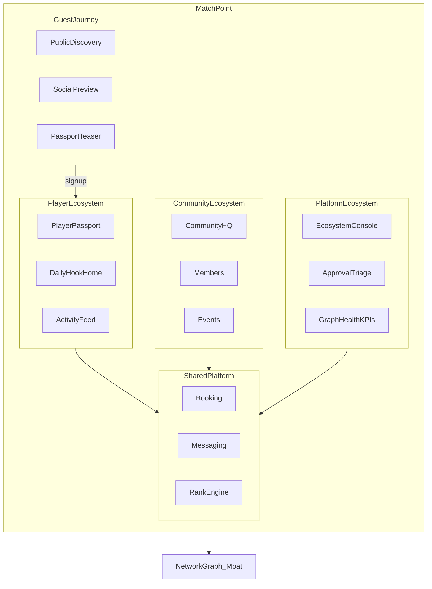

# Incorporate ChatGPT Strategic Review into Match Point

## Strategic north star (what changes)

**From:** Cross-community player reputation platform with feature-oriented navigation (Home · Rank · Play · Events · Community), treating Guest and Platform Admin as secondary paths.

**To:** A **four-journey operating system** where every actor has a purpose-built home that reinforces the network graph:

| Journey       | Actor                   | Core question                                 | Primary home               |
| ------------- | ----------------------- | --------------------------------------------- | -------------------------- |
| **Guest**     | Unauthenticated browser | _"Why should I join Match Point?"_            | Discovery Pulse (public)   |
| **Player**    | Authenticated member    | _"Why would I open this every day?"_          | Daily Hook Home            |
| **Community** | Club / organizer admin  | _"How do I run and grow my community?"_       | Community HQ               |
| **Platform**  | Match Point superadmin  | _"Is the ecosystem healthy and trustworthy?"_ | Ecosystem Operator Console |

**Positioning (recommended tagline hierarchy):**

| Layer               | Copy                                                                                            |
| ------------------- | ----------------------------------------------------------------------------------------------- |
| **Primary**         | _The operating system for racket sports communities_                                            |
| **Secondary**       | _Where players and communities build their entire sporting life_                                |
| **Technical wedge** | Portable MP Rating + Mabar/Global rank across 5 sports (retain UTR/DUPR/WPR complement framing) |

**Product philosophy — three questions every feature must answer:**

- **Guest:** _"Does this show enough value that I want an identity here?"_
- **Player:** _"How does this help me play, improve, and connect?"_
- **Community:** _"How does this help us organize, grow, and manage?"_
- **Platform:** _"Does this keep the graph healthy, fair, and growing?"_

**Competitive framing:** ILTL → **Competition module**; KUYY → **Discovery + Booking module**. Match Point's moat is the **connected graph**, not any single module.



---

## Current state vs review (honest gap map)

| Review theme       | Already strong                                 | Missing — all four journeys                                                    |
| ------------------ | ---------------------------------------------- | ------------------------------------------------------------------------------ |
| 5-sport identity   | `sport.js`, `rank.js`, home sport cards        | Unified **Player Passport**; guest **passport teaser**                         |
| Competition / rank | MP Rating, Mabar/Global, BoC, Sparring         | Daily **rating delta** on player home                                          |
| Community ops      | Event wizard → reg → live → rank               | **Community HQ** beyond event ops                                              |
| Daily hook         | State-driven CTAs per auth state               | Personalized **alive home** (player); **discovery pulse** (guest)              |
| Social             | Community feed (gated), endorsements           | Full social layer + **guest read-only preview**                                |
| **Guest**          | Explore-first banner, browse communities       | No public pulse, no social preview, no passport teaser, no conversion ladder   |
| **Platform admin** | Triage inbox, approvals, analytics, BoC wizard | No ecosystem health framing, no community pipeline, no social moderation queue |
| Personas           | 3 roles in flows                               | 8 personas with journey-specific dashboards                                    |
| Booking / payments | Deferred                                       | Court booking + wallet teasers                                                 |

---

## Phase 0 — Design system (ui-ux-pro-max, required before UI work)

**Skill workflow:** Follow [`ui-ux-pro-max`](file:///Users/mekari/.claude/plugins/cache/ui-ux-pro-max-skill/ui-ux-pro-max/2.6.2/.claude/skills/ui-ux-pro-max/SKILL.md) — design system first, page overrides second, UX checklist before delivery.

### 0.1 Generated artifacts (already created)

| File                                                                                                           | Purpose                                                                           |
| -------------------------------------------------------------------------------------------------------------- | --------------------------------------------------------------------------------- |
| [`design-system/match-point/MASTER.md`](design-system/match-point/MASTER.md)                                   | Global patterns — Community/Forum landing, SaaS mobile, density 7, motion 5       |
| [`design-system/match-point/pages/guest-home.md`](design-system/match-point/pages/guest-home.md)               | Horizontal scroll discovery, density 6, motion 4 — **overrides Master for guest** |
| [`design-system/match-point/pages/platform-overview.md`](design-system/match-point/pages/platform-overview.md) | Data-dense ops dashboard, density 8, motion 3 — **overrides Master for platform** |

**Still to create before building each screen:**

```bash
# Run before implementing each major screen (from repo root):
python3 ~/.claude/plugins/cache/ui-ux-pro-max-skill/ui-ux-pro-max/2.6.2/.claude/skills/ui-ux-pro-max/scripts/search.py \
  "social feed stories mobile" --design-system --persist -p "Match Point" --page "social-feed" -f markdown --density 7 --motion 5

python3 ... --page "home-dashboard" ...
python3 ... --page "community-hq" ...
python3 ... --page "player-passport" ...
```

### 0.2 Adapt to Match Point brand (do NOT replace wholesale)

ui-ux-pro-max suggested rose/blue palettes — **map principles to existing tokens** in [`styles.css`](docs/mockups/styles.css):

| ui-ux-pro-max role  | Match Point token                         | Notes                                          |
| ------------------- | ----------------------------------------- | ---------------------------------------------- |
| Primary CTA         | `--accent` / `--accent-bright`            | Court green — keep brand                       |
| Background          | `--surface` / `--surface-2`               | Warm off-white                                 |
| Foreground          | `--ink` / `--ink-muted`                   | Body hierarchy                                 |
| Sport accents       | `--sport-tennis` … `--sport-table-tennis` | Per-sport identity                             |
| Admin chrome        | `.admin-theme` + `--official`             | Platform console                               |
| Data / rank numbers | `--mono` (JetBrains Mono)                 | Tabular figures for KPIs                       |
| Typography          | `--font` (Outfit)                         | Already matches guest-home override suggestion |

**Anti-patterns from ui-ux-pro-max to enforce during redesign:**

- No emojis as structural nav/icons — use SVG (Lucide-style inline SVG or existing icon patterns)
- Touch targets ≥44×44px on all interactive elements
- Bottom nav ≤5 items with icon + label
- `prefers-reduced-motion` respected for pulse animations and story rings
- Skeleton placeholders for async-feeling sections (home pulse cards)
- One primary CTA per viewport section
- Guest must be able to skip any onboarding overlay — no forced linear tour

### 0.3 Component specs to add in `styles.css`

New semantic classes aligned with design dials (density 7):

- `.mp-pulse-card` — daily hook / discovery card (staggered fade-in, 200ms)
- `.mp-pulse-card--urgent` — countdown / deadline variant
- `.mp-passport-hero` — unified identity rollup
- `.mp-story-ring` — social stories rail
- `.mp-hq-module` — community admin module tile (bento grid)
- `.mp-platform-kpi` — dense KPI for ecosystem console
- `.mp-guest-teaser` — blurred/locked preview with CTA
- `.mp-feed-post` — shared social post renderer (member + guest preview modes)

### 0.4 Pre-delivery checklist (run per screen batch)

From ui-ux-pro-max §Pre-Delivery — verify before marking any screen done:

- [ ] 375px + landscape tested; no horizontal scroll
- [ ] Contrast ≥4.5:1 on body text (light mode; admin-theme separately)
- [ ] Focus rings visible; `aria-label` on icon-only controls
- [ ] Fixed bottom nav reserves content padding (`--header-h` pattern)
- [ ] Reduced motion: pulse/stagger disabled when `prefers-reduced-motion: reduce`
- [ ] Tabular nums on countdowns, ratings, KPIs (`font-variant-numeric: tabular-nums`)

---

## Phase A — Strategic foundation (docs, parallel with mockups)

### A1. [`docs/architecture.md`](docs/architecture.md)

- Revise §1: four-journey OS positioning.
- Add **§3.3 Four-journey model** (Guest → Player → Community → Platform diagram above).
- Add **§3.4 Network effect loops** — feature must strengthen ≥1 loop.
- Add **§3.5 Personas** with primary dashboard per journey:
  - Guest (browser), Player, Community Member, Community Admin, Coach, Court Owner, Tournament Organizer, Sponsor, **Platform Admin**
- Add **§3.6 Guest conversion funnel**: Discover → Preview value → Sign up → Claim profile → Join community.
- Extend §17: social graph entities mockup-validated in Phase 0.

### A2. [`docs/mockups/global-readiness.html`](docs/mockups/global-readiness.html)

- OS positioning; four-journey framing.
- Competitive matrix (ILTL/KUYY as modules).
- Monetization table (community SaaS + player premium + platform ops).
- Roadmap reconciliation (Phase E below).

### A3. [`docs/mockups/about.html`](docs/mockups/about.html)

- Public vision: four journeys, Player Passport, 5-sport identity.
- Expand §roles: Guest + Platform Admin as first-class roles (not afterthoughts).

### A4. New [`docs/STRATEGY.md`](docs/STRATEGY.md)

- Executive digest of ChatGPT review + four-journey model.
- Brand boundary: racket sports under Match Point; defer broader "all community sports" to Phase 7+.

### A5. Archive stale plan

- Supersede [`docs/match-point-is-a-cross-community-player-reputation_plan (9).md`](<docs/match-point-is-a-cross-community-player-reputation_plan%20(9).md>).

### A6. Hub entry [`index.html`](docs/mockups/index.html)

- Update hub copy from "community-first" only → four journeys visible.
- Hub cards: Guest Preview · Player Journey · Community Admin · Platform Admin (already partially there — align copy with OS positioning).

---

## Phase B — Information architecture (four journeys)

### B1. Player nav (authenticated)

Current: Home · Rank · Play (+) · Events · Community.

**Proposed (goal-driven, ui-ux-pro-max nav §9):**

| Tab             | Purpose                          |
| --------------- | -------------------------------- |
| **Home**        | Daily hook — personalized pulse  |
| **Play**        | Matches, book courts, open games |
| **Social**      | Feed, stories, messages          |
| **Rank**        | Passport entry + leaderboards    |
| **Communities** | My communities + discovery       |

FAB (+): Log match · Create event · Book court.

### B2. Guest nav (unauthenticated) — NEW

Guests browse the **same app shell** but with soft gates. Max 4 bottom tabs + login CTA:

| Tab         | Purpose                                                                  | Gate                      |
| ----------- | ------------------------------------------------------------------------ | ------------------------- |
| **Explore** | Discovery pulse — trending communities, live events, public leaderboards | Open                      |
| **Play**    | Open games + events near you (preview)                                   | RSVP requires login       |
| **Social**  | Read-only feed preview — highlights, community posts                     | Like/comment/post → login |
| **Rank**    | Public leaderboard + passport teaser ("Your 5-sport identity")           | Personal rank → login     |

Persistent top banner: _"Browsing as guest"_ + **Sign up** / **Log in** (existing `data-guest-login`).

**Conversion ladder (no forced tour — ui-ux-pro-max onboarding rule):**

1. See alive platform (discovery pulse)
2. Browse community / event / feed
3. Hit soft gate → register
4. Claim profile → join community → member daily hook unlocks

### B3. Community admin IA

[`flow/club.html`](docs/mockups/flow/club.html) step 0 → **Community HQ** module grid (see Phase C4). Unchanged from prior plan but styled per `community-hq` page override (bento grid, density 7).

### B4. Platform admin IA — NEW

[`flow/platform.html`](docs/mockups/flow/platform.html) reframed as **Ecosystem Operator Console**, not a separate product.

**Proposed platform nav (sidebar on desktop, top tabs on mobile):**

| Module                | Purpose                                                                | Existing screens                  |
| --------------------- | ---------------------------------------------------------------------- | --------------------------------- |
| **Overview**          | Graph health KPIs — players, communities, DAU, matches, content volume | Step 1 overview (redesign)        |
| **Triage**            | Approval inbox + dispute queue — SLA-sorted                            | Steps 2–4 inbox/detail            |
| **Communities**       | Onboarding pipeline — pending, approved, rejected, growth              | New `platform-community-pipeline` |
| **Competition**       | Global tournaments + BoC seasons                                       | Steps 7–18 wizards                |
| **Trust & Safety**    | GPS disputes, sandbagging flags, fair-play audit                       | Existing match queue              |
| **Social Moderation** | Reported posts, spam, community feed flags                             | New `platform-moderation-inbox`   |
| **Analytics**         | Lifecycle, sport mix, rank activity                                    | `platform-analytics`              |
| **Settings**          | Platform config, admin profile                                         | `platform-settings`               |

**Platform admin core question:** _"Is the ecosystem healthy, fair, and growing?"_ — align KPIs with ChatGPT review graph metrics (communities → players → matches → content → ratings).

### B5. Workspace switcher (player + community admin)

- `activeCommunityId` in `role.js` / localStorage.
- Header chip for multi-community players and community admins.

---

## Phase C — Mockup screens

All screens: [`MOCKUP-SYNC-RULE.md`](docs/mockups/MOCKUP-SYNC-RULE.md) — gallery twin + flow step. Read page override from `design-system/match-point/pages/[name].md` before building.

### C0. Guest journey redesign — NEW

**Files:** `home-dashboard-guest` (gallery derived), `flow/user.html` guest state (`data-guest-only`), new `guest-pulse.js`.

**Discovery Pulse Home (guest)** — parallel to player daily hook but **public/discovery-driven**:

```
Welcome to Match Point
├── Live platform strip (523 communities · 2.4k playing today)
├── Trending communities near you (horizontal scroll — guest-home pattern)
├── Open events this weekend (preview cards)
├── Public leaderboard snapshot (Top 5 Global — existing, enhanced)
├── Social highlights rail (read-only — 3 posts, "Join to see more")
├── Passport teaser card (blurred 5-sport identity mock — "Claim yours")
├── How it works (3 steps: Join → Play → Build identity)
└── CTA: Find community · Sign up free
```

**Soft gates:** Interactive elements that need auth show inline prompt (not modal wall). `data-requires-auth` pattern extended to social actions.

**Design notes:** Update `gallery-design-notes-data.js` `home-dashboard-guest` journey with conversion ladder rationale.

### C1. Player daily hook home (authenticated)

Same as prior plan — personalized pulse via `home-pulse.js`. Rank story card moves to Rank tab.

### C2. Player Passport

Same as prior plan — `player-passport` screen + `passport.js`.

### C3. Social layer (full mockup + guest preview)

| Screen ID            | Modes                      | Content                                                         |
| -------------------- | -------------------------- | --------------------------------------------------------------- |
| `social-feed`        | member + **guest preview** | Posts, highlights; guest sees read-only + login CTA on interact |
| `social-stories`     | member + guest preview     | Story rings; guest can view public stories only                 |
| `social-post-detail` | member                     | Comments, likes                                                 |
| `social-compose`     | member only                | Photo, match result, poll                                       |
| `messages-inbox`     | member only                | Conversations                                                   |
| `messages-thread`    | member only                | DM thread                                                       |
| `friends-list`       | member                     | Followers, suggested                                            |
| `player-highlights`  | member + public profile    | Match photos                                                    |

Shared renderer: `social-feed.js` with `mode: 'member' | 'guest'`.

### C4. Community HQ

Same as prior plan — module grid on `club-admin-dashboard`.

### C5. Community types taxonomy

Same as prior plan — extend `community-data.js`.

### C6. Booking teaser

Same as prior plan — `court-booking`, `booking-confirm`.

### C7. Achievements

Same as prior plan — `achievements.js`.

### C8. Platform Ecosystem Console — NEW

**Files:** `flow/platform.html` steps 0–1 (login + overview), `platform-analytics.js`, gallery `platform-*` screens.

**Redesign platform overview (step 1):**

```
Ecosystem Health — last 24h
├── Graph KPIs: Players · Communities · Matches · Posts · DAU · Dispute rate
├── Network loop status (mini sparklines per loop from review)
├── Triage queue (top 3 SLA items — existing triage-card, elevated)
├── Community pipeline: Pending 12 · Approved 4 · Rejected 1
├── Social moderation: 3 flagged posts (new)
├── Sport activity mix (existing analytics charts, surfaced on overview)
└── Quick actions: Review inbox · Create Global Tournament · BoC season
```

**New screens:**

| Screen ID                     | Purpose                                                         |
| ----------------------------- | --------------------------------------------------------------- |
| `platform-community-pipeline` | Community onboarding funnel with stage filters                  |
| `platform-moderation-inbox`   | Social content reports queue (feeds from `social-feed.js` seed) |
| `platform-graph-health`       | Optional drill-down for network loop metrics                    |

**Login hook copy update:** From "dispute lintas komunitas" only → _"Operate the racket sports ecosystem — trust, growth, and fair play."_

---

## Phase D — Shared JS architecture

| Module                  | Responsibility                                                               |
| ----------------------- | ---------------------------------------------------------------------------- |
| `guest-pulse.js`        | **NEW** — discovery cards for guest home; public stats, trending communities |
| `home-pulse.js`         | Authenticated daily hook cards                                               |
| `passport.js`           | Identity rollup + guest teaser variant                                       |
| `social-graph.js`       | Friends, follows, suggested                                                  |
| `social-feed.js`        | Posts, stories, comments; `mode: member \| guest`                            |
| `achievements.js`       | Trophies                                                                     |
| `community-hq.js`       | HQ module grid KPIs                                                          |
| `booking-mock.js`       | Court availability demo                                                      |
| `platform-ecosystem.js` | **NEW** — graph health KPIs, pipeline counts, moderation queue seed          |

---

## Phase E — Revised product roadmap

| Phase                   | Focus                        | Mockup deliverables                                                                             |
| ----------------------- | ---------------------------- | ----------------------------------------------------------------------------------------------- |
| **0** (now)             | Vision-aligned prototype     | Four journeys: guest discovery, player daily hook, community HQ, platform console + full social |
| **1** MVP ID            | Core loop ships              | Auth, communities, match submit, rank, events                                                   |
| **2** Monetize          | Community Pro + payments     | Wallet, membership billing                                                                      |
| **3** Competition       | Global rank, BoC, Sparring   | Productionize existing mocks                                                                    |
| **4** Booking           | KUYY-class module            | Court inventory                                                                                 |
| **5** Social production | Feed, follows, push backend  | Mockups done in Phase 0                                                                         |
| **6** Marketplaces      | Coach, court, equipment      | HQ placeholders → screens                                                                       |
| **7** AI / expansion    | Smart matchmaking, wearables | Optional concept screens                                                                        |

---

## Phase F — Design notes, i18n, verification

- [`i18n.js`](docs/mockups/i18n.js): ~120–150 new keys covering guest conversion, social, passport, HQ, platform ecosystem.
- [`gallery-design-notes-data.js`](docs/mockups/gallery-design-notes-data.js): design intent per new screen + ui-ux-pro-max rationale references.
- [`gallery-design-notes-screens.js`](docs/mockups/gallery-design-notes-screens.js): platform + guest screen notes.
- [`MOCKUP-SYNC.md`](docs/mockups/MOCKUP-SYNC.md): add all new screen IDs + guest/platform journey notes.
- Verification:
  ```bash
  node docs/mockups/scripts/verify-gallery.js
  node docs/mockups/scripts/build-gallery-screens.js
  ```

---

## Phase H — Mockup Gallery overhaul (prototype.html)

**Yes — the gallery is a mandatory deliverable**, not a side effect. Stakeholders review via [`prototype.html`](docs/mockups/prototype.html) (left nav + `#screen-id` + design notes panel, as in your screenshot). Every redesigned screen must exist in **both** the gallery and interactive flows per [`MOCKUP-SYNC-RULE.md`](docs/mockups/MOCKUP-SYNC-RULE.md).

### H1. Gallery vs interactive — division of labour

| Surface         | Entry                                          | What changes in redesign                                                     |
| --------------- | ---------------------------------------------- | ---------------------------------------------------------------------------- |
| **Gallery**     | `prototype.html#screen-id`                     | Static screen review, left nav browse, design notes + callouts               |
| **Interactive** | `flow/user.html`, `club.html`, `platform.html` | Clickable step journeys, bottom nav, role state                              |
| **Extract**     | `gallery-screens-extracted.html`               | Auto-derived guest dashboard from flow — rebuild after `flow/*.html` changes |

**Rule:** Edit gallery markup in `prototype.html` for gallery-only screens; edit `flow/*.html` first for dual-maintained screens, then run `build-gallery-screens.js` where applicable. Never ship flow-only changes without a gallery twin.

### H2. Left nav restructure (four journey groups)

Current nav (screenshot): one large **PLAYER JOURNEY** block, tiny **GUEST PREVIEW** (1 screen), **CLUB ADMIN**, **PLATFORM ADMIN**.

**Proposed gallery nav** — mirrors four-journey OS:

```
GUEST JOURNEY                    ← expand from 1 → ~6 screens
  auth-login (browse-first CTA)  ← update copy/hook per OS positioning
  home-dashboard-guest           ← discovery pulse redesign
  social-feed-guest              ← NEW read-only preview
  passport-teaser-guest          ← NEW blurred identity teaser
  find-community                 ← shared, linked from guest group
  leaderboard-official           ← public rank preview

PLAYER JOURNEY                   ← reorganize sub-sections
  Auth: register, verify-otp
  Home: home-dashboard           ← daily hook redesign
  Identity: player-passport, profile, edit-profile, share-card, player-other
  Social: social-feed, social-stories, messages-inbox, friends-list, player-highlights  ← NEW
  Play: events-feed, court-booking, booking-confirm, submit-match, my-matches  ← booking NEW
  Rank: leaderboard, leaderboard-snapshot, endorsement, player-performance
  Communities: communities, find-community, community-detail, community-create
  … (existing event/format/tournament screens unchanged)

COMMUNITY ADMIN                  ← rename label "CLUB ADMIN" → "COMMUNITY ADMIN"
  club-admin-dashboard           ← Community HQ redesign
  … (existing wizard/reg/live screens)

PLATFORM ADMIN                   ← add new screens
  platform-login
  platform-overview              ← ecosystem console redesign (may reuse step 1 markup)
  platform-community-pipeline    ← NEW
  platform-moderation-inbox      ← NEW
  … (existing inbox/analytics/BoC screens)

SHARED / EDGE                    ← unchanged
```

Sub-section labels inside PLAYER JOURNEY are visual only (`nav-subgroup-label` class) — no behaviour change to `app.js`.

### H3. Files to touch for every gallery change

| File                                                                              | Gallery role                                                                            |
| --------------------------------------------------------------------------------- | --------------------------------------------------------------------------------------- |
| [`prototype.html`](docs/mockups/prototype.html)                                   | `id="screen-{name}"` markup + left nav `data-screen` links                              |
| [`app.js`](docs/mockups/app.js)                                                   | `screenIds` array — **verify-gallery.js fails if nav lists a screen not in this array** |
| [`gallery-design-notes-data.js`](docs/mockups/gallery-design-notes-data.js)       | Purpose / components / rules for design notes panel (right sidebar in screenshot)       |
| [`gallery-design-notes-screens.js`](docs/mockups/gallery-design-notes-screens.js) | Extended notes for complex screens (HQ, platform console, social)                       |
| [`gallery-chrome.js`](docs/mockups/gallery-chrome.js)                             | Toolbar title, callouts toggle — update if screen titles change                         |
| [`gallery-hydrate.js`](docs/mockups/gallery-hydrate.js)                           | Wire new `data-*` hooks on gallery screen show                                          |
| [`i18n.js`](docs/mockups/i18n.js)                                                 | `nav.*` keys for new nav labels                                                         |
| [`styles.css`](docs/mockups/styles.css)                                           | Gallery shell + new component classes                                                   |

### H4. Screens requiring gallery markup updates

**Redesign in place** (existing `screen-*` IDs, new layout):

- `auth-login` — update left hook to OS positioning ("operating system for racket sports communities"); keep browse-first CTA
- `home-dashboard` — daily hook pulse
- `home-dashboard-guest` — discovery pulse (also in extracted HTML)
- `club-admin-dashboard` — Community HQ grid
- `platform-login` + platform overview screen — ecosystem console
- `community-detail` — type badge, feed uses shared `social-feed.js` renderer

**New gallery screens** (add to `prototype.html` + `app.js` screenIds + nav):

- `player-passport`
- `social-feed`, `social-feed-guest`, `social-stories`, `social-post-detail`, `social-compose`
- `messages-inbox`, `messages-thread`, `friends-list`, `player-highlights`
- `passport-teaser-guest`
- `court-booking`, `booking-confirm`
- `platform-community-pipeline`, `platform-moderation-inbox`, `platform-graph-health` (optional)

### H5. Auth / login screen (your screenshot)

The current login split layout is strong — **evolve, don't replace**:

- Left panel: shift hook from rank-only → **OS + identity** ("Where your racket sports life lives")
- Keep stats strip (10,842 players · 523 communities) — aligns with guest discovery pulse
- Keep "Browse inside first" CTA — core guest conversion pattern
- Right panel: unchanged auth methods; add subtle link to guest discovery home

### H6. Gallery verification workflow (per batch)

After each screen batch lands:

```bash
node docs/mockups/scripts/verify-gallery.js   # screenIds ↔ prototype.html IDs ↔ nav links
node docs/mockups/scripts/build-gallery-screens.js   # if flow/*.html changed
```

`verify-gallery.js` checks: every `screenIds` entry has matching `id="screen-*"` in HTML; nav links resolve; design notes anchors exist where configured.

### H7. What gallery does NOT need

- Bottom nav chrome (gallery uses left nav only — `flow.js` owns interactive bottom nav)
- Full click-through between screens (disclaimer already warns: use Interactive Flow for journeys)
- Real auth state — gallery uses static demo; guest vs member states are **separate screen IDs** (`home-dashboard` vs `home-dashboard-guest`)

---

## Phase G — Feature acceptance checklist

Score every feature against network loops **and** journey fit:

| Loop                  | Guest        | Player   | Community      | Platform   |
| --------------------- | ------------ | -------- | -------------- | ---------- |
| community → players   | ✓ discovery  | ✓ join   | ✓ grow members | ✓ pipeline |
| players → content     | preview only | ✓ create | ✓ broadcast    | moderate   |
| content → discovery   | ✓ preview    | ✓        | ✓              | monitor    |
| matches → ratings     | —            | ✓        | ✓ host         | ✓ audit    |
| conversion → identity | ✓ primary    | ✓        | import members | —          |

If a feature scores zero across all columns → defer.

---

## Implementation order (updated)

```mermaid
gantt
  title Four_journey_incorporation
  dateFormat X
  axisFormat %s
  section DesignSystem
  adapt_MASTER_page_overrides   :ds1, 0, 2
  section Docs
  STRATEGY_four_journey         :a1, 1, 3
  section Guest
  guest_pulse_redesign          :g1, 2, 5
  guest_social_preview          :g2, 4, 7
  section Player
  home_pulse_passport           :p1, 3, 7
  nav_IA_player_guest           :p2, 4, 6
  section Social
  social_full_mockup            :s1, 5, 9
  section Community
  community_HQ                  :c1, 6, 9
  section Platform
  ecosystem_console             :pl1, 5, 9
  moderation_pipeline           :pl2, 7, 10
  section Responsive
  device_true_css_all_screens   :r1, 3, 11
  section Polish
  booking_achievements_verify   :e1, 9, 12
```



**Week 1:** Design system adapt (0) + docs (A) + guest pulse (C0) + responsive base classes (I5) in parallel.
**Week 2:** Player home pulse (C1) + nav IA (B1–B2) + platform overview (C8) — verify mobile/tablet/web each.
**Week 3:** Social full mockup (C3) with guest preview + messages master-detail layouts.
**Week 4:** Community HQ (C4) + platform pipeline (C8) + gallery overhaul (H) + device matrix QA (I7).

---

## Risks and guardrails

| Risk                                  | Mitigation                                                                                     |
| ------------------------------------- | ---------------------------------------------------------------------------------------------- |
| Four journeys = 4× scope              | Shared renderers (`social-feed.js` guest mode); placeholder HQ/platform sub-screens            |
| ui-ux-pro-max palette clash           | Map to existing `--accent` / sport tokens; use page overrides for density/motion only          |
| Guest vs member nav confusion         | Distinct guest bottom nav labels; persistent guest banner; design notes                        |
| Platform admin overload               | Ecosystem overview as hub; deep screens unchanged, reframed as modules                         |
| Gallery ↔ flow drift                  | MOCKUP-SYNC checklist every batch; `build-gallery-screens.js` after flow changes               |
| Emoji icons in new UI                 | ui-ux-pro-max rule: SVG only for nav/structural icons (mascots OK as brand)                    |
| Responsive regressions on new screens | Mobile-first CSS + `body.mp-device-*` modifiers; device toggle QA matrix (I7) per screen batch |
| 5-tab nav truncation on small phones  | Short i18n nav labels; icon + label on bottom nav; test at 375px width                         |

---

## Success criteria (prototype complete)

**Guest**

- [`flow/user.html`](docs/mockups/flow/user.html) in guest state answers _"Why should I join?"_ via discovery pulse without requiring login.
- Social and passport teasers convert with clear soft gates (not hard walls).

**Player**

- Authenticated home answers _"Why would I open every day?"_ via personalized pulse.
- Player Passport shows 5-sport identity in one glance.

**Community**

- Club admin lands on Community HQ module grid, not only event ops overlay.

**Platform**

- Platform overview shows ecosystem graph health, not only dispute triage.
- Community pipeline and social moderation queues visible as first-class modules.

**Gallery (prototype.html)**

- Left nav reflects four journeys with all new screens browsable via `#screen-id`.
- Design notes panel populated for every new/redesigned screen (Purpose, Components, Rules).
- `auth-login` hook updated to OS positioning; guest screens expanded beyond single `home-dashboard-guest`.
- `verify-gallery.js` passes (screenIds, nav links, HTML IDs all aligned).

**Cross-cutting**

- Strategic docs describe four journeys consistently.
- ui-ux-pro-max pre-delivery checklist passed on all new screens.
- Gallery ↔ interactive twins stay aligned per MOCKUP-SYNC.md.

**Responsive (mobile · tablet · web)**

- Every new screen verified in gallery device toggle: Mobile (400px frame, bottom nav) · Tablet (820px, top nav) · Web (full, top nav, max 1100px).
- No horizontal page scroll at 375px; bottom nav does not clip content on mobile.
- Messages, HQ, and platform consoles use correct column layouts per device tier.
